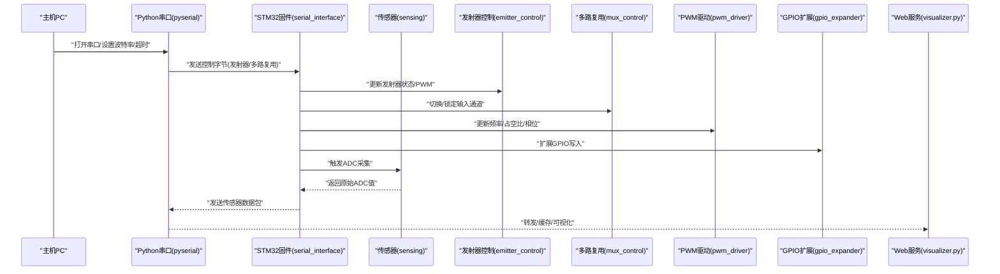
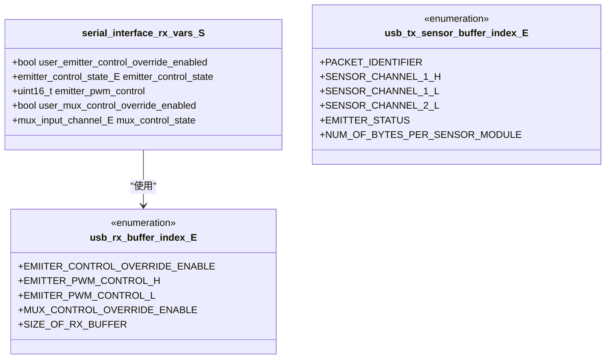
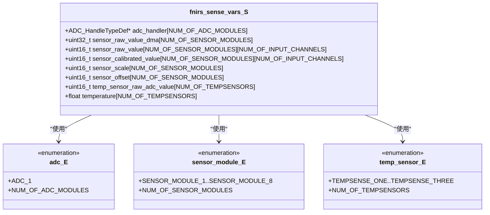
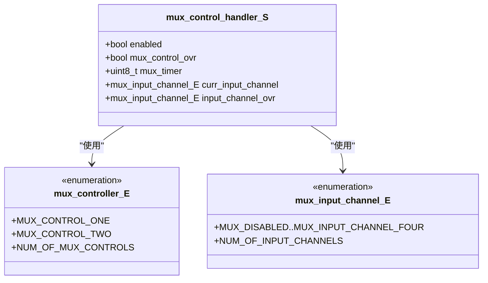
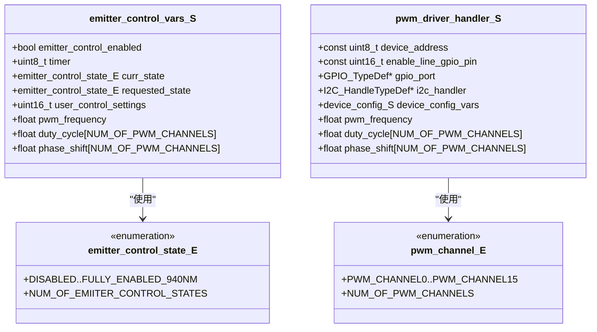
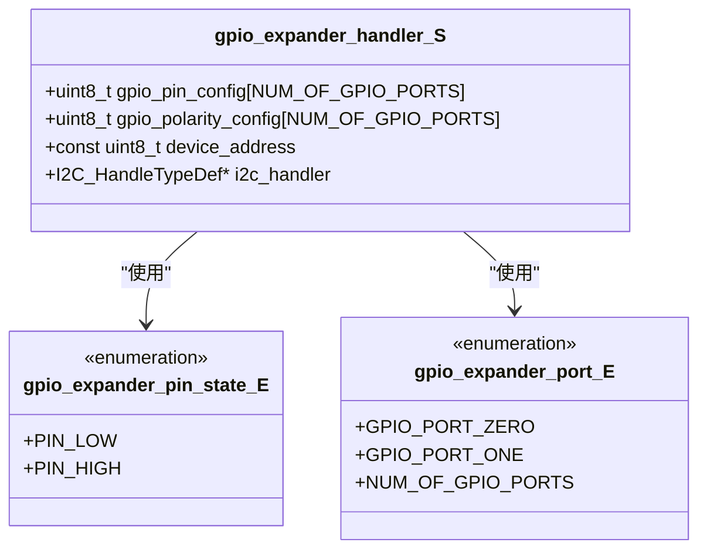
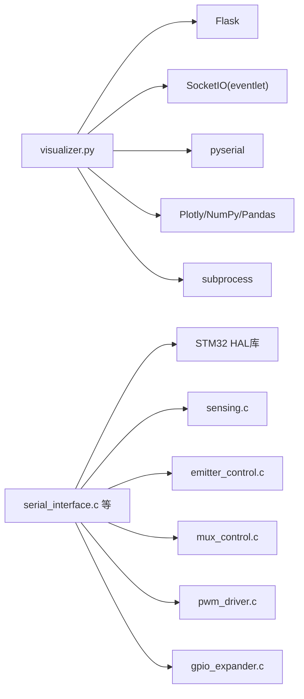

# API参考

<cite>
**本文引用的文件**
- [README.md](file://README.md)
- [software/README.md](file://software/README.md)
- [firmware/README.md](file://firmware/README.md)
- [hardware/README.md](file://hardware/README.md)
- [firmware/STM32/fNIRS/Core/Inc/serial_interface.h](file://firmware/STM32/fNIRS/Core/Inc/serial_interface.h)
- [firmware/STM32/fNIRS/Core/Inc/sensing.h](file://firmware/STM32/fNIRS/Core/Inc/sensing.h)
- [firmware/STM32/fNIRS/Core/Inc/mux_control.h](file://firmware/STM32/fNIRS/Core/Inc/mux_control.h)
- [firmware/STM32/fNIRS/Core/Inc/emitter_control.h](file://firmware/STM32/fNIRS/Core/Inc/emitter_control.h)
- [firmware/STM32/fNIRS/Core/Inc/pwm_driver.h](file://firmware/STM32/fNIRS/Core/Inc/pwm_driver.h)
- [firmware/STM32/fNIRS/Core/Inc/gpio_expander.h](file://firmware/STM32/fNIRS/Core/Inc/gpio_expander.h)
- [software/config.py](file://software/config.py)
- [software/visualizer.py](file://software/visualizer.py)
- [software/index.html](file://software/index.html)
- [software/adc_client.py](file://software/adc_client.py)
- [software/mBLL_animation.py](file://software/mBLL_animation.py)
- [software/fNIRS_processing.py](file://software/fNIRS_processing.py)
- [software/adc_mock_server.py](file://software/adc_mock_server.py)
- [software/mBLL_server.py](file://software/mBLL_server.py)
</cite>

## 目录
1. [简介](#简介)
2. [项目结构](#项目结构)
3. [核心组件](#核心组件)
4. [架构总览](#架构总览)
5. [详细组件分析](#详细组件分析)
6. [依赖关系分析](#依赖关系分析)
7. [性能考量](#性能考量)
8. [故障排查指南](#故障排查指南)
9. [结论](#结论)
10. [附录](#附录)

## 简介
本文件为fNIRS系统的API参考文档，覆盖以下方面：
- Python API：Flask/Socket.IO Web服务端与客户端接口、数据流、事件与控制端点
- C API（固件侧）：串口通信协议、传感器采集与处理、发射器/多路复用控制、PWM驱动与GPIO扩展
- WebSocket API：Socket.IO事件、消息格式、实时交互模式
- 串行通信接口：数据帧格式、协议规范、状态管理
- Socket.IO API：事件处理、数据传输、错误处理机制
- 集成指南与最佳实践：第三方开发者如何接入系统

本项目目标是提供低成本、可穿戴的近红外光谱脑接口系统，支持实时监测与离线处理，并通过Web界面进行可视化与交互。

章节来源
- [README.md:1-19](file://README.md#L1-L19)

## 项目结构
软件侧采用Flask + Socket.IO作为Web服务与实时通信框架，结合Python脚本完成ADC原始数据采集、处理与可视化；固件侧基于STM32微控制器，实现传感器通道采样、发射器PWM控制、多路复用切换与串口数据打包发送。

```mermaid
graph TB
subgraph "软件层"
V["visualizer.py<br/>Flask/Socket.IO 服务器"]
UI["index.html<br/>Web界面"]
ADC["adc_client.py<br/>ADC实时客户端"]
MBLL["mBLL_animation.py<br/>mBLL动画客户端"]
PROC["fNIRS_processing.py<br/>离线处理"]
MOCK_ADC["adc_mock_server.py<br/>ADC模拟服务"]
MOCK_MBLL["mBLL_server.py<br/>mBLL处理与推送"]
end
subgraph "硬件层"
FW["STM32 固件<br/>serial_interface.c 等"]
SENS["sensing.c<br/>传感器采集"]
EMIT["emitter_control.c<br/>发射器控制"]
MUX["mux_control.c<br/>多路复用控制"]
PWM["pwm_driver.c<br/>PWM驱动"]
IOEXP["gpio_expander.c<br/>GPIO扩展"]
end
UI --> V
ADC --> V
MBLL --> V
V --> |"串口"/"Socket.IO"| FW
PROC --> |"处理后通过Socket.IO"| V
MOCK_ADC --> |"演示模式"| V
MOCK_MBLL --> |"演示模式"| V
FW --> SENS
FW --> EMIT
FW --> MUX
FW --> PWM
FW --> IOEXP
```

图表来源
- [software/visualizer.py:54-56](file://software/visualizer.py#L54-L56)
- [firmware/STM32/fNIRS/Core/Inc/serial_interface.h:55-61](file://firmware/STM32/fNIRS/Core/Inc/serial_interface.h#L55-L61)
- [firmware/STM32/fNIRS/Core/Inc/sensing.h:64-68](file://firmware/STM32/fNIRS/Core/Inc/sensing.h#L64-L68)
- [firmware/STM32/fNIRS/Core/Inc/emitter_control.h:41-48](file://firmware/STM32/fNIRS/Core/Inc/emitter_control.h#L41-L48)
- [firmware/STM32/fNIRS/Core/Inc/mux_control.h:43-49](file://firmware/STM32/fNIRS/Core/Inc/mux_control.h#L43-L49)
- [firmware/STM32/fNIRS/Core/Inc/pwm_driver.h:66-73](file://firmware/STM32/fNIRS/Core/Inc/pwm_driver.h#L66-L73)
- [firmware/STM32/fNIRS/Core/Inc/gpio_expander.h:39-41](file://firmware/STM32/fNIRS/Core/Inc/gpio_expander.h#L39-L41)

章节来源
- [software/README.md:1-180](file://software/README.md#L1-L180)
- [firmware/README.md:1-17](file://firmware/README.md#L1-L17)
- [hardware/README.md:1-19](file://hardware/README.md#L1-L19)

## 核心组件
- Web服务与Socket.IO
  - 服务器：Flask + SocketIO（异步模式），提供路由、控制端点与实时事件推送
  - 客户端：浏览器端index.html + Python客户端（adc_client.py、mBLL_animation.py）
  - 演示模式：adc_mock_server.py、mBLL_server.py
- 串行通信
  - Python侧：pyserial配置串口参数，发送控制字节，接收传感器数据包
  - 固件侧：serial_interface模块解析上位机指令，更新发射器/多路复用状态，并打包传感器数据回传
- 数据处理
  - 实时：ADC原始数据流
  - 离线：fNIRS_processing.py执行交织、光学密度转换、MBLL/CBSI等处理
- 控制与状态
  - 发射器控制状态机、PWM参数、多路复用输入通道
  - 温度与原始ADC缓冲区管理

章节来源
- [software/visualizer.py:42-46](file://software/visualizer.py#L42-L46)
- [software/config.py:8-12](file://software/config.py#L8-L12)
- [firmware/STM32/fNIRS/Core/Inc/serial_interface.h:55-61](file://firmware/STM32/fNIRS/Core/Inc/serial_interface.h#L55-L61)
- [firmware/STM32/fNIRS/Core/Inc/sensing.h:64-68](file://firmware/STM32/fNIRS/Core/Inc/sensing.h#L64-L68)

## 架构总览
下图展示从固件到Web端的整体数据流与交互路径。



图表来源
- [software/visualizer.py:42-46](file://software/visualizer.py#L42-L46)
- [firmware/STM32/fNIRS/Core/Inc/serial_interface.h:55-61](file://firmware/STM32/fNIRS/Core/Inc/serial_interface.h#L55-L61)
- [firmware/STM32/fNIRS/Core/Inc/sensing.h:64-68](file://firmware/STM32/fNIRS/Core/Inc/sensing.h#L64-L68)
- [firmware/STM32/fNIRS/Core/Inc/emitter_control.h:41-48](file://firmware/STM32/fNIRS/Core/Inc/emitter_control.h#L41-L48)
- [firmware/STM32/fNIRS/Core/Inc/mux_control.h:43-49](file://firmware/STM32/fNIRS/Core/Inc/mux_control.h#L43-L49)
- [firmware/STM32/fNIRS/Core/Inc/pwm_driver.h:66-73](file://firmware/STM32/fNIRS/Core/Inc/pwm_driver.h#L66-L73)
- [firmware/STM32/fNIRS/Core/Inc/gpio_expander.h:39-41](file://firmware/STM32/fNIRS/Core/Inc/gpio_expander.h#L39-L41)

## 详细组件分析

### Python API（Flask/Socket.IO）
- 服务器初始化与异步模式
  - 使用Flask与SocketIO，启用CORS与eventlet异步模式
  - 全局变量：数据队列、锁、串口句柄、子进程列表、当前模式与源集合
- 路由与端点
  - GET /：返回Web页面
  - GET /update_graphs：返回当前脑模型JSON
  - GET /select_group/<int:group_id>：高亮指定传感器组
  - POST /update_emitter_states：更新发射器状态（JSON）
  - POST /update_control_data：更新发射器/多路复用控制（JSON），并写入串口（非演示模式）
  - POST /start_processing：启动ADC或记录并可视化流程（演示模式跳过实际处理）
  - POST /stop_processing：停止子进程并重置串口
  - GET /download/<source>：下载ADC或mBLL CSV文件
  - GET /view_static/ADC：生成静态ADC图表HTML
- Socket.IO事件
  - 上游客户端事件：connect、disconnect、processed_data（接收浓度数据，入队并触发图更新）
  - 本地事件：向浏览器推送“brain_mesh_update”
- 数据结构与处理
  - processed_data事件接收字典，包含“concentrations”字段，按组映射到24个传感器通道
  - 图形更新：根据hbo值计算区域高亮，发送brain_mesh_update事件

章节来源
- [software/visualizer.py:54-56](file://software/visualizer.py#L54-L56)
- [software/visualizer.py:69-98](file://software/visualizer.py#L69-L98)
- [software/visualizer.py:593-619](file://software/visualizer.py#L593-L619)
- [software/visualizer.py:630-646](file://software/visualizer.py#L630-L646)
- [software/visualizer.py:648-689](file://software/visualizer.py#L648-L689)
- [software/visualizer.py:692-713](file://software/visualizer.py#L692-L713)
- [software/visualizer.py:716-734](file://software/visualizer.py#L716-L734)
- [software/visualizer.py:737-800](file://software/visualizer.py#L737-L800)

### WebSocket API（Socket.IO）
- 连接协议
  - 客户端通过浏览器或Python客户端库连接服务器
  - 事件命名空间：默认
- 消息格式
  - processed_data：包含“concentrations”数组（长度为24或按批次扩展）
  - brain_mesh_update：包含Plotly图JSON
- 事件类型
  - 服务器端：connect、disconnect、processed_data
  - 客户端：connect、disconnect、processed_data
- 实时交互模式
  - ADC模式：实时接收原始ADC数据，用于动画或静态图表
  - mBLL模式：接收处理后的浓度数据，动态更新3D脑模型高亮区域

章节来源
- [software/visualizer.py:69-98](file://software/visualizer.py#L69-L98)
- [software/visualizer.py:559-561](file://software/visualizer.py#L559-L561)

### 串行通信接口（Python侧）
- 串口配置
  - 端口：来自配置文件
  - 波特率、超时：固定参数
- 发送控制
  - update_control_data端点将JSON映射为字节序列写入串口
  - 字节顺序与含义由固件侧解析逻辑决定
- 接收数据
  - 服务器在演示模式下使用mock服务，在正常模式下通过pyserial读取固件发送的数据包

章节来源
- [software/config.py:8-12](file://software/config.py#L8-L12)
- [software/visualizer.py:642-645](file://software/visualizer.py#L642-L645)
- [software/visualizer.py:42-46](file://software/visualizer.py#L42-L46)

### C API（固件侧）——串口通信与数据帧
- 数据结构
  - RX缓冲索引枚举：包含发射器控制、PWM控制、多路复用控制等字段
  - TX传感器数据包索引：标识数据包中各字段位置（通道高位/低位、发射器状态等）
  - 接收变量结构体：用户发射器控制开关、状态、PWM掩码；用户多路复用控制开关、当前通道
- 函数原型
  - 解析接收数据：解析上位机控制字节
  - 获取用户控制状态：发射器/多路复用的开关与状态
  - 发送传感器数据：打包并发送ADC采样结果



图表来源
- [firmware/STM32/fNIRS/Core/Inc/serial_interface.h:40-51](file://firmware/STM32/fNIRS/Core/Inc/serial_interface.h#L40-L51)
- [firmware/STM32/fNIRS/Core/Inc/serial_interface.h:12-24](file://firmware/STM32/fNIRS/Core/Inc/serial_interface.h#L12-L24)
- [firmware/STM32/fNIRS/Core/Inc/serial_interface.h:26-38](file://firmware/STM32/fNIRS/Core/Inc/serial_interface.h#L26-L38)

章节来源
- [firmware/STM32/fNIRS/Core/Inc/serial_interface.h:55-61](file://firmware/STM32/fNIRS/Core/Inc/serial_interface.h#L55-L61)

### C API（固件侧）——传感器采集与温度
- 数据结构
  - ADC模块、传感器模块、温度传感器枚举
  - 传感器状态结构体：ADC句柄、DMA标志与缓冲、原始/校准值、标定参数、温度原始值与换算温度
- 函数原型
  - 初始化：绑定ADC句柄
  - 查询：获取校准后的传感器值、温度读数
  - 更新：刷新所有温度与通道值



图表来源
- [firmware/STM32/fNIRS/Core/Inc/sensing.h:46-61](file://firmware/STM32/fNIRS/Core/Inc/sensing.h#L46-L61)
- [firmware/STM32/fNIRS/Core/Inc/sensing.h:13-34](file://firmware/STM32/fNIRS/Core/Inc/sensing.h#L13-L34)

章节来源
- [firmware/STM32/fNIRS/Core/Inc/sensing.h:64-68](file://firmware/STM32/fNIRS/Core/Inc/sensing.h#L64-L68)

### C API（固件侧）——多路复用控制
- 数据结构
  - 多路复用控制器枚举、输入通道枚举、控制处理器结构体（启用、覆盖、定时器、当前/覆盖通道）
- 函数原型
  - 初始化：绑定I2C句柄
  - 查询/控制：获取当前通道、使能/禁用扫描器、覆盖模式、设置覆盖通道



图表来源
- [firmware/STM32/fNIRS/Core/Inc/mux_control.h:32-40](file://firmware/STM32/fNIRS/Core/Inc/mux_control.h#L32-L40)
- [firmware/STM32/fNIRS/Core/Inc/mux_control.h:13-30](file://firmware/STM32/fNIRS/Core/Inc/mux_control.h#L13-L30)

章节来源
- [firmware/STM32/fNIRS/Core/Inc/mux_control.h:43-49](file://firmware/STM32/fNIRS/Core/Inc/mux_control.h#L43-L49)

### C API（固件侧）——发射器控制与PWM
- 数据结构
  - 发射器控制状态枚举、控制变量结构体（启用、计时器、当前/请求状态、用户设置、频率、占空比、相位）
  - PWM通道枚举、驱动器结构体（设备地址、使能引脚、I2C句柄、配置、频率、占空比、相位）
- 函数原型
  - 初始化：绑定I2C句柄
  - 状态查询/控制：是否激活、启用/禁用、请求工作模式、更新频率、更新单通道/全通道占空比与相位
  - 状态机：推进发射器状态



图表来源
- [firmware/STM32/fNIRS/Core/Inc/emitter_control.h:26-38](file://firmware/STM32/fNIRS/Core/Inc/emitter_control.h#L26-L38)
- [firmware/STM32/fNIRS/Core/Inc/pwm_driver.h:35-62](file://firmware/STM32/fNIRS/Core/Inc/pwm_driver.h#L35-L62)
- [firmware/STM32/fNIRS/Core/Inc/emitter_control.h:13-24](file://firmware/STM32/fNIRS/Core/Inc/emitter_control.h#L13-L24)
- [firmware/STM32/fNIRS/Core/Inc/pwm_driver.h:13-33](file://firmware/STM32/fNIRS/Core/Inc/pwm_driver.h#L13-L33)

章节来源
- [firmware/STM32/fNIRS/Core/Inc/emitter_control.h:41-48](file://firmware/STM32/fNIRS/Core/Inc/emitter_control.h#L41-L48)
- [firmware/STM32/fNIRS/Core/Inc/pwm_driver.h:66-73](file://firmware/STM32/fNIRS/Core/Inc/pwm_driver.h#L66-L73)

### C API（固件侧）——GPIO扩展
- 数据结构
  - 引脚状态枚举、GPIO端口枚举、扩展器结构体（引脚配置、极性、设备地址、I2C句柄）
- 函数原型
  - 配置：初始化扩展器
  - 写入：按端口/引脚写入高低电平



图表来源
- [firmware/STM32/fNIRS/Core/Inc/gpio_expander.h:26-35](file://firmware/STM32/fNIRS/Core/Inc/gpio_expander.h#L26-L35)
- [firmware/STM32/fNIRS/Core/Inc/gpio_expander.h:13-24](file://firmware/STM32/fNIRS/Core/Inc/gpio_expander.h#L13-L24)

章节来源
- [firmware/STM32/fNIRS/Core/Inc/gpio_expander.h:39-41](file://firmware/STM32/fNIRS/Core/Inc/gpio_expander.h#L39-L41)

### 数据处理与演示模式
- ADC模式
  - 实时动画：adc_client.py通过Socket.IO接收并显示ADC数据
  - 演示：adc_mock_server.py生成模拟数据
- mBLL模式
  - 实时动画：mBLL_animation.py显示处理后的浓度数据
  - 处理：fNIRS_processing.py执行交织、光学密度、MBLL/CBSI等
  - 演示：mBLL_server.py模拟处理并推送

章节来源
- [software/README.md:137-160](file://software/README.md#L137-L160)
- [software/README.md:159-160](file://software/README.md#L159-L160)
- [software/README.md:142-143](file://software/README.md#L142-L143)
- [software/README.md:153-154](file://software/README.md#L153-L154)

## 依赖关系分析
- 软件层依赖
  - Flask/SocketIO：Web服务与实时通信
  - pyserial：串口通信
  - Plotly/NumPy/Pandas/NiBabel：数据可视化与处理
  - 子进程：调用处理脚本与演示服务
- 固件层依赖
  - HAL库：ADC、I2C、TIM、GPIO等外设抽象
  - 自定义模块：serial_interface、sensing、emitter_control、mux_control、pwm_driver、gpio_expander



图表来源
- [software/visualizer.py:21-34](file://software/visualizer.py#L21-L34)
- [firmware/STM32/fNIRS/Core/Inc/serial_interface.h:6-8](file://firmware/STM32/fNIRS/Core/Inc/serial_interface.h#L6-L8)

章节来源
- [software/visualizer.py:21-34](file://software/visualizer.py#L21-L34)
- [firmware/STM32/fNIRS/Core/Inc/serial_interface.h:6-8](file://firmware/STM32/fNIRS/Core/Inc/serial_interface.h#L6-L8)

## 性能考量
- 异步与并发
  - 使用eventlet异步模式提升Socket.IO吞吐能力
  - 串口读取与数据处理分离，避免阻塞UI
- 缓冲与队列
  - 使用队列限制历史数据长度，避免内存膨胀
  - 锁保护共享资源，保证线程安全
- I/O与带宽
  - 合理设置串口波特率与超时，平衡实时性与稳定性
  - 批量数据包发送，减少协议开销
- 可视化
  - 静态图表与实时动画分离，降低渲染压力
  - 3D脑模型高亮按需更新，避免频繁重绘

## 故障排查指南
- 串口无法打开
  - 检查端口路径与权限；确认设备已连接且未被占用
  - 校验波特率与超时设置
- 数据不更新
  - 确认演示模式与真实模式选择正确
  - 检查子进程是否正常运行与退出信号
- Socket.IO连接失败
  - 检查CORS配置与跨域策略
  - 查看connect/disconnect事件日志
- 数据包格式异常
  - 对照RX/TX缓冲索引枚举，核对发送/解析顺序
  - 校验发射器/多路复用控制字节与状态机推进

章节来源
- [software/config.py:8-12](file://software/config.py#L8-L12)
- [software/visualizer.py:69-81](file://software/visualizer.py#L69-L81)
- [firmware/STM32/fNIRS/Core/Inc/serial_interface.h:12-38](file://firmware/STM32/fNIRS/Core/Inc/serial_interface.h#L12-L38)

## 结论
本API参考文档梳理了从固件到Web端的完整数据通路与接口契约，明确了Python与C两套API的职责边界、消息格式与交互流程。第三方开发者可据此快速集成串口控制、实时数据订阅与离线处理能力，并在演示模式下验证系统功能。

## 附录
- 快速开始
  - 安装依赖、配置串口、启动Web服务与演示/真实模式
- 最佳实践
  - 使用队列与锁保障线程安全
  - 合理拆分实时与离线任务
  - 明确事件命名与消息结构，便于扩展

章节来源
- [software/README.md:50-100](file://software/README.md#L50-L100)