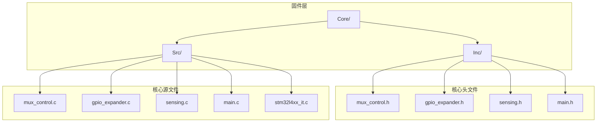
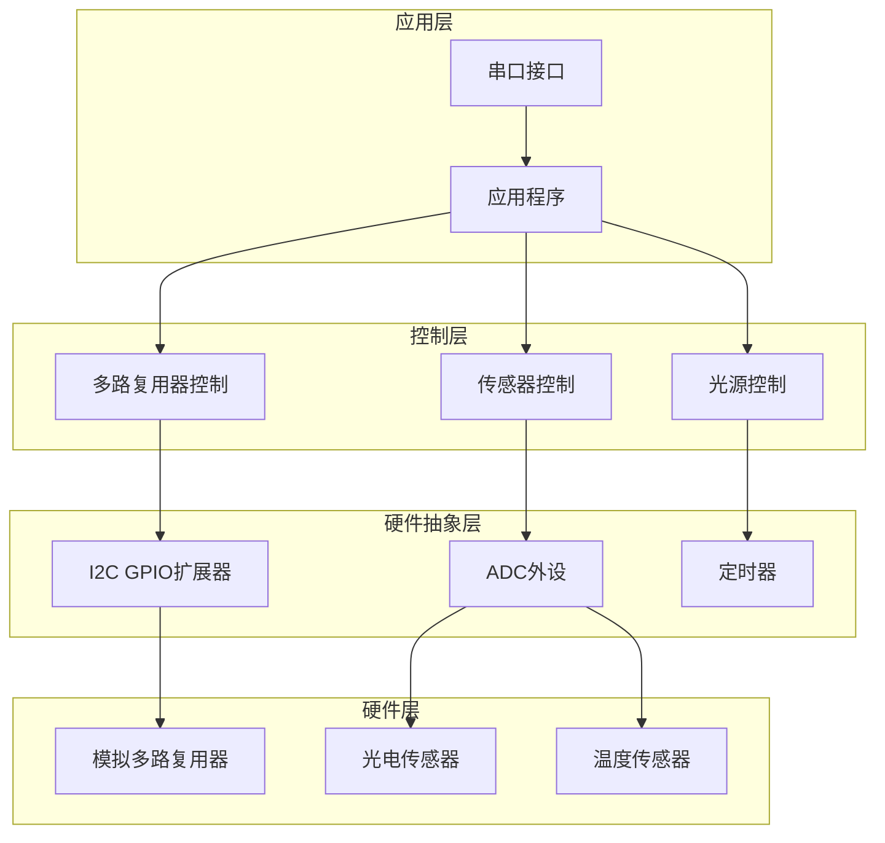
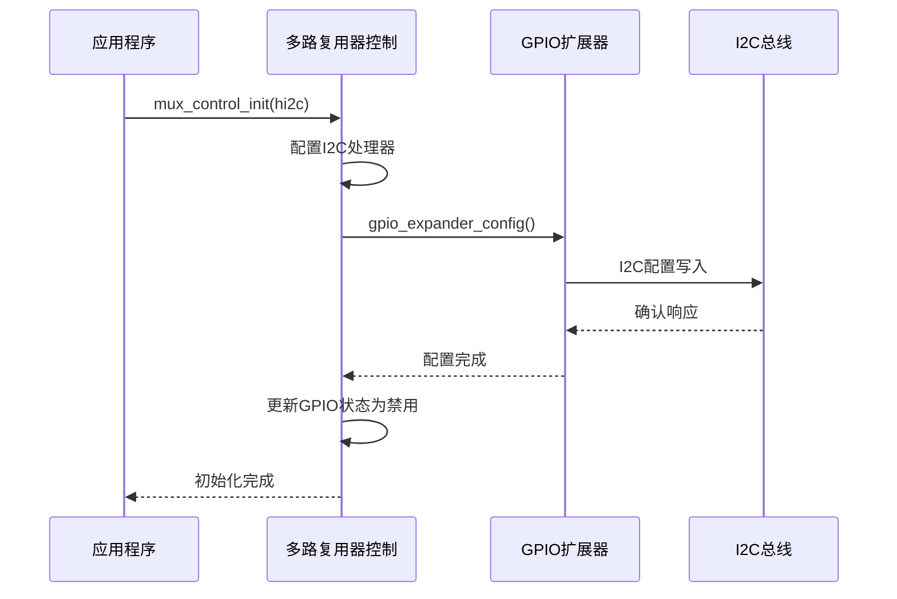
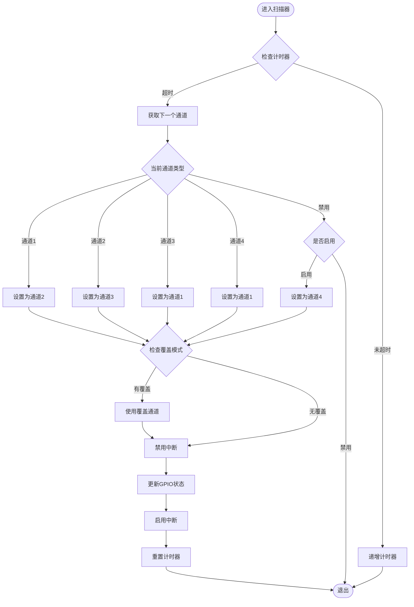
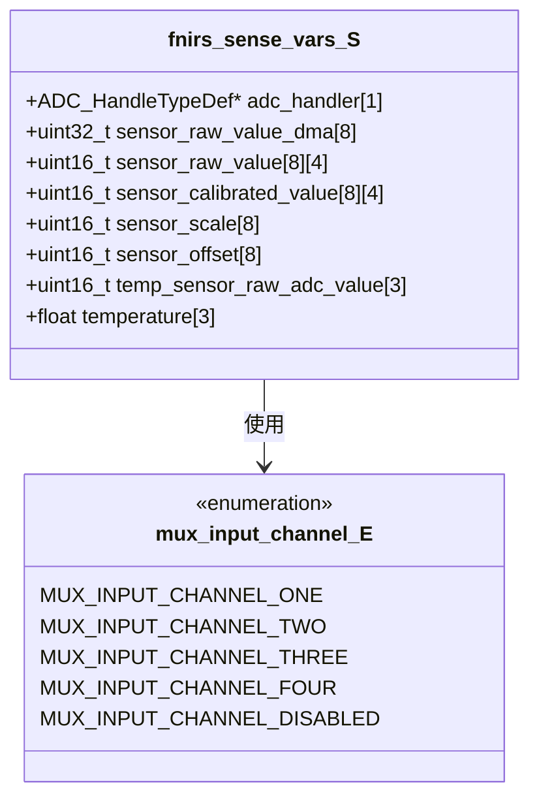
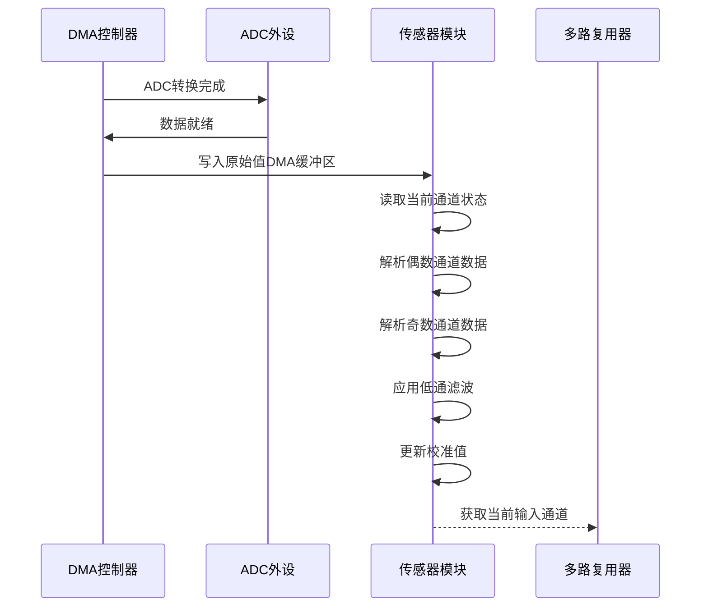
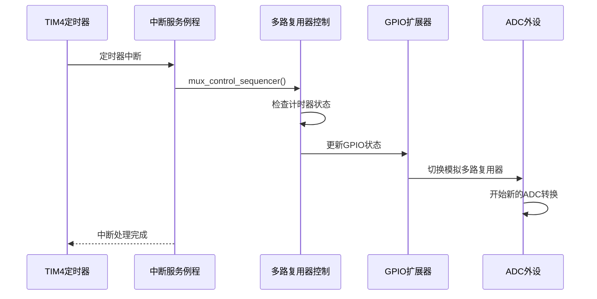
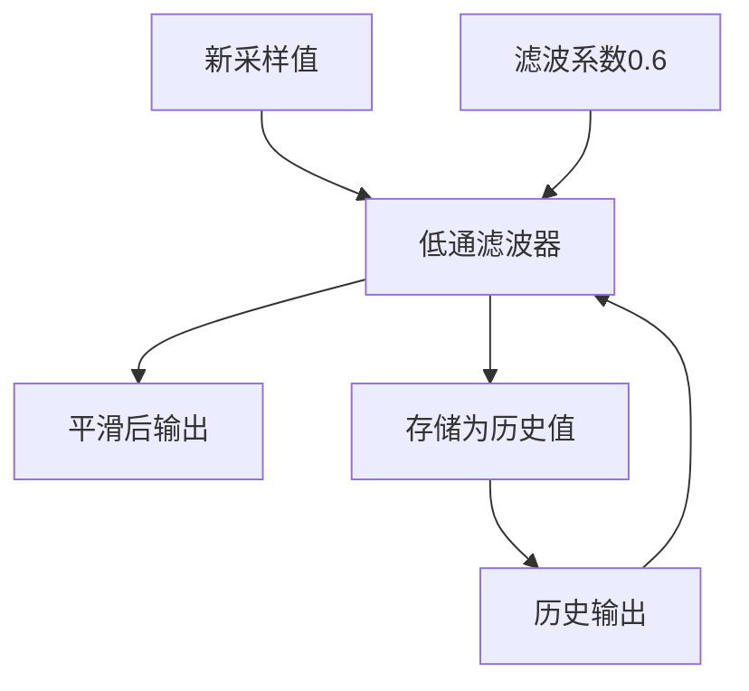
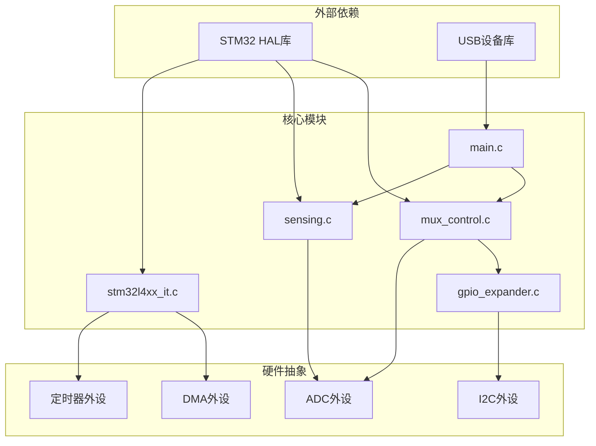

# ADC多路复用器控制API

<cite>
**本文档引用的文件**
- [mux_control.h](file://firmware/STM32/fNIRS/Core/Inc/mux_control.h)
- [mux_control.c](file://firmware/STM32/fNIRS/Core/Src/mux_control.c)
- [sensing.h](file://firmware/STM32/fNIRS/Core/Inc/sensing.h)
- [sensing.c](file://firmware/STM32/fNIRS/Core/Src/sensing.c)
- [gpio_expander.h](file://firmware/STM32/fNIRS/Core/Inc/gpio_expander.h)
- [gpio_expander.c](file://firmware/STM32/fNIRS/Core/Src/gpio_expander.c)
- [main.h](file://firmware/STM32/fNIRS/Core/Inc/main.h)
- [main.c](file://firmware/STM32/fNIRS/Core/Src/main.c)
- [stm32l4xx_it.c](file://firmware/STM32/fNIRS/Core/Src/stm32l4xx_it.c)
</cite>

## 目录
1. [简介](#简介)
2. [项目结构](#项目结构)
3. [核心组件](#核心组件)
4. [架构概览](#架构概览)
5. [详细组件分析](#详细组件分析)
6. [依赖关系分析](#依赖关系分析)
7. [性能考虑](#性能考虑)
8. [故障排除指南](#故障排除指南)
9. [结论](#结论)

## 简介

本文档提供了fNIRS系统中ADC多路复用器控制的详细C API文档。该系统实现了基于I2C扩展器的多路复用器控制，支持8个传感器模块的ADC采样通道配置、模拟开关切换时序控制和DMA数据传输管理。

系统采用双I2C接口架构，通过PCA9555 GPIO扩展器控制8个独立的模拟多路复用器（MUX0-MUX7），每个MUX可选择4个输入通道。ADC采样通过DMA连续传输到内存缓冲区，结合低通滤波算法实现信号调理和噪声抑制。

## 项目结构

fNIRS项目的ADC多路复用器控制系统主要分布在以下目录结构中：

**图表来源**
- [mux_control.h:1-56](file://firmware/STM32/fNIRS/Core/Inc/mux_control.h#L1-L56)
- [gpio_expander.h:1-49](file://firmware/STM32/fNIRS/Core/Inc/gpio_expander.h#L1-L49)
- [sensing.h:1-71](file://firmware/STM32/fNIRS/Core/Inc/sensing.h#L1-L71)

**章节来源**
- [mux_control.h:1-56](file://firmware/STM32/fNIRS/Core/Inc/mux_control.h#L1-L56)
- [gpio_expander.h:1-49](file://firmware/STM32/fNIRS/Core/Inc/gpio_expander.h#L1-L49)
- [sensing.h:1-71](file://firmware/STM32/fNIRS/Core/Inc/sensing.h#L1-L71)

## 核心组件

### 多路复用器控制器

多路复用器控制系统的核心是`mux_control`模块，负责管理8个模拟多路复用器的切换和状态控制。

**章节来源**
- [mux_control.h:13-40](file://firmware/STM32/fNIRS/Core/Inc/mux_control.h#L13-L40)
- [mux_control.c:102-144](file://firmware/STM32/fNIRS/Core/Src/mux_control.c#L102-L144)

### GPIO扩展器接口

系统使用PCA9555 GPIO扩展器通过I2C接口控制多路复用器的使能引脚和选择线。

**章节来源**
- [gpio_expander.h:26-35](file://firmware/STM32/fNIRS/Core/Inc/gpio_expander.h#L26-L35)
- [gpio_expander.c:17-33](file://firmware/STM32/fNIRS/Core/Src/gpio_expander.c#L17-L33)

### 传感器数据采集

`sensing`模块负责ADC数据的DMA传输、缓冲区管理和温度传感器读取。

**章节来源**
- [sensing.h:46-61](file://firmware/STM32/fNIRS/Core/Inc/sensing.h#L46-L61)
- [sensing.c:24-41](file://firmware/STM32/fNIRS/Core/Src/sensing.c#L24-L41)

## 架构概览

系统采用分层架构设计，从底层硬件抽象到应用逻辑层层封装：

**图表来源**
- [main.c:132-138](file://firmware/STM32/fNIRS/Core/Src/main.c#L132-L138)
- [mux_control.c:146-158](file://firmware/STM32/fNIRS/Core/Src/mux_control.c#L146-L158)
- [sensing.c:50-56](file://firmware/STM32/fNIRS/Core/Src/sensing.c#L50-L56)

## 详细组件分析

### 多路复用器控制API

#### 初始化函数

`mux_control_init`函数负责多路复用器的初始化配置：

**图表来源**
- [mux_control.c:146-158](file://firmware/STM32/fNIRS/Core/Src/mux_control.c#L146-L158)
- [gpio_expander.c:17-33](file://firmware/STM32/fNIRS/Core/Src/gpio_expander.c#L17-L33)

#### 通道选择函数

`mux_control_sequencer`函数实现多路复用器的自动扫描序列：

**图表来源**
- [mux_control.c:170-229](file://firmware/STM32/fNIRS/Core/Src/mux_control.c#L170-L229)

#### 状态查询函数

`mux_control_get_curr_input_channel`提供当前通道状态查询功能：

**章节来源**
- [mux_control.h:44-44](file://firmware/STM32/fNIRS/Core/Inc/mux_control.h#L44-L44)
- [mux_control.c:160-163](file://firmware/STM32/fNIRS/Core/Src/mux_control.c#L160-L163)

### ADC采样通道配置

#### 硬件映射表

系统支持8个传感器模块，每个模块对应ADC的不同通道：

| 传感器模块 | ADC通道 | 采样时间 | 用途 |
|------------|---------|----------|------|
| SENSOR_MODULE_1 | ADC_CHANNEL_15 | 47.5周期 | 模块1检测器 |
| SENSOR_MODULE_2 | ADC_CHANNEL_14 | 默认 | 模块2检测器 |
| SENSOR_MODULE_3 | ADC_CHANNEL_13 | 默认 | 模块3检测器 |
| SENSOR_MODULE_4 | ADC_CHANNEL_12 | 默认 | 模块4检测器 |
| SENSOR_MODULE_5 | ADC_CHANNEL_4 | 默认 | 模块5检测器 |
| SENSOR_MODULE_6 | ADC_CHANNEL_3 | 默认 | 模块6检测器 |
| SENSOR_MODULE_7 | ADC_CHANNEL_1 | 默认 | 模块7检测器 |
| SENSOR_MODULE_8 | ADC_CHANNEL_2 | 默认 | 模块8检测器 |

#### ADC初始化配置

ADC1配置参数：
- 时钟预分频：异步DIV1
- 分辨率：12位
- 数据对齐：右对齐
- 扫描转换：启用
- 连续转换：禁用
- 触发源：TIM3_TRGO
- DMA连续请求：启用
- 超量程处理：数据保留

**章节来源**
- [main.c:281-298](file://firmware/STM32/fNIRS/Core/Src/main.c#L281-L298)
- [main.c:310-382](file://firmware/STM32/fNIRS/Core/Src/main.c#L310-L382)

### DMA数据传输配置

#### 缓冲区管理

系统使用DMA将ADC数据直接传输到内存缓冲区：

**图表来源**
- [sensing.h:46-61](file://firmware/STM32/fNIRS/Core/Inc/sensing.h#L46-L61)

#### 数据更新流程

`sensing_update_all_sensor_channels`函数处理DMA传输的数据：

**图表来源**
- [sensing.c:73-84](file://firmware/STM32/fNIRS/Core/Src/sensing.c#L73-L84)

**章节来源**
- [sensing.c:50-56](file://firmware/STM32/fNIRS/Core/Src/sensing.c#L50-L56)
- [sensing.c:73-84](file://firmware/STM32/fNIRS/Core/Src/sensing.c#L73-L84)

### 中断触发机制

系统使用定时器中断驱动多路复用器扫描：

**图表来源**
- [stm32l4xx_it.c:235-244](file://firmware/STM32/fNIRS/Core/Src/stm32l4xx_it.c#L235-L244)
- [main.c:140-141](file://firmware/STM32/fNIRS/Core/Src/main.c#L140-L141)

**章节来源**
- [stm32l4xx_it.c:235-244](file://firmware/STM32/fNIRS/Core/Src/stm32l4xx_it.c#L235-L244)
- [main.c:140-141](file://firmware/STM32/fNIRS/Core/Src/main.c#L140-L141)

### 采样延迟控制

系统通过`MUX_SEQUENCER_FREQ_TICKS`常量控制多路复用器切换频率：

- **默认频率**：50个定时器周期
- **切换时序**：在每次ADC转换完成后进行通道切换
- **中断保护**：切换过程中禁用中断以确保时序准确性

**章节来源**
- [mux_control.c:30-30](file://firmware/STM32/fNIRS/Core/Src/mux_control.c#L30-L30)
- [mux_control.c:216-222](file://firmware/STM32/fNIRS/Core/Src/mux_control.c#L216-L222)

### ADC采样精度优化

#### 低通滤波算法

系统实现数字低通滤波器减少采样噪声：

**图表来源**
- [sensing.c:45-48](file://firmware/STM32/fNIRS/Core/Src/sensing.c#L45-L48)

#### 校准参数

每个传感器模块支持独立的标度因子和偏移量配置：

- **标度因子**：默认为1，支持范围调整
- **偏移量**：默认为0，用于零点校准
- **动态调整**：可通过串口接口实时修改

**章节来源**
- [sensing.h:55-56](file://firmware/STM32/fNIRS/Core/Inc/sensing.h#L55-L56)
- [sensing.c:26-36](file://firmware/STM32/fNIRS/Core/Src/sensing.c#L26-L36)

### 硬件连接说明

#### I2C扩展器配置

系统使用两个PCA9555扩展器控制多路复用器：

| 扩展器 | I2C地址 | 功能 |
|--------|---------|------|
| GPIO_EXPANDER_ONE | 0b01000001 | 控制MUX0-MUX3 |
| GPIO_EXPANDER_TWO | 0b01000011 | 控制MUX4-MUX7 |

#### 多路复用器地址映射

每个扩展器的端口配置：

**扩展器1 (MUX0-MUX3)**:
- Port 0: MUX0(p1_1,p1_2,p1_3), MUX1(p0_6,p0_7), MUX2(p0_3,p0_4,p0_5)
- Port 1: MUX0(en), MUX3(p0_0,p0_1,p0_2)

**扩展器2 (MUX4-MUX7)**:
- Port 0: MUX4(p0_0,p0_1,p0_2), MUX5(p0_3,p0_4,p0_5), MUX6(p0_6,p0_7,p1_0)
- Port 1: MUX7(p1_1,p1_2,p1_3)

**章节来源**
- [mux_control.c:11-28](file://firmware/STM32/fNIRS/Core/Src/mux_control.c#L11-L28)
- [mux_control.c:49-100](file://firmware/STM32/fNIRS/Core/Src/mux_control.c#L49-L100)

## 依赖关系分析

系统组件间的依赖关系如下：

**图表来源**
- [main.c:25-31](file://firmware/STM32/fNIRS/Core/Src/main.c#L25-L31)
- [mux_control.c:3-5](file://firmware/STM32/fNIRS/Core/Src/mux_control.c#L3-L5)
- [sensing.c:2-6](file://firmware/STM32/fNIRS/Core/Src/sensing.c#L2-L6)

**章节来源**
- [main.c:25-31](file://firmware/STM32/fNIRS/Core/Src/main.c#L25-L31)
- [mux_control.c:3-5](file://firmware/STM32/fNIRS/Core/Src/mux_control.c#L3-L5)
- [sensing.c:2-6](file://firmware/STM32/fNIRS/Core/Src/sensing.c#L2-L6)

## 性能考虑

### 采样频率优化

系统通过定时器中断实现精确的采样控制，建议根据应用需求调整：

- **定时器频率**：根据目标采样率配置TIM4
- **ADC采样时间**：当前配置为47.5个周期，可在硬件限制范围内优化
- **DMA传输**：启用DMA连续模式减少CPU占用

### 内存使用优化

- **缓冲区大小**：8个传感器模块的DMA缓冲区已优化
- **数据类型**：使用16位整型存储ADC值，平衡精度和内存使用
- **滤波计算**：采用定点数运算避免浮点数开销

### 实时性保证

- **中断优先级**：定时器中断优先级高于其他非关键中断
- **临界区保护**：GPIO更新时禁用中断确保时序准确性
- **DMA直传**：ADC数据直接传输到缓冲区，避免数据拷贝

## 故障排除指南

### 常见问题诊断

#### 多路复用器无响应

1. **检查I2C连接**：确认I2C总线电压和上拉电阻
2. **验证地址配置**：检查扩展器地址设置
3. **测试GPIO状态**：使用调试功能验证端口状态

#### ADC数据异常

1. **检查采样时间**：确认ADC采样时间配置
2. **验证DMA设置**：检查DMA缓冲区配置
3. **监控中断状态**：确认定时器中断正常工作

#### 通道切换错误

1. **检查计时器配置**：验证定时器频率设置
2. **确认中断处理**：检查mux_control_sequencer函数执行
3. **调试GPIO更新**：验证I2C通信状态

**章节来源**
- [mux_control.c:246-251](file://firmware/STM32/fNIRS/Core/Src/mux_control.c#L246-L251)
- [gpio_expander.c:68-86](file://firmware/STM32/fNIRS/Core/Src/gpio_expander.c#L68-L86)

## 结论

ADC多路复用器控制系统提供了完整的硬件抽象和实时控制能力。通过分层架构设计，系统实现了：

- **高精度采样**：12位分辨率和DMA直传
- **灵活通道控制**：8个传感器模块的独立控制
- **实时性能**：定时器中断驱动的精确采样
- **噪声抑制**：数字滤波和硬件配置优化
- **易于扩展**：模块化设计支持功能扩展

该API为fNIRS系统的光学检测提供了可靠的基础，支持从基础采样到高级信号处理的完整数据流。