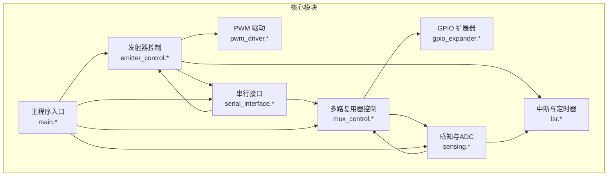
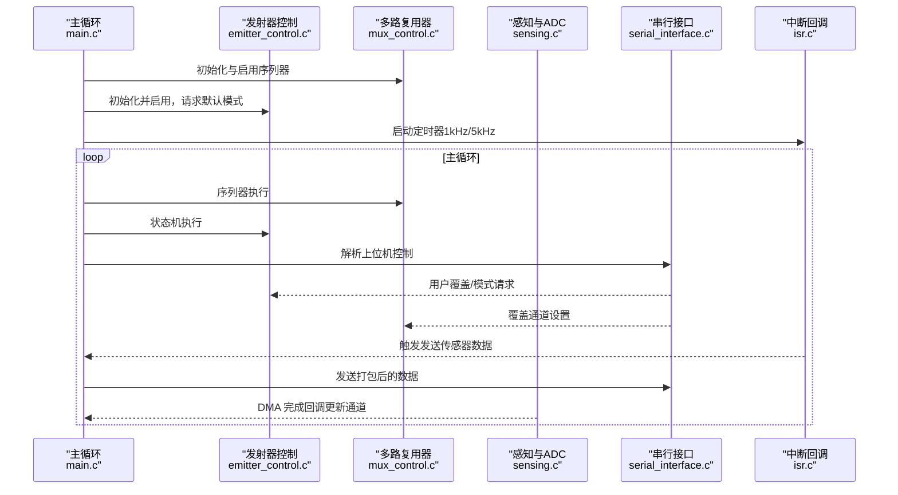
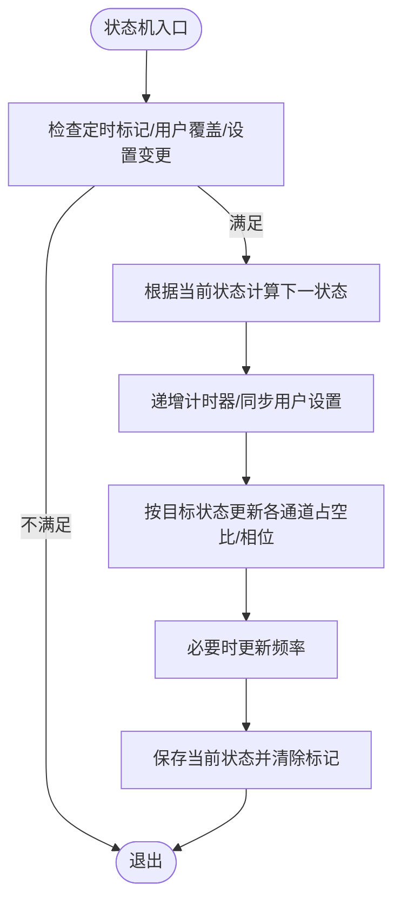
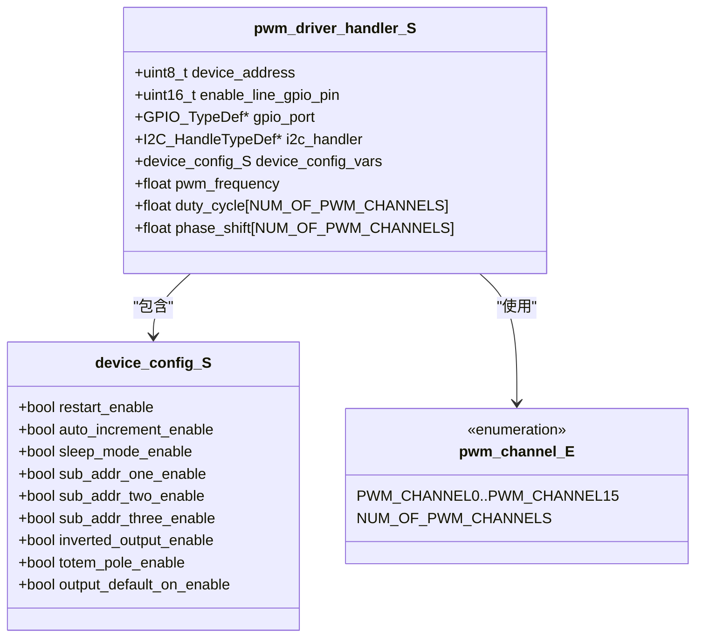
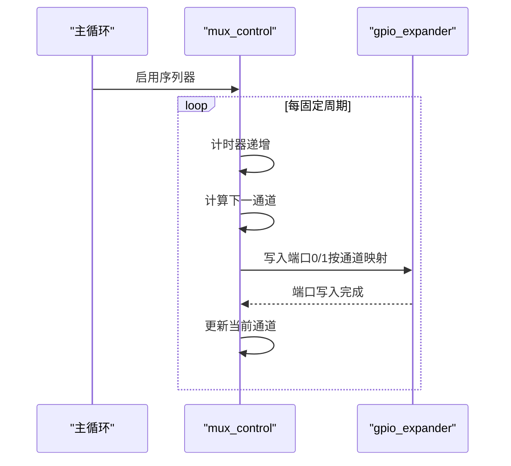
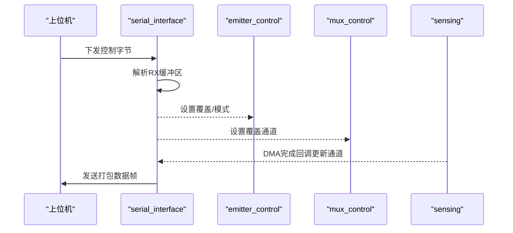
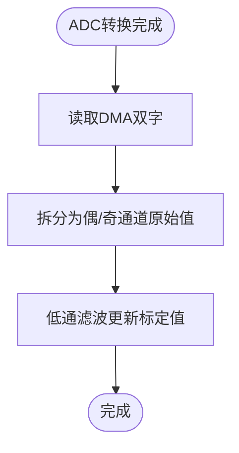
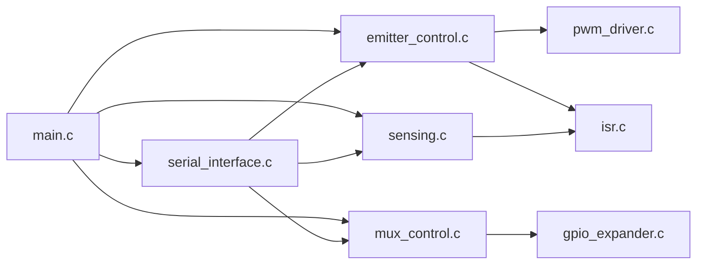

# C API 参考文档

<cite>
**本文档引用的文件**
- [emitter_control.h](file://firmware/STM32/fNIRS/Core/Inc/emitter_control.h)
- [pwm_driver.h](file://firmware/STM32/fNIRS/Core/Inc/pwm_driver.h)
- [mux_control.h](file://firmware/STM32/fNIRS/Core/Inc/mux_control.h)
- [serial_interface.h](file://firmware/STM32/fNIRS/Core/Inc/serial_interface.h)
- [sensing.h](file://firmware/STM32/fNIRS/Core/Inc/sensing.h)
- [gpio_expander.h](file://firmware/STM32/fNIRS/Core/Inc/gpio_expander.h)
- [isr.h](file://firmware/STM32/fNIRS/Core/Inc/isr.h)
- [main.h](file://firmware/STM32/fNIRS/Core/Inc/main.h)
- [emitter_control.c](file://firmware/STM32/fNIRS/Core/Src/emitter_control.c)
- [pwm_driver.c](file://firmware/STM32/fNIRS/Core/Src/pwm_driver.c)
- [mux_control.c](file://firmware/STM32/fNIRS/Core/Src/mux_control.c)
- [serial_interface.c](file://firmware/STM32/fNIRS/Core/Src/serial_interface.c)
- [sensing.c](file://firmware/STM32/fNIRS/Core/Src/sensing.c)
- [gpio_expander.c](file://firmware/STM32/fNIRS/Core/Src/gpio_expander.c)
- [isr.c](file://firmware/STM32/fNIRS/Core/Src/isr.c)
- [main.c](file://firmware/STM32/fNIRS/Core/Src/main.c)
</cite>

## 目录
1. [简介](#简介)
2. [项目结构](#项目结构)
3. [核心组件](#核心组件)
4. [架构总览](#架构总览)
5. [详细组件分析](#详细组件分析)
6. [依赖关系分析](#依赖关系分析)
7. [性能考虑](#性能考虑)
8. [故障排查指南](#故障排查指南)
9. [结论](#结论)
10. [附录](#附录)

## 简介
本文件为 fNIRS 系统在 STM32 固件中的 C API 参考文档，面向嵌入式开发者，系统性地记录以下内容：
- 发射器控制 API：PWM 驱动函数、状态机管理、I2C 通信协议
- 串行通信接口 API：数据包格式定义、协议解析函数、缓冲区管理
- ADC 采样控制 API：多路复用器控制、DMA 传输配置与中断处理机制
- 完整头文件接口说明：结构体、枚举、宏定义
- 嵌入式集成指南：编译配置、链接设置、调试技巧

## 项目结构
该固件采用按功能模块划分的头/源文件组织方式，核心模块位于 Core/Inc 与 Core/Src 下，分别包含公共接口与实现。

图表来源
- [main.c:132-178](file://firmware/STM32/fNIRS/Core/Src/main.c#L132-L178)
- [emitter_control.c:183-202](file://firmware/STM32/fNIRS/Core/Src/emitter_control.c#L183-L202)
- [mux_control.c:146-158](file://firmware/STM32/fNIRS/Core/Src/mux_control.c#L146-L158)
- [sensing.c:50-56](file://firmware/STM32/fNIRS/Core/Src/sensing.c#L50-L56)
- [serial_interface.c:20-32](file://firmware/STM32/fNIRS/Core/Src/serial_interface.c#L20-L32)

章节来源
- [main.c:132-178](file://firmware/STM32/fNIRS/Core/Src/main.c#L132-L178)

## 核心组件
本节概述各模块提供的公共接口与职责边界，便于快速定位所需 API。

- 发射器控制模块（emitter_control）
  - 职责：管理发射器工作模式、频率/占空比/相位更新、状态机推进
  - 关键接口：初始化、启用/禁用、请求工作模式、更新频率与占空比、状态机执行、查询发射器是否激活
- PWM 驱动模块（pwm_driver）
  - 职责：通过 I2C 控制 PWM 芯片寄存器，支持单通道/全通道更新、睡眠模式切换、频率调节
  - 关键接口：配置、使能/去使能、睡眠模式切换、更新频率、更新单通道/全通道模式
- 多路复用器控制模块（mux_control）
  - 职责：通过 GPIO 扩展器控制模拟开关，实现通道轮询与覆盖
  - 关键接口：初始化、启用/禁用序列器、序列器执行、覆盖使能/禁用、设置覆盖通道
- GPIO 扩展器模块（gpio_expander）
  - 职责：配置端口方向与极性，写入端口状态
  - 关键接口：配置、写入引脚、写入端口
- 串行接口模块（serial_interface）
  - 职责：解析上位机下发的控制指令，打包传感器数据并通过 CDC 发送
  - 关键接口：解析接收缓冲区、获取用户控制标志与状态、发送传感器数据
- 感知与 ADC 模块（sensing）
  - 职责：ADC 初始化、DMA 连续采集、低通滤波与标定值输出
  - 关键接口：初始化、获取标定值、更新所有通道
- 中断与定时器模块（isr）
  - 职责：1kHz/5kHz 定时中断回调，触发传感器数据发送与发射器状态机计时
  - 关键接口：获取/重置定时标记

章节来源
- [emitter_control.h:41-48](file://firmware/STM32/fNIRS/Core/Inc/emitter_control.h#L41-L48)
- [pwm_driver.h:66-78](file://firmware/STM32/fNIRS/Core/Inc/pwm_driver.h#L66-L78)
- [mux_control.h:43-53](file://firmware/STM32/fNIRS/Core/Inc/mux_control.h#L43-L53)
- [gpio_expander.h:39-46](file://firmware/STM32/fNIRS/Core/Inc/gpio_expander.h#L39-L46)
- [serial_interface.h:55-62](file://firmware/STM32/fNIRS/Core/Inc/serial_interface.h#L55-L62)
- [sensing.h:64-69](file://firmware/STM32/fNIRS/Core/Inc/sensing.h#L64-L69)
- [isr.h:19-22](file://firmware/STM32/fNIRS/Core/Inc/isr.h#L19-L22)

## 架构总览
下图展示系统级调用关系与数据流，突出主循环如何协调各模块。

图表来源
- [main.c:132-178](file://firmware/STM32/fNIRS/Core/Src/main.c#L132-L178)
- [mux_control.c:170-229](file://firmware/STM32/fNIRS/Core/Src/mux_control.c#L170-L229)
- [emitter_control.c:220-278](file://firmware/STM32/fNIRS/Core/Src/emitter_control.c#L220-L278)
- [serial_interface.c:59-81](file://firmware/STM32/fNIRS/Core/Src/serial_interface.c#L59-L81)
- [isr.c:35-52](file://firmware/STM32/fNIRS/Core/Src/isr.c#L35-L52)

## 详细组件分析

### 发射器控制 API
- 功能概述
  - 提供发射器工作模式管理（禁用/空闲/默认/用户控制/循环/全开660nm/全开940nm）
  - 支持频率、占空比、相位更新；通过状态机在定时中断驱动下推进
  - 通过 I2C 与 PWM 驱动交互，更新各通道输出
- 公共函数与调用约定
  - 初始化
    - 函数：emitter_control_init
    - 参数：I2C_HandleTypeDef*（I2C 句柄）
    - 返回：无
    - 调用约定：标准 C，非静态
  - 启用/禁用
    - 函数：emitter_control_enable、emitter_control_disable
    - 参数：无
    - 返回：无
    - 调用约定：标准 C
  - 请求工作模式
    - 函数：emitter_control_request_operating_mode
    - 参数：emitter_control_state_E（目标状态）
    - 返回：无
    - 调用约定：标准 C
  - 更新频率
    - 函数：emitter_control_update_frequency
    - 参数：float（频率 Hz）
    - 返回：无
    - 调用约定：标准 C
  - 更新占空比与相位
    - 函数：emitter_control_update_duty_and_phase
    - 参数：pwm_channel_E（通道）、float duty_cycle、float phase_shift
    - 返回：无
    - 调用约定：标准 C
  - 状态机执行
    - 函数：emitter_control_state_machine
    - 参数：无
    - 返回：无
    - 调用约定：标准 C
  - 查询发射器是否激活
    - 函数：emitter_control_is_emitter_active
    - 参数：pwm_channel_E（通道）
    - 返回：bool
    - 调用约定：标准 C
- 数据结构与枚举
  - 状态枚举：DISABLED、IDLE、DEFAULT_MODE、USER_CONTROL、CYCLING、FULLY_ENABLED_660NM、FULLY_ENABLED_940NM、NUM_OF_EMIITER_CONTROL_STATES
  - 结构体：emitter_control_vars_S（包含启用标志、当前/请求状态、用户设置、频率与各通道占空比/相位等）
- I2C 协议要点
  - 设备地址：读写位由最低位区分（读=1，写=0）
  - 默认频率：约 1500 Hz
  - 占空比与相位范围：均限制在 [0,1]
- 错误处理与边界条件
  - 占空比/相位裁剪至有效范围
  - 频率更新需先进入睡眠模式再写入预分频
- 性能与复杂度
  - 状态机每次执行遍历所有通道进行更新，时间复杂度 O(N)，N 为通道数
  - I2C 写入为多次寄存器访问，建议在高频场景下评估总线负载

图表来源
- [emitter_control.c:220-278](file://firmware/STM32/fNIRS/Core/Src/emitter_control.c#L220-L278)

章节来源
- [emitter_control.h:13-38](file://firmware/STM32/fNIRS/Core/Inc/emitter_control.h#L13-L38)
- [emitter_control.c:183-202](file://firmware/STM32/fNIRS/Core/Src/emitter_control.c#L183-L202)
- [emitter_control.c:220-278](file://firmware/STM32/fNIRS/Core/Src/emitter_control.c#L220-L278)
- [emitter_control.c:280-283](file://firmware/STM32/fNIRS/Core/Src/emitter_control.c#L280-L283)

### PWM 驱动 API
- 功能概述
  - 通过 I2C 对 PWM 控制芯片进行配置与控制，支持单通道/全通道模式更新
  - 提供睡眠模式切换与频率调节能力
- 公共函数与调用约定
  - 配置
    - 函数：pwm_driver_config
    - 参数：pwm_driver_handler_S*
    - 返回：无
    - 调用约定：标准 C
  - 使能/去使能控制引脚
    - 函数：pwm_driver_assert_enable_line、pwm_driver_deassert_enable_line
    - 参数：pwm_driver_handler_S*
    - 返回：无
    - 调用约定：标准 C
  - 睡眠模式切换
    - 函数：pwm_driver_enable_sleep_mode、pwm_driver_disable_sleep_mode
    - 参数：pwm_driver_handler_S*
    - 返回：无
    - 调用约定：标准 C
  - 更新频率
    - 函数：pwm_driver_update_frequency
    - 参数：pwm_driver_handler_S*、float（频率 Hz）
    - 返回：无
    - 调用约定：标准 C
  - 更新单通道/全通道模式
    - 函数：pwm_driver_update_individual_patterns、pwm_driver_update_all_patterns
    - 参数：pwm_driver_handler_S*、pwm_channel_E 或全通道、float duty_cycle、float phase_shift
    - 返回：无
    - 调用约定：标准 C
- 数据结构与枚举
  - 通道枚举：PWM_CHANNEL0..PWM_CHANNEL15、NUM_OF_PWM_CHANNELS
  - 设备配置结构体：device_config_S（重启使能、自动增量、睡眠、子地址、输出极性、推挽/开漏、默认输出等）
  - 驱动句柄：pwm_driver_handler_S（设备地址、使能引脚、I2C 句柄、配置、频率与各通道参数）
- I2C 寄存器映射与协议
  - 模式寄存器：MODE1（0x00）、MODE2（0x01）
  - 单通道控制：LED_ON_L/H、LED_OFF_L/H（基址+通道索引*4）
  - 全通道控制：ALL_LED_ON_L/H、ALL_LED_OFF_L/H（0xFA..0xFD）
  - 频率控制：PRE_SCALE（0xFE）
  - 频率范围：约 24–1526 Hz（受内部振荡器与预分频限制）
- 错误处理与边界条件
  - duty_cycle/phase_shift 裁剪到 [0,1]
  - 频率超出范围时取边界值
  - 更新频率前必须进入睡眠模式
- 性能与复杂度
  - 单通道更新涉及多次 I2C 写入，建议批量更新或合并写入以减少总线事务

图表来源
- [pwm_driver.h:35-62](file://firmware/STM32/fNIRS/Core/Inc/pwm_driver.h#L35-L62)

章节来源
- [pwm_driver.h:13-33](file://firmware/STM32/fNIRS/Core/Inc/pwm_driver.h#L13-L33)
- [pwm_driver.h:50-62](file://firmware/STM32/fNIRS/Core/Inc/pwm_driver.h#L50-L62)
- [pwm_driver.c:33-83](file://firmware/STM32/fNIRS/Core/Src/pwm_driver.c#L33-L83)
- [pwm_driver.c:125-154](file://firmware/STM32/fNIRS/Core/Src/pwm_driver.c#L125-L154)
- [pwm_driver.c:156-220](file://firmware/STM32/fNIRS/Core/Src/pwm_driver.c#L156-L220)
- [pwm_driver.c:222-277](file://firmware/STM32/fNIRS/Core/Src/pwm_driver.c#L222-L277)

### 多路复用器控制 API
- 功能概述
  - 通过两个 GPIO 扩展器控制模拟开关，实现输入通道的轮询与覆盖
  - 支持序列器启用/禁用、覆盖使能/禁用与覆盖通道设置
- 公共函数与调用约定
  - 初始化
    - 函数：mux_control_init
    - 参数：I2C_HandleTypeDef*（I2C 句柄）
    - 返回：无
    - 调用约定：标准 C
  - 获取当前输入通道
    - 函数：mux_control_get_curr_input_channel
    - 参数：无
    - 返回：mux_input_channel_E
    - 调用约定：标准 C
  - 启用/禁用序列器
    - 函数：mux_control_enable_sequencer、mux_control_disable_sequencer
    - 参数：无
    - 返回：无
    - 调用约定：标准 C
  - 序列器执行
    - 函数：mux_control_sequencer
    - 参数：无
    - 返回：无
    - 调用约定：标准 C
  - 覆盖控制
    - 函数：mux_control_enable_sequencer_override、mux_control_disable_sequencer_override、mux_control_set_input_channel_ovr
    - 参数：无或 mux_input_channel_E
    - 返回：无
    - 调用约定：标准 C
- 数据结构与枚举
  - 控制器枚举：MUX_CONTROL_ONE、MUX_CONTROL_TWO、NUM_OF_MUX_CONTROLS
  - 输入通道枚举：MUX_DISABLED、MUX_INPUT_CHANNEL_ONE..MUX_INPUT_CHANNEL_FOUR、NUM_OF_INPUT_CHANNELS
  - 控制器句柄：mux_control_handler_S（启用标志、覆盖标志、计时器、当前/覆盖通道）
- I2C 协议要点
  - 设备地址：两片扩展器不同地址（读写位区分）
  - 通过写入端口寄存器实现通道选择（端口0/1 的位组合）
- 错误处理与边界条件
  - 序列器周期性切换，覆盖优先于序列器
  - 在硬件允许范围内进行端口写入，避免同时写入导致竞争

图表来源
- [mux_control.c:170-229](file://firmware/STM32/fNIRS/Core/Src/mux_control.c#L170-L229)
- [mux_control.c:102-144](file://firmware/STM32/fNIRS/Core/Src/mux_control.c#L102-L144)

章节来源
- [mux_control.h:13-40](file://firmware/STM32/fNIRS/Core/Inc/mux_control.h#L13-L40)
- [mux_control.c:146-158](file://firmware/STM32/fNIRS/Core/Src/mux_control.c#L146-L158)
- [mux_control.c:170-229](file://firmware/STM32/fNIRS/Core/Src/mux_control.c#L170-L229)

### GPIO 扩展器 API
- 功能概述
  - 配置端口方向与极性反转，写入指定引脚或整个端口的状态
- 公共函数与调用约定
  - 配置
    - 函数：gpio_expander_config
    - 参数：gpio_expander_handler_S*
    - 返回：无
    - 调用约定：标准 C
  - 写入引脚/端口
    - 函数：gpio_expander_write_pin、gpio_expander_write_port
    - 参数：gpio_expander_handler_S*、gpio_expander_port_E、pin/pin_states
    - 返回：无
    - 调用约定：标准 C
- 数据结构与枚举
  - 引脚状态枚举：PIN_LOW、PIN_HIGH
  - 端口枚举：GPIO_PORT_ZERO、GPIO_PORT_ONE、NUM_OF_GPIO_PORTS
  - 句柄：gpio_expander_handler_S（设备地址、I2C 句柄、端口配置与极性）

章节来源
- [gpio_expander.h:13-35](file://firmware/STM32/fNIRS/Core/Inc/gpio_expander.h#L13-L35)
- [gpio_expander.c:17-33](file://firmware/STM32/fNIRS/Core/Src/gpio_expander.c#L17-L33)
- [gpio_expander.c:35-66](file://firmware/STM32/fNIRS/Core/Src/gpio_expander.c#L35-L66)

### 串行通信接口 API
- 功能概述
  - 解析上位机下发的控制字节，设置发射器与多路复用器的覆盖策略
  - 将每个传感器模块的三路 ADC 数据与发射器状态打包并通过 CDC 发送
- 公共函数与调用约定
  - 解析接收缓冲区
    - 函数：serial_interface_rx_parse_data
    - 参数：uint8_t*（USB 接收缓冲区）
    - 返回：无
    - 调用约定：标准 C
  - 获取用户控制标志与状态
    - 函数：serial_interface_rx_get_user_emitter_control_override_enable、serial_interface_rx_get_emitter_control_state、serial_interface_rx_get_user_emitter_controls、serial_interface_rx_get_user_mux_control_override_enable、serial_interface_rx_get_user_mux_control_state
    - 参数：无
    - 返回：对应布尔/枚举/掩码
    - 调用约定：标准 C
  - 发送传感器数据
    - 函数：serial_interface_tx_send_sensor_data
    - 参数：无
    - 返回：无
    - 调用约定：标准 C
- 数据结构与枚举
  - RX 缓冲区索引枚举：EMIITER_CONTROL_OVERRIDE_ENABLE、EMIITER_CONTROL_STATE、EMITTER_PWM_CONTROL_H/L、MUX_CONTROL_OVERRIDE_ENABLE、MUX_CONTROL_STATE、SIZE_OF_RX_BUFFER
  - TX 缓冲区索引枚举：PACKET_IDENTIFIER、SENSOR_CHANNEL_1/2/3_H/L、EMITTER_STATUS、NUM_OF_BYTES_PER_SENSOR_MODULE
  - RX 变量结构体：serial_interface_rx_vars_S（用户覆盖标志、发射器状态、发射器 PWM 控制掩码、用户覆盖标志、多路复用器状态）
- 数据包格式
  - 每模块固定长度帧，包含标识符、三路 ADC 高低位、发射器状态（两位）
  - 标识符：高 4 位为固定模式，低 4 位为模块号
- 错误处理与边界条件
  - 仅解析有效索引范围内的字节
  - 发送前确保 ADC 数据已更新

图表来源
- [serial_interface.c:20-32](file://firmware/STM32/fNIRS/Core/Src/serial_interface.c#L20-L32)
- [serial_interface.c:59-81](file://firmware/STM32/fNIRS/Core/Src/serial_interface.c#L59-L81)

章节来源
- [serial_interface.h:12-51](file://firmware/STM32/fNIRS/Core/Inc/serial_interface.h#L12-L51)
- [serial_interface.c:20-32](file://firmware/STM32/fNIRS/Core/Src/serial_interface.c#L20-L32)
- [serial_interface.c:59-81](file://firmware/STM32/fNIRS/Core/Src/serial_interface.c#L59-L81)

### ADC 采样控制 API
- 功能概述
  - 初始化 ADC 与 DMA，启动连续扫描与 DMA 传输
  - 通过低通滤波对原始 ADC 值进行平滑，并提供标定值查询接口
- 公共函数与调用约定
  - 初始化
    - 函数：sensing_init
    - 参数：ADC_HandleTypeDef*（ADC 句柄）
    - 返回：无
    - 调用约定：标准 C
  - 获取标定值/温度
    - 函数：sensing_get_sensor_calibrated_value、sensing_get_temperature_reading
    - 参数：sensor_module_E、mux_input_channel_E 或 temp_sensor_E
    - 返回：uint16_t 或 float
    - 调用约定：标准 C
  - 更新所有通道
    - 函数：sensing_update_all_sensor_channels
    - 参数：无
    - 返回：无
    - 调用约定：标准 C
  - 更新温度读数
    - 函数：sensing_update_all_temperature_readings
    - 参数：无
    - 返回：无
    - 调用约定：标准 C
- 数据结构与枚举
  - ADC 枚举：ADC_1（当前使用 ADC1）
  - 传感器模块枚举：SENSOR_MODULE_1..SENSOR_MODULE_8、NUM_OF_SENSOR_MODULES
  - 温度传感器枚举：TEMPSENSE_ONE..TEMPSENSE_THREE、NUM_OF_TEMPSENSORS
  - 全局变量结构体：fnirs_sense_vars_S（ADC 句柄数组、DMA 缓冲区、原始/标定值、温度等）
- DMA 与中断机制
  - 使用 ADC 触发源连接 TIM3 TRGO，产生连续扫描
  - ADC 完成回调触发通道更新，将 DMA 双字组合拆分为偶数/奇数通道的原始值
  - 低通滤波器对相邻采样进行平滑

图表来源
- [sensing.c:73-84](file://firmware/STM32/fNIRS/Core/Src/sensing.c#L73-L84)

章节来源
- [sensing.h:13-61](file://firmware/STM32/fNIRS/Core/Inc/sensing.h#L13-L61)
- [sensing.c:50-56](file://firmware/STM32/fNIRS/Core/Src/sensing.c#L50-L56)
- [sensing.c:73-84](file://firmware/STM32/fNIRS/Core/Src/sensing.c#L73-L84)

### 中断与定时器 API
- 功能概述
  - 1kHz 定时器中断用于触发传感器数据发送与发射器状态机计时
  - 5kHz ADC 完成回调用于更新通道数据
- 公共函数与调用约定
  - 获取/重置定时标记
    - 函数：isr_get_1khz_timer_ticks、isr_get_emitter_control_timer_flag、isr_reset_emitter_control_timer_flag
    - 参数：无
    - 返回：uint16_t 或 bool
    - 调用约定：标准 C
  - 回调函数
    - 函数：HAL_TIM_PeriodElapsedCallback、HAL_ADC_ConvCpltCallback
    - 参数：TIM_HandleTypeDef* 或 ADC_HandleTypeDef*
    - 返回：无
    - 调用约定：HAL 回调约定
- 数据结构
  - isr_vars_S：包含 1kHz 计数与发射器控制定时标记

章节来源
- [isr.h:12-16](file://firmware/STM32/fNIRS/Core/Inc/isr.h#L12-L16)
- [isr.c:16-30](file://firmware/STM32/fNIRS/Core/Src/isr.c#L16-L30)
- [isr.c:35-52](file://firmware/STM32/fNIRS/Core/Src/isr.c#L35-L52)

## 依赖关系分析
- 组件耦合
  - 主循环依赖：emitter_control、mux_control、sensing、serial_interface
  - 发射器控制依赖：pwm_driver、serial_interface、isr
  - 多路复用器依赖：gpio_expander、sensing
  - 串行接口依赖：emitter_control、mux_control、sensing
  - ADC 依赖：mux_control、isr
- 外部依赖
  - HAL 库：ADC、I2C、SPI、TIM、UART、DMA、GPIO
  - USB CDC：CDC_Transmit_FS 用于发送数据
- 潜在环形依赖
  - 未发现直接环形依赖；回调链路为单向（ISR -> 主循环 -> 各模块）

图表来源
- [main.c:132-178](file://firmware/STM32/fNIRS/Core/Src/main.c#L132-L178)
- [emitter_control.c:183-202](file://firmware/STM32/fNIRS/Core/Src/emitter_control.c#L183-L202)
- [mux_control.c:146-158](file://firmware/STM32/fNIRS/Core/Src/mux_control.c#L146-L158)
- [sensing.c:50-56](file://firmware/STM32/fNIRS/Core/Src/sensing.c#L50-L56)
- [serial_interface.c:20-32](file://firmware/STM32/fNIRS/Core/Src/serial_interface.c#L20-L32)

章节来源
- [main.c:132-178](file://firmware/STM32/fNIRS/Core/Src/main.c#L132-L178)

## 性能考虑
- I2C 事务优化
  - PWM 驱动与 GPIO 扩展器的寄存器写入次数较多，建议在可能的情况下合并写入或使用突发传输（代码中已有注释提示）
- DMA 与 ADC
  - 使用 DMA 连续传输可显著降低 CPU 占用；注意确保 ADC 触发源与 TIM3/TRGO 配置正确
- 低通滤波
  - LPF Alpha 参数影响响应速度与噪声抑制，需根据实际采样率与信号特性调整
- 定时器中断
  - 1kHz 中断负责数据发送与状态机推进，应保持处理逻辑简洁，避免阻塞

## 故障排查指南
- 发射器无输出
  - 检查 PWM 控制器使能引脚电平与 I2C 地址是否正确
  - 确认频率更新流程：需先进入睡眠模式再写入预分频
  - 核对占空比/相位是否被裁剪至有效范围
- 多路复用器通道错误
  - 检查 GPIO 扩展器端口写入映射表与硬件连线
  - 确认序列器启用状态与覆盖标志
- 串行数据异常
  - 核对 RX/TX 缓冲区索引与上位机协议一致
  - 确保 CDC 发送缓冲区大小满足每模块固定帧长
- ADC 数据不更新
  - 检查 TIM3 TRGO 触发与 ADC 外设配置
  - 确认 DMA 中断已启用且回调函数正确更新通道值

章节来源
- [pwm_driver.c:125-154](file://firmware/STM32/fNIRS/Core/Src/pwm_driver.c#L125-L154)
- [mux_control.c:102-144](file://firmware/STM32/fNIRS/Core/Src/mux_control.c#L102-L144)
- [serial_interface.c:59-81](file://firmware/STM32/fNIRS/Core/Src/serial_interface.c#L59-L81)
- [sensing.c:73-84](file://firmware/STM32/fNIRS/Core/Src/sensing.c#L73-L84)

## 结论
本 C API 文档系统性梳理了 fNIRS 系统在 STM32 上的关键接口，涵盖发射器控制、PWM 驱动、多路复用器、GPIO 扩展器、串行通信与 ADC 采样等模块。通过明确的数据结构、调用约定与协议细节，开发者可高效集成并扩展系统功能。建议在实际部署中关注 I2C 事务优化、DMA 与中断配置以及滤波参数调优，以获得稳定可靠的实时性能。

## 附录

### 头文件接口速览
- 发射器控制
  - 枚举：emitter_control_state_E
  - 结构体：emitter_control_vars_S
  - 函数：emitter_control_init、emitter_control_enable、emitter_control_disable、emitter_control_request_operating_mode、emitter_control_update_frequency、emitter_control_update_duty_and_phase、emitter_control_state_machine、emitter_control_is_emitter_active
- PWM 驱动
  - 枚举：pwm_channel_E
  - 结构体：device_config_S、pwm_driver_handler_S
  - 函数：pwm_driver_config、pwm_driver_assert_enable_line、pwm_driver_deassert_enable_line、pwm_driver_enable_sleep_mode、pwm_driver_disable_sleep_mode、pwm_driver_update_frequency、pwm_driver_update_individual_patterns、pwm_driver_update_all_patterns
- 多路复用器控制
  - 枚举：mux_controller_E、mux_input_channel_E
  - 结构体：mux_control_handler_S
  - 函数：mux_control_init、mux_control_get_curr_input_channel、mux_control_enable_sequencer、mux_control_sequencer、mux_control_enable_sequencer_override、mux_control_disable_sequencer_override、mux_control_set_input_channel_ovr
- GPIO 扩展器
  - 枚举：gpio_expander_pin_state_E、gpio_expander_port_E
  - 结构体：gpio_expander_handler_S
  - 函数：gpio_expander_config、gpio_expander_write_pin、gpio_expander_write_port
- 串行接口
  - 枚举：usb_rx_buffer_index_E、usb_tx_sensor_buffer_index_E
  - 结构体：serial_interface_rx_vars_S
  - 函数：serial_interface_rx_parse_data、serial_interface_rx_get_user_emitter_control_override_enable、serial_interface_rx_get_emitter_control_state、serial_interface_rx_get_user_emitter_controls、serial_interface_rx_get_user_mux_control_override_enable、serial_interface_rx_get_user_mux_control_state、serial_interface_tx_send_sensor_data
- 感知与 ADC
  - 枚举：adc_E、sensor_module_E、temp_sensor_E
  - 结构体：fnirs_sense_vars_S
  - 函数：sensing_init、sensing_get_sensor_calibrated_value、sensing_get_temperature_reading、sensing_update_all_temperature_readings、sensing_update_all_sensor_channels
- 中断与定时器
  - 结构体：isr_vars_S
  - 函数：isr_get_1khz_timer_ticks、isr_get_emitter_control_timer_flag、isr_reset_emitter_control_timer_flag

章节来源
- [emitter_control.h:13-38](file://firmware/STM32/fNIRS/Core/Inc/emitter_control.h#L13-L38)
- [pwm_driver.h:13-62](file://firmware/STM32/fNIRS/Core/Inc/pwm_driver.h#L13-L62)
- [mux_control.h:13-40](file://firmware/STM32/fNIRS/Core/Inc/mux_control.h#L13-L40)
- [gpio_expander.h:13-35](file://firmware/STM32/fNIRS/Core/Inc/gpio_expander.h#L13-L35)
- [serial_interface.h:12-51](file://firmware/STM32/fNIRS/Core/Inc/serial_interface.h#L12-L51)
- [sensing.h:13-61](file://firmware/STM32/fNIRS/Core/Inc/sensing.h#L13-L61)
- [isr.h:12-16](file://firmware/STM32/fNIRS/Core/Inc/isr.h#L12-L16)

### 嵌入式集成指南
- 编译与链接
  - 使用 CubeMX 生成的工程配置，确保 HAL 库版本匹配
  - 启用 USB CDC、ADC、I2C、SPI、TIM、DMA 相关外设
  - 配置 ADC 时钟与 USB 时钟，保证采样率与传输速率
- 调试技巧
  - 使用 1kHz 定时器中断观察数据发送节奏
  - 通过 LED 或串口打印关键变量（如当前通道、发射器状态）辅助定位问题
  - 在 PWM 驱动与 GPIO 扩展器中启用调试宏以读写特定寄存器

章节来源
- [main.c:187-257](file://firmware/STM32/fNIRS/Core/Src/main.c#L187-L257)
- [main.c:530-613](file://firmware/STM32/fNIRS/Core/Src/main.c#L530-L613)
- [pwm_driver.h:10](file://firmware/STM32/fNIRS/Core/Inc/pwm_driver.h#L10)
- [gpio_expander.h:9](file://firmware/STM32/fNIRS/Core/Inc/gpio_expander.h#L9)