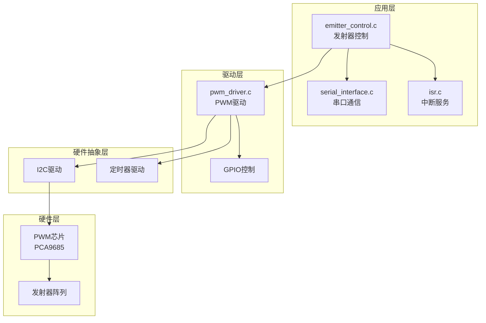
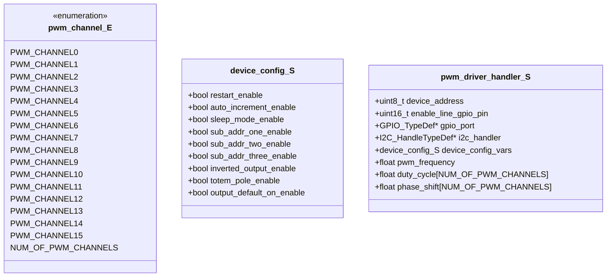
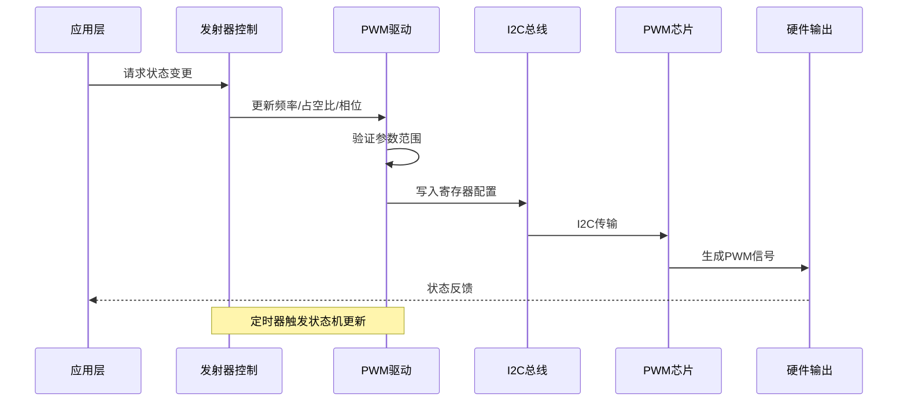
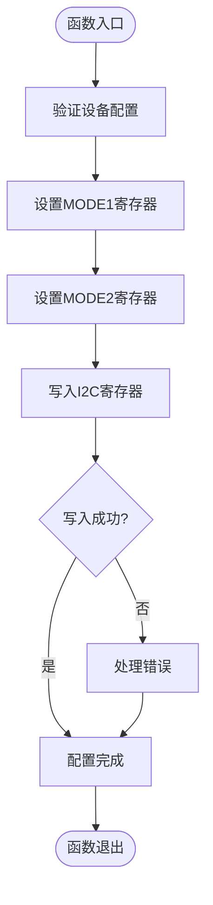
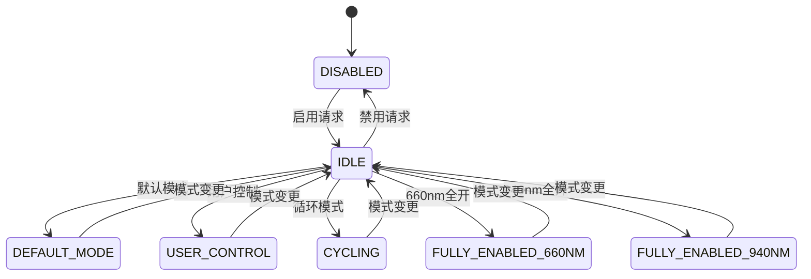
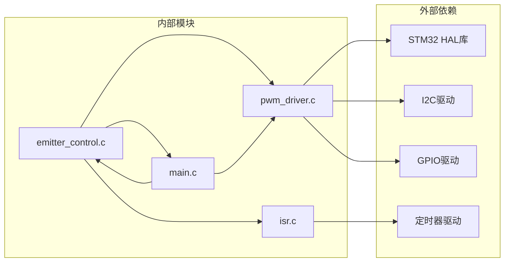

# PWM驱动API

<cite>
**本文档引用的文件**
- [pwm_driver.h](file://firmware/STM32/fNIRS/Core/Inc/pwm_driver.h)
- [pwm_driver.c](file://firmware/STM32/fNIRS/Core/Src/pwm_driver.c)
- [emitter_control.h](file://firmware/STM32/fNIRS/Core/Inc/emitter_control.h)
- [emitter_control.c](file://firmware/STM32/fNIRS/Core/Src/emitter_control.c)
- [main.h](file://firmware/STM32/fNIRS/Core/Inc/main.h)
- [main.c](file://firmware/STM32/fNIRS/Core/Src/main.c)
- [isr.h](file://firmware/STM32/fNIRS/Core/Inc/isr.h)
- [isr.c](file://firmware/STM32/fNIRS/Core/Src/isr.c)
</cite>

## 目录
1. [简介](#简介)
2. [项目结构](#项目结构)
3. [核心组件](#核心组件)
4. [架构概览](#架构概览)
5. [详细组件分析](#详细组件分析)
6. [依赖关系分析](#依赖关系分析)
7. [性能考虑](#性能考虑)
8. [故障排除指南](#故障排除指南)
9. [结论](#结论)
10. [附录](#附录)

## 简介

PWM驱动系统是一个基于STM32L476微控制器的高性能脉冲宽度调制控制系统，专为fNIRS（功能性近红外光谱）设备设计。该系统通过I2C接口控制外部PWM芯片，实现对多个发射器通道的精确控制，支持频率设置、占空比调节和相位控制功能。

本系统采用模块化设计，主要包含以下核心功能：
- 多通道PWM输出控制（16个独立通道）
- 频率可调范围从24Hz到1526Hz
- 占空比精度达到1/4096分辨率
- 相位偏移控制功能
- I2C通信协议实现
- 调试和故障保护机制

## 项目结构

PWM驱动系统位于STM32固件项目的Core目录中，采用分层架构设计：

**图表来源**
- [emitter_control.c:183-189](file://firmware/STM32/fNIRS/Core/Src/emitter_control.c#L183-L189)
- [pwm_driver.c:33-83](file://firmware/STM32/fNIRS/Core/Src/pwm_driver.c#L33-L83)
- [main.c:132-138](file://firmware/STM32/fNIRS/Core/Src/main.c#L132-L138)

**章节来源**
- [pwm_driver.h:1-81](file://firmware/STM32/fNIRS/Core/Inc/pwm_driver.h#L1-L81)
- [emitter_control.h:1-54](file://firmware/STM32/fNIRS/Core/Inc/emitter_control.h#L1-L54)
- [main.c:132-138](file://firmware/STM32/fNIRS/Core/Src/main.c#L132-L138)

## 核心组件

### PWM通道枚举定义

系统支持16个独立的PWM通道，每个通道都有唯一的标识符：

**图表来源**
- [pwm_driver.h:13-33](file://firmware/STM32/fNIRS/Core/Inc/pwm_driver.h#L13-L33)
- [pwm_driver.h:35-62](file://firmware/STM32/fNIRS/Core/Inc/pwm_driver.h#L35-L62)

### I2C通信协议

系统使用标准的I2C协议与PWM芯片通信，支持以下寄存器操作：

| 寄存器类型 | 地址范围 | 功能描述 |
|------------|----------|----------|
| 模式寄存器 | 0x00-0x01 | 设备配置和模式设置 |
| PWM控制寄存器 | 0x06-0x09 | 单独通道的PWM控制 |
| 全部通道寄存器 | 0xFA-0xFD | 批量控制所有通道 |
| 预分频寄存器 | 0xFE | 频率控制 |

**章节来源**
- [pwm_driver.c:7-29](file://firmware/STM32/fNIRS/Core/Src/pwm_driver.c#L7-L29)
- [pwm_driver.h:65-78](file://firmware/STM32/fNIRS/Core/Inc/pwm_driver.h#L65-L78)

## 架构概览

PWM驱动系统采用分层架构，从应用层到底层硬件的完整数据流如下：

**图表来源**
- [emitter_control.c:220-278](file://firmware/STM32/fNIRS/Core/Src/emitter_control.c#L220-L278)
- [pwm_driver.c:125-154](file://firmware/STM32/fNIRS/Core/Src/pwm_driver.c#L125-L154)

## 详细组件分析

### PWM驱动核心API

#### 初始化配置函数

`pwm_driver_config()` 函数负责PWM芯片的初始配置：

**图表来源**
- [pwm_driver.c:33-83](file://firmware/STM32/fNIRS/Core/Src/pwm_driver.c#L33-L83)

#### 频率设置函数

`pwm_driver_update_frequency()` 实现频率控制功能：

**章节来源**
- [pwm_driver.c:125-154](file://firmware/STM32/fNIRS/Core/Src/pwm_driver.c#L125-L154)
- [pwm_driver.h:71](file://firmware/STM32/fNIRS/Core/Inc/pwm_driver.h#L71)

#### 占空比和相位控制

系统支持两种控制模式：单通道独立控制和全通道批量控制。

**章节来源**
- [pwm_driver.c:156-220](file://firmware/STM32/fNIRS/Core/Src/pwm_driver.c#L156-L220)
- [pwm_driver.c:222-277](file://firmware/STM32/fNIRS/Core/Src/pwm_driver.c#L222-L277)

### 发射器控制管理

发射器控制模块负责协调多个PWM通道的工作模式：

**图表来源**
- [emitter_control.c:33-181](file://firmware/STM32/fNIRS/Core/Src/emitter_control.c#L33-L181)

**章节来源**
- [emitter_control.h:13-38](file://firmware/STM32/fNIRS/Core/Inc/emitter_control.h#L13-L38)
- [emitter_control.c:183-278](file://firmware/STM32/fNIRS/Core/Src/emitter_control.c#L183-L278)

### 调试功能

系统提供了完整的调试接口，包括寄存器读写功能：

**章节来源**
- [pwm_driver.h:75-78](file://firmware/STM32/fNIRS/Core/Inc/pwm_driver.h#L75-L78)
- [pwm_driver.c:279-298](file://firmware/STM32/fNIRS/Core/Src/pwm_driver.c#L279-L298)
- [emitter_control.c:285-290](file://firmware/STM32/fNIRS/Core/Src/emitter_control.c#L285-L290)

## 依赖关系分析

PWM驱动系统的关键依赖关系如下：

**图表来源**
- [main.c:25-31](file://firmware/STM32/fNIRS/Core/Src/main.c#L25-L31)
- [emitter_control.c:2-7](file://firmware/STM32/fNIRS/Core/Src/emitter_control.c#L2-L7)
- [pwm_driver.c:2-4](file://firmware/STM32/fNIRS/Core/Src/pwm_driver.c#L2-L4)

**章节来源**
- [main.c:53-62](file://firmware/STM32/fNIRS/Core/Src/main.c#L53-L62)
- [emitter_control.c:18-27](file://firmware/STM32/fNIRS/Core/Src/emitter_control.c#L18-L27)

## 性能考虑

### 频率特性

系统支持的频率范围和计算公式：
- 最小频率：24Hz（最大预分频值）
- 最大频率：1526Hz（最小预分频值）
- 内部振荡器频率：25MHz
- 计算公式：`prescale = (INTERNAL_OSC / (4096 * frequency)) - 1`

### 分辨率和精度

- 占空比分辨率：1/4096（12位精度）
- 相位控制分辨率：1/4096
- 频率控制精度：±1%

### 时序要求

- I2C通信速度：标准模式（100kHz）
- 最大I2C传输延迟：取决于总线负载
- PWM信号建立时间：由预分频和计数器决定

**章节来源**
- [pwm_driver.c:27-29](file://firmware/STM32/fNIRS/Core/Src/pwm_driver.c#L27-L29)
- [pwm_driver.c:129-144](file://firmware/STM32/fNIRS/Core/Src/pwm_driver.c#L129-L144)

## 故障排除指南

### 常见问题诊断

1. **PWM信号无输出**
   - 检查使能引脚状态
   - 验证I2C连接和地址配置
   - 确认睡眠模式已禁用

2. **频率设置异常**
   - 验证预分频值在有效范围内
   - 检查内部振荡器是否正常工作
   - 确认设备处于睡眠模式进行频率更改

3. **占空比控制失效**
   - 检查参数范围（0-1）
   - 验证相位偏移计算逻辑
   - 确认寄存器写入成功

### 调试工具使用

**章节来源**
- [pwm_driver.c:285-297](file://firmware/STM32/fNIRS/Core/Src/pwm_driver.c#L285-L297)
- [emitter_control.c:286-289](file://firmware/STM32/fNIRS/Core/Src/emitter_control.c#L286-L289)

## 结论

PWM驱动系统是一个功能完整、性能可靠的脉冲宽度调制控制系统。其特点包括：

1. **高精度控制**：支持1/4096分辨率的占空比和相位控制
2. **灵活配置**：16通道独立控制，支持多种工作模式
3. **稳定可靠**：完善的错误处理和故障保护机制
4. **易于调试**：完整的调试接口和寄存器访问功能

该系统为fNIRS设备提供了精确的光源控制能力，能够满足功能性近红外光谱检测对光源稳定性和精度的严格要求。

## 附录

### API参考表

| 函数名 | 参数 | 返回值 | 描述 |
|--------|------|--------|------|
| `pwm_driver_config` | `pwm_driver_handler_S*` | `void` | 初始化PWM芯片配置 |
| `pwm_driver_update_frequency` | `handler, frequency_hz` | `void` | 设置PWM频率 |
| `pwm_driver_update_individual_patterns` | `handler, channel, duty, phase` | `void` | 单通道控制 |
| `pwm_driver_update_all_patterns` | `handler, duty, phase` | `void` | 批量控制 |
| `emitter_control_init` | `I2C_HandleTypeDef*` | `void` | 初始化发射器控制 |
| `emitter_control_enable` | `void` | `void` | 启用发射器控制 |
| `emitter_control_disable` | `void` | `void` | 禁用发射器控制 |

### 硬件限制

- **通道数量**：16个独立PWM通道
- **频率范围**：24Hz - 1526Hz
- **占空比范围**：0.0% - 100.0%
- **相位范围**：0.0 - 1.0（相对于周期）
- **I2C地址**：0x70 - 0x77（根据硬件配置）

### 最佳实践

1. **初始化顺序**：先配置I2C，再初始化PWM驱动
2. **频率设置**：在睡眠模式下进行频率更改
3. **参数验证**：始终验证输入参数的有效性
4. **错误处理**：实现适当的超时和重试机制
5. **调试策略**：使用调试接口定期检查寄存器状态