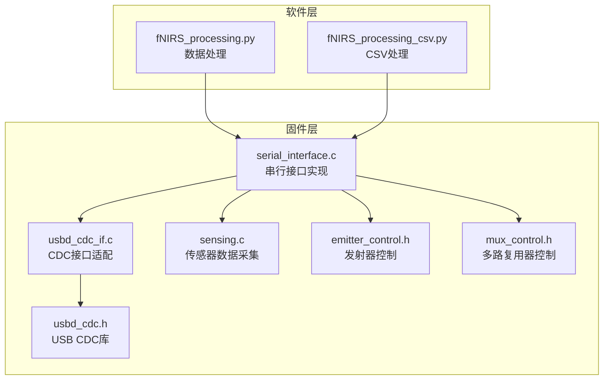
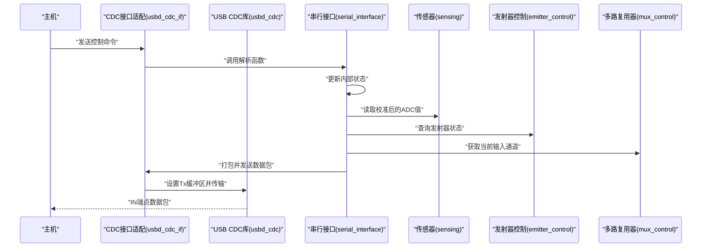
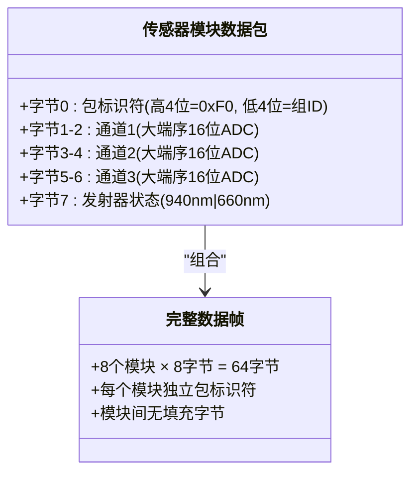
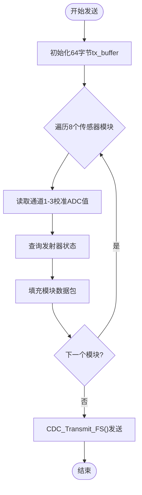
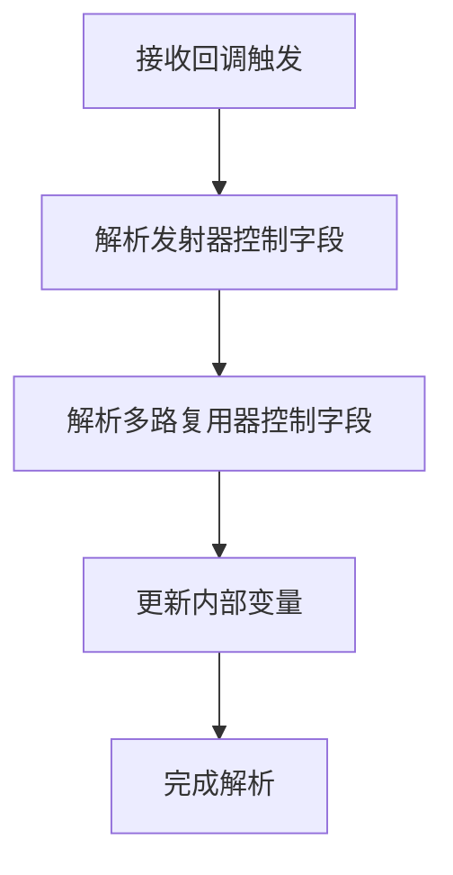
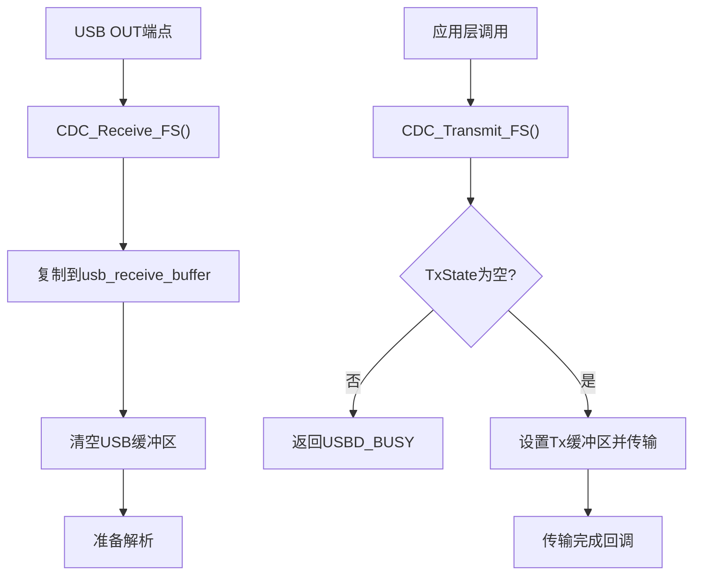
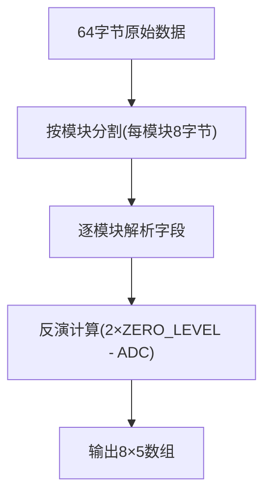
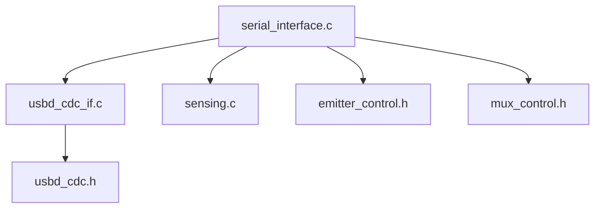

# 串行通信接口API

<cite>
**本文档引用的文件**
- [serial_interface.h](file://firmware/STM32/fNIRS/Core/Inc/serial_interface.h)
- [serial_interface.c](file://firmware/STM32/fNIRS/Core/Src/serial_interface.c)
- [usbd_cdc_if.h](file://firmware/STM32/fNIRS/USB_DEVICE/App/usbd_cdc_if.h)
- [usbd_cdc_if.c](file://firmware/STM32/fNIRS/USB_DEVICE/App/usbd_cdc_if.c)
- [usbd_cdc.h](file://firmware/STM32/fNIRS/Middlewares/ST/STM32_USB_Device_Library/Class/CDC/Inc/usbd_cdc.h)
- [sensing.h](file://firmware/STM32/fNIRS/Core/Inc/sensing.h)
- [sensing.c](file://firmware/STM32/fNIRS/Core/Src/sensing.c)
- [emitter_control.h](file://firmware/STM32/fNIRS/Core/Inc/emitter_control.h)
- [mux_control.h](file://firmware/STM32/fNIRS/Core/Inc/mux_control.h)
- [fNIRS_processing.py](file://software/fNIRS_processing.py)
- [fNIRS_processing_csv.py](file://software/testing-scripts/fNIRS_processing_csv.py)
</cite>

## 目录
1. [简介](#简介)
2. [项目结构](#项目结构)
3. [核心组件](#核心组件)
4. [架构概览](#架构概览)
5. [详细组件分析](#详细组件分析)
6. [依赖关系分析](#依赖关系分析)
7. [性能考虑](#性能考虑)
8. [故障排除指南](#故障排除指南)
9. [结论](#结论)
10. [附录](#附录)

## 简介
本文件为fNIRS设备的串行通信接口API文档，专注于USB CDC协议在STM32微控制器上的实现。该接口负责：
- 数据发送：将传感器数据打包并通过CDC接口发送到主机
- 数据接收：解析来自主机的控制命令并更新系统状态
- 缓冲区管理：管理USB收发缓冲区及数据包格式
- 通信状态查询：提供发射器状态、多路复用器状态等查询接口

文档详细说明了数据包格式（每模块8字节，共8个模块）、传感器组标识符、ADC数值编码方式以及校验机制，并提供了完整的初始化配置、波特率设置和数据传输协议说明。

## 项目结构
与串行通信接口直接相关的文件组织如下：
- 接口头文件与实现：serial_interface.h/.c
- USB CDC适配层：usbd_cdc_if.h/.c
- USB CDC库：usbd_cdc.h
- 传感器与发射器控制：sensing.h/.c、emitter_control.h、mux_control.h
- 数据处理脚本：fNIRS_processing.py、fNIRS_processing_csv.py

**图表来源**
- [serial_interface.c:1-82](file://firmware/STM32/fNIRS/Core/Src/serial_interface.c#L1-L82)
- [usbd_cdc_if.c:1-333](file://firmware/STM32/fNIRS/USB_DEVICE/App/usbd_cdc_if.c#L1-L333)
- [usbd_cdc.h:1-185](file://firmware/STM32/fNIRS/Middlewares/ST/STM32_USB_Device_Library/Class/CDC/Inc/usbd_cdc.h#L1-L185)
- [sensing.c:1-84](file://firmware/STM32/fNIRS/Core/Src/sensing.c#L1-L84)
- [emitter_control.h:1-54](file://firmware/STM32/fNIRS/Core/Inc/emitter_control.h#L1-L54)
- [mux_control.h:1-56](file://firmware/STM32/fNIRS/Core/Inc/mux_control.h#L1-L56)
- [fNIRS_processing.py:160-185](file://software/fNIRS_processing.py#L160-L185)
- [fNIRS_processing_csv.py:161-186](file://software/testing-scripts/fNIRS_processing_csv.py#L161-L186)

**章节来源**
- [serial_interface.h:1-64](file://firmware/STM32/fNIRS/Core/Inc/serial_interface.h#L1-L64)
- [serial_interface.c:1-82](file://firmware/STM32/fNIRS/Core/Src/serial_interface.c#L1-L82)
- [usbd_cdc_if.h:1-132](file://firmware/STM32/fNIRS/USB_DEVICE/App/usbd_cdc_if.h#L1-L132)
- [usbd_cdc_if.c:1-333](file://firmware/STM32/fNIRS/USB_DEVICE/App/usbd_cdc_if.c#L1-L333)
- [usbd_cdc.h:1-185](file://firmware/STM32/fNIRS/Middlewares/ST/STM32_USB_Device_Library/Class/CDC/Inc/usbd_cdc.h#L1-L185)
- [sensing.h:1-71](file://firmware/STM32/fNIRS/Core/Inc/sensing.h#L1-L71)
- [sensing.c:1-84](file://firmware/STM32/fNIRS/Core/Src/sensing.c#L1-L84)
- [emitter_control.h:1-54](file://firmware/STM32/fNIRS/Core/Inc/emitter_control.h#L1-L54)
- [mux_control.h:1-56](file://firmware/STM32/fNIRS/Core/Inc/mux_control.h#L1-L56)
- [fNIRS_processing.py:160-185](file://software/fNIRS_processing.py#L160-L185)
- [fNIRS_processing_csv.py:161-186](file://software/testing-scripts/fNIRS_processing_csv.py#L161-L186)

## 核心组件
本节概述串行通信接口的核心功能与数据结构。

- 串行接口API
  - 接收解析：serial_interface_rx_parse_data()
  - 发送数据：serial_interface_tx_send_sensor_data()
  - 查询接口：获取发射器控制状态、多路复用器状态等

- USB CDC接口
  - 发送函数：CDC_Transmit_FS()
  - 接收回调：CDC_Receive_FS()
  - 控制请求处理：CDC_Control_FS()

- 传感器与控制
  - 传感器数据：sensing_get_sensor_calibrated_value()
  - 发射器状态：emitter_control_is_emitter_active()
  - 多路复用器：mux_control_get_curr_input_channel()

**章节来源**
- [serial_interface.h:53-62](file://firmware/STM32/fNIRS/Core/Inc/serial_interface.h#L53-L62)
- [serial_interface.c:20-81](file://firmware/STM32/fNIRS/Core/Src/serial_interface.c#L20-L81)
- [usbd_cdc_if.h:108](file://firmware/STM32/fNIRS/USB_DEVICE/App/usbd_cdc_if.h#L108)
- [usbd_cdc_if.c:261-297](file://firmware/STM32/fNIRS/USB_DEVICE/App/usbd_cdc_if.c#L261-L297)
- [sensing.c:58-84](file://firmware/STM32/fNIRS/Core/Src/sensing.c#L58-L84)
- [emitter_control.h:42](file://firmware/STM32/fNIRS/Core/Inc/emitter_control.h#L42)
- [mux_control.h:43-49](file://firmware/STM32/fNIRS/Core/Inc/mux_control.h#L43-L49)

## 架构概览
下图展示了从应用层到USB CDC中间件的数据通路，以及数据包生成与发送流程。

**图表来源**
- [serial_interface.c:20-81](file://firmware/STM32/fNIRS/Core/Src/serial_interface.c#L20-L81)
- [usbd_cdc_if.c:261-297](file://firmware/STM32/fNIRS/USB_DEVICE/App/usbd_cdc_if.c#L261-L297)
- [usbd_cdc.h:107-129](file://firmware/STM32/fNIRS/Middlewares/ST/STM32_USB_Device_Library/Class/CDC/Inc/usbd_cdc.h#L107-L129)
- [sensing.c:58-84](file://firmware/STM32/fNIRS/Core/Src/sensing.c#L58-L84)
- [emitter_control.h:42](file://firmware/STM32/fNIRS/Core/Inc/emitter_control.h#L42)
- [mux_control.h:43-49](file://firmware/STM32/fNIRS/Core/Inc/mux_control.h#L43-L49)

## 详细组件分析

### 数据包格式定义
每个传感器模块发送一个8字节的数据包，共8个模块构成一个完整的64字节数据包。数据包布局如下：

- 字节0：包标识符（Packet Identifier）
  - 高4位固定为1111（0xF0），低4位为传感器组标识符（0-7）
  - 用于标识具体传感器组并提供简单校验

- 字节1-2：通道1高字节与低字节（Channel 1）
  - 使用大端序存储16位ADC值

- 字节3-4：通道2高字节与低字节（Channel 2）
  - 使用大端序存储16位ADC值

- 字节5-6：通道3高字节与低字节（Channel 3）
  - 使用大端序存储16位ADC值

- 字节7：发射器状态（Emitter Status）
  - 位1：940nm发射器状态（0或1）
  - 位0：660nm发射器状态（0或1）

**图表来源**
- [serial_interface.c:70-77](file://firmware/STM32/fNIRS/Core/Src/serial_interface.c#L70-L77)
- [serial_interface.h:28-37](file://firmware/STM32/fNIRS/Core/Inc/serial_interface.h#L28-L37)

**章节来源**
- [serial_interface.c:60-81](file://firmware/STM32/fNIRS/Core/Src/serial_interface.c#L60-L81)
- [serial_interface.h:26-38](file://firmware/STM32/fNIRS/Core/Inc/serial_interface.h#L26-L38)

### 数据发送函数
serial_interface_tx_send_sensor_data()负责：
- 读取每个传感器模块的三个通道校准后ADC值
- 查询对应发射器（660nm/940nm）是否开启
- 按照上述格式填充64字节缓冲区
- 调用CDC_Transmit_FS()发送数据

**图表来源**
- [serial_interface.c:59-81](file://firmware/STM32/fNIRS/Core/Src/serial_interface.c#L59-L81)
- [usbd_cdc_if.c:285-297](file://firmware/STM32/fNIRS/USB_DEVICE/App/usbd_cdc_if.c#L285-L297)

**章节来源**
- [serial_interface.c:59-81](file://firmware/STM32/fNIRS/Core/Src/serial_interface.c#L59-L81)
- [usbd_cdc_if.c:285-297](file://firmware/STM32/fNIRS/USB_DEVICE/App/usbd_cdc_if.c#L285-L297)

### 数据接收函数
serial_interface_rx_parse_data()解析来自主机的控制命令：
- 解析发射器控制覆盖使能标志
- 设置发射器工作状态
- 读取用户PWM控制掩码
- 解析多路复用器覆盖使能与目标通道

**图表来源**
- [serial_interface.c:20-32](file://firmware/STM32/fNIRS/Core/Src/serial_interface.c#L20-L32)

**章节来源**
- [serial_interface.c:20-32](file://firmware/STM32/fNIRS/Core/Src/serial_interface.c#L20-L32)

### 缓冲区管理函数
- CDC接口适配层提供APP_RX_DATA_SIZE和APP_TX_DATA_SIZE缓冲区
- CDC_Receive_FS()将USB OUT端点数据复制到usb_receive_buffer并清零
- CDC_Transmit_FS()检查TxState状态，避免重复传输

**图表来源**
- [usbd_cdc_if.c:91-94](file://firmware/STM32/fNIRS/USB_DEVICE/App/usbd_cdc_if.c#L91-L94)
- [usbd_cdc_if.c:261-272](file://firmware/STM32/fNIRS/USB_DEVICE/App/usbd_cdc_if.c#L261-L272)
- [usbd_cdc_if.c:285-297](file://firmware/STM32/fNIRS/USB_DEVICE/App/usbd_cdc_if.c#L285-L297)

**章节来源**
- [usbd_cdc_if.h:50-52](file://firmware/STM32/fNIRS/USB_DEVICE/App/usbd_cdc_if.h#L50-L52)
- [usbd_cdc_if.c:91-94](file://firmware/STM32/fNIRS/USB_DEVICE/App/usbd_cdc_if.c#L91-L94)
- [usbd_cdc_if.c:261-297](file://firmware/STM32/fNIRS/USB_DEVICE/App/usbd_cdc_if.c#L261-L297)

### 通信状态查询函数
- 获取发射器控制覆盖使能：serial_interface_rx_get_user_emitter_control_override_enable()
- 获取发射器状态：serial_interface_rx_get_emitter_control_state()
- 获取用户发射器控制掩码：serial_interface_rx_get_user_emitter_controls()
- 获取多路复用器覆盖使能：serial_interface_rx_get_user_mux_control_override_enable()
- 获取多路复用器状态：serial_interface_rx_get_user_mux_control_state()

**章节来源**
- [serial_interface.c:34-57](file://firmware/STM32/fNIRS/Core/Src/serial_interface.c#L34-L57)

### 初始化配置与波特率设置
- USB CDC配置
  - IN/OUT端点最大包大小：64字节（全速）
  - 控制端点包大小：8字节
  - 端点参数：CDC_IN_EP=0x81, CDC_OUT_EP=0x01, CDC_CMD_EP=0x82
- 应用层缓冲区
  - APP_RX_DATA_SIZE=2048, APP_TX_DATA_SIZE=2048
- 波特率设置
  - 通过CDC SET_LINE_CODING控制请求设置比特率、停止位、奇偶校验、数据位数
  - 当前实现中CDC_Control_FS()未实际处理SET_LINE_CODING参数

**章节来源**
- [usbd_cdc.h:43-86](file://firmware/STM32/fNIRS/Middlewares/ST/STM32_USB_Device_Library/Class/CDC/Inc/usbd_cdc.h#L43-L86)
- [usbd_cdc_if.h:50-52](file://firmware/STM32/fNIRS/USB_DEVICE/App/usbd_cdc_if.h#L50-L52)
- [usbd_cdc_if.c:180-244](file://firmware/STM32/fNIRS/USB_DEVICE/App/usbd_cdc_if.c#L180-L244)

### 错误处理机制与超时管理
- 传输状态检查
  - CDC_Transmit_FS()检查USBD_CDC_HandleTypeDef->TxState，若非空则返回USBD_BUSY
- 接收回调
  - CDC_Receive_FS()在处理完数据后返回USBD_OK
- 超时与重传
  - 代码未实现显式超时与自动重传逻辑
  - 建议在应用层实现基于时间戳的超时检测与重传策略

**章节来源**
- [usbd_cdc_if.c:285-297](file://firmware/STM32/fNIRS/USB_DEVICE/App/usbd_cdc_if.c#L285-L297)
- [usbd_cdc.h:117-129](file://firmware/STM32/fNIRS/Middlewares/ST/STM32_USB_Device_Library/Class/CDC/Inc/usbd_cdc.h#L117-L129)

### 协议解析示例
软件侧提供了数据包解析示例，展示如何将64字节原始数据解析为8×5的数组：
- 每个模块占8字节
- 字段顺序：包标识符、通道1、通道2、通道3、发射器状态
- 反演计算：使用2×ZERO_LEVEL减去ADC值进行反演

**图表来源**
- [fNIRS_processing.py:160-185](file://software/fNIRS_processing.py#L160-L185)
- [fNIRS_processing_csv.py:161-186](file://software/testing-scripts/fNIRS_processing_csv.py#L161-L186)

**章节来源**
- [fNIRS_processing.py:160-185](file://software/fNIRS_processing.py#L160-L185)
- [fNIRS_processing_csv.py:161-186](file://software/testing-scripts/fNIRS_processing_csv.py#L161-L186)

## 依赖关系分析
串行通信接口的依赖关系如下：

**图表来源**
- [serial_interface.c:1-7](file://firmware/STM32/fNIRS/Core/Src/serial_interface.c#L1-L7)
- [usbd_cdc_if.c:22](file://firmware/STM32/fNIRS/USB_DEVICE/App/usbd_cdc_if.c#L22)
- [usbd_cdc.h:28](file://firmware/STM32/fNIRS/Middlewares/ST/STM32_USB_Device_Library/Class/CDC/Inc/usbd_cdc.h#L28)

**章节来源**
- [serial_interface.c:1-7](file://firmware/STM32/fNIRS/Core/Src/serial_interface.c#L1-L7)
- [usbd_cdc_if.c:22](file://firmware/STM32/fNIRS/USB_DEVICE/App/usbd_cdc_if.c#L22)
- [usbd_cdc.h:28](file://firmware/STM32/fNIRS/Middlewares/ST/STM32_USB_Device_Library/Class/CDC/Inc/usbd_cdc.h#L28)

## 性能考虑
- 数据包大小：单次传输64字节，适合全速USB（FS）环境
- ADC采样：使用DMA连续采样，减少CPU占用
- 传输频率：建议根据应用需求调整发送周期，避免带宽拥塞
- 内存使用：APP_RX_DATA_SIZE和APP_TX_DATA_SIZE均为2048字节，需确保系统内存充足

## 故障排除指南
- 传输失败（USBD_BUSY）
  - 检查CDC_Transmit_FS()返回值，避免并发传输
  - 确保上一次传输完成后再发起新传输
- 接收数据异常
  - 验证CDC_Receive_FS()是否正确复制数据到usb_receive_buffer
  - 检查usb_receive_buffer长度是否为64字节
- 数据解析错误
  - 确认软件侧解析逻辑与硬件侧数据包格式一致
  - 注意大端序与反演计算的实现

**章节来源**
- [usbd_cdc_if.c:285-297](file://firmware/STM32/fNIRS/USB_DEVICE/App/usbd_cdc_if.c#L285-L297)
- [usbd_cdc_if.c:261-272](file://firmware/STM32/fNIRS/USB_DEVICE/App/usbd_cdc_if.c#L261-L272)
- [fNIRS_processing.py:160-185](file://software/fNIRS_processing.py#L160-L185)

## 结论
本串行通信接口API基于USB CDC协议实现了稳定的传感器数据传输与控制命令接收。通过清晰的数据包格式、完善的缓冲区管理与状态查询接口，系统能够高效地将8个传感器模块的ADC数据以64字节帧的形式发送至主机。建议在未来版本中增强错误处理与超时重传机制，以提升系统鲁棒性。

## 附录

### API函数清单
- 数据发送
  - serial_interface_tx_send_sensor_data()
- 数据接收
  - serial_interface_rx_parse_data()
  - serial_interface_rx_get_user_emitter_control_override_enable()
  - serial_interface_rx_get_emitter_control_state()
  - serial_interface_rx_get_user_emitter_controls()
  - serial_interface_rx_get_user_mux_control_override_enable()
  - serial_interface_rx_get_user_mux_control_state()
- CDC接口
  - CDC_Transmit_FS()
  - CDC_Receive_FS()
  - CDC_Control_FS()

**章节来源**
- [serial_interface.h:55-62](file://firmware/STM32/fNIRS/Core/Inc/serial_interface.h#L55-L62)
- [usbd_cdc_if.h:108](file://firmware/STM32/fNIRS/USB_DEVICE/App/usbd_cdc_if.h#L108)
- [usbd_cdc_if.c:261-297](file://firmware/STM32/fNIRS/USB_DEVICE/App/usbd_cdc_if.c#L261-L297)