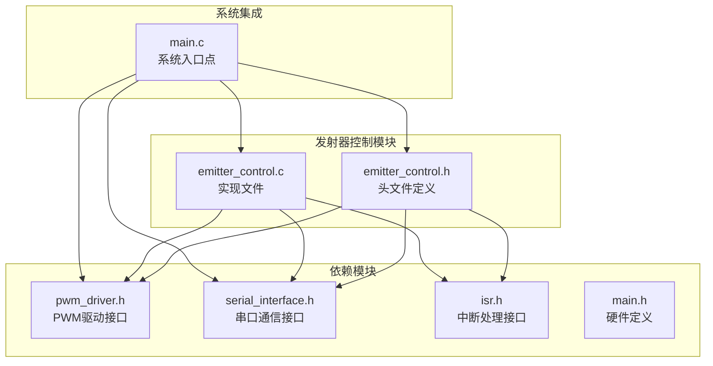
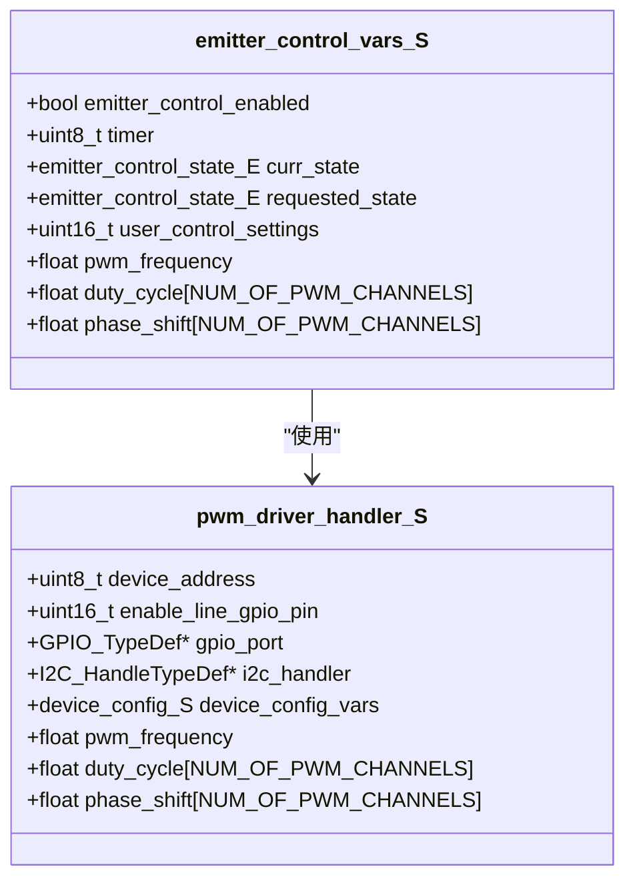
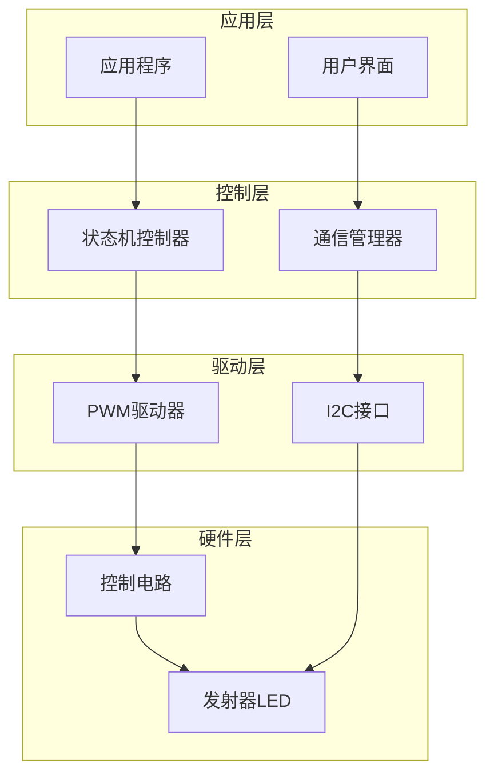
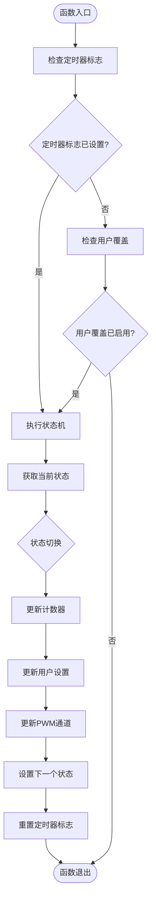
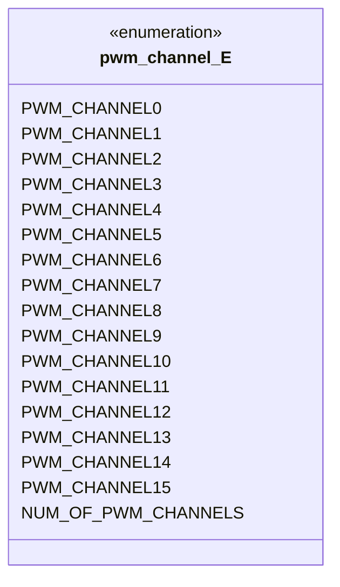
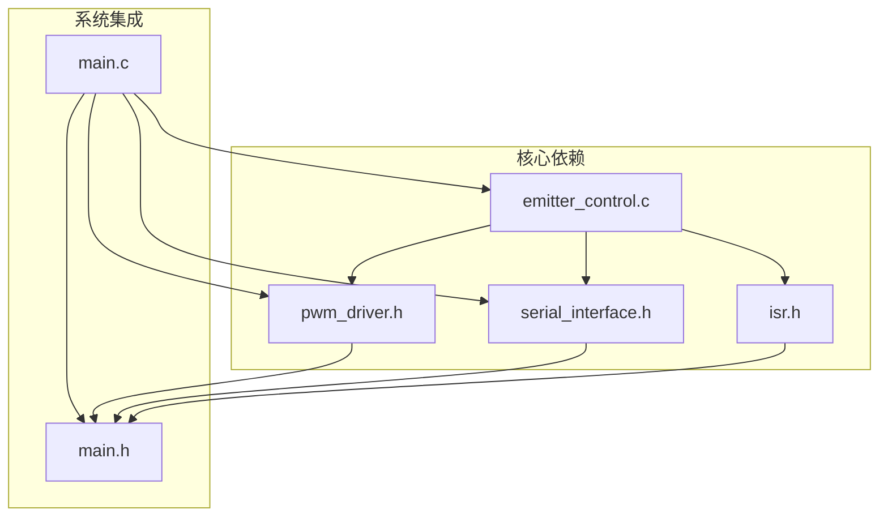
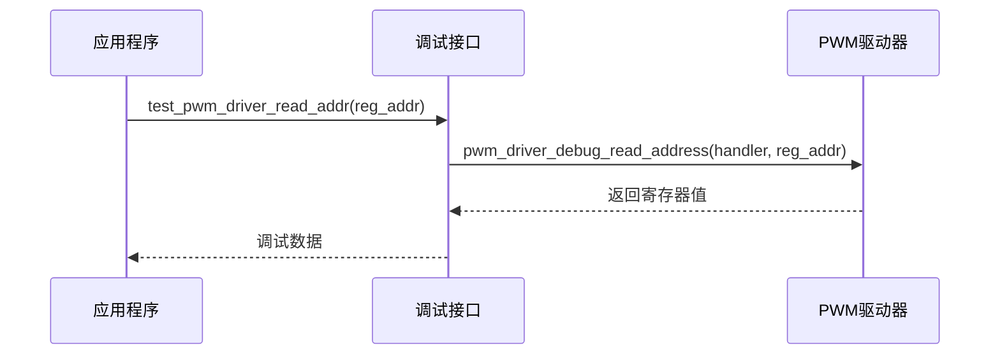

# 发射器控制API

<cite>
**本文档中引用的文件**
- [emitter_control.h](file://firmware/STM32/fNIRS/Core/Inc/emitter_control.h)
- [emitter_control.c](file://firmware/STM32/fNIRS/Core/Src/emitter_control.c)
- [pwm_driver.h](file://firmware/STM32/fNIRS/Core/Inc/pwm_driver.h)
- [serial_interface.h](file://firmware/STM32/fNIRS/Core/Inc/serial_interface.h)
- [main.h](file://firmware/STM32/fNIRS/Core/Inc/main.h)
- [main.c](file://firmware/STM32/fNIRS/Core/Src/main.c)
- [isr.h](file://firmware/STM32/fNIRS/Core/Inc/isr.h)
</cite>

## 目录
1. [简介](#简介)
2. [项目结构](#项目结构)
3. [核心组件](#核心组件)
4. [架构概览](#架构概览)
5. [详细组件分析](#详细组件分析)
6. [依赖关系分析](#依赖关系分析)
7. [性能考虑](#性能考虑)
8. [故障排除指南](#故障排除指南)
9. [结论](#结论)

## 简介

发射器控制系统是fNIRS（功能性近红外光谱）设备中的关键组件，负责控制近红外光源的发射器。该系统通过PWM驱动器控制多个发射器通道，支持多种工作模式和动态配置。系统采用状态机架构，通过I2C通信与外部设备交互，并提供完整的调试功能。

## 项目结构

发射器控制系统位于STM32固件项目的Core目录下，主要包含以下文件：

**图表来源**
- [emitter_control.h:1-54](file://firmware/STM32/fNIRS/Core/Inc/emitter_control.h#L1-L54)
- [emitter_control.c:1-291](file://firmware/STM32/fNIRS/Core/Src/emitter_control.c#L1-L291)
- [main.c:120-140](file://firmware/STM32/fNIRS/Core/Src/main.c#L120-L140)

**章节来源**
- [emitter_control.h:1-54](file://firmware/STM32/fNIRS/Core/Inc/emitter_control.h#L1-L54)
- [emitter_control.c:1-291](file://firmware/STM32/fNIRS/Core/Src/emitter_control.c#L1-L291)
- [main.c:120-140](file://firmware/STM32/fNIRS/Core/Src/main.c#L120-L140)

## 核心组件

发射器控制系统包含以下核心组件：

### 状态枚举类型
系统定义了7种不同的发射器控制状态：
- **DISABLED**: 禁用状态，所有发射器关闭
- **IDLE**: 空闲状态，系统就绪但未激活
- **DEFAULT_MODE**: 默认模式，按模块配置自动分配波长
- **USER_CONTROL**: 用户控制模式，允许用户自定义发射器配置
- **CYCLING**: 轮询模式，按顺序激活不同发射器
- **FULLY_ENABLED_660NM**: 全部启用660nm波长
- **FULLY_ENABLED_940NM**: 全部启用940nm波长

### 数据结构
系统使用两个主要数据结构来管理状态和配置：

#### 发射器控制变量结构体

**图表来源**
- [emitter_control.h:26-38](file://firmware/STM32/fNIRS/Core/Inc/emitter_control.h#L26-L38)
- [pwm_driver.h:49-62](file://firmware/STM32/fNIRS/Core/Inc/pwm_driver.h#L49-L62)

**章节来源**
- [emitter_control.h:13-38](file://firmware/STM32/fNIRS/Core/Inc/emitter_control.h#L13-L38)
- [pwm_driver.h:35-62](file://firmware/STM32/fNIRS/Core/Inc/pwm_driver.h#L35-L62)

## 架构概览

发射器控制系统采用分层架构设计，各组件职责明确：

**图表来源**
- [emitter_control.c:183-189](file://firmware/STM32/fNIRS/Core/Src/emitter_control.c#L183-L189)
- [main.c:132-138](file://firmware/STM32/fNIRS/Core/Src/main.c#L132-L138)

系统的工作流程如下：

1. **初始化阶段**: 系统启动时初始化I2C接口和PWM驱动器
2. **状态监控**: 定时器中断触发状态机检查
3. **模式切换**: 根据用户输入或系统状态进行模式转换
4. **参数更新**: 更新PWM频率、占空比和相位
5. **硬件控制**: 通过I2C发送配置到PWM驱动器

**章节来源**
- [emitter_control.c:220-278](file://firmware/STM32/fNIRS/Core/Src/emitter_control.c#L220-L278)
- [main.c:140-178](file://firmware/STM32/fNIRS/Core/Src/main.c#L140-L178)

## 详细组件分析

### 初始化函数

#### emitter_control_init()
初始化发射器控制系统，配置I2C通信和PWM驱动器。

**函数原型**: `void emitter_control_init(I2C_HandleTypeDef* hi2c)`

**参数**:
- `hi2c`: I2C句柄指针，指向已初始化的I2C外设

**功能**:
1. 设置PWM驱动器的I2C处理器
2. 启用推挽输出配置
3. 断言使能引脚
4. 配置PWM驱动器

**章节来源**
- [emitter_control.c:183-189](file://firmware/STM32/fNIRS/Core/Src/emitter_control.c#L183-L189)
- [emitter_control.h:41](file://firmware/STM32/fNIRS/Core/Inc/emitter_control.h#L41)

### 状态查询函数

#### emitter_control_is_emitter_active()
检查指定通道的发射器是否处于激活状态。

**函数原型**: `bool emitter_control_is_emitter_active(pwm_channel_E channel)`

**参数**:
- `channel`: PWM通道枚举值

**返回值**: 
- `true`: 发射器处于激活状态
- `false`: 发射器处于关闭状态

**实现逻辑**: 检查对应通道的占空比是否大于0

**章节来源**
- [emitter_control.c:280-283](file://firmware/STM32/fNIRS/Core/Src/emitter_control.c#L280-L283)
- [emitter_control.h:42](file://firmware/STM32/fNIRS/Core/Inc/emitter_control.h#L42)

### 启用/禁用函数

#### emitter_control_enable()
启用发射器控制系统。

**函数原型**: `void emitter_control_enable(void)`

**功能**:
1. 设置系统启用标志
2. 取消断言使能引脚（硬件逻辑）

**章节来源**
- [emitter_control.c:191-196](file://firmware/STM32/fNIRS/Core/Src/emitter_control.c#L191-L196)
- [emitter_control.h:43](file://firmware/STM32/fNIRS/Core/Inc/emitter_control.h#L43)

#### emitter_control_disable()
禁用发射器控制系统。

**函数原型**: `void emitter_control_disable(void)`

**功能**:
1. 断言使能引脚
2. 设置系统禁用标志

**章节来源**
- [emitter_control.c:198-202](file://firmware/STM32/fNIRS/Core/Src/emitter_control.c#L198-L202)
- [emitter_control.h:44](file://firmware/STM32/fNIRS/Core/Inc/emitter_control.h#L44)

### 操作模式请求函数

#### emitter_control_request_operating_mode()
请求新的操作模式。

**函数原型**: `void emitter_control_request_operating_mode(emitter_control_state_E state)`

**参数**:
- `state`: 目标操作模式枚举值

**功能**: 将请求的状态存储到`requested_state`变量中

**章节来源**
- [emitter_control.c:204-207](file://firmware/STM32/fNIRS/Core/Src/emitter_control.c#L204-L207)
- [emitter_control.h:45](file://firmware/STM32/fNIRS/Core/Inc/emitter_control.h#L45)

### 频率更新函数

#### emitter_control_update_frequency()
更新PWM频率设置。

**函数原型**: `void emitter_control_update_frequency(float frequency)`

**参数**:
- `frequency`: 新的PWM频率值（Hz）

**功能**: 更新全局频率设置，实际应用在状态机中

**章节来源**
- [emitter_control.c:209-212](file://firmware/STM32/fNIRS/Core/Src/emitter_control.c#L209-L212)
- [emitter_control.h:46](file://firmware/STM32/fNIRS/Core/Inc/emitter_control.h#L46)

### 占空比和相位更新函数

#### emitter_control_update_duty_and_phase()
更新单个PWM通道的占空比和相位。

**函数原型**: `void emitter_control_update_duty_and_phase(pwm_channel_E channel, float duty_cycle, float phase_shift)`

**参数**:
- `channel`: PWM通道枚举值
- `duty_cycle`: 占空比（0.0-1.0）
- `phase_shift`: 相位偏移（度）

**功能**: 更新指定通道的占空比和相位设置

**章节来源**
- [emitter_control.c:214-218](file://firmware/STM32/fNIRS/Core/Src/emitter_control.c#L214-L218)
- [emitter_control.h:47](file://firmware/STM32/fNIRS/Core/Inc/emitter_control.h#L47)

### 状态机主函数

#### emitter_control_state_machine()
执行发射器控制状态机的主要逻辑。

**函数原型**: `void emitter_control_state_machine(void)`

**执行流程**:

**图表来源**
- [emitter_control.c:220-278](file://firmware/STM32/fNIRS/Core/Src/emitter_control.c#L220-L278)

**状态机逻辑**:
1. **DISABLED状态**: 当启用或请求状态改变时转到IDLE
2. **IDLE状态**: 根据启用状态和请求状态决定下一状态
3. **其他状态**: 当禁用时回到DISABLED，当有新请求时回到IDLE

**章节来源**
- [emitter_control.c:220-278](file://firmware/STM32/fNIRS/Core/Src/emitter_control.c#L220-L278)

### PWM通道枚举

系统支持16个PWM通道，每个通道对应一个发射器：

**图表来源**
- [pwm_driver.h:13-33](file://firmware/STM32/fNIRS/Core/Inc/pwm_driver.h#L13-L33)

**章节来源**
- [pwm_driver.h:13-33](file://firmware/STM32/fNIRS/Core/Inc/pwm_driver.h#L13-L33)

## 依赖关系分析

发射器控制系统与其他模块的依赖关系如下：

**图表来源**
- [emitter_control.c:3-6](file://firmware/STM32/fNIRS/Core/Src/emitter_control.c#L3-L6)
- [main.c:25-30](file://firmware/STM32/fNIRS/Core/Src/main.c#L25-L30)

**依赖分析**:
- **PWM驱动器**: 提供底层硬件抽象
- **串口接口**: 处理用户输入和状态反馈
- **中断服务**: 提供定时器中断支持
- **系统配置**: 定义硬件引脚和外设配置

**章节来源**
- [emitter_control.c:3-6](file://firmware/STM32/fNIRS/Core/Src/emitter_control.c#L3-L6)
- [main.c:25-30](file://firmware/STM32/fNIRS/Core/Src/main.c#L25-L30)

## 性能考虑

### I2C通信优化
- **时钟配置**: 使用标准模式（100kHz），确保稳定性和兼容性
- **过滤器设置**: 启用模拟滤波器，减少噪声干扰
- **地址映射**: 使用7位寻址模式，支持标准I2C设备

### PWM控制性能
- **频率范围**: 支持1500Hz默认频率，可动态调整
- **通道独立控制**: 每个通道可独立配置占空比和相位
- **相位对齐**: 支持相位偏移，实现精确的时间控制

### 状态机效率
- **定时器驱动**: 基于定时器中断的状态检查
- **条件执行**: 仅在必要时更新PWM配置
- **标志机制**: 使用标志位避免不必要的状态转换

## 故障排除指南

### 常见问题及解决方案

#### I2C通信失败
**症状**: PWM驱动器无法响应
**可能原因**:
- I2C总线冲突
- 设备地址错误
- 时序配置不当

**解决步骤**:
1. 检查I2C引脚连接
2. 验证设备地址配置
3. 确认时钟频率设置

#### PWM输出异常
**症状**: 发射器不按预期工作
**可能原因**:
- 使能信号错误
- 频率配置问题
- 占空比超出范围

**解决步骤**:
1. 检查使能引脚状态
2. 验证频率设置范围
3. 确认占空比在有效范围内

#### 状态机卡死
**症状**: 系统停止响应状态变化
**可能原因**:
- 定时器中断未触发
- 状态标志未重置
- 用户覆盖设置冲突

**解决步骤**:
1. 检查定时器配置
2. 验证中断标志处理
3. 清除用户覆盖设置

### 调试功能

系统提供了完整的调试支持：

#### PWM驱动器调试

**图表来源**
- [emitter_control.h:50-52](file://firmware/STM32/fNIRS/Core/Inc/emitter_control.h#L50-L52)
- [pwm_driver.h:75-77](file://firmware/STM32/fNIRS/Core/Inc/pwm_driver.h#L75-L77)

**章节来源**
- [emitter_control.c:285-290](file://firmware/STM32/fNIRS/Core/Src/emitter_control.c#L285-L290)

## 结论

发射器控制系统是一个功能完整、结构清晰的嵌入式系统。其特点包括：

1. **模块化设计**: 清晰的层次结构，便于维护和扩展
2. **实时性能**: 基于定时器中断的状态机，确保及时响应
3. **灵活配置**: 支持多种工作模式和动态参数调整
4. **完整调试**: 内置调试接口，便于开发和故障排除
5. **硬件抽象**: 通过PWM驱动器提供统一的硬件接口

该系统为fNIRS设备提供了可靠的发射器控制能力，支持从简单到复杂的各种应用场景。通过合理的参数配置和状态管理，可以实现精确的光疗控制和监测功能。