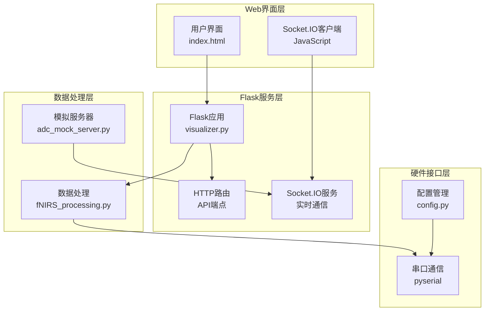
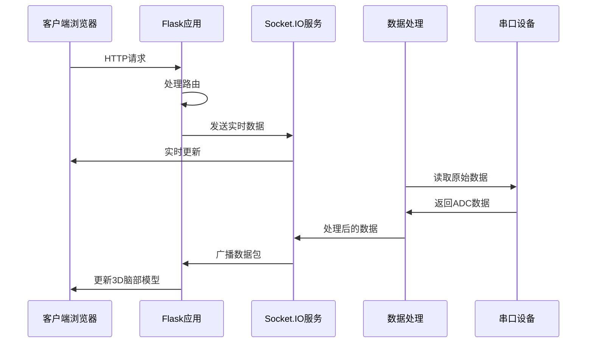
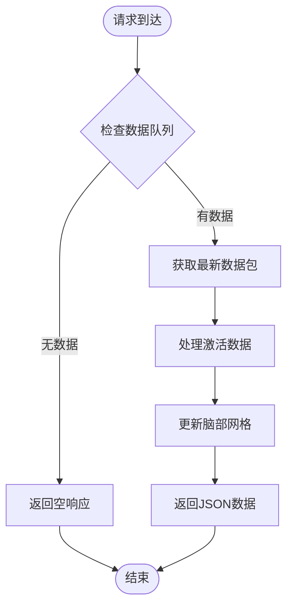
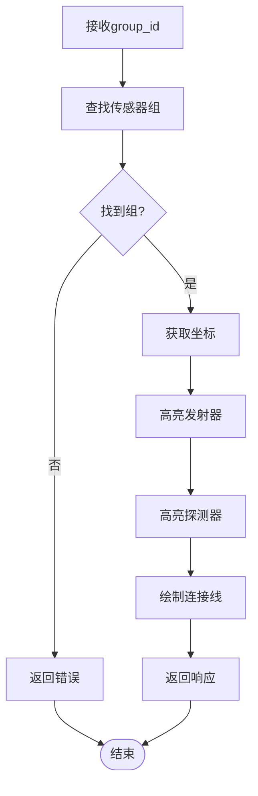
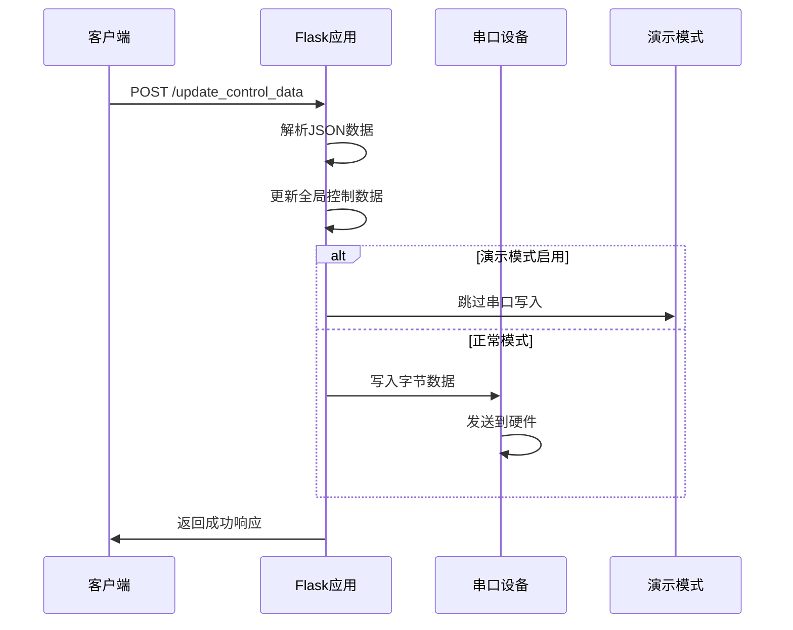
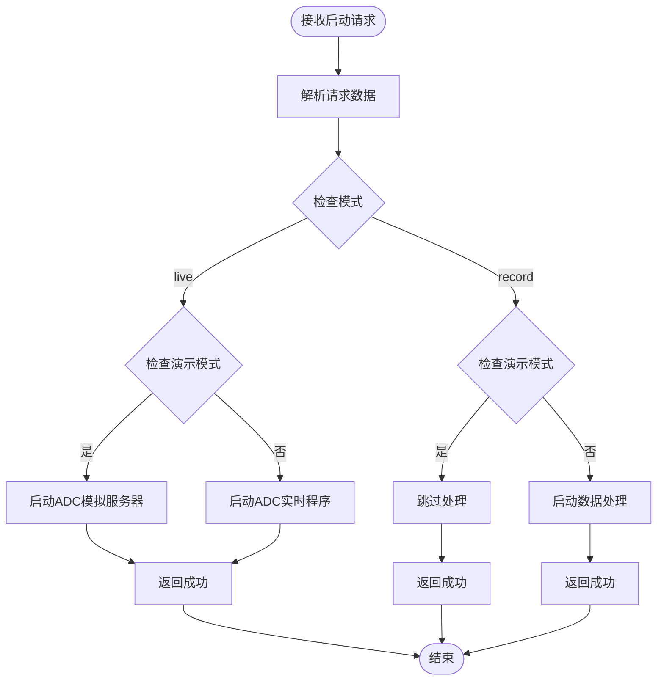
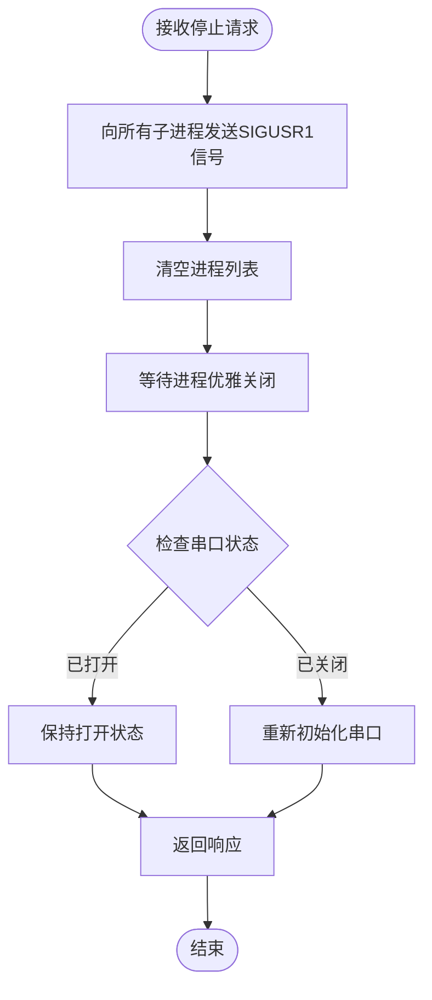
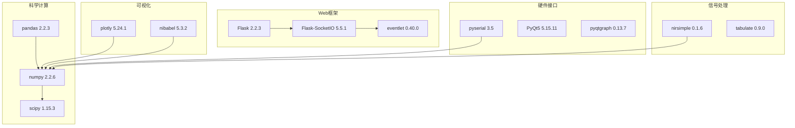
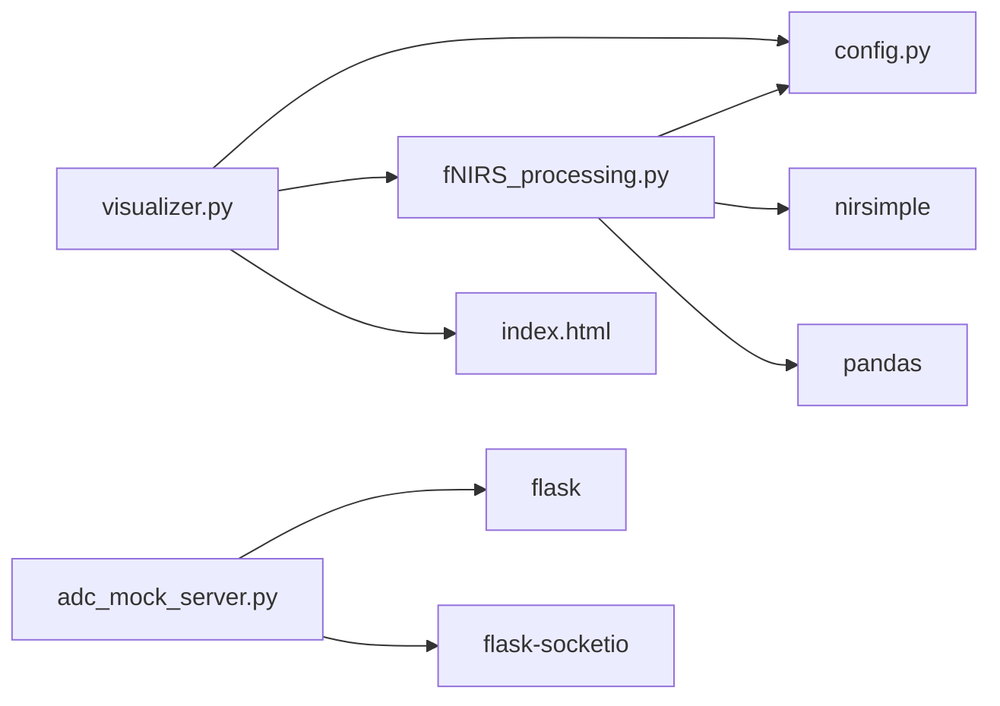

# Flask Web API

<cite>
**本文档引用的文件**
- [visualizer.py](file://software/visualizer.py)
- [index.html](file://software/index.html)
- [config.py](file://software/config.py)
- [requirements.txt](file://software/requirements.txt)
- [fNIRS_processing.py](file://software/fNIRS_processing.py)
- [adc_mock_server.py](file://software/adc_mock_server.py)
- [README.md](file://software/README.md)
</cite>

## 目录
1. [简介](#简介)
2. [项目结构](#项目结构)
3. [核心组件](#核心组件)
4. [架构概览](#架构概览)
5. [详细组件分析](#详细组件分析)
6. [依赖关系分析](#依赖关系分析)
7. [性能考虑](#性能考虑)
8. [故障排除指南](#故障排除指南)
9. [结论](#结论)

## 简介
本文档详细描述了fNIRS项目的Flask Web服务API，该系统为功能性近红外光谱(fNIRS)数据提供实时可视化和控制功能。系统通过Web界面提供交互式3D脑部模型、传感器组选择、发射器状态控制、数据采集模式切换等功能。

## 项目结构
项目采用模块化设计，主要包含以下关键组件：



**图表来源**
- [visualizer.py:53-56](file://software/visualizer.py#L53-L56)
- [index.html:305-306](file://software/index.html#L305-L306)
- [config.py:8-12](file://software/config.py#L8-L12)

**章节来源**
- [visualizer.py:1-50](file://software/visualizer.py#L1-L50)
- [README.md:167-171](file://software/README.md#L167-L171)

## 核心组件
系统的核心组件包括：

### Flask应用实例
- 主要应用实例：`Flask(__name__)`
- Socket.IO集成：`SocketIO(app, cors_allowed_origins="*")`
- 异步模式：`async_mode="eventlet"`

### 全局变量和状态管理
- 数据队列：`Queue(maxsize=20)`用于处理数据包
- 控制数据：包含发射器和多路复用器状态
- 模式状态：支持ADC实时模式和记录可视化模式

### 数据结构映射
- 传感器组映射：8个传感器组，每组包含1个发射器和2个探测器
- 区域映射：将传感器映射到大脑区域
- 预计算索引：优化区域到传感器的反向映射

**章节来源**
- [visualizer.py:54-56](file://software/visualizer.py#L54-L56)
- [visualizer.py:367-384](file://software/visualizer.py#L367-L384)
- [visualizer.py:386-408](file://software/visualizer.py#L386-L408)

## 架构概览
系统采用分层架构，实现了从硬件数据采集到Web界面展示的完整数据流：



**图表来源**
- [visualizer.py:927-941](file://software/visualizer.py#L927-L941)
- [fNIRS_processing.py:187-200](file://software/fNIRS_processing.py#L187-L200)

## 详细组件分析

### /index 端点 - 主页面服务
负责提供主用户界面，包含3D脑部可视化、传感器组控制面板和模式选择功能。

**请求方法**: GET
**响应类型**: HTML文档
**路径**: `/`

**功能特性**:
- 加载Bootstrap、Plotly和jQuery库
- 提供3D脑部网格可视化
- 支持传感器组选择按钮
- 包含发射器和多路复用器控制面板
- 模式选择（实时ADC或记录可视化）

**章节来源**
- [visualizer.py:593-599](file://software/visualizer.py#L593-L599)
- [index.html:1-750](file://software/index.html#L1-L750)

### /update_graphs 端点 - 图形更新机制
提供当前脑部模型的JSON表示，用于实时更新3D可视化。

**请求方法**: GET
**响应类型**: JSON对象
**路径**: `/update_graphs`

**响应格式**:
```json
{
  "brain_mesh": "Plotly图形JSON数据"
}
```

**数据流程**:


**图表来源**
- [visualizer.py:601-609](file://software/visualizer.py#L601-L609)
- [visualizer.py:543-562](file://software/visualizer.py#L543-L562)

**章节来源**
- [visualizer.py:601-609](file://software/visualizer.py#L601-L609)
- [visualizer.py:543-562](file://software/visualizer.py#L543-L562)

### /select_group/<int:group_id> 端点 - 传感器组选择
高亮显示指定的传感器组，通过连接发射器和探测器来可视化组结构。

**请求方法**: GET
**响应类型**: JSON对象
**路径**: `/select_group/<group_id>`

**参数**:
- `group_id`: 整数，传感器组ID（1-8）

**响应格式**:
```json
{
  "brain_mesh": "包含组高亮的Plotly图形JSON"
}
```

**高亮算法**:


**图表来源**
- [visualizer.py:611-618](file://software/visualizer.py#L611-L618)
- [visualizer.py:489-540](file://software/visualizer.py#L489-L540)

**章节来源**
- [visualizer.py:611-618](file://software/visualizer.py#L611-L618)
- [visualizer.py:489-540](file://software/visualizer.py#L489-L540)

### /update_emitter_states 端点 - 发射器状态更新
接收并更新发射器状态信息。

**请求方法**: POST
**响应类型**: JSON对象
**路径**: `/update_emitter_states`

**请求格式**:
```json
{
  "emitter_states": [bool, bool, bool, bool, bool, bool, bool, bool]
}
```

**响应格式**:
```json
{
  "status": "success"
}
```

**章节来源**
- [visualizer.py:620-628](file://software/visualizer.py#L620-L628)

### /update_control_data 端点 - 硬件控制数据传输
更新发射器和多路复用器的控制状态，并通过串口发送到硬件设备。

**请求方法**: POST
**响应类型**: JSON对象
**路径**: `/update_control_data`

**请求格式**:
```json
{
  "emitter_control_override_enable": 0|1,
  "emitter_control_state": 0-6,
  "emitter_pwm_control_h": 0-65535,
  "emitter_pwm_control_l": 0-65535,
  "mux_control_override_enable": 0|1,
  "mux_control_state": 0-3
}
```

**响应格式**:
```json
{
  "status": "success"
}
```

**数据传输流程**:


**图表来源**
- [visualizer.py:630-646](file://software/visualizer.py#L630-L646)

**章节来源**
- [visualizer.py:630-646](file://software/visualizer.py#L630-L646)

### /start_processing 端点 - 处理模式启动
启动指定的数据处理模式（实时ADC或记录可视化）。

**请求方法**: POST
**响应类型**: JSON对象
**路径**: `/start_processing`

**请求格式**:
```json
{
  "mode": "live"|"record",
  "sources": ["ADC"|"mBLL"]
}
```

**响应格式**:
```json
{
  "status": "ADC模式已启动"|"processing started"|"demo mode active, processing skipped"
}
```

**处理逻辑**:


**图表来源**
- [visualizer.py:648-689](file://software/visualizer.py#L648-L689)

**章节来源**
- [visualizer.py:648-689](file://software/visualizer.py#L648-L689)

### /stop_processing 端点 - 处理停止控制
优雅地停止所有正在运行的数据处理进程并重新初始化串口连接。

**请求方法**: POST
**响应类型**: JSON对象
**路径**: `/stop_processing`

**响应格式**:
```json
{
  "status": "processing stop signal sent and serial reinitialized"
}
```

**停止流程**:


**图表来源**
- [visualizer.py:692-713](file://software/visualizer.py#L692-L713)

**章节来源**
- [visualizer.py:692-713](file://software/visualizer.py#L692-L713)

### /download/<source> 端点 - CSV文件下载
根据源类型下载相应的CSV数据文件。

**请求方法**: GET
**响应类型**: CSV文件
**路径**: `/download/<source>?filename=<自定义文件名>`

**参数**:
- `source`: "ADC" 或 "mBLL"
- `filename`: 可选，自定义下载文件名

**可用源类型**:
- `ADC`: `all_groups.csv` - 原始ADC数据
- `mBLL`: `processed_output.csv` - 处理后的数据

**章节来源**
- [visualizer.py:716-734](file://software/visualizer.py#L716-L734)

### 静态可视化端点
系统还提供静态可视化功能：

#### /view_static/ADC 端点
生成包含8个传感器组的静态Plotly图表，展示原始ADC数据。

#### /view_static/mBLL 端点
生成包含8个传感器组的静态Plotly图表，展示处理后的mBLL数据。

#### /view_animation/ADC 和 /view_animation/mBLL 端点
启动相应的动画可视化程序进行实时数据展示。

**章节来源**
- [visualizer.py:737-898](file://software/visualizer.py#L737-L898)
- [visualizer.py:901-922](file://software/visualizer.py#L901-L922)

## 依赖关系分析

### 外部依赖
系统依赖以下关键库：



**图表来源**
- [requirements.txt:1-15](file://software/requirements.txt#L1-L15)

### 内部模块依赖


**图表来源**
- [visualizer.py:34-35](file://software/visualizer.py#L34-L35)
- [fNIRS_processing.py:16-21](file://software/fNIRS_processing.py#L16-L21)

**章节来源**
- [requirements.txt:1-15](file://software/requirements.txt#L1-L15)
- [visualizer.py:34-35](file://software/visualizer.py#L34-L35)

## 性能考虑
系统在设计时考虑了多个性能优化方面：

### 异步处理
- 使用Eventlet作为异步模式，提高并发处理能力
- Socket.IO事件驱动架构，减少轮询开销
- 非阻塞数据读取和处理

### 内存管理
- 数据队列限制大小（20个数据包）
- 及时清理过期数据包
- 使用NumPy数组进行高效数值计算

### 网络优化
- 实时数据通过WebSocket传输，避免HTTP请求开销
- 批量数据更新，减少网络往返
- 压缩Plotly图形数据传输

### 计算优化
- 预计算区域映射和索引
- 使用KD树进行快速空间查询
- 向量化操作替代循环处理

## 故障排除指南

### 常见错误和解决方案

#### 串口连接问题
**症状**: 无法连接到硬件设备
**原因**: 串口端口配置错误或设备未连接
**解决方案**:
1. 检查`config.py`中的`SERIAL_PORT`设置
2. 确认硬件设备正确连接
3. 验证串口权限设置

#### Socket.IO连接失败
**症状**: Web界面无法接收实时数据
**原因**: 上游服务器不可达或网络问题
**解决方案**:
1. 检查上游服务器地址和端口
2. 验证防火墙设置
3. 查看服务器日志获取详细错误信息

#### 数据处理异常
**症状**: 数据处理中断或结果不正确
**原因**: 信号处理参数不当或硬件数据异常
**解决方案**:
1. 检查滤波器参数设置
2. 验证数据质量
3. 重新初始化数据处理流程

#### 内存不足问题
**症状**: 应用程序运行缓慢或崩溃
**原因**: 数据队列过大或内存泄漏
**解决方案**:
1. 调整数据队列大小限制
2. 实施定期内存清理
3. 优化数据结构存储

**章节来源**
- [visualizer.py:108-118](file://software/visualizer.py#L108-L118)
- [fNIRS_processing.py:27-37](file://software/fNIRS_processing.py#L27-L37)

## 结论
fNIRS项目的Flask Web服务API提供了一个功能完整、性能优化的实时数据可视化平台。系统通过清晰的模块化设计、高效的异步处理和完善的错误处理机制，实现了从硬件数据采集到Web界面展示的完整数据流。该API为fNIRS研究提供了直观的交互式工具，支持多种数据处理模式和可视化选项，满足了从基础研究到临床应用的不同需求。

系统的关键优势包括：
- 实时数据处理和可视化
- 灵活的硬件抽象层
- 用户友好的Web界面
- 可扩展的架构设计
- 完善的错误处理和恢复机制