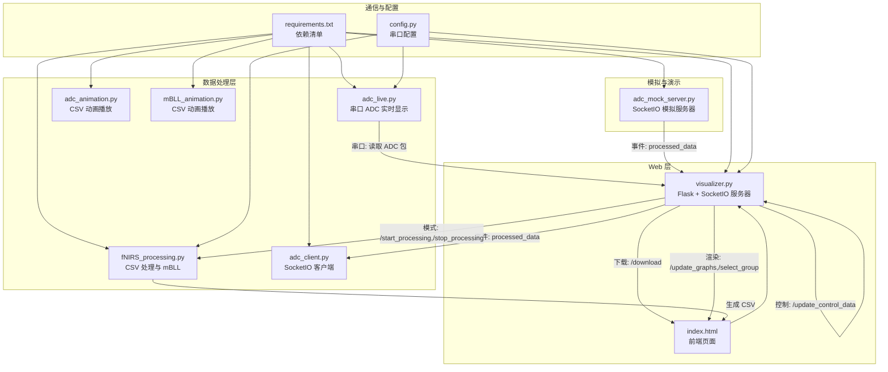
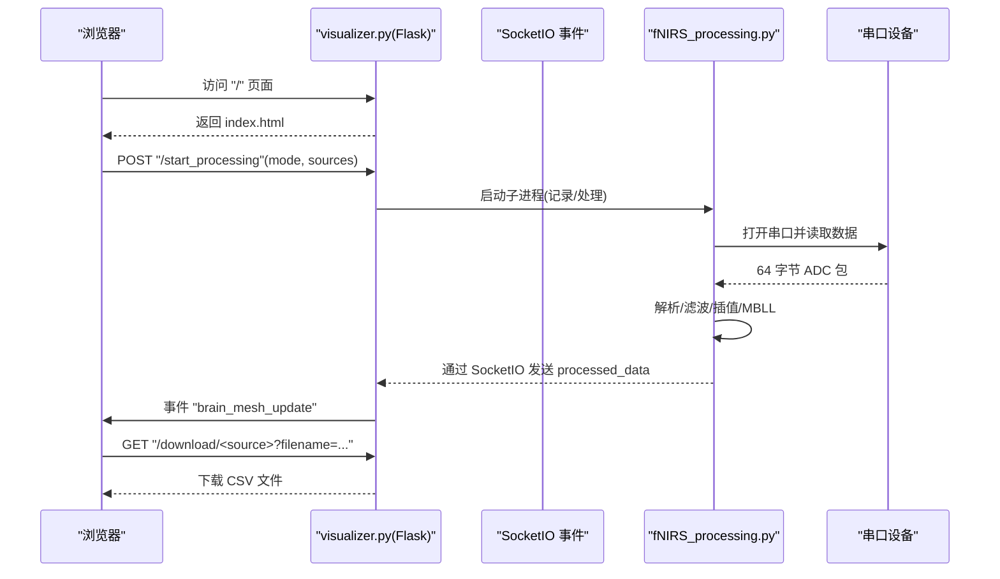
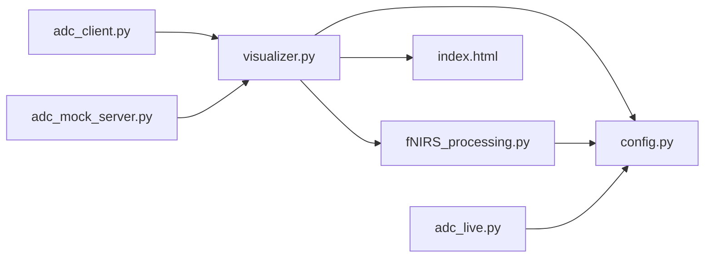

# Python API

<cite>
**本文引用的文件**
- [index.html](file://software/index.html)
- [visualizer.py](file://software/visualizer.py)
- [fNIRS_processing.py](file://software/fNIRS_processing.py)
- [config.py](file://software/config.py)
- [adc_live.py](file://software/adc_live.py)
- [adc_client.py](file://software/adc_client.py)
- [adc_mock_server.py](file://software/adc_mock_server.py)
- [mBLL_animation.py](file://software/mBLL_animation.py)
- [adc_animation.py](file://software/adc_animation.py)
- [requirements.txt](file://software/requirements.txt)
- [README.md](file://README.md)
</cite>

## 目录
1. [简介](#简介)
2. [项目结构](#项目结构)
3. [核心组件](#核心组件)
4. [架构总览](#架构总览)
5. [详细组件分析](#详细组件分析)
6. [依赖分析](#依赖分析)
7. [性能考虑](#性能考虑)
8. [故障排查指南](#故障排查指南)
9. [结论](#结论)
10. [附录](#附录)

## 简介
本文件面向第三方开发者，系统性地文档化 fNIRS 系统的 Python API 与相关组件，覆盖以下方面：
- Flask Web 服务的 HTTP 端点：路由定义、请求参数、响应格式与错误处理
- SocketIO 事件处理机制：processed_data、connect/disconnect、以及自定义事件的消息格式
- 数据处理函数：compute_vertex_normals、create_flat_cylinder_mesh、preload_static_data 等的函数签名、参数类型、返回值与使用要点
- 串行通信接口：配置参数、连接建立与数据传输方法
- 完整的 API 使用示例：Web 界面集成、实时数据处理与文件下载
- Python 客户端集成指南与最佳实践

## 项目结构
软件层包含 Web 可视化服务、数据采集与处理脚本、GUI 桌面应用以及模拟数据源等模块。下图展示主要文件与职责映射。

图表来源
- [visualizer.py:591-735](file://software/visualizer.py#L591-L735)
- [index.html:305-747](file://software/index.html#L305-L747)
- [fNIRS_processing.py:187-496](file://software/fNIRS_processing.py#L187-L496)
- [config.py:7-12](file://software/config.py#L7-L12)
- [adc_live.py:18-210](file://software/adc_live.py#L18-L210)
- [adc_client.py:39-86](file://software/adc_client.py#L39-L86)
- [adc_mock_server.py:15-65](file://software/adc_mock_server.py#L15-L65)
- [adc_animation.py:1-143](file://software/adc_animation.py#L1-L143)
- [mBLL_animation.py:1-140](file://software/mBLL_animation.py#L1-L140)
- [requirements.txt:1-15](file://software/requirements.txt#L1-L15)

章节来源
- [README.md:1-19](file://README.md#L1-L19)
- [requirements.txt:1-15](file://software/requirements.txt#L1-L15)

## 核心组件
- Web 服务（Flask + SocketIO）
  - 提供静态页面、实时可视化、控制下发、文件下载与处理流程控制
- 数据处理（CSV + mBLL）
  - 将原始 ADC 包解析为结构化 CSV，并执行 Modified Beer-Lambert Law 与 CBSI 后处理
- 串行通信
  - 配置串口参数，读取固定长度数据包，解析为结构化数组
- SocketIO 客户端
  - 接收 processed_data 事件，更新桌面 GUI
- 模拟数据源
  - 以三角波生成 24 通道传感器数组，用于演示与测试

章节来源
- [visualizer.py:591-735](file://software/visualizer.py#L591-L735)
- [fNIRS_processing.py:160-496](file://software/fNIRS_processing.py#L160-L496)
- [config.py:7-12](file://software/config.py#L7-L12)
- [adc_client.py:39-86](file://software/adc_client.py#L39-L86)
- [adc_mock_server.py:30-65](file://software/adc_mock_server.py#L30-L65)

## 架构总览
下图展示从浏览器到后端服务、串口设备与数据处理的整体交互路径。

图表来源
- [visualizer.py:648-735](file://software/visualizer.py#L648-L735)
- [fNIRS_processing.py:187-496](file://software/fNIRS_processing.py#L187-L496)
- [index.html:716-747](file://software/index.html#L716-L747)

## 详细组件分析

### Flask HTTP 端点与响应规范
- GET /
  - 描述：返回主页面 index.html
  - 响应：HTML 文档
- GET /update_graphs
  - 描述：返回当前脑图 JSON
  - 响应：JSON 对象，包含键 "brain_mesh"（Plotly 图 JSON）
- GET /select_group/{group_id}
  - 参数：group_id（整数，1..8）
  - 描述：高亮指定传感器组并返回更新后的脑图
  - 响应：JSON 对象，包含键 "brain_mesh"
- POST /update_control_data
  - 请求体：JSON 对象，字段见“控制数据结构”
  - 描述：更新发射器与 MUX 控制状态，并写入串口（非演示模式）
  - 响应：{"status":"success"}
- POST /start_processing
  - 请求体：{"mode":"live"|"record","sources":["ADC"]|["mBLL"]|["ADC","mBLL"]}
  - 描述：启动 ADC 实时或记录/处理流程；演示模式下启动模拟数据源
  - 响应：{"status":"..."} 或错误码
- POST /stop_processing
  - 描述：向子进程发送信号以优雅停止，并重初始化串口
  - 响应：{"status":"..."}
- GET /download/{source}
  - 路径参数：source ∈ {"ADC","mBLL"}
  - 查询参数：filename（可选，默认文件名）
  - 描述：下载对应 CSV 文件
  - 响应：CSV 文件（附件）

错误处理要点
- 无效 source：返回 400 并包含错误信息
- 子进程异常：返回 500 并包含错误消息
- 串口关闭/重连失败：记录日志并提示错误

章节来源
- [visualizer.py:591-735](file://software/visualizer.py#L591-L735)
- [index.html:716-747](file://software/index.html#L716-L747)

### SocketIO 事件与消息格式
- 服务端事件（由上游服务/模拟服务发出）
  - 事件名："processed_data"
  - 消息结构：
    - "concentrations": 长度为 48 的数值数组（每组 2 个通道，共 24 组）
    - 可选："sensor_array": 长度为 24 的数值数组（仅在演示场景中出现）
- 客户端事件（由 visualizer.py 注册）
  - 事件名："connect"/"disconnect"
  - processed_data：接收后入队并触发图更新
- 前端事件（由浏览器发出）
  - 事件名："processed_data"（仅演示场景）
  - 消息结构：{"sensor_array": 长度为 24 的数值数组}

章节来源
- [visualizer.py:69-98](file://software/visualizer.py#L69-L98)
- [adc_client.py:51-66](file://software/adc_client.py#L51-L66)
- [adc_mock_server.py:48-60](file://software/adc_mock_server.py#L48-L60)

### 数据处理函数 API
- compute_vertex_normals(vertices, triangles)
  - 输入：vertices（N×3 数组）、triangles（M×3 数组）
  - 输出：每个顶点的单位法向量（N×3 数组）
  - 用途：计算脑图网格顶点法向量，用于光照/着色
- create_flat_cylinder_mesh(center, normal, radius, height=1.0, resolution=20, angle=0.0)
  - 输入：center（三维向量）、normal（方向向量）、radius、height、resolution、angle
  - 输出：顶点坐标（V×3）与面索引（F×3）
  - 用途：生成发射器/探测器圆盘状几何体，对齐到网格法向量并平移
- preload_static_data()
  - 输入：无
  - 输出：脑网格坐标、三角形索引、AAL 图像数据与仿射矩阵
  - 用途：加载静态脑图与区域映射数据

章节来源
- [visualizer.py:123-205](file://software/visualizer.py#L123-L205)

### 串行通信接口
- 配置参数（来自 config.py）
  - SERIAL_PORT：USB-串口设备路径
  - BAUD_RATE：波特率
  - TIMEOUT：超时秒数
- 连接建立
  - visualizer.py：在非演示模式下打开串口，用于下发控制数据
  - fNIRS_processing.py：独立打开串口读取 ADC 包
  - adc_live.py：独立打开串口进行本地实时显示
- 数据传输
  - 控制下发：POST /update_control_data 将 JSON 字段序列化为字节流写入串口
  - 数据包格式：固定 64 字节，按 8 组 × 8 字节分组，每组包含 1 字节组标识与 3 个 2 字节 ADC 值及 1 字节发射器状态
  - 解析函数：parse_packet（将原始字节转换为 8×5 的结构化数组）

章节来源
- [config.py:7-12](file://software/config.py#L7-L12)
- [visualizer.py:42-46](file://software/visualizer.py#L42-L46)
- [fNIRS_processing.py:22-23](file://software/fNIRS_processing.py#L22-L23)
- [adc_live.py:18-18](file://software/adc_live.py#L18-L18)
- [visualizer.py:648-646](file://software/visualizer.py#L648-L646)

### API 使用示例

- Web 界面集成
  - 加载页面：访问根路径 "/"
  - 高亮传感器组：GET "/select_group/{group_id}"
  - 更新控制：POST "/update_control_data"（携带控制数据）
  - 切换模式：POST "/start_processing" 选择 "live" 或 "record"，并指定 sources
  - 停止处理：POST "/stop_processing"
  - 下载 CSV：GET "/download/{source}?filename=..."

- 实时数据处理
  - 演示模式：启动 adc_mock_server.py，浏览器通过 SocketIO 接收 "processed_data"
  - 生产模式：启动 visualizer.py，串口设备产生 ADC 包，经 fNIRS_processing.py 处理后通过 SocketIO 推送 "processed_data"

- 文件下载
  - ADC 源：下载 all_groups.csv
  - mBLL 源：下载 processed_output.csv

章节来源
- [index.html:305-747](file://software/index.html#L305-L747)
- [visualizer.py:648-735](file://software/visualizer.py#L648-L735)
- [fNIRS_processing.py:187-496](file://software/fNIRS_processing.py#L187-L496)
- [adc_mock_server.py:48-65](file://software/adc_mock_server.py#L48-L65)

### 第三方开发者集成指南与最佳实践
- 依赖安装
  - 使用 requirements.txt 中的版本锁定，确保兼容性
- 安全与稳定性
  - 在生产环境避免硬编码串口路径，优先通过环境变量或配置文件注入
  - 对串口读写加异常捕获与超时处理
- 性能优化
  - 使用 eventlet 异步模式提升并发
  - 对大数据集（CSV）采用分块读取与内存映射
- 可靠性
  - 优雅关闭：在停止处理时向子进程发送信号并等待退出
  - 日志记录：统一使用标准日志模块输出运行状态与错误
- 兼容性
  - 前端依赖 Plotly、SocketIO、Bootstrap，请确保 CDN 可用或离线部署
  - 模拟服务仅用于开发测试，生产请替换为真实串口设备

章节来源
- [requirements.txt:1-15](file://software/requirements.txt#L1-L15)
- [visualizer.py:108-118](file://software/visualizer.py#L108-L118)
- [visualizer.py:692-713](file://software/visualizer.py#L692-L713)

## 依赖分析
- 运行时依赖
  - Flask、Flask-SocketIO、eventlet：Web 服务与异步事件
  - numpy、pandas、scipy：数值计算与信号处理
  - plotly、pyqtgraph、PyQt5：可视化与桌面 GUI
  - nirsimple：fNIRS 预处理与处理算法
  - nibabel：脑图与解剖标签映射
  - pyserial：串口通信
- 组件耦合
  - visualizer.py 与 fNIRS_processing.py 通过子进程与 SocketIO 协作
  - 前端 index.html 通过 SocketIO 与后端交互
  - 串口配置集中于 config.py，被多个模块复用

图表来源
- [visualizer.py:54-55](file://software/visualizer.py#L54-L55)
- [fNIRS_processing.py:20-23](file://software/fNIRS_processing.py#L20-L23)
- [config.py:7-12](file://software/config.py#L7-L12)
- [adc_live.py:18-18](file://software/adc_live.py#L18-L18)
- [adc_client.py:49-66](file://software/adc_client.py#L49-L66)
- [adc_mock_server.py:15-16](file://software/adc_mock_server.py#L15-L16)

章节来源
- [requirements.txt:1-15](file://software/requirements.txt#L1-L15)

## 性能考虑
- 异步事件：使用 eventlet 异步模式，减少阻塞
- 内存管理：队列最大容量限制，避免无限增长
- 数据处理：批处理与向量化运算，避免逐元素循环
- I/O：串口读取采用固定缓冲区与分包解析，降低 CPU 占用
- 可视化：增量更新图数据，避免全量重绘

## 故障排查指南
- 无法连接串口
  - 检查 SERIAL_PORT 是否正确、权限是否允许访问
  - 确认设备已插入且驱动正常
- SocketIO 无法接收数据
  - 确认后端已启动并监听端口
  - 检查浏览器控制台是否存在跨域或连接错误
- 下载文件为空或报错
  - 确认 source 参数有效（"ADC" 或 "mBLL"）
  - 检查目标 CSV 是否存在且有读权限
- 模式切换失败
  - 确认 /start_processing 的请求体格式正确
  - 查看后端日志中的异常堆栈

章节来源
- [visualizer.py:692-713](file://software/visualizer.py#L692-L713)
- [visualizer.py:716-735](file://software/visualizer.py#L716-L735)

## 结论
本 Python API 以 Flask + SocketIO 为核心，结合串口通信与 fNIRS 数据处理，提供了从硬件到可视化的完整链路。通过标准化的 HTTP 端点与事件协议，第三方开发者可以便捷地集成 Web 界面、实时数据处理与文件导出功能。建议在生产环境中严格遵循配置管理、异常处理与性能优化的最佳实践，以获得稳定可靠的用户体验。

## 附录

### 控制数据结构（POST /update_control_data）
- 字段
  - emitter_control_override_enable: 0/1
  - emitter_control_state: 控制状态枚举（见前端 select）
  - emitter_pwm_control_h: 高位 PWM 控制寄存器值
  - emitter_pwm_control_l: 低位 PWM 控制寄存器值
  - mux_control_override_enable: 0/1
  - mux_control_state: MUX 控制状态枚举（见前端 select）
- 行为
  - 非演示模式下将上述字段按顺序打包为字节并写入串口

章节来源
- [visualizer.py:630-646](file://software/visualizer.py#L630-L646)
- [index.html:174-206](file://software/index.html#L174-L206)