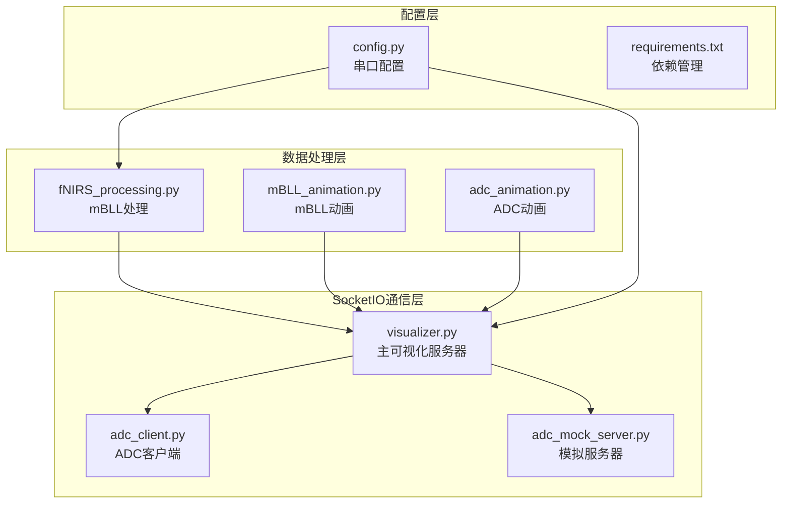
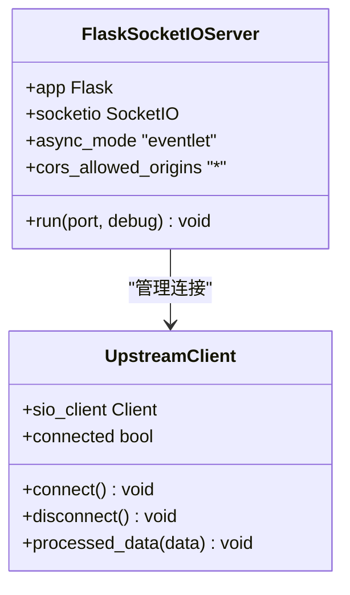
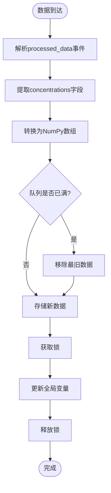
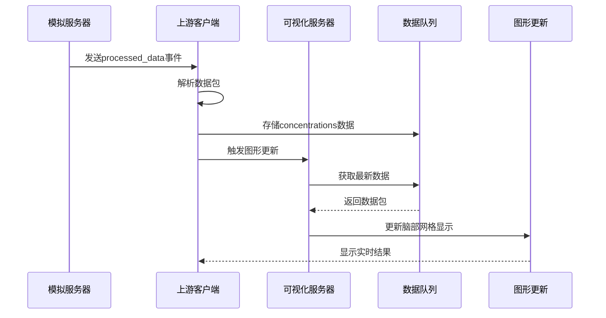
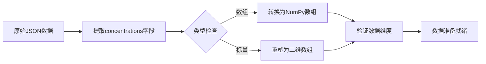
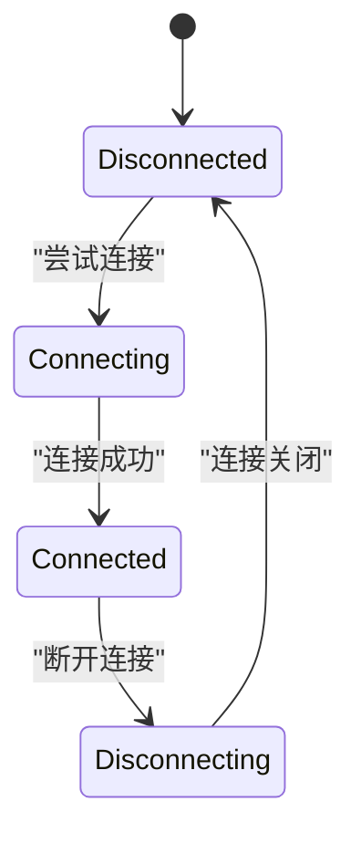
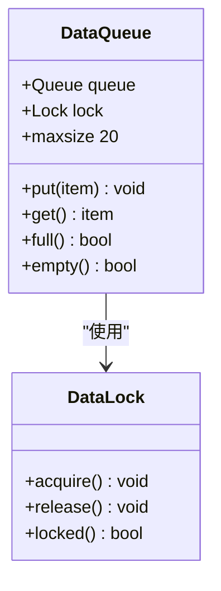
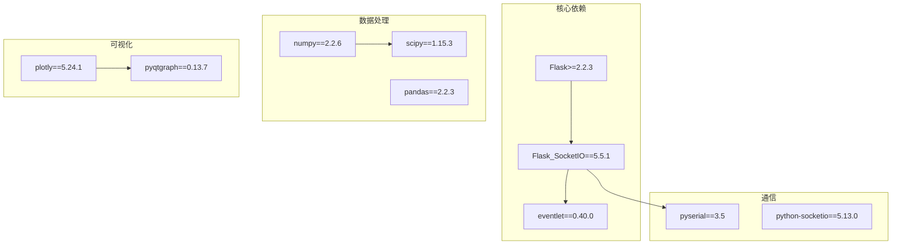
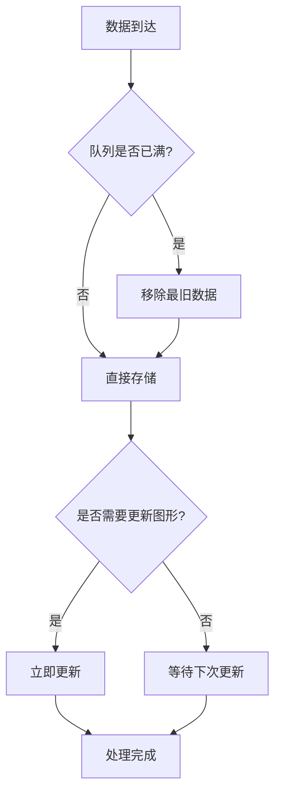

# SocketIO事件处理

<cite>
**本文档中引用的文件**
- [visualizer.py](file://software/visualizer.py)
- [adc_client.py](file://software/adc_client.py)
- [adc_mock_server.py](file://software/adc_mock_server.py)
- [config.py](file://software/config.py)
- [requirements.txt](file://software/requirements.txt)
- [fNIRS_processing.py](file://software/fNIRS_processing.py)
- [mBLL_animation.py](file://software/mBLL_animation.py)
- [adc_animation.py](file://software/adc_animation.py)
</cite>

## 目录
1. [简介](#简介)
2. [项目结构](#项目结构)
3. [核心组件](#核心组件)
4. [架构概览](#架构概览)
5. [详细组件分析](#详细组件分析)
6. [依赖关系分析](#依赖关系分析)
7. [性能考虑](#性能考虑)
8. [故障排除指南](#故障排除指南)
9. [结论](#结论)

## 简介

本文档详细记录了fNIRS项目中的SocketIO实时通信接口实现。该系统实现了上游SocketIO客户端与下游数据接收器之间的双向通信，支持实时数据传输、连接状态管理、数据队列处理和线程同步机制。重点涵盖了`processed_data`事件的数据包格式、`connect`和`disconnect`事件的回调函数实现，以及完整的事件消息格式示例。

## 项目结构

fNIRS项目采用模块化设计，SocketIO相关功能分布在多个文件中：

**图表来源**
- [visualizer.py:54-55](file://software/visualizer.py#L54-L55)
- [adc_client.py:47-66](file://software/adc_client.py#L47-L66)
- [adc_mock_server.py:15-16](file://software/adc_mock_server.py#L15-L16)

**章节来源**
- [visualizer.py:1-120](file://software/visualizer.py#L1-L120)
- [config.py:1-13](file://software/config.py#L1-L13)

## 核心组件

### SocketIO服务器配置

系统使用Flask-SocketIO在Eventlet异步模式下运行，支持WebSocket传输协议：

**图表来源**
- [visualizer.py:54-67](file://software/visualizer.py#L54-L67)

### 数据队列管理系统

系统实现了线程安全的数据队列，用于存储和管理实时数据包：

**图表来源**
- [visualizer.py:84-97](file://software/visualizer.py#L84-L97)

**章节来源**
- [visualizer.py:58-106](file://software/visualizer.py#L58-L106)

## 架构概览

系统采用分层架构设计，实现了完整的实时数据传输管道：

**图表来源**
- [adc_mock_server.py:48-60](file://software/adc_mock_server.py#L48-L60)
- [visualizer.py:84-97](file://software/visualizer.py#L84-L97)

## 详细组件分析

### processed_data事件处理器

`processed_data`事件是系统的核心数据传输机制，负责接收和处理来自上游服务器的实时数据：

#### 事件数据包结构

processed_data事件的数据包包含以下关键字段：

| 字段名 | 类型 | 描述 | 示例值 |
|--------|------|------|--------|
| `concentrations` | 数组 | 24个传感器通道的血红蛋白浓度变化值 | `[0.123, -0.456, ...]` |
| `timestamp` | 时间戳 | 数据采集时间 | `"2024-01-01T12:00:00Z"` |

#### 数据类型和格式

系统对接收到的数据进行严格的类型转换和验证：

**图表来源**
- [visualizer.py:86-89](file://software/visualizer.py#L86-L89)

#### 处理流程详解

1. **数据接收**: 通过`@sio_client.event`装饰器注册的`processed_data`回调函数
2. **数据解析**: 将JSON数据转换为NumPy数组格式
3. **维度标准化**: 确保数据为二维数组格式，便于后续处理
4. **队列管理**: 使用线程锁保护共享数据结构
5. **实时更新**: 在mBLL模式下立即更新图形显示

**章节来源**
- [visualizer.py:84-97](file://software/visualizer.py#L84-L97)

### 连接事件处理

系统实现了完整的连接生命周期管理：

#### connect事件回调

当客户端成功连接到上游服务器时触发：

**图表来源**
- [visualizer.py:69-74](file://software/visualizer.py#L69-L74)

#### disconnect事件回调

当客户端与上游服务器断开连接时触发：

| 触发条件 | 日志输出 | 处理动作 |
|----------|----------|----------|
| 网络中断 | "Disconnected from upstream server." | 记录断开状态 |
| 主动断开 | "Disconnected from upstream server." | 清理资源 |
| 连接失败 | "Connection failed: ... Retrying..." | 自动重连 |

**章节来源**
- [visualizer.py:76-81](file://software/visualizer.py#L76-L81)

### 数据队列管理机制

系统使用Python的`queue.Queue`实现线程安全的数据缓冲：

#### 队列配置参数

| 参数 | 值 | 说明 |
|------|----|------|
| `maxsize` | 20 | 最大队列长度，防止内存溢出 |
| `full()` | 检查队列是否已满 | 自动移除最旧数据 |
| `empty()` | 检查队列是否为空 | 提供数据可用性判断 |

#### 线程同步机制

**图表来源**
- [visualizer.py:60-61](file://software/visualizer.py#L60-L61)

**章节来源**
- [visualizer.py:58-106](file://software/visualizer.py#L58-L106)

### Eventlet异步模式配置

系统采用Eventlet作为异步I/O引擎，提供高性能的并发处理能力：

#### Eventlet配置详情

| 配置项 | 值 | 说明 |
|--------|----|------|
| `async_mode` | `"eventlet"` | 启用Eventlet异步模式 |
| `monkey_patch()` | 调用 | 替换标准库的阻塞调用 |
| `cors_allowed_origins` | `"*"` | 允许所有源的跨域请求 |

#### 性能优化特性

1. **非阻塞I/O**: 所有网络操作都是异步的
2. **协程支持**: 支持大量并发连接
3. **内存效率**: 优化的内存使用模式
4. **自动重连**: 断线自动重连机制

**章节来源**
- [visualizer.py:32-33](file://software/visualizer.py#L32-L33)
- [visualizer.py:55](file://software/visualizer.py#L55)

## 依赖关系分析

### Python依赖管理

系统使用requirements.txt统一管理第三方库依赖：

**图表来源**
- [requirements.txt:1-15](file://software/requirements.txt#L1-L15)

### 串口通信配置

系统通过config.py集中管理串口通信参数：

| 配置项 | 默认值 | 说明 |
|--------|--------|------|
| `SERIAL_PORT` | `/dev/tty.usbmodem205E386D47311` | USB串口设备路径 |
| `BAUD_RATE` | 9600 | 波特率设置 |
| `TIMEOUT` | 0.01 | 超时时间（秒） |

**章节来源**
- [config.py:7-12](file://software/config.py#L7-L12)

## 性能考虑

### 实时性能优化

1. **队列大小限制**: 通过`maxsize=20`控制内存使用
2. **自动重连机制**: 断线后自动重连，保证服务连续性
3. **线程安全**: 使用锁保护共享数据结构
4. **异步处理**: Eventlet提供高效的并发处理能力

### 内存管理策略

**图表来源**
- [visualizer.py:90-97](file://software/visualizer.py#L90-L97)

### 错误处理策略

系统实现了多层次的错误处理机制：

1. **连接错误**: 自动重试机制，最多重试直到连接成功
2. **数据错误**: 验证数据格式和类型，忽略无效数据
3. **内存错误**: 队列满时自动清理最旧数据
4. **异常捕获**: 捕获所有未处理的异常，防止程序崩溃

**章节来源**
- [visualizer.py:927-941](file://software/visualizer.py#L927-L941)

## 故障排除指南

### 常见问题诊断

#### 连接问题

| 问题症状 | 可能原因 | 解决方案 |
|----------|----------|----------|
| 无法连接服务器 | 网络配置错误 | 检查IP地址和端口设置 |
| 连接频繁断开 | 网络不稳定 | 检查网络质量，启用自动重连 |
| 事件处理延迟 | 服务器负载过高 | 优化Eventlet配置，增加服务器资源 |

#### 数据处理问题

| 问题症状 | 可能原因 | 解决方案 |
|----------|----------|----------|
| 数据格式错误 | 事件数据结构不正确 | 验证上游服务器发送的数据格式 |
| 内存使用过高 | 队列未及时清理 | 检查队列大小设置，优化数据处理逻辑 |
| 图形更新卡顿 | 处理速度跟不上数据速率 | 调整Eventlet并发数，优化图形渲染 |

#### 调试技巧

1. **启用详细日志**: 设置`logging.basicConfig(level=logging.DEBUG)`
2. **监控队列状态**: 定期检查队列长度和数据完整性
3. **性能分析**: 使用Eventlet提供的性能监控工具
4. **网络诊断**: 使用ping和traceroute工具检查网络连通性

**章节来源**
- [visualizer.py:48-49](file://software/visualizer.py#L48-L49)
- [visualizer.py:927-941](file://software/visualizer.py#L927-L941)

## 结论

fNIRS项目的SocketIO实时通信接口实现了高效、可靠的双向数据传输机制。通过Eventlet异步模式、线程安全的数据队列管理和完善的错误处理策略，系统能够稳定地处理实时数据流。processed_data事件的数据包格式清晰明确，concentrations字段提供了完整的血红蛋白浓度变化信息，为后续的脑部网格可视化提供了可靠的数据基础。

系统的模块化设计使得各个组件职责明确，易于维护和扩展。通过合理的性能优化和故障排除策略，系统能够在高负载情况下保持稳定的性能表现。这些设计原则为类似的实时数据可视化应用提供了良好的参考模板。