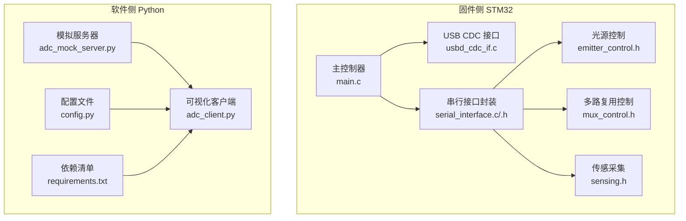
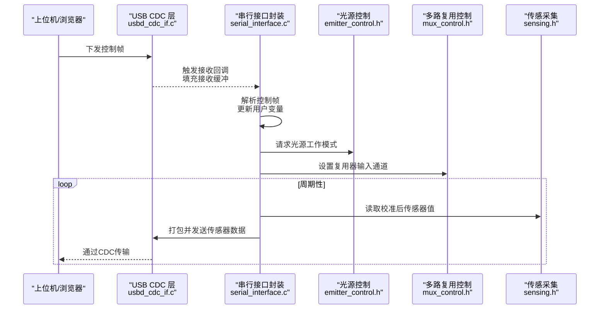
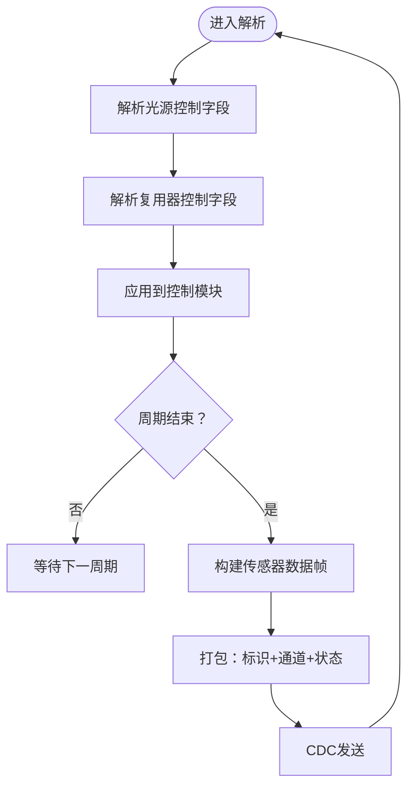
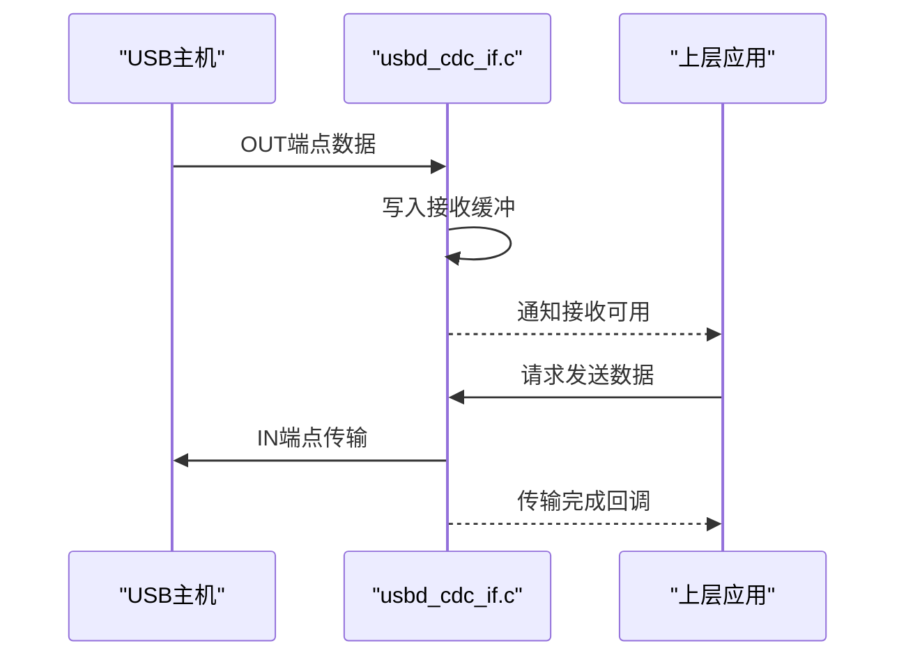
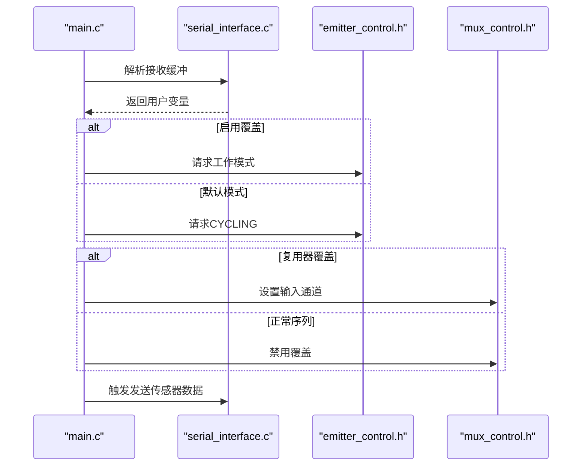
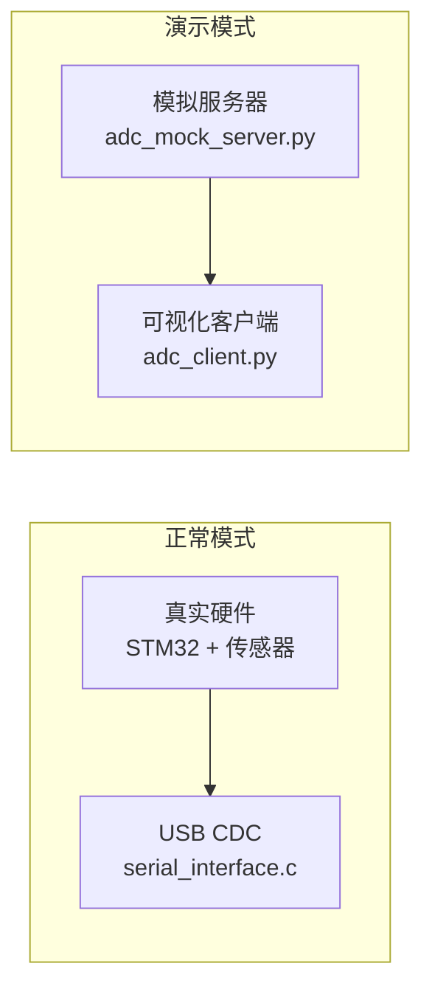
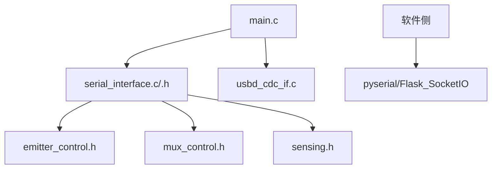

# 串行通信接口

<cite>
**本文引用的文件**
- [serial_interface.h](file://firmware\STM32\fNIRS\Core\Inc\serial_interface.h)
- [serial_interface.c](file://firmware\STM32\fNIRS\Core\Src\serial_interface.c)
- [main.c](file://firmware\STM32\fNIRS\Core\Src\main.c)
- [main.h](file://firmware\STM32\fNIRS\Core\Inc\main.h)
- [usbd_cdc_if.c](file://firmware\STM32\fNIRS\USB_DEVICE\App\usbd_cdc_if.c)
- [usbd_cdc.c](file://firmware\STM32\fNIRS\Middlewares\ST\STM32_USB_Device_Library\Class\CDC\Src\usbd_cdc.c)
- [stm32l4xx_hal_uart.h](file://firmware\STM32\fNIRS\Drivers\STM32L4xx_HAL_Driver\Inc\stm32l4xx_hal_uart.h)
- [stm32l4xx_hal_uart.c](file://firmware\STM32\fNIRS\Drivers\STM32L4xx_HAL_Driver\Src\stm32l4xx_hal_uart.c)
- [stm32l4xx_hal_i2c.c](file://firmware\STM32\fNIRS\Drivers\STM32L4xx_HAL_Driver\Src\stm32l4xx_hal_i2c.c)
- [emitter_control.h](file://firmware\STM32\fNIRS\Core\Inc\emitter_control.h)
- [mux_control.h](file://firmware\STM32\fNIRS\Core\Inc\mux_control.h)
- [sensing.h](file://firmware\STM32\fNIRS\Core\Inc\sensing.h)
- [adc_client.py](file://software\adc_client.py)
- [adc_mock_server.py](file://software\adc_mock_server.py)
- [config.py](file://software\config.py)
- [requirements.txt](file://software\requirements.txt)
</cite>

## 目录
1. [简介](#简介)
2. [项目结构](#项目结构)
3. [核心组件](#核心组件)
4. [架构总览](#架构总览)
5. [详细组件分析](#详细组件分析)
6. [依赖分析](#依赖分析)
7. [性能考虑](#性能考虑)
8. [故障排除指南](#故障排除指南)
9. [结论](#结论)
10. [附录](#附录)

## 简介
本文件面向串行通信接口的使用与维护，聚焦于以下方面：
- Serial对象（在本项目中通过USB CDC虚拟串口实现）的配置参数：端口设置、波特率、超时处理。
- 串行数据发送机制：控制数据打包、字节序列转换、数据完整性检查思路。
- 连接建立与管理：初始化流程、重连机制与异常处理策略。
- 演示模式与正常模式：模拟数据生成与真实硬件通信差异。
- 错误处理策略：连接丢失检测、数据传输失败与超时处理。
- 完整配置示例、调试方法与性能优化建议。
- 硬件兼容性与故障排除指南。

## 项目结构
本项目采用“固件侧STM32 + 软件侧Python”的分层架构：
- 固件侧（STM32）：通过USB CDC虚拟串口对外提供串行通信能力；主循环中解析上位机下发的控制指令，驱动光源与多路复用器状态，并周期性上报传感器数据。
- 软件侧（Python）：提供SocketIO演示服务与可视化客户端，用于模拟或接收真实数据流。

图表来源
- [main.c:147-178](file://firmware\STM32\fNIRS\Core\Src\main.c#L147-L178)
- [usbd_cdc_if.c:143-332](file://firmware\STM32\fNIRS\USB_DEVICE\App\usbd_cdc_if.c#L143-L332)
- [serial_interface.c:19-81](file://firmware\STM32\fNIRS\Core\Src\serial_interface.c#L19-L81)
- [adc_client.py:1-181](file://software\adc_client.py#L1-L181)
- [adc_mock_server.py:1-65](file://software\adc_mock_server.py#L1-L65)

章节来源
- [main.c:147-178](file://firmware\STM32\fNIRS\Core\Src\main.c#L147-L178)
- [usbd_cdc_if.c:143-332](file://firmware\STM32\fNIRS\USB_DEVICE\App\usbd_cdc_if.c#L143-L332)
- [serial_interface.h:1-64](file://firmware\STM32\fNIRS\Core\Inc\serial_interface.h#L1-L64)
- [serial_interface.c:1-82](file://firmware\STM32\fNIRS\Core\Src\serial_interface.c#L1-L82)
- [adc_client.py:1-181](file://software\adc_client.py#L1-L181)
- [adc_mock_server.py:1-65](file://software\adc_mock_server.py#L1-L65)

## 核心组件
- 串行接口封装（serial_interface）
  - 负责解析上位机下发的控制帧，更新光源与多路复用器状态；负责打包传感器数据并通过CDC发送。
- USB CDC接口（usbd_cdc_if）
  - 提供CDC收发缓冲区与回调，承载上位机与MCU之间的数据通道。
- 主循环（main）
  - 驱动状态机、解析控制帧、根据控制帧切换光源/复用器工作模式，并周期性调用发送函数。
- 控制与传感模块（emitter_control、mux_control、sensing）
  - 光源状态机、多路复用器序列器与温度/传感器数据采集。

章节来源
- [serial_interface.h:10-62](file://firmware\STM32\fNIRS\Core\Inc\serial_interface.h#L10-L62)
- [serial_interface.c:19-81](file://firmware\STM32\fNIRS\Core\Src\serial_interface.c#L19-L81)
- [main.c:147-178](file://firmware\STM32\fNIRS\Core\Src\main.c#L147-L178)
- [emitter_control.h:13-38](file://firmware\STM32\fNIRS\Core\Inc\emitter_control.h#L13-L38)
- [mux_control.h:21-40](file://firmware\STM32\fNIRS\Core\Inc\mux_control.h#L21-L40)
- [sensing.h:46-61](file://firmware\STM32\fNIRS\Core\Inc\sensing.h#L46-L61)

## 架构总览
下图展示了从上位机到MCU再到外设的完整链路，以及数据往返路径。

图表来源
- [usbd_cdc_if.c:261-320](file://firmware\STM32\fNIRS\USB_DEVICE\App\usbd_cdc_if.c#L261-L320)
- [serial_interface.c:19-81](file://firmware\STM32\fNIRS\Core\Src\serial_interface.c#L19-L81)
- [main.c:147-178](file://firmware\STM32\fNIRS\Core\Src\main.c#L147-L178)
- [emitter_control.h:40-48](file://firmware\STM32\fNIRS\Core\Inc\emitter_control.h#L40-L48)
- [mux_control.h:42-50](file://firmware\STM32\fNIRS\Core\Inc\mux_control.h#L42-L50)
- [sensing.h:63-69](file://firmware\STM32\fNIRS\Core\Inc\sensing.h#L63-L69)

## 详细组件分析

### 串行接口封装（serial_interface）
- 数据帧结构
  - 控制帧：包含光源覆盖使能、光源状态、PWM掩码、复用器覆盖使能、当前输入通道等字段。
  - 传感器数据帧：每个传感器模块打包为固定长度字节块，包含标识、三路通道高/低字节、光源状态位。
- 发送机制
  - 逐模块采集校准后的ADC值，拼装为连续字节块，最后通过CDC发送。
  - 包含简单的状态位编码，指示各模块对应波长光源是否开启。
- 接收解析
  - 将接收缓冲区按索引映射到内部用户变量，供主循环读取并应用到控制模块。

图表来源
- [serial_interface.c:19-81](file://firmware\STM32\fNIRS\Core\Src\serial_interface.c#L19-L81)
- [serial_interface.h:12-38](file://firmware\STM32\fNIRS\Core\Inc\serial_interface.h#L12-L38)

章节来源
- [serial_interface.h:12-62](file://firmware\STM32\fNIRS\Core\Inc\serial_interface.h#L12-L62)
- [serial_interface.c:19-81](file://firmware\STM32\fNIRS\Core\Src\serial_interface.c#L19-L81)

### USB CDC接口（usbd_cdc_if）
- 初始化与缓冲
  - 设置收发缓冲区，注册回调以处理接收与传输完成事件。
- 接收流程
  - 当USB OUT端点收到数据时，触发接收回调，将数据写入应用缓冲，随后由上层协议栈通知。
- 发送流程
  - 通过CDC传输完成回调进行资源释放与后续调度。

图表来源
- [usbd_cdc_if.c:143-332](file://firmware\STM32\fNIRS\USB_DEVICE\App\usbd_cdc_if.c#L143-L332)
- [usbd_cdc.c:186-246](file://firmware\STM32\fNIRS\Middlewares\ST\STM32_USB_Device_Library\Class\CDC\Src\usbd_cdc.c#L186-L246)

章节来源
- [usbd_cdc_if.c:143-332](file://firmware\STM32\fNIRS\USB_DEVICE\App\usbd_cdc_if.c#L143-L332)
- [usbd_cdc.c:186-246](file://firmware\STM32\fNIRS\Middlewares\ST\STM32_USB_Device_Library\Class\CDC\Src\usbd_cdc.c#L186-L246)

### 主循环与控制应用（main）
- 初始化阶段
  - 初始化ADC/I2C/SPI/TIM/USART/USB等外设；启动定时器中断；初始化光源与复用器模块。
- 控制应用
  - 在主循环中读取serial_interface的用户变量，决定是否启用覆盖模式及具体状态；驱动光源状态机与复用器序列器。
- 数据发送
  - 周期性调用serial_interface_tx_send_sensor_data，将打包好的传感器数据经CDC发送。

图表来源
- [main.c:147-178](file://firmware\STM32\fNIRS\Core\Src\main.c#L147-L178)
- [serial_interface.c:59-81](file://firmware\STM32\fNIRS\Core\Src\serial_interface.c#L59-L81)

章节来源
- [main.c:118-178](file://firmware\STM32\fNIRS\Core\Src\main.c#L118-L178)
- [serial_interface.c:59-81](file://firmware\STM32\fNIRS\Core\Src\serial_interface.c#L59-L81)

### 演示模式与正常模式
- 正常模式（真实硬件）
  - 通过USB CDC与上位机交互，实际驱动光源与传感器，实时上报数据。
- 演示模式（模拟数据）
  - 使用Flask+SocketIO模拟服务器持续推送固定格式的传感器数组；上位机客户端订阅该事件并渲染。
- 差异点
  - 数据来源不同：真实硬件 vs SocketIO事件。
  - 通信协议不同：USB CDC vs WebSocket。

图表来源
- [adc_mock_server.py:1-65](file://software\adc_mock_server.py#L1-L65)
- [adc_client.py:1-181](file://software\adc_client.py#L1-L181)
- [serial_interface.c:59-81](file://firmware\STM32\fNIRS\Core\Src\serial_interface.c#L59-L81)

章节来源
- [adc_mock_server.py:1-65](file://software\adc_mock_server.py#L1-L65)
- [adc_client.py:1-181](file://software\adc_client.py#L1-L181)

## 依赖分析
- 组件耦合
  - main.c依赖serial_interface.c提供的解析与发送接口；serial_interface.c依赖emitter_control、mux_control、sensing模块以获取状态与数据。
  - USB CDC接口为上层提供统一的收发抽象，降低上层对底层USB细节的依赖。
- 外部依赖
  - 软件侧依赖pyserial、Flask_SocketIO等库；固件侧依赖STM32 HAL与USB CDC中间件。

图表来源
- [main.c:147-178](file://firmware\STM32\fNIRS\Core\Src\main.c#L147-L178)
- [serial_interface.c:1-82](file://firmware\STM32\fNIRS\Core\Src\serial_interface.c#L1-L82)
- [usbd_cdc_if.c:143-332](file://firmware\STM32\fNIRS\USB_DEVICE\App\usbd_cdc_if.c#L143-L332)
- [requirements.txt:1-15](file://software\requirements.txt#L1-L15)

章节来源
- [main.c:147-178](file://firmware\STM32\fNIRS\Core\Src\main.c#L147-L178)
- [serial_interface.c:1-82](file://firmware\STM32\fNIRS\Core\Src\serial_interface.c#L1-L82)
- [usbd_cdc_if.c:143-332](file://firmware\STM32\fNIRS\USB_DEVICE\App\usbd_cdc_if.c#L143-L332)
- [requirements.txt:1-15](file://software\requirements.txt#L1-L15)

## 性能考虑
- 发送频率与周期
  - 通过定时器中断驱动主循环，确保控制与采样的节奏一致；传感器数据发送周期应与上位机消费速率匹配，避免缓冲堆积。
- 数据打包效率
  - 采用紧凑的定长帧布局，减少内存拷贝与边界判断开销；必要时可引入DMA搬运以减轻CPU负担。
- 串口超时与背压
  - 在上位机侧合理设置超时与重试；在固件侧关注CDC传输完成回调，避免阻塞式发送导致系统卡顿。
- I2C与ADC稳定性
  - I2C超时与错误处理需健壮，防止因总线问题影响传感器数据采集；ADC配置应与采样周期匹配，避免溢出或丢数。

## 故障排除指南
- 连接丢失/无法识别设备
  - 确认USB CDC枚举成功，设备端点描述符正确；检查主机端驱动与权限。
- 数据传输失败/乱码
  - 上位机侧检查波特率、数据位、停止位、奇偶校验一致性；固件侧确认CDC缓冲区大小与传输完成回调逻辑。
- 超时问题
  - 使用HAL UART接收超时API进行动态配置；在上位机侧设置合理的读取超时与重连间隔。
- I2C通信异常
  - 检查I2C时序与滤波配置；利用HAL提供的超时等待函数定位阻塞点。
- 传感器数据异常
  - 核对ADC配置、DMA通道与缓冲区；验证sensing模块的数据更新流程与校准参数。

章节来源
- [stm32l4xx_hal_uart.h:489-495](file://firmware\STM32\fNIRS\Drivers\STM32L4xx_HAL_Driver\Inc\stm32l4xx_hal_uart.h#L489-L495)
- [stm32l4xx_hal_uart.c:2842-2882](file://firmware\STM32\fNIRS\Drivers\STM32L4xx_HAL_Driver\Src\stm32l4xx_hal_uart.c#L2842-L2882)
- [stm32l4xx_hal_i2c.c:6981-7026](file://firmware\STM32\fNIRS\Drivers\STM32L4xx_HAL_Driver\Src\stm32l4xx_hal_i2c.c#L6981-L7026)

## 结论
本串行通信接口以USB CDC为核心，结合主循环与模块化控制，实现了从上位机到硬件的闭环控制与数据上报。通过清晰的数据帧结构、稳健的CDC收发与完善的错误处理机制，系统在演示模式与真实硬件模式之间保持一致的交互体验。建议在实际部署中重点关注超时配置、缓冲管理与I/O稳定性，以获得更可靠的实时表现。

## 附录

### 配置参数与示例
- 固件侧串口配置（示例）
  - 波特率：参考初始化函数中的配置项。
  - 数据位/停止位/奇偶校验：与上位机保持一致。
  - 硬件流控：当前配置为禁用。
- 上位机侧串口配置（示例）
  - 端口：根据操作系统选择设备节点。
  - 波特率：与固件一致。
  - 超时：建议设置为非阻塞的小值，便于快速检测异常。

章节来源
- [main.c:615-648](file://firmware\STM32\fNIRS\Core\Src\main.c#L615-L648)
- [config.py:7-12](file://software\config.py#L7-L12)

### 调试方法
- 固件侧
  - 利用HAL错误处理回调与断言输出定位异常；在CDC回调中打印关键事件与缓冲状态。
- 软件侧
  - 使用日志输出与异常捕获，区分网络与协议层面的问题；在演示模式下观察数据到达速率与完整性。

章节来源
- [main.c:714-723](file://firmware\STM32\fNIRS\Core\Src\main.c#L714-L723)
- [adc_client.py:73-78](file://software\adc_client.py#L73-L78)

### 硬件兼容性
- MCU系列：基于STM32L4系列的USB与UART外设，需确保时钟配置与供电稳定。
- USB CDC：遵循CDC-ACM规范，兼容主流操作系统。
- I2C：注意上拉电阻与滤波配置，避免高频噪声干扰。

章节来源
- [main.h:30-30](file://firmware\STM32\fNIRS\Core\Inc\main.h#L30-L30)
- [usbd_cdc.c:186-246](file://firmware\STM32\fNIRS\Middlewares\ST\STM32_USB_Device_Library\Class\CDC\Src\usbd_cdc.c#L186-L246)