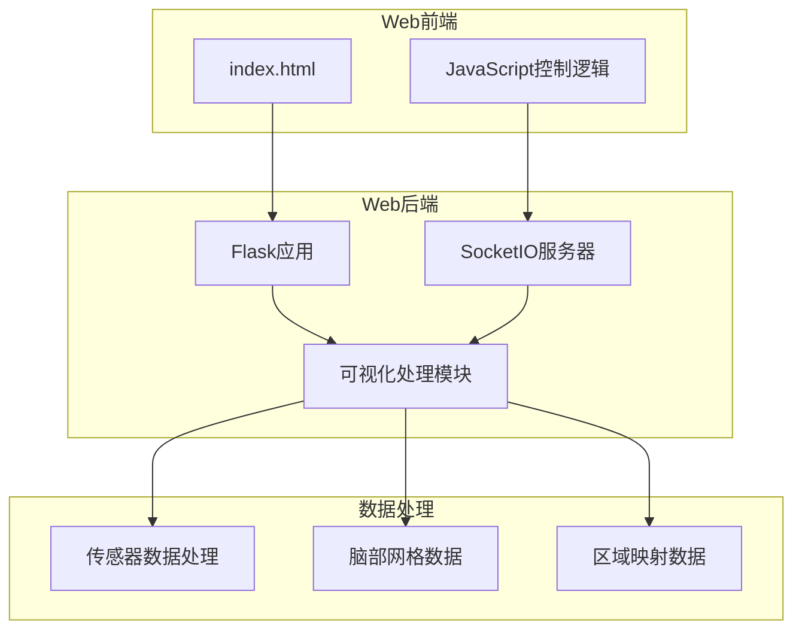
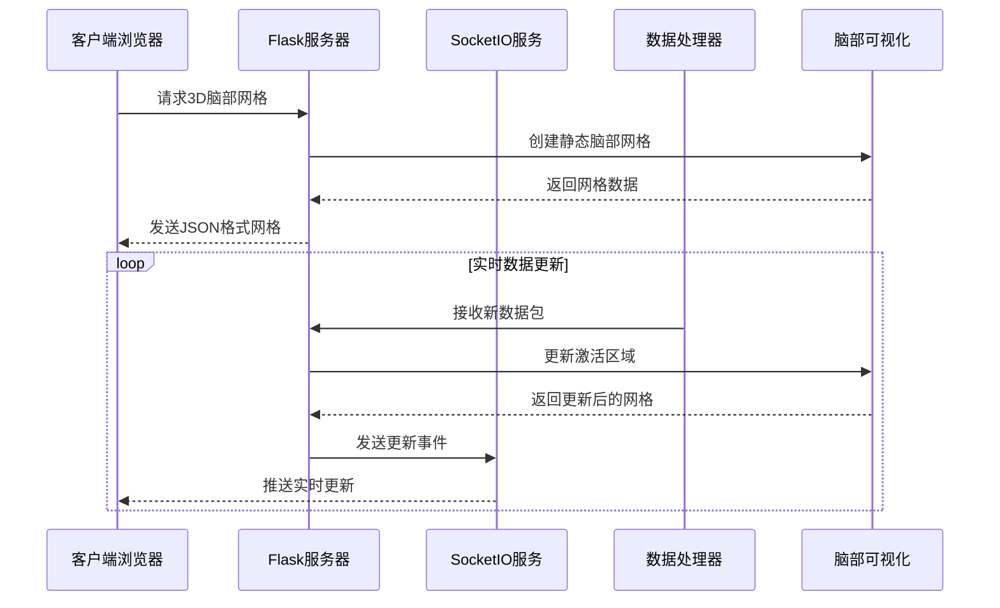
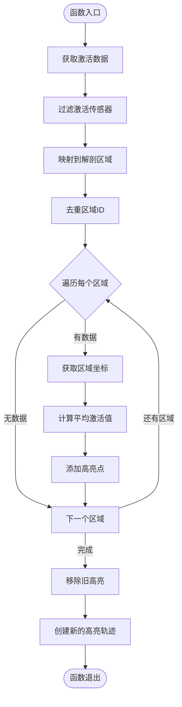
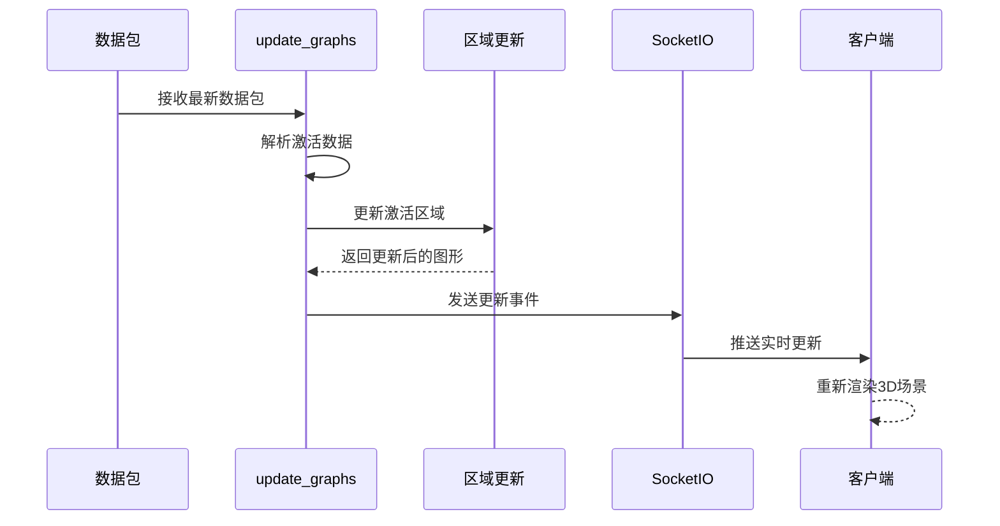
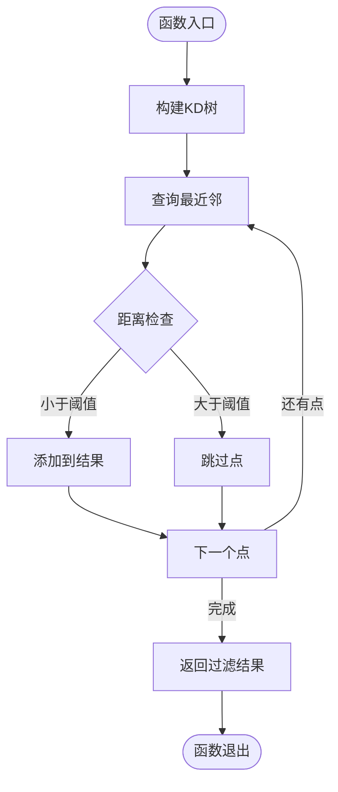
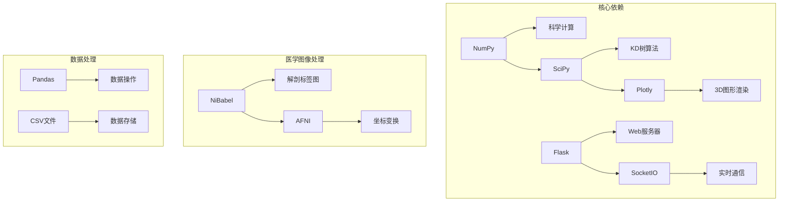

# 可视化函数

<cite>
**本文档引用的文件**
- [visualizer.py](file://software/visualizer.py)
- [index.html](file://software/index.html)
- [fNIRS_processing.py](file://software/fNIRS_processing.py)
- [config.py](file://software/config.py)
- [adc_client.py](file://software/adc_client.py)
- [adc_mock_server.py](file://software/adc_mock_server.py)
</cite>

## 目录
1. [简介](#简介)
2. [项目结构](#项目结构)
3. [核心组件](#核心组件)
4. [架构概览](#架构概览)
5. [详细组件分析](#详细组件分析)
6. [依赖关系分析](#依赖关系分析)
7. [性能考虑](#性能考虑)
8. [故障排除指南](#故障排除指南)
9. [结论](#结论)

## 简介

本文档详细介绍了fNIRS（功能性近红外光谱）系统中的3D可视化核心函数。该系统提供了实时的脑部3D可视化功能，包括静态脑部网格创建、激活区域高亮、传感器组高亮以及实时数据更新机制。系统采用Flask框架构建Web服务端，使用Plotly进行3D图形渲染，并通过SocketIO实现客户端与服务器之间的实时通信。

## 项目结构

该项目采用模块化设计，主要包含以下关键组件：



**图表来源**
- [visualizer.py:54-56](file://software/visualizer.py#L54-L56)
- [index.html:305-338](file://software/index.html#L305-L338)

**章节来源**
- [visualizer.py:1-50](file://software/visualizer.py#L1-L50)
- [index.html:1-100](file://software/index.html#L1-L100)

## 核心组件

### 3D脑部网格创建系统

系统的核心是create_static_brain_mesh函数，它负责创建完整的3D脑部可视化模型，包括：

- **脑部表面网格**：基于预加载的脑部网格数据创建半透明的粉色脑部表面
- **发射器节点**：8个白色圆柱形节点，代表光源发射器
- **探测器节点**：16个黑色圆柱形节点，代表光探测器
- **传感器组映射**：定义8个传感器组的发射器-探测器配对关系

### 实时激活区域高亮系统

update_highlighted_regions函数实现了基于激活数据的区域高亮功能：

- **区域映射**：将传感器数据映射到大脑解剖区域
- **坐标过滤**：使用KD树算法过滤接近脑表面的坐标点
- **颜色渲染**：通过红色半透明点云显示激活区域

### 传感器组高亮系统

highlight_sensor_group函数提供传感器组级别的可视化功能：

- **发射器标记**：黄色圆形标记突出显示选中的发射器
- **探测器标记**：黄色圆形标记突出显示对应的探测器
- **连接线条**：黄色线条连接发射器和探测器，形成清晰的光学路径

### 实时更新机制

update_graphs函数实现了完整的实时更新流程：

- **数据处理**：从原始数据中提取24个传感器通道的激活值
- **图形更新**：动态更新高亮区域和传感器状态
- **SocketIO通信**：通过WebSocket实时推送更新到客户端

**章节来源**
- [visualizer.py:280-354](file://software/visualizer.py#L280-L354)
- [visualizer.py:442-486](file://software/visualizer.py#L442-L486)
- [visualizer.py:489-540](file://software/visualizer.py#L489-L540)
- [visualizer.py:543-562](file://software/visualizer.py#L543-L562)

## 架构概览

系统的整体架构采用客户端-服务器模式，结合实时数据流处理：



**图表来源**
- [visualizer.py:593-618](file://software/visualizer.py#L593-L618)
- [visualizer.py:543-562](file://software/visualizer.py#L543-L562)
- [index.html:333-338](file://software/index.html#L333-L338)

## 详细组件分析

### create_static_brain_mesh函数

#### 功能概述
create_static_brain_mesh函数创建静态的3D脑部网格，这是整个可视化系统的基础。

#### 核心实现步骤

1. **脑部网格加载**：
   - 从BrainMesh_Ch2_smoothed.nv文件加载顶点坐标和三角形索引
   - 使用NiBabel库加载aal.nii解剖标签图
   - 预计算顶点法向量用于光照效果

2. **传感器位置初始化**：
   - 定义8个发射器的位置和角度
   - 定义16个探测器的分组位置
   - 计算每个传感器在世界坐标系中的精确位置

3. **网格创建过程**：
   - 添加半透明的脑部表面网格（粉色，透明度0.5）
   - 为每个发射器创建扁平圆柱体（白色，直径约10mm）
   - 为每个探测器创建扁平圆柱体（黑色，直径约10mm）

#### 参数配置

| 参数 | 类型 | 默认值 | 描述 |
|------|------|--------|------|
| radius | float | 10 | 发射器/探测器圆柱体半径（毫米） |
| height | float | 2 | 圆柱体高度（毫米） |
| resolution | int | 20 | 圆柱体网格分辨率 |
| threshold | float | 2.0 | 表面距离阈值（毫米） |

#### 使用示例

```python
# 基本使用
fig = create_static_brain_mesh()

# 自定义参数
fig = create_static_brain_mesh(radius=12, height=3, resolution=25)
```

**章节来源**
- [visualizer.py:280-354](file://software/visualizer.py#L280-L354)
- [visualizer.py:193-205](file://software/visualizer.py#L193-L205)
- [visualizer.py:207-253](file://software/visualizer.py#L207-L253)

### update_highlighted_regions函数

#### 功能概述
update_highlighted_regions函数根据激活数据动态高亮大脑区域。

#### 算法流程



**图表来源**
- [visualizer.py:442-486](file://software/visualizer.py#L442-L486)

#### 区域映射机制

系统使用预计算的数据结构来优化区域映射：

1. **传感器到区域映射**：sensor_region数组将每个传感器映射到对应的解剖区域
2. **区域到传感器索引**：region_to_sensor_indices字典建立区域到传感器的反向映射
3. **坐标过滤**：region_filtered字典缓存每个区域的表面坐标

#### 参数配置

| 参数 | 类型 | 默认值 | 描述 |
|------|------|--------|------|
| threshold | float | 2.0 | 表面距离阈值（毫米） |
| opacity | float | 0.1 | 高亮点透明度 |
| size | int | 2 | 高亮点半径（像素） |
| color | string | 'red' | 高亮颜色 |

#### 使用示例

```python
# 基本使用
hbo_values = [0.1, -0.3, 0.2, -0.5, 0.0, 0.1, -0.2, 0.3]
fig = update_highlighted_regions(fig, hbo_values)

# 自定义参数
fig = update_highlighted_regions(fig, hbo_values, threshold=1.5, opacity=0.2)
```

**章节来源**
- [visualizer.py:442-486](file://software/visualizer.py#L442-L486)
- [visualizer.py:415-437](file://software/visualizer.py#L415-L437)

### highlight_sensor_group函数

#### 功能概述
highlight_sensor_group函数高亮指定的传感器组，包括发射器、探测器和连接线。

#### 绘制策略

1. **发射器高亮**：
   - 使用黄色圆形标记（大小14）
   - 不显示图例，避免视觉干扰

2. **探测器高亮**：
   - 使用黄色圆形标记（大小12）
   - 与发射器形成对比

3. **连接线绘制**：
   - 黄色线条（宽度4）
   - 从发射器到每个探测器绘制独立线条

#### 参数配置

| 参数 | 类型 | 默认值 | 描述 |
|------|------|--------|------|
| emitter_size | int | 14 | 发射器标记大小 |
| detector_size | int | 12 | 探测器标记大小 |
| line_width | int | 4 | 连接线宽度 |
| emitter_color | string | 'yellow' | 发射器颜色 |
| detector_color | string | 'yellow' | 探测器颜色 |
| line_color | string | 'yellow' | 连接线颜色 |

#### 使用示例

```python
# 高亮第3组传感器
fig = highlight_sensor_group(fig, 3)

# 高亮多个组（需要多次调用）
for group_id in [1, 2, 5]:
    fig = highlight_sensor_group(fig, group_id)
```

**章节来源**
- [visualizer.py:489-540](file://software/visualizer.py#L489-L540)
- [visualizer.py:387-396](file://software/visualizer.py#L387-L396)

### update_graphs函数

#### 功能概述
update_graphs函数处理最新的数据包并更新3D可视化。

#### 处理流程



**图表来源**
- [visualizer.py:543-562](file://software/visualizer.py#L543-L562)

#### 数据处理逻辑

1. **数据解析**：从原始数据中提取24个传感器通道的激活值
2. **激活检测**：识别激活的传感器（hbo值小于0）
3. **区域映射**：将激活的传感器映射到解剖区域
4. **图形更新**：调用update_highlighted_regions更新高亮区域
5. **实时推送**：通过SocketIO发送更新到所有客户端

#### 性能优化

- **增量更新**：只更新变化的部分而非整个场景
- **数据缓存**：预计算区域映射和坐标过滤结果
- **异步处理**：使用事件驱动的方式处理数据更新

#### 使用示例

```python
# 处理单个数据包
latest_packet = [0.1, -0.3, 0.2, -0.5, 0.0, 0.1, -0.2, 0.3] * 12
update_graphs(latest_packet)

# 在数据流中持续调用
for packet in data_stream:
    update_graphs(packet)
```

**章节来源**
- [visualizer.py:543-562](file://software/visualizer.py#L543-L562)

### filter_coordinates_to_surface函数

#### 功能概述
filter_coordinates_to_surface函数使用KD树算法过滤接近脑表面的坐标点。

#### 算法实现



**图表来源**
- [visualizer.py:272-279](file://software/visualizer.py#L272-L279)

#### KD树算法原理

1. **预构建索引**：使用scipy.spatial.cKDTree为所有脑部表面坐标建立索引
2. **快速查询**：对每个目标坐标执行O(log n)的最近邻查询
3. **距离阈值**：只保留距离小于指定阈值的坐标点

#### 参数配置

| 参数 | 类型 | 默认值 | 描述 |
|------|------|--------|------|
| threshold | float | 2.0 | 距离阈值（毫米） |
| leafsize | int | 10 | KD树叶子节点大小 |
| metric | string | 'euclidean' | 距离度量方法 |

#### 使用示例

```python
# 基本使用
filtered_coords = filter_coordinates_to_surface(
    target_coords, 
    surface_coords, 
    threshold=2.0
)

# 自定义参数
filtered_coords = filter_coordinates_to_surface(
    target_coords, 
    surface_coords, 
    threshold=1.5, 
    leafsize=20
)
```

**章节来源**
- [visualizer.py:272-279](file://software/visualizer.py#L272-L279)

## 依赖关系分析

系统的关键依赖关系如下：



**图表来源**
- [visualizer.py:26-30](file://software/visualizer.py#L26-L30)
- [visualizer.py:193-205](file://software/visualizer.py#L193-L205)

### 外部依赖

| 依赖库 | 版本要求 | 用途 |
|--------|----------|------|
| Flask | >=2.0.0 | Web框架 |
| Flask-SocketIO | >=5.0.0 | 实时通信 |
| Plotly | >=5.0.0 | 3D图形渲染 |
| NumPy | >=1.19.0 | 数值计算 |
| SciPy | >=1.7.0 | 科学计算 |
| NiBabel | >=3.2.0 | 医学图像处理 |
| Pandas | >=1.3.0 | 数据处理 |

**章节来源**
- [visualizer.py:12-35](file://software/visualizer.py#L12-L35)

## 性能考虑

### 内存优化

1. **数据结构优化**：
   - 使用NumPy数组替代Python列表
   - 预分配固定大小的数组避免动态扩容
   - 使用dtype明确指定数据类型

2. **缓存策略**：
   - 预计算区域映射和坐标过滤结果
   - 缓存KD树索引避免重复构建
   - 使用LRU缓存管理热点数据

### 计算效率

1. **向量化操作**：
   - 使用NumPy的向量化操作替代循环
   - 利用广播机制处理批量数据
   - 减少Python层的循环开销

2. **算法优化**：
   - KD树查询的时间复杂度为O(log n)
   - 使用增量更新减少全量重绘
   - 避免不必要的数据复制

### 实时性能

1. **异步处理**：
   - 使用事件驱动的SocketIO架构
   - 非阻塞的数据处理管道
   - 多线程并发处理

2. **资源管理**：
   - 合理设置数据队列大小
   - 实现优雅的资源清理
   - 监控内存使用情况

## 故障排除指南

### 常见问题及解决方案

#### 1. 脑部网格加载失败

**症状**：启动时出现文件不存在错误

**原因分析**：
- BrainMesh_Ch2_smoothed.nv文件缺失
- aal.nii文件损坏或版本不兼容

**解决方法**：
```bash
# 检查文件是否存在
ls -la BrainMesh_Ch2_smoothed.nv
ls -la aal.nii

# 验证文件完整性
file BrainMesh_Ch2_smoothed.nv
file aal.nii
```

#### 2. 传感器位置映射错误

**症状**：发射器和探测器位置不正确

**原因分析**：
- 初始化传感器位置的坐标不匹配
- 坐标系转换错误

**解决方法**：
```python
# 验证传感器位置
print("发射器数量:", len(emitter_positions))
print("探测器数量:", len(detector_positions))

# 检查坐标范围
print("发射器X范围:", np.min(emitter_positions[:, 0]), "to", np.max(emitter_positions[:, 0]))
print("探测器Y范围:", np.min(detector_positions[:, 1]), "to", np.max(detector_positions[:, 1]))
```

#### 3. 实时数据更新延迟

**症状**：3D可视化响应延迟明显

**原因分析**：
- SocketIO连接不稳定
- 数据处理速度不足
- 客户端渲染性能问题

**解决方法**：
```python
# 检查SocketIO连接状态
# 增加日志输出
logging.basicConfig(level=logging.DEBUG)

# 优化数据处理流程
# 考虑使用更高效的算法
```

#### 4. 内存泄漏问题

**症状**：长时间运行后内存使用持续增长

**原因分析**：
- 图形对象未正确清理
- 数据队列未及时消费
- 缓存数据过多

**解决方法**：
```python
# 实施定期清理
def cleanup_resources():
    # 清理图形对象
    # 重置全局变量
    # 清空数据队列

# 监控内存使用
import psutil
process = psutil.Process()
print(f"内存使用: {process.memory_info().rss / 1024 / 1024:.2f} MB")
```

### 调试工具

#### 1. 日志配置

```python
import logging
logging.basicConfig(
    level=logging.DEBUG,
    format='%(asctime)s - %(name)s - %(levelname)s - %(message)s'
)
```

#### 2. 性能监控

```python
import time
import tracemalloc

# 开始性能跟踪
tracemalloc.start()

# 执行可能耗时的操作
start_time = time.time()
result = heavy_operation()
end_time = time.time()

# 输出性能信息
current, peak = tracemalloc.get_traced_memory()
print(f"当前内存使用: {current / 1024 / 1024:.2f} MB")
print(f"峰值内存使用: {peak / 1024 / 1024:.2f} MB")
print(f"执行时间: {end_time - start_time:.2f} 秒")
```

#### 3. 数据验证

```python
def validate_data(data):
    """验证输入数据的有效性"""
    if data is None:
        raise ValueError("数据为空")
    
    if len(data) != 24:
        raise ValueError(f"数据长度应为24，实际为{len(data)}")
    
    # 检查数值范围
    for i, value in enumerate(data):
        if not isinstance(value, (int, float)):
            raise TypeError(f"第{i}个值不是数字类型")
        
        if abs(value) > 1000:  # 设置合理的阈值
            logging.warning(f"第{i}个值异常: {value}")
```

## 结论

本文档详细介绍了fNIRS系统中3D可视化核心函数的设计与实现。系统通过精心设计的算法和优化策略，实现了高效、实时的大脑3D可视化功能。

### 主要成就

1. **完整的可视化管道**：从数据接收、处理到3D渲染的完整流程
2. **高效的算法实现**：使用KD树和预计算优化提升性能
3. **实时交互能力**：通过SocketIO实现实时数据更新和用户交互
4. **可扩展的架构**：模块化的代码设计便于功能扩展和维护

### 技术亮点

- **智能坐标过滤**：使用KD树算法精确过滤接近脑表面的坐标点
- **区域映射优化**：预计算的数据结构显著提升区域映射效率
- **增量更新机制**：只更新变化的部分，减少不必要的重绘
- **多传感器组支持**：灵活的传感器组配置和高亮功能

### 未来改进方向

1. **GPU加速**：利用CUDA或OpenGL加速3D渲染
2. **数据压缩**：实现数据压缩传输减少网络带宽占用
3. **多模态融合**：集成其他成像技术如EEG、MEG
4. **移动端支持**：开发移动应用版本扩大使用场景

该系统为fNIRS数据分析提供了直观、高效的可视化工具，为神经科学研究和临床应用奠定了坚实的技术基础。