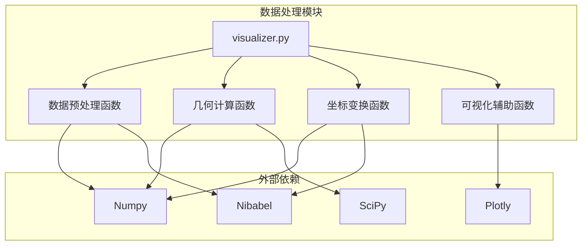
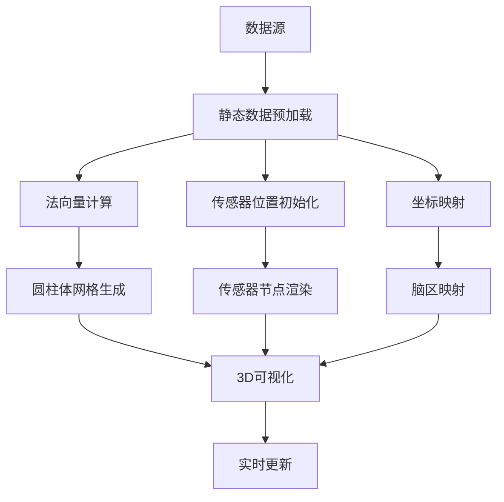
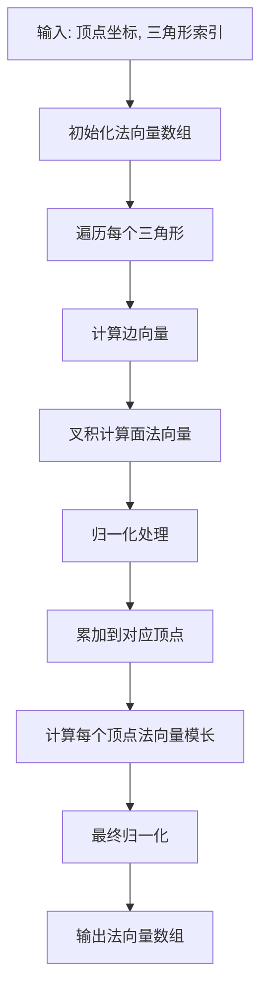
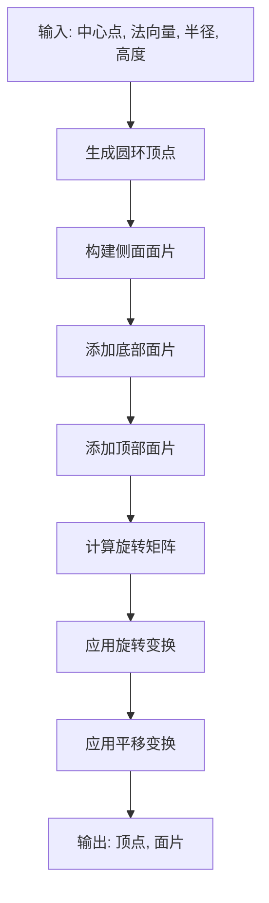
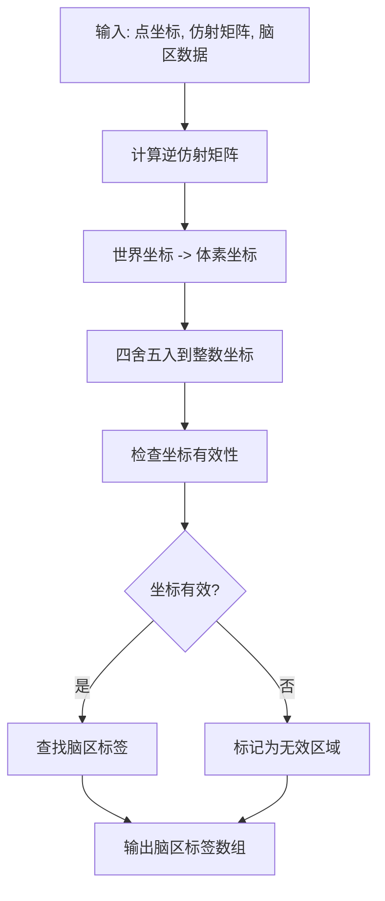
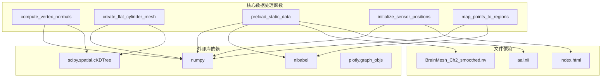

# 数据处理函数

<cite>
**本文档引用的文件**
- [visualizer.py](file://software/visualizer.py)
</cite>

## 目录
1. [简介](#简介)
2. [项目结构](#项目结构)
3. [核心组件](#核心组件)
4. [架构概览](#架构概览)
5. [详细组件分析](#详细组件分析)
6. [依赖关系分析](#依赖关系分析)
7. [性能考虑](#性能考虑)
8. [故障排除指南](#故障排除指南)
9. [结论](#结论)

## 简介

本文档详细记录了fNIRS项目中的数据处理核心函数，包括法向量计算、圆柱体网格生成、静态数据预加载、传感器位置初始化和坐标映射等关键功能。这些函数构成了实时fNIRS数据可视化系统的核心数据处理管道。

## 项目结构

本项目采用模块化设计，主要的数据处理逻辑集中在`software/visualizer.py`文件中，该文件包含了完整的3D脑部可视化和数据处理功能。

**图表来源**
- [visualizer.py:12-35](file://software/visualizer.py#L12-L35)

**章节来源**
- [visualizer.py:1-50](file://software/visualizer.py#L1-L50)

## 核心组件

本项目包含以下关键数据处理函数：

1. **compute_vertex_normals**: 计算网格顶点的法向量
2. **create_flat_cylinder_mesh**: 生成扁平圆柱体网格
3. **preload_static_data**: 预加载静态数据
4. **initialize_sensor_positions**: 初始化传感器位置
5. **map_points_to_regions**: 坐标映射到脑区

**章节来源**
- [visualizer.py:123-190](file://software/visualizer.py#L123-L190)
- [visualizer.py:193-270](file://software/visualizer.py#L193-L270)
- [visualizer.py:207-253](file://software/visualizer.py#L207-L253)
- [visualizer.py:255-270](file://software/visualizer.py#L255-L270)

## 架构概览

整个数据处理系统采用分层架构，从底层的数据读取到高层的可视化呈现：

**图表来源**
- [visualizer.py:193-270](file://software/visualizer.py#L193-L270)
- [visualizer.py:280-354](file://software/visualizer.py#L280-L354)

## 详细组件分析

### compute_vertex_normals 函数

#### 功能概述
计算三维网格中每个顶点的法向量，用于光照计算和表面渲染。

#### 输入参数
- `vertices`: ndarray, 形状为(N×3)，表示网格顶点坐标
- `triangles`: ndarray, 形状为(M×3)，表示三角形面片索引

#### 计算逻辑
1. 初始化法向量数组为零向量
2. 对每个三角形面片：
   - 计算两条边向量
   - 使用叉积计算面法向量
   - 归一化后累加到三个顶点
3. 对每个顶点法向量进行归一化处理

#### 输出格式
- 返回形状为(N×3)的法向量数组

**图表来源**
- [visualizer.py:123-137](file://software/visualizer.py#L123-L137)

**章节来源**
- [visualizer.py:123-137](file://software/visualizer.py#L123-L137)

### create_flat_cylinder_mesh 函数

#### 功能概述
生成扁平圆柱体网格，用于渲染传感器节点（发射器和探测器）。

#### 输入参数
- `center`: ndarray, 形状为(3,)，圆柱体中心坐标
- `normal`: ndarray, 形状为(3,)，圆柱体轴向量
- `radius`: float，圆柱体半径
- `height`: float，默认1.0，圆柱体高度
- `resolution`: int，默认20，圆周采样点数
- `angle`: float，默认0.0，初始旋转角度

#### 计算逻辑
1. 生成上下两个圆环的顶点坐标
2. 构建侧面的矩形面片
3. 添加底部和顶部的圆形面片
4. 计算旋转矩阵将z轴对齐到指定法向量
5. 应用旋转和平移变换

#### 输出格式
- 返回元组：(vertices, faces)
  - `vertices`: ndarray，形状为(K×3)，顶点坐标
  - `faces`: list，面片索引列表

**图表来源**
- [visualizer.py:139-190](file://software/visualizer.py#L139-L190)

**章节来源**
- [visualizer.py:139-190](file://software/visualizer.py#L139-L190)

### preload_static_data 函数

#### 功能概述
预加载静态脑部网格数据和相关配置信息。

#### 处理流程
1. 读取脑部网格坐标文件（BrainMesh_Ch2_smoothed.nv）
2. 读取三角形面片索引文件
3. 加载AAL图谱NIfTI文件
4. 提取仿射变换矩阵

#### 输出格式
返回元组：(coords, x, y, z, i, j, k, aal_data, affine)

#### 文件依赖
- BrainMesh_Ch2_smoothed.nv：包含顶点坐标和面片索引
- aal.nii：包含脑区标注的NIfTI文件

**章节来源**
- [visualizer.py:193-205](file://software/visualizer.py#L193-L205)

### initialize_sensor_positions 函数

#### 功能概述
定义自定义传感器位置，包括发射器和探测器的坐标定义。

#### 输入参数
- `coords`: ndarray，用于查询最近邻的参考坐标

#### 输出格式
返回元组：(emitter_positions, emitter_angles, detector_positions, detector_angles)

#### 传感器配置
- 发射器（8个节点）：位于大脑外侧区域
- 探测器（16个节点）：分布在多个脑区
- 每个传感器分配相应的旋转角度

**章节来源**
- [visualizer.py:207-253](file://software/visualizer.py#L207-L253)

### map_points_to_regions 函数

#### 功能概述
将世界坐标系中的点映射到对应的脑区标签。

#### 输入参数
- `points`: ndarray，形状为(N×3)，待映射的点坐标
- `affine`: ndarray，形状为(4×4)，仿射变换矩阵
- `aal_data`: ndarray，脑区标注数据

#### 计算逻辑
1. 使用仿射矩阵的逆矩阵将世界坐标转换为体素坐标
2. 四舍五入到最近的整数体素坐标
3. 检查体素坐标是否在有效范围内
4. 查找对应的脑区标签

#### 输出格式
- 返回长度为N的数组，包含每个点对应的脑区标签

**图表来源**
- [visualizer.py:255-270](file://software/visualizer.py#L255-L270)

**章节来源**
- [visualizer.py:255-270](file://software/visualizer.py#L255-L270)

## 依赖关系分析

**图表来源**
- [visualizer.py:12-35](file://software/visualizer.py#L12-L35)
- [visualizer.py:193-205](file://software/visualizer.py#L193-L205)

**章节来源**
- [visualizer.py:12-35](file://software/visualizer.py#L12-L35)

## 性能考虑

### 时间复杂度分析
- **compute_vertex_normals**: O(T×V)，其中T为面片数量，V为顶点数量
- **create_flat_cylinder_mesh**: O(R)，其中R为圆周采样点数
- **preload_static_data**: O(V)，主要受限于文件I/O
- **initialize_sensor_positions**: O(1)，固定大小数组操作
- **map_points_to_regions**: O(P)，其中P为点的数量

### 内存使用优化
- 使用numpy数组进行向量化计算
- 预分配内存空间避免动态增长
- 合理使用数据类型减少内存占用

### 缓存策略
- 预加载静态数据到全局变量
- 预计算传感器到区域的映射关系
- 使用KDTree加速空间查询

## 故障排除指南

### 常见问题及解决方案

#### 文件读取错误
**问题**: 无法找到BrainMesh_Ch2_smoothed.nv或aal.nii文件
**解决方案**: 确保数据文件与脚本在同一目录下，检查文件权限

#### NIfTI文件格式错误
**问题**: nibabel读取NIfTI文件失败
**解决方案**: 验证NIfTI文件完整性，确保使用兼容版本的nibabel库

#### 内存不足
**问题**: 大型脑部网格数据导致内存溢出
**解决方案**: 优化数据结构，考虑分块处理大数据集

#### 仿射变换异常
**问题**: 坐标映射结果不正确
**解决方案**: 验证仿射矩阵的有效性，检查坐标系一致性

**章节来源**
- [visualizer.py:193-205](file://software/visualizer.py#L193-L205)
- [visualizer.py:255-270](file://software/visualizer.py#L255-L270)

## 结论

本数据处理核心函数提供了完整的fNIRS数据可视化基础设施，包括：

1. **高效的几何计算**：通过向量化操作实现快速的法向量计算和网格生成
2. **精确的坐标变换**：利用仿射变换实现世界坐标与体素坐标的准确映射
3. **可扩展的数据架构**：模块化的函数设计便于维护和扩展
4. **实时性能优化**：通过预计算和缓存策略确保交互式可视化流畅运行

这些函数共同构成了实时fNIRS数据可视化系统的核心，为神经光学成像研究提供了强大的数据处理能力。