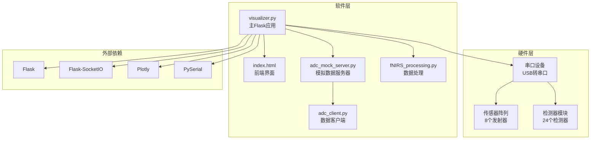
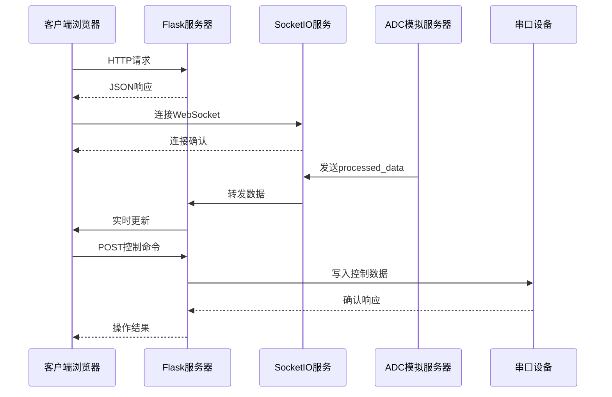
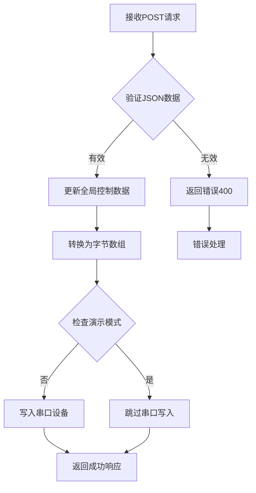
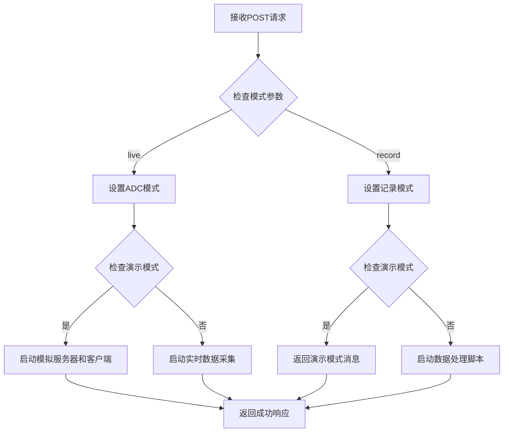
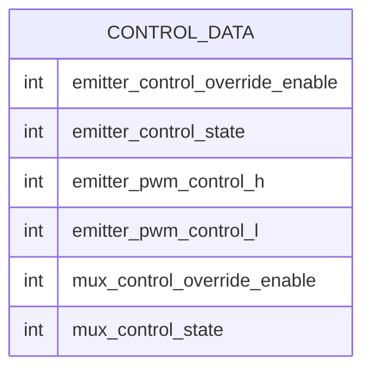
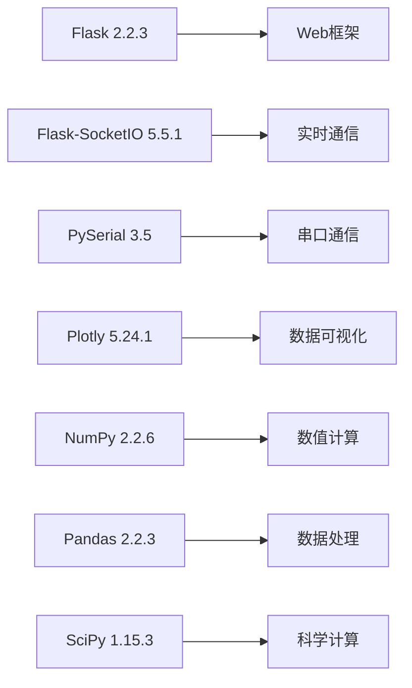
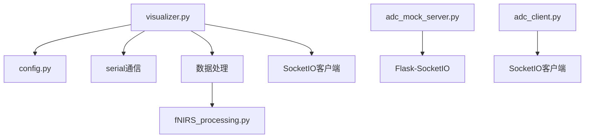

# HTTP REST API接口

<cite>
**本文档引用的文件**
- [visualizer.py](file://software/visualizer.py)
- [index.html](file://software/index.html)
- [adc_mock_server.py](file://software/adc_mock_server.py)
- [adc_client.py](file://software/adc_client.py)
- [fNIRS_processing.py](file://software/fNIRS_processing.py)
- [config.py](file://software/config.py)
- [requirements.txt](file://software/requirements.txt)
</cite>

## 目录
1. [简介](#简介)
2. [项目结构](#项目结构)
3. [核心组件](#核心组件)
4. [架构概览](#架构概览)
5. [详细组件分析](#详细组件分析)
6. [依赖关系分析](#依赖关系分析)
7. [性能考虑](#性能考虑)
8. [故障排除指南](#故障排除指南)
9. [结论](#结论)

## 简介

本项目是一个基于Flask的Web服务器，为fNIRS（功能性近红外光谱）系统提供HTTP REST API接口。该系统允许用户通过Web界面实时监控和控制fNIRS设备，包括发射器控制、多路复用器控制、数据采集和可视化等功能。

系统采用前后端分离架构，前端使用HTML/CSS/JavaScript构建交互式Web界面，后端使用Flask提供REST API服务，并通过SocketIO实现实时数据传输。

## 项目结构

**图表来源**
- [visualizer.py:54-56](file://software/visualizer.py#L54-L56)
- [requirements.txt:1-15](file://software/requirements.txt#L1-L15)

**章节来源**
- [visualizer.py:1-10](file://software/visualizer.py#L1-L10)
- [requirements.txt:1-15](file://software/requirements.txt#L1-L15)

## 核心组件

### Flask Web服务器
主应用程序基于Flask框架，提供REST API服务和WebSocket连接支持。服务器监听端口8050，支持跨域资源共享。

### 实时数据传输
系统使用Flask-SocketIO实现双向实时通信，支持以下事件：
- `processed_data`: 接收处理后的传感器数据
- `brain_mesh_update`: 更新3D脑部模型可视化
- `sensor_array`: 发送传感器数组数据

### 数据处理管道
系统集成了完整的fNIRS数据处理流程，包括：
- 原始ADC数据捕获
- 数据过滤和预处理
- Modified Beer-Lambert Law (MBLL) 计算
- 动画和静态可视化

**章节来源**
- [visualizer.py:54-56](file://software/visualizer.py#L54-L56)
- [visualizer.py:67-98](file://software/visualizer.py#L67-L98)
- [fNIRS_processing.py:1-25](file://software/fNIRS_processing.py#L1-L25)

## 架构概览

**图表来源**
- [visualizer.py:648-690](file://software/visualizer.py#L648-L690)
- [adc_mock_server.py:48-64](file://software/adc_mock_server.py#L48-L64)

## 详细组件分析

### API端点定义

#### 基础路由
- **GET /** - 返回主页面
- **GET /update_graphs** - 获取当前脑部模型数据
- **GET /select_group/{group_id}** - 高亮显示指定传感器组

#### 控制相关端点
- **POST /update_emitter_states** - 更新发射器状态
- **POST /update_control_data** - 更新控制数据（发射器和多路复用器）

#### 处理控制端点
- **POST /start_processing** - 启动数据处理
- **POST /stop_processing** - 停止数据处理

#### 文件操作端点
- **GET /download/{source}** - 下载CSV文件
- **GET /view_static/{source}** - 查看静态图表
- **GET /view_animation/{source}** - 查看动画效果

**章节来源**
- [visualizer.py:593-646](file://software/visualizer.py#L593-L646)
- [visualizer.py:648-734](file://software/visualizer.py#L648-L734)
- [visualizer.py:736-922](file://software/visualizer.py#L736-L922)

### 请求处理流程

#### 控制数据更新流程

**图表来源**
- [visualizer.py:630-646](file://software/visualizer.py#L630-L646)

#### 数据处理启动流程

**图表来源**
- [visualizer.py:648-690](file://software/visualizer.py#L648-L690)

### 数据模型

#### 控制数据结构

#### 传感器数据结构
每个传感器组包含3个检测器通道，共8个组，总计24个通道：
- **Short**: 短基线测量
- **Long1/Long2**: 长基线测量
- **Emitter**: 发射器状态

**章节来源**
- [visualizer.py:376-384](file://software/visualizer.py#L376-L384)
- [fNIRS_processing.py:160-185](file://software/fNIRS_processing.py#L160-L185)

## 依赖关系分析

### 外部依赖
系统依赖以下关键库：

**图表来源**
- [requirements.txt:1-15](file://software/requirements.txt#L1-L15)

### 内部组件依赖

**图表来源**
- [visualizer.py:34-35](file://software/visualizer.py#L34-L35)
- [fNIRS_processing.py:20-23](file://software/fNIRS_processing.py#L20-L23)

**章节来源**
- [requirements.txt:1-15](file://software/requirements.txt#L1-L15)
- [visualizer.py:34-35](file://software/visualizer.py#L34-L35)

## 性能考虑

### 实时数据处理
- **缓冲区管理**: 使用Queue管理最多20个数据包，避免内存溢出
- **线程同步**: 使用Lock确保多线程环境下的数据一致性
- **数据队列**: 支持先进先出的数据流处理

### 网络优化
- **异步模式**: 使用eventlet异步模式提高并发处理能力
- **CORS配置**: 允许跨域访问，便于前端应用集成
- **压缩传输**: SocketIO自动处理消息压缩

### 内存管理
- **数据包限制**: 限制同时在内存中的数据包数量
- **及时清理**: 使用完成后及时释放资源
- **进程管理**: 正确管理子进程生命周期

## 故障排除指南

### 常见问题及解决方案

#### 串口连接问题
- **症状**: 无法连接到fNIRS设备
- **原因**: 串口路径配置错误或设备未连接
- **解决**: 检查config.py中的SERIAL_PORT配置

#### WebSocket连接失败
- **症状**: 页面无法实时更新数据
- **原因**: 端口冲突或网络问题
- **解决**: 确保端口8050可用，检查防火墙设置

#### 数据处理异常
- **症状**: 数据处理过程中断
- **原因**: 子进程异常退出
- **解决**: 检查子进程日志，重新启动服务

**章节来源**
- [config.py:7-13](file://software/config.py#L7-L13)
- [visualizer.py:691-713](file://software/visualizer.py#L691-L713)

## 结论

本HTTP REST API接口为fNIRS系统提供了完整、可靠的Web控制和数据访问能力。系统具有以下特点：

1. **完整的功能覆盖**: 包含设备控制、数据采集、处理和可视化
2. **实时性**: 通过SocketIO实现低延迟数据传输
3. **可扩展性**: 基于模块化设计，易于添加新功能
4. **可靠性**: 包含完善的错误处理和恢复机制

对于第三方集成，建议重点关注以下方面：
- 正确处理JSON请求格式
- 实现适当的错误重试机制
- 考虑网络延迟对实时性的影响
- 遵循演示模式和真实设备模式的不同行为