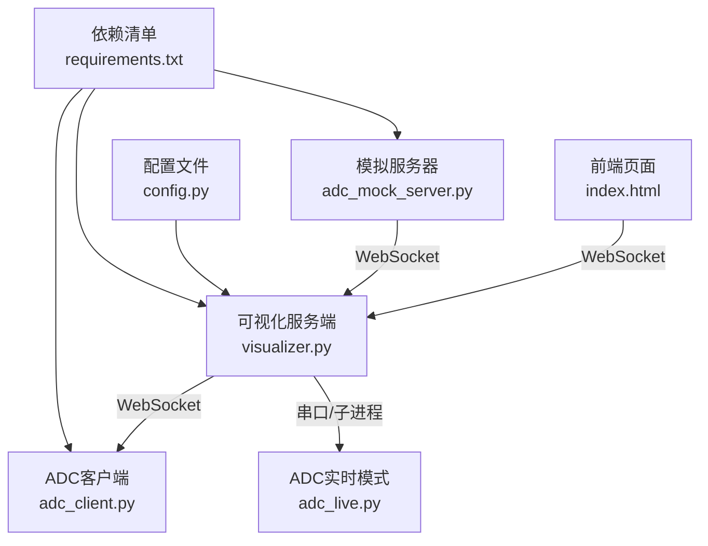
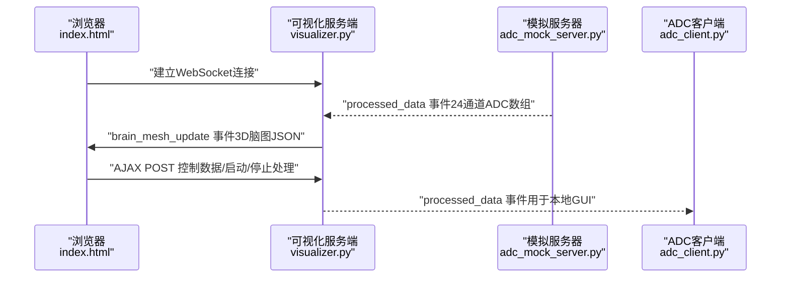
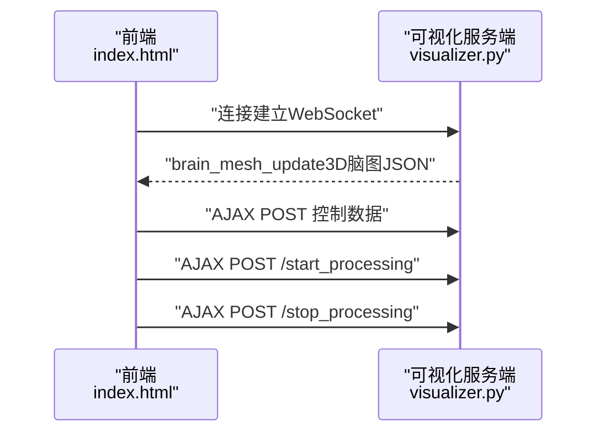
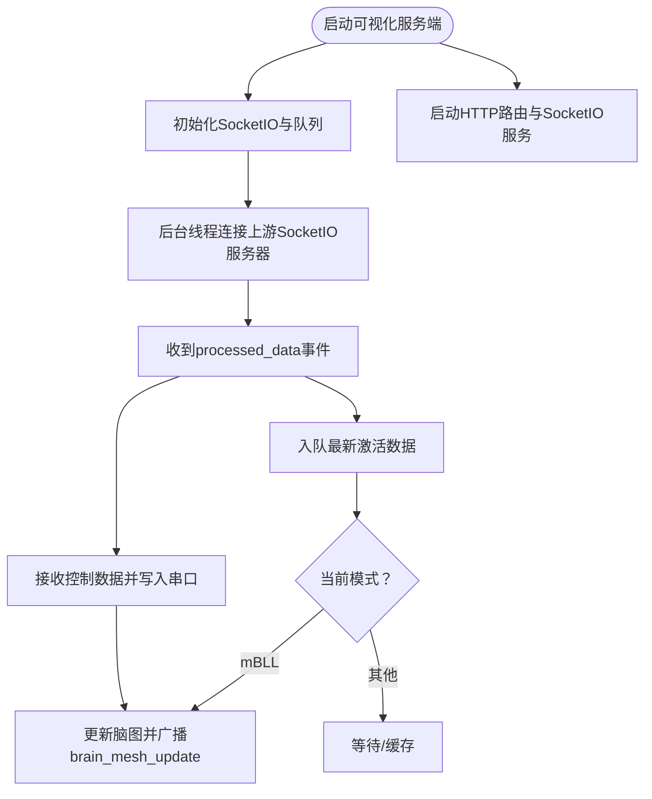
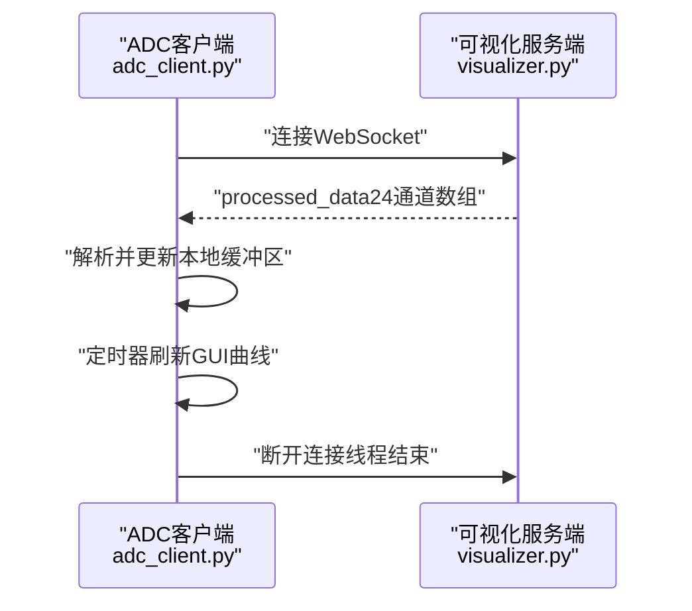
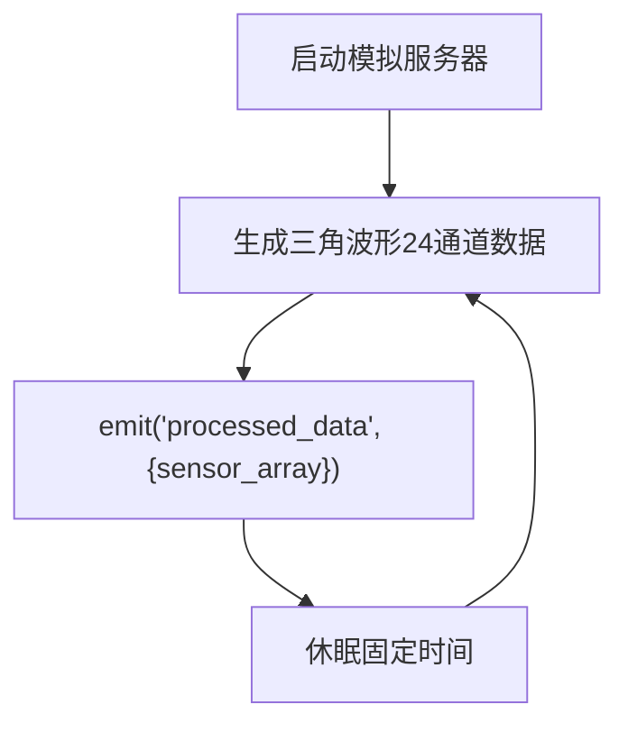
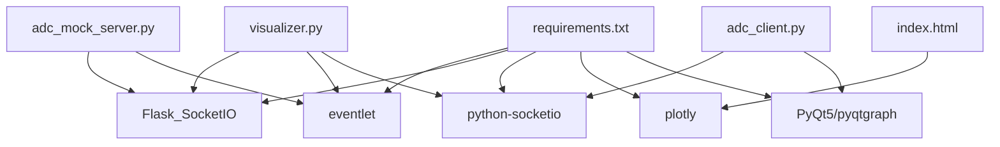

# SocketIO实时通信协议

<cite>
**本文档引用的文件**
- [index.html](file://software/index.html)
- [visualizer.py](file://software/visualizer.py)
- [adc_client.py](file://software/adc_client.py)
- [adc_mock_server.py](file://software/adc_mock_server.py)
- [adc_live.py](file://software/adc_live.py)
- [config.py](file://software/config.py)
- [requirements.txt](file://software/requirements.txt)
</cite>

## 目录
1. [简介](#简介)
2. [项目结构](#项目结构)
3. [核心组件](#核心组件)
4. [架构总览](#架构总览)
5. [详细组件分析](#详细组件分析)
6. [依赖关系分析](#依赖关系分析)
7. [性能考虑](#性能考虑)
8. [故障排除指南](#故障排除指南)
9. [结论](#结论)
10. [附录](#附录)

## 简介
本文件面向SocketIO实时通信协议的技术文档，聚焦于Python服务器端与客户端之间的WebSocket通信实现，涵盖连接建立、事件类型定义、消息格式规范、实时数据传输协议（ADC数据流、状态更新、控制指令）、客户端连接管理（连接状态监控、重连机制、错误处理）、完整API规范（事件名称、数据载荷格式、回调函数定义），以及系统集成的性能优化建议与调试工具使用指南。文档基于仓库中的前端页面、可视化服务端、ADC客户端与模拟服务器等源码进行分析与总结。

## 项目结构
该仓库中与SocketIO实时通信直接相关的核心文件如下：
- 前端页面：index.html，负责加载Plotly、jQuery与Socket.IO客户端，并监听与发送事件
- 可视化服务端：visualizer.py，作为Flask应用承载SocketIO服务端，接收上游数据并向前端推送脑图更新
- ADC客户端：adc_client.py，使用python-socketio在独立线程中连接SocketIO服务器并接收processed_data事件
- 模拟服务器：adc_mock_server.py，使用Flask-SocketIO模拟上游数据源，周期性发送processed_data事件
- ADC实时模式：adc_live.py，串口读取原始ADC数据并在本地GUI中显示
- 配置文件：config.py，定义串口参数
- 依赖清单：requirements.txt，列出事件驱动与SocketIO相关依赖

图表来源
- [index.html:305-338](file://software/index.html#L305-L338)
- [visualizer.py:54-948](file://software/visualizer.py#L54-L948)
- [adc_client.py:39-85](file://software/adc_client.py#L39-L85)
- [adc_mock_server.py:15-64](file://software/adc_mock_server.py#L15-L64)
- [adc_live.py:18-206](file://software/adc_live.py#L18-L206)
- [config.py:7-12](file://software/config.py#L7-L12)
- [requirements.txt:1-15](file://software/requirements.txt#L1-L15)

章节来源
- [index.html:1-750](file://software/index.html#L1-L750)
- [visualizer.py:1-949](file://software/visualizer.py#L1-L949)
- [adc_client.py:1-181](file://software/adc_client.py#L1-L181)
- [adc_mock_server.py:1-65](file://software/adc_mock_server.py#L1-L65)
- [adc_live.py:1-210](file://software/adc_live.py#L1-L210)
- [config.py:1-13](file://software/config.py#L1-L13)
- [requirements.txt:1-15](file://software/requirements.txt#L1-L15)

## 核心组件
- 前端SocketIO客户端
  - 在index.html中通过Socket.IO客户端库建立WebSocket连接，监听“brain_mesh_update”事件并渲染3D脑图
  - 通过AJAX向后端发送控制数据（发射器与MUX状态）与启动/停止处理请求
- 可视化服务端（Flask-SocketIO）
  - 提供静态页面路由、交互接口（开始/停止处理、下载CSV、查看静态/动画图）
  - 接收上游processed_data事件，计算激活区域并广播“brain_mesh_update”事件给前端
  - 启动/停止子进程以运行ADC实时或处理流程；在停止时重初始化串口
- ADC客户端（python-socketio）
  - 在独立线程中连接SocketIO服务器，监听“processed_data”事件，解析传感器数组并更新本地GUI
- 模拟服务器（Flask-SocketIO）
  - 生成三角波形的24通道ADC数据，周期性发送“processed_data”事件
- ADC实时模式（本地GUI）
  - 从串口读取原始64字节包，解析为8组×5字段的数据，本地实时绘制

章节来源
- [index.html:305-338](file://software/index.html#L305-L338)
- [visualizer.py:67-98](file://software/visualizer.py#L67-L98)
- [visualizer.py:543-562](file://software/visualizer.py#L543-L562)
- [adc_client.py:39-85](file://software/adc_client.py#L39-L85)
- [adc_mock_server.py:30-61](file://software/adc_mock_server.py#L30-L61)
- [adc_live.py:24-78](file://software/adc_live.py#L24-L78)

## 架构总览
下图展示了SocketIO在系统中的角色与交互路径：前端通过WebSocket订阅可视化服务端；可视化服务端作为中间层，既接收上游数据（来自模拟服务器或真实设备），也向前端推送可视化更新；同时通过串口或子进程与硬件/数据处理链路对接。

图表来源
- [index.html:305-338](file://software/index.html#L305-L338)
- [visualizer.py:543-562](file://software/visualizer.py#L543-L562)
- [adc_mock_server.py:48-61](file://software/adc_mock_server.py#L48-L61)
- [adc_client.py:59-66](file://software/adc_client.py#L59-L66)

## 详细组件分析

### 前端SocketIO客户端（index.html）
- 连接建立
  - 使用Socket.IO客户端库建立WebSocket连接，默认自动重连
- 事件监听
  - 监听“brain_mesh_update”，解析返回的Plotly图JSON并更新3D脑图容器
- 事件发送
  - 通过AJAX向后端发送控制数据（发射器/_MUX状态、覆盖使能等）
  - 发送“开始/停止处理”请求，选择模式与数据源
- 数据载荷格式
  - 控制数据：整型字段集合（覆盖使能、状态值、PWM寄存器高位/低位）
  - 处理控制：{mode: "live"|"record", sources: ["ADC"| "mBLL"]}

图表来源
- [index.html:333-338](file://software/index.html#L333-L338)
- [index.html:492-513](file://software/index.html#L492-L513)
- [index.html:632-723](file://software/index.html#L632-L723)
- [visualizer.py:648-689](file://software/visualizer.py#L648-L689)
- [visualizer.py:692-713](file://software/visualizer.py#L692-L713)

章节来源
- [index.html:305-338](file://software/index.html#L305-L338)
- [index.html:492-513](file://software/index.html#L492-L513)
- [index.html:632-723](file://software/index.html#L632-L723)

### 可视化服务端（visualizer.py）
- SocketIO服务端
  - 使用Flask-SocketIO，异步模式为eventlet，跨域允许所有来源
  - 监听上游“processed_data”事件，入队最新激活数据，必要时立即更新脑图
- 脑图更新
  - 将最新的24通道hbo/hbr数据映射到脑区，生成高亮区域并以JSON形式广播“brain_mesh_update”
- 控制与处理接口
  - /update_control_data：接收控制数据，写入串口（非演示模式）
  - /start_processing：根据模式启动子进程（ADC实时或数据处理）
  - /stop_processing：向子进程发送信号以优雅停止，并重初始化串口
- 上游SocketIO客户端
  - 后台线程持续尝试连接上游服务器（默认本地5000端口），失败自动重试

图表来源
- [visualizer.py:54-948](file://software/visualizer.py#L54-L948)
- [visualizer.py:648-713](file://software/visualizer.py#L648-L713)

章节来源
- [visualizer.py:54-948](file://software/visualizer.py#L54-L948)

### ADC客户端（adc_client.py）
- 连接与事件
  - 在独立线程中连接本地SocketIO服务器，监听“processed_data”事件
  - 解析消息中的传感器数组（长度应为24），按组与通道追加到环形缓冲区
- GUI更新
  - 定时器周期性将缓冲区数据转换为绘图点并刷新曲线
- 错误处理
  - 捕获连接异常并打印错误信息，线程退出时断开连接

图表来源
- [adc_client.py:39-85](file://software/adc_client.py#L39-L85)
- [adc_client.py:144-176](file://software/adc_client.py#L144-L176)

章节来源
- [adc_client.py:1-181](file://software/adc_client.py#L1-L181)

### 模拟服务器（adc_mock_server.py）
- 数据生成
  - 生成24通道三角波形数据，周期性发送“processed_data”事件
- 异步模式
  - 使用eventlet与Flask-SocketIO，后台任务持续发射数据

图表来源
- [adc_mock_server.py:30-61](file://software/adc_mock_server.py#L30-L61)

章节来源
- [adc_mock_server.py:1-65](file://software/adc_mock_server.py#L1-L65)

### ADC实时模式（adc_live.py）
- 串口解析
  - 读取64字节数据包，解析为8组×5字段（组ID、短/长通道1/2、发射器状态）
- GUI显示
  - 使用pyqtgraph实时绘制每组3通道的时间序列曲线
- 线程模型
  - 串口读取在线程中执行，解析后的数组通过信号传递到主线程更新GUI

章节来源
- [adc_live.py:1-210](file://software/adc_live.py#L1-L210)

## 依赖关系分析
- 事件驱动与异步
  - 依赖eventlet实现高性能异步I/O，支持大量并发连接
- SocketIO客户端/服务端
  - python-socketio用于客户端，Flask-SocketIO用于服务端，统一事件模型
- 前端SocketIO
  - index.html通过CDN引入Socket.IO客户端库，版本与后端兼容

图表来源
- [requirements.txt:1-15](file://software/requirements.txt#L1-L15)
- [visualizer.py:23-34](file://software/visualizer.py#L23-L34)
- [adc_client.py:13-15](file://software/adc_client.py#L13-L15)
- [adc_mock_server.py:11-13](file://software/adc_mock_server.py#L11-L13)
- [index.html:8-12](file://software/index.html#L8-L12)

章节来源
- [requirements.txt:1-15](file://software/requirements.txt#L1-L15)

## 性能考虑
- 异步模式
  - 使用eventlet与Flask-SocketIO的异步模式，提升并发与吞吐量
- 数据队列与锁
  - 服务端使用线程安全队列与锁保护共享数据，避免竞争条件
- 前端渲染
  - 仅在需要时更新脑图，避免频繁重绘；合理设置定时器刷新频率
- 串口与子进程
  - 串口读取采用缓冲与分包解析，避免阻塞主线程；子进程通过信号优雅停止
- 建议
  - 对高频事件（如ADC数据流）可考虑批量聚合与降采样
  - 前端对Plotly图进行增量更新而非全量替换
  - 服务端对控制数据写入串口增加去抖与校验

[本节为通用性能指导，不直接分析具体文件]

## 故障排除指南
- 连接问题
  - 前端无法连接：检查服务端是否启动、端口是否正确、CORS设置
  - 上游连接失败：确认上游服务器地址与端口，查看后台线程重连日志
- 数据格式错误
  - processed_data事件载荷需包含24通道数组；若长度不符，客户端将忽略
- 串口通信
  - 确认config.py中的串口路径与波特率；停止处理后需重初始化串口
- 子进程控制
  - 停止处理会向子进程发送SIGUSR1信号；确保目标脚本已注册信号处理器

章节来源
- [visualizer.py:927-941](file://software/visualizer.py#L927-L941)
- [visualizer.py:648-713](file://software/visualizer.py#L648-L713)
- [adc_client.py:59-66](file://software/adc_client.py#L59-L66)
- [config.py:7-12](file://software/config.py#L7-L12)

## 结论
本项目通过Flask-SocketIO构建了清晰的实时通信架构：前端负责可视化与用户交互，服务端负责数据汇聚与事件广播，上游（模拟/真实设备）提供数据源。协议层面以事件驱动为核心，消息格式简洁明确（如processed_data与brain_mesh_update），具备良好的扩展性与可维护性。结合异步模式与合理的数据处理策略，可在资源受限环境下实现稳定的实时可视化体验。

[本节为总结性内容，不直接分析具体文件]

## 附录

### API规范与事件定义
- 事件名称与用途
  - brain_mesh_update：服务端向客户端推送3D脑图的JSON表示
  - processed_data：上游服务端向可视化服务端推送处理后的浓度数据（或模拟服务器推送ADC数组）
- 数据载荷格式
  - brain_mesh_update：包含一个可被Plotly解析的图JSON对象
  - processed_data：包含24通道数值（ADC或处理后的浓度）
- 回调与接口
  - 前端：监听“brain_mesh_update”，在回调中更新3D图
  - 服务端：监听“processed_data”，入队并广播“brain_mesh_update”
  - 控制接口：/update_control_data（POST，JSON），/start_processing（POST，JSON），/stop_processing（POST）

章节来源
- [index.html:333-338](file://software/index.html#L333-L338)
- [visualizer.py:543-562](file://software/visualizer.py#L543-L562)
- [visualizer.py:630-646](file://software/visualizer.py#L630-L646)
- [visualizer.py:648-689](file://software/visualizer.py#L648-L689)
- [visualizer.py:692-713](file://software/visualizer.py#L692-L713)

### 实际代码示例（路径）
- 前端事件监听与渲染
  - [前端事件监听与渲染:333-338](file://software/index.html#L333-L338)
- 服务端事件广播
  - [服务端广播脑图更新:543-562](file://software/visualizer.py#L543-L562)
- 客户端事件处理
  - [客户端监听processed_data并更新GUI:59-66](file://software/adc_client.py#L59-L66)
  - [客户端数据更新槽函数:161-172](file://software/adc_client.py#L161-L172)
- 模拟服务器事件发射
  - [模拟服务器发射processed_data:48-61](file://software/adc_mock_server.py#L48-L61)
- 控制接口与串口写入
  - [控制数据接收与串口写入:630-646](file://software/visualizer.py#L630-L646)
- 串口解析与GUI更新
  - [串口解析与GUI更新:24-78](file://software/adc_live.py#L24-L78)