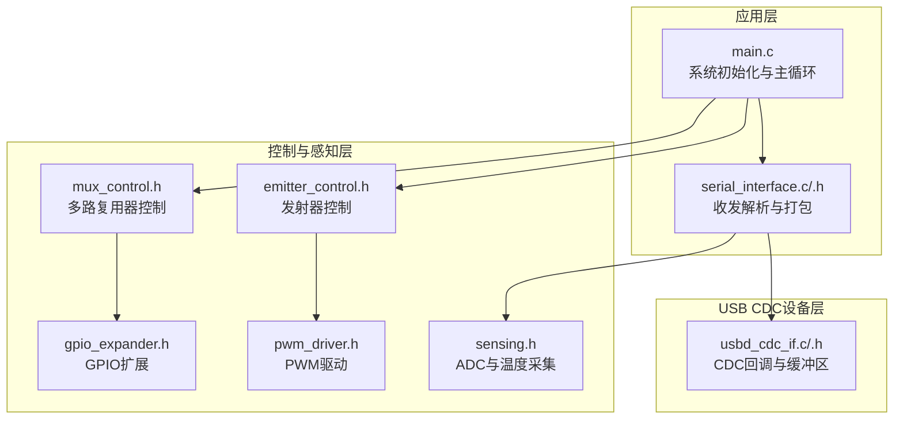
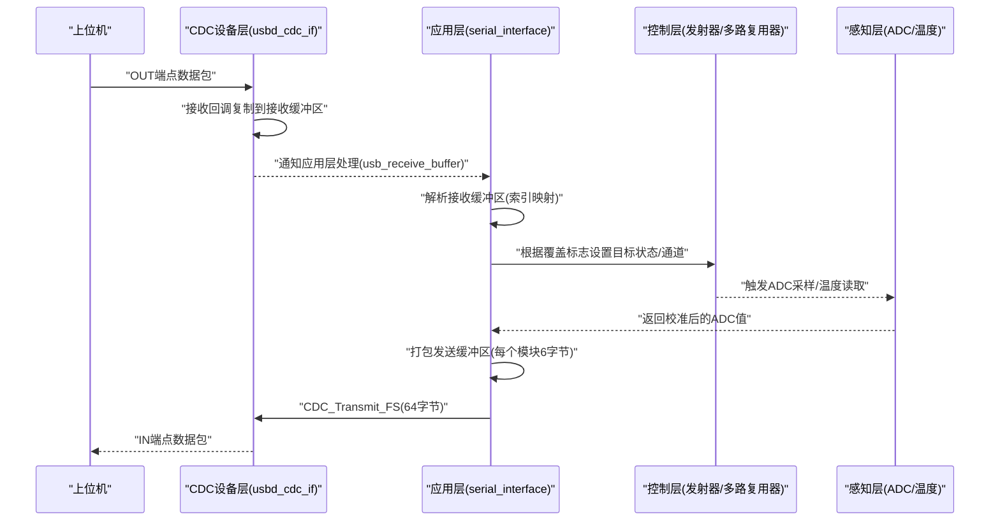
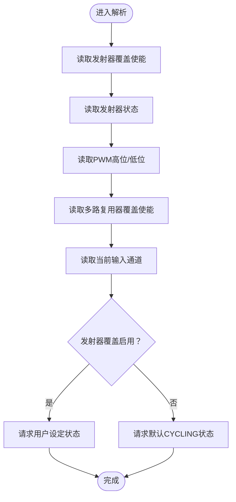
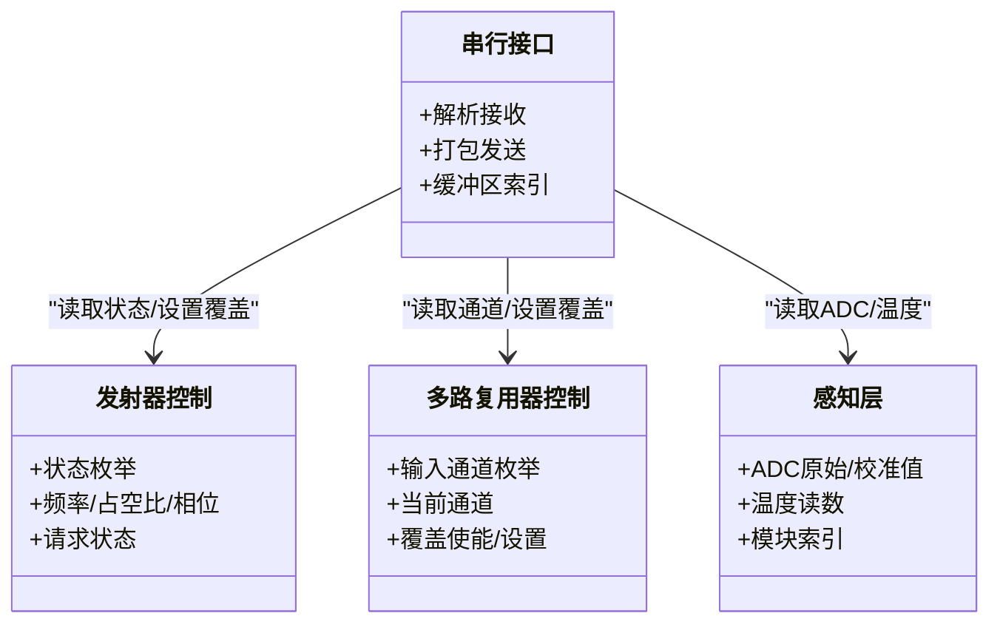
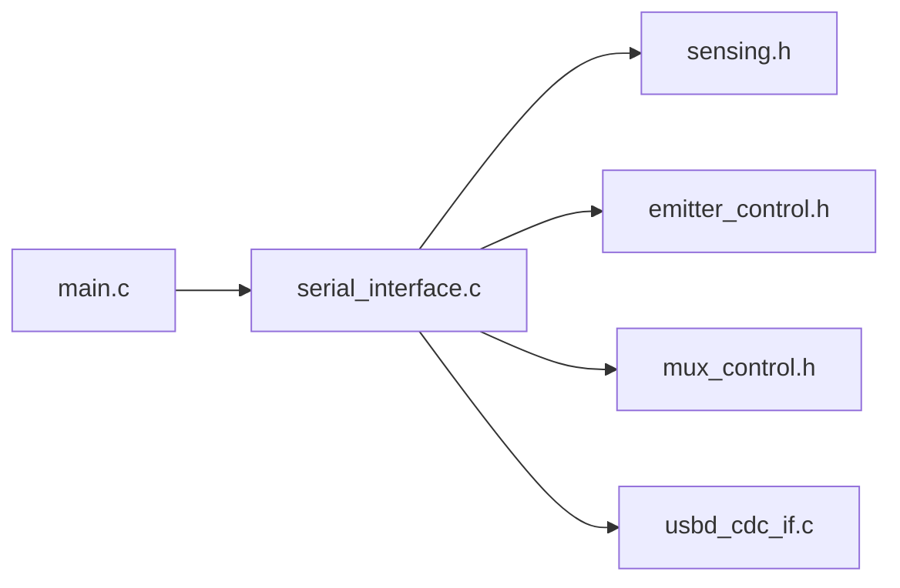

# USB CDC串行通信协议

<cite>
**本文引用的文件**
- [serial_interface.h](file://firmware/STM32/fNIRS/Core/Inc/serial_interface.h)
- [serial_interface.c](file://firmware/STM32/fNIRS/Core/Src/serial_interface.c)
- [usbd_cdc_if.c](file://firmware/STM32/fNIRS/USB_DEVICE/App/usbd_cdc_if.c)
- [usbd_cdc_if.h](file://firmware/STM32/fNIRS/USB_DEVICE/App/usbd_cdc_if.h)
- [main.c](file://firmware/STM32/fNIRS/Core/Src/main.c)
- [emitter_control.h](file://firmware/STM32/fNIRS/Core/Inc/emitter_control.h)
- [mux_control.h](file://firmware/STM32/fNIRS/Core/Inc/mux_control.h)
- [sensing.h](file://firmware/STM32/fNIRS/Core/Inc/sensing.h)
- [pwm_driver.h](file://firmware/STM32/fNIRS/Core/Inc/pwm_driver.h)
- [gpio_expander.h](file://firmware/STM32/fNIRS/Core/Inc/gpio_expander.h)
</cite>

## 目录
1. [简介](#简介)
2. [项目结构](#项目结构)
3. [核心组件](#核心组件)
4. [架构总览](#架构总览)
5. [详细组件分析](#详细组件分析)
6. [依赖关系分析](#依赖关系分析)
7. [性能考量](#性能考量)
8. [故障排查指南](#故障排查指南)
9. [结论](#结论)
10. [附录：协议规范与示例路径](#附录协议规范与示例路径)

## 简介
本文件面向STM32微控制器与上位机之间的USB CDC串行通信实现，聚焦于数据帧格式、缓冲区管理、传输机制以及收发协议细节。文档从代码层面梳理了接收端解析流程（发射器控制指令、多路复用器控制指令、用户覆盖控制）与发送端数据包格式（传感器模块标识、ADC数值编码、发射器状态位），并给出可直接定位到源码的示例路径，便于开发者快速定位实现与调试。

## 项目结构
围绕USB CDC通信的关键文件组织如下：
- 接口层：serial_interface.h/.c 提供USB收发数据的解析与打包接口
- 设备层：usbd_cdc_if.c/.h 提供CDC设备回调、收发缓冲区与传输封装
- 应用入口：main.c 初始化外设与控制循环，协调各子系统
- 控制与感知：emitter_control.h、mux_control.h、sensing.h、pwm_driver.h、gpio_expander.h 定义控制与感知数据结构与接口

图表来源
- [main.c:132-178](file://firmware/STM32/fNIRS/Core/Src/main.c#L132-L178)
- [serial_interface.c:20-81](file://firmware/STM32/fNIRS/Core/Src/serial_interface.c#L20-L81)
- [usbd_cdc_if.c:138-297](file://firmware/STM32/fNIRS/USB_DEVICE/App/usbd_cdc_if.c#L138-L297)
- [emitter_control.h:13-38](file://firmware/STM32/fNIRS/Core/Inc/emitter_control.h#L13-L38)
- [mux_control.h:21-40](file://firmware/STM32/fNIRS/Core/Inc/mux_control.h#L21-L40)
- [sensing.h:46-61](file://firmware/STM32/fNIRS/Core/Inc/sensing.h#L46-L61)
- [pwm_driver.h:35-62](file://firmware/STM32/fNIRS/Core/Inc/pwm_driver.h#L35-L62)
- [gpio_expander.h:26-35](file://firmware/STM32/fNIRS/Core/Inc/gpio_expander.h#L26-L35)

章节来源
- [main.c:132-178](file://firmware/STM32/fNIRS/Core/Src/main.c#L132-L178)
- [usbd_cdc_if.c:88-98](file://firmware/STM32/fNIRS/USB_DEVICE/App/usbd_cdc_if.c#L88-L98)
- [usbd_cdc_if.h:50-52](file://firmware/STM32/fNIRS/USB_DEVICE/App/usbd_cdc_if.h#L50-L52)

## 核心组件
- 串行接口解析与打包
  - 接收解析：将USB接收缓冲区按索引映射到发射器控制与多路复用器控制变量
  - 发送打包：按传感器模块拼装64字节数据包，包含通道ADC高/低字节与发射器状态位
- CDC设备层
  - 提供接收回调，复制数据至全局接收缓冲区
  - 提供发送函数，检查发送状态避免冲突
- 控制与感知
  - 发射器控制：状态机与PWM参数更新
  - 多路复用器：输入通道选择与序列器
  - 感知：ADC原始值、校准值与温度读数

章节来源
- [serial_interface.h:12-51](file://firmware/STM32/fNIRS/Core/Inc/serial_interface.h#L12-L51)
- [serial_interface.c:20-81](file://firmware/STM32/fNIRS/Core/Src/serial_interface.c#L20-L81)
- [usbd_cdc_if.c:261-297](file://firmware/STM32/fNIRS/USB_DEVICE/App/usbd_cdc_if.c#L261-L297)
- [emitter_control.h:13-38](file://firmware/STM32/fNIRS/Core/Inc/emitter_control.h#L13-L38)
- [mux_control.h:21-40](file://firmware/STM32/fNIRS/Core/Inc/mux_control.h#L21-L40)
- [sensing.h:46-61](file://firmware/STM32/fNIRS/Core/Inc/sensing.h#L46-L61)

## 架构总览
下图展示了从USB CDC接收、解析、到控制执行与数据采集、再到打包发送的完整链路。

图表来源
- [usbd_cdc_if.c:261-272](file://firmware/STM32/fNIRS/USB_DEVICE/App/usbd_cdc_if.c#L261-L272)
- [main.c:154-174](file://firmware/STM32/fNIRS/Core/Src/main.c#L154-L174)
- [serial_interface.c:20-81](file://firmware/STM32/fNIRS/Core/Src/serial_interface.c#L20-L81)

## 详细组件分析

### 接收解析流程（发射器控制、多路复用器控制、用户覆盖控制）
- 接收缓冲区索引定义
  - 发射器控制覆盖使能、状态、PWM控制高位/低位
  - 多路复用器控制覆盖使能、当前输入通道
- 解析逻辑
  - 将接收缓冲区对应字节映射到内部变量
  - 根据覆盖使能标志决定是否采用用户设定的状态或回到默认模式
- 关键实现路径
  - 接收解析函数与索引定义：[serial_interface.c:20-32](file://firmware/STM32/fNIRS/Core/Src/serial_interface.c#L20-L32)，[serial_interface.h:12-24](file://firmware/STM32/fNIRS/Core/Inc/serial_interface.h#L12-L24)
  - 主循环中调用解析与控制切换：[main.c:154-174](file://firmware/STM32/fNIRS/Core/Src/main.c#L154-L174)

图表来源
- [serial_interface.c:20-32](file://firmware/STM32/fNIRS/Core/Src/serial_interface.c#L20-L32)
- [main.c:156-164](file://firmware/STM32/fNIRS/Core/Src/main.c#L156-L164)

章节来源
- [serial_interface.c:20-32](file://firmware/STM32/fNIRS/Core/Src/serial_interface.c#L20-L32)
- [serial_interface.h:12-24](file://firmware/STM32/fNIRS/Core/Inc/serial_interface.h#L12-L24)
- [main.c:154-174](file://firmware/STM32/fNIRS/Core/Src/main.c#L154-L174)

### 发送数据包格式（每个传感器模块6字节，共8个模块，总计64字节）
- 包结构定义
  - 包标识符（模块号编码）
  - 通道1高/低字节
  - 通道2高/低字节
  - 通道3高/低字节
  - 发射器状态位（940nm/660nm）
- 打包逻辑
  - 遍历每个传感器模块，读取三个通道的校准ADC值
  - 查询对应PWM通道的发射器状态
  - 使用宏计算缓冲区索引，写入各字段
  - 调用CDC发送函数一次性发送64字节
- 关键实现路径
  - 发送打包与CDC发送：[serial_interface.c:59-81](file://firmware/STM32/fNIRS/Core/Src/serial_interface.c#L59-L81)
  - 字段索引定义：[serial_interface.h:26-38](file://firmware/STM32/fNIRS/Core/Inc/serial_interface.h#L26-L38)
  - 模块枚举与ADC缓冲区结构：[sensing.h:22-61](file://firmware/STM32/fNIRS/Core/Inc/sensing.h#L22-L61)

图表来源
- [serial_interface.h:26-38](file://firmware/STM32/fNIRS/Core/Inc/serial_interface.h#L26-L38)
- [emitter_control.h:13-38](file://firmware/STM32/fNIRS/Core/Inc/emitter_control.h#L13-L38)
- [mux_control.h:21-40](file://firmware/STM32/fNIRS/Core/Inc/mux_control.h#L21-L40)
- [sensing.h:22-61](file://firmware/STM32/fNIRS/Core/Inc/sensing.h#L22-L61)

章节来源
- [serial_interface.c:59-81](file://firmware/STM32/fNIRS/Core/Src/serial_interface.c#L59-L81)
- [serial_interface.h:26-38](file://firmware/STM32/fNIRS/Core/Inc/serial_interface.h#L26-L38)
- [sensing.h:22-61](file://firmware/STM32/fNIRS/Core/Inc/sensing.h#L22-L61)

### CDC缓冲区管理与传输机制
- 缓冲区
  - 接收缓冲区：CDC接收回调将数据复制到全局数组
  - 发送缓冲区：应用层构造后通过CDC发送
- 传输状态
  - 发送前检查CDC Tx状态，避免USBD_BUSY
- 关键实现路径
  - 接收回调与复制：[usbd_cdc_if.c:261-272](file://firmware/STM32/fNIRS/USB_DEVICE/App/usbd_cdc_if.c#L261-L272)
  - 发送函数与状态检查：[usbd_cdc_if.c:285-297](file://firmware/STM32/fNIRS/USB_DEVICE/App/usbd_cdc_if.c#L285-L297)
  - 缓冲区大小定义：[usbd_cdc_if.h:50-52](file://firmware/STM32/fNIRS/USB_DEVICE/App/usbd_cdc_if.h#L50-L52)

章节来源
- [usbd_cdc_if.c:261-272](file://firmware/STM32/fNIRS/USB_DEVICE/App/usbd_cdc_if.c#L261-L272)
- [usbd_cdc_if.c:285-297](file://firmware/STM32/fNIRS/USB_DEVICE/App/usbd_cdc_if.c#L285-L297)
- [usbd_cdc_if.h:50-52](file://firmware/STM32/fNIRS/USB_DEVICE/App/usbd_cdc_if.h#L50-L52)

### 数据类型与字节索引定义
- 接收缓冲区索引（用于上位机发送控制命令）
  - 发射器控制覆盖使能、状态、PWM高位/低位
  - 多路复用器控制覆盖使能、当前输入通道
- 发送缓冲区索引（每个传感器模块6字节）
  - 包标识符、通道1高/低、通道2高/低、通道3高/低、发射器状态位
- 关键实现路径
  - 接收索引枚举：[serial_interface.h:12-24](file://firmware/STM32/fNIRS/Core/Inc/serial_interface.h#L12-L24)
  - 发送索引枚举与宏：[serial_interface.h:26-38](file://firmware/STM32/fNIRS/Core/Inc/serial_interface.h#L26-L38)，[serial_interface.c:9-12](file://firmware/STM32/fNIRS/Core/Src/serial_interface.c#L9-L12)

章节来源
- [serial_interface.h:12-38](file://firmware/STM32/fNIRS/Core/Inc/serial_interface.h#L12-L38)
- [serial_interface.c:9-12](file://firmware/STM32/fNIRS/Core/Src/serial_interface.c#L9-L12)

## 依赖关系分析
- 组件耦合
  - serial_interface.c 依赖 sensing.h 获取ADC值，依赖 emitter_control.h 与 mux_control.h 进行状态查询
  - main.c 协调初始化与主循环，调用 serial_interface_rx_parse_data 与 serial_interface_tx_send_sensor_data
  - usbd_cdc_if.c 作为USB CDC回调实现，向上层提供数据收发接口
- 外部依赖
  - HAL库与USB设备库（由CubeMX生成的中间件）
  - I2C设备（PWM驱动与GPIO扩展）

图表来源
- [main.c:132-178](file://firmware/STM32/fNIRS/Core/Src/main.c#L132-L178)
- [serial_interface.c:20-81](file://firmware/STM32/fNIRS/Core/Src/serial_interface.c#L20-L81)
- [usbd_cdc_if.c:138-145](file://firmware/STM32/fNIRS/USB_DEVICE/App/usbd_cdc_if.c#L138-L145)

章节来源
- [main.c:132-178](file://firmware/STM32/fNIRS/Core/Src/main.c#L132-L178)
- [serial_interface.c:20-81](file://firmware/STM32/fNIRS/Core/Src/serial_interface.c#L20-L81)
- [usbd_cdc_if.c:138-145](file://firmware/STM32/fNIRS/USB_DEVICE/App/usbd_cdc_if.c#L138-L145)

## 性能考量
- ADC采样与DMA
  - ADC配置为独立模式，8个通道扫描，使用DMA连续请求，减少CPU占用
- PWM与定时器
  - 通过定时器触发ADC转换，配合PWM驱动实现同步采样与控制
- CDC传输
  - 发送前检查Tx状态，避免阻塞；建议上位机以合适速率轮询，避免缓冲区积压

章节来源
- [main.c:274-386](file://firmware/STM32/fNIRS/Core/Src/main.c#L274-L386)
- [usbd_cdc_if.c:285-297](file://firmware/STM32/fNIRS/USB_DEVICE/App/usbd_cdc_if.c#L285-L297)

## 故障排查指南
- CDC发送失败（USBD_BUSY）
  - 现象：CDC_Transmit_FS返回忙状态
  - 原因：上次传输未完成
  - 处理：在应用层增加重试或降低发送频率
  - 参考实现路径：[usbd_cdc_if.c:285-297](file://firmware/STM32/fNIRS/USB_DEVICE/App/usbd_cdc_if.c#L285-L297)
- 接收数据不完整
  - 现象：解析字段异常
  - 原因：上位机发送长度不足或未按索引顺序填充
  - 处理：确保发送长度为接收索引定义的范围，字段顺序与类型正确
  - 参考实现路径：[serial_interface.c:20-32](file://firmware/STM32/fNIRS/Core/Src/serial_interface.c#L20-L32)
- 发射器/多路复用器状态不符预期
  - 现象：覆盖使能无效或默认模式未生效
  - 原因：覆盖使能标志未正确设置或解析错误
  - 处理：检查上位机发送的覆盖使能位与状态字节，确认主循环中的覆盖判断逻辑
  - 参考实现路径：[main.c:156-174](file://firmware/STM32/fNIRS/Core/Src/main.c#L156-L174)
- ADC值异常
  - 现象：通道值为0或跳变剧烈
  - 原因：ADC未正确触发或DMA配置不当
  - 处理：检查定时器触发配置与DMA中断优先级
  - 参考实现路径：[main.c:50-61](file://firmware/STM32/fNIRS/Core/Src/main.c#L50-L61)

章节来源
- [usbd_cdc_if.c:285-297](file://firmware/STM32/fNIRS/USB_DEVICE/App/usbd_cdc_if.c#L285-L297)
- [serial_interface.c:20-32](file://firmware/STM32/fNIRS/Core/Src/serial_interface.c#L20-L32)
- [main.c:156-174](file://firmware/STM32/fNIRS/Core/Src/main.c#L156-L174)
- [main.c:50-61](file://firmware/STM32/fNIRS/Core/Src/main.c#L50-L61)

## 结论
该USB CDC实现以serial_interface为核心，结合sensing、emitter_control、mux_control等模块，形成“接收解析—控制执行—数据采集—打包发送”的闭环。接收端通过明确的字节索引解析上位机控制命令，发送端按模块化格式打包ADC与发射器状态，CDC层提供可靠的缓冲区与传输状态管理。开发者可依据本文提供的示例路径快速定位实现细节，进行调试与扩展。

## 附录：协议规范与示例路径
- 接收数据包（上位机→MCU，长度≥6字节）
  - 索引定义：[serial_interface.h:12-24](file://firmware/STM32/fNIRS/Core/Inc/serial_interface.h#L12-L24)
  - 解析实现：[serial_interface.c:20-32](file://firmware/STM32/fNIRS/Core/Src/serial_interface.c#L20-L32)
  - 主循环应用：[main.c:154-174](file://firmware/STM32/fNIRS/Core/Src/main.c#L154-L174)
- 发送数据包（MCU→上位机，固定64字节）
  - 字段定义与宏：[serial_interface.h:26-38](file://firmware/STM32/fNIRS/Core/Inc/serial_interface.h#L26-L38)，[serial_interface.c:9-12](file://firmware/STM32/fNIRS/Core/Src/serial_interface.c#L9-L12)
  - 打包与发送：[serial_interface.c:59-81](file://firmware/STM32/fNIRS/Core/Src/serial_interface.c#L59-L81)
- CDC缓冲区与传输
  - 接收回调与复制：[usbd_cdc_if.c:261-272](file://firmware/STM32/fNIRS/USB_DEVICE/App/usbd_cdc_if.c#L261-L272)
  - 发送函数与状态检查：[usbd_cdc_if.c:285-297](file://firmware/STM32/fNIRS/USB_DEVICE/App/usbd_cdc_if.c#L285-L297)
  - 缓冲区大小定义：[usbd_cdc_if.h:50-52](file://firmware/STM32/fNIRS/USB_DEVICE/App/usbd_cdc_if.h#L50-L52)
- 控制与感知接口
  - 发射器控制：[emitter_control.h:13-38](file://firmware/STM32/fNIRS/Core/Inc/emitter_control.h#L13-L38)
  - 多路复用器控制：[mux_control.h:21-40](file://firmware/STM32/fNIRS/Core/Inc/mux_control.h#L21-L40)
  - 感知层数据结构：[sensing.h:46-61](file://firmware/STM32/fNIRS/Core/Inc/sensing.h#L46-L61)
  - PWM驱动与GPIO扩展：[pwm_driver.h:35-62](file://firmware/STM32/fNIRS/Core/Inc/pwm_driver.h#L35-L62)，[gpio_expander.h:26-35](file://firmware/STM32/fNIRS/Core/Inc/gpio_expander.h#L26-L35)