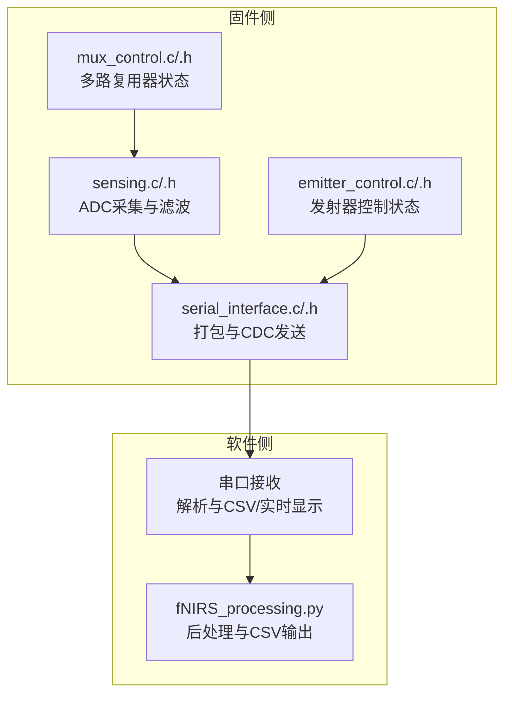
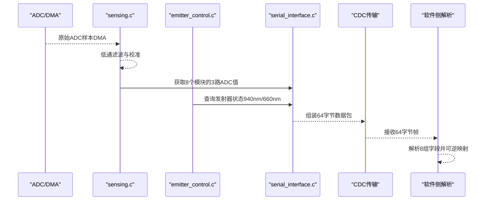
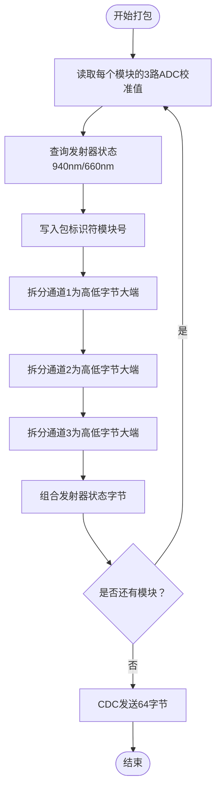
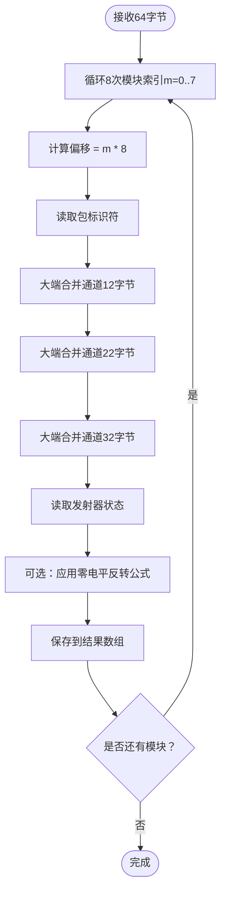
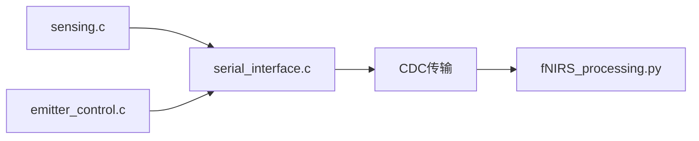

# 数据包格式规范

<cite>
**本文引用的文件**
- [serial_interface.h](file://firmware/STM32/fNIRS/Core/Inc/serial_interface.h)
- [serial_interface.c](file://firmware/STM32/fNIRS/Core/Src/serial_interface.c)
- [sensing.h](file://firmware/STM32/fNIRS/Core/Inc/sensing.h)
- [sensing.c](file://firmware/STM32/fNIRS/Core/Src/sensing.c)
- [fNIRS_processing.py](file://software/fNIRS_processing.py)
- [fNIRS_processing_csv.py](file://software/testing-scripts/fNIRS_processing_csv.py)
- [adc_live.py](file://software/adc_live.py)
- [adc_to_csv.py](file://software/testing-scripts/adc_to_csv.py)
</cite>

## 目录
1. [引言](#引言)
2. [项目结构](#项目结构)
3. [核心组件](#核心组件)
4. [架构总览](#架构总览)
5. [详细组件分析](#详细组件分析)
6. [依赖关系分析](#依赖关系分析)
7. [性能考量](#性能考量)
8. [故障排查指南](#故障排查指南)
9. [结论](#结论)
10. [附录](#附录)

## 引言
本规范面向fNIRS系统的64字节ADC数据包，给出完整、可执行的格式定义与解析流程。数据包承载来自8个传感器模块（共24路探测器）的ADC读数以及发射器状态，采用大端序编码，每模块8字节，整体按模块顺序拼接为64字节帧。本文同时覆盖打包与解包过程、字段定义、数值范围、类型转换、反向映射公式、以及数据完整性与错误检测建议。

## 项目结构
- 固件侧负责采集ADC、更新传感器校准值、生成并发送64字节数据包。
- 软件侧负责接收、解析、可视化与后处理（含OD转换、滤波、MBLL等）。

图表来源
- [serial_interface.c:59-81](file://firmware/STM32/fNIRS/Core/Src/serial_interface.c#L59-L81)
- [sensing.c:50-84](file://firmware/STM32/fNIRS/Core/Src/sensing.c#L50-L84)
- [fNIRS_processing.py:160-185](file://software/fNIRS_processing.py#L160-L185)

章节来源
- [serial_interface.h:26-38](file://firmware/STM32/fNIRS/Core/Inc/serial_interface.h#L26-L38)
- [serial_interface.c:59-81](file://firmware/STM32/fNIRS/Core/Src/serial_interface.c#L59-L81)
- [sensing.h:22-34](file://firmware/STM32/fNIRS/Core/Inc/sensing.h#L22-L34)
- [sensing.c:50-84](file://firmware/STM32/fNIRS/Core/Src/sensing.c#L50-L84)

## 核心组件
- 数据包尺寸：64字节
- 模块数量：8个传感器模块
- 每模块字节数：8字节
- 字段布局：每个模块包含1字节包标识符 + 3个通道各2字节ADC值 + 1字节发射器状态
- 大端序：通道ADC值使用网络字节序（大端）
- 反向映射：软件侧提供零电平反转公式，用于从处理后的强度值还原原始ADC计数

章节来源
- [serial_interface.h:26-38](file://firmware/STM32/fNIRS/Core/Inc/serial_interface.h#L26-L38)
- [serial_interface.c:59-81](file://firmware/STM32/fNIRS/Core/Src/serial_interface.c#L59-L81)
- [fNIRS_processing.py:160-185](file://software/fNIRS_processing.py#L160-L185)

## 架构总览
下图展示从ADC采集到数据包发送、再到软件侧解析与处理的关键路径。

图表来源
- [sensing.c:50-84](file://firmware/STM32/fNIRS/Core/Src/sensing.c#L50-L84)
- [serial_interface.c:59-81](file://firmware/STM32/fNIRS/Core/Src/serial_interface.c#L59-L81)
- [fNIRS_processing.py:160-185](file://software/fNIRS_processing.py#L160-L185)

## 详细组件分析

### 数据包字段定义与字节布局
- 总长度：64字节
- 每模块8字节，共8模块
- 每模块字段：
  - 包标识符（1字节）
  - 通道1高字节（1字节）、通道1低字节（1字节）
  - 通道2高字节（1字节）、通道2低字节（1字节）
  - 通道3高字节（1字节）、通道3低字节（1字节）
  - 发射器状态（1字节）

- 字节偏移（每模块内，以模块索引m为单位）：
  - 包标识符：m×8 + 0
  - 通道1：m×8 + 1 ~ m×8 + 2
  - 通道2：m×8 + 3 ~ m×8 + 4
  - 通道3：m×8 + 5 ~ m×8 + 6
  - 发射器状态：m×8 + 7

- 字段类型与取值范围：
  - 包标识符：8位无符号整型（0~255），固件侧采用高位掩码组合模块号
  - 通道ADC：16位无符号整型（0~65535），由两个8位字节组成
  - 发射器状态：8位无符号整型（0~255），其中最低两位表示660nm与940nm状态

章节来源
- [serial_interface.h:26-38](file://firmware/STM32/fNIRS/Core/Inc/serial_interface.h#L26-L38)
- [serial_interface.c:70-77](file://firmware/STM32/fNIRS/Core/Src/serial_interface.c#L70-L77)

### 打包流程（固件侧）
- 步骤概要：
  1) 读取每个模块的3路已校准ADC值
  2) 查询对应PWM通道的发射器状态
  3) 将16位ADC值拆分为高低字节（大端序）
  4) 组装每个模块的8字节字段
  5) 通过CDC发送64字节缓冲区

- 关键实现要点：
  - 使用宏计算模块内字节索引，保证连续性
  - 通道值高位在前，低位在后
  - 发射器状态位组合：bit1为940nm，bit0为660nm

图表来源
- [serial_interface.c:59-81](file://firmware/STM32/fNIRS/Core/Src/serial_interface.c#L59-L81)

章节来源
- [serial_interface.c:59-81](file://firmware/STM32/fNIRS/Core/Src/serial_interface.c#L59-L81)

### 解包流程（软件侧）
- 步骤概要：
  1) 从串口读取64字节
  2) 对每个模块（8字节）进行解析
  3) 使用大端序合并通道ADC值
  4) 可选：应用零电平反转公式将强度值还原为原始ADC计数

- 反向映射（软件侧提供）：
  - 公式：原始ADC计数 ≈ 2 × 零电平 − 处理后强度
  - 零电平默认值：2050（软件侧常量）

图表来源
- [fNIRS_processing.py:160-185](file://software/fNIRS_processing.py#L160-L185)
- [fNIRS_processing_csv.py:161-186](file://software/testing-scripts/fNIRS_processing_csv.py#L161-L186)

章节来源
- [fNIRS_processing.py:160-185](file://software/fNIRS_processing.py#L160-L185)
- [fNIRS_processing_csv.py:161-186](file://software/testing-scripts/fNIRS_processing_csv.py#L161-L186)
- [adc_live.py:24-46](file://software/adc_live.py#L24-L46)
- [adc_to_csv.py:16-37](file://software/testing-scripts/adc_to_csv.py#L16-L37)

### 数值范围与类型转换
- 包标识符：8位无符号整型（0~255），固件侧采用高位掩码组合模块号
- 通道ADC：16位无符号整型（0~65535），大端序合并
- 发射器状态：8位无符号整型（0~255），bit0/1分别表示660nm与940nm是否开启
- 反向映射：软件侧提供零电平反转公式，便于从处理后的强度值还原原始ADC计数

章节来源
- [serial_interface.c:70-77](file://firmware/STM32/fNIRS/Core/Src/serial_interface.c#L70-L77)
- [fNIRS_processing.py:39-49](file://software/fNIRS_processing.py#L39-L49)

### 数据完整性与错误检测
- 帧边界：每次读取固定64字节；若不足则丢弃或重试
- 字段一致性：解析时按模块顺序读取，确保通道值与状态一一对应
- 建议的完整性检查：
  - 校验包标识符是否符合模块号范围
  - 校验通道值是否落在合理范围内（如ADC满量程）
  - 校验发射器状态位组合是否合法
  - 若需要更强健壮性，可在帧头/尾添加校验和或CRC字段（当前未实现）

章节来源
- [fNIRS_processing.py:187-234](file://software/fNIRS_processing.py#L187-L234)
- [adc_to_csv.py:52-67](file://software/testing-scripts/adc_to_csv.py#L52-L67)

### 数据处理算法与转换公式
- 反向映射（强度→ADC计数）：
  - 公式：原始ADC ≈ 2 × 零电平 − 处理后强度
  - 零电平默认值：2050
- 通道值合并（大端序）：
  - 合并公式：通道值 = 高字节 × 256 + 低字节
- 发射器状态：
  - bit1 表示940nm是否开启
  - bit0 表示660nm是否开启

章节来源
- [fNIRS_processing.py:39-49](file://software/fNIRS_processing.py#L39-L49)
- [fNIRS_processing.py:160-185](file://software/fNIRS_processing.py#L160-L185)

## 依赖关系分析
- 固件侧：
  - serial_interface.c 依赖 sensing.c 提供ADC校准值
  - serial_interface.c 依赖 emitter_control.c 查询发射器状态
- 软件侧：
  - fNIRS_processing.py 依赖 struct.unpack 进行大端序解析
  - 提供零电平反转函数，便于还原原始ADC计数

图表来源
- [serial_interface.c:59-81](file://firmware/STM32/fNIRS/Core/Src/serial_interface.c#L59-L81)
- [sensing.c:50-84](file://firmware/STM32/fNIRS/Core/Src/sensing.c#L50-L84)
- [fNIRS_processing.py:160-185](file://software/fNIRS_processing.py#L160-L185)

章节来源
- [serial_interface.c:59-81](file://firmware/STM32/fNIRS/Core/Src/serial_interface.c#L59-L81)
- [sensing.c:50-84](file://firmware/STM32/fNIRS/Core/Src/sensing.c#L50-L84)
- [fNIRS_processing.py:160-185](file://software/fNIRS_processing.py#L160-L185)

## 性能考量
- ADC采样与滤波：固件侧对原始ADC值进行低通滤波，降低噪声影响
- DMA搬运：通过DMA将多个通道的ADC值批量搬运至内存，减少CPU开销
- 打包效率：单次循环内完成所有模块的打包与CDC发送，避免重复遍历
- 软件侧解析：使用NumPy向量化操作，提升大批量数据处理速度

章节来源
- [sensing.c:10-10](file://firmware/STM32/fNIRS/Core/Src/sensing.c#L10-L10)
- [sensing.c:50-84](file://firmware/STM32/fNIRS/Core/Src/sensing.c#L50-L84)
- [fNIRS_processing.py:160-185](file://software/fNIRS_processing.py#L160-L185)

## 故障排查指南
- 串口无数据或数据不完整：
  - 确认串口波特率与超时设置正确
  - 检查是否每次读取64字节，不足则丢弃
- 字段值异常：
  - 检查通道值合并是否使用大端序
  - 校验包标识符是否在模块号范围内
- 强度值与预期不符：
  - 确认零电平参数是否一致（默认2050）
  - 检查是否正确应用了反向映射公式

章节来源
- [fNIRS_processing.py:187-234](file://software/fNIRS_processing.py#L187-L234)
- [adc_to_csv.py:52-67](file://software/testing-scripts/adc_to_csv.py#L52-L67)
- [fNIRS_processing.py:39-49](file://software/fNIRS_processing.py#L39-L49)

## 结论
本规范明确了64字节ADC数据包的完整结构、打包与解包流程、字段定义与取值范围，并提供了从原始字节流到强度值的可逆映射方法。结合固件侧的ADC滤波与打包策略，以及软件侧的解析与后处理链路，可实现稳定、可重复的fNIRS数据采集与分析。

## 附录

### 字段定义表（每模块8字节）
- 字节偏移
  - 0：包标识符（8位）
  - 1~2：通道1（16位，大端）
  - 3~4：通道2（16位，大端）
  - 5~6：通道3（16位，大端）
  - 7：发射器状态（8位，bit1=940nm，bit0=660nm）

- 类型与范围
  - 包标识符：0~255（固件侧模块号掩码）
  - 通道ADC：0~65535
  - 发射器状态：0~255（bit1/0分别表示940nm/660nm）

- 转换公式
  - 通道值 = 高字节 × 256 + 低字节
  - 反向映射：原始ADC ≈ 2 × 零电平 − 处理后强度（零电平默认2050）

章节来源
- [serial_interface.h:26-38](file://firmware/STM32/fNIRS/Core/Inc/serial_interface.h#L26-L38)
- [serial_interface.c:70-77](file://firmware/STM32/fNIRS/Core/Src/serial_interface.c#L70-L77)
- [fNIRS_processing.py:160-185](file://software/fNIRS_processing.py#L160-L185)
- [fNIRS_processing.py:39-49](file://software/fNIRS_processing.py#L39-L49)