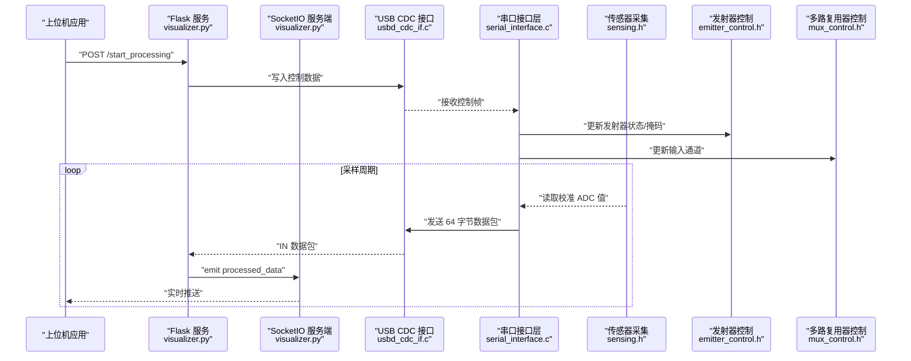
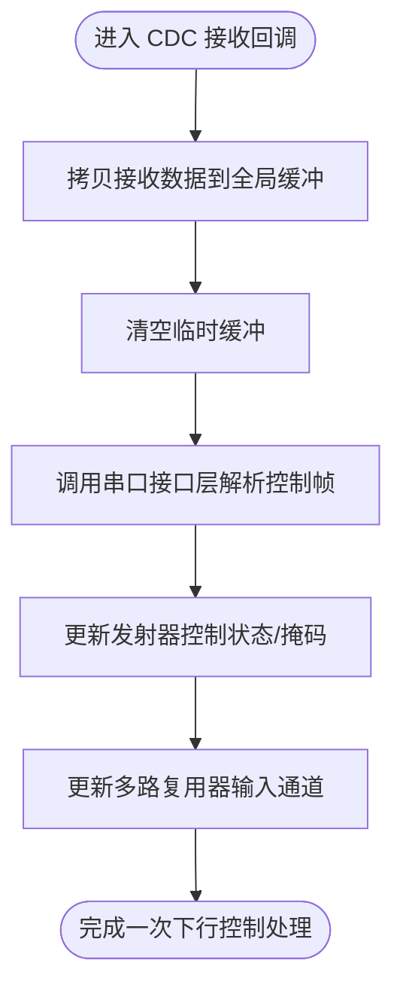
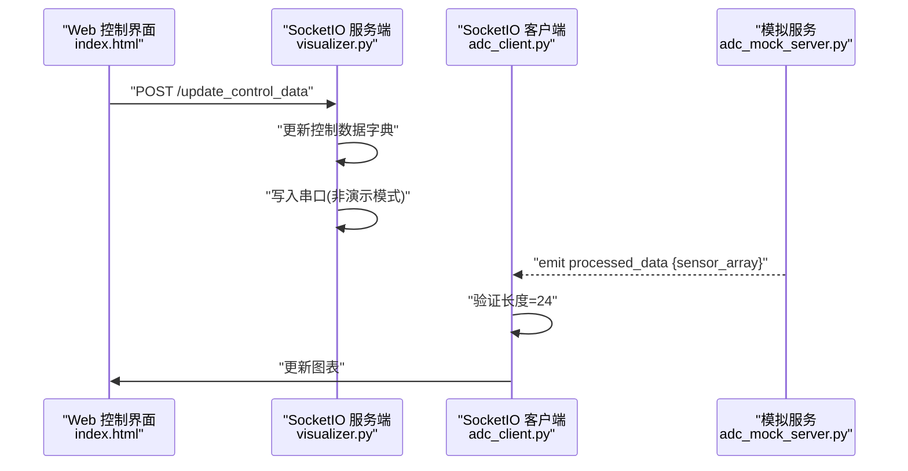
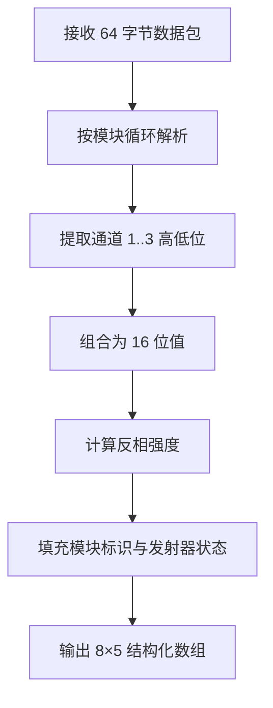
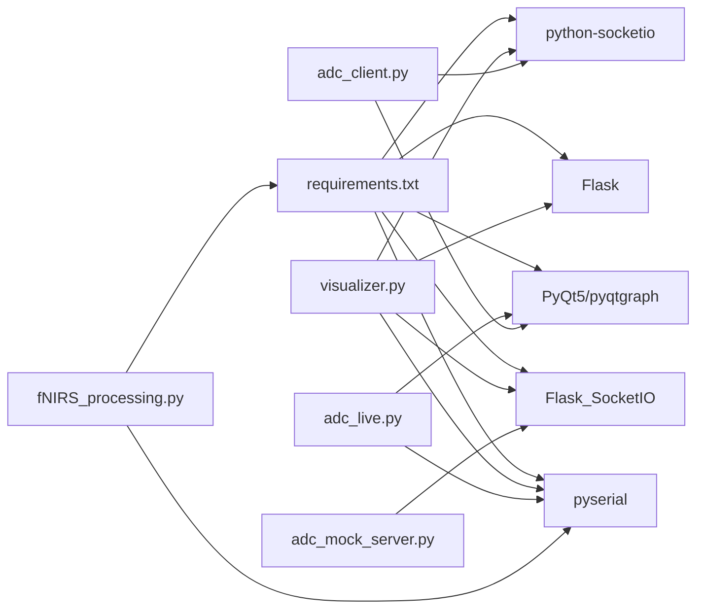

# 通信协议

<cite>
**本文引用的文件**
- [serial_interface.c](file://firmware/STM32/fNIRS/Core/Src/serial_interface.c)
- [serial_interface.h](file://firmware/STM32/fNIRS/Core/Inc/serial_interface.h)
- [usbd_cdc_if.c](file://firmware/STM32/fNIRS/USB_DEVICE/App/usbd_cdc_if.c)
- [usbd_cdc_if.h](file://firmware/STM32/fNIRS/USB_DEVICE/App/usbd_cdc_if.h)
- [emitter_control.h](file://firmware/STM32/fNIRS/Core/Inc/emitter_control.h)
- [mux_control.h](file://firmware/STM32/fNIRS/Core/Inc/mux_control.h)
- [sensing.h](file://firmware/STM32/fNIRS/Core/Inc/sensing.h)
- [adc_client.py](file://software/adc_client.py)
- [adc_mock_server.py](file://software/adc_mock_server.py)
- [index.html](file://software/index.html)
- [config.py](file://software/config.py)
- [fNIRS_processing.py](file://software/fNIRS_processing.py)
- [adc_live.py](file://software/adc_live.py)
- [visualizer.py](file://software/visualizer.py)
- [requirements.txt](file://software/requirements.txt)
</cite>

## 目录
1. [引言](#引言)
2. [项目结构](#项目结构)
3. [核心组件](#核心组件)
4. [架构总览](#架构总览)
5. [详细组件分析](#详细组件分析)
6. [依赖关系分析](#依赖关系分析)
7. [性能考虑](#性能考虑)
8. [故障排查指南](#故障排查指南)
9. [结论](#结论)
10. [附录](#附录)

## 引言
本文件系统性地记录并文档化 fNIRS 系统的通信协议与数据流，覆盖以下方面：
- USB CDC 串行通信协议：数据帧格式、波特率配置、缓冲区与传输状态、错误处理与超时策略
- SocketIO 实时通信协议：连接建立、事件类型、消息格式与状态管理
- HTTP REST API 设计：URL 模式、请求方法、参数规范与响应格式
- 数据包协议规范：64 字节 ADC 数据包格式、字段定义与解析方法
- 完整示例：客户端实现、服务器端处理与错误恢复策略
- 调试工具与性能优化建议

## 项目结构
该仓库包含固件（STM32）与软件（PC 端）两部分：
- 固件侧通过 USB CDC 提供虚拟串口，负责采集传感器数据并通过 CDC 发送；同时接收上位机下发的控制指令（发射器与多路复用器）
- 软件侧提供多种可视化与处理能力：实时 ADC 可视化、SocketIO 实时数据展示、基于 mBLL 的处理与导出、以及 Web 控制界面

```mermaid
graph TB
subgraph "固件(Firmware)"
CDC["USB CDC 接口<br/>usbd_cdc_if.c/.h"]
SI["串口接口层<br/>serial_interface.c/.h"]
SENS["传感器采集<br/>sensing.h"]
EM["发射器控制<br/>emitter_control.h"]
MUX["多路复用器控制<br/>mux_control.h"]
end
subgraph "软件(Software)"
WEB["Web 控制界面<br/>index.html"]
FLASK["Flask + SocketIO 服务<br/>visualizer.py"]
LIVE["实时 ADC 客户端<br/>adc_live.py"]
CLIENT["SocketIO 客户端<br/>adc_client.py"]
MOCK["模拟数据服务<br/>adc_mock_server.py"]
PROC["数据处理管线<br/>fNIRS_processing.py"]
CFG["串口配置<br/>config.py"]
end
WEB --> FLASK
FLASK <- --> CDC
SI --> CDC
SENS --> SI
EM --> SI
MUX --> SI
LIVE --> CFG
CLIENT --> FLASK
MOCK --> CLIENT
PROC --> CFG
```

图示来源
- [usbd_cdc_if.c:138-146](file://firmware/STM32/fNIRS/USB_DEVICE/App/usbd_cdc_if.c#L138-L146)
- [serial_interface.c:59-81](file://firmware/STM32/fNIRS/Core/Src/serial_interface.c#L59-L81)
- [sensing.h:22-34](file://firmware/STM32/fNIRS/Core/Inc/sensing.h#L22-L34)
- [emitter_control.h:13-24](file://firmware/STM32/fNIRS/Core/Inc/emitter_control.h#L13-L24)
- [mux_control.h:21-30](file://firmware/STM32/fNIRS/Core/Inc/mux_control.h#L21-L30)
- [index.html:305-306](file://software/index.html#L305-L306)
- [visualizer.py:54-56](file://software/visualizer.py#L54-L56)
- [adc_live.py:14-18](file://software/adc_live.py#L14-L18)
- [adc_client.py:74-78](file://software/adc_client.py#L74-L78)
- [adc_mock_server.py:62-64](file://software/adc_mock_server.py#L62-L64)
- [fNIRS_processing.py:20-23](file://software/fNIRS_processing.py#L20-L23)
- [config.py:8-12](file://software/config.py#L8-L12)

章节来源
- [usbd_cdc_if.c:138-146](file://firmware/STM32/fNIRS/USB_DEVICE/App/usbd_cdc_if.c#L138-L146)
- [serial_interface.c:59-81](file://firmware/STM32/fNIRS/Core/Src/serial_interface.c#L59-L81)
- [index.html:305-306](file://software/index.html#L305-L306)
- [visualizer.py:54-56](file://software/visualizer.py#L54-L56)

## 核心组件
- USB CDC 接口层：封装底层 CDC 传输、接收与状态检查，提供发送与回调函数
- 串口接口层：解析上位机下发的控制命令，组装传感器数据帧并通过 CDC 发送
- 传感器与控制模块：提供发射器状态、多路复用器通道选择与 ADC 值读取
- SocketIO 服务：提供实时数据推送、控制下发与 Web 界面交互
- HTTP API：提供模式切换、数据下载、静态图查看等 REST 接口
- 数据处理管线：从串口读取 64 字节数据包，解析、过滤、插值、mBLL 处理并输出 CSV

章节来源
- [usbd_cdc_if.c:285-297](file://firmware/STM32/fNIRS/USB_DEVICE/App/usbd_cdc_if.c#L285-L297)
- [serial_interface.c:20-81](file://firmware/STM32/fNIRS/Core/Src/serial_interface.c#L20-L81)
- [sensing.h:46-61](file://firmware/STM32/fNIRS/Core/Inc/sensing.h#L46-L61)
- [emitter_control.h:13-24](file://firmware/STM32/fNIRS/Core/Inc/emitter_control.h#L13-L24)
- [mux_control.h:21-30](file://firmware/STM32/fNIRS/Core/Inc/mux_control.h#L21-L30)
- [visualizer.py:648-713](file://software/visualizer.py#L648-L713)
- [fNIRS_processing.py:160-185](file://software/fNIRS_processing.py#L160-L185)

## 架构总览
下图展示了从固件到软件的数据通路与交互：



图示来源
- [visualizer.py:648-713](file://software/visualizer.py#L648-L713)
- [usbd_cdc_if.c:285-297](file://firmware/STM32/fNIRS/USB_DEVICE/App/usbd_cdc_if.c#L285-L297)
- [serial_interface.c:59-81](file://firmware/STM32/fNIRS/Core/Src/serial_interface.c#L59-L81)
- [sensing.h:64-68](file://firmware/STM32/fNIRS/Core/Inc/sensing.h#L64-L68)
- [emitter_control.h:40-48](file://firmware/STM32/fNIRS/Core/Inc/emitter_control.h#L40-L48)
- [mux_control.h:42-50](file://firmware/STM32/fNIRS/Core/Inc/mux_control.h#L42-L50)

## 详细组件分析

### USB CDC 串行通信协议
- 数据帧格式
  - 上行（设备→主机）：每个传感器模块占用 8 字节，共 8 模块，总计 64 字节
  - 字段定义（按模块索引 0..7）：
    - 字节 0：包标识符（高 4 位为 0xF，低 4 位为模块号）
    - 字节 1..2：通道 1 高低位（大端序）
    - 字节 3..4：通道 2 高低位（大端序）
    - 字节 5..6：通道 3 高低位（大端序）
    - 字节 7：发射器状态（bit1=940nm，bit0=660nm）
  - 下行（主机→设备）：控制帧长度为固定大小，字段包括：
    - 发射器控制覆盖使能、状态、PWM 控制高位/低位
    - 多路复用器控制覆盖使能、状态
- 波特率与超时
  - 串口配置使用 9600 波特率、0.01 秒超时
- 传输与状态
  - CDC 发送前检查 TxState，若忙则返回忙碌状态
  - 接收回调中将数据拷贝至全局接收缓冲区，并清空临时缓冲
- 错误处理
  - 发送返回 USBD_BUSY 表示传输未就绪
  - 接收回调中对缓冲进行清零与拷贝，避免脏数据
  - 上位机侧对不完整数据包进行丢弃或重试



图示来源
- [usbd_cdc_if.c:261-272](file://firmware/STM32/fNIRS/USB_DEVICE/App/usbd_cdc_if.c#L261-L272)
- [serial_interface.c:20-32](file://firmware/STM32/fNIRS/Core/Src/serial_interface.c#L20-L32)

章节来源
- [serial_interface.h:26-38](file://firmware/STM32/fNIRS/Core/Inc/serial_interface.h#L26-L38)
- [serial_interface.c:59-81](file://firmware/STM32/fNIRS/Core/Src/serial_interface.c#L59-L81)
- [usbd_cdc_if.h:50-52](file://firmware/STM32/fNIRS/USB_DEVICE/App/usbd_cdc_if.h#L50-L52)
- [usbd_cdc_if.c:285-297](file://firmware/STM32/fNIRS/USB_DEVICE/App/usbd_cdc_if.c#L285-L297)
- [config.py:11-12](file://software/config.py#L11-L12)

### SocketIO 实时通信协议
- 连接建立
  - 客户端通过 SocketIO 客户端库连接到本地 5000 端口
  - 服务端在 eventlet 模式下运行，支持异步事件
- 事件类型与消息格式
  - 服务端向客户端推送 processed_data 事件，消息体包含 sensor_array（24 元素数组）
  - 客户端收到后将其拆分为 8 组、每组 3 个通道，更新图表
- 状态管理
  - 服务端维护控制数据字典，接收前端表单提交后，转换为字节序列写入串口
  - 服务端通过队列缓存最近处理结果，保证实时更新



图示来源
- [index.html:501-509](file://software/index.html#L501-L509)
- [visualizer.py:630-646](file://software/visualizer.py#L630-L646)
- [adc_client.py:59-66](file://software/adc_client.py#L59-L66)
- [adc_mock_server.py:56-60](file://software/adc_mock_server.py#L56-L60)

章节来源
- [index.html:501-509](file://software/index.html#L501-L509)
- [visualizer.py:630-646](file://software/visualizer.py#L630-L646)
- [adc_client.py:59-66](file://software/adc_client.py#L59-L66)
- [adc_mock_server.py:56-60](file://software/adc_mock_server.py#L56-L60)

### HTTP REST API 设计
- URL 模式与请求方法
  - GET /：返回主页面（index.html）
  - GET /update_graphs：返回当前脑图 JSON
  - GET /select_group/{group_id}：高亮指定传感器组并返回更新后的脑图
  - POST /update_control_data：接收控制数据 JSON，写入串口并返回状态
  - POST /start_processing：启动处理流程（演示或真实采集）
  - POST /stop_processing：停止处理并重新初始化串口
  - GET /download/{source}：下载 CSV 文件（ADC 或 mBLL）
  - GET /view_static/{source}：生成静态图并返回 HTML
  - GET /view_animation/{source}：触发动画视图
- 参数规范与响应格式
  - 控制数据 JSON 包含发射器覆盖使能、状态、PWM 高低位、多路复用器覆盖使能、状态
  - 处理流程返回状态字符串，错误时返回 400/500 并包含错误信息
  - 下载接口支持自定义文件名查询参数

章节来源
- [visualizer.py:593-619](file://software/visualizer.py#L593-L619)
- [visualizer.py:648-713](file://software/visualizer.py#L648-L713)
- [visualizer.py:716-734](file://software/visualizer.py#L716-L734)
- [visualizer.py:737-745](file://software/visualizer.py#L737-L745)

### 数据包协议规范（64 字节 ADC 数据包）
- 帧结构
  - 总长：64 字节
  - 每个传感器模块 8 字节，共 8 模块
- 字段定义（模块 i）
  - 字节 0：包标识符（高 4 位 0xF，低 4 位模块号）
  - 字节 1..2：通道 1 高低位（大端序）
  - 字节 3..4：通道 2 高低位（大端序）
  - 字节 5..6：通道 3 高低位（大端序）
  - 字节 7：发射器状态（bit1=940nm，bit0=660nm）
- 解析方法
  - 逐模块提取字段，按大端序组合为 16 位值
  - 将通道值映射为“反相”强度（以零电平为中心），便于后续处理
- 上层处理
  - 软件侧将 24 通道（8 组×3 检测器）打包为 1D 数组，通过 SocketIO 推送
  - 批处理阶段可执行滤波、RMS、插值与 mBLL 计算



图示来源
- [serial_interface.h:26-38](file://firmware/STM32/fNIRS/Core/Inc/serial_interface.h#L26-L38)
- [serial_interface.c:59-81](file://firmware/STM32/fNIRS/Core/Src/serial_interface.c#L59-L81)
- [fNIRS_processing.py:160-185](file://software/fNIRS_processing.py#L160-L185)

章节来源
- [serial_interface.h:26-38](file://firmware/STM32/fNIRS/Core/Inc/serial_interface.h#L26-L38)
- [serial_interface.c:59-81](file://firmware/STM32/fNIRS/Core/Src/serial_interface.c#L59-L81)
- [fNIRS_processing.py:160-185](file://software/fNIRS_processing.py#L160-L185)

### 完整示例：客户端实现、服务器端处理与错误恢复
- 客户端实现
  - 实时可视化：adc_live.py 通过串口读取 64 字节包，解析为 8×5 矩阵并在 PyQt5 + pyqtgraph 中绘图
  - SocketIO 客户端：adc_client.py 连接本地 SocketIO 服务，监听 processed_data 事件并更新图表
  - 模拟服务：adc_mock_server.py 持续生成三角波数据并通过 SocketIO 推送
- 服务器端处理
  - visualizer.py 启动 Flask + SocketIO，提供 Web 控制界面与 HTTP API
  - 接收控制数据后写入串口；接收上游处理结果后通过 SocketIO 推送
  - start_processing/stop_processing 管理子进程生命周期与串口资源
- 错误恢复策略
  - 串口异常：提供重连与关闭逻辑，确保资源释放
  - 数据不完整：丢弃不足 64 字节的数据包，等待下一帧
  - 传输忙：CDC 发送返回忙碌时，上层重试或延时重发

章节来源
- [adc_live.py:24-78](file://software/adc_live.py#L24-L78)
- [adc_client.py:59-78](file://software/adc_client.py#L59-L78)
- [adc_mock_server.py:56-60](file://software/adc_mock_server.py#L56-L60)
- [visualizer.py:648-713](file://software/visualizer.py#L648-L713)

## 依赖关系分析



图示来源
- [requirements.txt:1-15](file://software/requirements.txt#L1-L15)
- [visualizer.py:22-34](file://software/visualizer.py#L22-L34)
- [adc_live.py:11-14](file://software/adc_live.py#L11-L14)
- [adc_client.py:13-15](file://software/adc_client.py#L13-L15)
- [adc_mock_server.py:10-13](file://software/adc_mock_server.py#L10-L13)
- [fNIRS_processing.py:18-21](file://software/fNIRS_processing.py#L18-L21)

章节来源
- [requirements.txt:1-15](file://software/requirements.txt#L1-L15)

## 性能考虑
- 串口吞吐
  - 9600 波特率下，理论带宽约 960 B/s，64 字节包约需 67 ms；若上位机以更高频率发送，建议降低发送频率或采用批量发送
- 缓冲与队列
  - 服务端使用有界队列缓存处理结果，满时丢弃最旧项，避免内存膨胀
- 异步模型
  - 使用 eventlet 异步模式提升并发；注意避免阻塞操作
- 图形渲染
  - PyQt5/PyQtGraph 在主线程中更新图表，建议使用定时器节流刷新频率

## 故障排查指南
- 无法连接串口
  - 检查设备路径与权限；确认波特率与超时设置一致
- 数据包解析失败
  - 确认接收缓冲长度为 64 字节且按模块顺序排列；检查大端序解析
- CDC 发送失败
  - 若返回忙碌，等待一段时间后重试；检查主机侧是否正确处理发送状态
- SocketIO 连接中断
  - 检查服务端日志与网络连通性；确认客户端版本与服务端兼容
- HTTP API 返回错误
  - 查看请求体格式与必填字段；关注 400/500 错误信息

章节来源
- [config.py:11-12](file://software/config.py#L11-L12)
- [usbd_cdc_if.c:285-297](file://firmware/STM32/fNIRS/USB_DEVICE/App/usbd_cdc_if.c#L285-L297)
- [visualizer.py:692-713](file://software/visualizer.py#L692-L713)

## 结论
本文件系统化梳理了 fNIRS 系统的通信协议与数据流，明确了 USB CDC 帧格式、SocketIO 事件与 HTTP API 的设计细节，并提供了完整的客户端/服务端示例与故障排查建议。遵循本文档可确保固件与上位机之间的稳定互操作与高效数据处理。

## 附录
- 关键常量与配置
  - 串口：波特率 9600，超时 0.01 秒
  - CDC 缓冲：接收/发送均为 2048 字节
  - 数据包：64 字节（8 模块×8 字节）
- 相关头文件与模块
  - 串口接口层：serial_interface.h/.c
  - USB CDC：usbd_cdc_if.h/.c
  - 控制模块：emitter_control.h、mux_control.h
  - 传感器：sensing.h