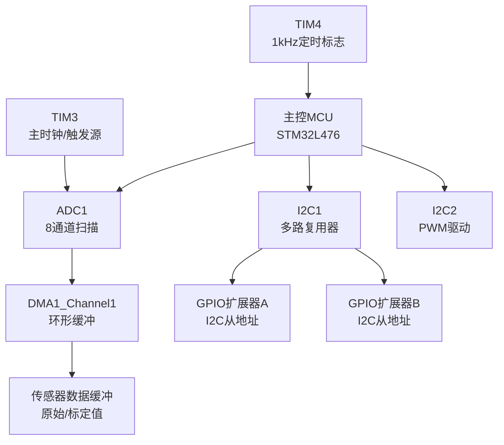
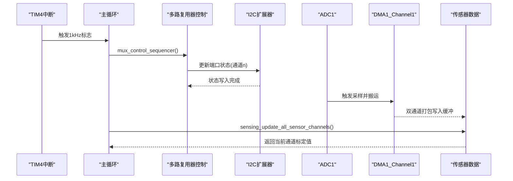
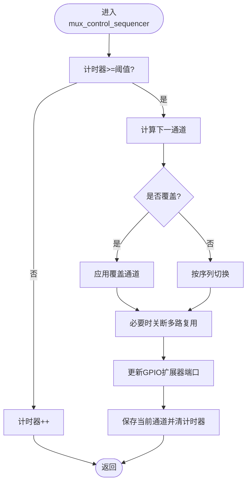
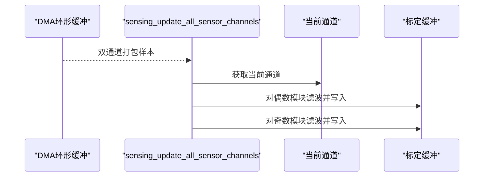
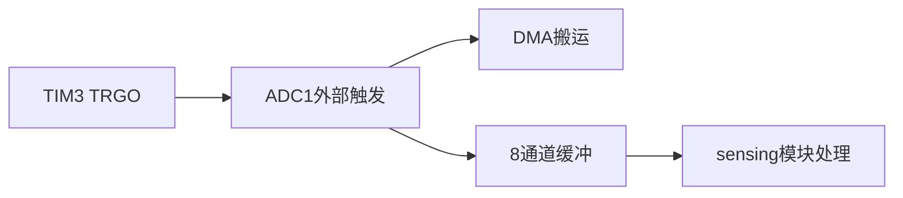
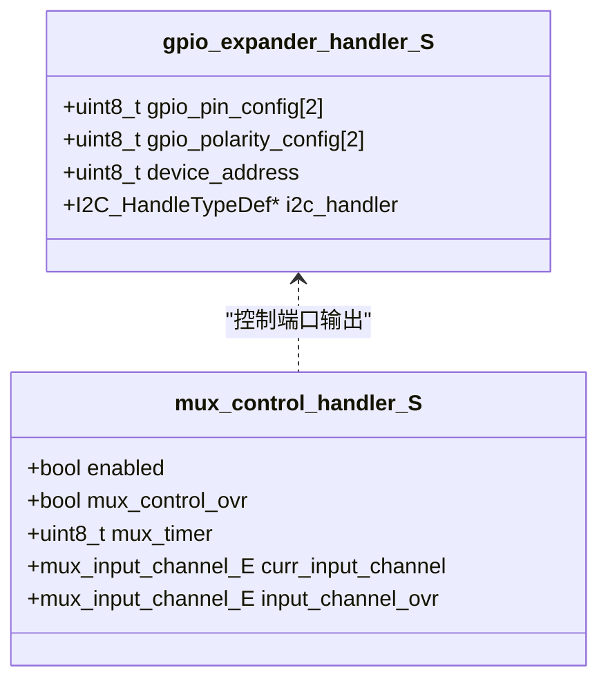
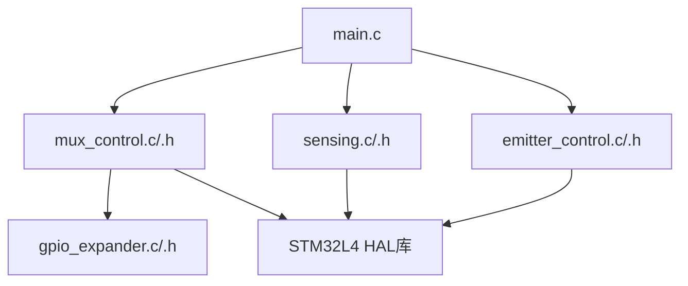

# ADC采样与多路复用

<cite>
**本文引用的文件**   
- [mux_control.h](file://firmware/STM32/fNIRS/Core/Inc/mux_control.h)
- [mux_control.c](file://firmware/STM32/fNIRS/Core/Src/mux_control.c)
- [sensing.h](file://firmware/STM32/fNIRS/Core/Inc/sensing.h)
- [sensing.c](file://firmware/STM32/fNIRS/Core/Src/sensing.c)
- [main.h](file://firmware/STM32/fNIRS/Core/Inc/main.h)
- [main.c](file://firmware/STM32/fNIRS/Core/Src/main.c)
- [gpio_expander.h](file://firmware/STM32/fNIRS/Core/Inc/gpio_expander.h)
- [gpio_expander.c](file://firmware/STM32/fNIRS/Core/Src/gpio_expander.c)
- [emitter_control.h](file://firmware/STM32/fNIRS/Core/Inc/emitter_control.h)
- [emitter_control.c](file://firmware/STM32/fNIRS/Core/Src/emitter_control.c)
- [fNIRS.ioc](file://firmware/STM32/fNIRS/fNIRS.ioc)
- [stm32l4xx_it.c](file://firmware/STM32/fNIRS/Core/Src/stm32l4xx_it.c)
- [isr.h](file://firmware/STM32/fNIRS/Core/Inc/isr.h)
</cite>

## 目录
1. [引言](#引言)
2. [项目结构](#项目结构)
3. [核心组件](#核心组件)
4. [架构总览](#架构总览)
5. [详细组件分析](#详细组件分析)
6. [依赖关系分析](#依赖关系分析)
7. [性能考虑](#性能考虑)
8. [故障排查指南](#故障排查指南)
9. [结论](#结论)
10. [附录](#附录)

## 引言
本技术文档围绕fNIRS设备中的ADC采样与多路复用系统展开，目标是为信号处理工程师提供一套完整的ADC配置、多路复用器控制、DMA数据传输及扫描序列的实现指南。文档重点覆盖以下内容：
- ADC1初始化与配置：扫描模式、外部触发源、DMA连续传输与8通道并行采样策略
- 多路复用器控制：mux_control_init()初始化流程、mux_control_sequencer()扫描循环、I2C多路复用器地址与端口映射
- 数据缓冲与后处理：sensing_init()传感器配置、DMA双通道打包读取、低通滤波与标定缓冲
- 触发与时序：TIM3/TIM4配合ADC外部触发与状态机驱动
- 校准与噪声抑制：ADC校准、软件低通滤波、采样率优化建议
- 调优与质量保障：ADC性能调优要点、数据质量保证措施

## 项目结构
该系统以STM32L476为主控，采用ADC1进行8通道并行采样，并通过I2C扩展GPIO控制多路复用器，实现对8个传感器模块的轮询采集。主循环中同时运行发射器控制状态机与多路复用扫描序列，定时器中断驱动状态机推进。

**图示来源**
- [main.c:132-141](file://firmware/STM32/fNIRS/Core/Src/main.c#L132-L141)
- [main.c:264-387](file://firmware/STM32/fNIRS/Core/Src/main.c#L264-L387)
- [main.c:530-567](file://firmware/STM32/fNIRS/Core/Src/main.c#L530-L567)
- [main.c:575-613](file://firmware/STM32/fNIRS/Core/Src/main.c#L575-L613)
- [mux_control.c:146-158](file://firmware/STM32/fNIRS/Core/Src/mux_control.c#L146-L158)
- [gpio_expander.c:17-33](file://firmware/STM32/fNIRS/Core/Src/gpio_expander.c#L17-L33)
- [sensing.c:50-56](file://firmware/STM32/fNIRS/Core/Src/sensing.c#L50-L56)

**章节来源**
- [main.c:118-141](file://firmware/STM32/fNIRS/Core/Src/main.c#L118-L141)
- [fNIRS.ioc:47-56](file://firmware/STM32/fNIRS/fNIRS.ioc#L47-L56)

## 核心组件
- 多路复用器控制（mux_control）：负责I2C扩展器配置、通道切换与扫描序列推进
- 传感器数据管理（sensing）：负责ADC初始化、DMA启动、原始值到标定值的转换与滤波
- 发射器控制（emitter_control）：PWM驱动与工作模式状态机，与扫描序列协同
- 中断与定时（TIM/ISR）：TIM4产生1kHz标志，驱动发射器状态机；TIM3作为ADC触发源

**章节来源**
- [mux_control.h:43-53](file://firmware/STM32/fNIRS/Core/Inc/mux_control.h#L43-L53)
- [sensing.h:63-70](file://firmware/STM32/fNIRS/Core/Inc/sensing.h#L63-L70)
- [emitter_control.h:40-53](file://firmware/STM32/fNIRS/Core/Inc/emitter_control.h#L40-L53)
- [isr.h:18-22](file://firmware/STM32/fNIRS/Core/Inc/isr.h#L18-L22)

## 架构总览
ADC1在独立模式下配置8个通道，启用扫描与外部触发，DMA以半字宽度环形方式搬运至缓冲区。TIM3输出触发信号，TIM4用于状态机节拍。多路复用器通过两个I2C扩展器控制8路模拟输入的切换，当前通道由扫描序列决定，随后被sensing模块读取并滤波。

**图示来源**
- [main.c:147-178](file://firmware/STM32/fNIRS/Core/Src/main.c#L147-L178)
- [mux_control.c:170-229](file://firmware/STM32/fNIRS/Core/Src/mux_control.c#L170-L229)
- [sensing.c:73-84](file://firmware/STM32/fNIRS/Core/Src/sensing.c#L73-L84)
- [stm32l4xx_it.c:235-244](file://firmware/STM32/fNIRS/Core/Src/stm32l4xx_it.c#L235-L244)

## 详细组件分析

### 多路复用器控制（mux_control）
- 初始化流程
  - 将I2C句柄绑定至两个GPIO扩展器实例
  - 配置扩展器寄存器（方向与极性），默认关闭所有通道
- 扫描序列
  - 基于定时器计数与状态机推进，按固定顺序切换通道
  - 支持覆盖模式：允许上位机或串口接口强制指定通道
- I2C地址与端口映射
  - 使用两片GPIO扩展器，分别控制不同组的通道
  - 通过端口0/1的位组合生成各通道的控制字

**图示来源**
- [mux_control.c:170-229](file://firmware/STM32/fNIRS/Core/Src/mux_control.c#L170-L229)
- [mux_control.c:102-144](file://firmware/STM32/fNIRS/Core/Src/mux_control.c#L102-L144)

**章节来源**
- [mux_control.c:146-158](file://firmware/STM32/fNIRS/Core/Src/mux_control.c#L146-L158)
- [mux_control.c:170-229](file://firmware/STM32/fNIRS/Core/Src/mux_control.c#L170-L229)
- [mux_control.h:43-53](file://firmware/STM32/fNIRS/Core/Inc/mux_control.h#L43-L53)

### 传感器数据管理（sensing）
- ADC初始化与校准
  - 启动ADC1，执行单端校准
  - 启动DMA，环形搬运8通道采样结果
- 数据缓冲策略
  - 使用DMA双通道打包：每半字承载两个通道的12位样本
  - 每次扫描周期读取当前通道对应的两个模块样本，进行低通滤波并写入标定缓冲
- 温度与标定
  - 提供温度读数接口与温度数组
  - 标度因子与偏移量预留，便于后续标定

**图示来源**
- [sensing.c:50-56](file://firmware/STM32/fNIRS/Core/Src/sensing.c#L50-L56)
- [sensing.c:73-84](file://firmware/STM32/fNIRS/Core/Src/sensing.c#L73-L84)
- [sensing.h:46-61](file://firmware/STM32/fNIRS/Core/Inc/sensing.h#L46-L61)

**章节来源**
- [sensing.c:50-84](file://firmware/STM32/fNIRS/Core/Src/sensing.c#L50-L84)
- [sensing.h:46-61](file://firmware/STM32/fNIRS/Core/Inc/sensing.h#L46-L61)

### ADC1配置与触发源
- 扫描与触发
  - ADC1配置为独立模式，扫描8通道，外部触发来自TIM3的TRGO上升沿
  - DMA连续请求开启，溢出保留策略确保数据不丢失
- 采样时间与分辨率
  - 采样时间为47.5个周期，分辨率为12位，满足小信号检测需求
- 时钟与电源
  - ADC时钟由PLL选择，系统时钟经配置后提供稳定采样时序

**图示来源**
- [main.c:264-387](file://firmware/STM32/fNIRS/Core/Src/main.c#L264-L387)
- [fNIRS.ioc:14-16](file://firmware/STM32/fNIRS/fNIRS.ioc#L14-L16)
- [fNIRS.ioc:47-56](file://firmware/STM32/fNIRS/fNIRS.ioc#L47-L56)

**章节来源**
- [main.c:289-291](file://firmware/STM32/fNIRS/Core/Src/main.c#L289-L291)
- [main.c:557-567](file://firmware/STM32/fNIRS/Core/Src/main.c#L557-L567)
- [fNIRS.ioc:35-42](file://firmware/STM32/fNIRS/fNIRS.ioc#L35-L42)

### I2C多路复用器地址与端口映射
- 地址定义
  - 两片GPIO扩展器的从地址已定义，分别用于控制不同组的通道
- 端口映射
  - 通过端口0/1的位组合生成各通道控制字，实现四路选择与禁用
- 扩展器配置
  - 初始化时写入方向与极性寄存器，随后以端口写入方式更新输出状态

**图示来源**
- [gpio_expander.h:26-35](file://firmware/STM32/fNIRS/Core/Inc/gpio_expander.h#L26-L35)
- [mux_control.c:33-47](file://firmware/STM32/fNIRS/Core/Src/mux_control.c#L33-L47)

**章节来源**
- [mux_control.c:10-29](file://firmware/STM32/fNIRS/Core/Src/mux_control.c#L10-L29)
- [mux_control.c:102-144](file://firmware/STM32/fNIRS/Core/Src/mux_control.c#L102-L144)
- [gpio_expander.c:17-33](file://firmware/STM32/fNIRS/Core/Src/gpio_expander.c#L17-L33)

### 发射器控制与同步
- 工作模式
  - 支持禁用、空闲、默认模式、用户控制、循环、全开660nm/940nm等状态
- PWM驱动
  - 通过I2C扩展PWM控制器，按模块奇偶分配不同波长通道
- 同步推进
  - TIM4中断标志驱动状态机切换，结合多路复用扫描实现光源与采样的协调

**章节来源**
- [emitter_control.c:33-181](file://firmware/STM32/fNIRS/Core/Src/emitter_control.c#L33-L181)
- [emitter_control.c:220-278](file://firmware/STM32/fNIRS/Core/Src/emitter_control.c#L220-L278)
- [isr.h:18-22](file://firmware/STM32/fNIRS/Core/Inc/isr.h#L18-L22)

## 依赖关系分析
- 组件耦合
  - 主循环依赖mux_control与emitter_control的状态推进
  - sensing模块依赖当前通道信息与DMA缓冲
  - 多路复用器控制依赖GPIO扩展器与I2C接口
- 外部依赖
  - HAL库与板级支持包提供ADC/DMA/I2C/TIM/USB等外设抽象
  - CubeMX配置文件定义了ADC通道、DMA参数与时钟分频

**图示来源**
- [main.c:132-141](file://firmware/STM32/fNIRS/Core/Src/main.c#L132-L141)
- [mux_control.c:146-158](file://firmware/STM32/fNIRS/Core/Src/mux_control.c#L146-L158)
- [sensing.c:50-56](file://firmware/STM32/fNIRS/Core/Src/sensing.c#L50-L56)
- [emitter_control.c:183-189](file://firmware/STM32/fNIRS/Core/Src/emitter_control.c#L183-L189)

**章节来源**
- [main.c:118-141](file://firmware/STM32/fNIRS/Core/Src/main.c#L118-L141)
- [fNIRS.ioc:68-81](file://firmware/STM32/fNIRS/fNIRS.ioc#L68-L81)

## 性能考虑
- 采样率与触发频率
  - ADC采样时间固定，结合TIM3触发周期可估算采样速率；若需提高吞吐，可在满足信噪比前提下缩短采样时间或提升系统时钟
- DMA带宽与缓冲
  - DMA使用半字宽度环形搬运，注意避免中断处理延迟导致缓冲覆盖；必要时提升DMA优先级或减少非关键中断
- 通道切换抖动
  - 多路复用器切换期间存在寄生电容充放电，建议在通道切换后插入额外采样周期或增加滤波长度
- 校准与噪声抑制
  - ADC已执行单端校准；建议在软件层引入移动平均或指数滑动平均，降低量化噪声与纹波
- 并行采样策略
  - 当前为8通道顺序扫描；若硬件允许，可考虑分组并行或使用更高分辨率/更快采样时间以提升动态范围

[本节为通用指导，无需特定文件来源]

## 故障排查指南
- ADC无数据或数据异常
  - 检查TIM3是否正确输出TRGO，确认ADC外部触发配置与DMA连续请求
  - 核对DMA中断与优先级设置，确保未被其他中断抢占
  - 参考：[main.c:289-291](file://firmware/STM32/fNIRS/Core/Src/main.c#L289-L291)，[fNIRS.ioc:47-56](file://firmware/STM32/fNIRS/fNIRS.ioc#L47-L56)，[stm32l4xx_it.c:207-216](file://firmware/STM32/fNIRS/Core/Src/stm32l4xx_it.c#L207-L216)
- 多路复用器不切换
  - 确认I2C通信正常，检查扩展器配置寄存器写入与端口输出
  - 核对通道映射表与端口位组合，确保覆盖模式未意外启用
  - 参考：[mux_control.c:102-144](file://firmware/STM32/fNIRS/Core/Src/mux_control.c#L102-L144)，[gpio_expander.c:58-66](file://firmware/STM32/fNIRS/Core/Src/gpio_expander.c#L58-L66)
- 数据质量差或波动大
  - 检查采样时间与滤波参数，适当增大滤波系数或增加采样点数
  - 参考：[sensing.c:45-48](file://firmware/STM32/fNIRS/Core/Src/sensing.c#L45-L48)，[sensing.c:73-84](file://firmware/STM32/fNIRS/Core/Src/sensing.c#L73-L84)
- 发射器状态异常
  - 检查TIM4中断标志与状态机推进逻辑，确认覆盖模式与用户指令未冲突
  - 参考：[emitter_control.c:220-278](file://firmware/STM32/fNIRS/Core/Src/emitter_control.c#L220-L278)，[isr.h:18-22](file://firmware/STM32/fNIRS/Core/Inc/isr.h#L18-L22)

**章节来源**
- [main.c:289-291](file://firmware/STM32/fNIRS/Core/Src/main.c#L289-L291)
- [mux_control.c:102-144](file://firmware/STM32/fNIRS/Core/Src/mux_control.c#L102-L144)
- [sensing.c:45-48](file://firmware/STM32/fNIRS/Core/Src/sensing.c#L45-L48)
- [emitter_control.c:220-278](file://firmware/STM32/fNIRS/Core/Src/emitter_control.c#L220-L278)
- [stm32l4xx_it.c:207-216](file://firmware/STM32/fNIRS/Core/Src/stm32l4xx_it.c#L207-L216)

## 结论
本系统通过ADC1的8通道扫描与DMA环形搬运，结合I2C多路复用器与定时器触发，实现了对8个传感器模块的高效并行采样。mux_control与sensing模块清晰分离职责，既保证了实时性又便于扩展与调试。建议在实际部署中根据具体噪声与动态范围要求，进一步优化采样时间、滤波参数与触发频率，以获得更佳的数据质量与系统稳定性。

[本节为总结，无需特定文件来源]

## 附录

### ADC1通道映射与DMA缓冲布局
- 通道映射（按顺序）
  - 通道15 → 模块1
  - 通道14 → 模块2
  - 通道13 → 模块3
  - 通道12 → 模块4
  - 通道4 → 模块5
  - 通道3 → 模块6
  - 通道1 → 模块7
  - 通道2 → 模块8
- DMA缓冲
  - 每个DMA半字包含两个通道样本，按模块偶/奇分组读取

**章节来源**
- [sensing.c:14-22](file://firmware/STM32/fNIRS/Core/Src/sensing.c#L14-L22)
- [sensing.c:75-83](file://firmware/STM32/fNIRS/Core/Src/sensing.c#L75-L83)
- [fNIRS.ioc:1-10](file://firmware/STM32/fNIRS/fNIRS.ioc#L1-L10)

### ADC校准与噪声抑制方法
- ADC校准
  - 在sensing_init中执行单端校准，建议在温度变化或长时间运行后重校
- 噪声抑制
  - 软件低通滤波：使用指数滑动平均，平滑量化噪声与纹波
  - 采样时间优化：在满足奈奎斯特定理的前提下，尽量缩短采样时间以降低噪声积分

**章节来源**
- [sensing.c:50-56](file://firmware/STM32/fNIRS/Core/Src/sensing.c#L50-L56)
- [sensing.c:45-48](file://firmware/STM32/fNIRS/Core/Src/sensing.c#L45-L48)