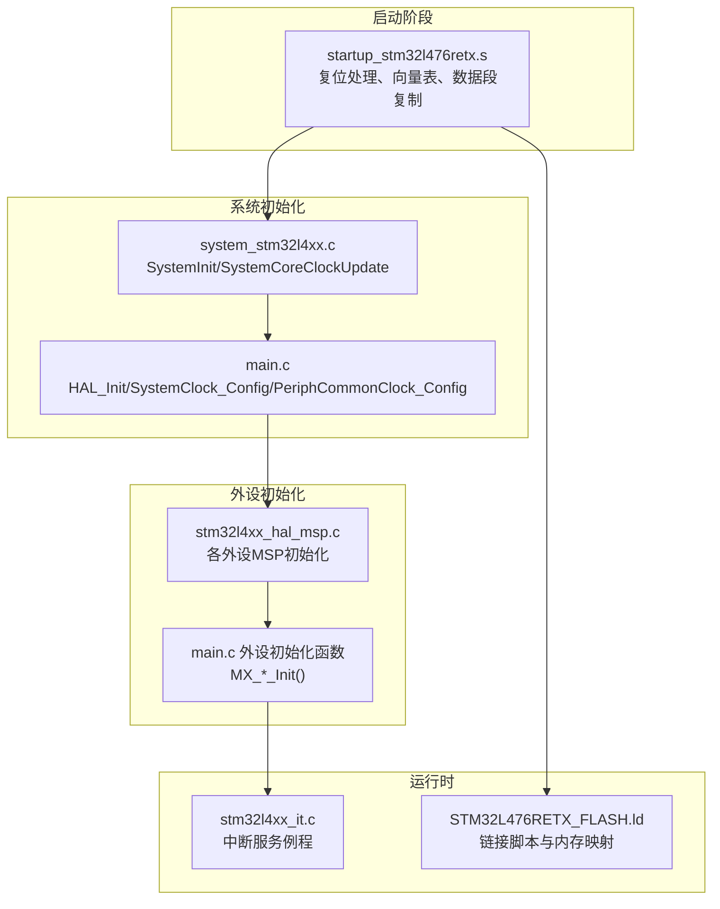
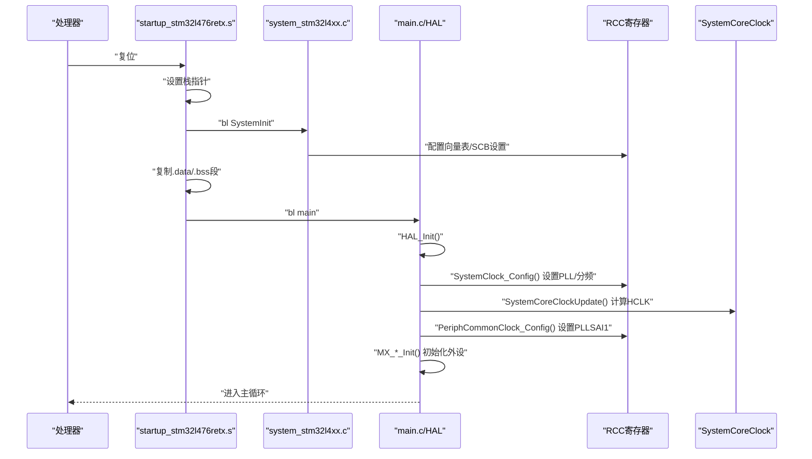
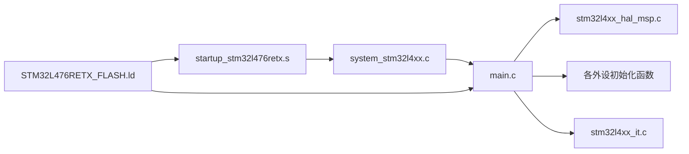

# STM32系统架构

<cite>
**本文档引用的文件**
- [system_stm32l4xx.c](file://firmware/STM32/fNIRS/Core/Src/system_stm32l4xx.c)
- [startup_stm32l476retx.s](file://firmware/STM32/fNIRS/Core/Startup/startup_stm32l476retx.s)
- [main.c](file://firmware/STM32/fNIRS/Core/Src/main.c)
- [stm32l4xx_hal_conf.h](file://firmware/STM32/fNIRS/Core/Inc/stm32l4xx_hal_conf.h)
- [stm32l4xx_hal_msp.c](file://firmware/STM32/fNIRS/Core/Src/stm32l4xx_hal_msp.c)
- [stm32l4xx_it.c](file://firmware/STM32/fNIRS/Core/Src/stm32l4xx_it.c)
- [stm32l4xx_it.h](file://firmware/STM32/fNIRS/Core/Inc/stm32l4xx_it.h)
- [STM32L476RETX_FLASH.ld](file://firmware/STM32/fNIRS/STM32L476RETX_FLASH.ld)
- [main.h](file://firmware/STM32/fNIRS/Core/Inc/main.h)
</cite>

## 目录
1. [简介](#简介)
2. [项目结构](#项目结构)
3. [核心组件](#核心组件)
4. [架构总览](#架构总览)
5. [详细组件分析](#详细组件分析)
6. [依赖关系分析](#依赖关系分析)
7. [性能考虑](#性能考虑)
8. [故障排除指南](#故障排除指南)
9. [结论](#结论)
10. [附录](#附录)

## 简介
本文件面向嵌入式开发者，系统性阐述基于STM32L476RET6微控制器的系统架构与初始化流程。重点覆盖：
- 系统启动流程与启动文件作用
- 时钟配置（SystemClock_Config）与外设公共时钟配置（PeriphCommonClock_Config）
- HAL库初始化顺序与错误处理机制
- 关键寄存器配置说明（RCC、SCB等）
- 内存映射与中断向量表布局
- 系统级调试技巧与性能优化建议

## 项目结构
该工程采用典型的STM32CubeMX生成的分层组织方式：启动代码、HAL驱动、应用逻辑分离清晰。关键目录与文件如下：
- Core/Startup：启动汇编文件，负责复位后初始化与向量表设置
- Core/Src：应用入口、系统初始化、外设初始化、中断服务例程
- Core/Inc：公共头文件与HAL配置
- Drivers/CMSIS与Drivers/STM32L4xx_HAL_Driver：CMSIS内核与HAL外设驱动
- 链接脚本：定义内存布局与段分布

**图表来源**
- [startup_stm32l476retx.s:58-106](file://firmware/STM32/fNIRS/Core/Startup/startup_stm32l476retx.s#L58-L106)
- [system_stm32l4xx.c:197-208](file://firmware/STM32/fNIRS/Core/Src/system_stm32l4xx.c#L197-L208)
- [main.c:102-128](file://firmware/STM32/fNIRS/Core/Src/main.c#L102-L128)
- [stm32l4xx_hal_msp.c:64-79](file://firmware/STM32/fNIRS/Core/Src/stm32l4xx_hal_msp.c#L64-L79)
- [stm32l4xx_it.c:69-195](file://firmware/STM32/fNIRS/Core/Src/stm32l4xx_it.c#L69-L195)
- [STM32L476RETX_FLASH.ld:36-51](file://firmware/STM32/fNIRS/STM32L476RETX_FLASH.ld#L36-L51)

**章节来源**
- [startup_stm32l476retx.s:58-106](file://firmware/STM32/fNIRS/Core/Startup/startup_stm32l476retx.s#L58-L106)
- [system_stm32l4xx.c:197-208](file://firmware/STM32/fNIRS/Core/Src/system_stm32l4xx.c#L197-L208)
- [main.c:102-128](file://firmware/STM32/fNIRS/Core/Src/main.c#L102-L128)
- [stm32l4xx_hal_msp.c:64-79](file://firmware/STM32/fNIRS/Core/Src/stm32l4xx_hal_msp.c#L64-L79)
- [stm32l4xx_it.c:69-195](file://firmware/STM32/fNIRS/Core/Src/stm32l4xx_it.c#L69-L195)
- [STM32L476RETX_FLASH.ld:36-51](file://firmware/STM32/fNIRS/STM32L476RETX_FLASH.ld#L36-L51)

## 核心组件
- 启动文件（startup_stm32l476retx.s）：设置栈指针、调用SystemInit、复制/清零数据段、调用main
- 系统时钟与核心时钟更新（system_stm32l4xx.c）：SystemInit设置向量表与FPU；SystemCoreClockUpdate根据RCC寄存器计算HCLK
- 应用入口与HAL初始化（main.c）：HAL_Init、SystemClock_Config、PeriphCommonClock_Config、外设初始化
- HAL MSP（stm32l4xx_hal_msp.c）：各外设时钟使能、GPIO配置、DMA与中断初始化
- 中断服务例程（stm32l4xx_it.c）：默认异常处理与外设中断
- 链接脚本（STM32L476RETX_FLASH.ld）：定义内存区域、段布局、堆栈大小

**章节来源**
- [startup_stm32l476retx.s:58-106](file://firmware/STM32/fNIRS/Core/Startup/startup_stm32l476retx.s#L58-L106)
- [system_stm32l4xx.c:197-317](file://firmware/STM32/fNIRS/Core/Src/system_stm32l4xx.c#L197-L317)
- [main.c:102-257](file://firmware/STM32/fNIRS/Core/Src/main.c#L102-L257)
- [stm32l4xx_hal_msp.c:64-551](file://firmware/STM32/fNIRS/Core/Src/stm32l4xx_hal_msp.c#L64-L551)
- [stm32l4xx_it.c:69-263](file://firmware/STM32/fNIRS/Core/Src/stm32l4xx_it.c#L69-L263)
- [STM32L476RETX_FLASH.ld:36-189](file://firmware/STM32/fNIRS/STM32L476RETX_FLASH.ld#L36-L189)

## 架构总览
下图展示从上电复位到进入main的完整流程，以及关键寄存器与模块交互。

**图表来源**
- [startup_stm32l476retx.s:61-101](file://firmware/STM32/fNIRS/Core/Startup/startup_stm32l476retx.s#L61-L101)
- [system_stm32l4xx.c:197-208](file://firmware/STM32/fNIRS/Core/Src/system_stm32l4xx.c#L197-L208)
- [main.c:102-128](file://firmware/STM32/fNIRS/Core/Src/main.c#L102-L128)
- [main.c:187-231](file://firmware/STM32/fNIRS/Core/Src/main.c#L187-L231)
- [main.c:237-257](file://firmware/STM32/fNIRS/Core/Src/main.c#L237-L257)

## 详细组件分析

### 启动流程与启动文件
- 复位后执行Reset_Handler，设置初始栈指针，调用SystemInit完成向量表与FPU配置，随后复制.data段、清零.bss段，最后调用main
- 默认向量表位于Flash起始地址，可通过宏重定位至SRAM或Flash

关键行为与寄存器：
- 栈指针初始化：使用链接脚本提供的_estack
- 向量表基址：g_pfnVectors在Flash中，可按需重定位
- FPU访问权限：通过SCB->CPACR配置

**章节来源**
- [startup_stm32l476retx.s:61-101](file://firmware/STM32/fNIRS/Core/Startup/startup_stm32l476retx.s#L61-L101)
- [startup_stm32l476retx.s:128-232](file://firmware/STM32/fNIRS/Core/Startup/startup_stm32l476retx.s#L128-L232)
- [system_stm32l4xx.c:197-208](file://firmware/STM32/fNIRS/Core/Src/system_stm32l4xx.c#L197-L208)

### 系统时钟与SystemCoreClockUpdate
- SystemInit仅设置向量表与FPU访问权限，不改变系统时钟
- SystemCoreClockUpdate根据RCC寄存器状态（MSI/HSE/HSI/PLL）与AHB/APB预分频表计算当前HCLK频率
- 该函数在HAL_RCC_ClockConfig后自动更新SystemCoreClock

关键寄存器与变量：
- SystemCoreClock：当前HCLK频率
- AHBPrescTable/APBPrescTable：AHB/APB预分频查表
- MSIRangeTable：MSI频率范围表

**章节来源**
- [system_stm32l4xx.c:197-208](file://firmware/STM32/fNIRS/Core/Src/system_stm32l4xx.c#L197-L208)
- [system_stm32l4xx.c:251-317](file://firmware/STM32/fNIRS/Core/Src/system_stm32l4xx.c#L251-L317)

### SystemClock_Config() 详解
该函数完成以下步骤：
1) 电压调节设置：设置PWR_REGULATOR_VOLTAGE_SCALE1
2) 振荡器配置：启用MSI，选择MSIRANGE_6，配置PLL参数（源、M、N、P、Q、R）
3) 时钟切换：将SYSCLK源切换为PLLCLK，并设置AHB/APB分频
4) 闪存等待周期：根据目标频率设置FLASH_LATENCY_4

关键参数与含义：
- 源：RCC_PLLSOURCE_MSI
- 分频：PLL_M=1，PLL_N=40，PLL_P=7，PLL_Q=2，PLL_R=2
- SYSCLK：MSI(4MHz) -> MSI/PLL_M -> (MSI/PLL_M)*PLL_N -> (MSI/PLL_M)*PLL_N/PLL_R
- HCLK：SYSCLK/1，APB1/APB2：SYSCLK/1

注意：该配置未启用USB专用时钟（PLLSAI1用于USB/ADC），但后续PeriphCommonClock_Config会单独配置PLLSAI1。

**章节来源**
- [main.c:187-231](file://firmware/STM32/fNIRS/Core/Src/main.c#L187-L231)

### PeriphCommonClock_Config() 详解
该函数配置PLLSAI1，为USB与ADC提供专用时钟：
- 选择PLLSAI1作为USB与ADC时钟源
- 配置PLLSAI1参数（源、M、N、P、Q、R）
- 开启PLLSAI1输出：RCC_PLLSAI1_48M2CLK（USB FS所需）、RCC_PLLSAI1_ADC1CLK

注意：该函数在SystemClock_Config之后调用，确保系统时钟稳定后再配置外设专用时钟。

**章节来源**
- [main.c:237-257](file://firmware/STM32/fNIRS/Core/Src/main.c#L237-L257)

### HAL库初始化顺序与错误处理
- HAL_Init()：初始化内核与系统组件（SysTick等）
- SystemClock_Config()：配置系统时钟
- PeriphCommonClock_Config()：配置外设公共时钟
- MX_*_Init()：逐个初始化GPIO/DMA/ADC/I2C/SPI/TIM/UART/USB等
- 错误处理：Error_Handler()禁用中断并进入死循环

初始化顺序的重要性：
- 必须先配置系统时钟，再初始化依赖时钟的外设
- USB需要PLLSAI1时钟，必须在MX_USB_DEVICE_Init()前完成PeriphCommonClock_Config()

**章节来源**
- [main.c:102-128](file://firmware/STM32/fNIRS/Core/Src/main.c#L102-L128)
- [main.c:714-723](file://firmware/STM32/fNIRS/Core/Src/main.c#L714-L723)

### 外设初始化（MSP与外设函数）
- HAL_MspInit()：使能SYSCFG与PWR时钟
- 各外设MSP：分别配置GPIO、时钟、DMA与中断优先级
- 外设初始化函数：如MX_ADC1_Init/MX_I2C1_Init等，设置工作模式、触发、DMA等

典型流程：
- 使能外设时钟
- 配置GPIO复用功能
- 初始化DMA与中断
- 调用HAL_xxx_Init()完成外设配置

**章节来源**
- [stm32l4xx_hal_msp.c:64-79](file://firmware/STM32/fNIRS/Core/Src/stm32l4xx_hal_msp.c#L64-L79)
- [stm32l4xx_hal_msp.c:87-154](file://firmware/STM32/fNIRS/Core/Src/stm32l4xx_hal_msp.c#L87-L154)
- [stm32l4xx_hal_msp.c:207-278](file://firmware/STM32/fNIRS/Core/Src/stm32l4xx_hal_msp.c#L207-L278)
- [stm32l4xx_hal_msp.c:337-397](file://firmware/STM32/fNIRS/Core/Src/stm32l4xx_hal_msp.c#L337-L397)
- [stm32l4xx_hal_msp.c:405-469](file://firmware/STM32/fNIRS/Core/Src/stm32l4xx_hal_msp.c#L405-L469)
- [stm32l4xx_hal_msp.c:477-546](file://firmware/STM32/fNIRS/Core/Src/stm32l4xx_hal_msp.c#L477-L546)
- [main.c:264-387](file://firmware/STM32/fNIRS/Core/Src/main.c#L264-L387)
- [main.c:394-483](file://firmware/STM32/fNIRS/Core/Src/main.c#L394-L483)
- [main.c:490-523](file://firmware/STM32/fNIRS/Core/Src/main.c#L490-L523)
- [main.c:530-613](file://firmware/STM32/fNIRS/Core/Src/main.c#L530-L613)
- [main.c:620-648](file://firmware/STM32/fNIRS/Core/Src/main.c#L620-L648)

### 中断向量表与异常处理
- 向量表g_pfnVectors位于Flash，包含所有异常与外设中断入口
- 默认异常处理函数为空循环，便于调试
- 外设中断通过NVIC设置优先级并使能

关键点：
- 异常：NMI/HardFault/MemManage/BugFault/UsageFault/SVC/DebugMon/PendSV/SysTick
- 外设中断：DMA1_Channel1、ADC1_2、TIM4、OTG_FS等

**章节来源**
- [startup_stm32l476retx.s:128-232](file://firmware/STM32/fNIRS/Core/Startup/startup_stm32l476retx.s#L128-L232)
- [stm32l4xx_it.c:69-195](file://firmware/STM32/fNIRS/Core/Src/stm32l4xx_it.c#L69-L195)
- [stm32l4xx_it.c:207-258](file://firmware/STM32/fNIRS/Core/Src/stm32l4xx_it.c#L207-L258)

### 内存映射与链接脚本
- 片上RAM：0x20000000起始，容量96KB
- 片上RAM2：0x10000000起始，容量32KB
- Flash：0x8000000起始，容量512KB
- 堆栈：_estack指向RAM末尾
- 段分布：.isr_vector、.text、.rodata、.data、.bss、用户堆栈

**章节来源**
- [STM32L476RETX_FLASH.ld:46-51](file://firmware/STM32/fNIRS/STM32L476RETX_FLASH.ld#L46-L51)
- [STM32L476RETX_FLASH.ld:54-189](file://firmware/STM32/fNIRS/STM32L476RETX_FLASH.ld#L54-L189)

## 依赖关系分析

**图表来源**
- [startup_stm32l476retx.s:61-101](file://firmware/STM32/fNIRS/Core/Startup/startup_stm32l476retx.s#L61-L101)
- [system_stm32l4xx.c:197-208](file://firmware/STM32/fNIRS/Core/Src/system_stm32l4xx.c#L197-L208)
- [main.c:102-128](file://firmware/STM32/fNIRS/Core/Src/main.c#L102-L128)
- [stm32l4xx_hal_msp.c:64-79](file://firmware/STM32/fNIRS/Core/Src/stm32l4xx_hal_msp.c#L64-L79)
- [stm32l4xx_it.c:69-195](file://firmware/STM32/fNIRS/Core/Src/stm32l4xx_it.c#L69-L195)
- [STM32L476RETX_FLASH.ld:36-51](file://firmware/STM32/fNIRS/STM32L476RETX_FLASH.ld#L36-L51)

**章节来源**
- [startup_stm32l476retx.s:61-101](file://firmware/STM32/fNIRS/Core/Startup/startup_stm32l476retx.s#L61-L101)
- [main.c:102-128](file://firmware/STM32/fNIRS/Core/Src/main.c#L102-L128)
- [stm32l4xx_hal_msp.c:64-79](file://firmware/STM32/fNIRS/Core/Src/stm32l4xx_hal_msp.c#L64-L79)
- [stm32l4xx_it.c:69-195](file://firmware/STM32/fNIRS/Core/Src/stm32l4xx_it.c#L69-L195)
- [STM32L476RETX_FLASH.ld:36-51](file://firmware/STM32/fNIRS/STM32L476RETX_FLASH.ld#L36-L51)

## 性能考虑
- 时钟频率与功耗：更高的SYSCLK会提升性能但增加功耗，应按需设置
- 预分频策略：合理设置AHB/APB分频，避免外设过载
- 闪存等待周期：高频率下需适当提高FLASH_LATENCY
- DMA与中断：优先级设置影响实时性，避免关键路径被阻塞
- 缓存与预取：根据应用特性启用/关闭缓存与预取

[本节为通用指导，无需特定文件来源]

## 故障排除指南
常见问题与排查要点：
- 复位后无法进入main：检查startup是否正确设置栈指针与向量表
- 时钟配置失败：确认SystemClock_Config返回值，检查PLL参数与外部晶振
- USB无法枚举：确认PeriphCommonClock_Config已成功配置PLLSAI1
- ADC/DMA异常：检查DMA请求、优先级与NVIC配置
- 中断冲突：核对NVIC优先级分组与抢占优先级设置

错误处理机制：
- Error_Handler()统一禁用中断并进入死循环，便于调试
- HAL接口返回非OK时立即触发错误处理

**章节来源**
- [main.c:714-723](file://firmware/STM32/fNIRS/Core/Src/main.c#L714-L723)
- [main.c:187-231](file://firmware/STM32/fNIRS/Core/Src/main.c#L187-L231)
- [main.c:237-257](file://firmware/STM32/fNIRS/Core/Src/main.c#L237-L257)
- [stm32l4xx_hal_msp.c:138-141](file://firmware/STM32/fNIRS/Core/Src/stm32l4xx_hal_msp.c#L138-L141)

## 结论
本系统采用标准的启动-时钟-外设初始化流程，结合HAL库实现模块化与可维护性。通过明确的初始化顺序与完善的错误处理，能够在保证稳定性的同时满足实时性需求。建议在实际部署中根据应用场景进一步优化时钟与中断配置，并加强调试与监控手段。

[本节为总结，无需特定文件来源]

## 附录

### 关键寄存器与配置要点
- SystemInit：配置VTOR（向量表偏移）、SCB CPACR（FPU访问）
- SystemCoreClockUpdate：读取RCC寄存器，结合预分频表计算HCLK
- SystemClock_Config：配置PWR、RCC（MSI/PLL）、FLASH延迟
- PeriphCommonClock_Config：配置PLLSAI1（USB/ADC时钟）

**章节来源**
- [system_stm32l4xx.c:197-208](file://firmware/STM32/fNIRS/Core/Src/system_stm32l4xx.c#L197-L208)
- [system_stm32l4xx.c:251-317](file://firmware/STM32/fNIRS/Core/Src/system_stm32l4xx.c#L251-L317)
- [main.c:187-231](file://firmware/STM32/fNIRS/Core/Src/main.c#L187-L231)
- [main.c:237-257](file://firmware/STM32/fNIRS/Core/Src/main.c#L237-L257)