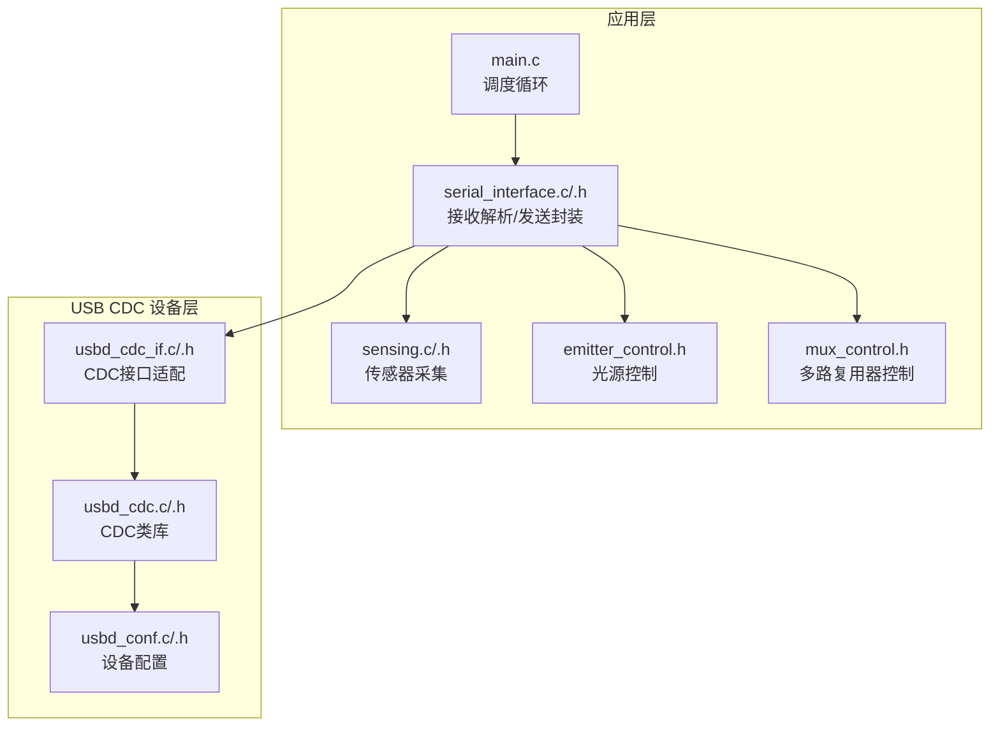
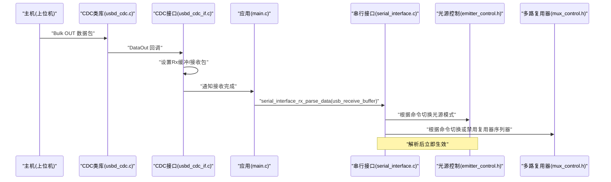
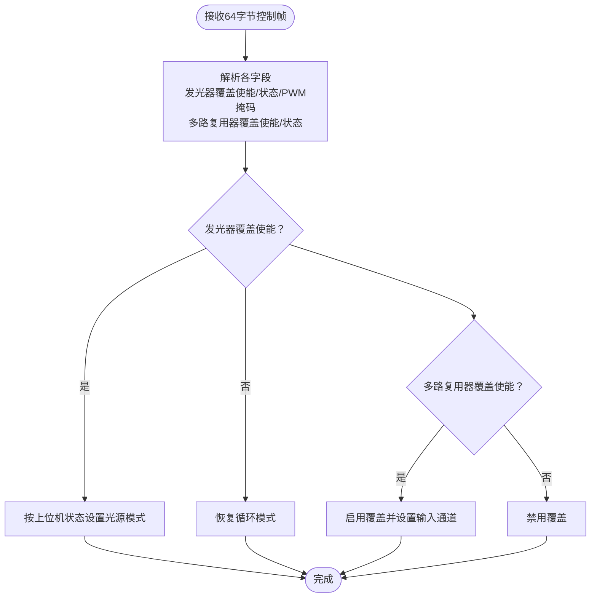
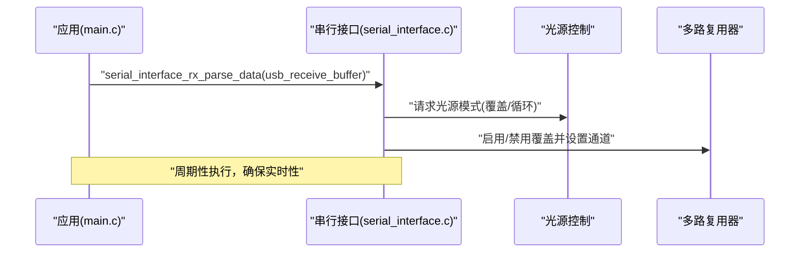
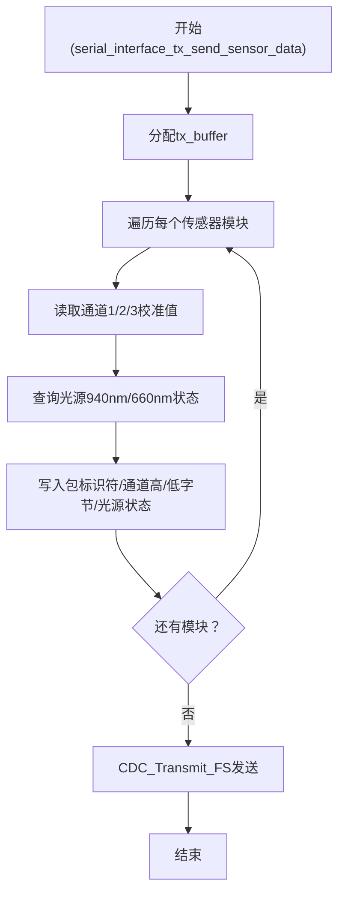
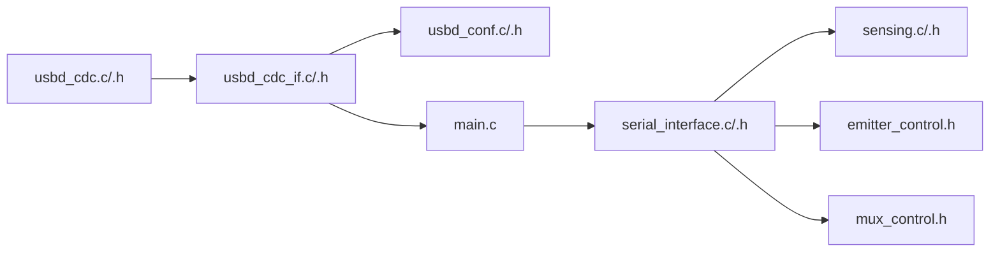

# 串行通信接口

<cite>
**本文档引用的文件**
- [serial_interface.h](file://firmware/STM32/fNIRS/Core/Inc/serial_interface.h)
- [serial_interface.c](file://firmware/STM32/fNIRS/Core/Src/serial_interface.c)
- [usbd_cdc.h](file://firmware/STM32/fNIRS/Middlewares/ST/STM32_USB_Device_Library/Class/CDC/Inc/usbd_cdc.h)
- [usbd_cdc.c](file://firmware/STM32/fNIRS/Middlewares/ST/STM32_USB_Device_Library/Class/CDC/Src/usbd_cdc.c)
- [usbd_cdc_if.h](file://firmware/STM32/fNIRS/USB_DEVICE/App/usbd_cdc_if.h)
- [usbd_cdc_if.c](file://firmware/STM32/fNIRS/USB_DEVICE/App/usbd_cdc_if.c)
- [usbd_conf.h](file://firmware/STM32/fNIRS/USB_DEVICE/Target/usbd_conf.h)
- [usbd_conf.c](file://firmware/STM32/fNIRS/USB_DEVICE/Target/usbd_conf.c)
- [main.c](file://firmware/STM32/fNIRS/Core/Src/main.c)
- [emitter_control.h](file://firmware/STM32/fNIRS/Core/Inc/emitter_control.h)
- [mux_control.h](file://firmware/STM32/fNIRS/Core/Inc/mux_control.h)
- [sensing.h](file://firmware/STM32/fNIRS/Core/Inc/sensing.h)
- [sensing.c](file://firmware/STM32/fNIRS/Core/Src/sensing.c)
</cite>

## 目录
1. [简介](#简介)
2. [项目结构](#项目结构)
3. [核心组件](#核心组件)
4. [架构总览](#架构总览)
5. [详细组件分析](#详细组件分析)
6. [依赖关系分析](#依赖关系分析)
7. [性能考虑](#性能考虑)
8. [故障排查指南](#故障排查指南)
9. [结论](#结论)
10. [附录](#附录)

## 简介
本文件面向软件开发者，系统性地阐述该fNIRS设备中基于USB CDC的串行通信接口实现，覆盖以下主题：
- USB CDC协议栈与设备枚举流程
- 端点配置与数据传输缓冲策略
- 64字节数据包格式、命令字节定义与状态反馈机制
- 接收解析函数serial_interface_rx_parse_data()的工作原理
- 串口通信协议与实时控制命令处理
- 发送函数serial_interface_tx_send_sensor_data()的数据打包与发送流程
- 错误处理与超时重传策略建议
- 调试工具配置与性能监控方法

## 项目结构
围绕串行通信接口的关键文件组织如下：
- 协议栈与设备层：USB CDC类库（usbd_cdc.h/.c）、应用适配层（usbd_cdc_if.h/.c）、设备目标配置（usbd_conf.h/.c）
- 应用层接口：serial_interface.h/.c（接收解析、发送封装）
- 上层业务：main.c（调度循环、调用serial_interface接口）、emitter_control.h（光源控制）、mux_control.h（多路复用器控制）、sensing.h/.c（传感器采集）

**图表来源**
- [main.c:147-178](file://firmware/STM32/fNIRS/Core/Src/main.c#L147-L178)
- [serial_interface.c:20-81](file://firmware/STM32/fNIRS/Core/Src/serial_interface.c#L20-L81)
- [usbd_cdc_if.c:138-145](file://firmware/STM32/fNIRS/USB_DEVICE/App/usbd_cdc_if.c#L138-L145)
- [usbd_cdc.c:140-164](file://firmware/STM32/fNIRS/Middlewares/ST/STM32_USB_Device_Library/Class/CDC/Src/usbd_cdc.c#L140-L164)
- [usbd_conf.c:350-490](file://firmware/STM32/fNIRS/USB_DEVICE/Target/usbd_conf.c#L350-L490)

**章节来源**
- [main.c:147-178](file://firmware/STM32/fNIRS/Core/Src/main.c#L147-L178)
- [serial_interface.h:12-62](file://firmware/STM32/fNIRS/Core/Inc/serial_interface.h#L12-L62)
- [serial_interface.c:20-81](file://firmware/STM32/fNIRS/Core/Src/serial_interface.c#L20-L81)
- [usbd_cdc.h:43-74](file://firmware/STM32/fNIRS/Middlewares/ST/STM32_USB_Device_Library/Class/CDC/Inc/usbd_cdc.h#L43-L74)
- [usbd_cdc.c:167-266](file://firmware/STM32/fNIRS/Middlewares/ST/STM32_USB_Device_Library/Class/CDC/Src/usbd_cdc.c#L167-L266)
- [usbd_cdc_if.h:50-53](file://firmware/STM32/fNIRS/USB_DEVICE/App/usbd_cdc_if.h#L50-L53)
- [usbd_cdc_if.c:90-95](file://firmware/STM32/fNIRS/USB_DEVICE/App/usbd_cdc_if.c#L90-L95)
- [usbd_conf.h:66-77](file://firmware/STM32/fNIRS/USB_DEVICE/Target/usbd_conf.h#L66-L77)
- [usbd_conf.c:350-490](file://firmware/STM32/fNIRS/USB_DEVICE/Target/usbd_conf.c#L350-L490)

## 核心组件
- 串行接口解析与发送模块
  - serial_interface_rx_parse_data()：从USB接收缓冲区解析控制命令，更新发射器与多路复用器状态
  - serial_interface_tx_send_sensor_data()：聚合各传感器通道与光源状态，打包为固定长度数据包并通过CDC发送
- USB CDC设备层
  - usbd_cdc：实现CDC类描述符、端点配置、数据收发回调
  - usbd_cdc_if：应用适配层，设置收发缓冲、处理接收与发送完成事件
  - usbd_conf：设备初始化、端点打开、中断回调桥接
- 应用调度
  - main.c：在主循环中调用解析函数，并根据解析结果切换光源与多路复用器模式

**章节来源**
- [serial_interface.c:20-81](file://firmware/STM32/fNIRS/Core/Src/serial_interface.c#L20-L81)
- [usbd_cdc.c:287-379](file://firmware/STM32/fNIRS/Middlewares/ST/STM32_USB_Device_Library/Class/CDC/Src/usbd_cdc.c#L287-L379)
- [usbd_cdc_if.c:152-171](file://firmware/STM32/fNIRS/USB_DEVICE/App/usbd_cdc_if.c#L152-L171)
- [main.c:147-178](file://firmware/STM32/fNIRS/Core/Src/main.c#L147-L178)

## 架构总览
下图展示从USB OUT端点到应用解析再到设备控制的整体流程。

**图表来源**
- [usbd_cdc.c:577-595](file://firmware/STM32/fNIRS/Middlewares/ST/STM32_USB_Device_Library/Class/CDC/Src/usbd_cdc.c#L577-L595)
- [usbd_cdc_if.c:261-272](file://firmware/STM32/fNIRS/USB_DEVICE/App/usbd_cdc_if.c#L261-L272)
- [main.c:154-174](file://firmware/STM32/fNIRS/Core/Src/main.c#L154-L174)
- [serial_interface.c:20-32](file://firmware/STM32/fNIRS/Core/Src/serial_interface.c#L20-L32)
- [emitter_control.h:13-24](file://firmware/STM32/fNIRS/Core/Inc/emitter_control.h#L13-L24)
- [mux_control.h:22-30](file://firmware/STM32/fNIRS/Core/Inc/mux_control.h#L22-L30)

## 详细组件分析

### USB CDC协议与设备枚举
- 端点配置
  - 命令端点(CMD EP)：IN中断端点，用于CDC控制消息
  - 数据端点：OUT/BULK端点用于数据接收；IN/BULK端点用于数据发送
  - 全速模式下数据端点最大包长为64字节
- 描述符与初始化
  - CDC类描述符包含通信接口与数据接口，以及Union功能描述符
  - 初始化阶段打开IN/OUT/CMD端点，并准备接收下一包
- 线路编码与控制
  - 支持SET_LINE_CODING/GET_LINE_CODING等标准CDC请求（当前应用层未使用）

**章节来源**
- [usbd_cdc.h:43-74](file://firmware/STM32/fNIRS/Middlewares/ST/STM32_USB_Device_Library/Class/CDC/Inc/usbd_cdc.h#L43-L74)
- [usbd_cdc.c:167-266](file://firmware/STM32/fNIRS/Middlewares/ST/STM32_USB_Device_Library/Class/CDC/Src/usbd_cdc.c#L167-L266)
- [usbd_cdc.c:287-379](file://firmware/STM32/fNIRS/Middlewares/ST/STM32_USB_Device_Library/Class/CDC/Src/usbd_cdc.c#L287-L379)

### 数据传输缓冲策略
- 应用层缓冲
  - 用户接收缓冲UserRxBufferFS与用户发送缓冲UserTxBufferFS由CDC接口层管理
  - CDC接口层提供SetRxBuffer/SetTxBuffer与ReceivePacket/TransmitPacket
- 设备层缓冲
  - usbd_cdc内部维护RxBuffer/TxBuffer、RxLength/TxLength与TxState状态机
  - 发送前检查TxState避免并发发送导致的USBD_BUSY
- 主循环中的接收
  - CDC_Receive_FS将底层接收数据复制到全局usb_receive_buffer，并清空底层缓冲

**章节来源**
- [usbd_cdc_if.h:50-53](file://firmware/STM32/fNIRS/USB_DEVICE/App/usbd_cdc_if.h#L50-L53)
- [usbd_cdc_if.c:90-95](file://firmware/STM32/fNIRS/USB_DEVICE/App/usbd_cdc_if.c#L90-L95)
- [usbd_cdc.c:757-798](file://firmware/STM32/fNIRS/Middlewares/ST/STM32_USB_Device_Library/Class/CDC/Src/usbd_cdc.c#L757-L798)
- [usbd_cdc_if.c:261-272](file://firmware/STM32/fNIRS/USB_DEVICE/App/usbd_cdc_if.c#L261-L272)
- [main.c:84-86](file://firmware/STM32/fNIRS/Core/Src/main.c#L84-L86)

### 64字节数据包格式与命令字节定义
- 包结构（每传感器模块固定长度）
  - 包标识符：高4位为0xf0，低4位为传感器模块号
  - 通道1高/低字节：16位ADC校准值
  - 通道2高/低字节：16位ADC校准值
  - 通道3高/低字节：16位ADC校准值
  - 发光源状态：bit1为940nm，bit0为660nm，表示对应光源是否开启
- 控制命令（来自上位机的64字节帧）
  - 发光器控制覆盖使能：布尔值
  - 发光器控制状态：枚举类型（如默认模式、用户控制、循环等）
  - 发光器PWM控制：16位掩码，每一位映射到一个PWM通道
  - 多路复用器控制覆盖使能：布尔值
  - 多路复用器输入通道：枚举类型（通道1/2/3/4）

**图表来源**
- [serial_interface.c:20-32](file://firmware/STM32/fNIRS/Core/Src/serial_interface.c#L20-L32)
- [serial_interface.h:12-38](file://firmware/STM32/fNIRS/Core/Inc/serial_interface.h#L12-L38)
- [main.c:156-174](file://firmware/STM32/fNIRS/Core/Src/main.c#L156-L174)

**章节来源**
- [serial_interface.h:12-38](file://firmware/STM32/fNIRS/Core/Inc/serial_interface.h#L12-L38)
- [serial_interface.c:20-32](file://firmware/STM32/fNIRS/Core/Src/serial_interface.c#L20-L32)
- [main.c:156-174](file://firmware/STM32/fNIRS/Core/Src/main.c#L156-L174)

### 实时控制命令处理
- 解析与应用
  - serial_interface_rx_parse_data()将64字节帧解析到内部变量
  - 主循环读取这些变量并调用emitter_control与mux_control接口
- 状态反馈
  - serial_interface_tx_send_sensor_data()将每个模块的ADC值与光源状态打包发送
  - 每个模块占用固定长度，便于上位机解析

**图表来源**
- [main.c:154-174](file://firmware/STM32/fNIRS/Core/Src/main.c#L154-L174)
- [serial_interface.c:20-32](file://firmware/STM32/fNIRS/Core/Src/serial_interface.c#L20-L32)
- [emitter_control.h:13-24](file://firmware/STM32/fNIRS/Core/Inc/emitter_control.h#L13-L24)
- [mux_control.h:22-30](file://firmware/STM32/fNIRS/Core/Inc/mux_control.h#L22-L30)

**章节来源**
- [main.c:154-174](file://firmware/STM32/fNIRS/Core/Src/main.c#L154-L174)
- [serial_interface.c:20-32](file://firmware/STM32/fNIRS/Core/Src/serial_interface.c#L20-L32)

### 发送函数与数据打包
- 打包逻辑
  - 遍历所有传感器模块，读取三路通道的校准ADC值
  - 查询对应PWM通道的光源状态，写入状态字节
  - 使用宏计算每个模块在缓冲区中的起始索引
- 发送接口
  - 通过CDC_Transmit_FS提交缓冲与长度
  - 若TxState非空，返回USBD_BUSY，避免并发发送

**图表来源**
- [serial_interface.c:59-81](file://firmware/STM32/fNIRS/Core/Src/serial_interface.c#L59-L81)
- [usbd_cdc_if.c:285-297](file://firmware/STM32/fNIRS/USB_DEVICE/App/usbd_cdc_if.c#L285-L297)

**章节来源**
- [serial_interface.c:59-81](file://firmware/STM32/fNIRS/Core/Src/serial_interface.c#L59-L81)
- [usbd_cdc_if.c:285-297](file://firmware/STM32/fNIRS/USB_DEVICE/App/usbd_cdc_if.c#L285-L297)

### 通信协议规范与错误处理
- 协议规范
  - 控制帧：64字节，字段顺序见serial_interface.h中的索引定义
  - 数据帧：按模块打包，每模块固定长度，包含标识符、三路ADC值与光源状态
- 错误处理与重传建议
  - 发送侧：若CDC返回USBD_BUSY，应在下次循环重试
  - 接收侧：CDC_Receive_FS已复制数据至usb_receive_buffer并清空底层缓冲，避免覆盖
  - 设备层：USBD_LL_*系列函数返回USBD_OK/USBD_BUSY/USBD_FAIL，应用应据此决策

**章节来源**
- [usbd_cdc_if.c:285-297](file://firmware/STM32/fNIRS/USB_DEVICE/App/usbd_cdc_if.c#L285-L297)
- [usbd_cdc_if.c:261-272](file://firmware/STM32/fNIRS/USB_DEVICE/App/usbd_cdc_if.c#L261-L272)
- [usbd_conf.c:720-745](file://firmware/STM32/fNIRS/USB_DEVICE/Target/usbd_conf.c#L720-L745)

## 依赖关系分析
- 组件耦合
  - serial_interface.c依赖sensing.h、emitter_control.h、mux_control.h与usbd_cdc_if.h
  - usbd_cdc_if.c依赖usbd_cdc.h与usbd_conf.h
  - main.c依赖serial_interface.h并调度emitter_control、mux_control与sensing
- 关键依赖链
  - CDC OUT数据 → usbd_cdc_if.c → main.c → serial_interface.c → 控制接口
  - 传感器数据 → sensing.c → serial_interface.c → CDC IN发送

**图表来源**
- [usbd_cdc.c:140-164](file://firmware/STM32/fNIRS/Middlewares/ST/STM32_USB_Device_Library/Class/CDC/Src/usbd_cdc.c#L140-L164)
- [usbd_cdc_if.c:138-145](file://firmware/STM32/fNIRS/USB_DEVICE/App/usbd_cdc_if.c#L138-L145)
- [usbd_conf.c:350-490](file://firmware/STM32/fNIRS/USB_DEVICE/Target/usbd_conf.c#L350-L490)
- [main.c:147-178](file://firmware/STM32/fNIRS/Core/Src/main.c#L147-L178)
- [serial_interface.c:20-81](file://firmware/STM32/fNIRS/Core/Src/serial_interface.c#L20-L81)

**章节来源**
- [serial_interface.c:3-6](file://firmware/STM32/fNIRS/Core/Src/serial_interface.c#L3-L6)
- [usbd_cdc_if.c:138-145](file://firmware/STM32/fNIRS/USB_DEVICE/App/usbd_cdc_if.c#L138-L145)
- [usbd_conf.c:350-490](file://firmware/STM32/fNIRS/USB_DEVICE/Target/usbd_conf.c#L350-L490)

## 性能考虑
- 传输效率
  - 全速模式下单包64字节，适合小数据量高频反馈
  - 发送前检查TxState可避免阻塞，提高吞吐
- 内存与DMA
  - 传感器数据通过DMA采集，降低CPU占用
  - CDC缓冲区大小可按需求调整（当前APP_RX_DATA_SIZE/APP_TX_DATA_SIZE为2048字节）
- 实时性
  - 主循环频率由定时器中断驱动，解析与控制命令在每次循环执行，保证响应及时

**章节来源**
- [usbd_cdc.h:62-74](file://firmware/STM32/fNIRS/Middlewares/ST/STM32_USB_Device_Library/Class/CDC/Inc/usbd_cdc.h#L62-L74)
- [usbd_cdc_if.h:50-53](file://firmware/STM32/fNIRS/USB_DEVICE/App/usbd_cdc_if.h#L50-L53)
- [sensing.c:50-84](file://firmware/STM32/fNIRS/Core/Src/sensing.c#L50-L84)
- [main.c:140-141](file://firmware/STM32/fNIRS/Core/Src/main.c#L140-L141)

## 故障排查指南
- 无法接收控制命令
  - 检查CDC OUT端点是否正确打开与准备接收
  - 确认CDC_Receive_FS是否被调用且成功设置RxBuffer
- 发送阻塞或USBD_BUSY
  - 检查TxState状态，避免并发发送
  - 合理安排发送频率，必要时采用队列或重试策略
- 数据包格式异常
  - 对照serial_interface.h中的索引定义，确认上位机帧结构
  - 校验每个模块的包标识符与通道字节数
- 实时控制不生效
  - 确认serial_interface_rx_parse_data在主循环中被调用
  - 检查emitter_control与mux_control的状态切换接口是否正确调用

**章节来源**
- [usbd_cdc.c:577-595](file://firmware/STM32/fNIRS/Middlewares/ST/STM32_USB_Device_Library/Class/CDC/Src/usbd_cdc.c#L577-L595)
- [usbd_cdc_if.c:261-272](file://firmware/STM32/fNIRS/USB_DEVICE/App/usbd_cdc_if.c#L261-L272)
- [usbd_cdc_if.c:285-297](file://firmware/STM32/fNIRS/USB_DEVICE/App/usbd_cdc_if.c#L285-L297)
- [serial_interface.c:20-32](file://firmware/STM32/fNIRS/Core/Src/serial_interface.c#L20-L32)
- [main.c:154-174](file://firmware/STM32/fNIRS/Core/Src/main.c#L154-L174)

## 结论
该串行通信接口以USB CDC为基础，结合应用层解析与发送封装，实现了对光源与多路复用器的实时控制与传感器数据的稳定反馈。通过明确的数据包格式、清晰的控制命令与完善的设备层缓冲策略，系统在全速模式下具备良好的实时性与可靠性。建议在后续版本中进一步完善错误重试与超时机制，并扩展上位机协议以支持更丰富的控制与诊断能力。

## 附录
- 使用指南
  - 在上位机侧构造64字节控制帧，按serial_interface.h中的索引填充字段
  - 定期轮询CDC IN端点，解析每个模块的数据包
- 调试工具配置
  - 使用串口助手或自定义脚本模拟上位机，验证控制与反馈路径
  - 利用示波器/逻辑分析仪观察USB信号质量
- 性能监控
  - 统计CDC发送成功率与平均延迟
  - 监控主循环执行周期，评估实时性