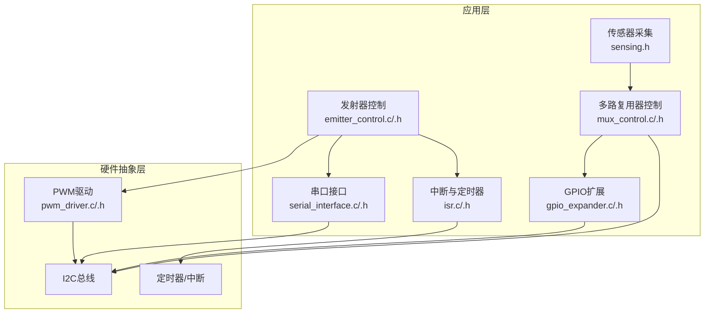
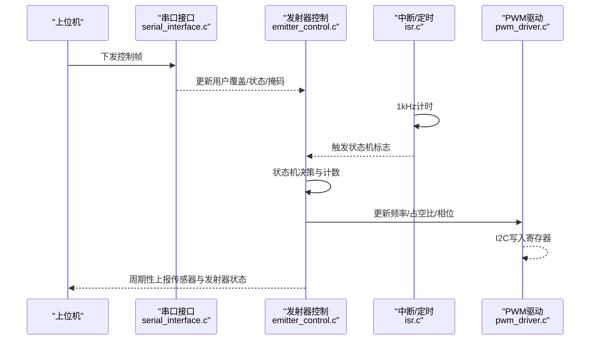
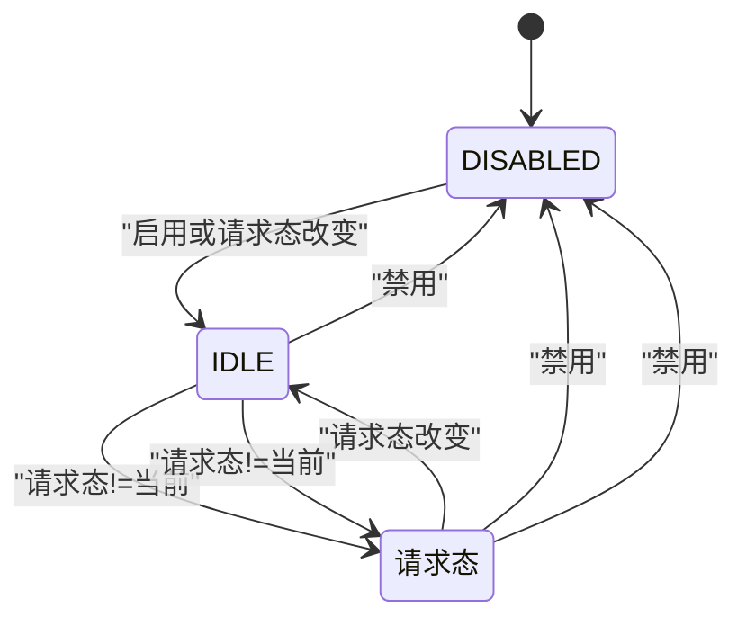
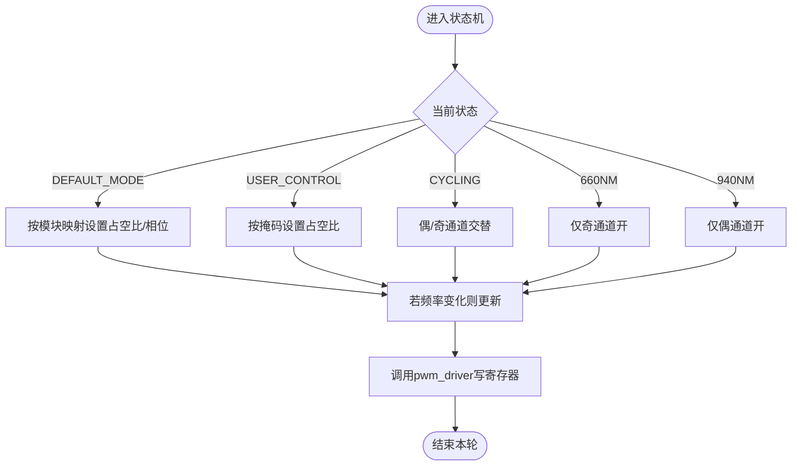
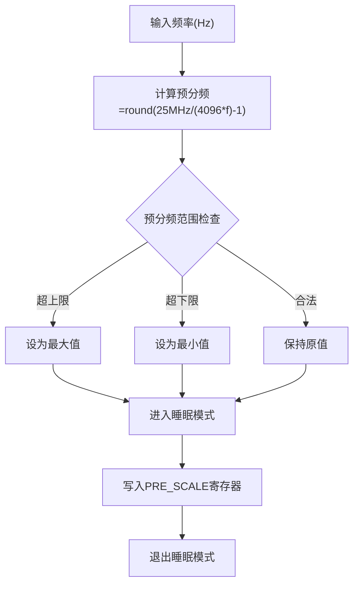
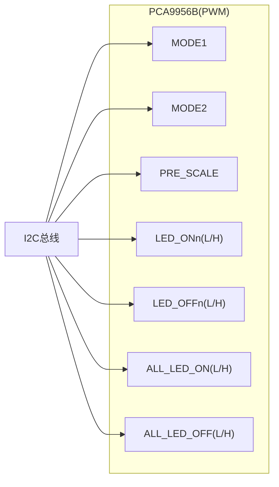
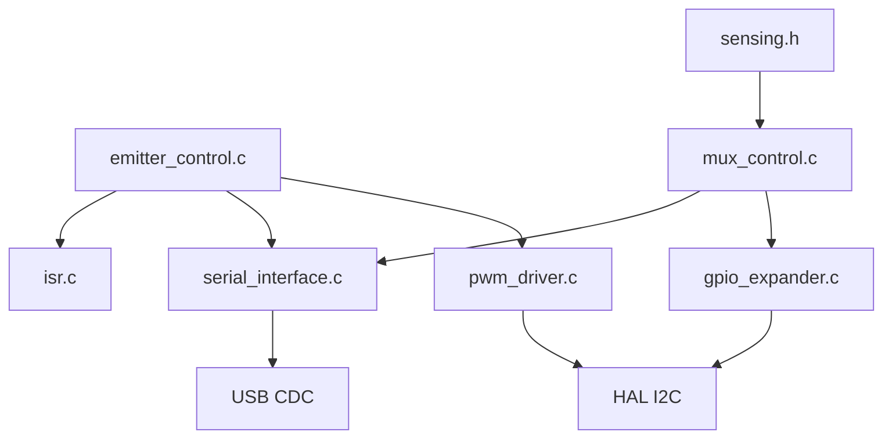

# 发射器控制系统

<cite>
**本文引用的文件**
- [emitter_control.h](file://firmware/STM32/fNIRS/Core/Inc/emitter_control.h)
- [emitter_control.c](file://firmware/STM32/fNIRS/Core/Src/emitter_control.c)
- [pwm_driver.h](file://firmware/STM32/fNIRS/Core/Inc/pwm_driver.h)
- [pwm_driver.c](file://firmware/STM32/fNIRS/Core/Src/pwm_driver.c)
- [serial_interface.h](file://firmware/STM32/fNIRS/Core/Inc/serial_interface.h)
- [serial_interface.c](file://firmware/STM32/fNIRS/Core/Src/serial_interface.c)
- [isr.h](file://firmware/STM32/fNIRS/Core/Inc/isr.h)
- [isr.c](file://firmware/STM32/fNIRS/Core/Src/isr.c)
- [mux_control.h](file://firmware/STM32/fNIRS/Core/Inc/mux_control.h)
- [mux_control.c](file://firmware/STM32/fNIRS/Core/Src/mux_control.c)
- [gpio_expander.h](file://firmware/STM32/fNIRS/Core/Inc/gpio_expander.h)
- [gpio_expander.c](file://firmware/STM32/fNIRS/Core/Src/gpio_expander.c)
- [sensing.h](file://firmware/STM32/fNIRS/Core/Inc/sensing.h)
- [main.h](file://firmware/STM32/fNIRS/Core/Inc/main.h)
</cite>

## 目录
1. [简介](#简介)
2. [项目结构](#项目结构)
3. [核心组件](#核心组件)
4. [架构总览](#架构总览)
5. [详细组件分析](#详细组件分析)
6. [依赖关系分析](#依赖关系分析)
7. [性能与功耗考虑](#性能与功耗考虑)
8. [故障诊断指南](#故障诊断指南)
9. [结论](#结论)
10. [附录：控制参数与寄存器映射](#附录控制参数与寄存器映射)

## 简介
本技术文档面向发射器控制系统，聚焦于LED发射器的PWM控制实现、状态机设计与I2C通信协议。文档系统性地解析以下内容：
- 初始化流程：emitter_control_init()
- 状态机：emitter_control_state_machine() 及其状态转换
- 控制模式：CYCLING、CONSTANT（默认）、MANUAL（用户覆盖）
- PWM频率配置、占空比与相位控制、功率调节策略
- I2C地址分配、寄存器映射与通信时序
- 状态转换图、控制参数设置与故障诊断方法
- 面向硬件工程师的驱动电路设计建议与调试工具使用说明

## 项目结构
发射器控制位于STM32固件工程的Core目录下，采用“功能模块化+分层”的组织方式：
- 接口层：emitter_control.h、serial_interface.h、isr.h、mux_control.h、gpio_expander.h、sensing.h、main.h
- 实现层：对应 .c 文件完成具体逻辑
- 关键模块：
  - 发射器控制：emitter_control.c/.h
  - PWM驱动：pwm_driver.c/.h
  - 串口接口与上位机交互：serial_interface.c/.h
  - 中断与时钟：isr.c/.h
  - 多路复用器控制：mux_control.c/.h
  - GPIO扩展：gpio_expander.c/.h
  - 传感器采集：sensing.h

**图表来源**
- [emitter_control.c:183-189](file://firmware/STM32/fNIRS/Core/Src/emitter_control.c#L183-L189)
- [pwm_driver.c:33-83](file://firmware/STM32/fNIRS/Core/Src/pwm_driver.c#L33-L83)
- [serial_interface.c:20-32](file://firmware/STM32/fNIRS/Core/Src/serial_interface.c#L20-L32)
- [isr.c:35-46](file://firmware/STM32/fNIRS/Core/Src/isr.c#L35-L46)
- [mux_control.c:146-158](file://firmware/STM32/fNIRS/Core/Src/mux_control.c#L146-L158)
- [gpio_expander.c:17-33](file://firmware/STM32/fNIRS/Core/Src/gpio_expander.c#L17-L33)

**章节来源**
- [emitter_control.h:13-38](file://firmware/STM32/fNIRS/Core/Inc/emitter_control.h#L13-L38)
- [pwm_driver.h:13-62](file://firmware/STM32/fNIRS/Core/Inc/pwm_driver.h#L13-L62)
- [serial_interface.h:12-51](file://firmware/STM32/fNIRS/Core/Inc/serial_interface.h#L12-L51)
- [isr.h:12-16](file://firmware/STM32/fNIRS/Core/Inc/isr.h#L12-L16)
- [mux_control.h:13-40](file://firmware/STM32/fNIRS/Core/Inc/mux_control.h#L13-L40)
- [gpio_expander.h:13-35](file://firmware/STM32/fNIRS/Core/Inc/gpio_expander.h#L13-L35)
- [sensing.h:46-61](file://firmware/STM32/fNIRS/Core/Inc/sensing.h#L46-L61)
- [main.h:60-70](file://firmware/STM32/fNIRS/Core/Inc/main.h#L60-L70)

## 核心组件
- 发射器控制状态机与参数
  - 状态枚举：DISABLED、IDLE、DEFAULT_MODE、USER_CONTROL、CYCLING、FULLY_ENABLED_660NM、FULLY_ENABLED_940NM
  - 全局变量：启用标志、当前/请求状态、计数器、用户控制位、频率与各通道占空比/相位
- PWM驱动
  - 支持单通道/全通道更新，频率通过预分频寄存器配置，占空比与相位映射到LED_ONn/LED_OFFn寄存器
- 串口接口
  - 解析上位机下发的控制字节，提供用户覆盖使能、目标状态与逐通道占空比掩码
- 中断与定时
  - 1kHz定时触发，周期性发送传感器数据；发射器状态机在定时到达后推进

**章节来源**
- [emitter_control.h:13-38](file://firmware/STM32/fNIRS/Core/Inc/emitter_control.h#L13-L38)
- [emitter_control.c:29](file://firmware/STM32/fNIRS/Core/Src/emitter_control.c#L29)
- [pwm_driver.h:13-62](file://firmware/STM32/fNIRS/Core/Inc/pwm_driver.h#L13-L62)
- [serial_interface.h:12-51](file://firmware/STM32/fNIRS/Core/Inc/serial_interface.h#L12-L51)
- [isr.c:35-46](file://firmware/STM32/fNIRS/Core/Src/isr.c#L35-L46)

## 架构总览
发射器控制通过I2C与PWM控制器通信，由定时中断驱动状态机，串口接口提供远程控制能力。整体数据流如下：

**图表来源**
- [serial_interface.c:20-32](file://firmware/STM32/fNIRS/Core/Src/serial_interface.c#L20-L32)
- [emitter_control.c:220-278](file://firmware/STM32/fNIRS/Core/Src/emitter_control.c#L220-L278)
- [isr.c:35-46](file://firmware/STM32/fNIRS/Core/Src/isr.c#L35-L46)
- [pwm_driver.c:125-154](file://firmware/STM32/fNIRS/Core/Src/pwm_driver.c#L125-L154)

## 详细组件分析

### 发射器控制初始化 emitter_control_init()
- 功能要点
  - 绑定I2C句柄至PWM驱动配置
  - 设置设备配置（如推挽输出等）
  - 拉低使能引脚以启用控制器
  - 执行设备配置写入
- 关键路径
  - [emitter_control_init():183-189](file://firmware/STM32/fNIRS/Core/Src/emitter_control.c#L183-L189)
  - [pwm_driver_config():33-83](file://firmware/STM32/fNIRS/Core/Src/pwm_driver.c#L33-L83)
  - [pwm_driver_assert_enable_line():85-93](file://firmware/STM32/fNIRS/Core/Src/pwm_driver.c#L85-L93)

**章节来源**
- [emitter_control.c:183-189](file://firmware/STM32/fNIRS/Core/Src/emitter_control.c#L183-L189)
- [pwm_driver.c:33-83](file://firmware/STM32/fNIRS/Core/Src/pwm_driver.c#L33-L83)
- [main.h:60-70](file://firmware/STM32/fNIRS/Core/Inc/main.h#L60-L70)

### 发射器控制状态机 emitter_control_state_machine()
- 触发条件
  - 定时器标志置位（每4秒一次）
  - 用户覆盖开启且非USER_CONTROL/CYCLING或掩码变化
- 状态转换规则
  - DISABLED → IDLE（启用或请求态改变）
  - IDLE → 对应请求态；若禁用则回退DISABLED
  - DEFAULT_MODE/USER_CONTROL/CYCLING/FULLY_ENABLED_* → 若禁用回退DISABLED；若请求态改变则回退IDLE
- 计数与更新
  - 自增timer
  - 同步用户掩码
  - 调用通道更新函数
  - 清除定时器标志

**图表来源**
- [emitter_control.c:220-278](file://firmware/STM32/fNIRS/Core/Src/emitter_control.c#L220-L278)

**章节来源**
- [emitter_control.c:220-278](file://firmware/STM32/fNIRS/Core/Src/emitter_control.c#L220-L278)
- [isr.c:41-45](file://firmware/STM32/fNIRS/Core/Src/isr.c#L41-L45)
- [serial_interface.c:34-47](file://firmware/STM32/fNIRS/Core/Src/serial_interface.c#L34-L47)

### 控制模式与通道映射
- DEFAULT_MODE
  - 奇偶模块分别映射940nm/660nm通道，形成交错占空比
  - 默认频率与占空比设定
- USER_CONTROL
  - 使用用户掩码逐通道设置占空比（1对应全亮，0关闭）
- CYCLING
  - 交替点亮偶数/奇数通道，实现扫描式照明
- FULLY_ENABLED_660NM / FULLY_ENABLED_940NM
  - 仅启用对应波长通道，其余关闭

**图表来源**
- [emitter_control.c:33-181](file://firmware/STM32/fNIRS/Core/Src/emitter_control.c#L33-L181)
- [pwm_driver.c:156-220](file://firmware/STM32/fNIRS/Core/Src/pwm_driver.c#L156-L220)

**章节来源**
- [emitter_control.c:33-181](file://firmware/STM32/fNIRS/Core/Src/emitter_control.c#L33-L181)

### PWM频率、占空比与相位控制
- 频率控制
  - 内部振荡器频率固定，通过PRE_SCALE寄存器计算预分频值
  - 设备需处于睡眠模式才能修改频率，修改后退出睡眠
- 单通道更新
  - 将相位与占空比换算为12bit计数值，写入LED_ONn/LED_OFFn寄存器对
  - 占空比边界处理与相位边界处理
- 全通道更新
  - 一次性写入ALL_LED_ONn/ALL_LED_OFFn寄存器对

**图表来源**
- [pwm_driver.c:125-154](file://firmware/STM32/fNIRS/Core/Src/pwm_driver.c#L125-L154)

**章节来源**
- [pwm_driver.c:125-154](file://firmware/STM32/fNIRS/Core/Src/pwm_driver.c#L125-L154)
- [pwm_driver.c:156-220](file://firmware/STM32/fNIRS/Core/Src/pwm_driver.c#L156-L220)
- [pwm_driver.c:222-277](file://firmware/STM32/fNIRS/Core/Src/pwm_driver.c#L222-L277)

### I2C地址分配与寄存器映射
- PWM驱动（PCA9956B）
  - 地址：读写位在最低位，读地址与写地址差1
  - 配置寄存器：MODE1、MODE2
  - 通道寄存器：LED_ON_L/H、LED_OFF_L/H（每个通道一组）
  - 全通道寄存器：ALL_LED_ON_L/H、ALL_LED_OFF_L/H
  - 频率寄存器：PRE_SCALE
- GPIO扩展（PCA9555）
  - 地址：两个独立地址
  - 寄存器：输入端口、输出端口、极性反转、端口方向（输入/输出）

**图表来源**
- [pwm_driver.c:7-26](file://firmware/STM32/fNIRS/Core/Src/pwm_driver.c#L7-L26)
- [mux_control.c:10-13](file://firmware/STM32/fNIRS/Core/Src/mux_control.c#L10-L13)
- [gpio_expander.c:6-13](file://firmware/STM32/fNIRS/Core/Src/gpio_expander.c#L6-L13)

**章节来源**
- [pwm_driver.c:7-26](file://firmware/STM32/fNIRS/Core/Src/pwm_driver.c#L7-L26)
- [mux_control.c:10-13](file://firmware/STM32/fNIRS/Core/Src/mux_control.c#L10-L13)
- [gpio_expander.c:6-13](file://firmware/STM32/fNIRS/Core/Src/gpio_expander.c#L6-L13)

### 串口接口与上位机交互
- 接收缓冲区索引
  - 发射器控制覆盖使能、目标状态、逐通道占空比掩码
  - 多路复用器控制覆盖使能、目标通道
- 发送缓冲区
  - 每模块发送三路ADC高/低位与发射器状态（940nm/660nm）

**章节来源**
- [serial_interface.h:12-51](file://firmware/STM32/fNIRS/Core/Inc/serial_interface.h#L12-L51)
- [serial_interface.c:20-32](file://firmware/STM32/fNIRS/Core/Src/serial_interface.c#L20-L32)
- [serial_interface.c:59-81](file://firmware/STM32/fNIRS/Core/Src/serial_interface.c#L59-L81)

### 中断与定时器
- 1kHz定时器（TIM4）回调中：
  - 发送传感器数据
  - 计数器自增，超过4秒置位发射器控制标志
- ADC完成回调中：
  - 更新所有传感器通道数据

**章节来源**
- [isr.c:35-53](file://firmware/STM32/fNIRS/Core/Src/isr.c#L35-L53)

### 多路复用器与GPIO扩展
- 多路复用器
  - 两片PCA9555控制8个模拟开关，映射到4路输入通道
  - 提供顺序扫描与覆盖控制
- GPIO扩展
  - 配置端口方向与极性，写入输出端口状态

**章节来源**
- [mux_control.c:146-229](file://firmware/STM32/fNIRS/Core/Src/mux_control.c#L146-L229)
- [gpio_expander.c:17-66](file://firmware/STM32/fNIRS/Core/Src/gpio_expander.c#L17-L66)

## 依赖关系分析
- 组件耦合
  - 发射器控制依赖PWM驱动与串口接口；被中断驱动
  - 多路复用器控制依赖GPIO扩展与串口接口
  - 传感器采集与多路复用器联动
- 外部依赖
  - HAL库I2C与GPIO操作
  - USB CDC接口用于上位机通信

**图表来源**
- [emitter_control.c:183-189](file://firmware/STM32/fNIRS/Core/Src/emitter_control.c#L183-L189)
- [pwm_driver.c:33-83](file://firmware/STM32/fNIRS/Core/Src/pwm_driver.c#L33-L83)
- [serial_interface.c:20-32](file://firmware/STM32/fNIRS/Core/Src/serial_interface.c#L20-L32)
- [mux_control.c:146-158](file://firmware/STM32/fNIRS/Core/Src/mux_control.c#L146-L158)
- [gpio_expander.c:17-33](file://firmware/STM32/fNIRS/Core/Src/gpio_expander.c#L17-L33)

**章节来源**
- [emitter_control.c:183-189](file://firmware/STM32/fNIRS/Core/Src/emitter_control.c#L183-L189)
- [pwm_driver.c:33-83](file://firmware/STM32/fNIRS/Core/Src/pwm_driver.c#L33-L83)
- [serial_interface.c:20-32](file://firmware/STM32/fNIRS/Core/Src/serial_interface.c#L20-L32)
- [mux_control.c:146-158](file://firmware/STM32/fNIRS/Core/Src/mux_control.c#L146-L158)
- [gpio_expander.c:17-33](file://firmware/STM32/fNIRS/Core/Src/gpio_expander.c#L17-L33)

## 性能与功耗考虑
- 频率选择
  - 默认频率与可调范围见频率计算逻辑；过高会增加开关损耗，过低影响动态响应
- 占空比与相位
  - 单通道更新涉及多次I2C写入，存在优化空间（如批量写入）
- 采样与调度
  - 1kHz定时发送传感器数据，确保实时性；状态机按4秒周期推进，避免频繁I2C写入
- 功耗管理
  - 通过睡眠模式与占空比控制降低功耗；在不需要时关闭发射器

[本节为通用性能讨论，不直接分析具体文件]

## 故障诊断指南
- 无法通信（I2C）
  - 检查设备地址与读写位是否正确
  - 使用调试接口读取寄存器确认连接
- PWM无输出
  - 确认使能引脚已拉低、睡眠模式已清除
  - 检查占空比与相位边界处理后的寄存器值
- 状态机不前进
  - 检查1kHz定时器是否正常，标志位是否被清零
  - 确认请求态与启用标志变化
- 上位机无数据
  - 检查CDC发送缓冲区与长度
  - 确认模块编号与字节索引映射

**章节来源**
- [pwm_driver.c:85-93](file://firmware/STM32/fNIRS/Core/Src/pwm_driver.c#L85-L93)
- [pwm_driver.c:125-154](file://firmware/STM32/fNIRS/Core/Src/pwm_driver.c#L125-L154)
- [isr.c:41-45](file://firmware/STM32/fNIRS/Core/Src/isr.c#L41-L45)
- [serial_interface.c:59-81](file://firmware/STM32/fNIRS/Core/Src/serial_interface.c#L59-L81)

## 结论
本系统通过清晰的状态机与I2C驱动，实现了对多通道LED发射器的灵活控制。DEFAULT_MODE提供稳定的默认照明策略，USER_CONTROL支持精细的逐通道控制，CYCLING实现扫描式照明。PWM驱动模块提供了频率、占空比与相位的精确控制，并通过寄存器映射与预分频实现宽范围频率调节。结合串口接口与定时器机制，系统具备良好的实时性与可远程调试能力。

[本节为总结性内容，不直接分析具体文件]

## 附录：控制参数与寄存器映射

- 控制参数
  - 默认频率：约1500 Hz
  - 默认占空比：1.0
  - 默认相位：0.0
  - 频率范围：约24–1526 Hz（受预分频限制）

- I2C寄存器映射（PCA9956B）
  - MODE1/MODE2：设备配置
  - LED_ON_L/H、LED_OFF_L/H：单通道控制（每个通道一组）
  - ALL_LED_ON_L/H、ALL_LED_OFF_L/H：全通道控制
  - PRE_SCALE：频率控制

- I2C寄存器映射（PCA9555）
  - 输入端口、输出端口、极性反转、端口方向（输入/输出）

- 通道映射（示例）
  - DEFAULT_MODE：奇偶模块交错点亮
  - USER_CONTROL：掩码逐通道控制
  - CYCLING：偶/奇通道交替
  - FULLY_ENABLED_*：仅对应波长通道开启

**章节来源**
- [emitter_control.c:10-15](file://firmware/STM32/fNIRS/Core/Src/emitter_control.c#L10-L15)
- [pwm_driver.c:7-26](file://firmware/STM32/fNIRS/Core/Src/pwm_driver.c#L7-L26)
- [gpio_expander.c:6-13](file://firmware/STM32/fNIRS/Core/Src/gpio_expander.c#L6-L13)