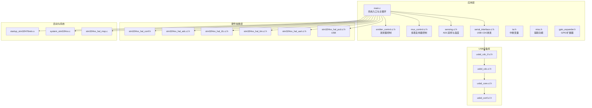
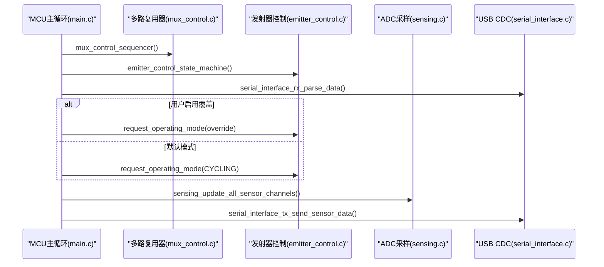
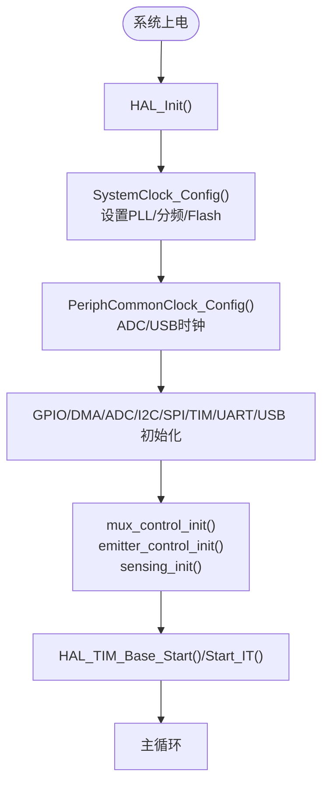
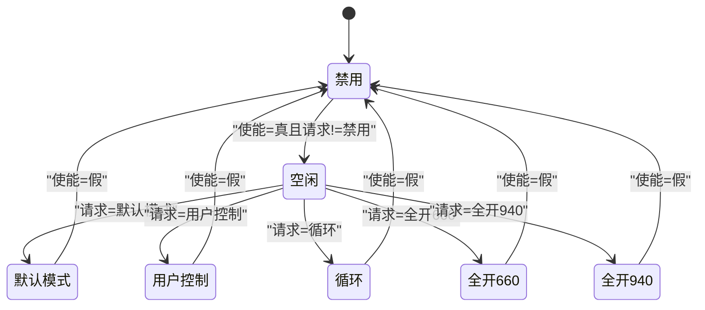
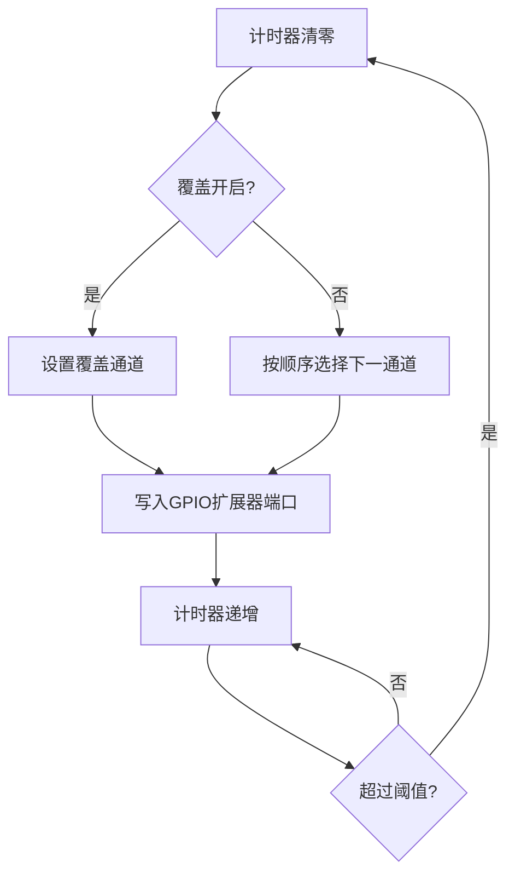
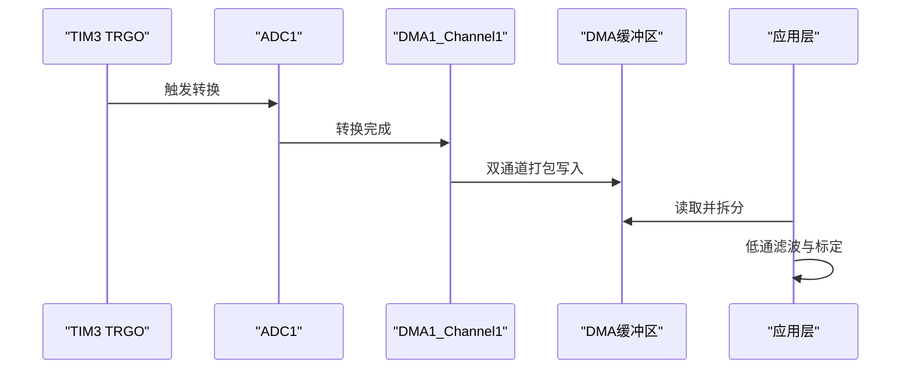
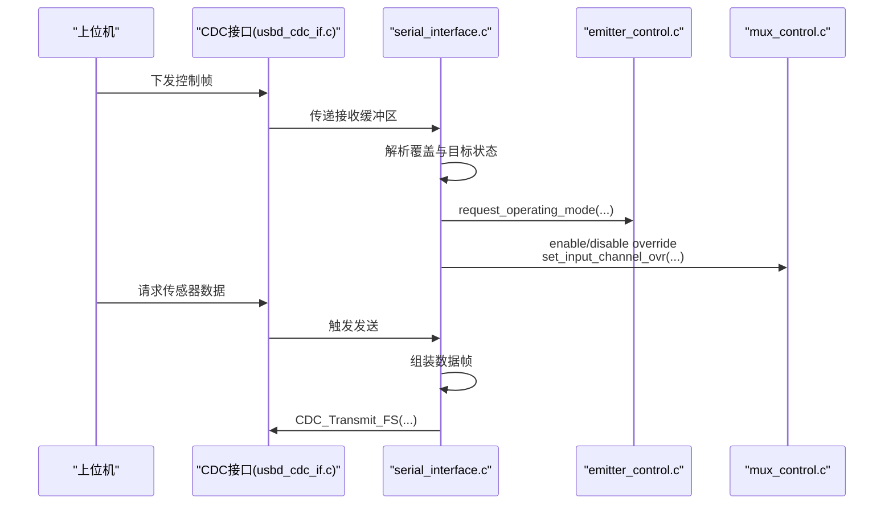
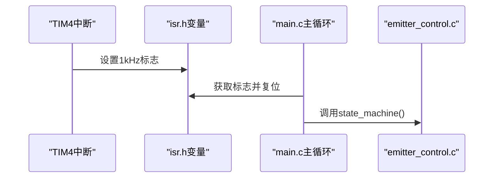
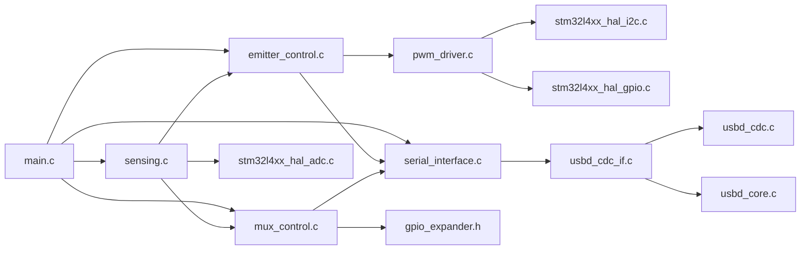

# 固件开发

<cite>
**本文引用的文件**
- [main.c](file://firmware/STM32/fNIRS/Core/Src/main.c)
- [main.h](file://firmware/STM32/fNIRS/Core/Inc/main.h)
- [emitter_control.c](file://firmware/STM32/fNIRS/Core/Src/emitter_control.c)
- [emitter_control.h](file://firmware/STM32/fNIRS/Core/Inc/emitter_control.h)
- [mux_control.c](file://firmware/STM32/fNIRS/Core/Src/mux_control.c)
- [mux_control.h](file://firmware/STM32/fNIRS/Core/Inc/mux_control.h)
- [pwm_driver.c](file://firmware/STM32/fNIRS/Core/Src/pwm_driver.c)
- [pwm_driver.h](file://firmware/STM32/fNIRS/Core/Inc/pwm_driver.h)
- [sensing.c](file://firmware/STM32/fNIRS/Core/Src/sensing.c)
- [sensing.h](file://firmware/STM32/fNIRS/Core/Inc/sensing.h)
- [serial_interface.c](file://firmware/STM32/fNIRS/Core/Src/serial_interface.c)
- [serial_interface.h](file://firmware/STM32/fNIRS/Core/Inc/serial_interface.h)
- [isr.h](file://firmware/STM32/fNIRS/Core/Inc/isr.h)
- [misc.h](file://firmware/STM32/fNIRS/Core/Inc/misc.h)
- [gpio_expander.h](file://firmware/STM32/fNIRS/Core/Inc/gpio_expander.h)
- [startup_stm32l476retx.s](file://firmware/STM32/fNIRS/Core/Startup/startup_stm32l476retx.s)
- [stm32l4xx_hal_conf.h](file://firmware/STM32/fNIRS/Core/Inc/stm32l4xx_hal_conf.h)
- [stm32l4xx_it.c](file://firmware/STM32/fNIRS/Core/Src/stm32l4xx_it.c)
- [stm32l4xx_it.h](file://firmware/STM32/fNIRS/Core/Inc/stm32l4xx_it.h)
- [stm32l4xx_hal_msp.c](file://firmware/STM32/fNIRS/Core/Src/stm32l4xx_hal_msp.c)
- [system_stm32l4xx.c](file://firmware/STM32/fNIRS/Core/Src/system_stm32l4xx.c)
- [usbd_cdc_if.c](file://firmware/STM32/fNIRS/USB_DEVICE/App/usbd_cdc_if.c)
- [usbd_cdc_if.h](file://firmware/STM32/fNIRS/USB_DEVICE/App/usbd_cdc_if.h)
- [usbd_cdc.c](file://firmware/STM32/fNIRS/Middlewares/ST/STM32_USB_Device_Library/Class/CDC/Src/usbd_cdc.c)
- [usbd_cdc.h](file://firmware/STM32/fNIRS/Middlewares/ST/STM32_USB_Device_Library/Class/CDC/Inc/usbd_cdc.h)
- [usbd_core.c](file://firmware/STM32/fNIRS/Middlewares/ST/STM32_USB_Device_Library/Core/Src/usbd_core.c)
- [usbd_core.h](file://firmware/STM32/fNIRS/Middlewares/ST/STM32_USB_Device_Library/Core/Inc/usbd_core.h)
- [usbd_conf.c](file://firmware/STM32/fNIRS/USB_DEVICE/Target/usbd_conf.c)
- [usbd_conf.h](file://firmware/STM32/fNIRS/USB_DEVICE/Target/usbd_conf.h)
- [usb_device.c](file://firmware/STM32/fNIRS/USB_DEVICE/App/usb_device.c)
- [usb_device.h](file://firmware/STM32/fNIRS/USB_DEVICE/App/usb_device.h)
</cite>

## 目录
1. [简介](#简介)
2. [项目结构](#项目结构)
3. [核心组件](#核心组件)
4. [架构总览](#架构总览)
5. [详细组件分析](#详细组件分析)
6. [依赖分析](#依赖分析)
7. [性能考虑](#性能考虑)
8. [故障排查指南](#故障排查指南)
9. [结论](#结论)
10. [附录](#附录)

## 简介
本技术文档面向基于STM32L476RET6微控制器的fNIRS（功能性近红外光谱）固件开发，系统性阐述嵌入式系统架构与开发环境、系统初始化流程、外设配置与中断处理机制；并深入解析发射器控制系统、ADC采样与DMA传输、多路复用器管理、串行通信接口（USB CDC）、PWM驱动与I2C协议等关键子系统。文档同时给出模块间交互关系、数据流设计与状态机转换逻辑，提供API接口说明与调试建议，帮助嵌入式开发者快速理解与扩展固件。

## 项目结构
固件工程采用分层与按功能模块组织的方式：顶层入口与系统时钟配置位于Core/Src；硬件抽象层（HAL）与USB设备库位于Drivers与Middlewares目录；应用层功能模块（发射器控制、多路复用、ADC采样、串口接口等）位于Core/Inc与Core/Src中；启动文件与链接脚本位于Core/Startup与根目录。

**图表来源**
- [main.c:92-181](file://firmware/STM32/fNIRS/Core/Src/main.c#L92-L181)
- [system_stm32l4xx.c:1-50](file://firmware/STM32/fNIRS/Core/Src/system_stm32l4xx.c#L1-L50)
- [startup_stm32l476retx.s](file://firmware/STM32/fNIRS/Core/Startup/startup_stm32l476retx.s)

**章节来源**
- [main.c:19-81](file://firmware/STM32/fNIRS/Core/Src/main.c#L19-L81)
- [main.h:29-80](file://firmware/STM32/fNIRS/Core/Inc/main.h#L29-L80)

## 核心组件
- 系统入口与初始化：负责HAL初始化、系统时钟与外设时钟配置、GPIO/DMA/ADC/I2C/SPI/TIM/UART/USB等外设初始化，并启动发射器控制、多路复用器序列器与定时器。
- 发射器控制系统：通过PWM驱动芯片（I2C）输出可编程占空比与相位，支持默认模式、用户控制、循环扫描、仅660nm或仅940nm全开等状态。
- 多路复用器控制：使用GPIO扩展器（I2C）切换模拟通道，实现8个传感器模块的输入通道轮询。
- ADC采样与DMA：配置ADC多通道扫描、外部触发源（TIM3 TRGO）、DMA连续传输，低通滤波后供上位机读取。
- 串行通信接口（USB CDC）：接收上位机下发的控制指令，发送传感器数据帧。
- 中断与定时：TIM4产生1kHz节拍标志，驱动发射器状态机推进；TIM3作为ADC触发源。

**章节来源**
- [main.c:101-129](file://firmware/STM32/fNIRS/Core/Src/main.c#L101-L129)
- [main.c:146-181](file://firmware/STM32/fNIRS/Core/Src/main.c#L146-L181)
- [emitter_control.c:183-202](file://firmware/STM32/fNIRS/Core/Src/emitter_control.c#L183-L202)
- [mux_control.c:146-158](file://firmware/STM32/fNIRS/Core/Src/mux_control.c#L146-L158)
- [sensing.c:50-56](file://firmware/STM32/fNIRS/Core/Src/sensing.c#L50-L56)
- [serial_interface.c:20-32](file://firmware/STM32/fNIRS/Core/Src/serial_interface.c#L20-L32)

## 架构总览
系统以main.c为主控，初始化完成后进入无限循环，周期性调用各子系统函数：多路复用器序列器推进、发射器状态机执行、串口解析用户指令并根据覆盖开关决定是否强制用户态、LED周期闪烁等。ADC由TIM3 TRGO触发，DMA搬运原始ADC值，随后在应用层进行低通滤波与打包发送。

**图表来源**
- [main.c:146-181](file://firmware/STM32/fNIRS/Core/Src/main.c#L146-L181)
- [mux_control.c:170-229](file://firmware/STM32/fNIRS/Core/Src/mux_control.c#L170-L229)
- [emitter_control.c:220-278](file://firmware/STM32/fNIRS/Core/Src/emitter_control.c#L220-L278)
- [serial_interface.c:59-81](file://firmware/STM32/fNIRS/Core/Src/serial_interface.c#L59-L81)
- [sensing.c:73-84](file://firmware/STM32/fNIRS/Core/Src/sensing.c#L73-L84)

## 详细组件分析

### 系统初始化与外设配置
- HAL初始化与时钟配置：设置电压调节、MSI为PLL输入、配置PLL参数与AHB/APB分频，设置Flash等待周期；外设时钟通过PeriphCommonClock_Config配置ADC与USB使用PLLSAI1分频。
- GPIO/DMA/ADC/I2C/SPI/TIM/UART/USB初始化：分别调用对应MX_xxx_Init函数完成引脚、模式与时序配置；DMA1_Channel1配置为ADC1 DMA中断优先级。
- 启动子系统：初始化I2C1/I2C2（用于PWM与GPIO扩展器）、I2C1（ADC参考）、SPI1（可选）、USART1（调试/日志）、TIM3（ADC触发）、TIM4（1kHz节拍）、USB设备。
- 启动序列器与状态机：初始化多路复用器与发射器控制，启动TIM3基频与TIM4中断；主循环中周期调用序列器与状态机推进。

**图表来源**
- [main.c:101-129](file://firmware/STM32/fNIRS/Core/Src/main.c#L101-L129)
- [main.c:187-257](file://firmware/STM32/fNIRS/Core/Src/main.c#L187-L257)
- [main.c:264-483](file://firmware/STM32/fNIRS/Core/Src/main.c#L264-L483)

**章节来源**
- [main.c:187-257](file://firmware/STM32/fNIRS/Core/Src/main.c#L187-L257)
- [main.c:264-483](file://firmware/STM32/fNIRS/Core/Src/main.c#L264-L483)
- [main.c:653-664](file://firmware/STM32/fNIRS/Core/Src/main.c#L653-L664)
- [main.c:671-704](file://firmware/STM32/fNIRS/Core/Src/main.c#L671-L704)

### 发射器控制系统（PWM驱动）
- 设备与接口：通过I2C连接PWM控制器，使用使能引脚控制供电；支持全局频率更新与单通道/全通道占空比/相位更新。
- 频率与占空比计算：内部振荡器频率下计算预分频值，限制范围；占空比与相位映射到12位寄存器，支持全高电平特例。
- 状态机：支持DISABLED/IDLE/DEFAULT_MODE/USER_CONTROL/CYCLING/FULLY_ENABLED_660NM/FULLY_ENABLED_940NM；根据使能状态、请求状态、用户覆盖与1kHz标志推进。
- 默认模式映射：奇偶通道分别映射至940nm/660nm发射器；循环模式按奇偶组交替点亮；用户控制通过位图直接控制各通道。

**图表来源**
- [emitter_control.h:13-38](file://firmware/STM32/fNIRS/Core/Inc/emitter_control.h#L13-L38)
- [emitter_control.c:220-278](file://firmware/STM32/fNIRS/Core/Src/emitter_control.c#L220-L278)

**章节来源**
- [pwm_driver.c:33-83](file://firmware/STM32/fNIRS/Core/Src/pwm_driver.c#L33-L83)
- [pwm_driver.c:125-154](file://firmware/STM32/fNIRS/Core/Src/pwm_driver.c#L125-L154)
- [pwm_driver.c:156-220](file://firmware/STM32/fNIRS/Core/Src/pwm_driver.c#L156-L220)
- [emitter_control.c:33-181](file://firmware/STM32/fNIRS/Core/Src/emitter_control.c#L33-L181)
- [emitter_control.c:183-202](file://firmware/STM32/fNIRS/Core/Src/emitter_control.c#L183-L202)

### 多路复用器管理
- 设备与接口：两个GPIO扩展器（I2C地址不同），通过端口0/1写入特定位模式选择通道1~4或关闭。
- 切换策略：每50个TIM4 tick切换一次；支持覆盖模式，允许上位机指定通道；在切换期间临时关闭中断以避免抖动。
- 硬件映射：每个通道对应一组引脚组合，形成对8个传感器模块的输入选择。

**图表来源**
- [mux_control.c:170-229](file://firmware/STM32/fNIRS/Core/Src/mux_control.c#L170-L229)
- [mux_control.c:102-144](file://firmware/STM32/fNIRS/Core/Src/mux_control.c#L102-L144)

**章节来源**
- [mux_control.c:146-158](file://firmware/STM32/fNIRS/Core/Src/mux_control.c#L146-L158)
- [mux_control.c:231-244](file://firmware/STM32/fNIRS/Core/Src/mux_control.c#L231-L244)

### ADC采样与DMA传输
- 触发与扫描：ADC1配置为独立模式、扫描8通道、外部触发来自TIM3 TRGO上升沿、DMA连续请求；通道映射到硬件引脚。
- DMA搬运：DMA将双通道打包的原始ADC值写入缓冲区；应用层按模块拆分并进行低通滤波。
- 温度与标定：预留温度传感器数组与模块标度/偏移参数，当前温度更新为空操作。

**图表来源**
- [main.c:264-387](file://firmware/STM32/fNIRS/Core/Src/main.c#L264-L387)
- [sensing.c:50-56](file://firmware/STM32/fNIRS/Core/Src/sensing.c#L50-L56)
- [sensing.c:73-84](file://firmware/STM32/fNIRS/Core/Src/sensing.c#L73-L84)

**章节来源**
- [main.c:264-387](file://firmware/STM32/fNIRS/Core/Src/main.c#L264-L387)
- [sensing.c:50-56](file://firmware/STM32/fNIRS/Core/Src/sensing.c#L50-L56)
- [sensing.c:73-84](file://firmware/STM32/fNIRS/Core/Src/sensing.c#L73-L84)

### 串行通信接口（USB CDC）
- 接收解析：从USB接收缓冲区解析发射器控制覆盖使能、目标状态、PWM位图以及多路复用器覆盖使能与目标通道。
- 发送数据：按固定长度打包8个传感器模块的三路通道值与发射器状态，发送至主机。
- 应用集成：主循环解析接收数据并根据覆盖开关更新发射器/多路复用器状态。

**图表来源**
- [serial_interface.c:20-32](file://firmware/STM32/fNIRS/Core/Src/serial_interface.c#L20-L32)
- [serial_interface.c:59-81](file://firmware/STM32/fNIRS/Core/Src/serial_interface.c#L59-L81)
- [usbd_cdc_if.c](file://firmware/STM32/fNIRS/USB_DEVICE/App/usbd_cdc_if.c)
- [usbd_cdc.c](file://firmware/STM32/fNIRS/Middlewares/ST/STM32_USB_Device_Library/Class/CDC/Src/usbd_cdc.c)

**章节来源**
- [serial_interface.c:20-32](file://firmware/STM32/fNIRS/Core/Src/serial_interface.c#L20-L32)
- [serial_interface.c:59-81](file://firmware/STM32/fNIRS/Core/Src/serial_interface.c#L59-L81)

### 中断与定时器
- TIM4（1kHz）：作为发射器状态机推进的节拍标志，主循环检测标志后才执行状态机推进。
- TIM3：作为ADC触发源，TRGO输出触发ADC转换。
- NVIC：DMA1_Channel1中断优先级配置，确保ADC DMA传输及时。

**图表来源**
- [isr.h:12-22](file://firmware/STM32/fNIRS/Core/Inc/isr.h#L12-L22)
- [main.c:140-141](file://firmware/STM32/fNIRS/Core/Src/main.c#L140-L141)
- [emitter_control.c:224-226](file://firmware/STM32/fNIRS/Core/Src/emitter_control.c#L224-L226)

**章节来源**
- [isr.h:12-22](file://firmware/STM32/fNIRS/Core/Inc/isr.h#L12-L22)
- [main.c:653-664](file://firmware/STM32/fNIRS/Core/Src/main.c#L653-L664)
- [main.c:530-613](file://firmware/STM32/fNIRS/Core/Src/main.c#L530-L613)

## 依赖分析
- 模块耦合关系
  - main.c依赖所有子系统头文件，协调初始化与主循环调度。
  - 发射器控制依赖PWM驱动与串口接口；PWM驱动依赖I2C与GPIO。
  - 多路复用器依赖GPIO扩展器与串口接口；串口接口依赖USB CDC与发射器/多路复用器查询接口。
  - ADC采样依赖多路复用器通道状态与发射器状态查询；串口接口依赖ADC采样结果。
- 外部依赖
  - HAL库：ADC、I2C、SPI、TIM、UART、PCD（USB）。
  - USB设备库：CDC类与核心框架。
  - 启动文件与系统时钟：CMSIS与启动文件。

**图表来源**
- [main.c:23-31](file://firmware/STM32/fNIRS/Core/Src/main.c#L23-L31)
- [emitter_control.c:2-7](file://firmware/STM32/fNIRS/Core/Src/emitter_control.c#L2-L7)
- [mux_control.c:2-6](file://firmware/STM32/fNIRS/Core/Src/mux_control.c#L2-L6)
- [sensing.c:1-7](file://firmware/STM32/fNIRS/Core/Src/sensing.c#L1-L7)
- [serial_interface.c:1-7](file://firmware/STM32/fNIRS/Core/Src/serial_interface.c#L1-L7)

**章节来源**
- [main.c:23-31](file://firmware/STM32/fNIRS/Core/Src/main.c#L23-L31)

## 性能考虑
- ADC吞吐：使用DMA连续传输减少CPU占用；TIM3 TRGO触发保证采样同步；注意通道数量与采样时间对帧周期的影响。
- PWM更新：单通道更新涉及多次I2C写入，可考虑合并写入或批量更新以降低I2C开销。
- USB带宽：传感器数据帧按模块打包，需评估上位机轮询频率与数据量，避免阻塞CDC传输。
- 抖动抑制：多路复用器切换期间关闭中断，避免切换过程中的毛刺；若需更高精度，可考虑硬件同步或锁存策略。

## 故障排查指南
- HAL错误处理：Error_Handler禁用中断并陷入死循环，便于定位初始化失败点。
- I2C通信：检查设备地址、时序参数与滤波配置；必要时使用调试接口读写寄存器验证。
- ADC异常：确认DMA缓冲区大小与索引计算正确；检查触发源与通道配置。
- USB无响应：确认USB设备初始化成功、CDC接口已注册、主机侧驱动安装正确。
- 定时器不工作：检查TIM4中断优先级与标志位复位逻辑。

**章节来源**
- [main.c:714-723](file://firmware/STM32/fNIRS/Core/Src/main.c#L714-L723)
- [pwm_driver.c:279-297](file://firmware/STM32/fNIRS/Core/Src/pwm_driver.c#L279-L297)
- [mux_control.c:216-222](file://firmware/STM32/fNIRS/Core/Src/mux_control.c#L216-L222)

## 结论
该固件以清晰的模块划分与稳定的外设配置为基础，实现了对发射器、多路复用器与传感器信号的协同控制，并通过USB CDC提供远程控制与数据读出能力。通过状态机与定时器驱动，系统在保证实时性的同时具备良好的可扩展性。后续可在I2C写入优化、USB传输效率与硬件同步方面进一步提升。

## 附录
- 关键API摘要
  - 发射器控制：初始化、使能/禁用、请求工作模式、更新频率与占空比/相位、状态机推进。
  - 多路复用器：初始化、启用/禁用序列器、序列器推进、覆盖使能与通道设置。
  - ADC采样：初始化校准与DMA、读取标定值、更新温度与传感器通道。
  - 串口接口：解析接收数据、发送传感器数据帧。
  - PWM驱动：配置寄存器、使能线控制、睡眠模式切换、频率与占空比/相位更新。
- 调试建议
  - 使用LED与UART周期性输出状态信息，便于观察主循环节拍与模块状态。
  - 在关键路径添加断言与错误码返回，结合Error_Handler定位问题。
  - 对I2C与USB接口增加超时与重试机制，提高鲁棒性。