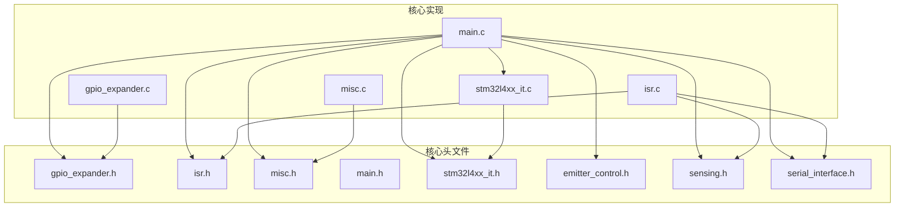
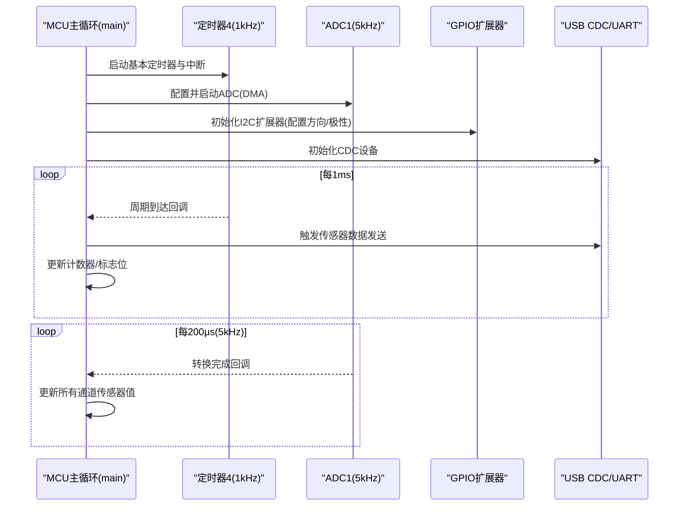
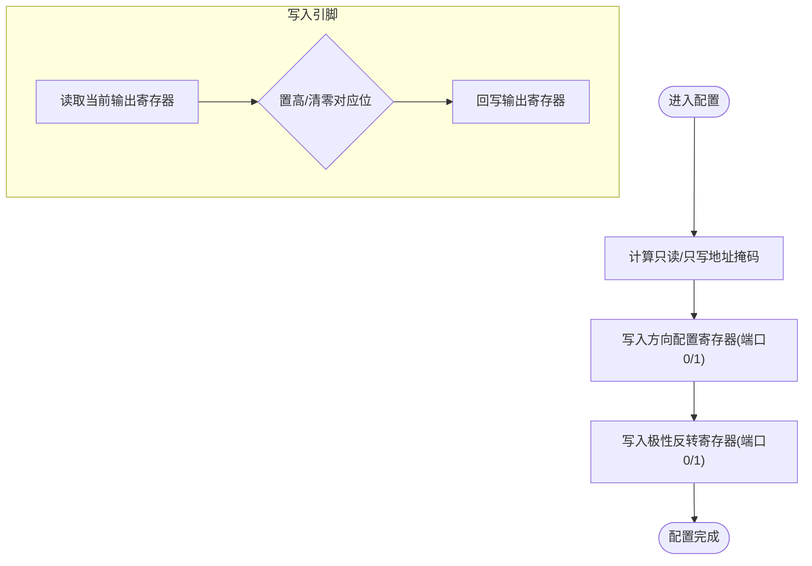
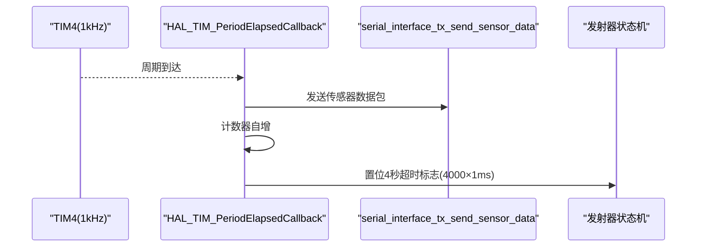
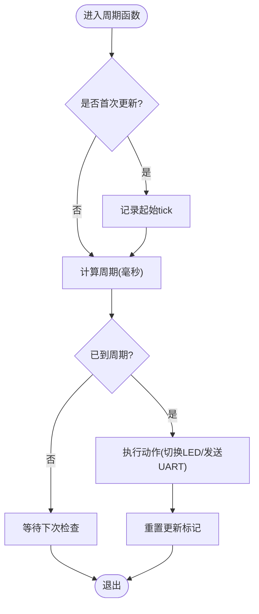
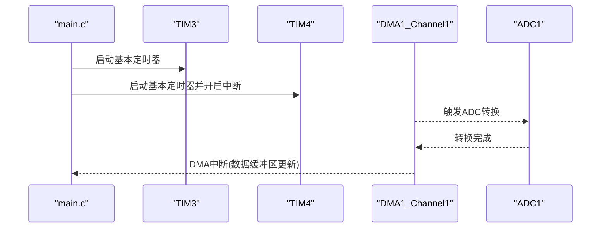
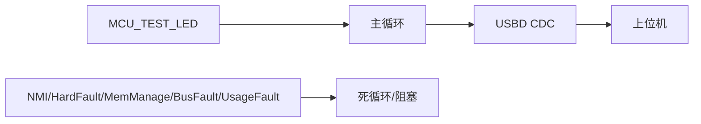
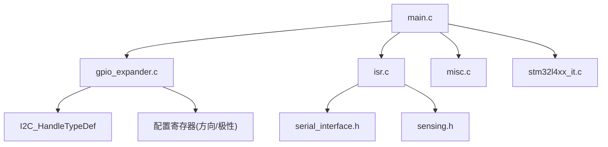

# 辅助功能模块

<cite>
**本文引用的文件**
- [gpio_expander.h](file://firmware/STM32/fNIRS/Core/Inc/gpio_expander.h)
- [gpio_expander.c](file://firmware/STM32/fNIRS/Core/Src/gpio_expander.c)
- [isr.h](file://firmware/STM32/fNIRS/Core/Inc/isr.h)
- [isr.c](file://firmware/STM32/fNIRS/Core/Src/isr.c)
- [misc.h](file://firmware/STM32/fNIRS/Core/Inc/misc.h)
- [misc.c](file://firmware/STM32/fNIRS/Core/Src/misc.c)
- [main.h](file://firmware/STM32/fNIRS/Core/Inc/main.h)
- [stm32l4xx_it.h](file://firmware/STM32/fNIRS/Core/Inc/stm32l4xx_it.h)
- [stm32l4xx_it.c](file://firmware/STM32/fNIRS/Core/Src/stm32l4xx_it.c)
- [main.c](file://firmware/STM32/fNIRS/Core/Src/main.c)
- [emitter_control.h](file://firmware/STM32/fNIRS/Core/Inc/emitter_control.h)
- [sensing.h](file://firmware/STM32/fNIRS/Core/Inc/sensing.h)
- [serial_interface.h](file://firmware/STM32/fNIRS/Core/Inc/serial_interface.h)
</cite>

## 目录
1. [简介](#简介)
2. [项目结构](#项目结构)
3. [核心组件](#核心组件)
4. [架构总览](#架构总览)
5. [详细组件分析](#详细组件分析)
6. [依赖关系分析](#依赖关系分析)
7. [性能考虑](#性能考虑)
8. [故障排查指南](#故障排查指南)
9. [结论](#结论)
10. [附录](#附录)

## 简介
本文件面向嵌入式开发者，系统性梳理“辅助功能模块”的设计与实现，重点覆盖以下方面：
- GPIO扩展器控制：通过I2C驱动PCA9555类扩展器，实现端口方向与极性配置、按引脚/端口写入输出。
- 中断服务程序：基于定时器与ADC的中断回调，驱动传感器数据采集与周期性任务调度。
- 杂项功能：LED闪烁与串口周期性打印等通用工具函数。
- 定时器中断配置与DMA中断处理：在主循环中启动定时器中断，配合ADC DMA完成多路传感器数据采集。
- 系统状态指示：通过测试LED与USB CDC上报传感器状态。
- 调试与监控：提供寄存器读写调试接口与周期性日志输出。
- 异常处理与稳定性：系统级异常处理与中断入口实现。

## 项目结构
本模块位于固件工程的STM32子目录下，采用“按功能分层+按外设分组”的组织方式：
- Inc：公共头文件（接口声明）
- Src：实现文件（功能实现）
- 外设初始化与中断入口由主工程生成的文件负责（如stm32l4xx_it.c）

图表来源
- [main.c:118-143](file://firmware/STM32/fNIRS/Core/Src/main.c#L118-L143)
- [gpio_expander.h:1-49](file://firmware/STM32/fNIRS/Core/Inc/gpio_expander.h#L1-L49)
- [isr.h:1-24](file://firmware/STM32/fNIRS/Core/Inc/isr.h#L1-L24)
- [misc.h:1-15](file://firmware/STM32/fNIRS/Core/Inc/misc.h#L1-L15)
- [stm32l4xx_it.h:1-71](file://firmware/STM32/fNIRS/Core/Inc/stm32l4xx_it.h#L1-L71)

章节来源
- [main.c:118-143](file://firmware/STM32/fNIRS/Core/Src/main.c#L118-L143)
- [gpio_expander.h:1-49](file://firmware/STM32/fNIRS/Core/Inc/gpio_expander.h#L1-L49)
- [isr.h:1-24](file://firmware/STM32/fNIRS/Core/Inc/isr.h#L1-L24)
- [misc.h:1-15](file://firmware/STM32/fNIRS/Core/Inc/misc.h#L1-L15)
- [stm32l4xx_it.h:1-71](file://firmware/STM32/fNIRS/Core/Inc/stm32l4xx_it.h#L1-L71)

## 核心组件
- GPIO扩展器控制（gpio_expander）：封装PCA9555扩展器的配置与写入接口，支持按引脚与端口操作，并提供可选调试读写。
- 中断服务程序（isr）：提供1kHz与5kHz两个频率的中断回调，分别用于周期性任务与ADC转换完成处理。
- 杂项功能（misc）：提供LED周期闪烁与串口周期性打印的通用工具函数。
- 主循环集成：在main.c中完成外设初始化、启动定时器中断、运行状态机与串口解析。

章节来源
- [gpio_expander.c:17-66](file://firmware/STM32/fNIRS/Core/Src/gpio_expander.c#L17-L66)
- [isr.c:16-52](file://firmware/STM32/fNIRS/Core/Src/isr.c#L16-L52)
- [misc.c:11-68](file://firmware/STM32/fNIRS/Core/Src/misc.c#L11-L68)
- [main.c:118-178](file://firmware/STM32/fNIRS/Core/Src/main.c#L118-L178)

## 架构总览
系统以主循环为核心，定时器中断驱动周期性任务，ADC中断驱动传感器数据更新，GPIO扩展器通过I2C进行外部控制。USB CDC用于上位机交互与状态上报。

图表来源
- [main.c:118-143](file://firmware/STM32/fNIRS/Core/Src/main.c#L118-L143)
- [isr.c:34-52](file://firmware/STM32/fNIRS/Core/Src/isr.c#L34-L52)
- [stm32l4xx_it.c:207-230](file://firmware/STM32/fNIRS/Core/Src/stm32l4xx_it.c#L207-L230)

## 详细组件分析

### GPIO扩展器控制（gpio_expander）
- 功能概述
  - 支持两组GPIO端口（端口0/端口1），每组8位。
  - 提供配置寄存器写入（方向/极性）、按引脚写入、整端口写入。
  - 可选调试接口：直接读写任意寄存器地址。
- 数据结构
  - 设备句柄包含I2C句柄、设备地址以及每端口的引脚配置与极性配置数组。
- 关键流程
  - 配置阶段：向配置寄存器写入端口方向（输入/输出）与极性寄存器。
  - 写入阶段：先读取当前输出寄存器，按位修改后回写；或直接写入端口字节。
- I2C地址与寄存器映射
  - 输入端口0/1：0x00/0x01
  - 输出端口0/1：0x02/0x03
  - 极性反转0/1：0x04/0x05
  - 方向配置0/1：0x06/0x07

图表来源
- [gpio_expander.c:17-33](file://firmware/STM32/fNIRS/Core/Src/gpio_expander.c#L17-L33)
- [gpio_expander.c:35-56](file://firmware/STM32/fNIRS/Core/Src/gpio_expander.c#L35-L56)
- [gpio_expander.c:58-66](file://firmware/STM32/fNIRS/Core/Src/gpio_expander.c#L58-L66)

章节来源
- [gpio_expander.h:13-35](file://firmware/STM32/fNIRS/Core/Inc/gpio_expander.h#L13-L35)
- [gpio_expander.c:17-66](file://firmware/STM32/fNIRS/Core/Src/gpio_expander.c#L17-L66)

### 中断服务程序（isr）
- 1kHz定时器中断（TIM4）
  - 回调中触发传感器数据发送，并递增计数器；达到阈值后置位发射器控制标志。
- 5kHz ADC中断（ADC1）
  - 回调中更新所有传感器通道的原始值与温度值。
- 全局变量
  - 包含1kHz计数器与发射器控制标志，供状态机与发送逻辑使用。

图表来源
- [isr.c:34-46](file://firmware/STM32/fNIRS/Core/Src/isr.c#L34-L46)
- [isr.h:12-16](file://firmware/STM32/fNIRS/Core/Inc/isr.h#L12-L16)

章节来源
- [isr.h:12-23](file://firmware/STM32/fNIRS/Core/Inc/isr.h#L12-L23)
- [isr.c:16-52](file://firmware/STM32/fNIRS/Core/Src/isr.c#L16-L52)

### 杂项功能（misc）
- LED周期闪烁
  - 使用HAL_GetTick作为时间基准，根据目标频率计算周期，定时切换测试LED。
- 串口周期性打印
  - 对指定UART端口周期性发送消息，便于系统状态监控与调试。

图表来源
- [misc.c:11-39](file://firmware/STM32/fNIRS/Core/Src/misc.c#L11-L39)
- [misc.c:41-68](file://firmware/STM32/fNIRS/Core/Src/misc.c#L41-L68)

章节来源
- [misc.h:10-12](file://firmware/STM32/fNIRS/Core/Inc/misc.h#L10-L12)
- [misc.c:11-68](file://firmware/STM32/fNIRS/Core/Src/misc.c#L11-L68)

### 定时器中断与DMA中断配置
- 定时器配置
  - TIM3：5kHz采样频率（用于ADC触发）。
  - TIM4：1kHz中断（用于周期性任务与标志位管理）。
- DMA配置
  - ADC1使用DMA传输，减少CPU占用，提高实时性。
- 中断入口
  - DMA1_Channel1_IRQHandler与ADC1_2_IRQHandler分别转发至HAL层。

图表来源
- [main.c:139-141](file://firmware/STM32/fNIRS/Core/Src/main.c#L139-L141)
- [stm32l4xx_it.c:207-230](file://firmware/STM32/fNIRS/Core/Src/stm32l4xx_it.c#L207-L230)

章节来源
- [main.c:139-141](file://firmware/STM32/fNIRS/Core/Src/main.c#L139-L141)
- [stm32l4xx_it.h:58-61](file://firmware/STM32/fNIRS/Core/Inc/stm32l4xx_it.h#L58-L61)
- [stm32l4xx_it.c:207-230](file://firmware/STM32/fNIRS/Core/Src/stm32l4xx_it.c#L207-L230)

### 系统状态指示与异常处理
- 测试LED
  - 通过main.c中的周期性调用实现状态可视化。
- USB CDC
  - 通过serial_interface模块将传感器数据打包并通过CDC发送至上位机。
- 异常处理
  - Cortex-M4标准异常入口均为空或死循环，便于定位问题。

图表来源
- [main.h:64-65](file://firmware/STM32/fNIRS/Core/Inc/main.h#L64-L65)
- [main.c:176-177](file://firmware/STM32/fNIRS/Core/Src/main.c#L176-L177)
- [stm32l4xx_it.c:72-141](file://firmware/STM32/fNIRS/Core/Src/stm32l4xx_it.c#L72-L141)

章节来源
- [main.h:64-65](file://firmware/STM32/fNIRS/Core/Inc/main.h#L64-L65)
- [main.c:176-177](file://firmware/STM32/fNIRS/Core/Src/main.c#L176-L177)
- [stm32l4xx_it.c:72-141](file://firmware/STM32/fNIRS/Core/Src/stm32l4xx_it.c#L72-L141)

## 依赖关系分析
- gpio_expander依赖I2C句柄与设备地址，通过I2C内存写入实现配置与输出。
- isr依赖serial_interface与sensing模块，分别触发数据发送与更新传感器值。
- misc不依赖其他模块，仅使用HAL与标准库。
- main.c作为编排者，初始化各外设并启动定时器中断，同时协调状态机与串口解析。

图表来源
- [gpio_expander.c:19-32](file://firmware/STM32/fNIRS/Core/Src/gpio_expander.c#L19-L32)
- [isr.c:34-52](file://firmware/STM32/fNIRS/Core/Src/isr.c#L34-L52)
- [main.c:118-143](file://firmware/STM32/fNIRS/Core/Src/main.c#L118-L143)

章节来源
- [gpio_expander.c:19-32](file://firmware/STM32/fNIRS/Core/Src/gpio_expander.c#L19-L32)
- [isr.c:34-52](file://firmware/STM32/fNIRS/Core/Src/isr.c#L34-L52)
- [main.c:118-143](file://firmware/STM32/fNIRS/Core/Src/main.c#L118-L143)

## 性能考虑
- 中断优先级与响应
  - TIM4中断（1kHz）与ADC中断（5kHz）分别承担周期性任务与数据采集，需确保中断优先级合理分配，避免相互抢占导致抖动。
- DMA与CPU负载
  - ADC使用DMA可显著降低CPU占用，建议保持DMA链路稳定，避免频繁重配。
- I2C时序
  - gpio_expander的I2C写入为逐寄存器写入，若批量配置可考虑合并写入以减少总线往返。
- LED与串口打印
  - misc中的周期函数使用HAL_GetTick，注意在低频场景下避免过于频繁的串口打印造成带宽压力。

## 故障排查指南
- GPIO扩展器无响应
  - 检查设备地址与I2C总线连接；确认配置寄存器已正确写入方向与极性；必要时使用调试接口读写寄存器验证。
- 传感器数据未更新
  - 确认ADC中断已触发且sensing模块正常工作；检查DMA链路与缓冲区更新。
- 1kHz任务未触发
  - 检查TIM4是否启动并开启中断；确认中断优先级与NVIC配置。
- 异常复现困难
  - Cortex-M4标准异常入口采用死循环，便于定位问题；建议在调试器下观察异常发生点与堆栈。

章节来源
- [gpio_expander.c:68-86](file://firmware/STM32/fNIRS/Core/Src/gpio_expander.c#L68-L86)
- [isr.c:48-52](file://firmware/STM32/fNIRS/Core/Src/isr.c#L48-L52)
- [stm32l4xx_it.c:235-244](file://firmware/STM32/fNIRS/Core/Src/stm32l4xx_it.c#L235-L244)
- [stm32l4xx_it.c:72-141](file://firmware/STM32/fNIRS/Core/Src/stm32l4xx_it.c#L72-L141)

## 结论
本辅助功能模块通过GPIO扩展器、定时器与ADC中断、以及通用工具函数，构建了稳定的底层控制与监控体系。其设计遵循“轻量回调、明确职责”的原则，便于在嵌入式环境中实现高可靠性的数据采集与系统状态指示。建议在实际部署中关注中断优先级、DMA稳定性与I2C时序，以进一步提升系统鲁棒性。

## 附录
- 调试建议
  - 使用gpio_expander提供的调试接口读写寄存器，快速定位扩展器配置问题。
  - 在主循环中启用周期性LED与串口打印，便于观察系统运行状态。
- 维护要点
  - 定期检查定时器与ADC配置，确保频率与缓冲区大小匹配。
  - 在高频中断路径中避免复杂运算，保持回调短小精悍。