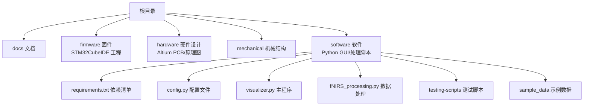
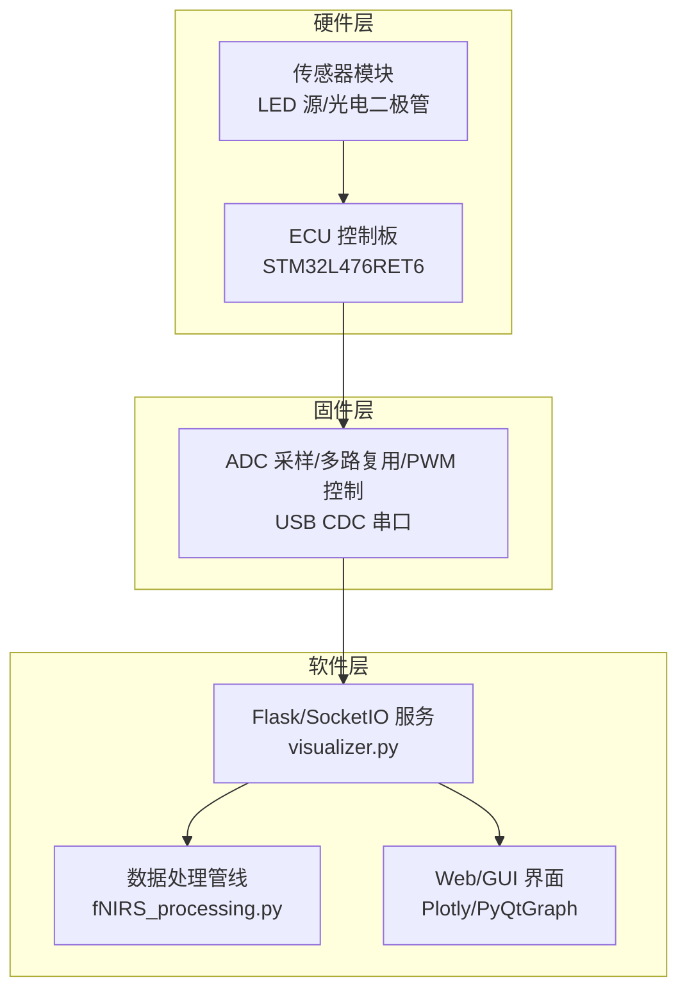
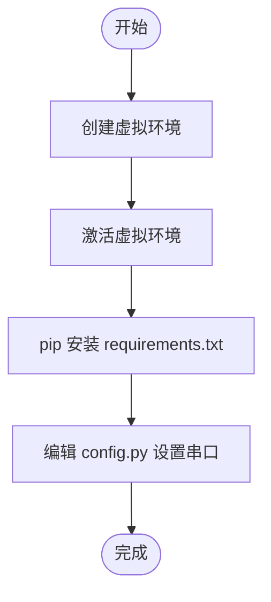
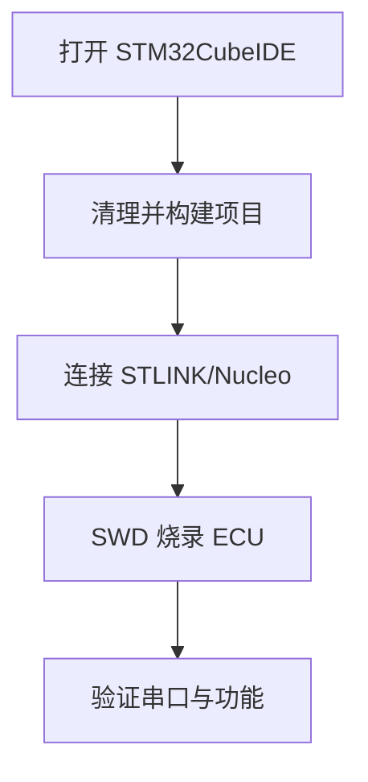
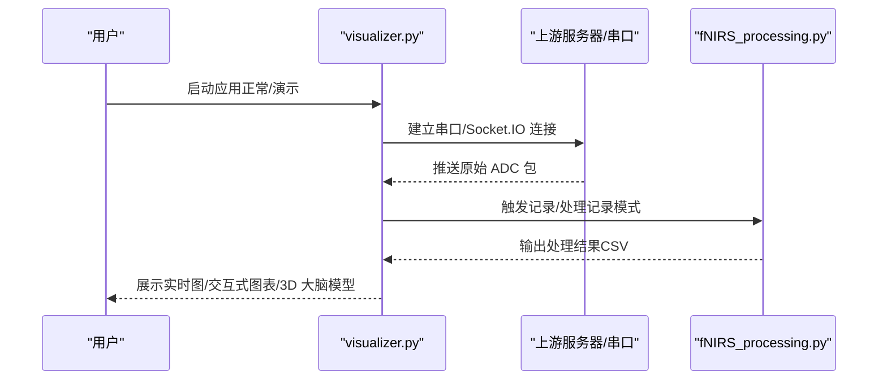
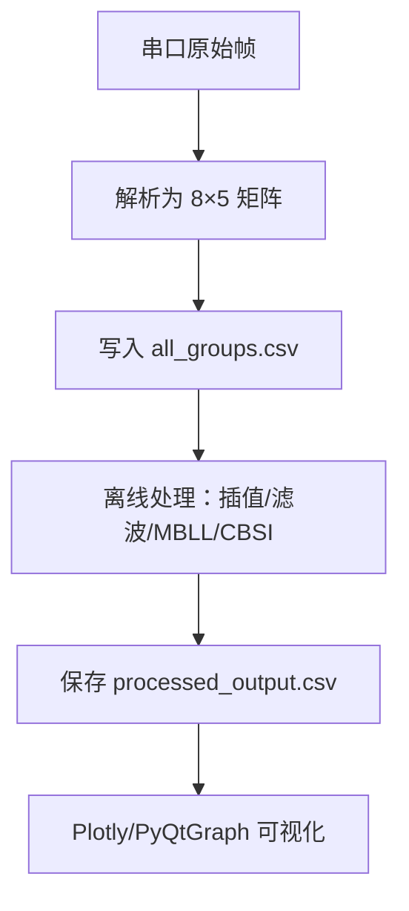
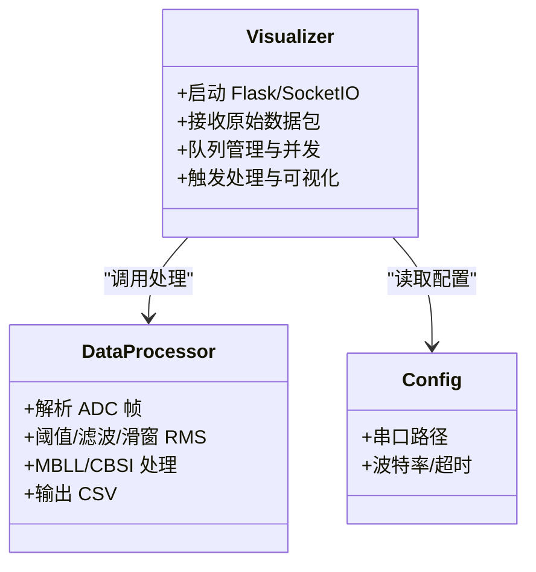
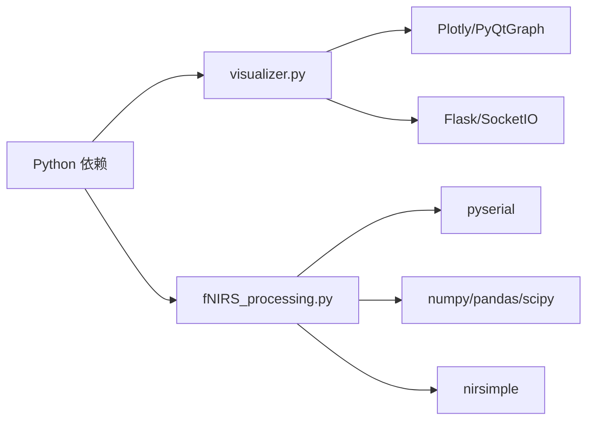

# 快速开始

<cite>
**本文引用的文件**
- [README.md](file://README.md)
- [software/README.md](file://software/README.md)
- [software/requirements.txt](file://software/requirements.txt)
- [software/config.py](file://software/config.py)
- [software/visualizer.py](file://software/visualizer.py)
- [software/fNIRS_processing.py](file://software/fNIRS_processing.py)
- [software/testing-scripts/plot.py](file://software/testing-scripts/plot.py)
- [firmware/README.md](file://firmware/README.md)
- [firmware/STM32/fNIRS/fNIRS.ioc](file://firmware/STM32/fNIRS/fNIRS.ioc)
- [firmware/STM32/fNIRS/Core/Src/sensing.c](file://firmware/STM32/fNIRS/Core/Src/sensing.c)
- [firmware/STM32/fNIRS/STM32L476RETX_FLASH.ld](file://firmware/STM32/fNIRS/STM32L476RETX_FLASH.ld)
- [firmware/STM32/fNIRS/STM32L476RETX_RAM.ld](file://firmware/STM32/fNIRS/STM32L476RETX_RAM.ld)
- [hardware/README.md](file://hardware/README.md)
</cite>

## 目录
1. [简介](#简介)
2. [项目结构](#项目结构)
3. [核心组件](#核心组件)
4. [架构总览](#架构总览)
5. [详细组件分析](#详细组件分析)
6. [依赖关系分析](#依赖关系分析)
7. [性能考虑](#性能考虑)
8. [故障排除指南](#故障排除指南)
9. [结论](#结论)
10. [附录](#附录)

## 简介
本指南面向首次接触 fNIRS 可穿戴近红外脑功能成像系统的用户，帮助您在最短时间内完成从环境准备、依赖安装、硬件连接、固件编译与烧录到软件运行与可视化的全流程。项目由三部分组成：硬件（传感器模块与 ECU 控制板）、固件（基于 STM32 的实时采集与控制）、软件（基于 Python 的 GUI 与数据处理）。通过本指南，您可以：
- 搭建 Python 虚拟环境并安装所需依赖
- 配置串口参数以连接真实设备或使用演示模式
- 编译并烧录固件至 STM32 微控制器
- 启动可视化界面进行实时监测与离线分析
- 解决常见安装与通信问题

## 项目结构
仓库采用按功能域分层的组织方式，便于不同技术背景的用户快速定位所需内容。

图表来源
- [README.md:1-19](file://README.md#L1-L19)
- [software/README.md:1-180](file://software/README.md#L1-L180)
- [firmware/README.md:1-17](file://firmware/README.md#L1-L17)
- [hardware/README.md:1-19](file://hardware/README.md#L1-L19)

章节来源
- [README.md:1-19](file://README.md#L1-L19)
- [software/README.md:1-180](file://software/README.md#L1-L180)
- [firmware/README.md:1-17](file://firmware/README.md#L1-L17)
- [hardware/README.md:1-19](file://hardware/README.md#L1-L19)

## 核心组件
- 硬件：包含 ECU 控制板、传感器模块（源/检一体式）、连接线束等，用于采集近红外光信号并驱动光源与检测器。
- 固件：在 STM32L476RET6 上运行，负责 ADC 采样、多路复用切换、PWM 控光、USB CDC 串口通信等。
- 软件：提供 Web/GUI 界面，支持实时 ADC 监测与记录后处理（含 mBLL/CBSI），并可渲染交互式 3D 大脑模型。

章节来源
- [README.md:13-19](file://README.md#L13-L19)
- [software/README.md:3-48](file://software/README.md#L3-L48)
- [firmware/README.md:3-17](file://firmware/README.md#L3-L17)

## 架构总览
下图展示了端到端的数据流：硬件采集原始 ADC 帧，经串口传输到 PC；软件接收数据，进行实时显示或离线处理，并提供可视化与交互。

图表来源
- [software/visualizer.py:12-56](file://software/visualizer.py#L12-L56)
- [software/fNIRS_processing.py:10-25](file://software/fNIRS_processing.py#L10-L25)
- [firmware/STM32/fNIRS/fNIRS.ioc:66-118](file://firmware/STM32/fNIRS/fNIRS.ioc#L66-L118)

## 详细组件分析

### 安装与环境准备
- 创建虚拟环境并激活
- 使用 requirements.txt 安装依赖
- 在 config.py 中配置串口号与波特率

图表来源
- [software/README.md:58-86](file://software/README.md#L58-L86)
- [software/requirements.txt:1-15](file://software/requirements.txt#L1-L15)
- [software/config.py:7-13](file://software/config.py#L7-L13)

章节来源
- [software/README.md:58-86](file://software/README.md#L58-L86)
- [software/requirements.txt:1-15](file://software/requirements.txt#L1-L15)
- [software/config.py:7-13](file://software/config.py#L7-L13)

### 硬件组装与连接
- 打开各 PCB 设计文件（.PrjPcb）进行装配
- 将传感器模块与 ECU 连接，确保线序正确
- 使用 STLINK 或 Nucleo 通过 SWD 接口编程下载固件

章节来源
- [hardware/README.md:7-16](file://hardware/README.md#L7-L16)
- [firmware/README.md:12-17](file://firmware/README.md#L12-L17)

### 固件编译与烧录
- 在 STM32CubeIDE 中打开工程工作区
- 清理并构建项目
- 通过 STLINK/Nucleo 对 ECU 板进行 SWD 下载

图表来源
- [firmware/README.md:12-17](file://firmware/README.md#L12-L17)

章节来源
- [firmware/README.md:12-17](file://firmware/README.md#L12-L17)

### 软件运行与基本操作
- 正常模式：连接真实设备，启动可视化界面
- 演示模式：无需真实设备，使用模拟数据进行演示
- 操作流程：选择模式 -> 开始采集 -> 停止并可视化 -> 导出 CSV

图表来源
- [software/README.md:88-101](file://software/README.md#L88-L101)
- [software/visualizer.py:36-46](file://software/visualizer.py#L36-L46)
- [software/fNIRS_processing.py:187-200](file://software/fNIRS_processing.py#L187-L200)

章节来源
- [software/README.md:88-126](file://software/README.md#L88-L126)
- [software/visualizer.py:36-46](file://software/visualizer.py#L36-L46)
- [software/fNIRS_processing.py:187-200](file://software/fNIRS_processing.py#L187-L200)

### 关键数据流与处理逻辑
- ADC 帧解析：将固定长度字节流解包为 8 组传感器读数
- 记录与处理：按组别写入 CSV，后续执行插值/滤波/MBLL/CBSI
- 实时更新：在 mBLL 模式下将最新浓度包推送到前端图

图表来源
- [software/fNIRS_processing.py:160-185](file://software/fNIRS_processing.py#L160-L185)
- [software/fNIRS_processing.py:187-200](file://software/fNIRS_processing.py#L187-L200)

章节来源
- [software/fNIRS_processing.py:160-185](file://software/fNIRS_processing.py#L160-L185)
- [software/fNIRS_processing.py:187-200](file://software/fNIRS_processing.py#L187-L200)

### 类与模块关系（代码级）

图表来源
- [software/visualizer.py:12-56](file://software/visualizer.py#L12-L56)
- [software/fNIRS_processing.py:10-25](file://software/fNIRS_processing.py#L10-L25)
- [software/config.py:7-13](file://software/config.py#L7-L13)

章节来源
- [software/visualizer.py:12-56](file://software/visualizer.py#L12-L56)
- [software/fNIRS_processing.py:10-25](file://software/fNIRS_processing.py#L10-L25)
- [software/config.py:7-13](file://software/config.py#L7-L13)

## 依赖关系分析
- Python 依赖集中在 requirements.txt，涵盖 Web 框架、SocketIO、绘图、科学计算与串口通信等
- 固件依赖 STM32 HAL 库与 USB CDC，通过 CubeMX 配置 ADC/DMA/TIM/I2C/USART/USB

图表来源
- [software/requirements.txt:1-15](file://software/requirements.txt#L1-L15)
- [software/visualizer.py:21-34](file://software/visualizer.py#L21-L34)
- [software/fNIRS_processing.py:10-22](file://software/fNIRS_processing.py#L10-L22)

章节来源
- [software/requirements.txt:1-15](file://software/requirements.txt#L1-L15)
- [software/visualizer.py:21-34](file://software/visualizer.py#L21-L34)
- [software/fNIRS_processing.py:10-22](file://software/fNIRS_processing.py#L10-L22)

## 性能考虑
- 串口读取与 SocketIO 推送采用异步模式，降低阻塞风险
- 处理管线中对时间序列进行零相位滤波与重采样，兼顾保真与效率
- 实时模式下仅显示 ADC，避免额外计算开销

章节来源
- [software/visualizer.py:32-34](file://software/visualizer.py#L32-L34)
- [software/fNIRS_processing.py:136-158](file://software/fNIRS_processing.py#L136-L158)

## 故障排除指南
- 无法找到串口设备
  - Windows：使用设备管理器查看 COM 号；确认驱动安装
  - macOS/Linux：ls /dev/tty.* 查看设备名
  - 更新 config.py 中的 SERIAL_PORT
- 串口权限问题（Linux/macOS）
  - 将当前用户加入 dialout/dialup 组，或使用 sudo（不推荐）
- 依赖安装失败
  - 确认已激活虚拟环境
  - 升级 pip 并重试安装
- 固件无法烧录
  - 检查 STLINK/Nucleo 连线与供电
  - 确认 SWD 引脚方向正确
- 界面无法访问
  - 确认端口未被占用
  - 检查防火墙与浏览器安全策略

章节来源
- [software/README.md:65-86](file://software/README.md#L65-L86)
- [firmware/README.md:12-17](file://firmware/README.md#L12-L17)

## 结论
通过本快速开始指南，您已完成从环境搭建、依赖安装、固件编译到软件运行的完整闭环。建议先以演示模式熟悉界面与流程，再接入真实设备进行实验。如需进一步扩展，可参考软件与固件的详细设计文档与源码注释。

## 附录

### 入门路径建议
- 初学者（无编程经验）
  - 直接使用演示模式体验界面与可视化
  - 逐步学习串口配置与数据导出
- 中级用户（有 Python 基础）
  - 搭建虚拟环境与依赖
  - 修改 config.py 并连接真实设备
  - 自定义处理脚本与可视化
- 高级用户（嵌入式/算法）
  - 分析固件中的 ADC/DMA/TIM 配置
  - 优化数据处理管线与滤波参数
  - 扩展可视化与交互能力

章节来源
- [software/README.md:50-126](file://software/README.md#L50-L126)
- [firmware/README.md:5-17](file://firmware/README.md#L5-L17)