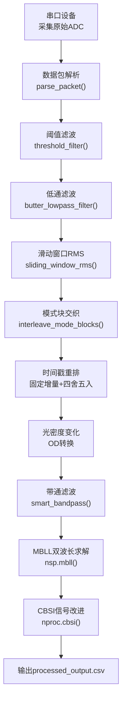
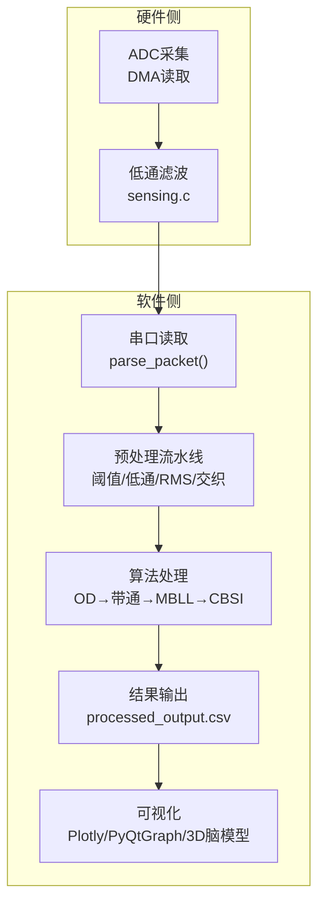
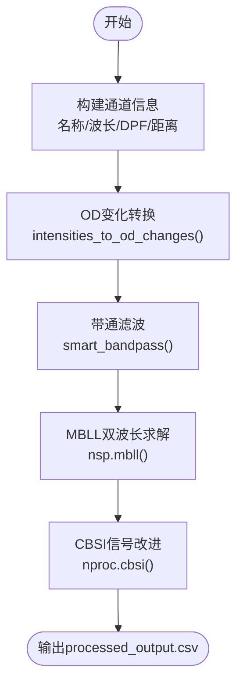
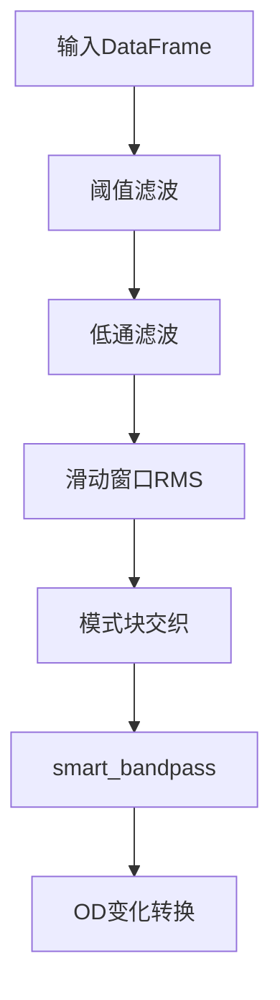
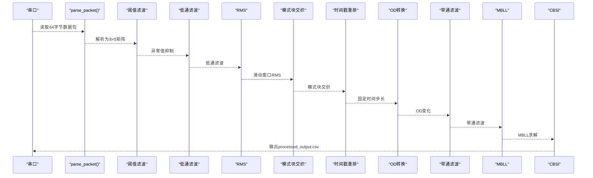
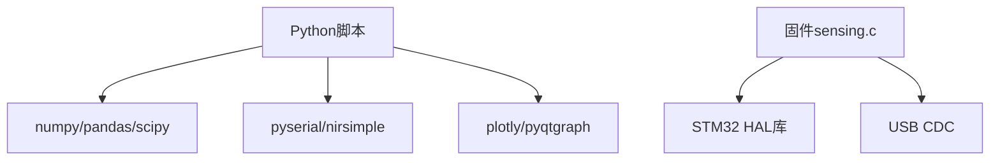

# 数据处理

<cite>
**本文引用的文件**
- [fNIRS_processing.py](file://software/fNIRS_processing.py)
- [config.py](file://software/config.py)
- [requirements.txt](file://software/requirements.txt)
- [README.md](file://software/README.md)
- [sensing.c](file://firmware/STM32/fNIRS/Core/Src/sensing.c)
- [fNIRS_processing_csv.py](file://software/testing-scripts/fNIRS_processing_csv.py)
- [plot_mbll.py](file://software/testing-scripts/plot_mbll.py)
- [plot.py](file://software/testing-scripts/plot.py)
- [all_groups.csv](file://software/sample_data/all_groups.csv)
- [interleaved_output.csv](file://software/sample_data/interleaved_output.csv)
- [processed_output.csv](file://software/sample_data/processed_output.csv)
</cite>

## 目录
1. [简介](#简介)
2. [项目结构](#项目结构)
3. [核心组件](#核心组件)
4. [架构总览](#架构总览)
5. [详细组件分析](#详细组件分析)
6. [依赖分析](#依赖分析)
7. [性能考虑](#性能考虑)
8. [故障排查指南](#故障排查指南)
9. [结论](#结论)
10. [附录](#附录)

## 简介
本技术文档面向fNIRS数据处理系统，聚焦于从原始ADC数据到血红蛋白浓度变化的完整处理链路，重点阐释修正Beer-Lambert定律（MBLL）的数学原理与实现细节，并系统化地记录信号滤波、统计分析与数据质量控制机制。文档还涵盖多通道数据同步、时间对齐与空间映射的技术实现，给出数据格式规范、处理参数配置与结果验证方法，并提供数据处理脚本的使用指南与可扩展建议，帮助研究人员与数据分析师高效、可靠地完成fNIRS数据分析。

## 项目结构
软件侧主要由以下模块构成：
- 数据采集与预处理：串口读取、数据包解析、阈值滤波、低通滤波、滑动窗口RMS、模式块交织、时间戳重排
- 算法处理：光密度变化转换、带通滤波、MBLL双波长求解、CBSI信号改进
- 结果输出：生成processed_output.csv，包含每通道的Δ[HbO]与Δ[HbR]
- 可视化与演示：静态Plotly图、PyQtGraph动画、3D脑模型映射
- 硬件侧：ADC采集、低通滤波与DMA读取

**图表来源**
- [fNIRS_processing.py:160-186](file://software/fNIRS_processing.py#L160-L186)
- [fNIRS_processing.py:51-66](file://software/fNIRS_processing.py#L51-L66)
- [fNIRS_processing.py:68-82](file://software/fNIRS_processing.py#L68-L82)
- [fNIRS_processing.py:84-126](file://software/fNIRS_processing.py#L84-L126)
- [fNIRS_processing.py:236-277](file://software/fNIRS_processing.py#L236-L277)
- [fNIRS_processing.py:397-418](file://software/fNIRS_processing.py#L397-L418)

**章节来源**
- [README.md:1-180](file://software/README.md#L1-L180)
- [fNIRS_processing.py:1-496](file://software/fNIRS_processing.py#L1-L496)

## 核心组件
- 串口与数据采集
  - 使用串口读取64字节数据包，解析为8×5的传感器矩阵，包含组ID、短/长通道测量值与发射器状态
- 预处理与滤波
  - 阈值抑制异常值；低通滤波抑制高频噪声；滑动窗口RMS计算各段有效幅值
- 同步与时间对齐
  - 基于发射器状态的模式块划分与交织，确保660nm与940nm配对；随后重排时间戳为固定增量
- 算法处理
  - OD变化转换、带通滤波（smart_bandpass）、MBLL双波长求解、CBSI信号改进
- 输出与验证
  - 生成processed_output.csv，列名为“通道_类型”，类型为hbo或hbr；打印最终时刻示例表格进行人工核验

**章节来源**
- [fNIRS_processing.py:160-186](file://software/fNIRS_processing.py#L160-L186)
- [fNIRS_processing.py:51-66](file://software/fNIRS_processing.py#L51-L66)
- [fNIRS_processing.py:68-82](file://software/fNIRS_processing.py#L68-L82)
- [fNIRS_processing.py:84-126](file://software/fNIRS_processing.py#L84-L126)
- [fNIRS_processing.py:236-277](file://software/fNIRS_processing.py#L236-L277)
- [fNIRS_processing.py:339-443](file://software/fNIRS_processing.py#L339-L443)

## 架构总览
系统采用“采集-预处理-算法-可视化”的分层架构。硬件侧通过ADC与DMA采集原始信号，软件侧通过串口接收数据包，经解析与预处理后进入算法模块，最终输出CSV并供可视化模块使用。

**图表来源**
- [sensing.c:45-84](file://firmware/STM32/fNIRS/Core/Src/sensing.c#L45-L84)
- [fNIRS_processing.py:160-186](file://software/fNIRS_processing.py#L160-L186)
- [fNIRS_processing.py:51-126](file://software/fNIRS_processing.py#L51-L126)
- [fNIRS_processing.py:339-443](file://software/fNIRS_processing.py#L339-L443)

## 详细组件分析

### Modified Beer-Lambert Law（MBLL）算法
- 数学原理
  - 光密度定义：OD = -log(I/I₀)，其中I为测量光强，I₀为参考光强
  - 扩展形式：OD = ε·c·d·DPF，其中ε为摩尔消光系数，c为发色团浓度，d为源-探测器距离，DPF为差分路径因子
  - 双波长模型：针对HbO与HbR在两个波长下的吸收差异，建立线性方程组求解Δ[HbO]与Δ[HbR]
- 实现要点
  - 输入：OD变化矩阵（通道×时间，48×N）
  - 输出：Δ[HbO]与Δ[HbR]矩阵，通道命名保持一致
  - 参数：波长、DPF、距离、摩尔消光系数表（如wray）
- 信号改进（CBSI）
  - 利用HbO与HbR信号的相关性特征，识别并抑制非生理伪影，提升信噪比

**图表来源**
- [fNIRS_processing.py:395-418](file://software/fNIRS_processing.py#L395-L418)

**章节来源**
- [fNIRS_processing.py:395-418](file://software/fNIRS_processing.py#L395-L418)

### 信号滤波与统计分析
- 阈值滤波
  - 对每个通道独立判断是否超出范围，超出则替换为零电平，避免异常脉冲影响后续处理
- 低通滤波
  - 设计巴特沃斯低通滤波器，截止频率1.0 Hz，使用零相位滤波保证相位失真最小
- 滑动窗口RMS
  - 按发射器状态变化分割数据段，对每段计算RMS，消除直流分量可选
- 带通滤波（smart_bandpass）
  - 自适应降采样→设计SOS带通滤波→零相位滤波→必要时升采样恢复采样率

**图表来源**
- [fNIRS_processing.py:51-66](file://software/fNIRS_processing.py#L51-L66)
- [fNIRS_processing.py:68-82](file://software/fNIRS_processing.py#L68-L82)
- [fNIRS_processing.py:84-126](file://software/fNIRS_processing.py#L84-L126)
- [fNIRS_processing.py:137-159](file://software/fNIRS_processing.py#L137-L159)

**章节来源**
- [fNIRS_processing.py:51-126](file://software/fNIRS_processing.py#L51-L126)
- [fNIRS_processing.py:137-159](file://software/fNIRS_processing.py#L137-L159)

### 多通道数据同步、时间对齐与空间映射
- 同步与对齐
  - 模式块交织：根据发射器状态（1或2）分组，成对交织不同模式的块，确保660nm与940nm一一对应
  - 时间戳重排：固定增量（例如0.001 s）重建时间轴，四舍五入避免浮点误差
- 空间映射
  - 通道命名规则：Ss_Dd，其中s为传感器组（1–8），d为探测器（1–3）
  - 距离与DPF：短通道使用短距离，长通道使用长距离，DPF基于受试者年龄查表
  - 3D脑模型：通过3D网格与传感器节点映射，直观展示激活区域

**图表来源**
- [fNIRS_processing.py:160-186](file://software/fNIRS_processing.py#L160-L186)
- [fNIRS_processing.py:51-126](file://software/fNIRS_processing.py#L51-L126)
- [fNIRS_processing.py:236-277](file://software/fNIRS_processing.py#L236-L277)
- [fNIRS_processing.py:397-418](file://software/fNIRS_processing.py#L397-L418)

**章节来源**
- [fNIRS_processing.py:236-277](file://software/fNIRS_processing.py#L236-L277)
- [fNIRS_processing.py:279-303](file://software/fNIRS_processing.py#L279-L303)

### 数据格式规范
- 原始CSV（all_groups.csv）
  - 列：Time（秒）、G0_Short/G0_Long1/G0_Long2/G0_Emitter、…、G7_Short/G7_Long1/G7_Long2/G7_Emitter
- 交织输出（interleaved_output.csv）
  - 格式同上，行已按模式交织排列
- 处理后输出（processed_output.csv）
  - 列：Time、Ss_Dd_hbo、Ss_Dd_hbr（共48通道×2类型）

**章节来源**
- [fNIRS_processing.py:340-365](file://software/fNIRS_processing.py#L340-L365)
- [fNIRS_processing.py:446-443](file://software/fNIRS_processing.py#L446-L443)

### 处理参数配置
- 年龄（age）：用于计算DPF
- 短/长通道距离（sd_short/sd_long）：短距离与长距离
- 摩尔消光系数表（molar_ext_coeff_table）：默认wray
- 带通滤波参数（bp_low/bp_high/bp_order）：低/高频截止与滤波器阶数
- 采样率估计：基于时间戳差值的均值

**章节来源**
- [fNIRS_processing.py:339-349](file://software/fNIRS_processing.py#L339-L349)
- [fNIRS_processing.py:458-462](file://software/fNIRS_processing.py#L458-L462)

### 结果验证方法
- 最终时刻浓度表：打印最后一时刻各通道Δ[HbO]/Δ[HbR]，便于快速核验
- 可视化验证：Plotly静态图与PyQtGraph动画展示ΔHbO/ΔHbR曲线
- 示例脚本：plot_mbll.py与plot.py分别用于静态绘图与实时动画

**章节来源**
- [fNIRS_processing.py:436-443](file://software/fNIRS_processing.py#L436-L443)
- [plot_mbll.py:1-113](file://software/testing-scripts/plot_mbll.py#L1-L113)
- [plot.py:1-105](file://software/testing-scripts/plot.py#L1-L105)

### 数据处理脚本使用指南
- 运行环境
  - 创建虚拟环境并安装依赖
- 串口配置
  - 在config.py中设置正确的串口号、波特率与超时
- 采集与处理
  - 运行主脚本，按提示停止采集；自动执行预处理与MBLL/CBSI处理
- 结果导出
  - 生成interleaved_output.csv与processed_output.csv，可在可视化脚本中加载

**章节来源**
- [README.md:50-126](file://software/README.md#L50-L126)
- [config.py:7-12](file://software/config.py#L7-L12)
- [fNIRS_processing.py:446-496](file://software/fNIRS_processing.py#L446-L496)

### 自定义扩展方法
- 算法扩展
  - 在process_csv_dataset中插入新的预处理或后处理步骤（如其他统计指标、时频分析）
- 参数调优
  - 调整带通滤波参数、阈值范围、RMS段长与是否去直流
- 硬件接口
  - 修改sensing.c中的低通滤波系数或DMA读取策略，以适配不同硬件平台

**章节来源**
- [fNIRS_processing.py:339-443](file://software/fNIRS_processing.py#L339-L443)
- [sensing.c:10-10](file://firmware/STM32/fNIRS/Core/Src/sensing.c#L10-L10)

## 依赖分析
- Python依赖
  - numpy、pandas、scipy、matplotlib、plotly、PyQt5、pyserial、nirsimple等
- 硬件依赖
  - STM32系列MCU、ADC、USB CDC接口、传感器模块与探测器

**图表来源**
- [requirements.txt:1-15](file://software/requirements.txt#L1-L15)
- [sensing.c:1-86](file://firmware/STM32/fNIRS/Core/Src/sensing.c#L1-L86)

**章节来源**
- [requirements.txt:1-15](file://software/requirements.txt#L1-L15)

## 性能考虑
- 采样率与滤波稳定性
  - 采样率估计需稳定，带通滤波前的降采样与升采样应谨慎，避免引入混叠与相位偏差
- 计算复杂度
  - OD转换与MBLL均为矩阵运算，注意内存占用与批处理大小
- 实时性
  - 若用于实时监控，建议在GUI线程外进行耗时计算，或采用异步/多线程

## 故障排查指南
- 串口无法打开
  - 检查端口路径与权限，确认设备连接正常
- 数据异常
  - 查看阈值滤波是否过度抑制；检查低通滤波参数是否合适
- 时间戳不连续
  - 确认模式块交织逻辑与时间戳重排顺序
- 处理结果异常
  - 核对带通滤波参数与OD转换；检查通道命名与距离设置

**章节来源**
- [config.py:7-12](file://software/config.py#L7-L12)
- [fNIRS_processing.py:51-126](file://software/fNIRS_processing.py#L51-L126)
- [fNIRS_processing.py:236-277](file://software/fNIRS_processing.py#L236-L277)

## 结论
本系统提供了从原始ADC到血红蛋白浓度变化的完整处理链路，结合MBLL双波长求解与CBSI信号改进，能够有效提升fNIRS信号质量。通过严格的滤波与同步策略、清晰的数据格式与参数配置，以及丰富的可视化与验证手段，系统既适合科研分析也便于工程部署。建议在实际应用中根据被试特征与实验任务进一步优化参数，并持续关注硬件与算法的迭代升级。

## 附录
- 示例数据
  - all_groups.csv、interleaved_output.csv、processed_output.csv
- 可视化脚本
  - plot_mbll.py、plot.py
- 算法文档
  - fNIRS_processing_文档.md（中文版）

**章节来源**
- [all_groups.csv:1-4](file://software/sample_data/all_groups.csv#L1-L4)
- [interleaved_output.csv:1-4](file://software/sample_data/interleaved_output.csv#L1-L4)
- [processed_output.csv:1-4](file://software/sample_data/processed_output.csv#L1-L4)
- [plot_mbll.py:1-113](file://software/testing-scripts/plot_mbll.py#L1-L113)
- [plot.py:1-105](file://software/testing-scripts/plot.py#L1-L105)
- [fNIRS_processing_文档.md:1-506](file://software/fNIRS_processing_文档.md#L1-L506)