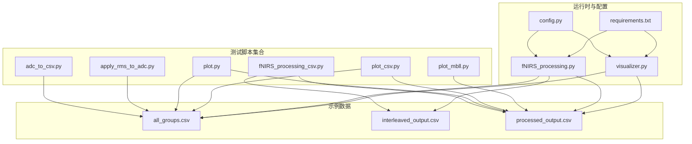
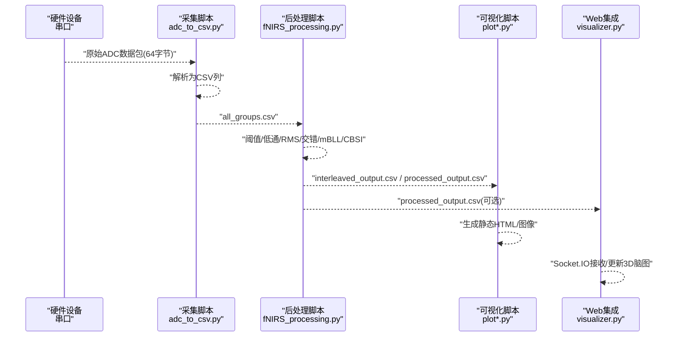
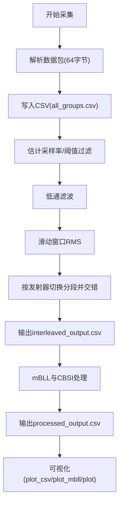
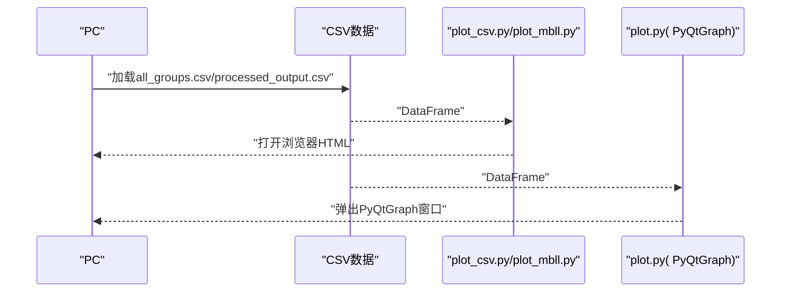
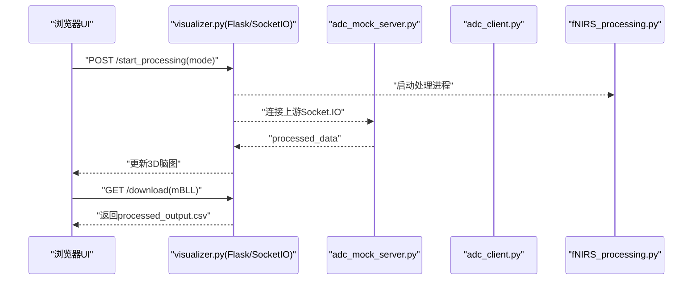
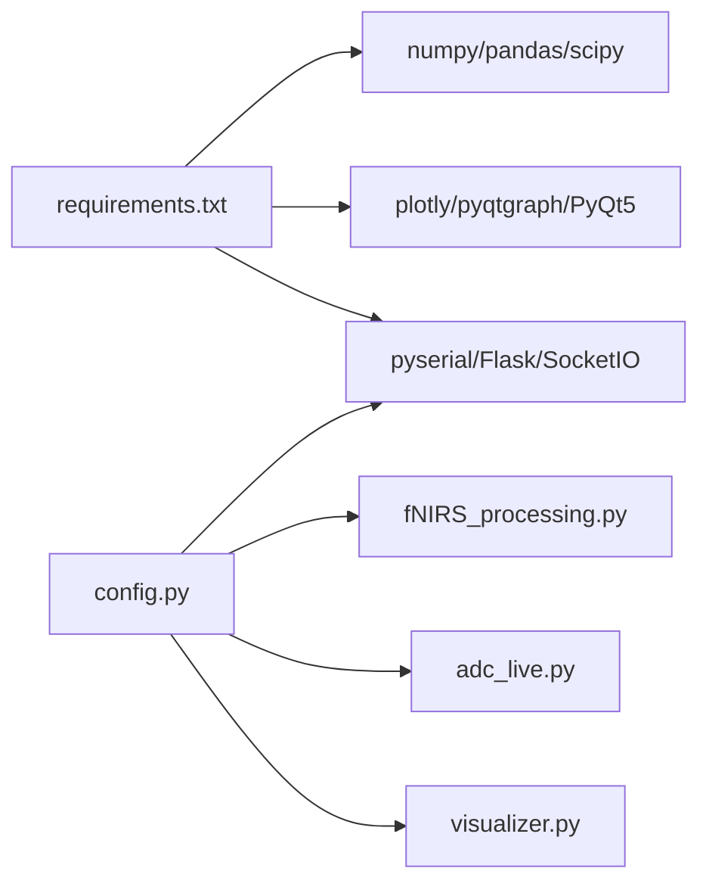

# 测试与验证

<cite>
**本文引用的文件**   
- [软件/README.md](file://software/README.md)
- [软件/requirements.txt](file://software/requirements.txt)
- [软件/config.py](file://software/config.py)
- [软件/fNIRS_processing.py](file://software/fNIRS_processing.py)
- [软件/visualizer.py](file://software/visualizer.py)
- [软件/testing-scripts/adc_to_csv.py](file://software/testing-scripts/adc_to_csv.py)
- [软件/testing-scripts/fNIRS_processing_csv.py](file://software/testing-scripts/fNIRS_processing_csv.py)
- [软件/testing-scripts/apply_rms_to_adc.py](file://software/testing-scripts/apply_rms_to_adc.py)
- [软件/testing-scripts/plot.py](file://software/testing-scripts/plot.py)
- [软件/testing-scripts/plot_csv.py](file://software/testing-scripts/plot_csv.py)
- [软件/testing-scripts/plot_mbll.py](file://software/testing-scripts/plot_mbll.py)
- [软件/adc_live.py](file://software/adc_live.py)
- [软件/adc_mock_server.py](file://software/adc_mock_server.py)
- [软件/sample_data/all_groups.csv](file://software/sample_data/all_groups.csv)
- [软件/sample_data/interleaved_output.csv](file://software/sample_data/interleaved_output.csv)
- [软件/sample_data/processed_output.csv](file://software/sample_data/processed_output.csv)
</cite>

## 目录
1. [引言](#引言)
2. [项目结构](#项目结构)
3. [核心组件](#核心组件)
4. [架构总览](#架构总览)
5. [详细组件分析](#详细组件分析)
6. [依赖分析](#依赖分析)
7. [性能考虑](#性能考虑)
8. [故障排查指南](#故障排查指南)
9. [结论](#结论)
10. [附录](#附录)

## 引言
本文件面向fNIRS系统的测试与验证，围绕数据采集、预处理、可视化与后处理的全流程，系统化梳理测试脚本集合的功能与使用方法，明确示例数据集格式规范、处理结果验证与质量评估方法，并给出自动化测试脚本的使用指南与自定义测试用例编写建议。文档同时覆盖性能测试、兼容性测试与稳定性验证的实施方案，帮助开发者与测试人员建立完善的质量保证体系。

## 项目结构
软件层包含以下与测试验证直接相关的模块与脚本：
- 数据采集与预处理：fNIRS_processing.py、adc_to_csv.py、apply_rms_to_adc.py
- 可视化：plot.py、plot_csv.py、plot_mbll.py、adc_live.py、adc_mock_server.py
- Web集成与控制：visualizer.py、config.py、requirements.txt
- 示例数据：sample_data/*.csv（all_groups.csv、interleaved_output.csv、processed_output.csv）
- 文档与说明：software/README.md

**图表来源**
- [软件/testing-scripts/adc_to_csv.py:1-67](file://software/testing-scripts/adc_to_csv.py#L1-L67)
- [软件/testing-scripts/apply_rms_to_adc.py:1-77](file://software/testing-scripts/apply_rms_to_adc.py#L1-L77)
- [软件/testing-scripts/fNIRS_processing_csv.py:1-497](file://software/testing-scripts/fNIRS_processing_csv.py#L1-L497)
- [软件/testing-scripts/plot.py:1-105](file://software/testing-scripts/plot.py#L1-L105)
- [software/testing-scripts/plot_csv.py:1-192](file://software/testing-scripts/plot_csv.py#L1-L192)
- [software/testing-scripts/plot_mbll.py:1-113](file://software/testing-scripts/plot_mbll.py#L1-L113)
- [software/fNIRS_processing.py:1-496](file://software/fNIRS_processing.py#L1-L496)
- [software/visualizer.py:1-949](file://software/visualizer.py#L1-L949)
- [software/config.py:1-13](file://software/config.py#L1-L13)
- [software/requirements.txt:1-15](file://software/requirements.txt#L1-L15)
- [software/sample_data/all_groups.csv:1-4](file://software/sample_data/all_groups.csv#L1-L4)
- [software/sample_data/interleaved_output.csv:1-4](file://software/sample_data/interleaved_output.csv#L1-L4)
- [software/sample_data/processed_output.csv:1-4](file://software/sample_data/processed_output.csv#L1-L4)

**章节来源**
- [软件/README.md:1-180](file://software/README.md#L1-L180)

## 核心组件
- 数据采集与解析
  - 串口数据包解析与CSV写入：adc_to_csv.py、fNIRS_processing.py
  - 采样率估计与阈值/低通滤波：fNIRS_processing.py
  - 滑动窗口RMS与模式块交错：fNIRS_processing.py、apply_rms_to_adc.py
- 后处理与质量评估
  - mBLL与CBSI处理、带通滤波与输出CSV：fNIRS_processing.py、fNIRS_processing_csv.py
  - 结果验证与统计展示：fNIRS_processing.py、fNIRS_processing_csv.py
- 可视化
  - 实时ADC动画：adc_live.py
  - 静态Plotly图：plot_csv.py、plot_mbll.py
  - PyQtGraph对比图：plot.py
- Web与演示
  - Flask/Socket.IO集成：visualizer.py
  - 模拟数据服务：adc_mock_server.py
  - 配置与依赖：config.py、requirements.txt
- 示例数据
  - 原始ADC：all_groups.csv
  - 交错后中间产物：interleaved_output.csv
  - 处理后产物：processed_output.csv

**章节来源**
- [软件/fNIRS_processing.py:1-496](file://software/fNIRS_processing.py#L1-L496)
- [软件/testing-scripts/fNIRS_processing_csv.py:1-497](file://software/testing-scripts/fNIRS_processing_csv.py#L1-L497)
- [软件/testing-scripts/apply_rms_to_adc.py:1-77](file://software/testing-scripts/apply_rms_to_adc.py#L1-L77)
- [软件/testing-scripts/plot.py:1-105](file://software/testing-scripts/plot.py#L1-L105)
- [software/testing-scripts/plot_csv.py:1-192](file://software/testing-scripts/plot_csv.py#L1-L192)
- [software/testing-scripts/plot_mbll.py:1-113](file://software/testing-scripts/plot_mbll.py#L1-L113)
- [software/adc_live.py:1-210](file://software/adc_live.py#L1-L210)
- [software/adc_mock_server.py:1-65](file://software/adc_mock_server.py#L1-L65)
- [software/visualizer.py:1-949](file://software/visualizer.py#L1-L949)
- [software/config.py:1-13](file://software/config.py#L1-L13)
- [software/requirements.txt:1-15](file://software/requirements.txt#L1-L15)
- [software/sample_data/all_groups.csv:1-4](file://software/sample_data/all_groups.csv#L1-L4)
- [software/sample_data/interleaved_output.csv:1-4](file://software/sample_data/interleaved_output.csv#L1-L4)
- [software/sample_data/processed_output.csv:1-4](file://software/sample_data/processed_output.csv#L1-L4)

## 架构总览
下图展示了从硬件串口到Web界面与本地脚本的端到端测试路径，以及各组件之间的数据流与控制流。

**图表来源**
- [software/testing-scripts/adc_to_csv.py:1-67](file://software/testing-scripts/adc_to_csv.py#L1-L67)
- [software/fNIRS_processing.py:1-496](file://software/fNIRS_processing.py#L1-L496)
- [software/testing-scripts/plot_csv.py:1-192](file://software/testing-scripts/plot_csv.py#L1-L192)
- [software/testing-scripts/plot_mbll.py:1-113](file://software/testing-scripts/plot_mbll.py#L1-L113)
- [software/testing-scripts/plot.py:1-105](file://software/testing-scripts/plot.py#L1-L105)
- [software/visualizer.py:1-949](file://software/visualizer.py#L1-L949)

## 详细组件分析

### 数据采集与预处理测试
- 功能要点
  - 串口读取与数据包解析（每包64字节，含8组传感器数据）
  - 写入CSV格式（时间戳+各组短/长通道+发射器状态）
  - 采样率估计、阈值抑制、低通滤波、滑动窗口RMS、按发射器切换分段、模式块交错
- 使用方法
  - 连接设备后运行adc_to_csv.py生成all_groups.csv
  - apply_rms_to_adc.py对all_groups.csv进行RMS处理，输出all_groups_rms.csv
  - fNIRS_processing.py完成后续处理链路，生成interleaved_output.csv与processed_output.csv
- 质量评估
  - 检查时间戳连续性与采样率一致性
  - 对比RMS前后的信号幅度变化，确认分段逻辑正确
  - 校验交错后相邻行的发射器模式交替

**图表来源**
- [software/testing-scripts/adc_to_csv.py:1-67](file://software/testing-scripts/adc_to_csv.py#L1-L67)
- [software/testing-scripts/apply_rms_to_adc.py:1-77](file://software/testing-scripts/apply_rms_to_adc.py#L1-L77)
- [software/fNIRS_processing.py:1-496](file://software/fNIRS_processing.py#L1-L496)
- [software/testing-scripts/plot_csv.py:1-192](file://software/testing-scripts/plot_csv.py#L1-L192)
- [software/testing-scripts/plot_mbll.py:1-113](file://software/testing-scripts/plot_mbll.py#L1-L113)
- [software/testing-scripts/plot.py:1-105](file://software/testing-scripts/plot.py#L1-L105)

**章节来源**
- [software/testing-scripts/adc_to_csv.py:1-67](file://software/testing-scripts/adc_to_csv.py#L1-L67)
- [software/testing-scripts/apply_rms_to_adc.py:1-77](file://software/testing-scripts/apply_rms_to_adc.py#L1-L77)
- [software/fNIRS_processing.py:1-496](file://software/fNIRS_processing.py#L1-L496)

### 可视化功能测试
- 静态可视化
  - plot_csv.py：生成每个组的ADC静态图；plot_mbll.py：生成每个组的mBLL曲线图
  - plot.py：PyQtGraph对比显示原始ADC与处理后ΔHbO/ΔHbR
- 实时可视化
  - adc_live.py：实时显示ADC读数
  - adc_mock_server.py：模拟数据用于演示与无硬件环境测试
- 验证标准
  - 确认每组8个子图完整显示
  - 确认颜色、图例、坐标轴标签一致
  - 确认事件区间标注与垂直线位置符合预期

**图表来源**
- [software/testing-scripts/plot_csv.py:1-192](file://software/testing-scripts/plot_csv.py#L1-L192)
- [software/testing-scripts/plot_mbll.py:1-113](file://software/testing-scripts/plot_mbll.py#L1-L113)
- [software/testing-scripts/plot.py:1-105](file://software/testing-scripts/plot.py#L1-L105)

**章节来源**
- [software/testing-scripts/plot_csv.py:1-192](file://software/testing-scripts/plot_csv.py#L1-L192)
- [software/testing-scripts/plot_mbll.py:1-113](file://software/testing-scripts/plot_mbll.py#L1-L113)
- [software/testing-scripts/plot.py:1-105](file://software/testing-scripts/plot.py#L1-L105)

### Web与演示测试
- visualizer.py
  - 提供模式选择（实时ADC/记录并可视化）、下载CSV、3D脑图高亮、Socket.IO接收处理后数据
  - 支持demo模式，跳过真实串口，使用adc_mock_server.py与adc_client.py
- 验证标准
  - 正确响应模式切换请求，启动/停止子进程
  - 下载CSV按钮返回正确的文件名与内容
  - 3D脑图在收到负值时高亮对应区域

**图表来源**
- [software/visualizer.py:1-949](file://software/visualizer.py#L1-L949)
- [software/adc_mock_server.py:1-65](file://software/adc_mock_server.py#L1-L65)

**章节来源**
- [software/visualizer.py:1-949](file://software/visualizer.py#L1-L949)
- [software/adc_mock_server.py:1-65](file://software/adc_mock_server.py#L1-L65)

## 依赖分析
- Python依赖通过requirements.txt统一管理，涵盖数据处理（numpy、pandas、scipy）、可视化（plotly、pyqtgraph、PyQt5）、通信（pyserial、Flask、Flask-SocketIO、python-socketio）等
- 配置文件config.py集中管理串口参数，便于跨平台与不同硬件适配

**图表来源**
- [software/requirements.txt:1-15](file://software/requirements.txt#L1-L15)
- [software/config.py:1-13](file://software/config.py#L1-L13)
- [software/fNIRS_processing.py:1-496](file://software/fNIRS_processing.py#L1-L496)
- [software/adc_live.py:1-210](file://software/adc_live.py#L1-L210)
- [software/visualizer.py:1-949](file://software/visualizer.py#L1-L949)

**章节来源**
- [software/requirements.txt:1-15](file://software/requirements.txt#L1-L15)
- [software/config.py:1-13](file://software/config.py#L1-L13)

## 性能考虑
- 采样率与缓冲
  - 采样率由时间戳差值得到，建议在采集阶段确保稳定的波特率与超时设置
  - 阈值与低通滤波参数需结合实际噪声水平调整，避免过度平滑导致信号失真
- 计算复杂度
  - RMS与滤波操作按分段执行，注意分段长度与重叠策略以平衡实时性与稳健性
  - mBLL与CBSI处理矩阵维度为48通道，建议在批处理时利用向量化运算
- 可视化性能
  - Plotly静态图适合离线分析；PyQtGraph适合实时滚动显示
  - Web端3D脑图仅在收到新数据包时更新，避免频繁重绘

[本节为通用指导，无需特定文件引用]

## 故障排查指南
- 串口连接问题
  - 确认config.py中的SERIAL_PORT与实际设备一致；Windows使用Get-WMIObject查找COM端口，macOS/Linux使用ls /dev/tty.*
  - 若出现“无有效数据”，检查波特率与超时设置，必要时降低TIMEOUT或提高BAUD_RATE
- 数据异常
  - 若RMS处理后幅度异常，检查是否正确移除了直流分量与分段逻辑
  - 若交错后模式不交替，检查发射器状态列是否正确识别切换点
- 可视化问题
  - plot_csv/plot_mbll无法打开浏览器：确认临时文件写入权限与网络访问
  - PyQtGraph窗口无响应：检查事件循环与主线程阻塞
- Web与Socket.IO
  - demo模式下未显示处理结果：确认已启动adc_mock_server.py与adc_client.py
  - 下载CSV为空：确认处理脚本已成功生成目标文件

**章节来源**
- [software/config.py:1-13](file://software/config.py#L1-L13)
- [software/README.md:50-126](file://software/README.md#L50-L126)
- [software/testing-scripts/plot_csv.py:178-192](file://software/testing-scripts/plot_csv.py#L178-L192)
- [software/visualizer.py:648-735](file://software/visualizer.py#L648-L735)

## 结论
本文档系统化梳理了fNIRS系统的测试与验证方法，覆盖数据采集、预处理、可视化与Web集成的全链路。通过示例数据集与测试脚本，可实现从原始ADC到处理后产物的端到端验证，并提供性能、兼容性与稳定性测试的实施建议。建议在持续集成中引入自动化脚本，结合日志与断言，形成可重复的质量保证流程。

[本节为总结性内容，无需特定文件引用]

## 附录

### 示例数据集格式规范
- all_groups.csv
  - 列：Time (s) + G0_Short/G0_Long1/G0_Long2/G0_Emitter + … + G7_Short/G7_Long1/G7_Long2/G7_Emitter
  - 用途：原始ADC采集结果，用于后续RMS、交错与mBLL处理
- interleaved_output.csv
  - 列：Time (s) + 各通道RMS值（经阈值/低通/RMS/交错）
  - 用途：中间处理产物，作为mBLL输入
- processed_output.csv
  - 列：Time + 每个通道的hbo与hbr浓度变化
  - 用途：最终处理结果，支持可视化与导出

**章节来源**
- [software/sample_data/all_groups.csv:1-4](file://software/sample_data/all_groups.csv#L1-L4)
- [software/sample_data/interleaved_output.csv:1-4](file://software/sample_data/interleaved_output.csv#L1-L4)
- [software/sample_data/processed_output.csv:1-4](file://software/sample_data/processed_output.csv#L1-L4)
- [software/README.md:173-180](file://software/README.md#L173-L180)

### 自动化测试脚本使用指南
- 快速验证流程
  - 运行adc_to_csv.py采集原始数据至all_groups.csv
  - 运行apply_rms_to_adc.py生成all_groups_rms.csv
  - 运行fNIRS_processing.py生成interleaved_output.csv与processed_output.csv
  - 使用plot_csv.py/plot_mbll.py/plot.py查看结果
- Demo模式
  - 在visualizer.py中传入demo参数，自动启动adc_mock_server.py与adc_client.py，无需真实硬件
- 导出与复现
  - 通过visualizer.py的下载接口导出CSV，便于离线复现与回归测试

**章节来源**
- [software/README.md:88-126](file://software/README.md#L88-L126)
- [software/visualizer.py:648-735](file://software/visualizer.py#L648-L735)

### 自定义测试用例编写方法
- 数据质量断言
  - 时间戳连续性与采样率一致性
  - RMS前后幅度变化范围与分段边界
  - 交错后相邻行发射器模式交替
- 处理结果验证
  - mBLL输出通道命名与类型（hbo/hbr）一致性
  - CBSI改善信噪比的统计指标（如均值/方差变化）
- 可视化一致性
  - 颜色、图例、坐标轴标签与事件区间标注
- 性能与稳定性
  - 不同采样率下的内存占用与处理延迟
  - 长时运行的稳定性（串口读取、队列满/空处理）

[本节为通用指导，无需特定文件引用]