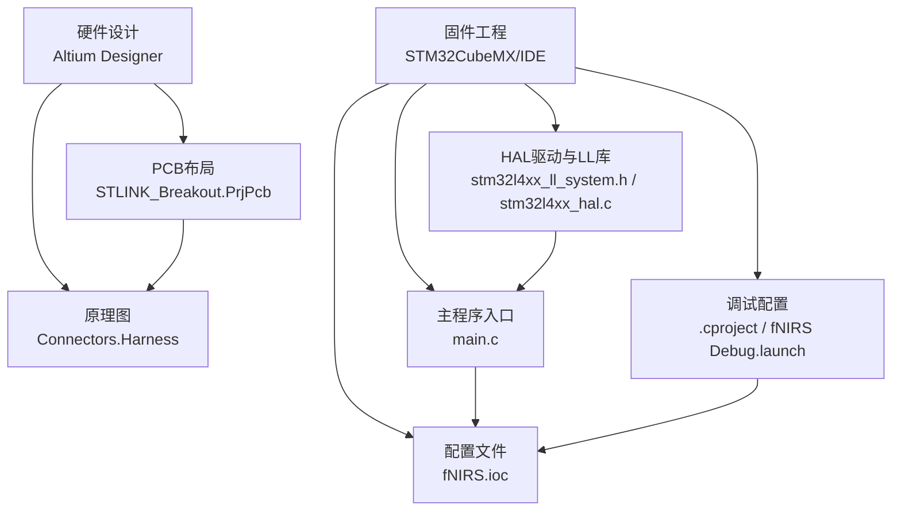
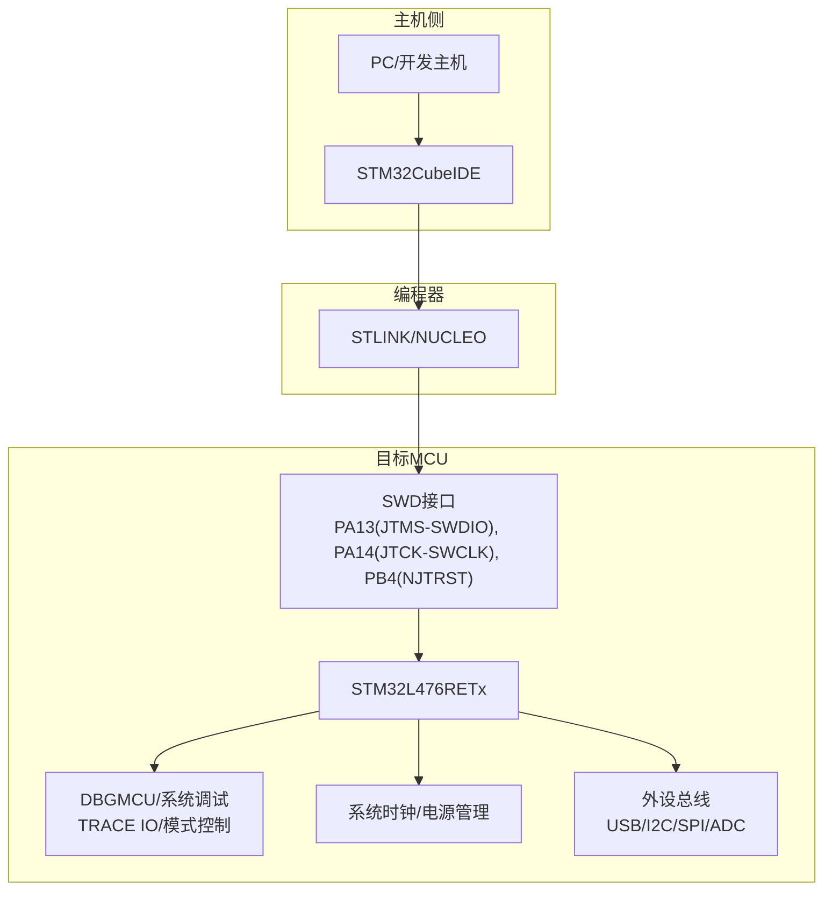
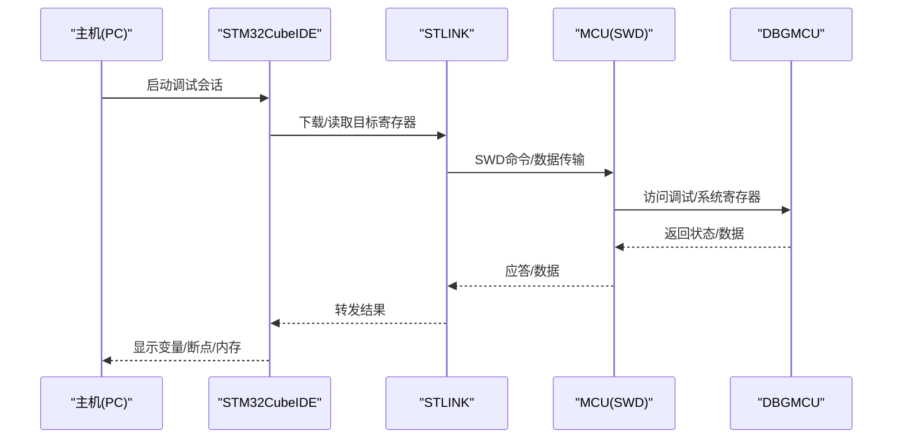
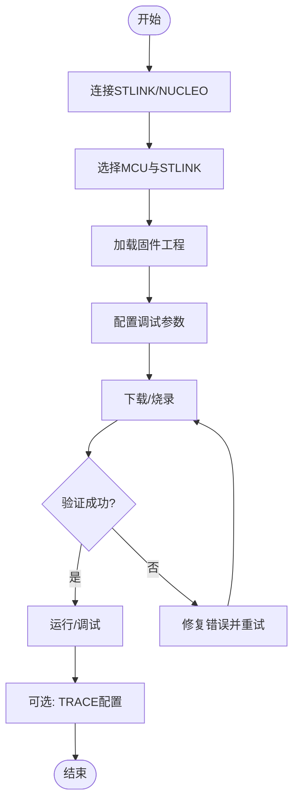
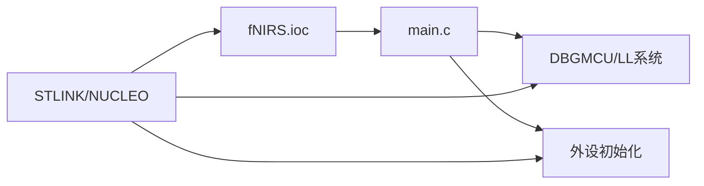

# STLINK编程接口设计

<cite>
**本文档引用的文件**
- [STLINK_Breakout.PrjPcb](file://hardware/STLINK_Breakout/STLINK_Breakout.PrjPcb)
- [fNIRS.ioc](file://firmware/STM32/fNIRS/fNIRS.ioc)
- [main.c](file://firmware/STM32/fNIRS/Core/Src/main.c)
- [.cproject](file://firmware/STM32/fNIRS/.cproject)
- [fNIRS Debug.launch](file://firmware/STM32/fNIRS/fNIRS Debug.launch)
- [stm32l4xx_ll_system.h](file://firmware/STM32/fNIRS/Drivers/STM32L4xx_HAL_Driver/Inc/stm32l4xx_ll_system.h)
- [stm32l4xx_hal.c](file://firmware/STM32/fNIRS/Drivers/STM32L4xx_HAL_Driver/Src/stm32l4xx_hal.c)
- [Connectors.Harness](file://hardware/fNIRS_ECU/Connectors.Harness)
- [USBInterface.Harness](file://hardware/fNIRS_ECU/USBInterface.Harness)
- [hardware/README.md](file://hardware/README.md)
</cite>

## 目录
1. [引言](#引言)
2. [项目结构](#项目结构)
3. [核心组件](#核心组件)
4. [架构总览](#架构总览)
5. [详细组件分析](#详细组件分析)
6. [依赖关系分析](#依赖关系分析)
7. [性能考虑](#性能考虑)
8. [故障诊断与维护](#故障诊断与维护)
9. [结论](#结论)
10. [附录](#附录)

## 引言
本文件面向嵌入式开发工程师，系统化阐述fNIRS项目中STLINK编程接口的设计与实现，覆盖电路设计（SWD调试接口）、电气特性与时序要求、兼容性考量、连接方式与编程/调试流程、保护电路与ESD防护、电源管理、测试方法与故障诊断等内容，并结合实际硬件与固件配置给出可操作的使用参考与设计指导。

## 项目结构
fNIRS项目采用软硬件分离的组织方式：硬件部分以Altium Designer设计，包含STLINK编程转接板（Breakout）；固件部分基于STM32CubeMX生成的工程，使用STM32L4系列MCU，通过STLINK进行下载与调试。

**图表来源**
- [hardware/README.md:1-19](file://hardware/README.md#L1-L19)
- [STLINK_Breakout.PrjPcb:1-120](file://hardware/STLINK_Breakout/STLINK_Breakout.PrjPcb#L1-L120)
- [fNIRS.ioc:1-335](file://firmware/STM32/fNIRS/fNIRS.ioc#L1-L335)
- [main.c:1-200](file://firmware/STM32/fNIRS/Core/Src/main.c#L1-L200)
- [.cproject:1-189](file://firmware/STM32/fNIRS/.cproject#L1-L189)
- [fNIRS Debug.launch:26-44](file://firmware/STM32/fNIRS/fNIRS Debug.launch#L26-L44)
- [stm32l4xx_ll_system.h:270-1141](file://firmware/STM32/fNIRS/Drivers/STM32L4xx_HAL_Driver/Inc/stm32l4xx_ll_system.h#L270-L1141)
- [stm32l4xx_hal.c:460-559](file://firmware/STM32/fNIRS/Drivers/STM32L4xx_HAL_Driver/Src/stm32l4xx_hal.c#L460-L559)

**章节来源**
- [hardware/README.md:1-19](file://hardware/README.md#L1-L19)
- [STLINK_Breakout.PrjPcb:1-120](file://hardware/STLINK_Breakout/STLINK_Breakout.PrjPcb#L1-L120)

## 核心组件
- STLINK编程转接板（STLINK_Breakout）
  - 提供标准SWD接口（SWCLK、SWDIO、NRST），便于使用STLINK或NUCLEO对目标MCU进行编程与调试。
  - 与ECU Harness中的DEBUG端口对应，确保引脚映射一致。
- STM32L4系列MCU（STM32L476RETx）
  - 配置为Serial Wire模式（SWD），引脚映射见fNIRS.ioc。
  - HAL/LL库支持调试模块控制（DBGMCU）与跟踪引脚分配。
- 调试与下载工具链
  - STM32CubeIDE调试配置（.cproject、fNIRS Debug.launch）启用STLINK并设置低功耗调试等参数。
- 接口与引脚定义
  - Connectors.Harness定义了DEBUG端口信号：SWDIO、SWCLK、UART_RX、UART_TX、NRST。
  - USB接口通过USBInterface.Harness在MCU侧与USB_OTG_FS相连。

**章节来源**
- [STLINK_Breakout.PrjPcb:1-120](file://hardware/STLINK_Breakout/STLINK_Breakout.PrjPcb#L1-L120)
- [fNIRS.ioc:92-146](file://firmware/STM32/fNIRS/fNIRS.ioc#L92-L146)
- [Connectors.Harness:1-3](file://hardware/fNIRS_ECU/Connectors.Harness#L1-L3)
- [USBInterface.Harness:1-2](file://hardware/fNIRS_ECU/USBInterface.Harness#L1-L2)
- [stm32l4xx_ll_system.h:270-1141](file://firmware/STM32/fNIRS/Drivers/STM32L4xx_HAL_Driver/Inc/stm32l4xx_ll_system.h#L270-L1141)
- [.cproject:1-189](file://firmware/STM32/fNIRS/.cproject#L1-L189)
- [fNIRS Debug.launch:26-44](file://firmware/STM32/fNIRS/fNIRS Debug.launch#L26-L44)

## 架构总览
下图展示STLINK编程接口在系统中的位置与交互关系：从Host PC经STLINK到MCU的SWD接口，再到MCU内部的调试/系统寄存器（DBGMCU、SYSCFG等），以及与USB、ADC、I2C、SPI等外设的关系。

**图表来源**
- [fNIRS.ioc:92-146](file://firmware/STM32/fNIRS/fNIRS.ioc#L92-L146)
- [stm32l4xx_ll_system.h:270-1141](file://firmware/STM32/fNIRS/Drivers/STM32L4xx_HAL_Driver/Inc/stm32l4xx_ll_system.h#L270-L1141)
- [main.c:1-200](file://firmware/STM32/fNIRS/Core/Src/main.c#L1-L200)

## 详细组件分析

### SWD调试接口电路与信号路由
- 引脚映射
  - SWDIO：PA13（JTMS-SWDIO），配置为Serial Wire模式。
  - SWCLK：PA14（JTCK-SWCLK），配置为Serial Wire模式。
  - NRST：PB4（NJTRST），作为复位信号。
  - TRACESWO：PB3（JTDO-TRACESWO）在当前配置中未用于SWD，但可用于跟踪数据输出（需DBGMCU TRACE配置）。
- 信号完整性与时序
  - SWD为两线串行接口，需注意阻抗匹配与走线长度平衡，避免串扰。
  - 上拉/下拉电阻建议遵循ST官方推荐值，确保信号电平稳定。
  - NRST应尽量短路径至MCU复位引脚，配合去耦电容。
- 调试模块控制
  - 可通过DBGMCU控制调试模块在Sleep/Stop/Standby模式下的行为，必要时保持调试可用性。

**图表来源**
- [fNIRS.ioc:92-146](file://firmware/STM32/fNIRS/fNIRS.ioc#L92-L146)
- [stm32l4xx_ll_system.h:270-1141](file://firmware/STM32/fNIRS/Drivers/STM32L4xx_HAL_Driver/Inc/stm32l4xx_ll_system.h#L270-L1141)
- [fNIRS Debug.launch:26-44](file://firmware/STM32/fNIRS/fNIRS Debug.launch#L26-L44)

**章节来源**
- [fNIRS.ioc:92-146](file://firmware/STM32/fNIRS/fNIRS.ioc#L92-L146)
- [Connectors.Harness:1-3](file://hardware/fNIRS_ECU/Connectors.Harness#L1-L3)
- [stm32l4xx_ll_system.h:270-1141](file://firmware/STM32/fNIRS/Drivers/STM32L4xx_HAL_Driver/Inc/stm32l4xx_ll_system.h#L270-L1141)

### 编程接口连接方式与兼容性
- 硬件连接
  - 使用20pin SWD接口（含SWCLK、SWDIO、NRST、GND、VCC）连接STLINK/NUCLEO与目标板。
  - DEBUG端口信号与ECU Harness一致，确保插拔一致性。
- 兼容性
  - 支持ST官方STLINK v2及ST-LINK/variants（如NUCLEO板载STLINK）。
  - 与STM32CubeIDE调试器兼容，工具链版本与设备选择正确即可识别。

**章节来源**
- [Connectors.Harness:1-3](file://hardware/fNIRS_ECU/Connectors.Harness#L1-L3)
- [STLINK_Breakout.PrjPcb:1-120](file://hardware/STLINK_Breakout/STLINK_Breakout.PrjPcb#L1-L120)
- [.cproject:1-189](file://firmware/STM32/fNIRS/.cproject#L1-L189)

### 编程流程与调试功能
- 编程流程（示例）
  1) 连接STLINK至目标板DEBUG接口。
  2) 在STM32CubeIDE中加载工程，选择正确的MCU型号与STLINK。
  3) 设置调试参数（如低功耗调试、验证下载等）。
  4) 点击“下载”执行Flash编程；点击“运行/暂停”进入调试。
- 调试功能
  - 断点、单步、变量监视、内存查看。
  - 基于DBGMCU的Sleep/Stop/Standby模式调试能力。
  - 可选TRACE数据输出（需配置TRACESWO与DBGMCU TRACE模式）。

**图表来源**
- [.cproject:1-189](file://firmware/STM32/fNIRS/.cproject#L1-L189)
- [fNIRS Debug.launch:26-44](file://firmware/STM32/fNIRS/fNIRS Debug.launch#L26-L44)

**章节来源**
- [.cproject:1-189](file://firmware/STM32/fNIRS/.cproject#L1-L189)
- [fNIRS Debug.launch:26-44](file://firmware/STM32/fNIRS/fNIRS Debug.launch#L26-L44)

### 电气特性与时序要求
- SWD电气特性
  - 逻辑高电平与低电平阈值需满足MCU输入要求；上拉/下拉策略依据器件手册。
  - SWDIO在空闲态应为高阻态，避免与外部电路冲突。
- 时序要求
  - SWD时钟频率通常由调试器设定，MCU端接收窗口严格；过高的频率会导致采样错误。
  - 复位信号NRST的时序需满足MCU复位脉宽与最小高/低电平时间。
- 调试模块与时钟
  - 调试时钟源与系统时钟关系需在调试配置中明确，确保SWV/TRACE时钟正确。

**章节来源**
- [fNIRS.ioc:92-146](file://firmware/STM32/fNIRS/fNIRS.ioc#L92-L146)
- [stm32l4xx_ll_system.h:270-1141](file://firmware/STM32/fNIRS/Drivers/STM32L4xx_HAL_Driver/Inc/stm32l4xx_ll_system.h#L270-L1141)

### 保护电路、ESD防护与电源管理
- ESD防护
  - 在SWD接口处增加TVS二极管或RC滤波，抑制静电放电。
  - NRST引脚串联小电阻，限制瞬态电流冲击。
- 电源管理
  - SWD接口供电建议与目标板VCC共地，避免地环路干扰。
  - 若目标板处于低功耗模式，可通过DBGMCU保持调试模块工作，或根据需求关闭以降低功耗。
- 调试模块控制
  - HAL/LL函数可启用/禁用Sleep/Stop/Standby模式下的调试，按需配置。

**章节来源**
- [stm32l4xx_hal.c:525-559](file://firmware/STM32/fNIRS/Drivers/STM32L4xx_HAL_Driver/Src/stm32l4xx_hal.c#L525-L559)
- [stm32l4xx_ll_system.h:1100-1141](file://firmware/STM32/fNIRS/Drivers/STM32L4xx_HAL_Driver/Inc/stm32l4xx_ll_system.h#L1100-L1141)

### 测试方法与验证
- 硬件测试
  - 使用示波器检查SWCLK与SWDIO波形质量，确认占空比与上升/下降时间。
  - 用万用表测量各引脚对地阻抗，排查短路/开路。
- 软件验证
  - 在STM32CubeIDE中执行“连接”、“读取ID/UID”等基本操作，验证链路连通性。
  - 执行简单断点/单步，确认调试器可正常控制MCU。
- 日志与诊断
  - 关注ST-LINK日志文件，定位通信异常原因（如协议错误、时钟不匹配）。

**章节来源**
- [fNIRS Debug.launch:37-44](file://firmware/STM32/fNIRS/fNIRS Debug.launch#L37-L44)

## 依赖关系分析
- 硬件依赖
  - STLINK_Breakout.PrjPcb定义了PCB层叠、网络与输出报告；Connectors.Harness明确了DEBUG端口信号。
- 固件依赖
  - fNIRS.ioc定义了MCU引脚分配（SWD、USB、I2C、SPI、ADC等）与外设配置。
  - main.c初始化系统时钟、外设与USB/CDC，为调试提供稳定的运行环境。
  - .cproject与fNIRS Debug.launch定义了编译、链接与调试参数，确保STLINK正确工作。

**图表来源**
- [fNIRS.ioc:92-146](file://firmware/STM32/fNIRS/fNIRS.ioc#L92-L146)
- [main.c:1-200](file://firmware/STM32/fNIRS/Core/Src/main.c#L1-L200)
- [stm32l4xx_ll_system.h:270-1141](file://firmware/STM32/fNIRS/Drivers/STM32L4xx_HAL_Driver/Inc/stm32l4xx_ll_system.h#L270-L1141)
- [.cproject:1-189](file://firmware/STM32/fNIRS/.cproject#L1-L189)
- [fNIRS Debug.launch:26-44](file://firmware/STM32/fNIRS/fNIRS Debug.launch#L26-L44)

**章节来源**
- [fNIRS.ioc:92-146](file://firmware/STM32/fNIRS/fNIRS.ioc#L92-L146)
- [main.c:1-200](file://firmware/STM32/fNIRS/Core/Src/main.c#L1-L200)
- [.cproject:1-189](file://firmware/STM32/fNIRS/.cproject#L1-L189)
- [fNIRS Debug.launch:26-44](file://firmware/STM32/fNIRS/fNIRS Debug.launch#L26-L44)

## 性能考虑
- 调试带宽与吞吐
  - SWD频率过高可能导致握手失败；建议从较低频率起步，逐步提升。
- 功耗与热管理
  - 调试期间保持MCU活跃，注意散热；长时间在线调试可考虑降低频率或启用低功耗模式。
- 数据传输效率
  - 对大块Flash擦写/编程，建议使用批量操作与DMA（若适用）以减少主机端等待时间。

## 故障诊断与维护
- 常见问题
  - “无法连接”：检查STLINK驱动、端口选择、目标板供电与接线；确认DEBUG端口与转接板一致。
  - “下载失败”：检查Verify选项、时钟配置、Flash保护位；尝试更换STLINK端口或升级固件。
  - “调试卡住”：复位MCU后重试；检查断点数量与位置，避免进入不可恢复状态。
- 维护建议
  - 定期清洁接口金手指，避免氧化导致接触不良。
  - 长期不使用时，建议断电并做好防静电包装。

**章节来源**
- [fNIRS Debug.launch:26-44](file://firmware/STM32/fNIRS/fNIRS Debug.launch#L26-L44)

## 结论
STLINK编程接口在fNIRS项目中承担着MCU编程与调试的关键角色。通过合理的硬件布局、严格的电气规范与完善的工具链配置，可实现稳定高效的开发与调试体验。结合DBGMCU与TRACE能力，开发者可在多种功耗模式下进行深入调试，满足复杂嵌入式应用的需求。

## 附录
- 开发流程速查
  - 硬件：确认DEBUG端口与STLINK转接板一致。
  - 工具：选择正确MCU与STLINK，配置调试参数。
  - 操作：下载/运行/断点/变量监视/内存查看。
- 参考文件清单
  - 硬件：STLINK_Breakout.PrjPcb、Connectors.Harness、USBInterface.Harness
  - 固件：fNIRS.ioc、main.c、.cproject、fNIRS Debug.launch、stm32l4xx_ll_system.h、stm32l4xx_hal.c