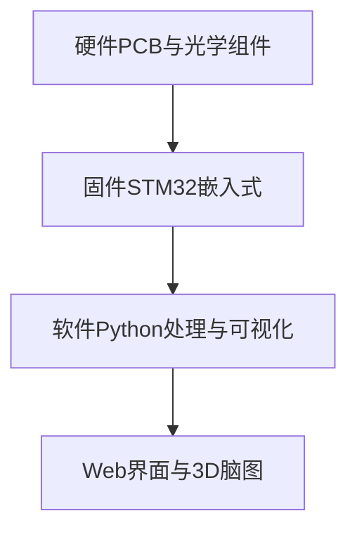
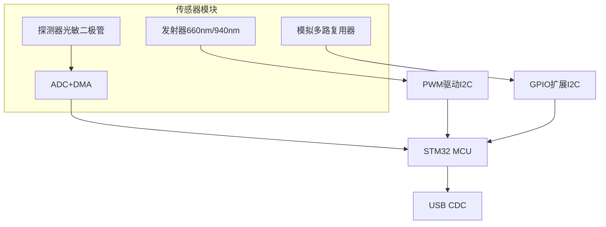
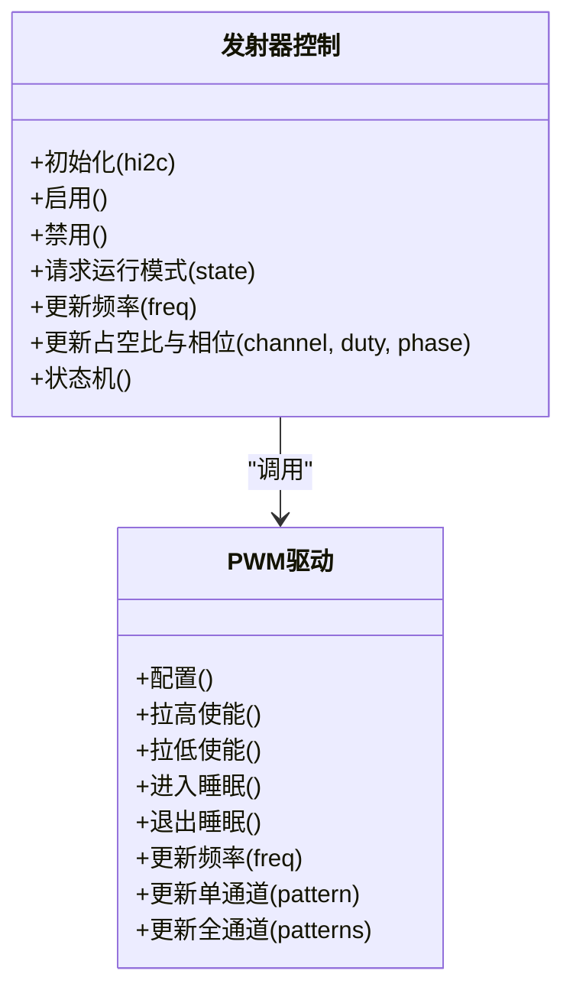
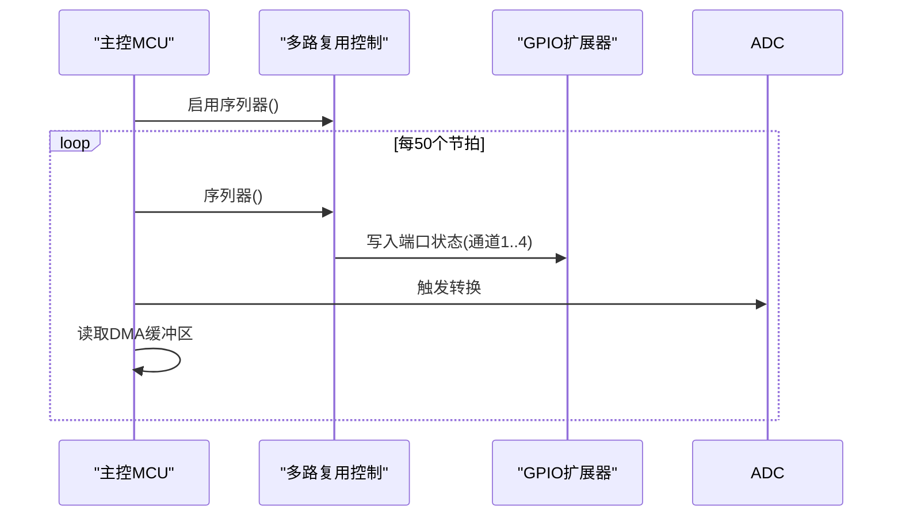
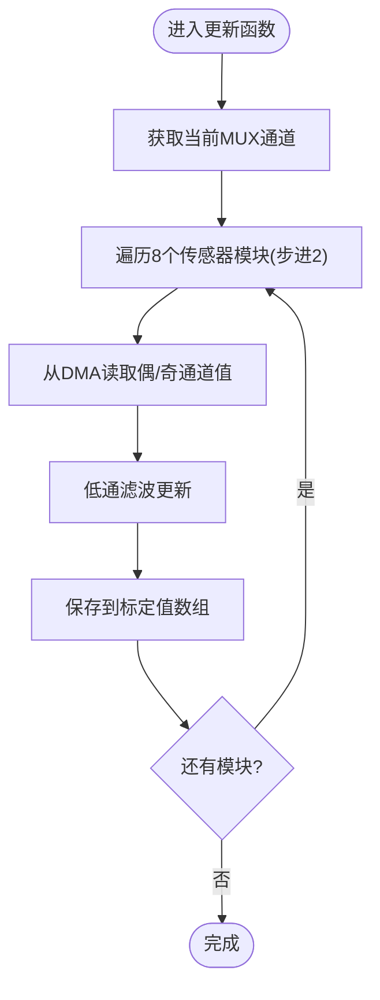
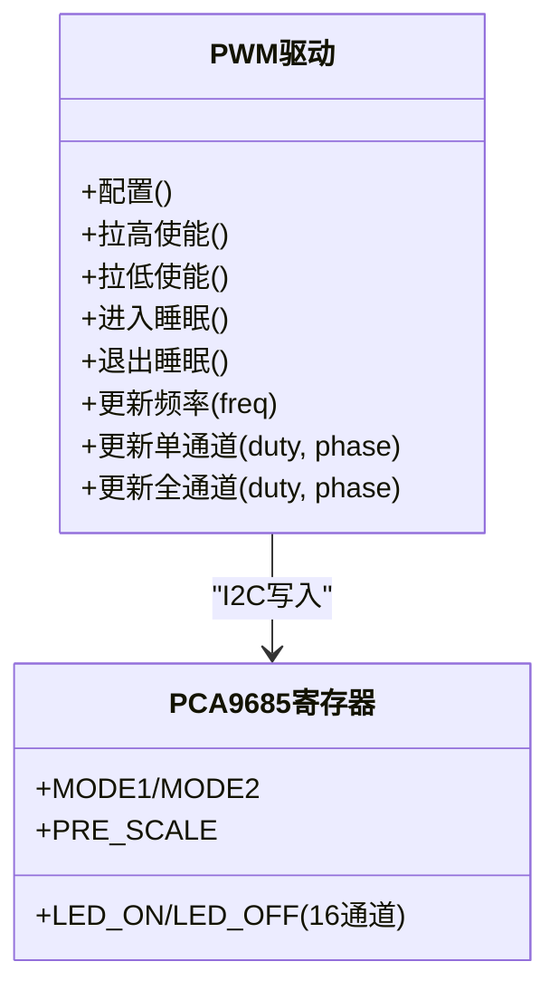
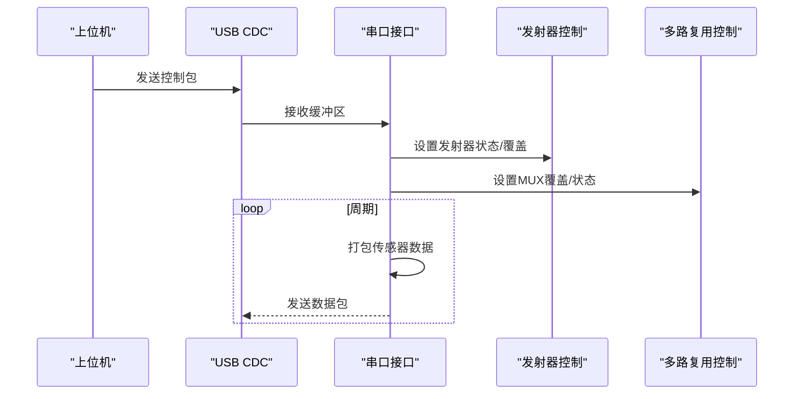
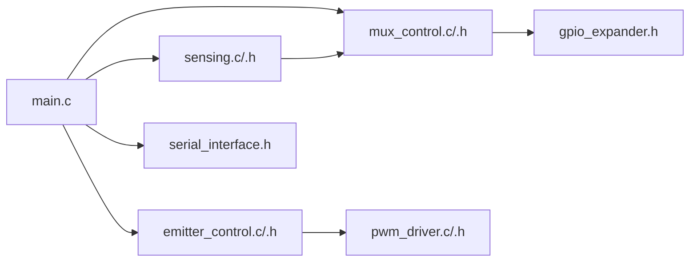

# 传感器模块设计

<cite>
**本文引用的文件**   
- [main.c](file://firmware/STM32/fNIRS/Core/Src/main.c)
- [emitter_control.h](file://firmware/STM32/fNIRS/Core/Inc/emitter_control.h)
- [emitter_control.c](file://firmware/STM32/fNIRS/Core/Src/emitter_control.c)
- [mux_control.h](file://firmware/STM32/fNIRS/Core/Inc/mux_control.h)
- [mux_control.c](file://firmware/STM32/fNIRS/Core/Src/mux_control.c)
- [sensing.h](file://firmware/STM32/fNIRS/Core/Inc/sensing.h)
- [sensing.c](file://firmware/STM32/fNIRS/Core/Src/sensing.c)
- [pwm_driver.h](file://firmware/STM32/fNIRS/Core/Inc/pwm_driver.h)
- [pwm_driver.c](file://firmware/STM32/fNIRS/Core/Src/pwm_driver.c)
- [gpio_expander.h](file://firmware/STM32/fNIRS/Core/Inc/gpio_expander.h)
- [serial_interface.h](file://firmware/STM32/fNIRS/Core/Inc/serial_interface.h)
- [hardware/README.md](file://hardware/README.md)
- [software/README.md](file://software/README.md)
</cite>

## 目录
1. [引言](#引言)
2. [项目结构](#项目结构)
3. [核心组件](#核心组件)
4. [架构总览](#架构总览)
5. [详细组件分析](#详细组件分析)
6. [依赖关系分析](#依赖关系分析)
7. [性能考虑](#性能考虑)
8. [故障排查指南](#故障排查指南)
9. [结论](#结论)
10. [附录](#附录)

## 引言
本技术文档面向fNIRS（近红外光谱）传感器模块设计工程师，系统化阐述传感器模块的电路架构、发射器与探测器集成、光学元件布局与光路设计、信号耦合原理、电气连接与信号调理、噪声抑制策略、关键性能指标（灵敏度、动态范围、测量精度）、机械固定与光学对准、环境适应性设计，以及测试方法、校准流程与质量控制标准。文档同时提供基于仓库中固件与硬件项目的代码级架构图与流程图，帮助读者快速定位实现细节并进行模块化设计与制造指导。

## 项目结构
该仓库采用“硬件/固件/软件”三层组织方式：
- 硬件：Altium设计的PCB项目，包含探测器/optode、源（发射器）optode、传感器模块、ECU控制板、线缆总成等。
- 固件：基于STM32L4系列MCU的嵌入式应用，负责发射器PWM驱动、多路复用器切换、ADC采集与温度监测、USB CDC串口通信。
- 软件：Python可视化与处理工具，支持实时ADC读数与记录后处理（如MBLL/CBSI），并提供Web界面与3D脑图展示。

**章节来源**
- [hardware/README.md:1-19](file://hardware/README.md#L1-L19)
- [software/README.md:1-180](file://software/README.md#L1-L180)

## 核心组件
- 发射器控制（emitter_control）：通过I2C接口控制PCA9685类PWM控制器，生成不同占空比与相位的波形以驱动8个传感器模块的发射器（660nm/940nm），支持默认模式、用户覆盖、循环扫描、全开等状态机。
- 多路复用器（mux_control）：使用GPIO扩展器（I2C）控制模拟多路复用，按序轮询四个输入通道，实现同一ADC输入在多个传感器模块间的切换采样。
- 感测与调理（sensing）：配置ADC与DMA，周期性读取多路复用后的原始ADC值，进行低通滤波与标定缓存，供上位机读取。
- PWM驱动（pwm_driver）：封装PCA9685寄存器配置、频率更新、单通道/全通道占空比与相位设置。
- GPIO扩展（gpio_expander）：通过I2C配置端口与极性，输出多路控制信号至外部模拟开关。
- 串口接口（serial_interface）：解析USB CDC命令，下发发射器与MUX控制指令，打包传感器数据回传。
- 主程序（main）：初始化外设、启动定时器中断、调度各子系统状态机与数据收发。

**章节来源**
- [emitter_control.h:1-54](file://firmware/STM32/fNIRS/Core/Inc/emitter_control.h#L1-L54)
- [mux_control.h:1-56](file://firmware/STM32/fNIRS/Core/Inc/mux_control.h#L1-L56)
- [sensing.h:1-71](file://firmware/STM32/fNIRS/Core/Inc/sensing.h#L1-L71)
- [pwm_driver.h:1-81](file://firmware/STM32/fNIRS/Core/Inc/pwm_driver.h#L1-L81)
- [gpio_expander.h:1-49](file://firmware/STM32/fNIRS/Core/Inc/gpio_expander.h#L1-L49)
- [serial_interface.h:1-64](file://firmware/STM32/fNIRS/Core/Inc/serial_interface.h#L1-L64)
- [main.c:132-178](file://firmware/STM32/fNIRS/Core/Src/main.c#L132-L178)

## 架构总览
下图展示了传感器模块在系统中的位置与交互关系：MCU通过I2C控制PWM驱动器与GPIO扩展器；ADC与DMA负责多路复用后的信号采集；USB CDC用于上位机控制与数据回传；软件侧提供实时与离线处理能力。

**图表来源**
- [main.c:132-178](file://firmware/STM32/fNIRS/Core/Src/main.c#L132-L178)
- [emitter_control.c:183-189](file://firmware/STM32/fNIRS/Core/Src/emitter_control.c#L183-L189)
- [mux_control.c:146-158](file://firmware/STM32/fNIRS/Core/Src/mux_control.c#L146-L158)
- [sensing.c:50-56](file://firmware/STM32/fNIRS/Core/Src/sensing.c#L50-L56)

## 详细组件分析

### 发射器控制（emitter_control）
- 功能职责：管理8个发射器通道的占空比与相位，支持多种工作模式（默认、用户覆盖、循环、全开660nm或940nm）。
- 关键实现要点：
  - 使用PCA9685类PWM控制器，通过I2C写入LED_ON/LED_OFF寄存器实现单通道占空比与相位控制。
  - 频率更新需先进入睡眠模式再写PRE_SCALE，再退出睡眠。
  - 默认模式按奇偶模块分配660nm/940nm通道；循环模式交替点亮偶/奇通道。
- 数据结构与状态机：
  - 状态枚举覆盖禁用、空闲、默认、用户控制、循环、全开660nm/940nm。
  - 保存当前状态、请求状态、PWM频率、各通道占空比与相位。

**图表来源**
- [emitter_control.h:26-38](file://firmware/STM32/fNIRS/Core/Inc/emitter_control.h#L26-L38)
- [emitter_control.c:33-181](file://firmware/STM32/fNIRS/Core/Src/emitter_control.c#L33-L181)
- [pwm_driver.h:35-62](file://firmware/STM32/fNIRS/Core/Inc/pwm_driver.h#L35-L62)
- [pwm_driver.c:33-200](file://firmware/STM32/fNIRS/Core/Src/pwm_driver.c#L33-L200)

**章节来源**
- [emitter_control.h:13-38](file://firmware/STM32/fNIRS/Core/Inc/emitter_control.h#L13-L38)
- [emitter_control.c:33-181](file://firmware/STM32/fNIRS/Core/Src/emitter_control.c#L33-L181)
- [pwm_driver.c:125-154](file://firmware/STM32/fNIRS/Core/Src/pwm_driver.c#L125-L154)

### 多路复用控制（mux_control）
- 功能职责：通过GPIO扩展器控制模拟多路复用，按序轮询四个输入通道，将ADC输入切换到不同传感器模块。
- 关键实现要点：
  - 使用两片GPIO扩展器（I2C），每片控制一组MUX（共四组）。
  - 通过预定义端口状态字将通道选择映射到具体GPIO引脚组合。
  - 定时器节拍触发顺序切换，支持手动覆盖模式。
- 数据结构与控制流：
  - 控制器枚举含禁用与四通道。
  - 维护当前通道、定时器计数与覆盖标志。

**图表来源**
- [mux_control.c:170-200](file://firmware/STM32/fNIRS/Core/Src/mux_control.c#L170-L200)
- [mux_control.c:102-144](file://firmware/STM32/fNIRS/Core/Src/mux_control.c#L102-L144)
- [gpio_expander.h:26-35](file://firmware/STM32/fNIRS/Core/Inc/gpio_expander.h#L26-L35)

**章节来源**
- [mux_control.h:13-40](file://firmware/STM32/fNIRS/Core/Inc/mux_control.h#L13-L40)
- [mux_control.c:146-158](file://firmware/STM32/fNIRS/Core/Src/mux_control.c#L146-L158)
- [mux_control.c:170-200](file://firmware/STM32/fNIRS/Core/Src/mux_control.c#L170-L200)

### 感测与信号调理（sensing）
- 功能职责：初始化ADC与DMA，周期性读取多路复用后的原始ADC值，进行低通滤波与标定缓存，提供温度读数接口。
- 关键实现要点：
  - 使用DMA搬运8路传感器模块的ADC值（每路两个通道合并到一个DMA样本中）。
  - 低通滤波系数可调，平滑原始噪声。
  - 提供按模块与通道查询校准值的接口。
- 数据结构与流程：
  - 保存ADC句柄、原始值、标定值、温度传感器原始值与计算温度。

**图表来源**
- [sensing.c:73-84](file://firmware/STM32/fNIRS/Core/Src/sensing.c#L73-L84)
- [sensing.c:45-48](file://firmware/STM32/fNIRS/Core/Src/sensing.c#L45-L48)

**章节来源**
- [sensing.h:46-61](file://firmware/STM32/fNIRS/Core/Inc/sensing.h#L46-L61)
- [sensing.c:50-56](file://firmware/STM32/fNIRS/Core/Src/sensing.c#L50-L56)
- [sensing.c:73-84](file://firmware/STM32/fNIRS/Core/Src/sensing.c#L73-L84)

### PWM驱动（pwm_driver）
- 功能职责：封装PCA9685寄存器配置、频率更新、占空比与相位设置。
- 关键实现要点：
  - MODE1/MODE2寄存器配置重启、自动增量、睡眠、子地址与输出极性等。
  - 占空比与相位通过LED_ON/LED_OFF寄存器设置，周期为4096计数。
  - 频率更新需先睡眠再写PRE_SCALE，再退出睡眠。
- 数据结构：
  - 设备配置结构体包含输出极性、推挽/开漏、默认电平等。

**图表来源**
- [pwm_driver.h:35-62](file://firmware/STM32/fNIRS/Core/Inc/pwm_driver.h#L35-L62)
- [pwm_driver.c:33-200](file://firmware/STM32/fNIRS/Core/Src/pwm_driver.c#L33-L200)

**章节来源**
- [pwm_driver.h:13-62](file://firmware/STM32/fNIRS/Core/Inc/pwm_driver.h#L13-L62)
- [pwm_driver.c:125-154](file://firmware/STM32/fNIRS/Core/Src/pwm_driver.c#L125-L154)

### 串口接口（serial_interface）
- 功能职责：解析USB CDC接收数据，下发发射器与MUX控制指令；打包传感器数据通过CDC发送。
- 关键实现要点：
  - 接收缓冲区索引定义了发射器控制覆盖使能、状态、PWM掩码，以及MUX覆盖使能与状态。
  - 发送缓冲区包含每个传感器模块的高低字节、发射器状态（0/1/2对应关/660nm/940nm）。

**图表来源**
- [serial_interface.h:40-51](file://firmware/STM32/fNIRS/Core/Inc/serial_interface.h#L40-L51)
- [serial_interface.h:55-61](file://firmware/STM32/fNIRS/Core/Inc/serial_interface.h#L55-L61)
- [main.c:154-174](file://firmware/STM32/fNIRS/Core/Src/main.c#L154-L174)

**章节来源**
- [serial_interface.h:12-38](file://firmware/STM32/fNIRS/Core/Inc/serial_interface.h#L12-L38)
- [serial_interface.h:40-61](file://firmware/STM32/fNIRS/Core/Inc/serial_interface.h#L40-L61)
- [main.c:154-174](file://firmware/STM32/fNIRS/Core/Src/main.c#L154-L174)

## 依赖关系分析
- 主程序依赖：初始化ADC/DMA/I2C/TIM/UART/USB后，依次初始化发射器控制、多路复用控制与感测模块，并启动定时器中断。
- 子系统耦合：
  - 发射器控制依赖PWM驱动与串口接口（远程覆盖）。
  - 多路复用控制依赖GPIO扩展与感测模块（读取当前通道）。
  - 感测模块依赖ADC/DMA与多路复用控制（当前通道）。
- 外部依赖：USB CDC协议栈、HAL库、I2C与ADC外设。

**图表来源**
- [main.c:132-178](file://firmware/STM32/fNIRS/Core/Src/main.c#L132-L178)
- [emitter_control.c:183-189](file://firmware/STM32/fNIRS/Core/Src/emitter_control.c#L183-L189)
- [mux_control.c:146-158](file://firmware/STM32/fNIRS/Core/Src/mux_control.c#L146-L158)
- [sensing.c:50-56](file://firmware/STM32/fNIRS/Core/Src/sensing.c#L50-L56)

**章节来源**
- [main.c:132-178](file://firmware/STM32/fNIRS/Core/Src/main.c#L132-L178)

## 性能考虑
- 频率与分辨率：
  - PWM频率通过PRE_SCALE寄存器设置，范围约24Hz~1526Hz，内部振荡器频率为25MHz。
  - 占空比与相位分辨率为12bit（4096步），满足精细调制需求。
- 采样与滤波：
  - ADC使用DMA搬运，降低CPU占用；低通滤波参数可调，平衡响应速度与噪声抑制。
- 通道切换：
  - MUX按固定节拍轮询，确保各模块均匀采样；覆盖模式允许上位机强制指定通道。
- 通信吞吐：
  - USB CDC数据包包含8个传感器模块的两字节值与发射器状态，适合实时监控与记录。

**章节来源**
- [pwm_driver.c:125-154](file://firmware/STM32/fNIRS/Core/Src/pwm_driver.c#L125-L154)
- [sensing.c:45-48](file://firmware/STM32/fNIRS/Core/Src/sensing.c#L45-L48)
- [mux_control.c:170-200](file://firmware/STM32/fNIRS/Core/Src/mux_control.c#L170-L200)
- [serial_interface.h:26-38](file://firmware/STM32/fNIRS/Core/Inc/serial_interface.h#L26-L38)

## 故障排查指南
- 发射器无输出：
  - 检查PWM驱动使能引脚是否被正确拉低（启用）。
  - 确认频率已更新且设备已退出睡眠模式。
  - 核对I2C地址与PCA9685寄存器配置。
- MUX通道不切换：
  - 检查GPIO扩展器I2C通信与端口配置。
  - 确认定时器节拍与覆盖标志状态。
- ADC数据异常：
  - 检查DMA搬运是否成功，确认ADC校准与采样时间。
  - 查看低通滤波参数是否过小导致响应迟滞。
- 上位机无法接收数据：
  - 检查CDC发送路径与数据包格式。
  - 确认主循环中串口解析与数据打包调用顺序。

**章节来源**
- [pwm_driver.c:85-93](file://firmware/STM32/fNIRS/Core/Src/pwm_driver.c#L85-L93)
- [pwm_driver.c:109-123](file://firmware/STM32/fNIRS/Core/Src/pwm_driver.c#L109-L123)
- [mux_control.c:165-178](file://firmware/STM32/fNIRS/Core/Src/mux_control.c#L165-L178)
- [sensing.c:50-56](file://firmware/STM32/fNIRS/Core/Src/sensing.c#L50-L56)
- [serial_interface.h:55-61](file://firmware/STM32/fNIRS/Core/Inc/serial_interface.h#L55-L61)

## 结论
本设计以STM32为核心，结合PCA9685类PWM控制器与GPIO扩展器，实现了对8路传感器模块的发射器与探测器信号的精确控制与同步采集。通过多路复用与DMA技术，系统在保证实时性的前提下具备良好的噪声抑制与扩展能力。配合上位机软件，可实现从实时监控到离线处理的完整工作流。建议在硬件层面强化屏蔽与走线匹配，在软件层面完善校准算法与异常恢复机制，以进一步提升系统稳定性与测量精度。

## 附录
- 硬件项目清单与说明可参考硬件目录下的说明文档。
- 软件功能与使用方式可参考软件目录下的说明文档。

**章节来源**
- [hardware/README.md:1-19](file://hardware/README.md#L1-L19)
- [software/README.md:1-180](file://software/README.md#L1-L180)