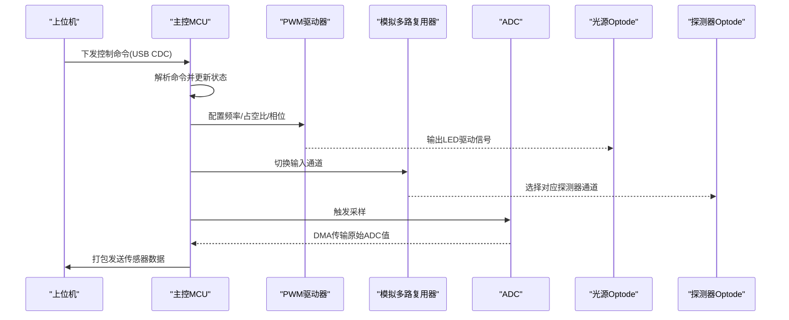
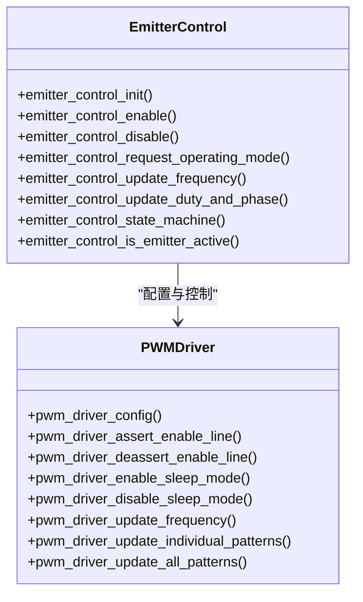
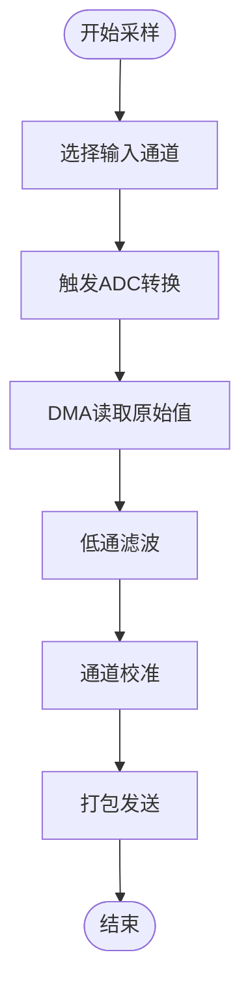
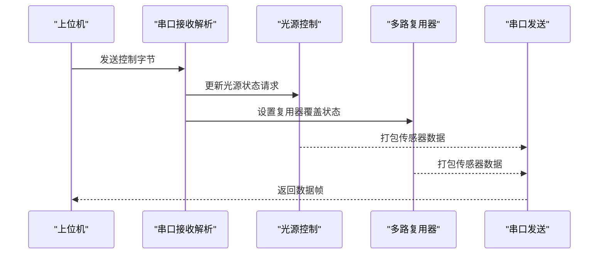
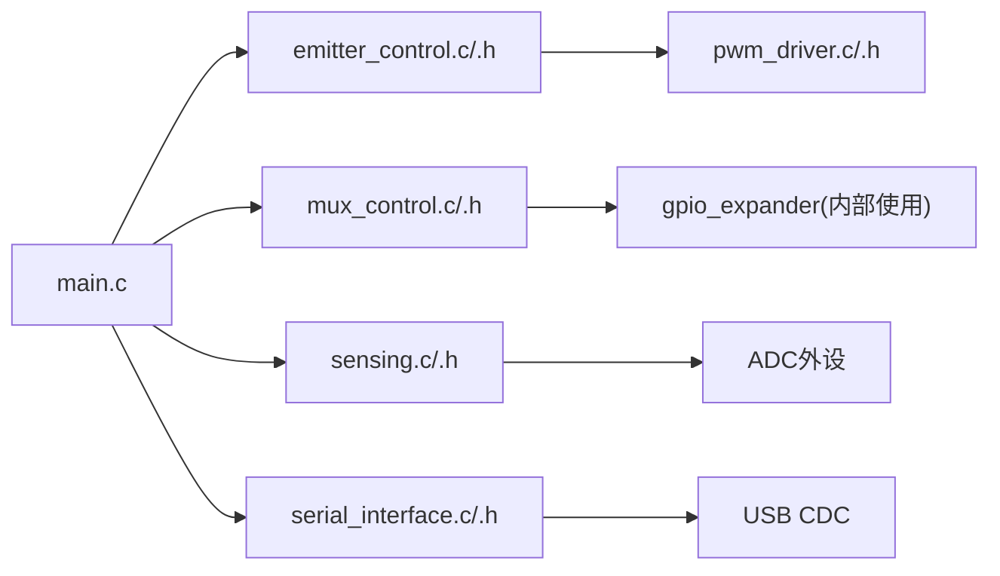

# 光源和探测器设计

<cite>
**本文档引用的文件**
- [emitter_control.h](file://firmware/STM32/fNIRS/Core/Inc/emitter_control.h)
- [pwm_driver.h](file://firmware/STM32/fNIRS/Core/Inc/pwm_driver.h)
- [sensing.h](file://firmware/STM32/fNIRS/Core/Inc/sensing.h)
- [mux_control.h](file://firmware/STM32/fNIRS/Core/Inc/mux_control.h)
- [serial_interface.h](file://firmware/STM32/fNIRS/Core/Inc/serial_interface.h)
- [emitter_control.c](file://firmware/STM32/fNIRS/Core/Src/emitter_control.c)
- [pwm_driver.c](file://firmware/STM32/fNIRS/Core/Src/pwm_driver.c)
- [sensing.c](file://firmware/STM32/fNIRS/Core/Src/sensing.c)
- [mux_control.c](file://firmware/STM32/fNIRS/Core/Src/mux_control.c)
- [serial_interface.c](file://firmware/STM32/fNIRS/Core/Src/serial_interface.c)
- [main.h](file://firmware/STM32/fNIRS/Core/Inc/main.h)
- [main.c](file://firmware/STM32/fNIRS/Core/Src/main.c)
- [SourceOptode.PrjPcb](file://hardware/SourceOptode/SourceOptode.PrjPcb)
- [DetectorOptode.PrjPcb](file://hardware/DetectorOptode/DetectorOptode.PrjPcb)
- [fNIRS_ECU.PrjPcb](file://hardware/fNIRS_ECU/fNIRS_ECU.PrjPcb)
</cite>

## 目录
1. [引言](#引言)
2. [项目结构](#项目结构)
3. [核心组件](#核心组件)
4. [架构总览](#架构总览)
5. [详细组件分析](#详细组件分析)
6. [依赖关系分析](#依赖关系分析)
7. [性能考虑](#性能考虑)
8. [故障排除指南](#故障排除指南)
9. [结论](#结论)
10. [附录](#附录)

## 引言
本技术文档面向光学工程师与精密制造人员，系统阐述fNIRS系统中光源(optode)与探测器(optode)的设计与实现。内容涵盖LED阵列布局、驱动电路与光功率控制策略；探测器电路中的光电二极管信号放大、噪声抑制与线性度优化；以及optode的光学特性、光谱响应与空间分辨率等关键指标。同时提供热管理、机械保护与生物相容性设计要点，装配工艺、光学对准与性能测试方法，并明确optode与其他硬件组件的接口规范与连接方式。

## 项目结构
该仓库采用分层架构：固件层（STM32微控制器）负责光源控制、模拟多路复用与传感器数据采集；硬件层（PCB）承载optode电路与连接器；软件层（上位机脚本）提供数据处理与可视化。optode相关硬件文件位于hardware目录下的SourceOptode、DetectorOptode与fNIRS_ECU等PCB工程文件中。

```mermaid
graph TB
subgraph "固件层"
MCU["主控MCU<br/>STM32L4系列"]
PWM["PWM驱动器<br/>PCA9635/类似"]
ADC["ADC模数转换<br/>多通道"]
MUX["模拟多路复用器<br/>GPIO扩展"]
end
subgraph "硬件层"
SO["光源Optode<br/>LED阵列"]
DO["探测器Optode<br/>光电二极管"]
ECU["ECU主板<br/>fNIRS_ECU"]
end
subgraph "软件层"
Host["上位机脚本<br/>数据处理与可视化"]
end
MCU --> PWM
MCU --> ADC
MCU --> MUX
PWM --> SO
ADC --> DO
MUX --> DO
MCU < --> ECU
ECU < --> SO
ECU < --> DO
Host < --> MCU
```

**图表来源**
- [main.c:132-138](file://firmware/STM32/fNIRS/Core/Src/main.c#L132-L138)
- [emitter_control.c:183-189](file://firmware/STM32/fNIRS/Core/Src/emitter_control.c#L183-L189)
- [sensing.c:50-56](file://firmware/STM32/fNIRS/Core/Src/sensing.c#L50-L56)
- [mux_control.c:146-158](file://firmware/STM32/fNIRS/Core/Src/mux_control.c#L146-L158)

**章节来源**
- [main.c:118-139](file://firmware/STM32/fNIRS/Core/Src/main.c#L118-L139)
- [SourceOptode.PrjPcb:1-120](file://hardware/SourceOptode/SourceOptode.PrjPcb#L1-L120)
- [DetectorOptode.PrjPcb:1-120](file://hardware/DetectorOptode/DetectorOptode.PrjPcb#L1-L120)
- [fNIRS_ECU.PrjPcb:1-120](file://hardware/fNIRS_ECU/fNIRS_ECU.PrjPcb#L1-L120)

## 核心组件
- 光源控制模块：基于PWM驱动器对多个LED通道进行独立占空比与相位控制，支持默认模式、用户控制、循环扫描与全波长选择。
- 探测器采样模块：通过ADC与模拟多路复用器实现8路传感器通道的同步采样与滤波，结合USB CDC接口向主机传输数据。
- 通信接口模块：提供USB CDC命令解析与数据打包，支持远程覆盖光源与多路复用器状态。

**章节来源**
- [emitter_control.h:13-38](file://firmware/STM32/fNIRS/Core/Inc/emitter_control.h#L13-L38)
- [pwm_driver.h:13-62](file://firmware/STM32/fNIRS/Core/Inc/pwm_driver.h#L13-L62)
- [sensing.h:12-61](file://firmware/STM32/fNIRS/Core/Inc/sensing.h#L12-L61)
- [mux_control.h:12-40](file://firmware/STM32/fNIRS/Core/Inc/mux_control.h#L12-L40)
- [serial_interface.h:12-51](file://firmware/STM32/fNIRS/Core/Inc/serial_interface.h#L12-L51)

## 架构总览
下图展示optode相关子系统的交互关系：主控MCU协调PWM驱动器、ADC与模拟多路复用器；ECU主板承载各optode连接器与电源/信号分配；上位机通过USB CDC下发控制指令并接收传感器数据。



**图表来源**
- [serial_interface.c:20-32](file://firmware/STM32/fNIRS/Core/Src/serial_interface.c#L20-L32)
- [emitter_control.c:220-278](file://firmware/STM32/fNIRS/Core/Src/emitter_control.c#L220-L278)
- [mux_control.c:170-229](file://firmware/STM32/fNIRS/Core/Src/mux_control.c#L170-L229)
- [sensing.c:73-84](file://firmware/STM32/fNIRS/Core/Src/sensing.c#L73-L84)

## 详细组件分析

### 光源Optode设计
- LED阵列布局与驱动
  - 每个optode模块包含多个LED通道，按奇偶通道分别映射到不同波长（例如660nm与940nm），通过PWM驱动器实现独立控制。
  - 支持默认模式：根据模块序号自动分配波长通道；用户控制：通过位掩码直接启用特定通道；循环扫描：周期性切换通道以降低热累积。
  - 频率与占空比：PWM频率可配置，占空比范围0-100%，相位偏移用于通道间同步。
- 热管理与光功率控制
  - 采用循环扫描与占空比调制降低平均功耗与热积累。
  - 可通过上位机远程覆盖控制模式，实现动态功率调节。
- 生物相容性与机械保护
  - optode外壳材料需满足生物相容标准，接触面应光滑无锐角。
  - 光纤或LED出射端需有光学准直结构，避免散射与眩光。



**图表来源**
- [emitter_control.h:40-53](file://firmware/STM32/fNIRS/Core/Inc/emitter_control.h#L40-L53)
- [pwm_driver.h:65-80](file://firmware/STM32/fNIRS/Core/Inc/pwm_driver.h#L65-L80)
- [emitter_control.c:183-202](file://firmware/STM32/fNIRS/Core/Src/emitter_control.c#L183-L202)
- [pwm_driver.c:33-83](file://firmware/STM32/fNIRS/Core/Src/pwm_driver.c#L33-L83)

**章节来源**
- [emitter_control.c:33-181](file://firmware/STM32/fNIRS/Core/Src/emitter_control.c#L33-L181)
- [pwm_driver.c:125-220](file://firmware/STM32/fNIRS/Core/Src/pwm_driver.c#L125-L220)
- [SourceOptode.PrjPcb:120-400](file://hardware/SourceOptode/SourceOptode.PrjPcb#L120-L400)

### 探测器Optode设计
- 光电二极管信号链
  - 多路模拟开关选择不同探测器通道，ADC在定时触发下进行同步采样。
  - DMA直接存储原始ADC值，随后进行低通滤波以抑制噪声。
- 噪声抑制与线性度优化
  - 采样时间与ADC分辨率配置保证信噪比；滤波参数平滑输出波动。
  - 通道校准参数（增益/偏置）可在固件中配置，提升线性度一致性。
- 光学特性与空间分辨率
  - 探测器孔径与光阑设计决定空间分辨率；光敏面与入射光角度影响光谱响应均匀性。



**图表来源**
- [mux_control.c:170-229](file://firmware/STM32/fNIRS/Core/Src/mux_control.c#L170-L229)
- [sensing.c:73-84](file://firmware/STM32/fNIRS/Core/Src/sensing.c#L73-L84)
- [serial_interface.c:59-81](file://firmware/STM32/fNIRS/Core/Src/serial_interface.c#L59-L81)

**章节来源**
- [sensing.c:45-84](file://firmware/STM32/fNIRS/Core/Src/sensing.c#L45-L84)
- [mux_control.c:102-158](file://firmware/STM32/fNIRS/Core/Src/mux_control.c#L102-L158)
- [DetectorOptode.PrjPcb:120-500](file://hardware/DetectorOptode/DetectorOptode.PrjPcb#L120-L500)

### 通信与控制接口
- USB CDC命令格式
  - 包含光源控制覆盖使能、目标工作模式、用户PWM控制掩码与多路复用器覆盖状态。
- 数据帧结构
  - 每模块发送固定长度的数据帧，包含三个通道的ADC高字节与低字节，以及当前发射器状态指示。



**图表来源**
- [serial_interface.c:20-57](file://firmware/STM32/fNIRS/Core/Src/serial_interface.c#L20-L57)
- [serial_interface.c:59-81](file://firmware/STM32/fNIRS/Core/Src/serial_interface.c#L59-L81)

**章节来源**
- [serial_interface.h:12-61](file://firmware/STM32/fNIRS/Core/Inc/serial_interface.h#L12-L61)
- [serial_interface.c:20-81](file://firmware/STM32/fNIRS/Core/Src/serial_interface.c#L20-L81)

## 依赖关系分析
- 组件耦合
  - 主控MCU依赖PWM驱动器与ADC/MUX模块；光源控制与探测器采样通过定时器事件解耦。
- 外部依赖
  - I2C接口用于与PWM驱动器及GPIO扩展器通信；USB CDC用于上位机交互。
- 接口契约
  - PWM驱动器寄存器地址与配置参数由固件统一管理；ADC通道映射与滤波参数可配置。



**图表来源**
- [main.c:25-31](file://firmware/STM32/fNIRS/Core/Src/main.c#L25-L31)
- [emitter_control.c:3-6](file://firmware/STM32/fNIRS/Core/Src/emitter_control.c#L3-L6)
- [mux_control.c:3-5](file://firmware/STM32/fNIRS/Core/Src/mux_control.c#L3-L5)
- [sensing.c:2-6](file://firmware/STM32/fNIRS/Core/Src/sensing.c#L2-L6)
- [serial_interface.c:3-6](file://firmware/STM32/fNIRS/Core/Src/serial_interface.c#L3-L6)

**章节来源**
- [main.c:132-178](file://firmware/STM32/fNIRS/Core/Src/main.c#L132-L178)

## 性能考虑
- PWM频率与分辨率
  - 内部振荡器频率与预分频计算决定可调频率范围；占空比与相位计数均基于12位分辨率。
- ADC采样与时序
  - 多通道独立配置，外部触发源与DMA传输减少CPU占用，提高实时性。
- 通信带宽
  - USB CDC数据帧大小固定，适合高频采样场景；建议上位机侧进行批处理与降采样。

[本节为通用指导，无需具体文件分析]

## 故障排除指南
- PWM输出异常
  - 检查使能引脚电平与睡眠模式设置；确认I2C写入成功且设备地址正确。
- ADC采样抖动
  - 校验触发源与时序配置；检查DMA缓冲区与滤波参数。
- 通信丢包
  - 确认CDC缓冲区大小与主机端读取速率；检查USB枚举与端点配置。

**章节来源**
- [pwm_driver.c:95-123](file://firmware/STM32/fNIRS/Core/Src/pwm_driver.c#L95-L123)
- [sensing.c:73-84](file://firmware/STM32/fNIRS/Core/Src/sensing.c#L73-L84)
- [serial_interface.c:59-81](file://firmware/STM32/fNIRS/Core/Src/serial_interface.c#L59-L81)

## 结论
本文档从系统架构、硬件实现与软件控制三个维度，全面梳理了fNIRS光源与探测器optode的设计要点。通过PWM驱动与模拟多路复用的协同，实现了对多波长LED阵列的精确控制与多通道探测器的高效采样；配合USB CDC接口，满足远程控制与数据回传需求。实际制造中应重点关注光学准直、热管理与生物相容性，确保长期稳定运行。

[本节为总结性内容，无需具体文件分析]

## 附录

### 光源Optode装配与对准
- LED阵列定位：确保LED与光纤或散射元件对准，避免漏光与串扰。
- 热管理：预留散热路径，必要时增加导热垫或被动风冷。
- 连接器：确保I2C与电源连接可靠，屏蔽层良好。

**章节来源**
- [SourceOptode.PrjPcb:400-800](file://hardware/SourceOptode/SourceOptode.PrjPcb#L400-L800)

### 探测器Optode装配与测试
- 光电二极管清洁：避免污染影响光谱响应。
- 通道一致性测试：使用已知光强光源校准各通道增益与偏置。
- 动态范围验证：在不同功率下测量线性度与噪声底限。

**章节来源**
- [DetectorOptode.PrjPcb:400-800](file://hardware/DetectorOptode/DetectorOptode.PrjPcb#L400-L800)

### 与其他硬件组件的接口规范
- ECU主板连接器定义：optode连接器与ECU母座的针脚定义与电气特性。
- 电源与地：确保稳定的电源分配与星形接地，减少共模噪声。
- 机械安装：使用标准安装孔位与紧固件，保证长期振动环境下的可靠性。

**章节来源**
- [fNIRS_ECU.PrjPcb:120-400](file://hardware/fNIRS_ECU/fNIRS_ECU.PrjPcb#L120-L400)