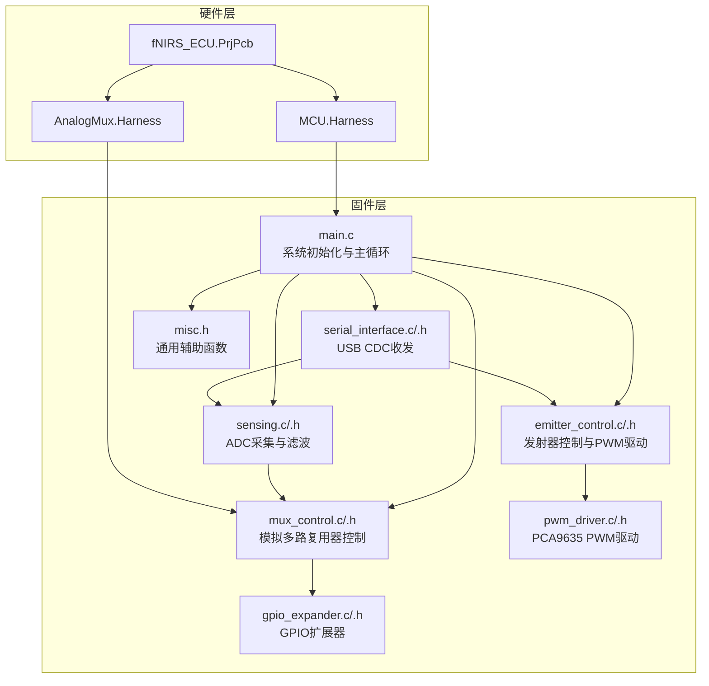
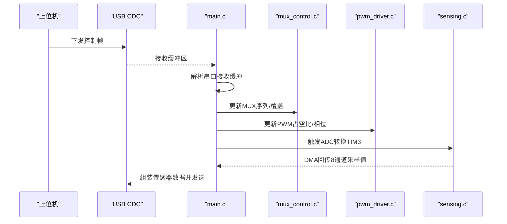
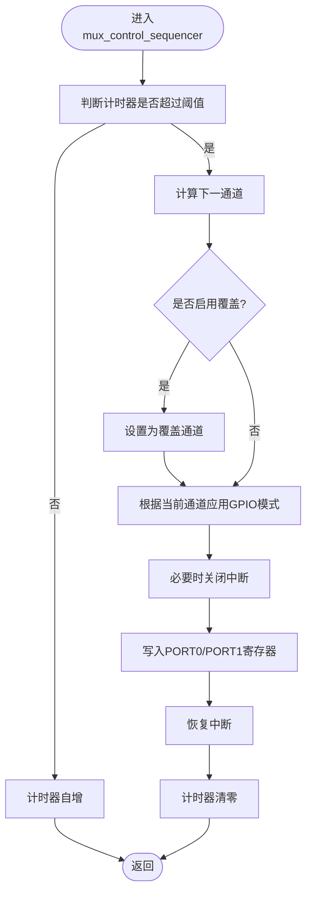
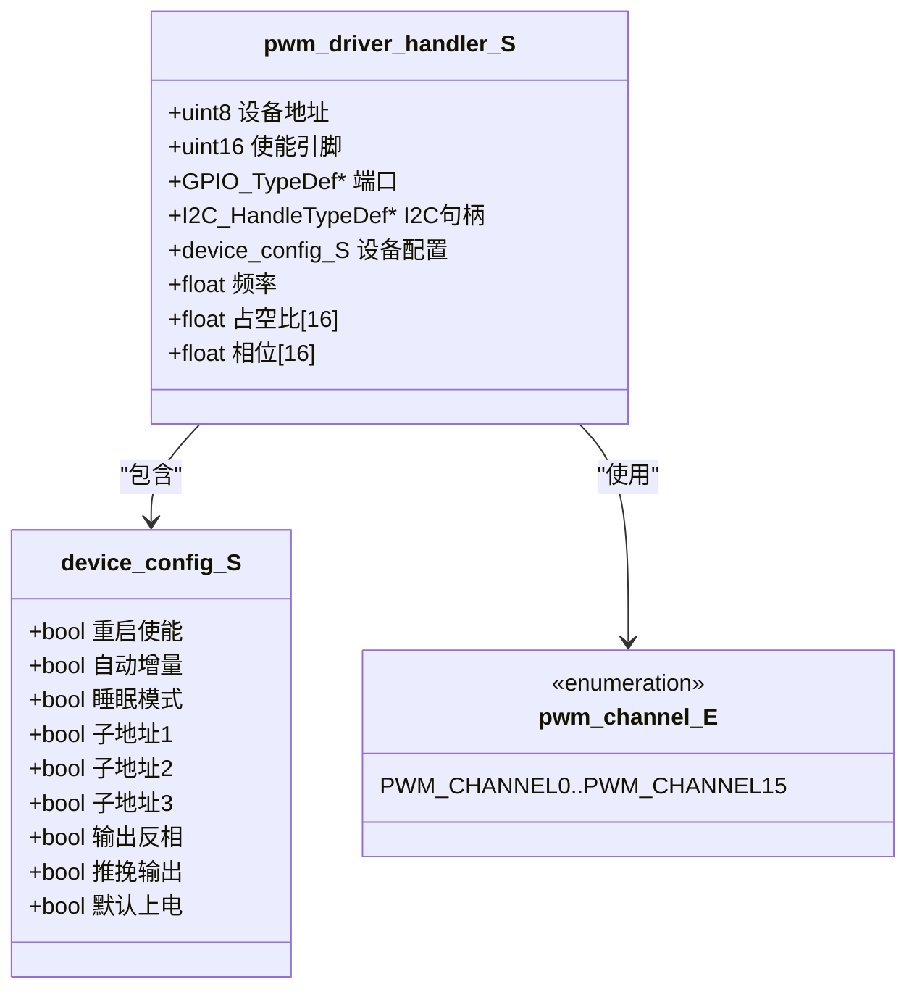
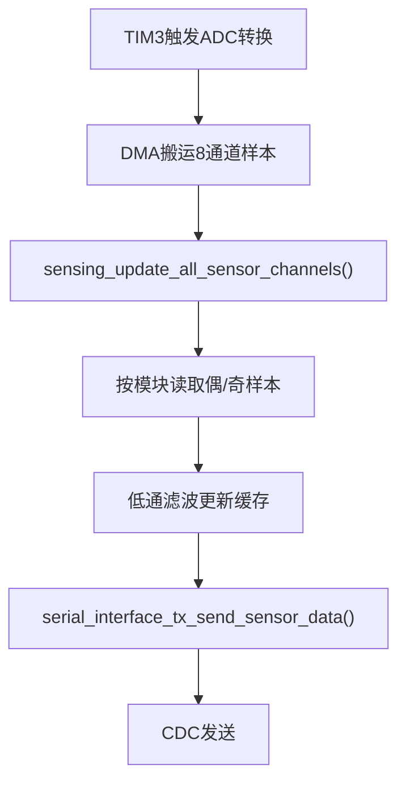
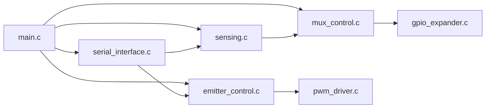

# 电气控制单元设计

<cite>
**本文引用的文件**
- [firmware/STM32/fNIRS/Core/Inc/main.h](file://firmware/STM32/fNIRS/Core/Inc/main.h)
- [firmware/STM32/fNIRS/Core/Src/main.c](file://firmware/STM32/fNIRS/Core/Src/main.c)
- [firmware/STM32/fNIRS/Core/Inc/emitter_control.h](file://firmware/STM32/fNIRS/Core/Inc/emitter_control.h)
- [firmware/STM32/fNIRS/Core/Src/emitter_control.c](file://firmware/STM32/fNIRS/Core/Src/emitter_control.c)
- [firmware/STM32/fNIRS/Core/Inc/mux_control.h](file://firmware/STM32/fNIRS/Core/Inc/mux_control.h)
- [firmware/STM32/fNIRS/Core/Src/mux_control.c](file://firmware/STM32/fNIRS/Core/Src/mux_control.c)
- [firmware/STM32/fNIRS/Core/Inc/pwm_driver.h](file://firmware/STM32/fNIRS/Core/Inc/pwm_driver.h)
- [firmware/STM32/fNIRS/Core/Src/pwm_driver.c](file://firmware/STM32/fNIRS/Core/Src/pwm_driver.c)
- [firmware/STM32/fNIRS/Core/Inc/gpio_expander.h](file://firmware/STM32/fNIRS/Core/Inc/gpio_expander.h)
- [firmware/STM32/fNIRS/Core/Src/gpio_expander.c](file://firmware/STM32/fNIRS/Core/Src/gpio_expander.c)
- [firmware/STM32/fNIRS/Core/Inc/sensing.h](file://firmware/STM32/fNIRS/Core/Inc/sensing.h)
- [firmware/STM32/fNIRS/Core/Src/sensing.c](file://firmware/STM32/fNIRS/Core/Src/sensing.c)
- [firmware/STM32/fNIRS/Core/Inc/serial_interface.h](file://firmware/STM32/fNIRS/Core/Inc/serial_interface.h)
- [firmware/STM32/fNIRS/Core/Src/serial_interface.c](file://firmware/STM32/fNIRS/Core/Src/serial_interface.c)
- [firmware/STM32/fNIRS/Core/Inc/misc.h](file://firmware/STM32/fNIRS/Core/Inc/misc.h)
- [hardware/fNIRS_ECU/fNIRS_ECU.PrjPcb](file://hardware/fNIRS_ECU/fNIRS_ECU.PrjPcb)
- [hardware/fNIRS_ECU/AnalogMux.Harness](file://hardware/fNIRS_ECU/AnalogMux.Harness)
- [hardware/fNIRS_ECU/MCU.Harness](file://hardware/fNIRS_ECU/MCU.Harness)
</cite>

## 目录
1. [引言](#引言)
2. [项目结构](#项目结构)
3. [核心组件](#核心组件)
4. [架构总览](#架构总览)
5. [详细组件分析](#详细组件分析)
6. [依赖关系分析](#依赖关系分析)
7. [性能考虑](#性能考虑)
8. [故障排除指南](#故障排除指南)
9. [结论](#结论)
10. [附录](#附录)

## 引言
本技术文档面向硬件工程师与嵌入式开发者，系统性阐述fNIRS电气控制单元（ECU）的硬件与固件设计。内容覆盖微控制器（MCU）配置与外设管理、模拟多路复用器（MUX）、GPIO扩展器、PWM控制、USB接口、SD卡存储、传感器连接与数据处理、Harness连接器功能定义与电气特性，以及电源管理、信号调理与调试测试流程。文档以仓库中的固件与硬件文件为依据，提供可追溯的“章节来源”与“图表来源”，帮助读者快速定位实现细节。

## 项目结构
ECU固件采用分层组织：顶层入口负责系统时钟与外设初始化；业务模块按功能拆分为发射器控制、模拟MUX、GPIO扩展、ADC采集与处理、串行接口（USB CDC）等。硬件层面通过Harness文件定义各连接器的信号映射与电气特性。

**图表来源**
- [firmware/STM32/fNIRS/Core/Src/main.c:92-181](file://firmware/STM32/fNIRS/Core/Src/main.c#L92-L181)
- [firmware/STM32/fNIRS/Core/Inc/emitter_control.h:40-54](file://firmware/STM32/fNIRS/Core/Inc/emitter_control.h#L40-L54)
- [firmware/STM32/fNIRS/Core/Inc/mux_control.h:42-56](file://firmware/STM32/fNIRS/Core/Inc/mux_control.h#L42-L56)
- [firmware/STM32/fNIRS/Core/Inc/pwm_driver.h:65-81](file://firmware/STM32/fNIRS/Core/Inc/pwm_driver.h#L65-L81)
- [firmware/STM32/fNIRS/Core/Inc/gpio_expander.h:38-49](file://firmware/STM32/fNIRS/Core/Inc/gpio_expander.h#L38-L49)
- [firmware/STM32/fNIRS/Core/Inc/sensing.h:63-71](file://firmware/STM32/fNIRS/Core/Inc/sensing.h#L63-L71)
- [firmware/STM32/fNIRS/Core/Inc/serial_interface.h:53-64](file://firmware/STM32/fNIRS/Core/Inc/serial_interface.h#L53-L64)
- [hardware/fNIRS_ECU/MCU.Harness:1-12](file://hardware/fNIRS_ECU/MCU.Harness#L1-L12)
- [hardware/fNIRS_ECU/AnalogMux.Harness:1-3](file://hardware/fNIRS_ECU/AnalogMux.Harness#L1-L3)
- [hardware/fNIRS_ECU/fNIRS_ECU.PrjPcb:1-800](file://hardware/fNIRS_ECU/fNIRS_ECU.PrjPcb#L1-L800)

**章节来源**
- [firmware/STM32/fNIRS/Core/Src/main.c:118-129](file://firmware/STM32/fNIRS/Core/Src/main.c#L118-L129)
- [hardware/fNIRS_ECU/MCU.Harness:1-12](file://hardware/fNIRS_ECU/MCU.Harness#L1-L12)
- [hardware/fNIRS_ECU/AnalogMux.Harness:1-3](file://hardware/fNIRS_ECU/AnalogMux.Harness#L1-L3)
- [hardware/fNIRS_ECU/fNIRS_ECU.PrjPcb:1-800](file://hardware/fNIRS_ECU/fNIRS_ECU.PrjPcb#L1-L800)

## 核心组件
- 微控制器与系统时钟
  - 使用STM32L4系列，配置主PLL与ADC专用时钟（PLLSAI1），确保ADC与USB稳定供电。
  - 外设初始化：ADC1（含DMA）、I2C1/I2C2、SPI1、USART1、TIM3/TIM4、USB设备栈。
- 模拟多路复用器（MUX）
  - 通过两个PCA9555（GPIO扩展器）控制8路MUX通道选择，支持顺序扫描与用户覆盖。
- 发射器控制与PWM
  - PCA9635 PWM控制器，I2C配置与频率/占空比更新，支持默认模式、用户控制、循环模式与单波长全开。
- ADC与信号调理
  - ADC1多通道扫描+DMA，8路传感器模块并行读取，低通滤波平滑。
- 串行接口（USB CDC）
  - 主循环周期解析上位机指令，下发发射器与MUX控制，并周期性上报传感器数据。
- 板级资源
  - SD卡检测、测试LED、SPI片选等GPIO由MCU直接控制。

**章节来源**
- [firmware/STM32/fNIRS/Core/Src/main.c:187-257](file://firmware/STM32/fNIRS/Core/Src/main.c#L187-L257)
- [firmware/STM32/fNIRS/Core/Src/main.c:264-387](file://firmware/STM32/fNIRS/Core/Src/main.c#L264-L387)
- [firmware/STM32/fNIRS/Core/Src/main.c:394-483](file://firmware/STM32/fNIRS/Core/Src/main.c#L394-L483)
- [firmware/STM32/fNIRS/Core/Src/main.c:490-523](file://firmware/STM32/fNIRS/Core/Src/main.c#L490-L523)
- [firmware/STM32/fNIRS/Core/Src/main.c:530-613](file://firmware/STM32/fNIRS/Core/Src/main.c#L530-L613)
- [firmware/STM32/fNIRS/Core/Src/main.c:620-648](file://firmware/STM32/fNIRS/Core/Src/main.c#L620-L648)
- [firmware/STM32/fNIRS/Core/Src/main.c:671-704](file://firmware/STM32/fNIRS/Core/Src/main.c#L671-L704)

## 架构总览
ECU采用“主循环+中断/定时器触发”的协作式调度：主循环执行状态机与数据处理；TIM4作为发射器状态机节拍；TIM3触发ADC转换；DMA搬运ADC数据；USB CDC提供人机交互与远程控制。

**图表来源**
- [firmware/STM32/fNIRS/Core/Src/main.c:146-178](file://firmware/STM32/fNIRS/Core/Src/main.c#L146-L178)
- [firmware/STM32/fNIRS/Core/Src/serial_interface.c:20-32](file://firmware/STM32/fNIRS/Core/Src/serial_interface.c#L20-L32)
- [firmware/STM32/fNIRS/Core/Src/mux_control.c:170-229](file://firmware/STM32/fNIRS/Core/Src/mux_control.c#L170-L229)
- [firmware/STM32/fNIRS/Core/Src/pwm_driver.c:156-220](file://firmware/STM32/fNIRS/Core/Src/pwm_driver.c#L156-L220)
- [firmware/STM32/fNIRS/Core/Src/sensing.c:73-84](file://firmware/STM32/fNIRS/Core/Src/sensing.c#L73-L84)

## 详细组件分析

### 微控制器与系统时钟
- 电源与时钟
  - LDO输出经DC-DC稳压至3.3V，为MCU与外围供电。
  - 系统时钟：MSI经PLL倍频至120MHz；ADC/USB使用PLLSAI1分频。
- 外设时序
  - ADC1：扫描8通道，外部触发来自TIM3，DMA搬运。
  - I2C1/I2C2：分别用于GPIO扩展器与PWM控制器。
  - SPI1：4位帧格式，软件NSS，用于扩展器寄存器访问。
  - USART1：调试串口，波特率115200。
  - TIM3：主触发源，TIM4：发射器状态机节拍。
  - USB：设备模式，CDC类。

**章节来源**
- [firmware/STM32/fNIRS/Core/Src/main.c:187-257](file://firmware/STM32/fNIRS/Core/Src/main.c#L187-L257)
- [firmware/STM32/fNIRS/Core/Src/main.c:264-387](file://firmware/STM32/fNIRS/Core/Src/main.c#L264-L387)
- [firmware/STM32/fNIRS/Core/Src/main.c:394-483](file://firmware/STM32/fNIRS/Core/Src/main.c#L394-L483)
- [firmware/STM32/fNIRS/Core/Src/main.c:490-523](file://firmware/STM32/fNIRS/Core/Src/main.c#L490-L523)
- [firmware/STM32/fNIRS/Core/Src/main.c:530-613](file://firmware/STM32/fNIRS/Core/Src/main.c#L530-L613)
- [firmware/STM32/fNIRS/Core/Src/main.c:620-648](file://firmware/STM32/fNIRS/Core/Src/main.c#L620-L648)

### 模拟多路复用器（MUX）与GPIO扩展
- 设计要点
  - 使用两片PCA9555（地址分别为0x41、0x43）作为GPIO扩展器，控制8组MUX（每组3线选择线）。
  - 通过写入端口寄存器组合出4个输入通道与禁用状态对应的位模式。
  - 提供顺序扫描与用户覆盖两种模式，顺序扫描周期可调。
- 控制流程
  - 初始化：配置I2C地址、端口方向与极性寄存器。
  - 运行：定时器触发，切换当前通道；若启用覆盖，则强制到指定通道。
  - 并发：在切换期间关闭中断，避免抖动。

**图表来源**
- [firmware/STM32/fNIRS/Core/Src/mux_control.c:170-229](file://firmware/STM32/fNIRS/Core/Src/mux_control.c#L170-L229)
- [firmware/STM32/fNIRS/Core/Src/gpio_expander.c:58-66](file://firmware/STM32/fNIRS/Core/Src/gpio_expander.c#L58-L66)

**章节来源**
- [firmware/STM32/fNIRS/Core/Inc/mux_control.h:42-56](file://firmware/STM32/fNIRS/Core/Inc/mux_control.h#L42-L56)
- [firmware/STM32/fNIRS/Core/Src/mux_control.c:146-158](file://firmware/STM32/fNIRS/Core/Src/mux_control.c#L146-L158)
- [firmware/STM32/fNIRS/Core/Src/mux_control.c:231-244](file://firmware/STM32/fNIRS/Core/Src/mux_control.c#L231-L244)
- [firmware/STM32/fNIRS/Core/Inc/gpio_expander.h:38-49](file://firmware/STM32/fNIRS/Core/Inc/gpio_expander.h#L38-L49)
- [firmware/STM32/fNIRS/Core/Src/gpio_expander.c:17-33](file://firmware/STM32/fNIRS/Core/Src/gpio_expander.c#L17-L33)

### PWM控制与发射器驱动
- 设备与接口
  - PCA9635（地址读取为0x8B），I2C配置寄存器，支持独立/全通道PWM更新。
  - 使能引脚由MCU控制，低电平有效。
- 频率与占空比
  - 频率范围约24–1526Hz，内部振荡器25MHz，通过预分频寄存器设置。
  - 占空比与相位通过ON/OFF寄存器组合实现，12位分辨率。
- 工作模式
  - 默认模式：奇偶通道分别驱动940nm/660nm模块。
  - 用户控制：按位掩码控制各通道。
  - 循环模式：偶数或奇数通道交替点亮。
  - 全开模式：仅940nm或仅660nm全开。
- 状态机
  - 基于TIM4中断标志推进状态机，根据请求状态与覆盖条件更新PWM参数。

**图表来源**
- [firmware/STM32/fNIRS/Core/Inc/pwm_driver.h:35-62](file://firmware/STM32/fNIRS/Core/Inc/pwm_driver.h#L35-L62)
- [firmware/STM32/fNIRS/Core/Inc/pwm_driver.h:13-33](file://firmware/STM32/fNIRS/Core/Inc/pwm_driver.h#L13-L33)

**章节来源**
- [firmware/STM32/fNIRS/Core/Inc/emitter_control.h:40-54](file://firmware/STM32/fNIRS/Core/Inc/emitter_control.h#L40-L54)
- [firmware/STM32/fNIRS/Core/Src/emitter_control.c:183-202](file://firmware/STM32/fNIRS/Core/Src/emitter_control.c#L183-L202)
- [firmware/STM32/fNIRS/Core/Src/emitter_control.c:220-278](file://firmware/STM32/fNIRS/Core/Src/emitter_control.c#L220-L278)
- [firmware/STM32/fNIRS/Core/Src/pwm_driver.c:33-83](file://firmware/STM32/fNIRS/Core/Src/pwm_driver.c#L33-L83)
- [firmware/STM32/fNIRS/Core/Src/pwm_driver.c:125-154](file://firmware/STM32/fNIRS/Core/Src/pwm_driver.c#L125-L154)
- [firmware/STM32/fNIRS/Core/Src/pwm_driver.c:156-220](file://firmware/STM32/fNIRS/Core/Src/pwm_driver.c#L156-L220)

### ADC采集与数据处理
- 硬件映射
  - ADC1配置8个通道，对应8个传感器模块；DMA搬运到连续内存区域。
- 数据流
  - 主循环中，根据当前MUX通道，从DMA缓冲区提取偶/奇通道样本，进行低通滤波后缓存。
  - 通过串行接口打包发送：每个模块发送3路传感器值与发射器状态字节。

**图表来源**
- [firmware/STM32/fNIRS/Core/Src/sensing.c:73-84](file://firmware/STM32/fNIRS/Core/Src/sensing.c#L73-L84)
- [firmware/STM32/fNIRS/Core/Src/serial_interface.c:59-81](file://firmware/STM32/fNIRS/Core/Src/serial_interface.c#L59-L81)

**章节来源**
- [firmware/STM32/fNIRS/Core/Inc/sensing.h:63-71](file://firmware/STM32/fNIRS/Core/Inc/sensing.h#L63-L71)
- [firmware/STM32/fNIRS/Core/Src/sensing.c:50-56](file://firmware/STM32/fNIRS/Core/Src/sensing.c#L50-L56)
- [firmware/STM32/fNIRS/Core/Src/sensing.c:73-84](file://firmware/STM32/fNIRS/Core/Src/sensing.c#L73-L84)

### 串行接口（USB CDC）与远程控制
- 接收缓冲区索引
  - 包含发射器控制覆盖使能、目标状态、PWM掩码；MUX覆盖使能与目标通道。
- 发送数据包
  - 每模块固定长度帧，包含三路传感器高/低位与发射器状态字节。
- 主循环集成
  - 每轮解析接收缓冲，按覆盖开关更新发射器与MUX状态；周期性发送数据。

**章节来源**
- [firmware/STM32/fNIRS/Core/Inc/serial_interface.h:12-64](file://firmware/STM32/fNIRS/Core/Inc/serial_interface.h#L12-L64)
- [firmware/STM32/fNIRS/Core/Src/serial_interface.c:20-32](file://firmware/STM32/fNIRS/Core/Src/serial_interface.c#L20-L32)
- [firmware/STM32/fNIRS/Core/Src/serial_interface.c:59-81](file://firmware/STM32/fNIRS/Core/Src/serial_interface.c#L59-L81)
- [firmware/STM32/fNIRS/Core/Src/main.c:152-177](file://firmware/STM32/fNIRS/Core/Src/main.c#L152-L177)

### Harness连接器与电气特性
- MCU.Harness
  - 定义ADC通道、调试接口（SWD/UART）、GPIO扩展器I2C、MUX组映射、发射器控制I2C、SD卡接口、SPI辅助、USB信号。
- AnalogMux.Harness
  - 定义MUX控制线（A0/A1/EN）与传感器MUX输入（MUX_INPUT1..3）。
- 硬件原理图与装配
  - fNIRS_ECU.PrjPcb包含多份SchDoc与PrjPcb文档，涵盖MCU、GPIO扩展、SD卡、USB、模拟MUX、传感器链路等子板。

**章节来源**
- [hardware/fNIRS_ECU/MCU.Harness:1-12](file://hardware/fNIRS_ECU/MCU.Harness#L1-L12)
- [hardware/fNIRS_ECU/AnalogMux.Harness:1-3](file://hardware/fNIRS_ECU/AnalogMux.Harness#L1-L3)
- [hardware/fNIRS_ECU/fNIRS_ECU.PrjPcb:1-800](file://hardware/fNIRS_ECU/fNIRS_ECU.PrjPcb#L1-L800)

## 依赖关系分析
- 组件耦合
  - main.c对各模块初始化与调度有强依赖；emitter_control与mux_control均依赖I2C；sensing依赖ADC与DMA；serial_interface依赖USB CDC与emitter/mux状态。
- 外部依赖
  - HAL库与USB设备中间件；PCA9555/PCA9635器件寄存器协议。
- 可能的循环依赖
  - 未发现直接循环；通过头文件前向声明与分离实现降低耦合。

**图表来源**
- [firmware/STM32/fNIRS/Core/Src/main.c:118-129](file://firmware/STM32/fNIRS/Core/Src/main.c#L118-L129)
- [firmware/STM32/fNIRS/Core/Inc/emitter_control.h:6](file://firmware/STM32/fNIRS/Core/Inc/emitter_control.h#L6)
- [firmware/STM32/fNIRS/Core/Inc/mux_control.h:6](file://firmware/STM32/fNIRS/Core/Inc/mux_control.h#L6)
- [firmware/STM32/fNIRS/Core/Inc/sensing.h:6](file://firmware/STM32/fNIRS/Core/Inc/sensing.h#L6)
- [firmware/STM32/fNIRS/Core/Inc/serial_interface.h:6](file://firmware/STM32/fNIRS/Core/Inc/serial_interface.h#L6)

**章节来源**
- [firmware/STM32/fNIRS/Core/Src/main.c:118-129](file://firmware/STM32/fNIRS/Core/Src/main.c#L118-L129)

## 性能考虑
- ADC吞吐
  - 8通道DMA搬运，结合低通滤波，满足实时性要求；建议保持采样间隔与滤波系数稳定。
- PWM更新
  - 单通道更新涉及多次I2C写，建议在状态切换时集中更新，减少I2C往返。
- I2C带宽
  - PCA9555/PCA9635寄存器访问频繁，注意时序与ACK处理；必要时提升I2C速率（当前为标准模式）。
- 中断与临界区
  - MUX切换期间关闭中断，避免抖动；确保ISR优先级与响应时间匹配。

## 故障排除指南
- 启动失败
  - 检查系统时钟配置与PLL/PLLSAI1设置；确认Flash等待周期与电压等级。
- ADC无数据
  - 确认ADC校准完成、DMA启动成功、TIM3触发正常；检查通道配置与引脚复用。
- I2C通信异常
  - 核对设备地址（PCA9555/PCA9635）、上拉电阻与总线电平；使用逻辑分析仪验证时序。
- PWM不工作
  - 检查使能引脚电平、睡眠模式位、预分频与占空比寄存器；确认PCA9635已退出睡眠。
- MUX通道错乱
  - 核对GPIO扩展器端口写入模式与极性寄存器；确认覆盖开关状态。
- USB无法枚举或CDC不可用
  - 检查USB引脚、设备描述符与中间件初始化；确认CDC类配置正确。

**章节来源**
- [firmware/STM32/fNIRS/Core/Src/main.c:187-257](file://firmware/STM32/fNIRS/Core/Src/main.c#L187-L257)
- [firmware/STM32/fNIRS/Core/Src/main.c:264-387](file://firmware/STM32/fNIRS/Core/Src/main.c#L264-L387)
- [firmware/STM32/fNIRS/Core/Src/pwm_driver.c:95-123](file://firmware/STM32/fNIRS/Core/Src/pwm_driver.c#L95-L123)
- [firmware/STM32/fNIRS/Core/Src/mux_control.c:102-144](file://firmware/STM32/fNIRS/Core/Src/mux_control.c#L102-L144)

## 结论
本设计以STM32L4为核心，结合PCA9555/PCA9635实现高密度传感器通道选择与精确PWM控制，配合USB CDC提供远程调试与控制能力。通过DMA+定时器的协同，实现了稳定的ADC采集与数据上报。Harness定义清晰，便于硬件装配与系统联调。建议后续优化I2C写入路径与状态机更新策略，进一步提升实时性与鲁棒性。

## 附录
- 调试建议
  - 使用CMSIS-DAP或ST-Link进行SWD调试；通过USART1输出诊断信息。
  - 利用测试LED与上位机CDC交互验证关键路径。
- 测试流程
  - 上电自检：时钟、I2C、ADC、USB。
  - 功能验证：逐通道MUX切换、PWM占空比/频率、温度与传感器数据。
  - 压力测试：长时间运行与热插拔（如适用）。