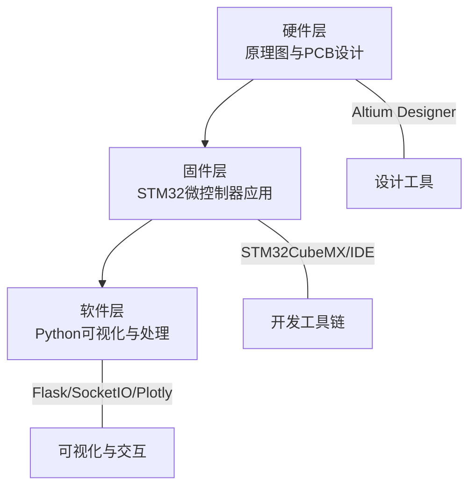
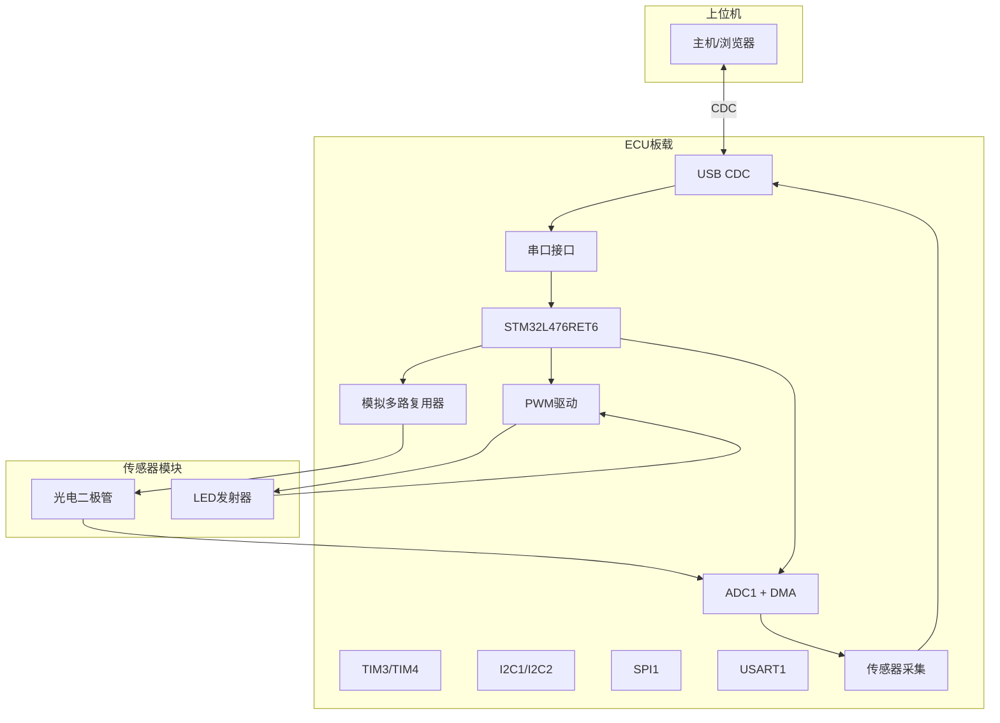
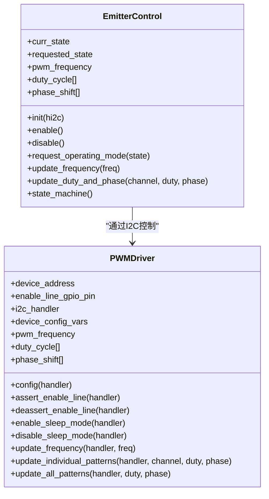
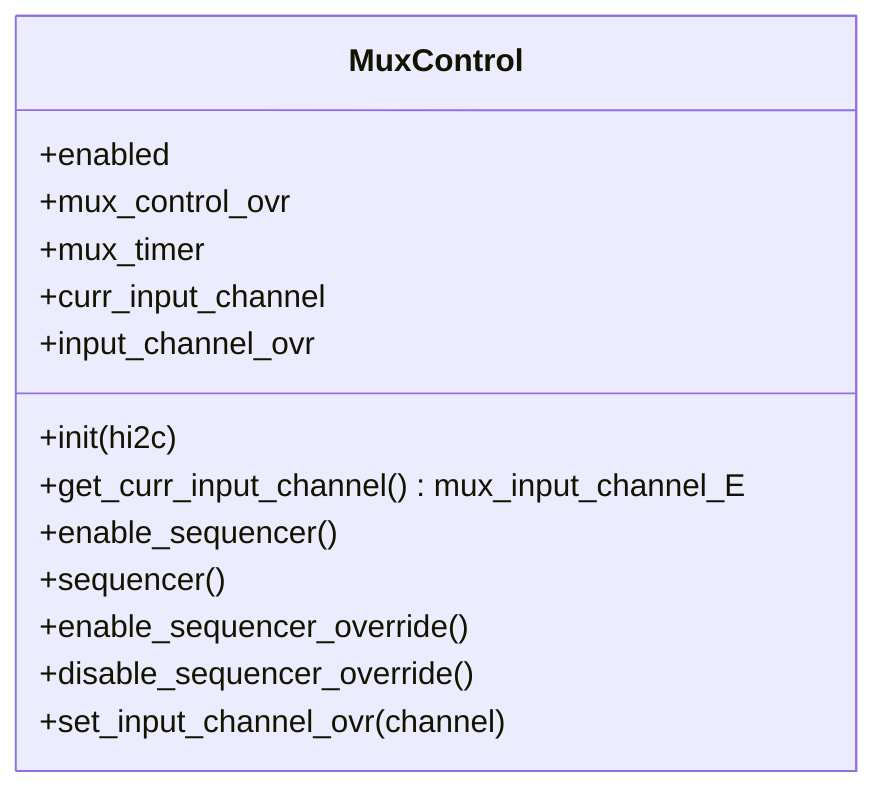
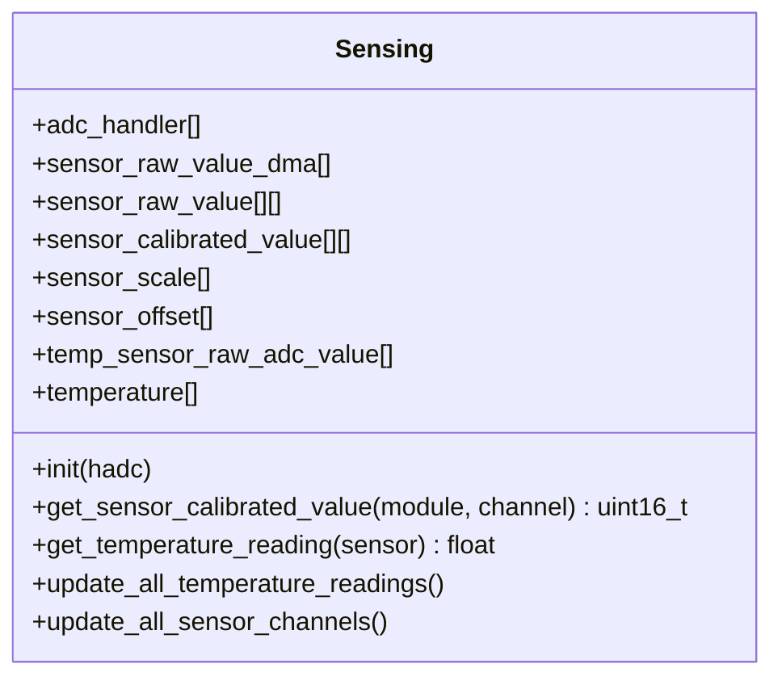
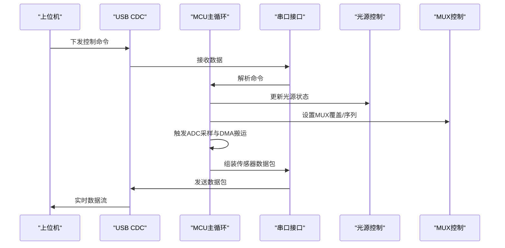
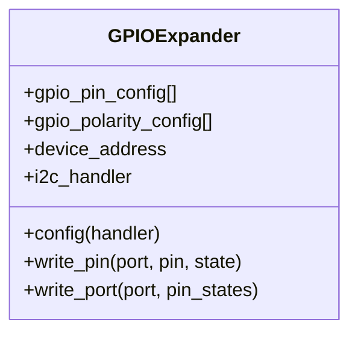
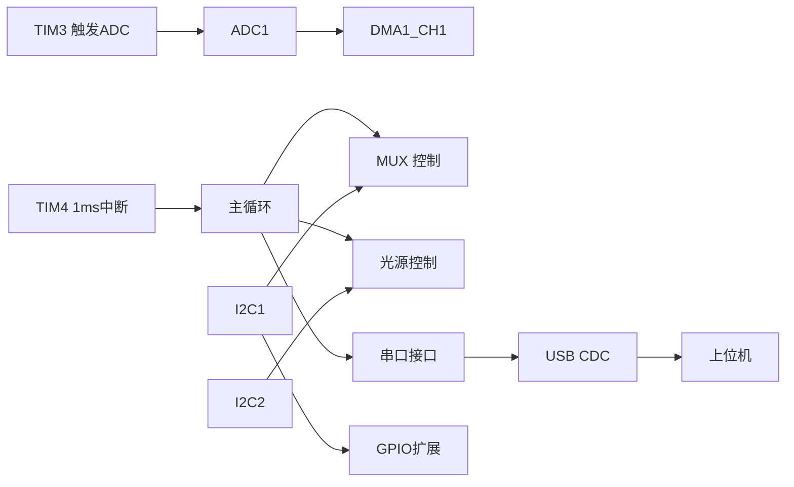

# 硬件系统概览

<cite>
**本文引用的文件**   
- [README.md](file://README.md)
- [hardware/README.md](file://hardware/README.md)
- [firmware/STM32/fNIRS/Core/Inc/main.h](file://firmware/STM32/fNIRS/Core/Inc/main.h)
- [firmware/STM32/fNIRS/Core/Inc/emitter_control.h](file://firmware/STM32/fNIRS/Core/Inc/emitter_control.h)
- [firmware/STM32/fNIRS/Core/Inc/mux_control.h](file://firmware/STM32/fNIRS/Core/Inc/mux_control.h)
- [firmware/STM32/fNIRS/Core/Inc/sensing.h](file://firmware/STM32/fNIRS/Core/Inc/sensing.h)
- [firmware/STM32/fNIRS/Core/Inc/pwm_driver.h](file://firmware/STM32/fNIRS/Core/Inc/pwm_driver.h)
- [firmware/STM32/fNIRS/Core/Inc/gpio_expander.h](file://firmware/STM32/fNIRS/Core/Inc/gpio_expander.h)
- [firmware/STM32/fNIRS/Core/Inc/serial_interface.h](file://firmware/STM32/fNIRS/Core/Inc/serial_interface.h)
- [firmware/STM32/fNIRS/Core/Src/main.c](file://firmware/STM32/fNIRS/Core/Src/main.c)
- [firmware/STM32/fNIRS/fNIRS.ioc](file://firmware/STM32/fNIRS/fNIRS.ioc)
- [hardware/fNIRS_ECU/fNIRS_ECU.Annotation](file://hardware/fNIRS_ECU/fNIRS_ECU.Annotation)
</cite>

## 目录
1. [引言](#引言)
2. [项目结构](#项目结构)
3. [核心组件](#核心组件)
4. [架构总览](#架构总览)
5. [详细组件分析](#详细组件分析)
6. [依赖分析](#依赖分析)
7. [性能考虑](#性能考虑)
8. [故障排查指南](#故障排查指南)
9. [结论](#结论)
10. [附录](#附录)

## 引言
本文件面向fNIRS硬件系统，提供从系统架构到模块化设计与可扩展性的综合说明。重点涵盖：
- 硬件系统整体设计理念与布局
- 各硬件组件之间的关系与数据流
- 技术规格、性能指标与可靠性要求
- Altium Designer工具使用与项目管理流程
- 模块化设计思路与可扩展性考量
- 硬件开发总体指导原则与最佳实践

## 项目结构
fNIRS项目采用“硬件/固件/软件”三层分离的组织方式，便于并行开发与集成验证。硬件层以Altium Designer完成原理图与PCB设计；固件层基于STM32CubeMX生成的工程，围绕STM32L476RET6微控制器实现传感器采集、光源控制与串口通信；软件层提供可视化界面与数据处理流程。

**章节来源**
- [README.md:1-19](file://README.md#L1-L19)
- [hardware/README.md:1-19](file://hardware/README.md#L1-L19)

## 核心组件
本系统的核心由以下硬件与固件组件构成：
- 微控制器单元（MCU）：STM32L476RET6，负责系统时钟、外设初始化、中断与定时器驱动、ADC/DMA采集、I2C/SPI/UART/USB等接口协调。
- 模拟多路复用器（MUX）：通过I2C扩展控制，按序选通8个传感器模块的4路检测通道，形成32路模拟输入通道。
- 光源控制（PWM驱动）：基于PCA9635类PWM控制器，实现对LED发射器的频率、占空比与相位控制，支持多波长（660nm/940nm）与多通道同步。
- 传感器采集（ADC+DMA）：配置ADC1在TIM3触发下进行多通道顺序采样，并通过DMA环形缓冲区高效搬运至内存，供后续处理。
- 串口通信（CDC USB）：通过USB CDC接口向主机发送传感器原始数据包，同时接收上位机下发的控制指令（光源模式、MUX通道选择等）。
- 扩展接口与Harness：ECU内部包含GPIO扩展、SD卡、连接器、模拟开关、缓冲器等子系统，通过Harness实现模块化装配与测试。

上述组件在固件中通过统一主循环与定时器中断协同工作，形成稳定的实时数据采集与控制闭环。

**章节来源**
- [firmware/STM32/fNIRS/Core/Inc/main.h:60-70](file://firmware/STM32/fNIRS/Core/Inc/main.h#L60-L70)
- [firmware/STM32/fNIRS/Core/Inc/mux_control.h:13-40](file://firmware/STM32/fNIRS/Core/Inc/mux_control.h#L13-L40)
- [firmware/STM32/fNIRS/Core/Inc/emitter_control.h:13-38](file://firmware/STM32/fNIRS/Core/Inc/emitter_control.h#L13-L38)
- [firmware/STM32/fNIRS/Core/Inc/sensing.h:46-61](file://firmware/STM32/fNIRS/Core/Inc/sensing.h#L46-L61)
- [firmware/STM32/fNIRS/Core/Inc/pwm_driver.h:13-62](file://firmware/STM32/fNIRS/Core/Inc/pwm_driver.h#L13-L62)
- [firmware/STM32/fNIRS/Core/Inc/serial_interface.h:40-51](file://firmware/STM32/fNIRS/Core/Inc/serial_interface.h#L40-L51)
- [firmware/STM32/fNIRS/Core/Src/main.c:132-178](file://firmware/STM32/fNIRS/Core/Src/main.c#L132-L178)

## 架构总览
系统采用“上位机控制 + MCU执行”的分层架构。上位机通过USB CDC下发控制命令，MCU解析后更新光源控制状态与MUX通道序列；同时，ADC/DMA周期性采集32路传感器信号，打包并通过CDC回传至上位机进行可视化与进一步处理。

**图表来源**
- [firmware/STM32/fNIRS/Core/Src/main.c:132-178](file://firmware/STM32/fNIRS/Core/Src/main.c#L132-L178)
- [firmware/STM32/fNIRS/Core/Inc/serial_interface.h:55-61](file://firmware/STM32/fNIRS/Core/Inc/serial_interface.h#L55-L61)
- [firmware/STM32/fNIRS/Core/Inc/sensing.h:64-69](file://firmware/STM32/fNIRS/Core/Inc/sensing.h#L64-L69)
- [firmware/STM32/fNIRS/Core/Inc/mux_control.h:43-50](file://firmware/STM32/fNIRS/Core/Inc/mux_control.h#L43-L50)
- [firmware/STM32/fNIRS/Core/Inc/emitter_control.h:41-48](file://firmware/STM32/fNIRS/Core/Inc/emitter_control.h#L41-L48)

**章节来源**
- [firmware/STM32/fNIRS/Core/Src/main.c:146-178](file://firmware/STM32/fNIRS/Core/Src/main.c#L146-L178)

## 详细组件分析

### 组件A：光源控制与PWM驱动
- 功能职责：管理LED发射器的工作模式（禁用/空闲/默认/用户控制/循环/仅660nm/仅940nm），设置频率、占空比与相位，支持多通道独立或全通道更新。
- 关键接口：通过I2C与外部PWM控制器通信，提供启用/禁用、睡眠模式切换、频率与占空比更新等API。
- 状态机：根据上位机指令或自动循环策略切换当前状态，确保多波长光源的同步与稳定输出。

**图表来源**
- [firmware/STM32/fNIRS/Core/Inc/emitter_control.h:13-48](file://firmware/STM32/fNIRS/Core/Inc/emitter_control.h#L13-L48)
- [firmware/STM32/fNIRS/Core/Inc/pwm_driver.h:13-73](file://firmware/STM32/fNIRS/Core/Inc/pwm_driver.h#L13-L73)

**章节来源**
- [firmware/STM32/fNIRS/Core/Inc/emitter_control.h:41-48](file://firmware/STM32/fNIRS/Core/Inc/emitter_control.h#L41-L48)
- [firmware/STM32/fNIRS/Core/Inc/pwm_driver.h:66-73](file://firmware/STM32/fNIRS/Core/Inc/pwm_driver.h#L66-L73)

### 组件B：模拟多路复用与通道选择
- 功能职责：在两个MUX控制器之间轮询选择输入通道（通道1~4），支持覆盖模式以便上位机直接指定通道。
- 关键接口：初始化、使能/禁用序列器、获取当前通道、进入/退出覆盖模式、设置覆盖通道。
- 协同关系：与光源控制配合，确保同一时刻只有一个检测通道被选通，避免交叉干扰。

**图表来源**
- [firmware/STM32/fNIRS/Core/Inc/mux_control.h:32-49](file://firmware/STM32/fNIRS/Core/Inc/mux_control.h#L32-L49)

**章节来源**
- [firmware/STM32/fNIRS/Core/Inc/mux_control.h:43-49](file://firmware/STM32/fNIRS/Core/Inc/mux_control.h#L43-L49)

### 组件C：传感器采集与温度监测
- 功能职责：管理ADC1的多通道采样与DMA搬运，维护每个传感器模块的原始值、校准值、标度与偏移；同时读取温度传感器数据。
- 关键接口：初始化ADC/DMA、更新所有通道值、获取校准后的传感器值、更新温度读数。
- 数据结构：定义了ADC模块、传感器模块、温度传感器枚举与对应的数据缓冲区。

**图表来源**
- [firmware/STM32/fNIRS/Core/Inc/sensing.h:46-69](file://firmware/STM32/fNIRS/Core/Inc/sensing.h#L46-L69)

**章节来源**
- [firmware/STM32/fNIRS/Core/Inc/sensing.h:64-69](file://firmware/STM32/fNIRS/Core/Inc/sensing.h#L64-L69)

### 组件D：串口接口与上位机通信
- 功能职责：解析上位机下发的控制命令（光源模式、MUX通道），并将传感器数据打包通过CDC发送。
- 关键接口：接收数据解析、查询用户控制覆盖状态、获取当前光源状态与MUX状态、发送传感器数据包。
- 数据包格式：包含每模块的高/低字节、光源状态等字段，便于上位机快速解析与显示。

**图表来源**
- [firmware/STM32/fNIRS/Core/Inc/serial_interface.h:55-61](file://firmware/STM32/fNIRS/Core/Inc/serial_interface.h#L55-L61)
- [firmware/STM32/fNIRS/Core/Src/main.c:152-178](file://firmware/STM32/fNIRS/Core/Src/main.c#L152-L178)

**章节来源**
- [firmware/STM32/fNIRS/Core/Inc/serial_interface.h:12-38](file://firmware/STM32/fNIRS/Core/Inc/serial_interface.h#L12-L38)
- [firmware/STM32/fNIRS/Core/Src/main.c:152-178](file://firmware/STM32/fNIRS/Core/Src/main.c#L152-L178)

### 组件E：GPIO扩展与系统控制
- 功能职责：通过I2C扩展GPIO端口，用于控制外部设备（如电源、使能线、背光等），支持端口级写入与极性配置。
- 关键接口：配置扩展器、写入单端口/全端口、调试读写辅助函数。

**图表来源**
- [firmware/STM32/fNIRS/Core/Inc/gpio_expander.h:26-41](file://firmware/STM32/fNIRS/Core/Inc/gpio_expander.h#L26-L41)

**章节来源**
- [firmware/STM32/fNIRS/Core/Inc/gpio_expander.h:38-41](file://firmware/STM32/fNIRS/Core/Inc/gpio_expander.h#L38-L41)

## 依赖分析
- 外设依赖：ADC1使用DMA搬运，TIM3作为触发源，TIM4用于1ms基准中断；I2C1/I2C2分别驱动MUX/PWM与GPIO扩展；SPI1用于片选控制；USART1用于调试打印；USB用于CDC通信。
- 软件依赖：主循环中依次调用MUX序列器、光源状态机、串口解析与LED闪烁；定时器中断驱动状态机推进。
- 设计约束：ADC通道数量与MUX通道组合决定最大并发检测数；PWM通道数决定可独立控制的发射器组数；USB带宽限制决定上报速率上限。

**图表来源**
- [firmware/STM32/fNIRS/fNIRS.ioc:307-316](file://firmware/STM32/fNIRS/fNIRS.ioc#L307-L316)
- [firmware/STM32/fNIRS/Core/Src/main.c:140-141](file://firmware/STM32/fNIRS/Core/Src/main.c#L140-L141)

**章节来源**
- [firmware/STM32/fNIRS/fNIRS.ioc:58-84](file://firmware/STM32/fNIRS/fNIRS.ioc#L58-L84)
- [firmware/STM32/fNIRS/Core/Src/main.c:118-129](file://firmware/STM32/fNIRS/Core/Src/main.c#L118-L129)

## 性能考虑
- 采样与传输速率：ADC配置为多通道顺序采样并启用DMA环形传输，结合TIM3触发与TIM4中断，保证稳定采样节奏与低CPU占用。
- 带宽与延迟：USB CDC为全速端点，需根据数据包大小与上位机轮询策略平衡实时性与吞吐量。
- 功耗与热管理：LED光源采用PWM调光，建议在空闲时段降低占空比或进入睡眠模式；温度传感器用于热阈值监控与保护。
- 可靠性：I2C总线采用快模式配置，注意走线长度与上拉电阻匹配；ADC采样通道数量与采样时间需权衡精度与速率。

[本节为通用性能讨论，不直接分析具体文件]

## 故障排查指南
- 无法建立USB通信：检查CDC设备枚举、驱动安装与端口占用；确认上位机侧串口配置正确。
- 无ADC数据：检查ADC引脚映射、DMA中断使能、TIM3触发配置；核对采样通道与极性设置。
- MUX或PWM异常：确认I2C地址与波特率配置一致；检查使能线与电源供电；验证寄存器写入路径。
- 温度读数异常：检查温度传感器接线与参考电压；核对校准参数与换算公式。
- 上位机控制无效：确认控制命令格式与数据包索引；检查覆盖模式是否被意外启用。

**章节来源**
- [firmware/STM32/fNIRS/Core/Inc/serial_interface.h:12-38](file://firmware/STM32/fNIRS/Core/Inc/serial_interface.h#L12-L38)
- [firmware/STM32/fNIRS/fNIRS.ioc:120-134](file://firmware/STM32/fNIRS/fNIRS.ioc#L120-L134)

## 结论
本硬件系统以STM32L476RET6为核心，结合ADC+DMA、I2C扩展、PWM控制与USB CDC通信，实现了对24个传感器模块（32路检测通道）的同步采集与远程控制。通过模块化的硬件设计与清晰的固件接口，系统具备良好的可扩展性与可维护性。建议在后续迭代中进一步完善EMC设计、优化USB带宽利用与引入更丰富的保护机制。

[本节为总结性内容，不直接分析具体文件]

## 附录

### 技术规格与性能指标
- 微控制器：STM32L476RET6（LQFP64封装）
- ADC：ADC1，多通道顺序采样，DMA环形传输
- 定时器：TIM3触发ADC，TIM4产生1ms基准中断
- 通信：I2C1/I2C2（快模式），SPI1，USART1，USB CDC
- 传感器：最多8个模块 × 4通道 = 32路检测通道
- 光源：最多16路PWM通道，支持双波长（660nm/940nm）

**章节来源**
- [firmware/STM32/fNIRS/fNIRS.ioc:66-84](file://firmware/STM32/fNIRS/fNIRS.ioc#L66-L84)
- [firmware/STM32/fNIRS/fNIRS.ioc:307-316](file://firmware/STM32/fNIRS/fNIRS.ioc#L307-L316)

### Altium Designer使用与项目管理
- 项目组织：每个子系统（ECU、传感器模块、接插件、线束等）独立PrjPcb项目，便于并行设计与版本控制。
- Harness管理：通过Harness文件将多个SchDoc与PrjPcb关联，统一管理连接关系与装配约束。
- Annotation映射：ECU的Annotation文件记录逻辑/物理设计号映射，有助于装配与测试阶段的定位与追踪。
- 工具链：建议在Altium中启用DRC/ERC规则检查，保持3D模型与PCB同步，导出Gerber/钻孔文件前进行生产检查清单核对。

**章节来源**
- [hardware/README.md:7-16](file://hardware/README.md#L7-L16)
- [hardware/fNIRS_ECU/fNIRS_ECU.Annotation:1-20](file://hardware/fNIRS_ECU/fNIRS_ECU.Annotation#L1-L20)

### 模块化设计与可扩展性
- 硬件层面：采用Harness与标准化连接器，便于替换与升级；GPIO扩展器提供额外I/O资源。
- 固件层面：功能模块化（光源控制、MUX控制、传感器采集、串口接口），通过统一初始化与主循环集成。
- 扩展方向：增加传感器模块数量可通过扩展MUX或并行化ADC通道；提升光源控制能力可通过增加PWM控制器或更高分辨率的调制策略。

**章节来源**
- [firmware/STM32/fNIRS/Core/Inc/mux_control.h:13-30](file://firmware/STM32/fNIRS/Core/Inc/mux_control.h#L13-L30)
- [firmware/STM32/fNIRS/Core/Inc/pwm_driver.h:13-33](file://firmware/STM32/fNIRS/Core/Inc/pwm_driver.h#L13-L33)

### 硬件开发指导原则与最佳实践
- 设计原则：模块化、可测试性、可维护性优先；明确接口契约与数据流边界。
- 信号完整性：高频时钟与I2C走线尽量短且相邻，避免串扰；ADC模拟地与数字地分离。
- 功耗与热设计：合理设置PWM占空比与时序，预留温度监测与保护机制。
- 版本与变更：在Altium中使用版本标签与注释，记录修改原因与影响范围；固件侧通过宏开关与条件编译支持调试与发布分支。

[本节为通用指导原则，不直接分析具体文件]