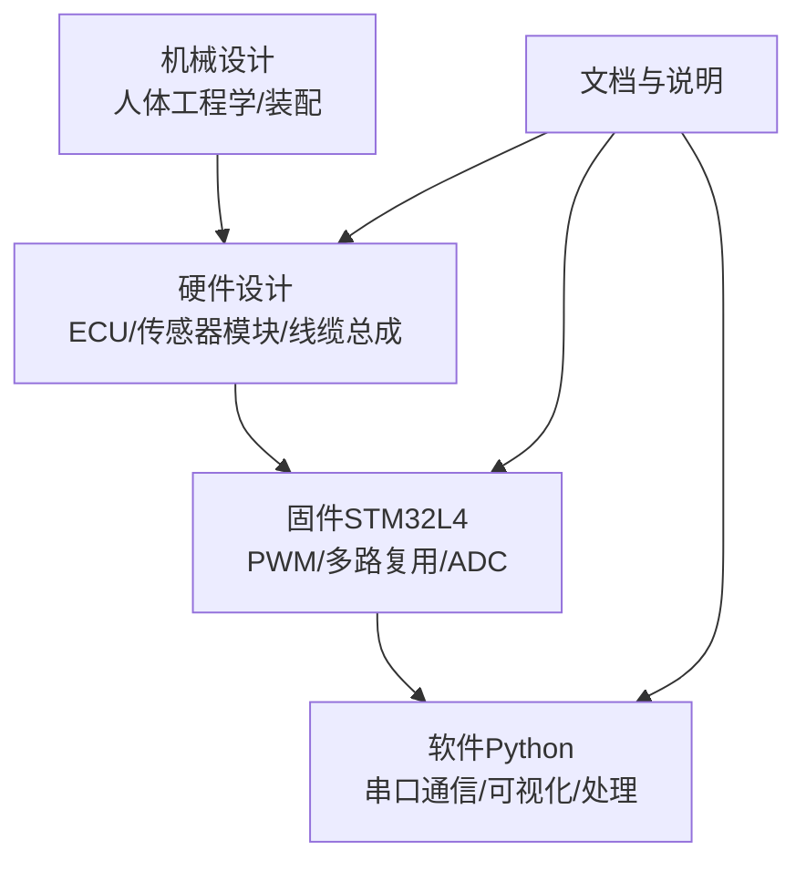
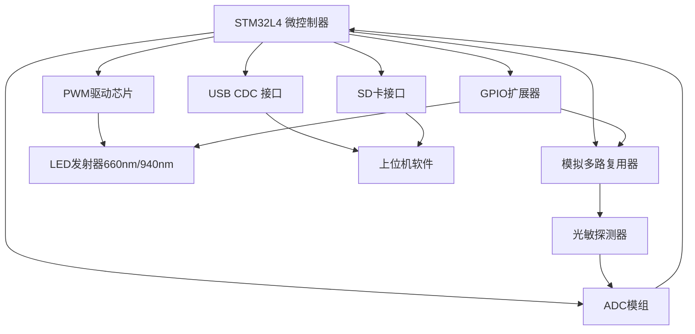
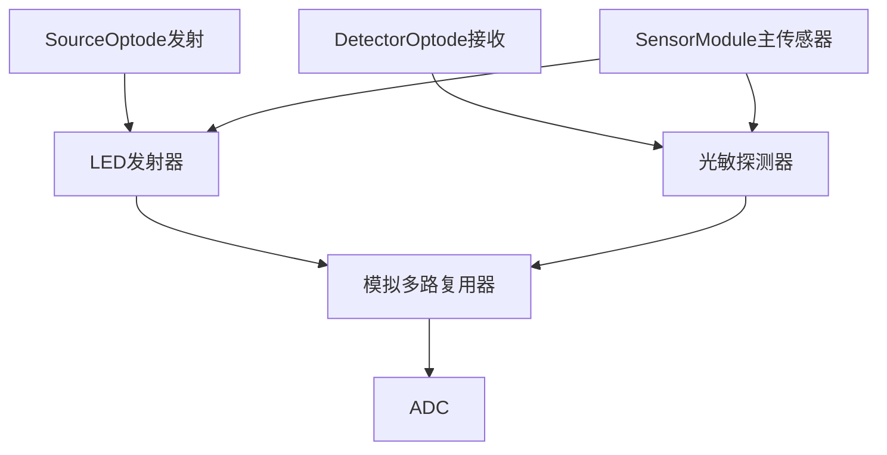
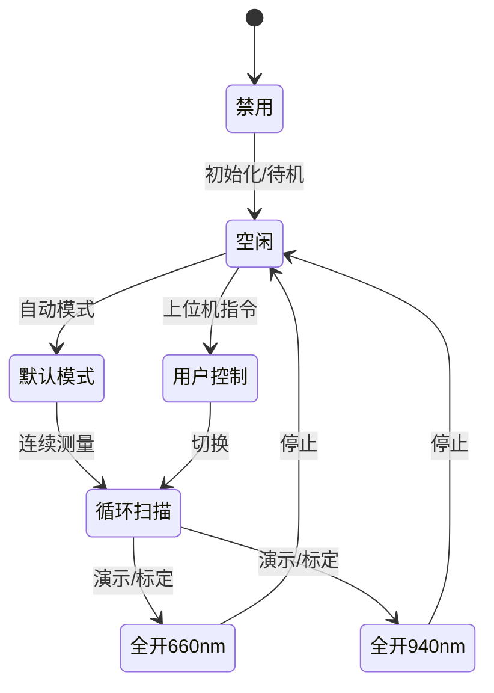
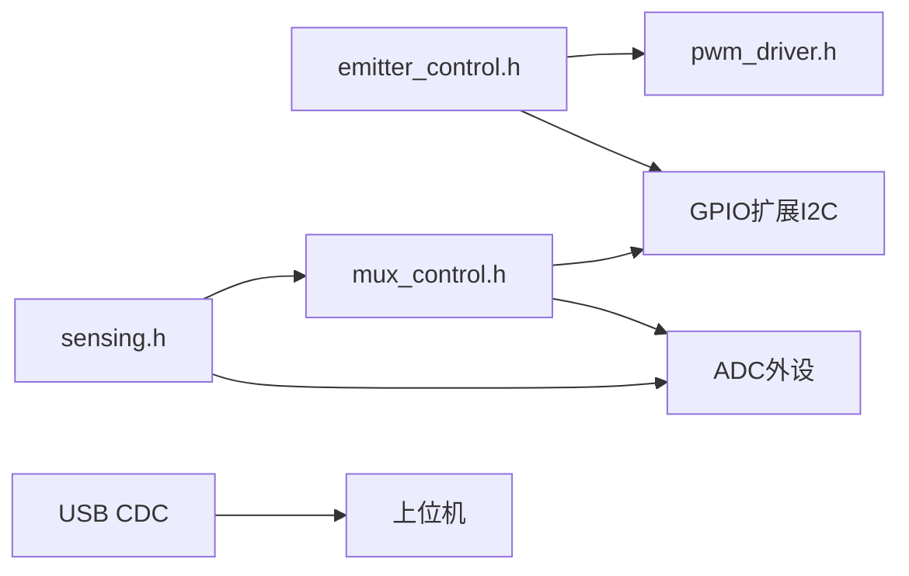

# 硬件设计

<cite>
**本文引用的文件**
- [README.md](file://README.md)
- [hardware/README.md](file://hardware/README.md)
- [mechanical/README.md](file://mechanical/README.md)
- [software/README.md](file://software/README.md)
- [hardware/fNIRS_ECU/fNIRS_ECU.Annotation](file://hardware/fNIRS_ECU/fNIRS_ECU.Annotation)
- [hardware/fNIRS_ECU/fNIRS_ECU.PrjPcb](file://hardware/fNIRS_ECU/fNIRS_ECU.PrjPcb)
- [hardware/fNIRS_sensor_module/SensorModule.PrjPcb](file://hardware/fNIRS_sensor_module/SensorModule.PrjPcb)
- [hardware/DetectorOptode/DetectorOptode.PrjPcb](file://hardware/DetectorOptode/DetectorOptode.PrjPcb)
- [hardware/SourceOptode/SourceOptode.PrjPcb](file://hardware/SourceOptode/SourceOptode.PrjPcb)
- [firmware/STM32/fNIRS/Core/Inc/main.h](file://firmware/STM32/fNIRS/Core/Inc/main.h)
- [firmware/STM32/fNIRS/Core/Inc/emitter_control.h](file://firmware/STM32/fNIRS/Core/Inc/emitter_control.h)
- [firmware/STM32/fNIRS/Core/Inc/mux_control.h](file://firmware/STM32/fNIRS/Core/Inc/mux_control.h)
- [firmware/STM32/fNIRS/Core/Inc/pwm_driver.h](file://firmware/STM32/fNIRS/Core/Inc/pwm_driver.h)
- [firmware/STM32/fNIRS/Core/Inc/sensing.h](file://firmware/STM32/fNIRS/Core/Inc/sensing.h)
</cite>

## 目录
1. [简介](#简介)
2. [项目结构](#项目结构)
3. [核心组件](#核心组件)
4. [架构总览](#架构总览)
5. [详细组件分析](#详细组件分析)
6. [依赖关系分析](#依赖关系分析)
7. [性能考量](#性能考量)
8. [故障排查指南](#故障排查指南)
9. [结论](#结论)
10. [附录](#附录)

## 简介
本技术文档面向fNIRS硬件系统，聚焦于电气控制单元（ECU）的整体设计理念与实现方案，详述传感器模块的电路设计、光学配置与信号调理路径，阐述机械结构的人体工程学考量与装配要求，并系统化梳理各PCB板的功能分工、电气连接关系与接口规范。同时，结合固件侧头文件中的控制状态机与驱动接口，给出硬件组件选型依据、性能参数与可靠性考虑，提供调试与故障诊断方法，为硬件工程师与系统集成人员提供完整的设计参考。

## 项目结构
仓库采用分层组织：硬件（Altium设计）、固件（STM32工程）、软件（数据采集与可视化）、机械与文档说明。硬件目录下包含多个子项目，涵盖ECU主控板、传感器模块（含仅发射/仅接收）、线缆总成与ST-Link转接板；固件以STM32L4系列MCU为核心，通过PWM驱动、模拟多路复用与ADC采集实现同步控制与数据读出；软件提供实时可视化与后处理流程。

章节来源
- [README.md:1-19](file://README.md#L1-L19)
- [hardware/README.md:1-19](file://hardware/README.md#L1-L19)

## 核心组件
- 电气控制单元（ECU）：围绕低功耗STM32微控制器构建，负责LED光源PWM控制、模拟通道多路复用切换、ADC采样与温度监测、USB串口通信以及SD卡存储等。
- 传感器模块：每个模块集成本地LED发射器与光敏探测器，支持双波长（660nm/940nm）与多通道检测，通过ECU的多路复用与同步控制实现高密度阵列测量。
- 机械结构：强调佩戴舒适性与长期稳定性的设计，确保传感器与ECU在运动场景下的可靠耦合与信号完整性。
- 接口与连接：ECU提供USB CDC接口用于上位机通信，传感器模块通过专用连接器与线缆总成实现即插即用式装配。

章节来源
- [README.md:13-19](file://README.md#L13-L19)
- [hardware/README.md:7-16](file://hardware/README.md#L7-L16)
- [software/README.md:3-48](file://software/README.md#L3-L48)

## 架构总览
ECU作为系统中枢，通过I2C扩展与PWM驱动芯片对多路LED发射器进行精确控制；通过模拟多路复用器选择不同传感器模块的探测通道；借助ADC完成光电信号到数字量的转换；并通过USB CDC与上位机交互，实现模式切换、参数调节与数据导出。温度传感器用于环境补偿与热漂抑制；SD卡用于本地数据记录。

图表来源
- [firmware/STM32/fNIRS/Core/Inc/emitter_control.h:13-38](file://firmware/STM32/fNIRS/Core/Inc/emitter_control.h#L13-L38)
- [firmware/STM32/fNIRS/Core/Inc/mux_control.h:13-40](file://firmware/STM32/fNIRS/Core/Inc/mux_control.h#L13-L40)
- [firmware/STM32/fNIRS/Core/Inc/pwm_driver.h:13-62](file://firmware/STM32/fNIRS/Core/Inc/pwm_driver.h#L13-L62)
- [firmware/STM32/fNIRS/Core/Inc/sensing.h:13-61](file://firmware/STM32/fNIRS/Core/Inc/sensing.h#L13-L61)

## 详细组件分析

### 电气控制单元（ECU）设计
- 功能定位：集中控制LED光源、模拟通道选择、ADC采样、温度监测、USB通信与数据存储。
- 关键接口：
  - USB CDC：用于与上位机通信，传输控制指令与采集数据。
  - I2C扩展与GPIO扩展：扩展I/O与控制LED/多路复用器。
  - PWM驱动：提供多路独立占空比与相位控制，满足多波长与多通道同步需求。
  - ADC：多通道同步采集，DMA搬运原始数据。
  - SD卡：本地数据落盘，支持离线记录。
- 设计要点：
  - 低功耗与稳定性：选用低功耗MCU与稳压电源，保证长时间佩戴与稳定采样。
  - 抗干扰：合理布局地平面、去耦电容与屏蔽走线，降低EMI影响。
  - 可靠性：过流/过压保护、热监测与异常恢复机制。

章节来源
- [hardware/fNIRS_ECU/fNIRS_ECU.PrjPcb:52-118](file://hardware/fNIRS_ECU/fNIRS_ECU.PrjPcb#L52-L118)
- [firmware/STM32/fNIRS/Core/Inc/main.h:60-70](file://firmware/STM32/fNIRS/Core/Inc/main.h#L60-L70)

### 传感器模块（含发射/接收）
- 发射端（SourceOptode）：集成LED发射器（典型波长660nm/940nm），由ECU的PWM驱动芯片按通道独立控制。
- 接收端（DetectorOptode）：集成光敏探测器，经由ECU的模拟多路复用器选择对应通道，再送入ADC。
- 主传感器模块（SensorModule）：在同一PCB上集成发射与接收，形成完整的探头单元，便于装配与一致性校准。

图表来源
- [hardware/SourceOptode/SourceOptode.PrjPcb:52-118](file://hardware/SourceOptode/SourceOptode.PrjPcb#L52-L118)
- [hardware/DetectorOptode/DetectorOptode.PrjPcb:52-118](file://hardware/DetectorOptode/DetectorOptode.PrjPcb#L52-L118)
- [hardware/fNIRS_sensor_module/SensorModule.PrjPcb:86-118](file://hardware/fNIRS_sensor_module/SensorModule.PrjPcb#L86-L118)

### 模拟多路复用与信号调理
- 多路复用器：通过I2C扩展或专用控制引脚选择不同传感器模块的探测通道，实现多通道并行测量。
- 信号调理：探测器输出经PGA/滤波/采样保持后进入ADC；温度传感器辅助进行温度补偿。
- 同步采样：多路复用器与时钟同步，确保各通道在相同时间窗口内完成采样。

章节来源
- [firmware/STM32/fNIRS/Core/Inc/mux_control.h:13-40](file://firmware/STM32/fNIRS/Core/Inc/mux_control.h#L13-L40)
- [firmware/STM32/fNIRS/Core/Inc/sensing.h:13-61](file://firmware/STM32/fNIRS/Core/Inc/sensing.h#L13-L61)

### PWM驱动与LED控制
- 控制状态机：支持禁用、空闲、默认模式、用户控制、循环扫描、全开660nm/940nm等多种状态，满足不同实验与演示需求。
- 频率与占空比：可针对单通道或全通道更新频率、占空比与相位，实现多波长与相位解混。
- 扩展能力：通过GPIO扩展器与I2C设备地址配置，灵活扩展控制通道数量。

图表来源
- [firmware/STM32/fNIRS/Core/Inc/emitter_control.h:13-24](file://firmware/STM32/fNIRS/Core/Inc/emitter_control.h#L13-L24)

章节来源
- [firmware/STM32/fNIRS/Core/Inc/emitter_control.h:26-38](file://firmware/STM32/fNIRS/Core/Inc/emitter_control.h#L26-L38)
- [firmware/STM32/fNIRS/Core/Inc/pwm_driver.h:35-62](file://firmware/STM32/fNIRS/Core/Inc/pwm_driver.h#L35-L62)

### ADC采集与温度监测
- ADC模块：支持多传感器模块与多输入通道的同步采集，DMA搬运原始数据，减轻CPU负载。
- 温度监测：内置温度传感器用于环境温度补偿与热漂抑制，提升测量精度。
- 数据缓冲：提供原始值、校正值、缩放因子与偏移量等结构化数据，便于后续处理。

章节来源
- [firmware/STM32/fNIRS/Core/Inc/sensing.h:46-61](file://firmware/STM32/fNIRS/Core/Inc/sensing.h#L46-L61)

### 机械结构与装配
- 人体工程学：头带/固定座设计需兼顾贴合性与透气性，减少运动伪影与接触阻抗变化。
- 装配要求：传感器与ECU连接器应具备防误插设计与锁定机构；线缆总成需有足够扭转与拉伸保护。
- 可靠性：连接器与PCB焊点需满足振动与疲劳测试要求；标识与极性提示清晰。

章节来源
- [mechanical/README.md:1-2](file://mechanical/README.md#L1-L2)

## 依赖关系分析
- 固件侧组件耦合：
  - 发光控制（emitter_control）依赖PWM驱动（pwm_driver）与GPIO扩展（gpio_expander）。
  - 采样控制（sensing）依赖多路复用（mux_control）与ADC外设。
  - USB CDC用于与上位机通信，承载控制命令与数据回传。
- 硬件侧依赖：
  - ECU通过I2C与外部PWM/多路复用扩展芯片通信。
  - 传感器模块通过专用连接器与线缆总成接入ECU。

图表来源
- [firmware/STM32/fNIRS/Core/Inc/emitter_control.h:40-48](file://firmware/STM32/fNIRS/Core/Inc/emitter_control.h#L40-L48)
- [firmware/STM32/fNIRS/Core/Inc/mux_control.h:42-50](file://firmware/STM32/fNIRS/Core/Inc/mux_control.h#L42-L50)
- [firmware/STM32/fNIRS/Core/Inc/sensing.h:63-69](file://firmware/STM32/fNIRS/Core/Inc/sensing.h#L63-L69)

章节来源
- [firmware/STM32/fNIRS/Core/Inc/main.h:60-70](file://firmware/STM32/fNIRS/Core/Inc/main.h#L60-L70)

## 性能考量
- 采样速率与通道数：多通道同步采样会增加ADC与DMA负载，需根据MCU主频与ADC配置优化采样周期。
- PWM分辨率与相位：提高PWM分辨率与相位控制精度可改善多波长解混效果，但会增加I2C写入与寄存器更新频率。
- 信噪比（SNR）：探测器前端滤波与屏蔽、合理的PCB布线与接地策略可显著提升SNR。
- 功耗管理：在非测量时段降低LED功率或进入睡眠模式，延长电池续航。
- 温度补偿：利用温度传感器进行实时补偿，减少热漂对光谱强度的影响。

## 故障排查指南
- 无数据/采样异常
  - 检查ADC初始化与DMA配置是否正确，确认中断与缓冲区指针有效。
  - 核对多路复用器选择逻辑，确保通道切换时序正确。
- LED不亮/亮度异常
  - 核对PWM驱动芯片使能线与I2C配置，检查设备地址与寄存器写入。
  - 验证发光控制状态机是否处于期望状态，确认频率/占空比/相位设置。
- 通信问题（USB CDC）
  - 确认USB枚举与CDC类配置，检查串口波特率与缓冲区溢出。
- 温度读数异常
  - 校验温度传感器供电与参考电压，确认ADC通道映射与标定系数。
- 机械装配问题
  - 检查连接器插接力与锁定机构，避免接触电阻增大导致信号衰减。

章节来源
- [software/README.md:65-100](file://software/README.md#L65-L100)
- [firmware/STM32/fNIRS/Core/Inc/sensing.h:63-69](file://firmware/STM32/fNIRS/Core/Inc/sensing.h#L63-L69)

## 结论
本设计以STM32L4为核心，结合PWM驱动、模拟多路复用与ADC采集，实现了对多传感器模块的高密度、同步、可配置测量。ECU通过USB CDC与上位机交互，支持实时监控与离线记录。硬件层面注重低功耗、抗干扰与可靠性，软件提供灵活的数据采集与可视化工具。通过明确的接口规范与调试流程，可快速定位问题并优化系统性能。

## 附录
- 硬件项目清单（来自硬件README）
  - DetectorOptode：仅含探测器的传感器PCB
  - STLINK_Breakout：ST-Link编程转接板
  - SourceOptode：仅含发射器的传感器PCB
  - fNIRS_CableAssembly：产品中使用的线缆总成
  - fNIRS_ECU：整机电气控制单元PCB
  - fNIRS_sensor_module：含发射与接收的主传感器PCB
- ECU注释与连接关系
  - 通过注释文件可查看连接器、MCU、USB接口、GPIO扩展、SD卡、模拟多路复用与缓冲等子图之间的物理与逻辑关联。

章节来源
- [hardware/README.md:7-16](file://hardware/README.md#L7-L16)
- [hardware/fNIRS_ECU/fNIRS_ECU.Annotation:1-800](file://hardware/fNIRS_ECU/fNIRS_ECU.Annotation#L1-L800)