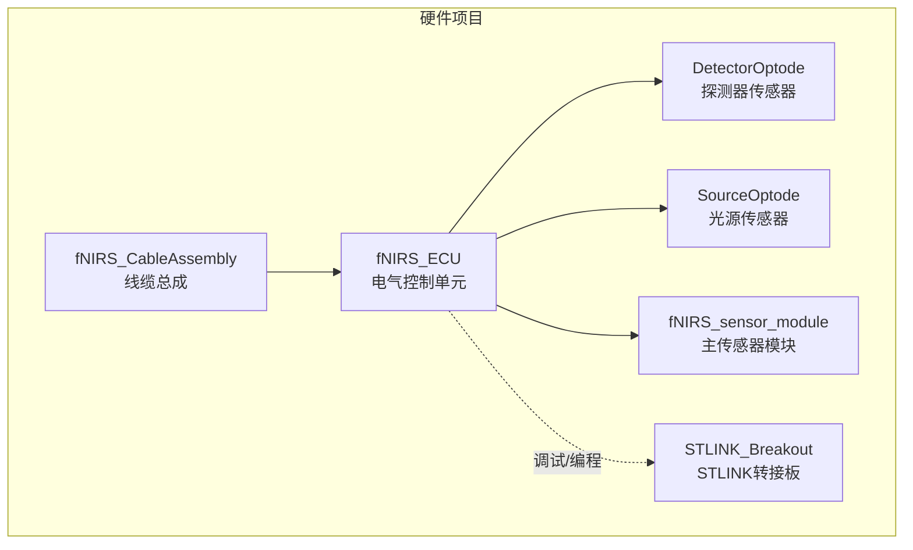
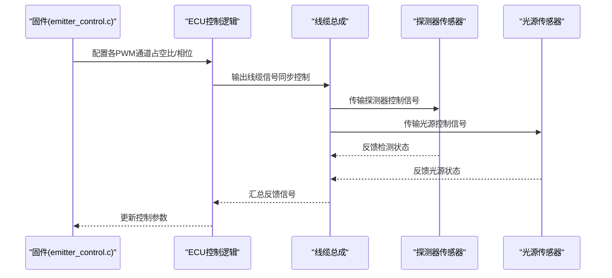
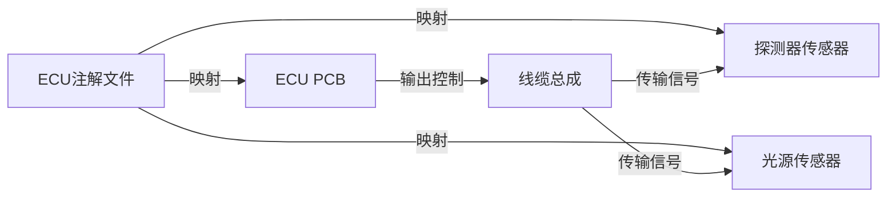

# 线缆组件设计

<cite>
**本文档引用的文件**
- [fNIRS_CableAssembly.PrjPcb](file://hardware/fNIRS_CableAssembly/fNIRS_CableAssembly.PrjPcb)
- [fNIRS_ECU.Annotation](file://hardware/fNIRS_ECU/fNIRS_ECU.Annotation)
- [fNIRS_ECU.PrjPcb](file://hardware/fNIRS_ECU/fNIRS_ECU.PrjPcb)
- [README.md](file://hardware/README.md)
- [README.md](file://README.md)
- [emitter_control.c](file://firmware/STM32/fNIRS/Core/Src/emitter_control.c)
</cite>

## 目录
1. [引言](#引言)
2. [项目结构](#项目结构)
3. [核心组件](#核心组件)
4. [架构总览](#架构总览)
5. [详细组件分析](#详细组件分析)
6. [依赖关系分析](#依赖关系分析)
7. [性能考虑](#性能考虑)
8. [故障排查指南](#故障排查指南)
9. [结论](#结论)
10. [附录](#附录)

## 引言
本文件面向fNIRS线缆组件设计，聚焦于线缆的电气设计（信号线、电源线、地线布线策略）、屏蔽与EMI防护、信号完整性保障、连接器选择与接口规范、机械可靠性、线缆长度与阻抗匹配、信号衰减优化、测试标准与质量控制、以及整机装配与连接流程。目标是为线缆设计工程师与装配技术人员提供完整的设计参考。

## 项目结构
线缆组件属于“线缆总成（fNIRS_CableAssembly）”项目，配套有ECU（电气控制单元）注解文件与输出工程配置。整体硬件项目使用Altium Designer进行设计与输出管理。

**图表来源**
- [README.md:1-19](file://hardware/README.md#L1-L19)

**章节来源**
- [README.md:1-19](file://hardware/README.md#L1-L19)
- [README.md:1-19](file://README.md#L1-L19)

## 核心组件
- 线缆总成（fNIRS_CableAssembly）
  - 包含系统线束（System Wiring）、传感线缆（Sensing Cables）、电源线缆（Power Cable）等子图文档，用于最终产品装配。
  - 工程配置支持多种输出：网络表、装配图、钻孔图、Gerber、IPC-2581、测试点报告等，便于制造与装配。
- ECU注解（fNIRS_ECU.Annotation）
  - 映射逻辑设计器与物理PCB元件编号，确保线缆连接器与传感器连接器的正确对应。
- ECU工程（fNIRS_ECU.PrjPcb）
  - 提供ERC（电气规则检查）与差异级别设置，支撑设计验证与一致性检查。

**章节来源**
- [fNIRS_CableAssembly.PrjPcb:362-393](file://hardware/fNIRS_CableAssembly/fNIRS_CableAssembly.PrjPcb#L362-L393)
- [fNIRS_CableAssembly.PrjPcb:857-980](file://hardware/fNIRS_CableAssembly/fNIRS_CableAssembly.PrjPcb#L857-L980)
- [fNIRS_ECU.Annotation:1-179](file://hardware/fNIRS_ECU/fNIRS_ECU.Annotation#L1-L179)
- [fNIRS_ECU.Annotation:763-811](file://hardware/fNIRS_ECU/fNIRS_ECU.Annotation#L763-L811)
- [fNIRS_ECU.PrjPcb:962-997](file://hardware/fNIRS_ECU/fNIRS_ECU.PrjPcb#L962-L997)
- [fNIRS_ECU.PrjPcb:1404-1527](file://hardware/fNIRS_ECU/fNIRS_ECU.PrjPcb#L1404-L1527)

## 架构总览
线缆组件在系统中的作用是连接ECU与各传感器模块（探测器与光源），实现同步控制与数据采集。发射器控制由ECU侧固件驱动，通过线缆传输PWM相位与占空比信号至各模块。

**图表来源**
- [emitter_control.c:48-91](file://firmware/STM32/fNIRS/Core/Src/emitter_control.c#L48-L91)
- [fNIRS_ECU.Annotation:1-179](file://hardware/fNIRS_ECU/fNIRS_ECU.Annotation#L1-L179)

## 详细组件分析

### 信号线布线策略
- 同步控制信号（PWM/相位）：来自ECU的多路PWM输出，需在长线缆中保持相位一致性与占空比精度，建议采用差分或屏蔽双绞线以抑制共模干扰。
- 模拟传感信号：从传感器模块经线缆传输至ECU，应避免与强电/高频信号平行走线，必要时采用隔离与滤波。
- 数字通信（如USB/串口）：线缆长度需满足信号上升/下降时间与带宽要求，避免过长导致信号失真。

**章节来源**
- [emitter_control.c:48-91](file://firmware/STM32/fNIRS/Core/Src/emitter_control.c#L48-L91)

### 电源线与地线布线策略
- 电源线：根据模块功耗与压降要求选择截面积，尽量缩短回流路径，减少IR压降与环路面积。
- 地线：采用星形或多点就近接地，避免形成地环路；在高频开关场景下，建议使用大面积地平面并增加去耦电容。
- 电源完整性：在关键电源节点增加滤波与稳压，确保EMI与瞬态抑制能力。

### 屏蔽设计与EMI防护
- 屏蔽层：对敏感模拟信号与高频数字信号采用双轴编织屏蔽，屏蔽层单端接地于接收端设备机壳。
- 走线策略：高频信号线与电源线尽量分离，避免平行长段耦合；必要时采用蛇形走线以调节阻抗。
- 接地连续性：屏蔽层与地平面保持良好连接，避免断点造成屏蔽失效。

### 信号完整性保证
- 阻抗控制：根据线缆介质与结构，计算特性阻抗（典型值50Ω或100Ω差分），在生产阶段严格控制线径与介质厚度。
- 端接：源端与负载端采用匹配电阻，减少反射；对于高速数字信号，注意终端匹配与信号回路完整性。
- 布线长度匹配：对差分对与同组信号线，尽量保持等长，以降低时序偏差。

### 连接器选择与接口规范
- 连接器类型：优先选用高密度、低插拔力、自定位可靠的连接器，确保在可穿戴场景下的机械稳定性。
- 触点材料：采用低电阻、耐氧化材料，配合适当的镀层（如金或锡铅）以保证长期接触可靠性。
- 机械固定：采用卡扣/螺纹固定方式，结合线缆扭转与拉力测试，验证装配强度与疲劳寿命。
- 可靠性：连接器需满足振动、冲击与温度循环试验要求，确保在运动场景下的稳定连接。

**章节来源**
- [fNIRS_ECU.Annotation:1-179](file://hardware/fNIRS_ECU/fNIRS_ECU.Annotation#L1-L179)
- [fNIRS_ECU.Annotation:763-811](file://hardware/fNIRS_ECU/fNIRS_ECU.Annotation#L763-L811)

### 线缆长度、阻抗匹配与信号衰减
- 线缆长度：依据最大模块间距与布线空间确定，优先采用最短有效路径，减少不必要的弯曲与交叉。
- 阻抗匹配：根据信号频率与PCB走线阻抗，计算线缆特性阻抗与端接电阻，避免反射与振铃。
- 信号衰减：高频信号在长线缆中存在趋肤效应与介质损耗，需通过线径、介质与屏蔽设计降低插入损耗。

### 测试标准与质量控制
- 设计验证
  - ERC（电气规则检查）：确保无开路、短路、悬空等错误，参考ECU工程的ERC配置。
  - DRC（设计规则检查）：检查线宽/间距/焊盘/过孔等是否满足制造能力。
- 制造与装配
  - Gerber/IPC-2581输出：用于PCB制造与装配。
  - Pick & Place/测试点报告：指导自动化贴片与在线测试。
- 功能测试
  - 连通性测试：使用万用表或飞线测试确认导通与极性。
  - 屏蔽连续性：测量屏蔽层对地电阻，确保单点接地。
  - 阻抗测试：使用时域反射仪（TDR）或网络分析仪验证阻抗一致性。
  - 信号完整性：在最高工作频率下测量眼图、抖动与误码率。
- 可靠性评估
  - 振动/冲击试验：模拟运输与穿戴过程中的机械应力。
  - 温度循环：验证连接器与线缆材料在热胀冷缩下的稳定性。
  - 湿热试验：评估长期存储与使用环境下的绝缘与接触可靠性。

**章节来源**
- [fNIRS_CableAssembly.PrjPcb:362-393](file://hardware/fNIRS_CableAssembly/fNIRS_CableAssembly.PrjPcb#L362-L393)
- [fNIRS_ECU.PrjPcb:962-997](file://hardware/fNIRS_ECU/fNIRS_ECU.PrjPcb#L962-L997)
- [fNIRS_ECU.PrjPcb:1404-1527](file://hardware/fNIRS_ECU/fNIRS_ECU.PrjPcb#L1404-L1527)

### 装配工艺与连接流程
- 装配前准备
  - 根据注解文件核对连接器与传感器编号对应关系，准备正确的线缆总成。
  - 准备必要的工具（压接钳、热风枪、烙铁、扭矩扳手等）。
- 连接步骤
  - 将线缆连接器与传感器连接器对准，确保方向正确与触点对齐。
  - 使用合适的压接/焊接工艺，保证接触电阻与机械强度达标。
  - 对屏蔽层进行可靠接地，避免屏蔽失效。
- 质量检查
  - 外观检查：无划伤、变形、虚焊等缺陷。
  - 功能测试：通电后验证控制信号与传感信号正常。
  - 记录与标识：对关键连接进行标识与记录，便于后续维护。

**章节来源**
- [fNIRS_ECU.Annotation:1-179](file://hardware/fNIRS_ECU/fNIRS_ECU.Annotation#L1-L179)

## 依赖关系分析
线缆组件与ECU、传感器模块之间存在明确的电气与机械依赖关系。注解文件将逻辑设计器与物理PCB元件关联，确保线缆连接器与传感器连接器的正确映射。

**图表来源**
- [fNIRS_ECU.Annotation:1-179](file://hardware/fNIRS_ECU/fNIRS_ECU.Annotation#L1-L179)

**章节来源**
- [fNIRS_ECU.Annotation:763-811](file://hardware/fNIRS_ECU/fNIRS_ECU.Annotation#L763-L811)

## 性能考虑
- 信号完整性：在高频与长线缆场景下，必须重视阻抗控制、端接与屏蔽，以降低反射、串扰与辐射。
- 电磁兼容：合理布局与屏蔽，避免线缆成为天线或噪声耦合路径。
- 功耗与温升：电源线与回流路径要足够粗，减少IR压降与发热。
- 可靠性：连接器与线缆材料需适应可穿戴设备的长期使用与环境变化。

## 故障排查指南
- 连接问题
  - 现象：设备无法上电或通信异常。
  - 排查：检查连接器方向、触点氧化与压接质量；测量屏蔽层接地连续性。
- 信号异常
  - 现象：控制信号不稳定或传感数据异常。
  - 排查：使用示波器检查波形质量与阻抗匹配；必要时进行TDR测试。
- 制造与装配问题
  - 现象：批量出现虚焊或插拔力异常。
  - 排查：复核Gerber与装配文件一致性；检查Pick & Place与测试点报告。

**章节来源**
- [fNIRS_CableAssembly.PrjPcb:362-393](file://hardware/fNIRS_CableAssembly/fNIRS_CableAssembly.PrjPcb#L362-L393)
- [fNIRS_ECU.PrjPcb:962-997](file://hardware/fNIRS_ECU/fNIRS_ECU.PrjPcb#L962-L997)

## 结论
线缆组件设计需综合考虑电气性能、EMI防护、机械可靠性与装配工艺。通过严格的阻抗控制、屏蔽设计与连接器规范，结合完善的测试与质量控制体系，可确保在可穿戴场景下的长期稳定运行。ECU注解与工程配置为线缆设计提供了可靠的映射与验证基础。

## 附录
- 关键参考文件
  - 线缆总成工程配置：[fNIRS_CableAssembly.PrjPcb:362-393](file://hardware/fNIRS_CableAssembly/fNIRS_CableAssembly.PrjPcb#L362-L393)
  - ECU注解映射：[fNIRS_ECU.Annotation:1-179](file://hardware/fNIRS_ECU/fNIRS_ECU.Annotation#L1-L179)
  - ECU工程验证：[fNIRS_ECU.PrjPcb:962-997](file://hardware/fNIRS_ECU/fNIRS_ECU.PrjPcb#L962-L997)