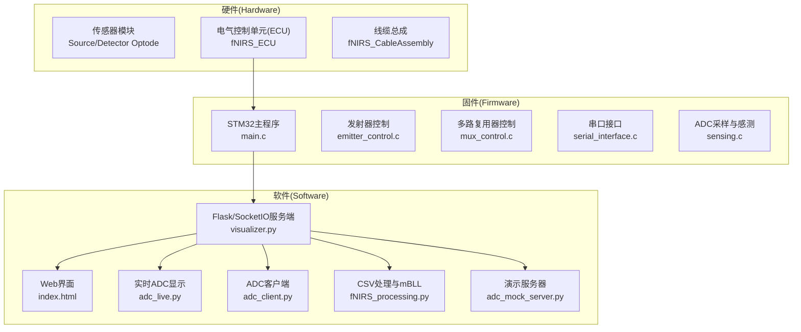
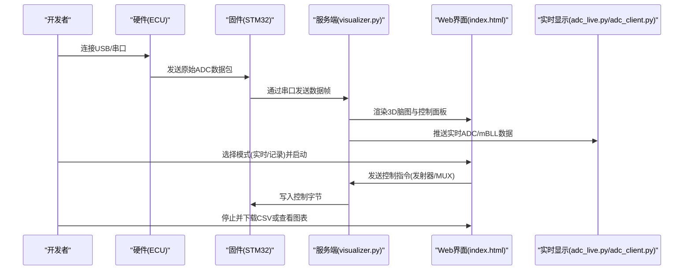
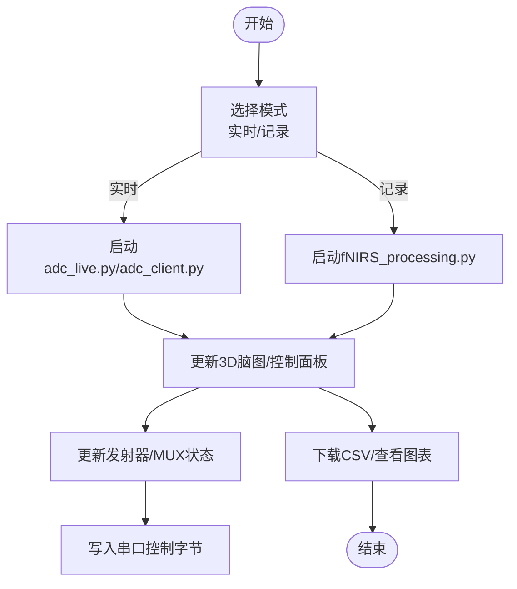
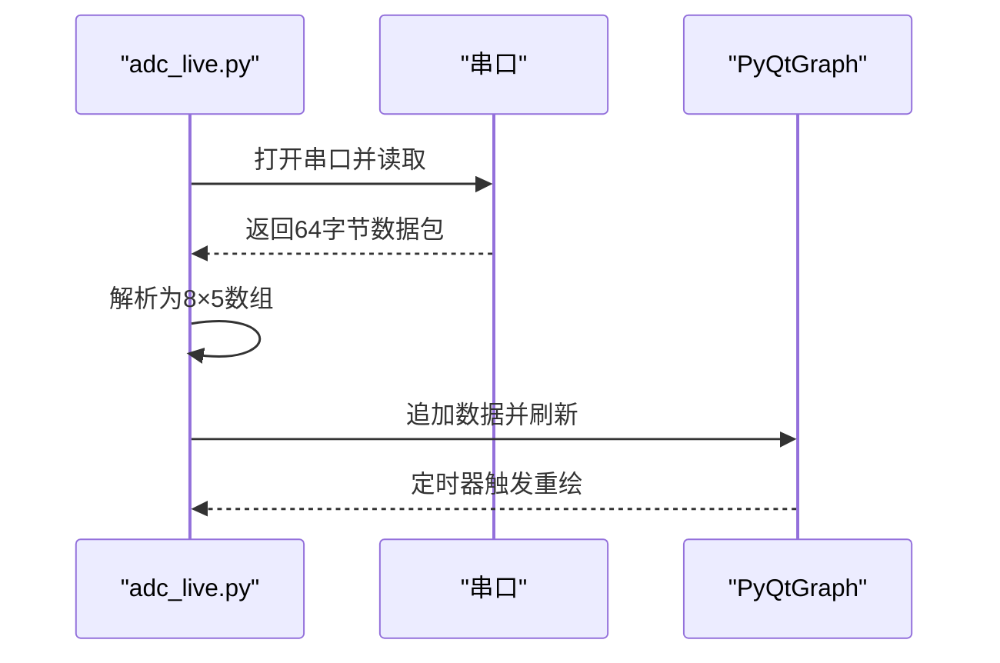
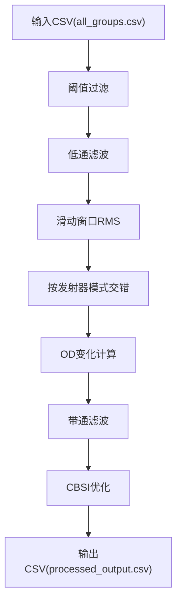
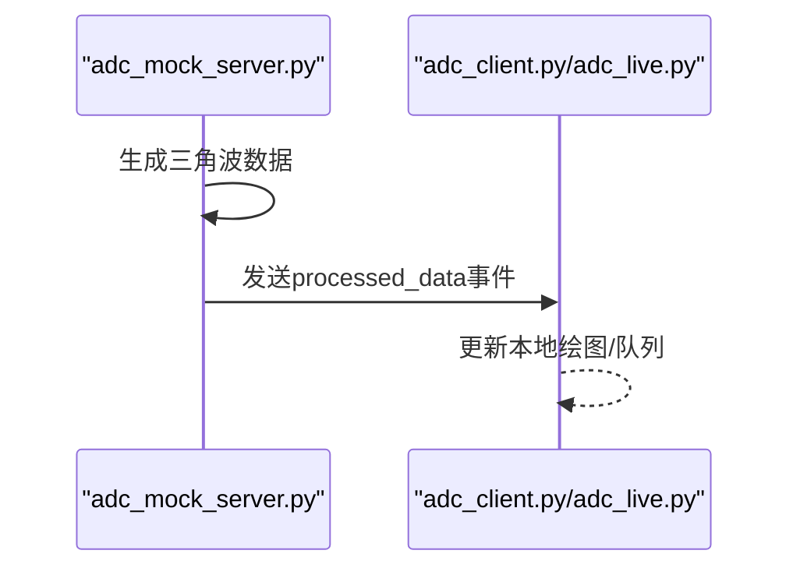
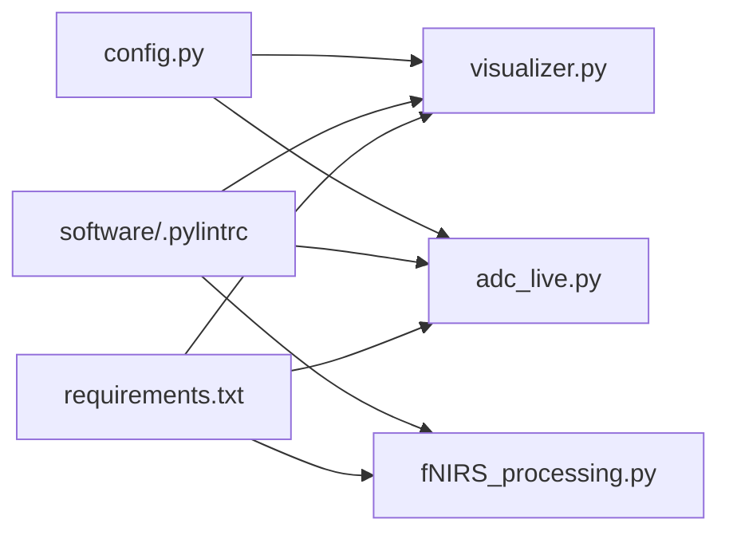

# 贡献指南

<cite>
**本文档引用的文件**
- [README.md](file://README.md)
- [software/README.md](file://software/README.md)
- [software/requirements.txt](file://software/requirements.txt)
- [software/.pylintrc](file://software/.pylintrc)
- [software/config.py](file://software/config.py)
- [software/visualizer.py](file://software/visualizer.py)
- [software/index.html](file://software/index.html)
- [software/adc_live.py](file://software/adc_live.py)
- [software/adc_client.py](file://software/adc_client.py)
- [software/adc_mock_server.py](file://software/adc_mock_server.py)
- [software/fNIRS_processing.py](file://software/fNIRS_processing.py)
- [software/testing-scripts/fNIRS_processing_csv.py](file://software/testing-scripts/fNIRS_processing_csv.py)
- [firmware/README.md](file://firmware/README.md)
- [firmware/STM32/fNIRS/Core/Src/main.c](file://firmware/STM32/fNIRS/Core/Src/main.c)
- [.gitignore](file://.gitignore)
- [.gitattributes](file://.gitattributes)
</cite>

## 目录
1. [简介](#简介)
2. [项目结构](#项目结构)
3. [核心组件](#核心组件)
4. [架构总览](#架构总览)
5. [详细组件分析](#详细组件分析)
6. [依赖关系分析](#依赖关系分析)
7. [性能考虑](#性能考虑)
8. [故障排除指南](#故障排除指南)
9. [结论](#结论)
10. [附录](#附录)

## 简介
本指南面向开源贡献者，提供fNIRS项目的完整贡献流程与规范，涵盖代码贡献流程（Fork仓库、创建分支、提交与PR）、编码规范（Python与C语言风格及注释要求）、问题报告与功能请求模板、社区交流准则、版本控制与代码审查标准、发布管理机制、开发环境搭建、测试要求以及文档更新规范。目标是帮助贡献者快速上手并高质量地参与项目。

## 项目结构
fNIRS项目由三个主要部分组成：
- 硬件设计：Altium工程文件，包含传感器模块、ECU板、连接器等。
- 固件：基于STM32微控制器的嵌入式程序，负责传感器控制、ADC采集与串口通信。
- 软件：基于Python的实时数据可视化与处理系统，包含Web界面、实时动画、CSV处理与mBLL计算。

图表来源
- [firmware/README.md:1-17](file://firmware/README.md#L1-L17)
- [software/README.md:1-180](file://software/README.md#L1-L180)
- [software/visualizer.py:591-714](file://software/visualizer.py#L591-L714)
- [software/index.html:1-750](file://software/index.html#L1-L750)

章节来源
- [README.md:1-19](file://README.md#L1-L19)
- [firmware/README.md:1-17](file://firmware/README.md#L1-L17)
- [software/README.md:1-180](file://software/README.md#L1-L180)

## 核心组件
- Web可视化与控制中心：基于Flask/SocketIO的服务端，负责接收设备数据、渲染3D脑图、控制发射器与MUX状态，并提供下载与静态/动画展示。
- 实时ADC显示：使用PyQt5/PyQtGraph的桌面应用，用于实时显示原始ADC数据。
- CSV处理与mBLL：对原始ADC进行滤波、RMS、交错、OD转换、带通滤波与CBSI，最终输出血红蛋白浓度变化。
- 演示模式：提供模拟数据生成与客户端显示，便于无硬件环境下的开发与测试。
- 配置管理：集中管理串口参数与运行模式。

章节来源
- [software/visualizer.py:591-714](file://software/visualizer.py#L591-L714)
- [software/index.html:265-296](file://software/index.html#L265-L296)
- [software/adc_live.py:1-210](file://software/adc_live.py#L1-L210)
- [software/adc_client.py:1-181](file://software/adc_client.py#L1-L181)
- [software/fNIRS_processing.py:339-443](file://software/fNIRS_processing.py#L339-L443)
- [software/adc_mock_server.py:1-65](file://software/adc_mock_server.py#L1-L65)
- [software/config.py:1-13](file://software/config.py#L1-L13)

## 架构总览
下图展示了从硬件到软件的数据流与交互关系：

图表来源
- [software/visualizer.py:648-714](file://software/visualizer.py#L648-L714)
- [software/index.html:632-723](file://software/index.html#L632-L723)
- [software/adc_live.py:191-210](file://software/adc_live.py#L191-L210)
- [software/adc_client.py:174-181](file://software/adc_client.py#L174-L181)

## 详细组件分析

### 组件A：Web可视化与控制中心
- 功能职责
  - 启动/停止数据采集与处理流程
  - 控制发射器与MUX状态并通过串口下发
  - 更新3D脑图高亮区域与传感器组映射
  - 提供CSV下载与静态/动画展示入口
- 关键流程
  - 模式切换：实时ADC或记录并可视化(mBLL)
  - 控制下发：将前端表单数据打包为字节写入串口
  - 数据更新：上游SocketIO接收处理后的浓度数据，触发脑图更新

图表来源
- [software/visualizer.py:648-714](file://software/visualizer.py#L648-L714)
- [software/index.html:632-723](file://software/index.html#L632-L723)
- [software/adc_live.py:191-210](file://software/adc_live.py#L191-L210)
- [software/fNIRS_processing.py:446-496](file://software/fNIRS_processing.py#L446-L496)

章节来源
- [software/visualizer.py:591-714](file://software/visualizer.py#L591-L714)
- [software/index.html:265-296](file://software/index.html#L265-L296)

### 组件B：实时ADC显示
- 功能职责
  - 使用PyQt5/PyQtGraph实时绘制8个传感器组的ADC曲线
  - 支持重置、全屏与历史数据上限控制
- 关键流程
  - 串口读取数据包并解析为8×5矩阵
  - 多线程持续读取，主线程定时刷新绘图

图表来源
- [software/adc_live.py:48-78](file://software/adc_live.py#L48-L78)
- [software/adc_live.py:154-181](file://software/adc_live.py#L154-L181)

章节来源
- [software/adc_live.py:1-210](file://software/adc_live.py#L1-L210)

### 组件C：CSV处理与mBLL
- 功能职责
  - 对原始ADC进行阈值过滤、低通滤波、滑动窗口RMS
  - 按发射器模式交错块并计算OD变化
  - 应用带通滤波与CBSI，最终输出血红蛋白浓度变化CSV
- 关键流程
  - 读取CSV并配对相邻行（模式1/2）
  - 构建通道信息（波长、DPF、源-探测距离）
  - 计算并输出最终结果

图表来源
- [software/fNIRS_processing.py:339-443](file://software/fNIRS_processing.py#L339-L443)

章节来源
- [software/fNIRS_processing.py:1-496](file://software/fNIRS_processing.py#L1-L496)
- [software/testing-scripts/fNIRS_processing_csv.py:446-497](file://software/testing-scripts/fNIRS_processing_csv.py#L446-L497)

### 组件D：演示模式
- 功能职责
  - 模拟ADC/mBLL数据并通过SocketIO推送
  - 无需真实硬件即可验证前端与后端交互
- 关键流程
  - 后台任务周期性生成三角波数据
  - 通过SocketIO广播至客户端

图表来源
- [software/adc_mock_server.py:48-65](file://software/adc_mock_server.py#L48-L65)
- [software/adc_client.py:59-86](file://software/adc_client.py#L59-L86)

章节来源
- [software/adc_mock_server.py:1-65](file://software/adc_mock_server.py#L1-L65)
- [software/adc_client.py:1-181](file://software/adc_client.py#L1-L181)

## 依赖关系分析
- Python依赖：通过requirements.txt统一管理，包括Flask、SocketIO、PyQt5、NumPy、Pandas、SciPy、Plotly等。
- 开发工具：Pylint配置用于代码风格检查与质量评估。
- 串口配置：config.py集中管理串口号、波特率与超时。

图表来源
- [software/requirements.txt:1-15](file://software/requirements.txt#L1-L15)
- [software/.pylintrc:1-651](file://software/.pylintrc#L1-L651)
- [software/config.py:1-13](file://software/config.py#L1-L13)

章节来源
- [software/requirements.txt:1-15](file://software/requirements.txt#L1-L15)
- [software/.pylintrc:1-651](file://software/.pylintrc#L1-L651)
- [software/config.py:1-13](file://software/config.py#L1-L13)

## 性能考虑
- 实时性
  - 串口读取采用非阻塞与缓冲拼接，避免忙等待。
  - PyQt定时器刷新频率可调，平衡流畅度与CPU占用。
- 数据处理
  - NumPy向量化运算提升批处理效率；滤波与重采样在必要时才执行。
- 可视化
  - 限制历史数据长度，避免内存膨胀；Plotly离线渲染减少浏览器负担。
- 并发
  - 服务端使用异步模式(eventlet)，提高并发SocketIO处理能力。

章节来源
- [software/adc_live.py:62-78](file://software/adc_live.py#L62-L78)
- [software/adc_live.py:154-181](file://software/adc_live.py#L154-L181)
- [software/visualizer.py:54-56](file://software/visualizer.py#L54-L56)

## 故障排除指南
- 串口无法打开
  - 检查config.py中的串口路径是否正确，确认设备已连接且驱动正常。
  - 在Windows使用设备管理器查看COM端口，在Linux/macOS使用ls命令确认/dev/tty*。
- 数据为空或无更新
  - 确认固件已编译并烧录，硬件连接正确。
  - 在演示模式下确认mock服务器已启动并监听端口。
- 界面无响应
  - 查看浏览器控制台与服务端日志，确认SocketIO连接状态。
  - 检查防火墙与跨域策略设置。
- 处理结果异常
  - 核对CSV列名与时间戳，确保交错与OD转换逻辑正确。
  - 调整滤波参数（截止频率、阶数）以适配实际信号。

章节来源
- [software/config.py:7-13](file://software/config.py#L7-L13)
- [software/README.md:50-100](file://software/README.md#L50-L100)
- [software/visualizer.py:648-714](file://software/visualizer.py#L648-L714)

## 结论
本指南提供了从开发环境搭建到代码贡献与发布的全流程规范，明确了编码风格、测试与文档更新要求。建议贡献者在提交前完成本地测试与代码风格检查，并遵循PR审查流程，确保代码质量与项目一致性。

## 附录

### A. 代码贡献流程
- Fork仓库
  - 在GitHub页面点击"Fork"按钮，将仓库复制到个人账户。
- 创建分支
  - 基于主分支创建特性分支，命名如feature/add-docs或fix/serial-config。
- 提交代码
  - 提交前运行代码风格检查与测试，确保无Pylint警告与功能异常。
  - 提交信息采用清晰的类型+简述格式，如feat: 添加新功能；fix: 修复串口超时问题。
- 发起Pull Request
  - 在GitHub上创建PR，填写变更说明与相关Issue链接，等待维护者审查。

### B. 编码规范
- Python代码风格
  - 使用Pylint配置进行检查，遵循命名规范（函数/变量snake_case，类PascalCase，常量UPPER_CASE），最大行宽100字符。
  - 函数与类保持合理复杂度，避免过长函数与过多分支。
  - 注释与文档字符串遵循项目现有风格，解释关键算法与参数含义。
- C代码格式
  - 保持一致的缩进与空行，函数声明与实现分离，局部变量尽量靠近使用位置。
  - 注释说明寄存器操作与硬件接口，避免魔法数字。
- 注释规范
  - 公共API与关键流程必须有文档字符串或注释说明用途、参数与返回值。
  - 复杂算法需提供伪代码或步骤说明，便于他人理解与维护。

章节来源
- [software/.pylintrc:119-359](file://software/.pylintrc#L119-L359)
- [software/visualizer.py:1-10](file://software/visualizer.py#L1-L10)
- [firmware/STM32/fNIRS/Core/Src/main.c](file://firmware/STM32/fNIRS/Core/Src/main.c)

### C. 问题报告模板
- 标题：简洁描述问题
- 环境信息：操作系统、Python版本、依赖版本、硬件型号
- 复现步骤：最小可复现步骤
- 预期行为：期望的结果
- 实际行为：当前错误或异常
- 日志与截图：附上关键日志与截图

### D. 功能请求流程
- 在Issue中描述需求背景与使用场景
- 提供参考实现思路或替代方案
- 讨论可行性与对齐项目目标

### E. 社区交流准则
- 尊重与包容，使用礼貌用语
- 提供具体上下文与证据，避免主观臆断
- 积极反馈与协作，共同推进问题解决

### F. 版本控制与发布管理
- 分支策略：主分支稳定，特性分支合并后通过PR审查
- 标签与版本：遵循语义化版本，发布前更新变更日志
- 发布流程：构建产物、测试验证、文档同步更新

### G. 开发环境搭建
- 克隆仓库并安装依赖
- 配置串口参数
- 运行演示模式验证前后端交互
- 修改后运行Pylint检查与单元测试脚本

章节来源
- [software/README.md:50-100](file://software/README.md#L50-L100)
- [software/requirements.txt:1-15](file://software/requirements.txt#L1-L15)
- [software/config.py:7-13](file://software/config.py#L7-L13)

### H. 测试要求
- 单元测试：针对关键函数（如滤波、RMS、交错）编写测试用例
- 集成测试：验证从串口到CSV输出的完整链路
- 端到端测试：在演示模式下验证Web界面与实时显示
- 性能测试：评估不同数据长度与刷新频率下的资源占用

### I. 文档更新规范
- 新增或修改功能需同步更新软件README与相关HTML注释
- 示例与配置文件变更需在对应目录补充说明
- 发布前检查所有链接与示例代码的有效性

章节来源
- [software/README.md:1-180](file://software/README.md#L1-L180)
- [software/index.html:1-750](file://software/index.html#L1-L750)