# Web可视化服务器

<cite>
**本文档引用的文件**
- [index.html](file://software/index.html)
- [visualizer.py](file://software/visualizer.py)
- [config.py](file://software/config.py)
- [fNIRS_processing.py](file://software/fNIRS_processing.py)
- [requirements.txt](file://software/requirements.txt)
- [adc_live.py](file://software/adc_live.py)
- [adc_mock_server.py](file://software/adc_mock_server.py)
- [adc_client.py](file://software/adc_client.py)
- [BrainMesh_Ch2_smoothed.nv](file://software/BrainMesh_Ch2_smoothed.nv)
- [aal.nii](file://software/aal.nii)
- [all_groups.csv](file://software/sample_data/all_groups.csv)
- [processed_output.csv](file://software/sample_data/processed_output.csv)
- [README.md](file://README.md)
</cite>

## 目录
1. [简介](#简介)
2. [项目结构](#项目结构)
3. [核心组件](#核心组件)
4. [架构概览](#架构概览)
5. [详细组件分析](#详细组件分析)
6. [依赖关系分析](#依赖关系分析)
7. [性能考虑](#性能考虑)
8. [故障排除指南](#故障排除指南)
9. [结论](#结论)

## 简介

fNIRS Web可视化服务器是一个基于Flask和SocketIO的实时Web服务器，专为功能性近红外光谱(fNIRS)数据可视化而设计。该系统提供了3D脑部可视化功能，支持实时数据流处理，并集成了多种数据源和控制选项。

该服务器的核心功能包括：
- 基于Flask的HTTP服务器和SocketIO WebSocket通信
- 实时3D脑部可视化，使用Plotly进行图形渲染
- 支持ADC和mBLL两种数据源模式
- 静态文件服务和CSV数据下载功能
- 演示模式支持，无需实际硬件即可测试
- 传感器节点映射和脑区激活高亮显示

## 项目结构

项目的软件部分主要位于`software/`目录下，包含以下关键组件：

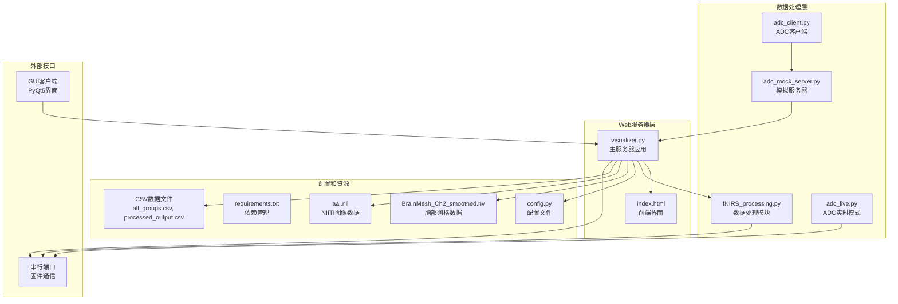

**图表来源**
- [visualizer.py:1-50](file://software/visualizer.py#L1-L50)
- [index.html:1-50](file://software/index.html#L1-L50)
- [config.py:1-13](file://software/config.py#L1-L13)

**章节来源**
- [README.md:1-19](file://README.md#L1-L19)
- [requirements.txt:1-15](file://software/requirements.txt#L1-L15)

## 核心组件

### Flask Web服务器

主服务器应用`visualizer.py`实现了完整的Web服务功能：

- **HTTP路由管理**：提供HTML页面、数据下载、控制接口等REST API
- **WebSocket通信**：使用Flask-SocketIO实现实时数据推送
- **数据队列管理**：使用Queue和线程锁确保线程安全的数据处理
- **进程管理**：启动和停止相关的数据处理子进程

### 3D脑部可视化系统

系统集成了复杂的3D可视化功能：

- **Plotly图形渲染**：使用Plotly.js在浏览器中渲染3D脑部模型
- **NIfTI图像处理**：通过nibabel库处理脑部解剖学图像
- **传感器节点映射**：将物理传感器位置映射到3D空间中的虚拟节点
- **激活区域高亮**：根据fNIRS数据动态高亮显示激活的脑区

### 数据处理管道

系统支持多种数据处理模式：

- **ADC实时模式**：直接从串行端口读取原始ADC数据
- **mBLL处理模式**：应用Modified Beer-Lambert Law计算血红蛋白浓度变化
- **演示模式**：使用模拟数据进行测试和开发

**章节来源**
- [visualizer.py:120-200](file://software/visualizer.py#L120-L200)
- [index.html:300-400](file://software/index.html#L300-L400)
- [fNIRS_processing.py:1-100](file://software/fNIRS_processing.py#L1-100)

## 架构概览

系统采用分层架构设计，各组件职责明确：

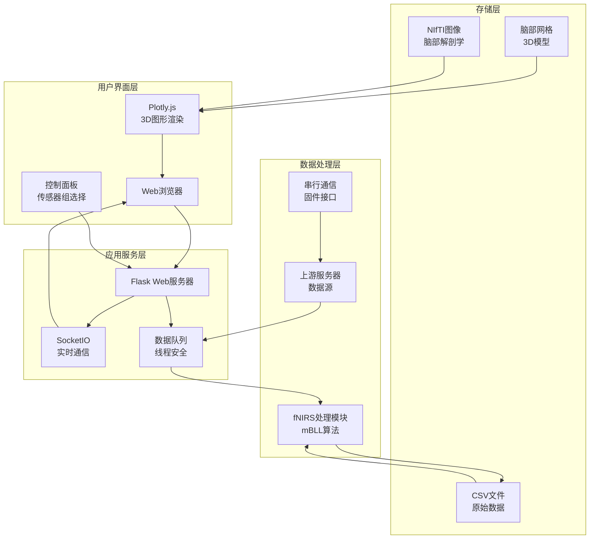

**图表来源**
- [visualizer.py:54-68](file://software/visualizer.py#L54-L68)
- [index.html:333-338](file://software/index.html#L333-L338)
- [fNIRS_processing.py:23-37](file://software/fNIRS_processing.py#L23-L37)

## 详细组件分析

### Web服务器核心

#### Flask应用初始化

服务器使用Flask框架构建，配置了CORS支持和事件驱动的异步模式：

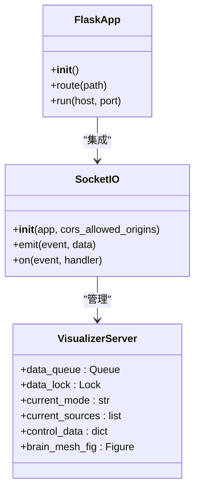

**图表来源**
- [visualizer.py:54-56](file://software/visualizer.py#L54-L56)
- [visualizer.py:67-98](file://software/visualizer.py#L67-L98)

#### HTTP路由设计

服务器定义了多个HTTP端点来处理不同的请求类型：

| 路由 | 方法 | 功能描述 |
|------|------|----------|
| `/` | GET | 提供主HTML页面 |
| `/update_graphs` | GET | 更新3D脑部图 |
| `/select_group/<int:group_id>` | GET | 高亮特定传感器组 |
| `/update_control_data` | POST | 更新控制数据 |
| `/start_processing` | POST | 启动数据处理 |
| `/stop_processing` | POST | 停止数据处理 |
| `/download/<source>` | GET | 下载CSV文件 |
| `/view_static/<source>` | GET | 查看静态图表 |

**章节来源**
- [visualizer.py:593-714](file://software/visualizer.py#L593-L714)

### WebSocket实时通信

#### SocketIO连接管理

系统使用SocketIO实现双向实时通信：

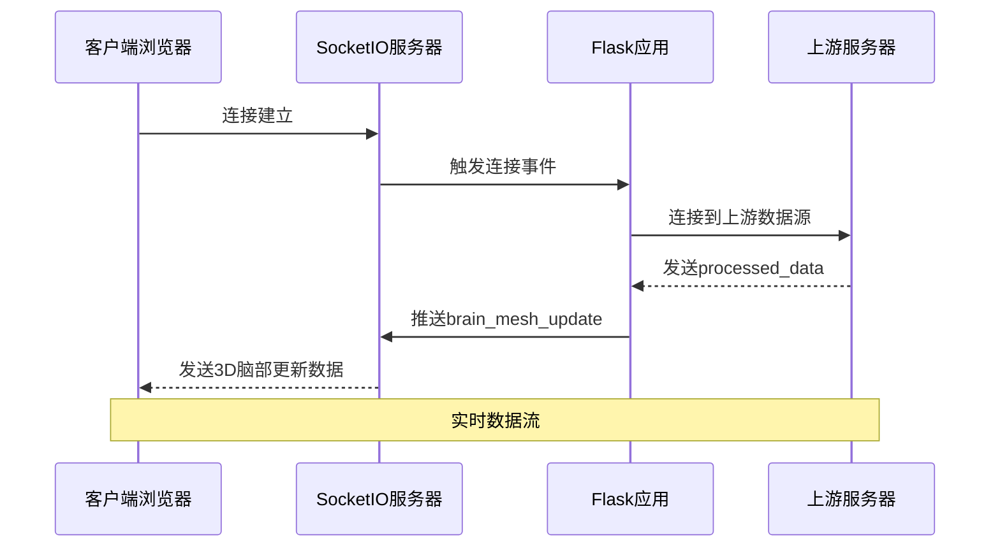

**图表来源**
- [visualizer.py:69-98](file://software/visualizer.py#L69-L98)
- [index.html:333-338](file://software/index.html#L333-L338)

#### 数据传输机制

实时数据传输采用JSON格式，包含完整的Plotly图形数据：

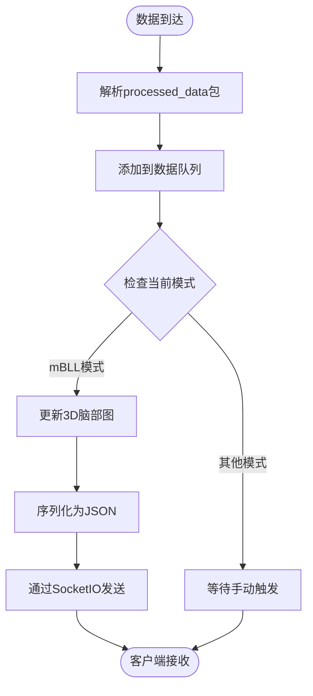

**图表来源**
- [visualizer.py:84-98](file://software/visualizer.py#L84-L98)
- [visualizer.py:558-562](file://software/visualizer.py#L558-L562)

**章节来源**
- [visualizer.py:67-98](file://software/visualizer.py#L67-L98)
- [index.html:333-338](file://software/index.html#L333-L338)

### 3D脑部可视化系统

#### 脑部网格生成

系统使用预加载的脑部网格数据创建3D模型：

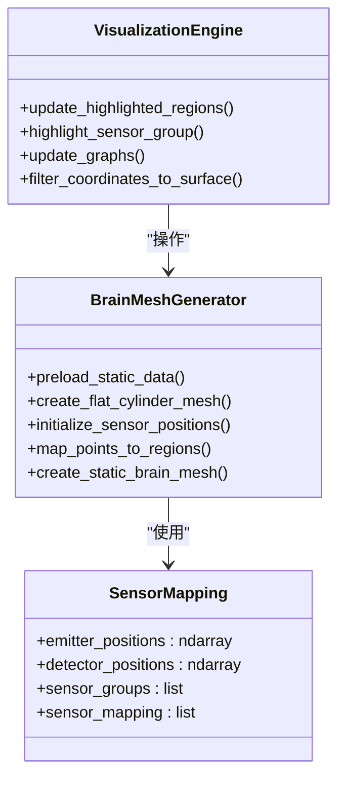

**图表来源**
- [visualizer.py:193-205](file://software/visualizer.py#L193-L205)
- [visualizer.py:207-253](file://software/visualizer.py#L207-L253)
- [visualizer.py:280-354](file://software/visualizer.py#L280-L354)

#### NIfTI图像处理

系统集成了神经影像学图像处理功能：

| 组件 | 功能 | 输入 | 输出 |
|------|------|------|------|
| `preload_static_data` | 加载脑部网格 | `.nv`文件 | 顶点坐标, 三角形索引 |
| `map_points_to_regions` | 脑区映射 | 世界坐标 | AAL脑区ID |
| `filter_coordinates_to_surface` | 表面过滤 | 体素坐标 | 表面坐标 |
| `compute_vertex_normals` | 法向量计算 | 顶点坐标, 三角形 | 法向量 |

**章节来源**
- [visualizer.py:193-279](file://software/visualizer.py#L193-L279)
- [visualizer.py:280-354](file://software/visualizer.py#L280-L354)

### 数据处理模块

#### fNIRS数据处理流程

系统实现了完整的fNIRS数据处理管道：

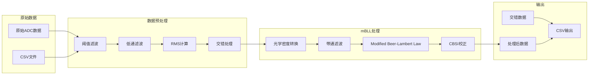

**图表来源**
- [fNIRS_processing.py:187-234](file://software/fNIRS_processing.py#L187-L234)
- [fNIRS_processing.py:339-443](file://software/fNIRS_processing.py#L339-L443)

#### 数据源模式

系统支持多种数据源模式：

| 模式 | 描述 | 数据源 | 特点 |
|------|------|--------|------|
| `adc_live` | ADC实时模式 | 串行端口 | 低延迟, 实时显示 |
| `record` | 记录模式 | CSV文件 | 离线处理, 可视化 |
| `demo` | 演示模式 | 模拟数据 | 无需硬件, 测试用 |

**章节来源**
- [visualizer.py:648-690](file://software/visualizer.py#L648-L690)
- [fNIRS_processing.py:446-496](file://software/fNIRS_processing.py#L446-L496)

### 静态文件服务和CSV下载

#### 文件服务机制

系统提供了完整的静态文件服务功能：

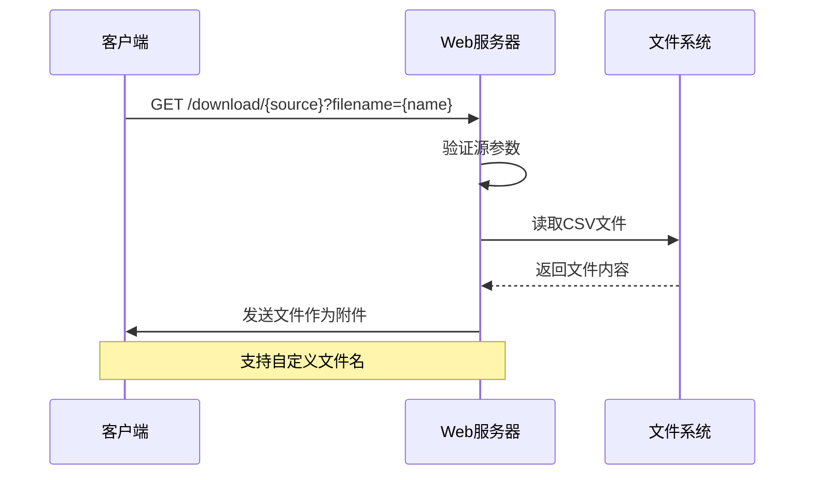

**图表来源**
- [visualizer.py:716-734](file://software/visualizer.py#L716-L734)

#### CSV数据格式

系统支持两种主要的CSV数据格式：

| 数据类型 | 文件名 | 列结构 | 用途 |
|----------|--------|--------|------|
| ADC原始数据 | `all_groups.csv` | 时间戳, 8组×3通道×2波长 | 实时监控 |
| 处理后数据 | `processed_output.csv` | 时间戳, 24通道×2类型 | 分析研究 |

**章节来源**
- [visualizer.py:716-734](file://software/visualizer.py#L716-L734)
- [fNIRS_processing.py:492-496](file://software/fNIRS_processing.py#L492-L496)

### 演示模式实现

#### 模拟数据生成

演示模式通过模拟服务器生成逼真的测试数据：

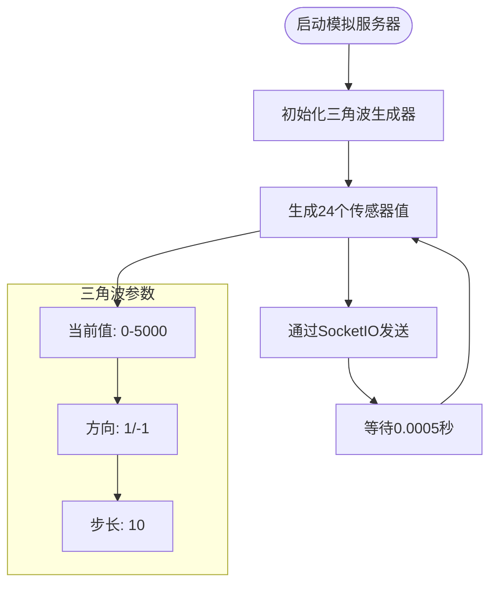

**图表来源**
- [adc_mock_server.py:30-61](file://software/adc_mock_server.py#L30-L61)

#### 演示模式切换

系统支持无缝的演示模式切换：

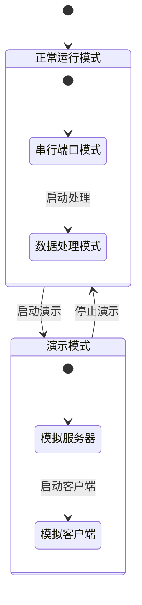

**图表来源**
- [visualizer.py:36-42](file://software/visualizer.py#L36-L42)
- [visualizer.py:662-667](file://software/visualizer.py#L662-L667)

**章节来源**
- [adc_mock_server.py:1-65](file://software/adc_mock_server.py#L1-L65)
- [visualizer.py:36-42](file://software/visualizer.py#L36-L42)

## 依赖关系分析

### 外部依赖管理

系统使用requirements.txt统一管理所有Python依赖：

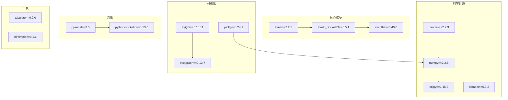

**图表来源**
- [requirements.txt:1-15](file://software/requirements.txt#L1-L15)

### 内部组件依赖

系统内部组件之间的依赖关系：

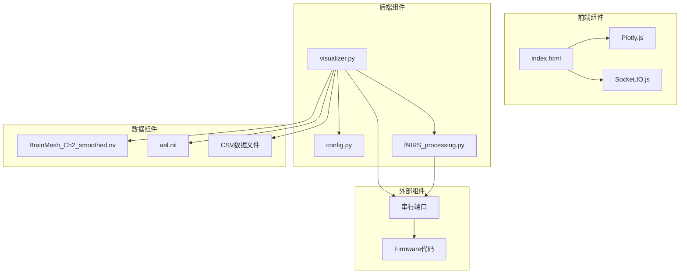

**图表来源**
- [visualizer.py:34-35](file://software/visualizer.py#L34-L35)
- [config.py:7-13](file://software/config.py#L7-L13)

**章节来源**
- [requirements.txt:1-15](file://software/requirements.txt#L1-L15)
- [visualizer.py:34-35](file://software/visualizer.py#L34-L35)

## 性能考虑

### 实时性能优化

系统在多个层面进行了性能优化：

#### 数据处理优化

- **线程安全队列**：使用Queue和Lock确保多线程环境下的数据一致性
- **内存管理**：限制数据队列大小避免内存泄漏
- **异步处理**：使用eventlet实现非阻塞的SocketIO通信

#### 图形渲染优化

- **增量更新**：只更新发生变化的部分而不是整个图形
- **预计算缓存**：预先计算传感器到脑区的映射关系
- **表面过滤**：使用KDTree快速过滤接近脑表面的坐标点

#### 网络通信优化

- **二进制协议**：使用紧凑的二进制格式减少网络传输开销
- **批量处理**：合并多个小数据包为批量传输
- **连接池**：复用SocketIO连接避免频繁建立新连接

### 内存使用优化

系统采用了多种内存优化策略：

| 优化策略 | 实现方式 | 效果 |
|----------|----------|------|
| 数据队列限制 | 设置最大容量20 | 防止内存溢出 |
| 预计算映射 | 缓存传感器到脑区映射 | 减少重复计算 |
| 图形数据增量更新 | 只更新变化部分 | 降低CPU负载 |
| 文件缓存 | 预加载NIfTI和网格数据 | 减少磁盘I/O |

### 并发处理

系统支持多线程并发处理：

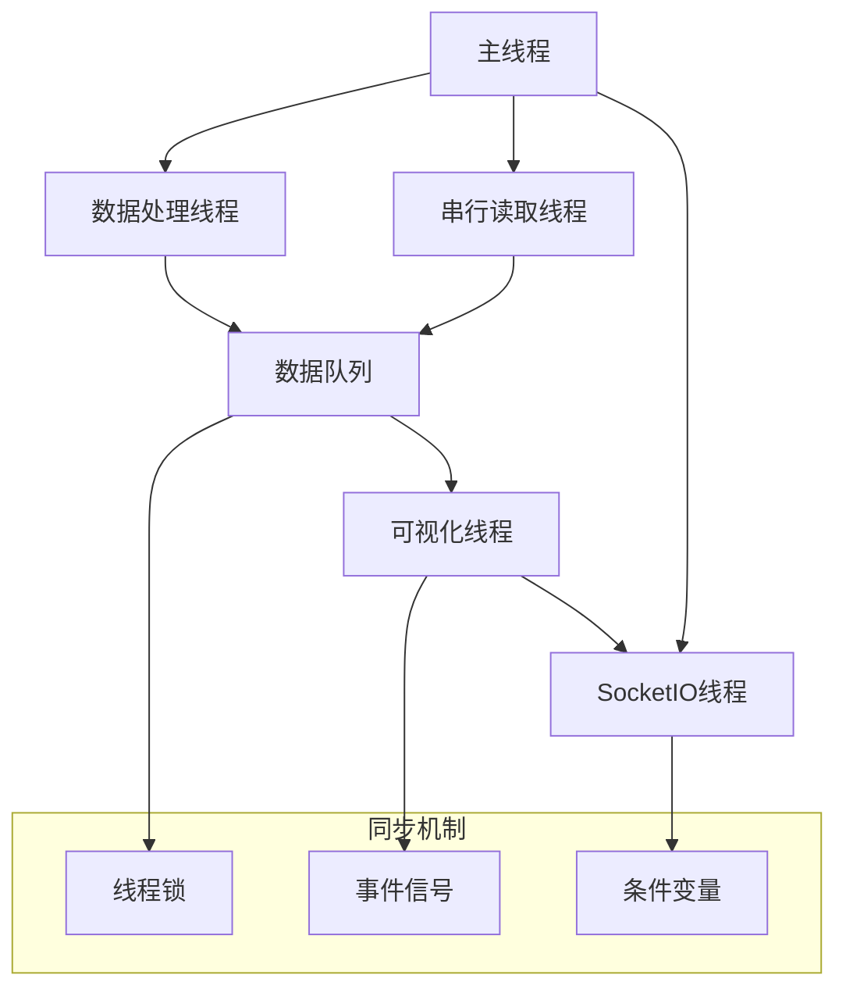

## 故障排除指南

### 常见问题诊断

#### 串行通信问题

**问题症状**：无法连接到设备或数据不更新

**诊断步骤**：
1. 检查串行端口配置是否正确
2. 验证设备连接状态
3. 确认波特率设置匹配
4. 检查超时设置是否合理

**解决方案**：
```python
# 检查串行端口状态
if not ser.is_open:
    try:
        ser.open()
        logging.info("串行端口重新打开成功")
    except Exception as e:
        logging.error(f"串行端口打开失败: {e}")

# 重置串行连接
def reinit_serial_connection():
    global ser
    try:
        ser = serial.Serial(
            config.SERIAL_PORT,
            baudrate=config.BAUD_RATE,
            timeout=config.TIMEOUT
        )
        logging.info("串行连接重新初始化")
    except Exception as e:
        logging.error(f"串行连接初始化失败: {e}")
```

#### WebSocket连接问题

**问题症状**：页面无法实时更新或连接中断

**诊断步骤**：
1. 检查网络连接稳定性
2. 验证CORS配置
3. 确认防火墙设置
4. 检查SocketIO版本兼容性

**解决方案**：
```python
# SocketIO连接配置
socketio = SocketIO(app, 
                   cors_allowed_origins="*",
                   async_mode="eventlet")

# 连接事件处理
@sio_client.event
def connect():
    logging.info("连接到上游服务器成功")

@sio_client.event
def disconnect():
    logging.info("与上游服务器断开连接")
    # 自动重连逻辑
    reconnect()
```

#### 数据处理错误

**问题症状**：数据处理异常或结果不正确

**诊断步骤**：
1. 检查输入数据格式
2. 验证处理参数设置
3. 确认依赖库版本
4. 检查内存使用情况

**解决方案**：
```python
# 数据验证和清理
def validate_and_clean_data(data):
    # 检查数据完整性
    if data is None:
        raise ValueError("数据为空")
    
    # 检查数据形状
    if len(data) != 24:
        raise ValueError(f"数据长度不正确: {len(data)}")
    
    # 清理异常值
    cleaned_data = np.clip(data, 0, 4095)
    return cleaned_data

# 错误处理
try:
    processed_data = process_data(raw_data)
except Exception as e:
    logging.error(f"数据处理错误: {e}")
    # 回退到默认值或重试
    processed_data = get_default_data()
```

### 性能调优建议

#### 内存使用优化

1. **监控内存使用**：定期检查内存使用情况
2. **及时释放资源**：确保不再使用的对象被正确释放
3. **批处理优化**：调整批处理大小平衡性能和延迟

#### 网络性能优化

1. **连接池管理**：复用SocketIO连接
2. **压缩传输**：启用数据压缩减少带宽使用
3. **心跳机制**：实现健康检查避免僵尸连接

#### 图形渲染优化

1. **LOD技术**：根据距离调整图形复杂度
2. **视锥剔除**：只渲染可见的图形元素
3. **帧率控制**：限制最大帧率避免过度渲染

**章节来源**
- [visualizer.py:564-589](file://software/visualizer.py#L564-L589)
- [visualizer.py:692-714](file://software/visualizer.py#L692-L714)
- [fNIRS_processing.py:27-37](file://software/fNIRS_processing.py#L27-L37)

## 结论

fNIRS Web可视化服务器是一个功能完整、架构清晰的实时数据可视化系统。它成功地将复杂的fNIRS数据处理、3D可视化和Web技术相结合，为用户提供了一个直观、交互式的脑部活动监测平台。

### 主要优势

1. **实时性强**：基于SocketIO的双向通信确保了数据的实时更新
2. **可视化丰富**：3D脑部模型结合传感器节点映射提供了直观的数据展示
3. **扩展性好**：模块化的架构便于添加新的数据源和处理算法
4. **用户体验佳**：响应式的Web界面和丰富的控制选项提升了用户交互体验

### 技术亮点

1. **多模式支持**：同时支持ADC实时模式、记录模式和演示模式
2. **数据处理完整**：实现了从原始ADC数据到mBLL处理的完整管道
3. **性能优化**：在多个层面进行了性能优化确保流畅运行
4. **故障处理**：完善的错误处理和恢复机制提高了系统稳定性

### 未来发展方向

1. **移动端支持**：扩展对移动设备的支持
2. **云端部署**：支持云部署和远程访问
3. **AI集成**：集成机器学习算法进行自动数据分析
4. **多用户协作**：支持多用户同时访问和协作分析

该系统为fNIRS技术的普及和应用提供了坚实的技术基础，具有重要的科研和教育价值。