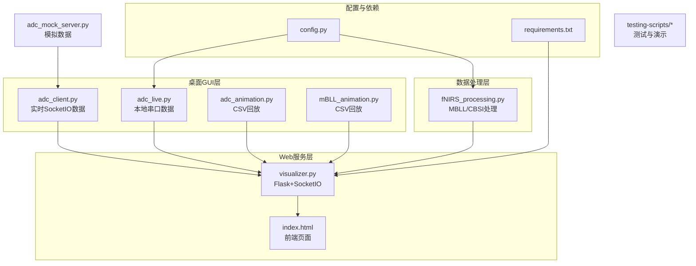
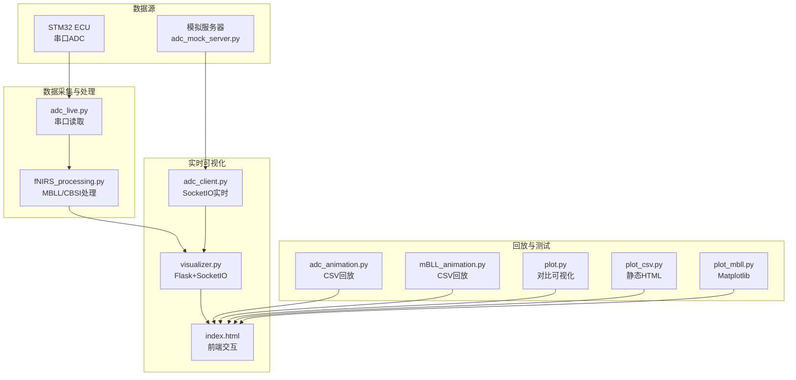
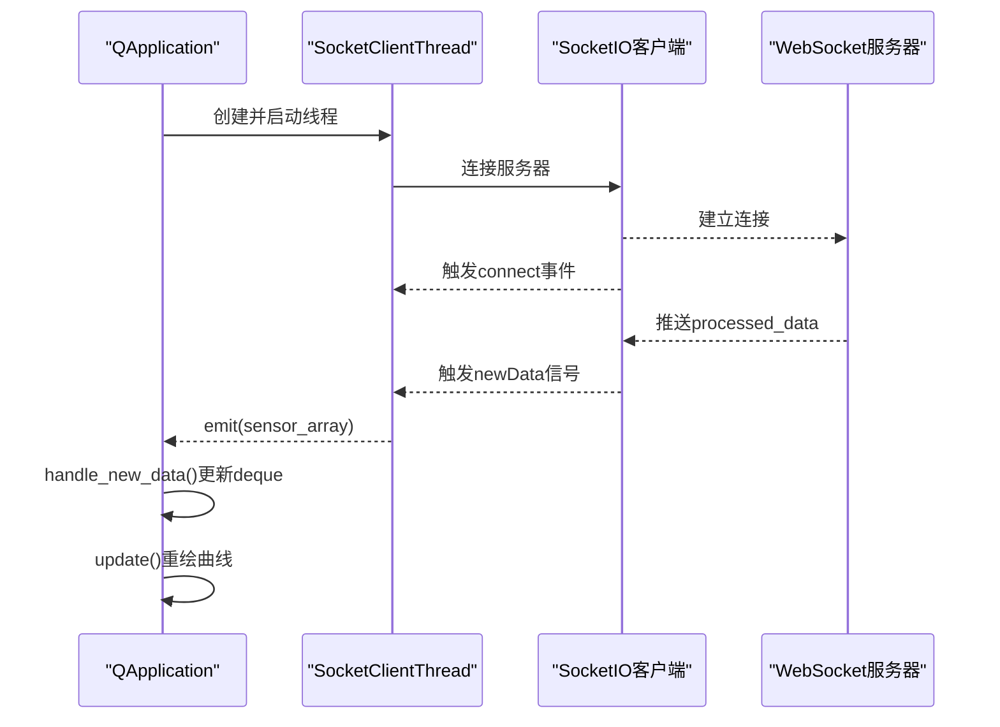
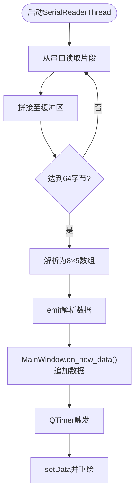
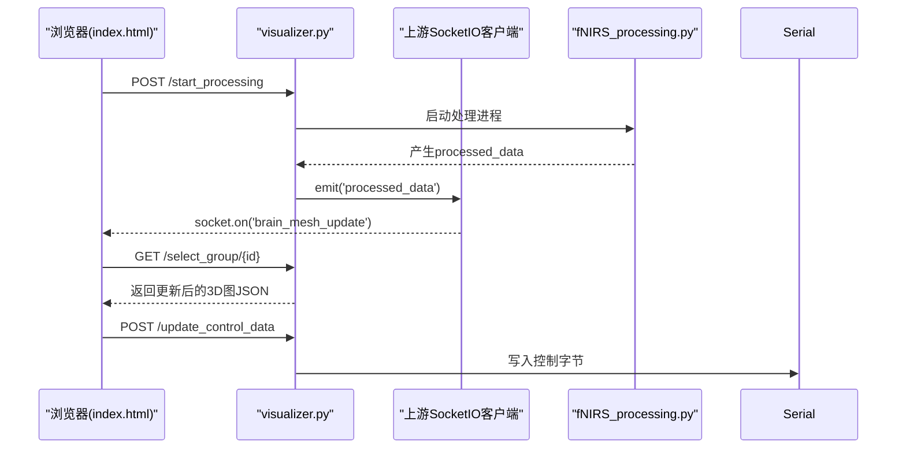
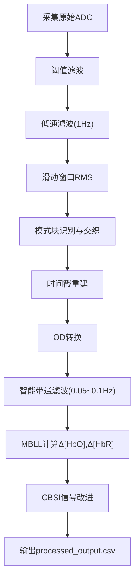
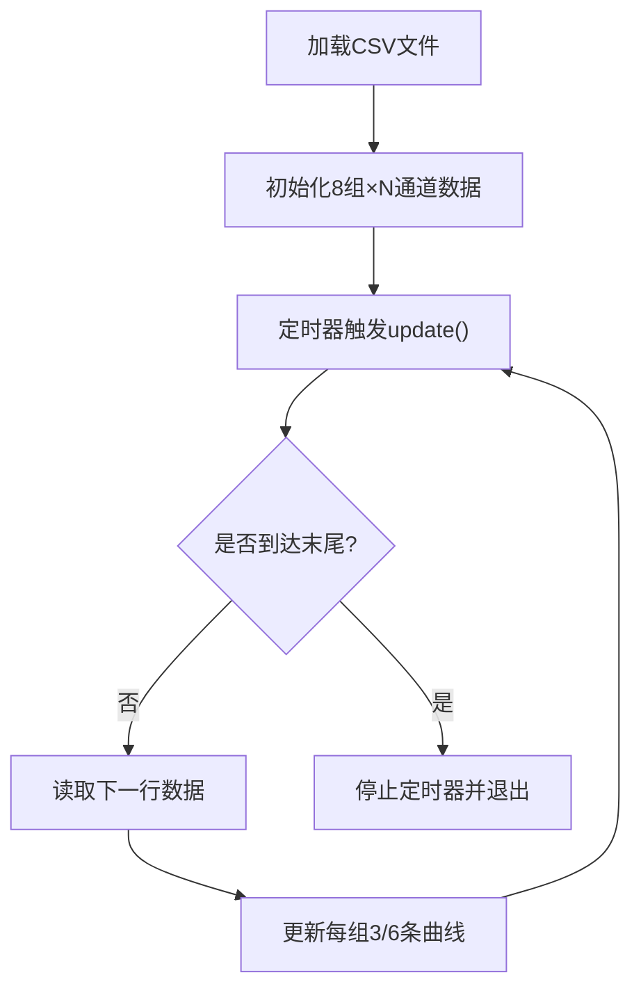
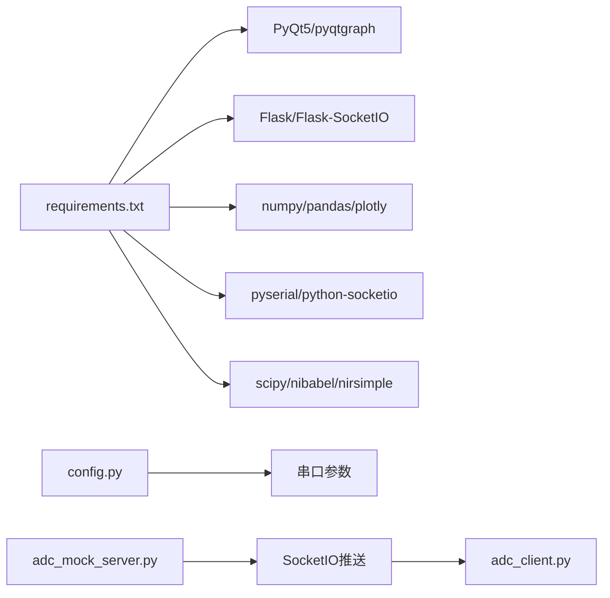

# 实时数据客户端

<cite>
**本文档引用的文件**
- [adc_client.py](file://software/adc_client.py)
- [visualizer.py](file://software/visualizer.py)
- [config.py](file://software/config.py)
- [adc_live.py](file://software/adc_live.py)
- [adc_animation.py](file://software/adc_animation.py)
- [mBLL_animation.py](file://software/mBLL_animation.py)
- [fNIRS_processing.py](file://software/fNIRS_processing.py)
- [requirements.txt](file://software/requirements.txt)
- [index.html](file://software/index.html)
- [adc_mock_server.py](file://software/adc_mock_server.py)
- [fNIRS_processing_文档.md](file://software/fNIRS_processing_文档.md)
- [plot.py](file://software/testing-scripts/plot.py)
- [plot_csv.py](file://software/testing-scripts/plot_csv.py)
- [plot_mbll.py](file://software/testing-scripts/plot_mbll.py)
- [README.md](file://README.md)
</cite>

## 目录
1. [简介](#简介)
2. [项目结构](#项目结构)
3. [核心组件](#核心组件)
4. [架构总览](#架构总览)
5. [详细组件分析](#详细组件分析)
6. [依赖关系分析](#依赖关系分析)
7. [性能考虑](#性能考虑)
8. [故障排除指南](#故障排除指南)
9. [结论](#结论)
10. [附录](#附录)

## 简介
本项目是一个基于PyQt5的桌面GUI应用程序，用于实时可视化fNIRS（功能性近红外光谱）数据。系统支持两种主要工作模式：
- 实时ADC数据可视化：通过串口接收原始ADC数据，实时绘制8组传感器的波形图。
- mBLL处理结果可视化：通过Flask+SocketIO接收经fNIRS_processing.py处理后的血红蛋白浓度变化数据，在3D脑模型上进行激活区域高亮。

系统还提供了数据录制与回放功能，支持CSV文件的动画播放，并具备与Web服务器的通信协议、数据同步机制和状态管理策略。

## 项目结构
软件层采用模块化设计，主要文件分布如下：
- GUI层：adc_client.py（实时ADC波形）、adc_live.py（本地串口ADC）、adc_animation.py（CSV回放）、mBLL_animation.py（CSV回放）
- Web服务层：visualizer.py（Flask+SocketIO，3D脑模型可视化）、index.html（前端页面）
- 数据处理层：fNIRS_processing.py（双波长数据处理，MBLL/CBSI）
- 配置与依赖：config.py、requirements.txt
- 测试与演示：adc_mock_server.py、testing-scripts下的绘图脚本

**图表来源**
- [adc_client.py:1-181](file://software/adc_client.py#L1-L181)
- [adc_live.py:1-210](file://software/adc_live.py#L1-L210)
- [adc_animation.py:1-143](file://software/adc_animation.py#L1-L143)
- [mBLL_animation.py:1-140](file://software/mBLL_animation.py#L1-L140)
- [visualizer.py:1-949](file://software/visualizer.py#L1-L949)
- [index.html:1-750](file://software/index.html#L1-L750)
- [fNIRS_processing.py:1-496](file://software/fNIRS_processing.py#L1-L496)
- [adc_mock_server.py:1-65](file://software/adc_mock_server.py#L1-L65)
- [config.py:1-13](file://software/config.py#L1-L13)
- [requirements.txt:1-15](file://software/requirements.txt#L1-L15)

**章节来源**
- [README.md:1-19](file://README.md#L1-L19)
- [requirements.txt:1-15](file://software/requirements.txt#L1-L15)

## 核心组件
本系统的四大核心组件如下：

- 实时数据客户端（SocketIO）
  - 通过QThread运行SocketIO客户端，连接到本地WebSocket服务器，接收24通道传感器数组，实时更新8组3通道的波形曲线。
  - 使用PyQtGraph进行高性能绘图，定时器驱动刷新，支持全屏显示。

- 本地串口数据客户端
  - 通过PyQt5+pyqtgraph实时读取USB串口数据，解析64字节数据包，绘制8组传感器的短/长通道波形。
  - 提供重置按钮清空历史数据，支持全屏显示。

- Web可视化服务（Flask+SocketIO）
  - 启动Flask+SocketIO服务，提供3D脑模型可视化，支持传感器节点高亮、激活区域着色、发射器颜色动态更新。
  - 提供模式切换接口（实时/录制），控制面板与前端交互，支持下载CSV、查看静态图、启动/停止数据处理。

- 数据处理管道（MBLL/CBSI）
  - 串口采集原始ADC数据，进行阈值滤波、低通滤波、滑动窗口RMS、模式块交织，再应用MBLL计算血红蛋白浓度变化，最后通过CBSI改进信号质量。
  - 输出processed_output.csv供可视化与回放使用。

**章节来源**
- [adc_client.py:39-86](file://software/adc_client.py#L39-L86)
- [adc_client.py:144-172](file://software/adc_client.py#L144-L172)
- [adc_live.py:48-78](file://software/adc_live.py#L48-L78)
- [adc_live.py:80-190](file://software/adc_live.py#L80-L190)
- [visualizer.py:54-118](file://software/visualizer.py#L54-L118)
- [visualizer.py:591-714](file://software/visualizer.py#L591-L714)
- [fNIRS_processing.py:160-185](file://software/fNIRS_processing.py#L160-L185)
- [fNIRS_processing.py:339-434](file://software/fNIRS_processing.py#L339-L434)

## 架构总览
系统采用“多客户端+Web服务”的分布式架构，桌面GUI与Web前端通过SocketIO进行双向通信，数据处理在后台独立运行并通过文件或网络接口提供给可视化层。

**图表来源**
- [adc_client.py:73-86](file://software/adc_client.py#L73-L86)
- [adc_live.py:18-23](file://software/adc_live.py#L18-L23)
- [fNIRS_processing.py:23-23](file://software/fNIRS_processing.py#L23-L23)
- [visualizer.py:67-98](file://software/visualizer.py#L67-L98)
- [index.html:333-338](file://software/index.html#L333-L338)
- [adc_mock_server.py:52-61](file://software/adc_mock_server.py#L52-L61)

## 详细组件分析

### 组件A：实时数据客户端（SocketIO）
- 线程模型：QThread封装SocketIO客户端，避免阻塞主线程；通过自定义信号newData传递数据。
- 数据结构：8组×3通道，使用collections.deque维护固定长度缓冲区，保证内存占用可控。
- 绘图更新：QTimer每毫秒触发一次，将deque数据转换为列表并setData，实现平滑滚动更新。
- 事件处理：注册connect/disconnect/newData事件，错误处理在run方法中捕获并打印。

**图表来源**
- [adc_client.py:39-86](file://software/adc_client.py#L39-L86)
- [adc_client.py:162-172](file://software/adc_client.py#L162-L172)
- [adc_client.py:144-159](file://software/adc_client.py#L144-L159)

**章节来源**
- [adc_client.py:39-86](file://software/adc_client.py#L39-L86)
- [adc_client.py:144-172](file://software/adc_client.py#L144-L172)

### 组件B：本地串口数据客户端
- 串口读取：SerialReaderThread持续从串口读取256字节片段，拼接后按64字节包解析，emit解析后的8×5数组。
- GUI设计：MainWindow使用GraphicsLayoutWidget组织8个子图，每组3条曲线；提供重置按钮清空数据。
- 更新机制：QTimer定时调用update_plots，设置Y轴范围并setData。

**图表来源**
- [adc_live.py:48-78](file://software/adc_live.py#L48-L78)
- [adc_live.py:158-190](file://software/adc_live.py#L158-L190)

**章节来源**
- [adc_live.py:48-78](file://software/adc_live.py#L48-L78)
- [adc_live.py:80-190](file://software/adc_live.py#L80-L190)

### 组件C：Web可视化服务（Flask+SocketIO）
- 服务端：Flask+SocketIO，异步模式eventlet；上游SocketIO客户端订阅processed_data事件。
- 3D脑模型：使用Plotly生成静态网格，结合发射器/探测器节点，支持激活区域高亮与传感器组高亮。
- 控制面板：前端通过AJAX更新发射器/多路复用器状态，服务端通过串口下发控制字节。
- 模式管理：start_processing/stop_processing路由控制数据采集与处理进程生命周期。

**图表来源**
- [visualizer.py:67-98](file://software/visualizer.py#L67-L98)
- [visualizer.py:591-714](file://software/visualizer.py#L591-L714)
- [index.html:492-513](file://software/index.html#L492-L513)

**章节来源**
- [visualizer.py:54-118](file://software/visualizer.py#L54-L118)
- [visualizer.py:591-714](file://software/visualizer.py#L591-L714)
- [index.html:333-338](file://software/index.html#L333-L338)

### 组件D：数据处理管道（MBLL/CBSI）
- 采集阶段：串口读取64字节数据包，解析为8×5矩阵，反转ADC值以统一信号方向。
- 预处理：阈值滤波抑制异常值，低通滤波去除高频噪声，滑动窗口RMS计算能量特征。
- 交织与时间戳：根据发射器状态变化识别模式块，成对交织并重建时间戳。
- 双波长处理：构建通道元数据，应用OD转换、智能带通滤波、MBLL计算血红蛋白浓度变化，最后CBSI改进信号质量。

**图表来源**
- [fNIRS_processing.py:160-185](file://software/fNIRS_processing.py#L160-L185)
- [fNIRS_processing.py:339-434](file://software/fNIRS_processing.py#L339-L434)

**章节来源**
- [fNIRS_processing.py:160-185](file://software/fNIRS_processing.py#L160-L185)
- [fNIRS_processing.py:339-434](file://software/fNIRS_processing.py#L339-L434)
- [fNIRS_processing_文档.md:18-53](file://software/fNIRS_processing_文档.md#L18-L53)

### 组件E：动画播放与回放
- ADC动画：从all_groups.csv逐行读取，按组填充3条曲线，定时器驱动更新，播放完毕自动退出。
- mBLL动画：从processed_output.csv读取6通道数据（每组3个探测器各2通道），定时器驱动更新。
- 对比可视化：plot.py同时展示ADC与MBLL结果，便于对比分析。

**图表来源**
- [adc_animation.py:105-132](file://software/adc_animation.py#L105-L132)
- [mBLL_animation.py:103-129](file://software/mBLL_animation.py#L103-L129)

**章节来源**
- [adc_animation.py:105-132](file://software/adc_animation.py#L105-L132)
- [mBLL_animation.py:103-129](file://software/mBLL_animation.py#L103-L129)
- [plot.py:44-101](file://software/testing-scripts/plot.py#L44-L101)

## 依赖关系分析
- 运行时依赖：PyQt5、pyqtgraph、Flask、Flask-SocketIO、eventlet、numpy、pandas、plotly、pyserial、python-socketio、scipy、nibabel、nirsimple、tabulate。
- 串口配置：SERIAL_PORT、BAUD_RATE、TIMEOUT由config.py集中管理。
- 模拟数据：adc_mock_server.py提供三角波模拟数据，便于无硬件环境测试。

**图表来源**
- [requirements.txt:1-15](file://software/requirements.txt#L1-L15)
- [config.py:7-12](file://software/config.py#L7-L12)
- [adc_mock_server.py:52-61](file://software/adc_mock_server.py#L52-L61)

**章节来源**
- [requirements.txt:1-15](file://software/requirements.txt#L1-L15)
- [config.py:7-12](file://software/config.py#L7-L12)

## 性能考虑
- 内存管理：使用collections.deque限制缓冲区大小，避免无限增长导致内存溢出。
- 绘图优化：PyQtGraph原生高效，建议合理设置刷新频率（当前为1ms），避免过度重绘。
- 串口吞吐：SerialReaderThread采用256字节chunk读取与缓冲拼接，降低系统调用次数。
- 数据处理：fNIRS_processing.py采用零相位滤波（filtfilt）与SOS格式滤波器，提升稳定性与精度。
- 异步通信：Web服务使用eventlet异步模式，提高并发处理能力。

## 故障排除指南
- 串口连接失败
  - 检查SERIAL_PORT路径与权限，确认设备已连接且未被其他程序占用。
  - 在config.py中调整BAUD_RATE与TIMEOUT参数。
- SocketIO连接异常
  - 确认本地WebSocket服务器地址与端口（默认http://localhost:5000），检查防火墙设置。
  - 查看服务端日志，确认processed_data事件是否正常推送。
- 绘图卡顿或内存增长
  - 调整QTimer间隔，适当降低刷新频率。
  - 检查deque maxlen设置，必要时减小以控制内存。
- 数据处理中断
  - 使用SIGUSR1信号优雅停止fNIRS_processing.py进程，避免串口句柄泄漏。
  - 确认CSV文件格式与列名一致，避免解析错误。

**章节来源**
- [config.py:7-12](file://software/config.py#L7-L12)
- [adc_client.py:73-79](file://software/adc_client.py#L73-L79)
- [fNIRS_processing.py:27-37](file://software/fNIRS_processing.py#L27-L37)

## 结论
本项目通过桌面GUI与Web服务的协同，实现了从原始ADC数据到血红蛋白浓度变化的完整可视化链路。系统采用模块化设计，支持实时与回放两种模式，具备良好的扩展性与可维护性。建议在生产环境中进一步完善错误恢复机制与性能监控，以提升用户体验与系统稳定性。

## 附录
- 配置选项
  - 串口参数：SERIAL_PORT、BAUD_RATE、TIMEOUT
  - 模式选择：live（仅ADC）、record（ADC+mBLL）
  - 控制面板：发射器/多路复用器状态与PWM配置
- 性能监控
  - 建议在GUI中增加FPS计数器与内存使用监控标签
  - 对关键处理函数添加耗时统计与日志记录
- 调试工具
  - 使用plot.py与plot_csv.py快速验证数据一致性
  - 通过plot_mbll.py进行信号质量评估