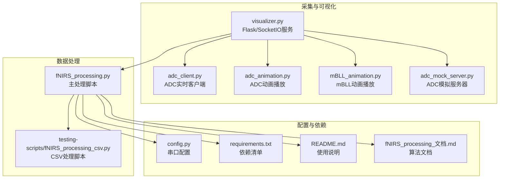
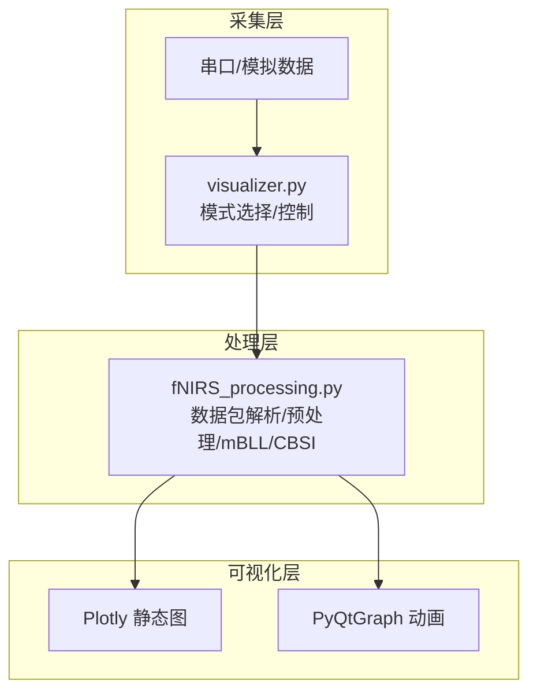
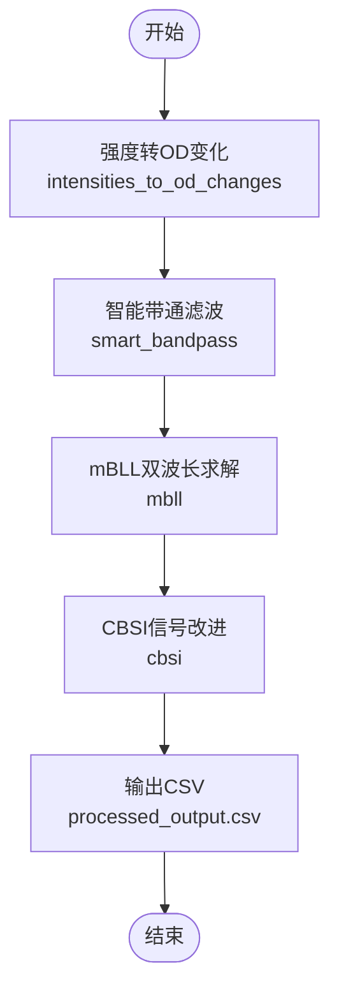
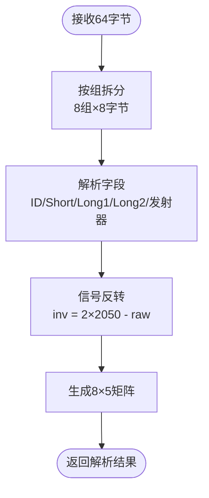
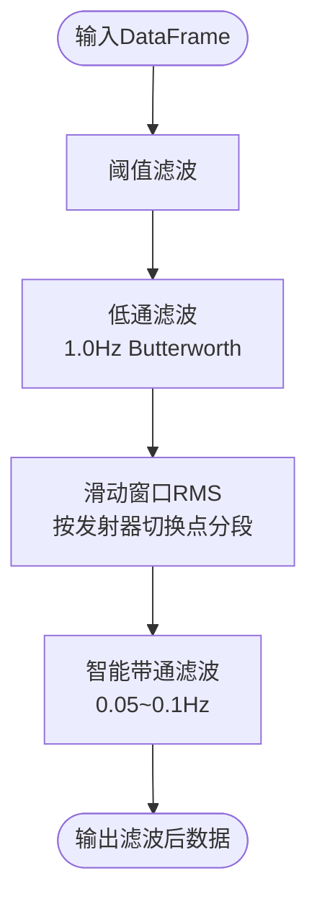
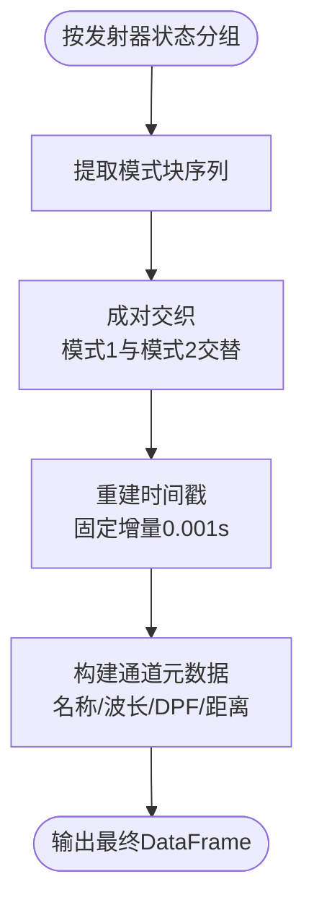
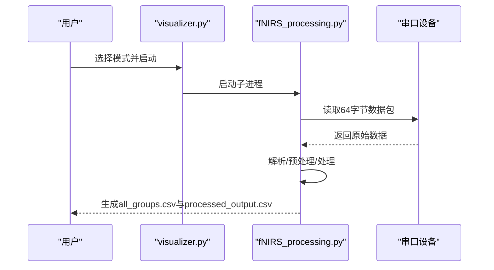
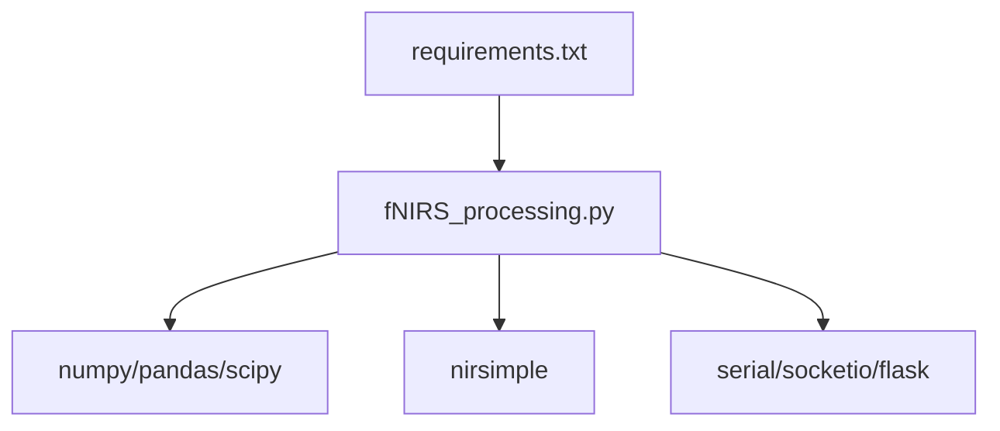

# 数据处理引擎

<cite>
**本文档引用的文件**
- [fNIRS_processing.py](file://software/fNIRS_processing.py)
- [config.py](file://software/config.py)
- [visualizer.py](file://software/visualizer.py)
- [adc_client.py](file://software/adc_client.py)
- [mBLL_animation.py](file://software/mBLL_animation.py)
- [adc_animation.py](file://software/adc_animation.py)
- [adc_mock_server.py](file://software/adc_mock_server.py)
- [requirements.txt](file://software/requirements.txt)
- [README.md](file://software/README.md)
- [fNIRS_processing_文档.md](file://software/fNIRS_processing_文档.md)
- [testing-scripts/fNIRS_processing_csv.py](file://software/testing-scripts/fNIRS_processing_csv.py)
- [testing-scripts/plot_mbll.py](file://software/testing-scripts/plot_mbll.py)
- [testing-scripts/plot_csv.py](file://software/testing-scripts/plot_csv.py)
</cite>

## 目录
1. [简介](#简介)
2. [项目结构](#项目结构)
3. [核心组件](#核心组件)
4. [架构总览](#架构总览)
5. [详细组件分析](#详细组件分析)
6. [依赖分析](#依赖分析)
7. [性能考虑](#性能考虑)
8. [故障排除指南](#故障排除指南)
9. [结论](#结论)
10. [附录](#附录)

## 简介
本文件为 fNIRS 数据处理引擎的技术文档，聚焦于 Modified Beer-Lambert Law (mBLL) 算法的数学原理与实现细节，系统化梳理从 ADC 原始数据到血红蛋白浓度变化的完整处理流水线。内容涵盖：
- mBLL 算法的双波长求解原理与实现步骤
- ADC 数据解析、信号滤波、统计分析与 CSV 输出
- 数据预处理（噪声过滤、基线校正、数据标准化）
- 传感器配置管理、数据分组处理与结果聚合
- 算法参数调优指南、性能基准测试与质量控制方法
- 错误处理策略、数据验证规则与异常情况处置

## 项目结构
软件层主要由以下模块构成：
- 数据采集与可视化：visualizer.py（Flask/SocketIO）、adc_client.py、adc_animation.py、mBLL_animation.py、adc_mock_server.py
- 数据处理：fNIRS_processing.py、testing-scripts/fNIRS_processing_csv.py
- 配置与依赖：config.py、requirements.txt
- 文档与示例：README.md、fNIRS_processing_文档.md、testing-scripts/plot_csv.py、testing-scripts/plot_mbll.py

**图表来源**
- [visualizer.py:591-735](file://software/visualizer.py#L591-L735)
- [adc_client.py:39-86](file://software/adc_client.py#L39-L86)
- [adc_animation.py:44-48](file://software/adc_animation.py#L44-L48)
- [mBLL_animation.py:44-46](file://software/mBLL_animation.py#L44-L46)
- [adc_mock_server.py:15-64](file://software/adc_mock_server.py#L15-L64)
- [fNIRS_processing.py:187-235](file://software/fNIRS_processing.py#L187-L235)
- [testing-scripts/fNIRS_processing_csv.py:188-235](file://software/testing-scripts/fNIRS_processing_csv.py#L188-L235)
- [config.py:7-12](file://software/config.py#L7-L12)
- [requirements.txt:1-15](file://software/requirements.txt#L1-L15)
- [README.md:1-180](file://software/README.md#L1-L180)
- [fNIRS_processing_文档.md:1-531](file://software/fNIRS_processing_文档.md#L1-L531)

**章节来源**
- [README.md:1-180](file://software/README.md#L1-L180)
- [fNIRS_processing_文档.md:1-531](file://software/fNIRS_processing_文档.md#L1-L531)

## 核心组件
- 串口数据采集与解析：负责从硬件读取 64 字节数据包，解析为 8 组传感器数据，并进行信号反转处理。
- 预处理模块：阈值滤波抑制异常值；低通滤波去除高频噪声；滑动窗口 RMS 计算将时域信号转为能量表示。
- 数据交织与时间重采样：基于发射器状态变化点识别模式块，交错相邻模式块，并重建时间戳。
- mBLL 与 CBSI：将强度转换为光密度变化，带通滤波后应用 mBLL 双波长求解，再经 CBSI 改进信号质量。
- CSV 输出与可视化：生成 processed_output.csv，支持 Plotly 静态图与 PyQtGraph 动画展示。

**章节来源**
- [fNIRS_processing.py:160-186](file://software/fNIRS_processing.py#L160-L186)
- [fNIRS_processing.py:51-67](file://software/fNIRS_processing.py#L51-L67)
- [fNIRS_processing.py:68-83](file://software/fNIRS_processing.py#L68-L83)
- [fNIRS_processing.py:84-127](file://software/fNIRS_processing.py#L84-L127)
- [fNIRS_processing.py:236-278](file://software/fNIRS_processing.py#L236-L278)
- [fNIRS_processing.py:339-443](file://software/fNIRS_processing.py#L339-L443)
- [fNIRS_processing_文档.md:396-427](file://software/fNIRS_processing_文档.md#L396-L427)

## 架构总览
系统采用“采集-处理-可视化”三层架构：
- 采集层：visualizer.py 作为统一入口，支持 ADC 与 mBLL 两种模式；也可通过 demo 模式运行模拟数据。
- 处理层：fNIRS_processing.py 完成从原始 ADC 到血红蛋白浓度的全流程处理。
- 可视化层：提供静态 Plotly 图与实时 PyQtGraph 动画，支持交互缩放、全屏等。

**图表来源**
- [visualizer.py:648-714](file://software/visualizer.py#L648-L714)
- [fNIRS_processing.py:339-443](file://software/fNIRS_processing.py#L339-L443)
- [plot_csv.py:17-87](file://software/testing-scripts/plot_csv.py#L17-L87)
- [mBLL_animation.py:103-133](file://software/mBLL_animation.py#L103-L133)

**章节来源**
- [visualizer.py:591-735](file://software/visualizer.py#L591-L735)
- [fNIRS_processing.py:445-496](file://software/fNIRS_processing.py#L445-L496)

## 详细组件分析

### Modified Beer-Lambert Law (mBLL) 算法
- 数学原理
  - 单色 Beer-Lambert 定律：OD = ε·c·d·DPF
  - 双波长模型：利用 660nm 与 940nm 的 OD 差分，建立线性方程组求解 Δ[HbO] 与 Δ[HbR]
  - DPF（差分路径因子）随波长与受试者年龄变化，通过 nirsimple.preprocessing.get_dpf 计算
- 实现要点
  - 强制带通滤波：低频 ≥ 0.05 Hz，高频 ≤ 0.1 Hz，去除漂移与脉搏噪声
  - 零相位滤波：使用 sosfiltfilt 保证时序不变性
  - CBSI 改进：利用 HbO/HbR 负相关特性提升信噪比
- 输出格式：processed_output.csv，列名为 Ss_Dd_hbo 与 Ss_Dd_hbr

**图表来源**
- [fNIRS_processing.py:397-418](file://software/fNIRS_processing.py#L397-L418)
- [fNIRS_processing_文档.md:396-427](file://software/fNIRS_processing_文档.md#L396-L427)

**章节来源**
- [fNIRS_processing.py:397-418](file://software/fNIRS_processing.py#L397-L418)
- [fNIRS_processing_文档.md:396-427](file://software/fNIRS_processing_文档.md#L396-L427)

### 数据包解析与信号反转
- 输入：64 字节原始数据包，每组 8 字节
- 解析：提取 Group ID、Short/Long1/Long2 通道值，发射器状态
- 反转：inv = 2 × 2050 − raw，使信号方向与物理意义一致
- 输出：8×5 数值矩阵，供后续处理使用

**图表来源**
- [fNIRS_processing.py:160-186](file://software/fNIRS_processing.py#L160-L186)

**章节来源**
- [fNIRS_processing.py:160-186](file://software/fNIRS_processing.py#L160-L186)
- [fNIRS_processing_文档.md:59-91](file://software/fNIRS_processing_文档.md#L59-L91)

### 预处理与滤波
- 阈值滤波：剔除超出范围的异常值，替换为零电平
- 低通滤波：Butterworth 低通，截止频率 1.0 Hz，零相位滤波
- 滑动窗口 RMS：按发射器状态变化点分段，计算每段 RMS，去除直流分量可选
- 智能带通：自动降采样/升采样，SOS 带通滤波，零相位处理

**图表来源**
- [fNIRS_processing.py:51-67](file://software/fNIRS_processing.py#L51-L67)
- [fNIRS_processing.py:68-83](file://software/fNIRS_processing.py#L68-L83)
- [fNIRS_processing.py:84-127](file://software/fNIRS_processing.py#L84-L127)
- [fNIRS_processing.py:129-159](file://software/fNIRS_processing.py#L129-L159)

**章节来源**
- [fNIRS_processing.py:51-127](file://software/fNIRS_processing.py#L51-L127)
- [fNIRS_processing.py:129-159](file://software/fNIRS_processing.py#L129-L159)
- [fNIRS_processing_文档.md:94-197](file://software/fNIRS_processing_文档.md#L94-L197)

### 数据分组与结果聚合
- 模式块识别：根据发射器状态列检测模式切换点，形成连续块序列
- 成对交织：将相邻模式块交错排列，保证 660nm 与 940nm 成对对应
- 时间戳重建：使用固定增量（0.001s）重建时间轴，四舍五入避免浮点误差
- 通道元数据：构建 48 通道（8 组 × 3 探测器 × 2 波长）的名称、波长、DPF、距离

**图表来源**
- [fNIRS_processing.py:236-278](file://software/fNIRS_processing.py#L236-L278)
- [fNIRS_processing.py:279-303](file://software/fNIRS_processing.py#L279-L303)

**章节来源**
- [fNIRS_processing.py:236-303](file://software/fNIRS_processing.py#L236-L303)

### 串口配置与运行流程
- 串口配置：SERIAL_PORT、BAUD_RATE、TIMEOUT 在 config.py 中定义
- 运行模式：visualizer.py 提供 live 与 record 模式；record 模式启动 fNIRS_processing.py
- 停止机制：支持 SIGUSR1 信号与 Enter 键停止采集

**图表来源**
- [visualizer.py:648-714](file://software/visualizer.py#L648-L714)
- [fNIRS_processing.py:187-235](file://software/fNIRS_processing.py#L187-L235)
- [config.py:7-12](file://software/config.py#L7-L12)

**章节来源**
- [config.py:7-12](file://software/config.py#L7-L12)
- [visualizer.py:648-714](file://software/visualizer.py#L648-L714)
- [fNIRS_processing.py:445-496](file://software/fNIRS_processing.py#L445-L496)

## 依赖分析
- 核心库：numpy、pandas、scipy、serial、csv、nirsimple、tabulate
- 可视化：plotly、PyQt5、pyqtgraph
- 通信：Flask、Flask_SocketIO、python-socketio、eventlet
- 数据文件：sample_data 目录下的 all_groups.csv、processed_output.csv

**图表来源**
- [requirements.txt:1-15](file://software/requirements.txt#L1-L15)
- [fNIRS_processing.py:10-21](file://software/fNIRS_processing.py#L10-L21)

**章节来源**
- [requirements.txt:1-15](file://software/requirements.txt#L1-L15)
- [fNIRS_processing.py:10-21](file://software/fNIRS_processing.py#L10-L21)

## 性能考虑
- 滤波器设计：使用 SOS 带通与零相位滤波，兼顾稳定性与时序保真
- 自适应采样：根据实际时间戳计算采样率，避免固定值带来的误差
- 内存管理：滑动窗口与队列更新，限制缓存大小防止内存膨胀
- I/O 优化：批量写入 CSV，flush 避免阻塞

[本节为通用指导，无需特定文件引用]

## 故障排除指南
- 串口连接失败
  - 检查 SERIAL_PORT 路径与权限
  - 确认波特率与超时设置合理
- 数据异常或缺失
  - 使用阈值滤波与低通滤波参数调整
  - 检查发射器状态列是否正确，确保模式块识别准确
- 处理速度慢
  - 适当降低目标采样率或使用降采样
  - 确保未启用不必要的可视化或绘图
- 可视化问题
  - Plotly 静态图需网络加载库，确保浏览器可访问
  - PyQtGraph 动画需安装 PyQt5 与 pyqtgraph

**章节来源**
- [config.py:7-12](file://software/config.py#L7-L12)
- [fNIRS_processing.py:51-83](file://software/fNIRS_processing.py#L51-L83)
- [fNIRS_processing.py:236-278](file://software/fNIRS_processing.py#L236-L278)
- [plot_csv.py:17-87](file://software/testing-scripts/plot_csv.py#L17-L87)

## 结论
本数据处理引擎以 mBLL 为核心，结合多阶段滤波与信号改进技术，实现了从原始 ADC 到血红蛋白浓度变化的稳健流程。通过模块化的数据包解析、预处理、交织与处理步骤，系统具备良好的扩展性与可维护性。配合可视化工具链，用户可在不同模式下完成实时监测与离线分析。

[本节为总结性内容，无需特定文件引用]

## 附录

### 算法参数调优指南
- 低通滤波：1.0 Hz 截止，保留 fNIRS 有效频段
- 带通滤波：0.05–0.1 Hz，去除漂移与脉搏伪影
- 滤波器阶数：4，平衡效果与稳定性
- 阈值范围：200–4000，替代值 2050
- RMS 去直流：可选，依据信号特性决定

**章节来源**
- [fNIRS_processing_文档.md:507-518](file://software/fNIRS_processing_文档.md#L507-L518)

### 质量控制方法
- 数据验证：检查列数、时间戳连续性、发射器状态一致性
- 伪影识别：利用 CBSI 的相关性分析剔除异常
- 交叉验证：对比不同受试者与任务状态下的信号趋势

**章节来源**
- [fNIRS_processing.py:373-378](file://software/fNIRS_processing.py#L373-L378)
- [fNIRS_processing_文档.md:422-427](file://software/fNIRS_processing_文档.md#L422-L427)

### 示例与演示
- 静态图：plot_csv.py 生成 ADC 与 mBLL 的 Plotly 静态页面
- 动画：adc_animation.py 与 mBLL_animation.py 提供全屏实时动画
- 模拟数据：adc_mock_server.py 与 testing-scripts/fNIRS_processing_csv.py 支持离线演示

**章节来源**
- [plot_csv.py:17-192](file://software/testing-scripts/plot_csv.py#L17-L192)
- [plot_mbll.py:1-113](file://software/testing-scripts/plot_mbll.py#L1-L113)
- [adc_animation.py:44-143](file://software/adc_animation.py#L44-L143)
- [mBLL_animation.py:44-140](file://software/mBLL_animation.py#L44-L140)
- [adc_mock_server.py:15-64](file://software/adc_mock_server.py#L15-L64)
- [testing-scripts/fNIRS_processing_csv.py:447-497](file://software/testing-scripts/fNIRS_processing_csv.py#L447-L497)