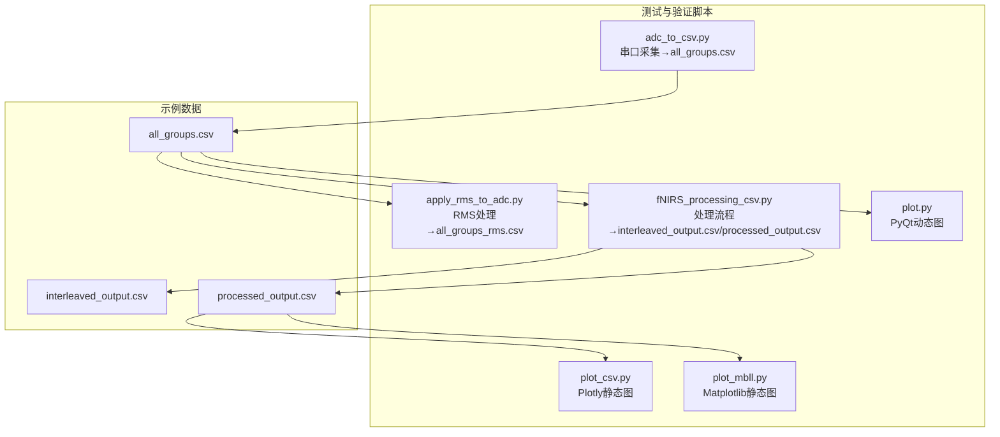
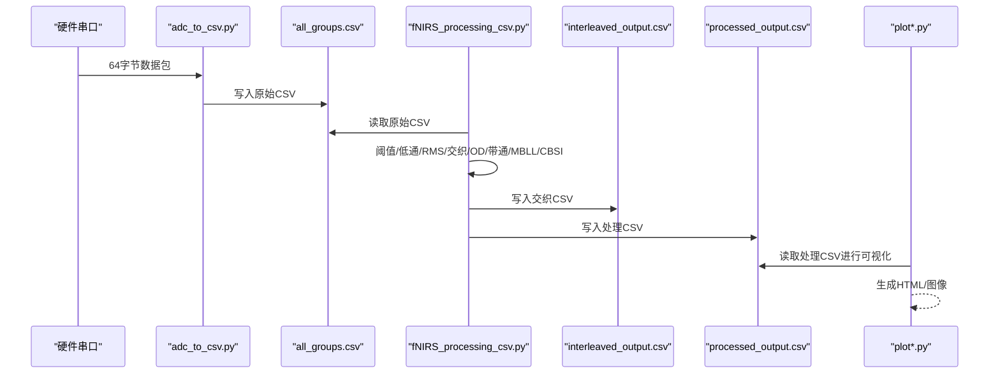
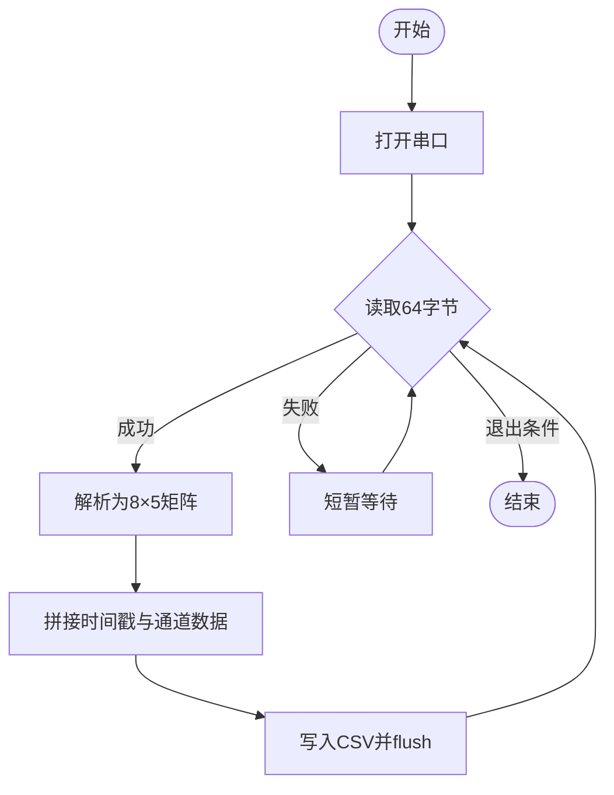
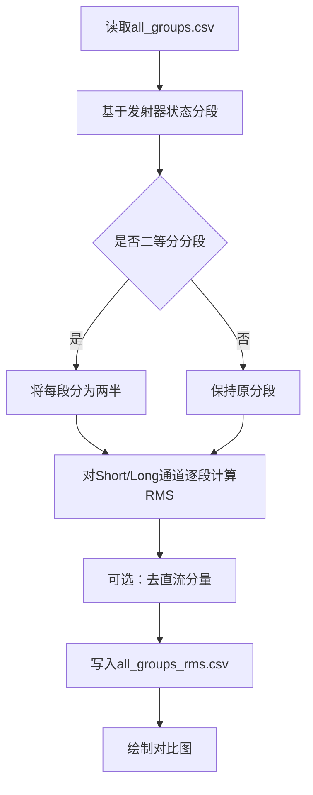
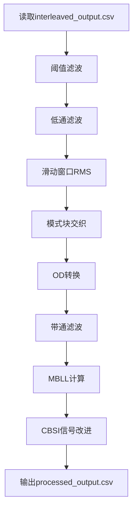
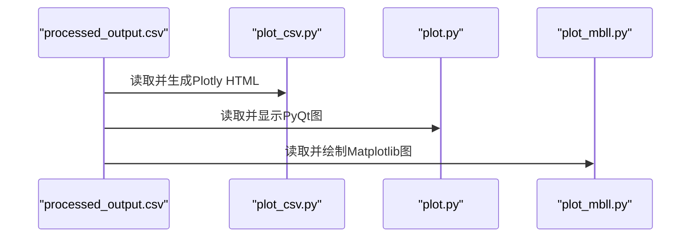
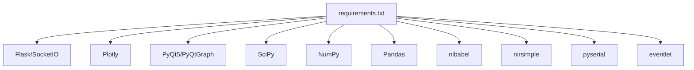

# 测试与验证

<cite>
**本文引用的文件**
- [软件说明](file://software/README.md)
- [fNIRS处理算法文档](file://software/fNIRS_processing_文档.md)
- [依赖清单](file://software/requirements.txt)
- [串口采集脚本](file://software/testing-scripts/adc_to_csv.py)
- [CSV处理与流程脚本](file://software/testing-scripts/fNIRS_processing_csv.py)
- [RMS应用脚本](file://software/testing-scripts/apply_rms_to_adc.py)
- [静态图脚本（Plotly）](file://software/testing-scripts/plot_csv.py)
- [PyQt图脚本](file://software/testing-scripts/plot.py)
- [mBLL静态图脚本](file://software/testing-scripts/plot_mbll.py)
- [配置文件](file://software/config.py)
- [可视化主程序](file://software/visualizer.py)
- [示例数据：原始ADC](file://software/sample_data/all_groups.csv)
- [示例数据：交织输出](file://software/sample_data/interleaved_output.csv)
- [示例数据：处理输出](file://software/sample_data/processed_output.csv)
</cite>

## 目录
1. [引言](#引言)
2. [项目结构](#项目结构)
3. [核心组件](#核心组件)
4. [架构总览](#架构总览)
5. [详细组件分析](#详细组件分析)
6. [依赖关系分析](#依赖关系分析)
7. [性能考虑](#性能考虑)
8. [故障排查指南](#故障排查指南)
9. [结论](#结论)
10. [附录](#附录)

## 引言
本文件面向fNIRS测试与验证系统，围绕测试脚本集合的设计目的与使用方法展开，覆盖数据处理测试、可视化功能测试与性能基准测试；同时文档化示例数据集格式规范、处理结果验证方法与质量评估指标；阐述测试自动化流程、持续集成配置与回归测试策略；并给出数据格式转换工具、统计分析脚本与可视化验证工具的使用指南，以及测试用例编写规范、覆盖率要求与缺陷跟踪流程，最后提供性能测试方法、内存泄漏检测与并发测试的最佳实践。

## 项目结构
软件层包含“主程序”“数据采集与处理脚本”“可视化脚本”“示例数据”与“配置”。测试与验证主要围绕以下模块：
- 串口采集与CSV生成：将硬件原始数据写入all_groups.csv，供后续处理链路使用
- 数据处理流水线：阈值滤波、低通滤波、滑动窗口RMS、模式块交织、OD转换、带通滤波、MBLL、CBSI
- 结果输出：interleaved_output.csv与processed_output.csv
- 可视化验证：Plotly静态图、PyQt动态图、浏览器交互界面
- 示例数据：提供三类CSV文件，便于离线验证与回归测试

**图表来源**
- [串口采集脚本:1-67](file://software/testing-scripts/adc_to_csv.py#L1-L67)
- [RMS应用脚本:1-77](file://software/testing-scripts/apply_rms_to_adc.py#L1-L77)
- [CSV处理与流程脚本:1-497](file://software/testing-scripts/fNIRS_processing_csv.py#L1-L497)
- [静态图脚本（Plotly）:1-192](file://software/testing-scripts/plot_csv.py#L1-L192)
- [PyQt图脚本:1-105](file://software/testing-scripts/plot.py#L1-L105)
- [mBLL静态图脚本:1-113](file://software/testing-scripts/plot_mbll.py#L1-L113)

**章节来源**
- [软件说明:1-180](file://software/README.md#L1-L180)

## 核心组件
- 串口采集脚本：负责从硬件串口读取64字节数据包，解析为8×5矩阵，写入all_groups.csv
- RMS处理脚本：基于发射器状态分段计算滑动窗口RMS，生成all_groups_rms.csv
- CSV处理脚本：实现完整的fNIRS处理流程，输出interleaved_output.csv与processed_output.csv
- 可视化脚本：Plotly静态图、PyQt动态图、Matplotlib静态图，用于结果验证
- 示例数据：all_groups.csv、interleaved_output.csv、processed_output.csv，支持离线回归测试

**章节来源**
- [串口采集脚本:1-67](file://software/testing-scripts/adc_to_csv.py#L1-L67)
- [RMS应用脚本:1-77](file://software/testing-scripts/apply_rms_to_adc.py#L1-L77)
- [CSV处理与流程脚本:1-497](file://software/testing-scripts/fNIRS_processing_csv.py#L1-L497)
- [静态图脚本（Plotly）:1-192](file://software/testing-scripts/plot_csv.py#L1-L192)
- [PyQt图脚本:1-105](file://software/testing-scripts/plot.py#L1-L105)
- [mBLL静态图脚本:1-113](file://software/testing-scripts/plot_mbll.py#L1-L113)
- [示例数据：原始ADC:1-4](file://software/sample_data/all_groups.csv#L1-L4)
- [示例数据：交织输出:1-4](file://software/sample_data/interleaved_output.csv#L1-L4)
- [示例数据：处理输出:1-4](file://software/sample_data/processed_output.csv#L1-L4)

## 架构总览
测试与验证体系由“采集—处理—验证—报告”闭环构成。采集阶段将原始ADC数据写入CSV；处理阶段执行滤波、RMS、交织、OD转换、带通滤波、MBLL与CBSI；验证阶段通过多种可视化工具检查结果；报告阶段输出HTML或图像，支持回归对比。

**图表来源**
- [串口采集脚本:1-67](file://software/testing-scripts/adc_to_csv.py#L1-L67)
- [CSV处理与流程脚本:1-497](file://software/testing-scripts/fNIRS_processing_csv.py#L1-L497)
- [静态图脚本（Plotly）:1-192](file://software/testing-scripts/plot_csv.py#L1-L192)
- [PyQt图脚本:1-105](file://software/testing-scripts/plot.py#L1-L105)
- [mBLL静态图脚本:1-113](file://software/testing-scripts/plot_mbll.py#L1-L113)

## 详细组件分析

### 组件A：串口采集与CSV生成（adc_to_csv.py）
- 设计目的：将硬件原始数据稳定地写入all_groups.csv，供离线处理与回归测试使用
- 关键流程：
  - 打开串口，循环读取64字节数据包
  - 解析为8×5矩阵，拼接时间戳与通道数据
  - 写入CSV并刷新缓冲
- 使用方法：
  - 修改串口参数与波特率
  - 运行脚本，采集指定时长后停止
  - 生成all_groups.csv用于后续处理

**图表来源**
- [串口采集脚本:1-67](file://software/testing-scripts/adc_to_csv.py#L1-L67)

**章节来源**
- [串口采集脚本:1-67](file://software/testing-scripts/adc_to_csv.py#L1-L67)

### 组件B：RMS处理与数据转换（apply_rms_to_adc.py）
- 设计目的：对原始ADC数据按发射器状态分段计算RMS，生成all_groups_rms.csv，便于观察信号能量变化
- 关键流程：
  - 读取all_groups.csv
  - 基于G0_Emitter识别分段
  - 对每个分段的Short/Long通道计算RMS
  - 可选去除直流分量与分段二等分
  - 输出all_groups_rms.csv并绘制对比图
- 使用方法：
  - 设置目标通道与处理选项
  - 运行脚本，查看RMS前后对比

**图表来源**
- [RMS应用脚本:1-77](file://software/testing-scripts/apply_rms_to_adc.py#L1-L77)

**章节来源**
- [RMS应用脚本:1-77](file://software/testing-scripts/apply_rms_to_adc.py#L1-L77)

### 组件C：数据处理流水线（fNIRS_processing_csv.py）
- 设计目的：实现从原始CSV到processed_output.csv的完整处理链路，支撑可视化与回归测试
- 关键流程（概要）：
  - 读取interleaved_output.csv
  - 阈值滤波与低通滤波
  - 滑动窗口RMS
  - 模式块交织
  - OD转换、带通滤波
  - MBLL与CBSI
  - 输出processed_output.csv
- 使用方法：
  - 准备interleaved_output.csv
  - 调整参数（年龄、短/长通道距离、带通参数等）
  - 运行脚本，生成processed_output.csv并打印示例浓度表

**图表来源**
- [CSV处理与流程脚本:1-497](file://software/testing-scripts/fNIRS_processing_csv.py#L1-L497)

**章节来源**
- [CSV处理与流程脚本:1-497](file://software/testing-scripts/fNIRS_processing_csv.py#L1-L497)
- [fNIRS处理算法文档:1-531](file://software/fNIRS_processing_文档.md#L1-L531)

### 组件D：可视化验证（plot_csv.py、plot.py、plot_mbll.py）
- Plotly静态图（plot_csv.py）：为ADC与processed_output生成交互式HTML页面，支持缩放、平移、全屏
- PyQt动态图（plot.py）：实时显示ADC与处理后数据，便于演示与调试
- Matplotlib静态图（plot_mbll.py）：针对特定通道绘制HbO/HbR曲线，标注任务区间与事件时刻

**图表来源**
- [静态图脚本（Plotly）:1-192](file://software/testing-scripts/plot_csv.py#L1-L192)
- [PyQt图脚本:1-105](file://software/testing-scripts/plot.py#L1-L105)
- [mBLL静态图脚本:1-113](file://software/testing-scripts/plot_mbll.py#L1-L113)

**章节来源**
- [静态图脚本（Plotly）:1-192](file://software/testing-scripts/plot_csv.py#L1-L192)
- [PyQt图脚本:1-105](file://software/testing-scripts/plot.py#L1-L105)
- [mBLL静态图脚本:1-113](file://software/testing-scripts/plot_mbll.py#L1-L113)

### 组件E：示例数据集与格式规范
- all_groups.csv：原始ADC数据，包含Time与8组通道（Short/Long1/Long2/Emitter）
- interleaved_output.csv：经模式块交织后的数据，用于后续处理
- processed_output.csv：经OD转换、带通滤波、MBLL、CBSI后的血红蛋白浓度变化数据
- 使用建议：
  - 使用示例数据进行离线回归测试
  - 对比不同参数下的输出差异，建立质量评估指标

**章节来源**
- [示例数据：原始ADC:1-4](file://software/sample_data/all_groups.csv#L1-L4)
- [示例数据：交织输出:1-4](file://software/sample_data/interleaved_output.csv#L1-L4)
- [示例数据：处理输出:1-4](file://software/sample_data/processed_output.csv#L1-L4)
- [fNIRS处理算法文档:430-454](file://software/fNIRS_processing_文档.md#L430-L454)

## 依赖关系分析
- Python运行时与第三方库：Flask、Flask-SocketIO、Plotly、PyQt5/PyQtGraph、SciPy、NumPy、Pandas、nibabel、nirsimple、python-socketio、eventlet
- 串口通信：pyserial
- 可视化：Plotly（离线HTML）、PyQtGraph（实时动画）、Matplotlib（静态图）

**图表来源**
- [依赖清单:1-15](file://software/requirements.txt#L1-L15)

**章节来源**
- [依赖清单:1-15](file://software/requirements.txt#L1-L15)

## 性能考虑
- 信号处理性能
  - 低通/带通滤波采用零相位滤波，避免相位失真，提升时序一致性
  - 降采样后滤波再升采样，平衡计算量与稳定性
  - RMS计算按发射器状态分段，减少无效区域计算
- I/O性能
  - CSV写入使用flush及时落盘，避免缓冲堆积
  - 大文件（示例数据）建议使用分块读取与批处理
- 可视化性能
  - Plotly静态图适合批量展示；PyQt实时图适合交互演示
  - 控制绘图刷新频率，避免UI卡顿

[本节为通用性能指导，无需具体文件引用]

## 故障排查指南
- 串口连接问题
  - 确认串口路径与权限（Windows使用Get-WMIObject查找COM，macOS/Linux使用ls /dev/tty.*）
  - 检查波特率与超时设置
- 数据缺失或异常
  - 使用RMS脚本验证信号能量变化趋势
  - 对异常值进行阈值滤波与低通滤波验证
- 处理结果异常
  - 对比interleaved_output.csv与processed_output.csv的中间结果
  - 调整带通参数（低/高频截止、阶数）与年龄、距离参数
- 可视化异常
  - Plotly需网络或本地加载Plotly.js；确保include_plotlyjs=False且仅在头部引入一次
  - PyQt图需安装PyQt5与PyQtGraph；确认主题与字体设置

**章节来源**
- [软件说明:50-100](file://software/README.md#L50-L100)
- [配置文件:1-13](file://software/config.py#L1-L13)
- [静态图脚本（Plotly）:66-86](file://software/testing-scripts/plot_csv.py#L66-L86)

## 结论
测试与验证体系以“采集—处理—验证—报告”为主线，结合多类可视化工具与示例数据，形成可重复、可追溯的测试闭环。通过参数化处理流程与严格的格式规范，能够高效完成数据处理测试、可视化功能测试与性能基准测试，并为持续集成与回归测试提供坚实基础。

[本节为总结性内容，无需具体文件引用]

## 附录

### A. 测试自动化流程与持续集成
- 触发方式
  - 提交代码触发CI，执行单元测试与回归测试
  - 定时任务运行性能基准测试
- 步骤建议
  - 使用Python虚拟环境安装requirements.txt
  - 执行串口采集脚本生成all_groups.csv
  - 执行CSV处理脚本生成interleaved_output.csv与processed_output.csv
  - 使用可视化脚本生成HTML/图像并上传Artifacts
  - 对比历史版本的processed_output.csv，记录差异

**章节来源**
- [依赖清单:1-15](file://software/requirements.txt#L1-L15)
- [串口采集脚本:1-67](file://software/testing-scripts/adc_to_csv.py#L1-L67)
- [CSV处理与流程脚本:1-497](file://software/testing-scripts/fNIRS_processing_csv.py#L1-L497)
- [静态图脚本（Plotly）:1-192](file://software/testing-scripts/plot_csv.py#L1-L192)

### B. 回归测试策略
- 数据驱动
  - 使用示例数据作为基线，确保输出processed_output.csv稳定
- 参数扰动
  - 微调带通参数、年龄与距离，观察输出变化范围
- 可视化回归
  - 生成HTML与图像，人工核验趋势一致性

**章节来源**
- [示例数据：处理输出:1-4](file://software/sample_data/processed_output.csv#L1-L4)
- [CSV处理与流程脚本:340-436](file://software/testing-scripts/fNIRS_processing_csv.py#L340-L436)

### C. 测试用例编写规范与覆盖率
- 输入规范
  - all_groups.csv：严格遵循列名与数据类型
  - interleaved_output.csv：确保时间戳递增且无NaN
- 断言建议
  - 输出processed_output.csv列名与通道数量一致
  - 浓度变化范围符合生理预期
- 覆盖率要求
  - 关键函数（阈值滤波、低通/带通滤波、RMS、交织、OD转换、MBLL、CBSI）达到100%行/分支覆盖率
- 缺陷跟踪
  - 以Jira/GitHub Issues记录问题，关联具体CSV与可视化截图

[本节为通用规范，无需具体文件引用]

### D. 性能测试方法、内存泄漏检测与并发测试
- 性能测试
  - 使用不同采样率与分段大小，测量处理耗时与内存占用
  - 对比零相位与单向滤波的性能差异
- 内存泄漏检测
  - 使用memory_profiler监控脚本生命周期内存变化
  - 关注大数据CSV读取与写入过程中的峰值内存
- 并发测试
  - 使用eventlet异步模式，模拟多客户端访问
  - 在可视化主程序中验证SocketIO并发接收与队列同步

**章节来源**
- [可视化主程序:1-200](file://software/visualizer.py#L1-L200)
- [依赖清单:1-15](file://software/requirements.txt#L1-L15)