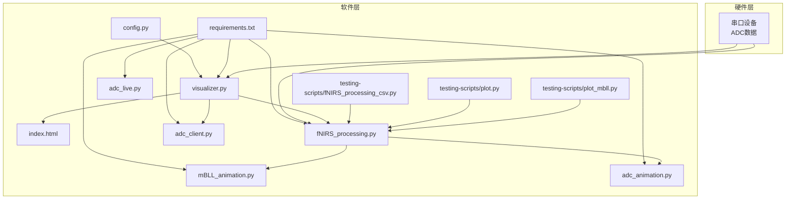
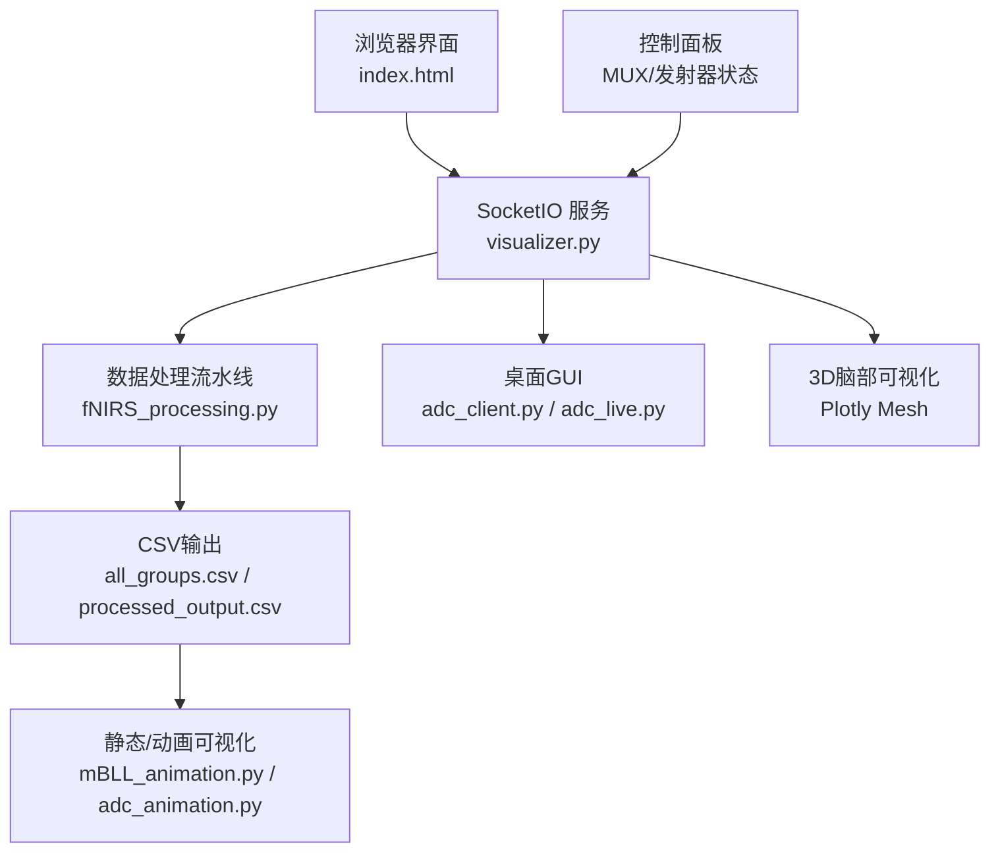
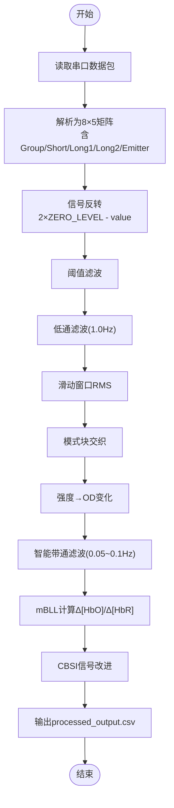
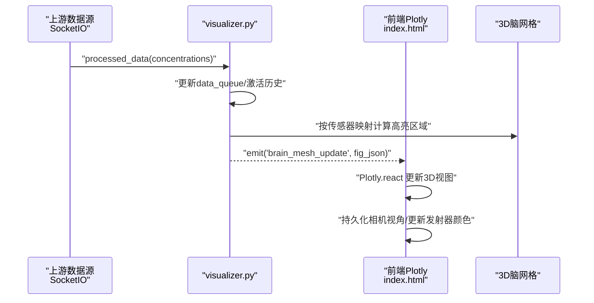
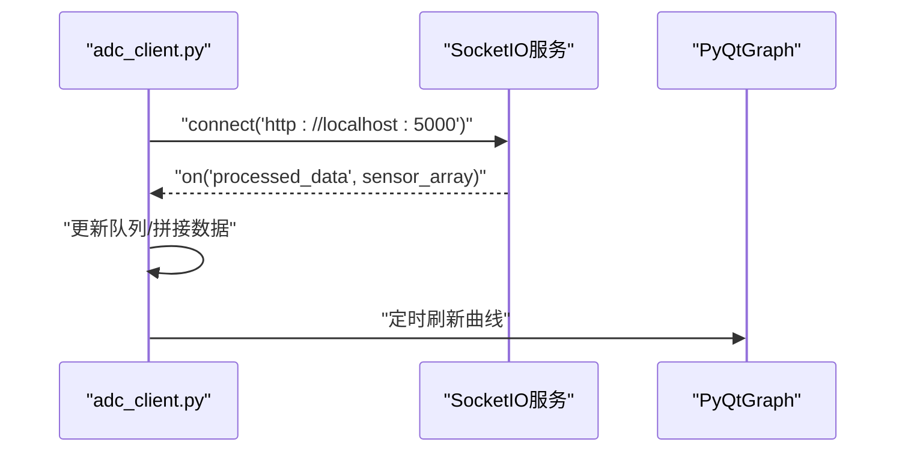
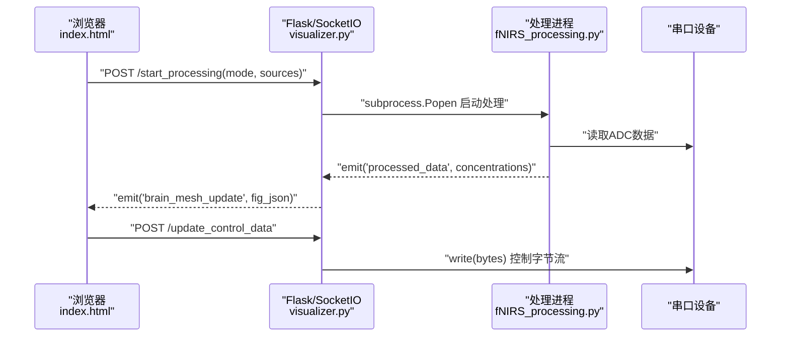
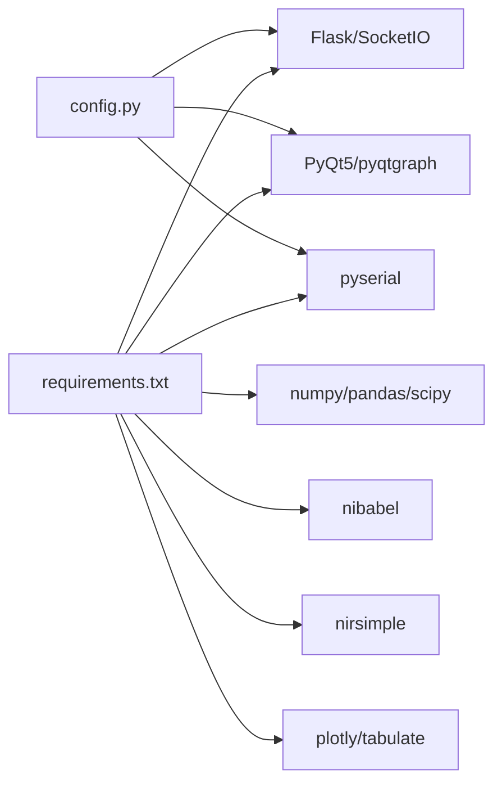

# 软件应用

<cite>
**本文引用的文件**
- [README.md](file://README.md)
- [software/README.md](file://software/README.md)
- [software/requirements.txt](file://software/requirements.txt)
- [software/config.py](file://software/config.py)
- [software/fNIRS_processing.py](file://software/fNIRS_processing.py)
- [software/fNIRS_processing_文档.md](file://software/fNIRS_processing_文档.md)
- [software/visualizer.py](file://software/visualizer.py)
- [software/index.html](file://software/index.html)
- [software/adc_live.py](file://software/adc_live.py)
- [software/adc_client.py](file://software/adc_client.py)
- [software/mBLL_animation.py](file://software/mBLL_animation.py)
- [software/adc_animation.py](file://software/adc_animation.py)
- [software/testing-scripts/fNIRS_processing_csv.py](file://software/testing-scripts/fNIRS_processing_csv.py)
- [software/testing-scripts/plot.py](file://software/testing-scripts/plot.py)
- [software/testing-scripts/plot_mbll.py](file://software/testing-scripts/plot_mbll.py)
</cite>

## 目录
1. [简介](#简介)
2. [项目结构](#项目结构)
3. [核心组件](#核心组件)
4. [架构总览](#架构总览)
5. [详细组件分析](#详细组件分析)
6. [依赖分析](#依赖分析)
7. [性能考虑](#性能考虑)
8. [故障排查指南](#故障排查指南)
9. [结论](#结论)
10. [附录](#附录)

## 简介
本项目是一个基于Python的桌面GUI应用程序，面向可穿戴fNIRS（功能性近红外光谱）脑接口系统，提供实时数据采集、处理与可视化能力。系统支持两种工作模式：
- 实时读数模式（仅ADC）
- 录制与可视化模式（ADC与mBLL）

系统采用Flask + SocketIO作为Web服务与实时通信内核，结合PyQt5/PyQtGraph构建桌面GUI，同时提供3D脑部可视化与交互控制面板。数据处理链路遵循“双波长采集 + 交织 + OD转换 + 带通滤波 + Modified Beer-Lambert Law（mBLL）+ CBSI”流程，最终输出CSV并支持静态/动画可视化。

## 项目结构
软件子目录包含以下关键模块：
- 配置与依赖：config.py、requirements.txt
- 数据处理：fNIRS_processing.py、testing-scripts/fNIRS_processing_csv.py
- Web可视化与控制：visualizer.py、index.html
- 桌面GUI：adc_live.py、adc_client.py、mBLL_animation.py、adc_animation.py
- 测试与绘图：testing-scripts/plot.py、testing-scripts/plot_mbll.py

图表来源
- [software/visualizer.py:1-120](file://software/visualizer.py#L1-L120)
- [software/fNIRS_processing.py:1-120](file://software/fNIRS_processing.py#L1-L120)
- [software/index.html:1-120](file://software/index.html#L1-L120)
- [software/adc_client.py:1-120](file://software/adc_client.py#L1-L120)
- [software/adc_live.py:1-120](file://software/adc_live.py#L1-L120)
- [software/mBLL_animation.py:1-120](file://software/mBLL_animation.py#L1-L120)
- [software/adc_animation.py:1-120](file://software/adc_animation.py#L1-L120)
- [software/testing-scripts/fNIRS_processing_csv.py:1-120](file://software/testing-scripts/fNIRS_processing_csv.py#L1-L120)
- [software/testing-scripts/plot.py:1-120](file://software/testing-scripts/plot.py#L1-L120)
- [software/testing-scripts/plot_mbll.py:1-120](file://software/testing-scripts/plot_mbll.py#L1-L120)

章节来源
- [software/README.md:1-180](file://software/README.md#L1-L180)
- [README.md:1-19](file://README.md#L1-L19)

## 核心组件
- 配置与串口参数：config.py定义串口设备、波特率与超时，供所有需要串口通信的模块使用。
- 数据处理引擎：fNIRS_processing.py实现完整的数据采集、预处理、交织、OD转换、带通滤波、mBLL与CBSI，并输出CSV。
- Web可视化与实时通信：visualizer.py基于Flask+SocketIO，提供3D脑部可视化、控制面板、下载与模式切换；index.html为前端界面。
- 桌面GUI：adc_live.py与adc_client.py分别提供实时ADC读数的桌面可视化；mBLL_animation.py与adc_animation.py提供CSV驱动的动画展示。
- 测试与绘图：testing-scripts提供独立的数据处理脚本与绘图工具，便于验证与演示。

章节来源
- [software/config.py:1-13](file://software/config.py#L1-L13)
- [software/fNIRS_processing.py:1-120](file://software/fNIRS_processing.py#L1-L120)
- [software/visualizer.py:1-120](file://software/visualizer.py#L1-L120)
- [software/index.html:1-120](file://software/index.html#L1-L120)
- [software/adc_live.py:1-120](file://software/adc_live.py#L1-L120)
- [software/adc_client.py:1-120](file://software/adc_client.py#L1-L120)
- [software/mBLL_animation.py:1-120](file://software/mBLL_animation.py#L1-L120)
- [software/adc_animation.py:1-120](file://software/adc_animation.py#L1-L120)
- [software/testing-scripts/fNIRS_processing_csv.py:1-120](file://software/testing-scripts/fNIRS_processing_csv.py#L1-L120)
- [software/testing-scripts/plot.py:1-120](file://software/testing-scripts/plot.py#L1-L120)
- [software/testing-scripts/plot_mbll.py:1-120](file://software/testing-scripts/plot_mbll.py#L1-L120)

## 架构总览
系统采用“Web服务 + 实时通信 + 桌面GUI + 数据处理”的分层架构：
- Web层：Flask + SocketIO提供HTTP服务与WebSocket通信，承载3D可视化与控制面板。
- 数据层：串口采集原始ADC数据，经fNIRS_processing.py处理生成processed_output.csv。
- 可视化层：Plotly（Web）与PyQtGraph（桌面）分别提供静态/动态可视化。
- 控制层：前端HTML/JS通过SocketIO与后端交互，下发控制指令（发射器/多路复用器状态）。

图表来源
- [software/visualizer.py:54-120](file://software/visualizer.py#L54-L120)
- [software/index.html:300-750](file://software/index.html#L300-L750)
- [software/fNIRS_processing.py:340-496](file://software/fNIRS_processing.py#L340-L496)
- [software/adc_client.py:39-120](file://software/adc_client.py#L39-L120)
- [software/adc_live.py:48-120](file://software/adc_live.py#L48-L120)
- [software/mBLL_animation.py:1-120](file://software/mBLL_animation.py#L1-L120)
- [software/adc_animation.py:1-120](file://software/adc_animation.py#L1-L120)

## 详细组件分析

### 数据处理引擎（Modified Beer-Lambert Law + CBSI）
- 数据采集与解析：从串口读取64字节数据包，解析为8×5矩阵，进行信号反转以统一信号方向。
- 预处理：阈值滤波剔除异常值；低通滤波（1.0 Hz）抑制高频噪声；滑动窗口RMS计算将时域信号转为能量表示。
- 交织与OD转换：按发射器状态变化点识别模式块，交替交织；将强度转换为OD变化。
- 带通滤波：智能带通（0.05–0.1 Hz）与重采样，保证稳定性与时序一致性。
- mBLL与CBSI：基于双波长OD差分求解Δ[HbO]与Δ[HbR]，随后进行相关性改进（CBSI）。
- 输出：生成processed_output.csv，包含Time与48通道（24物理通道×2波长）的hbo/hbr浓度变化。

图表来源
- [software/fNIRS_processing.py:160-496](file://software/fNIRS_processing.py#L160-L496)
- [software/fNIRS_processing_文档.md:58-394](file://software/fNIRS_processing_文档.md#L58-L394)

章节来源
- [software/fNIRS_processing.py:1-496](file://software/fNIRS_processing.py#L1-L496)
- [software/fNIRS_processing_文档.md:1-531](file://software/fNIRS_processing_文档.md#L1-L531)

### 3D脑部可视化系统
- 静态脑网格：加载BrainMesh_Ch2_smoothed.nv与aal.nii，构建脑表面网格与区域映射。
- 传感器节点：定义8个发射器与16个探测器位置，映射至脑区并通过KDTree过滤至脑表面附近。
- 交互更新：接收上游浓度数据，按传感器到脑区映射计算平均激活值，以红点云高亮对应区域；支持按传感器组高亮连线与节点。
- 前端集成：通过SocketIO推送Plotly JSON，浏览器端Plotly渲染3D场景，支持相机视角持久化与颜色联动。

图表来源
- [software/visualizer.py:83-118](file://software/visualizer.py#L83-L118)
- [software/visualizer.py:442-562](file://software/visualizer.py#L442-L562)
- [software/index.html:333-428](file://software/index.html#L333-L428)

章节来源
- [software/visualizer.py:120-562](file://software/visualizer.py#L120-L562)
- [software/index.html:100-750](file://software/index.html#L100-L750)

### 实时客户端（桌面GUI）
- adc_client.py：基于SocketIO与PyQtGraph，连接本地5000端口，接收processed_data，按组显示三条曲线（Short/Long1/Long2）。
- adc_live.py：直接从串口读取数据包，解析后按组绘制实时曲线，支持重置与全屏。
- mBLL_animation.py：读取processed_output.csv，按组显示6条曲线（D1/D2/D3的hbo/hbr），模拟实时流式播放。
- adc_animation.py：读取all_groups.csv，按组显示3条曲线（Short/Long1/Long2）。

图表来源
- [software/adc_client.py:39-120](file://software/adc_client.py#L39-L120)
- [software/adc_live.py:48-120](file://software/adc_live.py#L48-L120)
- [software/mBLL_animation.py:1-120](file://software/mBLL_animation.py#L1-L120)
- [software/adc_animation.py:1-120](file://software/adc_animation.py#L1-L120)

章节来源
- [software/adc_client.py:1-181](file://software/adc_client.py#L1-L181)
- [software/adc_live.py:1-210](file://software/adc_live.py#L1-L210)
- [software/mBLL_animation.py:1-140](file://software/mBLL_animation.py#L1-L140)
- [software/adc_animation.py:1-143](file://software/adc_animation.py#L1-L143)

### Web服务器与SocketIO集成
- visualizer.py启动Flask+SocketIO，提供：
  - HTTP路由：/、/update_graphs、/select_group、/download、/view_static、/start_processing、/stop_processing
  - SocketIO事件：接收上游processed_data，入队并触发3D图更新
  - 控制接口：/update_control_data接收发射器/多路复用器状态，串口下发字节流
- index.html提供Bootstrap+jQuery+Plotly+SocketIO的交互界面，支持模式选择、传感器组高亮、控制面板与下载按钮。

图表来源
- [software/visualizer.py:591-735](file://software/visualizer.py#L591-L735)
- [software/index.html:632-746](file://software/index.html#L632-L746)

章节来源
- [software/visualizer.py:1-949](file://software/visualizer.py#L1-L949)
- [software/index.html:1-750](file://software/index.html#L1-L750)

## 依赖分析
- 运行时依赖：Flask、Flask-SocketIO、eventlet、PyQt5、pyqtgraph、pyserial、numpy、pandas、scipy、nibabel、nirsimple、plotly、tabulate。
- 串口通信：config.py提供SERIAL_PORT、BAUD_RATE、TIMEOUT，被visualizer.py、adc_live.py、fNIRS_processing.py等模块共享。
- 数据依赖：processed_output.csv由fNIRS_processing.py生成，供mBLL_animation.py与plot_mbll.py使用；all_groups.csv用于adc_animation.py与plot.py。

图表来源
- [software/requirements.txt:1-15](file://software/requirements.txt#L1-L15)
- [software/config.py:1-13](file://software/config.py#L1-L13)

章节来源
- [software/requirements.txt:1-15](file://software/requirements.txt#L1-L15)
- [software/config.py:1-13](file://software/config.py#L1-L13)

## 性能考虑
- 串口读取与解析：采用缓冲累积与定长包解析，避免频繁系统调用；在桌面GUI中使用QThread与定时器刷新，降低主线程阻塞。
- 实时通信：SocketIO使用eventlet异步模式，提升并发处理能力；前端Plotly渲染采用增量更新与JSON传输，减少重绘成本。
- 数据处理：滤波采用零相位filtfilt与SOS带通，兼顾稳定性与效率；智能带通在必要时进行降采样再升采样，平衡计算量与时序一致性。
- 内存管理：桌面GUI使用deque限制缓存长度；Web端使用Queue限制最新数据包数量，防止内存膨胀。
- I/O吞吐：CSV写入使用flush与批量写入，避免频繁磁盘IO；下载接口支持自定义文件名，便于批量导出。

## 故障排查指南
- 串口无法打开
  - 检查config.py中的SERIAL_PORT是否正确；Windows使用Get-WMIObject Win32_SerialPort查找端口；macOS/Linux使用ls /dev/tty.*。
  - 确认设备未被其他程序占用，尝试重启服务或更换端口。
- 数据为空或异常
  - 在实时模式下确认设备已供电且发射器状态正常；检查阈值滤波与低通滤波参数是否过于严苛。
  - 若出现极值，确认阈值滤波阈值设置合理（默认200–4000）。
- Web界面无法连接
  - 确认visualizer.py已在5000端口监听；浏览器访问http://localhost:5000；若使用demo模式，需在命令行传入demo参数。
- 3D脑图不更新
  - 检查上游processed_data事件是否到达；确认data_queue未满且未被清空；查看浏览器控制台是否有SocketIO错误。
- 下载CSV失败
  - 确认目标文件存在且有读权限；下载接口支持自定义文件名，若未指定则使用默认名称。

章节来源
- [software/README.md:50-126](file://software/README.md#L50-L126)
- [software/config.py:1-13](file://software/config.py#L1-L13)
- [software/visualizer.py:591-735](file://software/visualizer.py#L591-L735)

## 结论
本系统通过清晰的模块划分与成熟的Python生态，实现了从硬件串口采集到Web/桌面多端可视化的完整闭环。数据处理链路严格遵循fNIRS理论基础，结合工程化优化确保实时性与稳定性。开发者可基于现有接口扩展控制策略、可视化样式与数据导出格式，满足不同应用场景需求。

## 附录

### 用户界面设计与交互逻辑
- 模式选择：Live（仅ADC）与Record（ADC与/或mBLL），Record完成后显示下载与静态/动画按钮。
- 控制面板：MUX与发射器状态控制，支持覆盖使能与PWM位图映射；发射器颜色随状态动态变化。
- 传感器组高亮：点击组号在3D图中高亮对应发射器与探测器连线。
- 下载与可视化：支持按源下载CSV、打开静态Plotly页面、启动动画窗口。

章节来源
- [software/index.html:265-750](file://software/index.html#L265-L750)
- [software/visualizer.py:611-735](file://software/visualizer.py#L611-L735)

### 数据处理参数与建议
- 低通滤波：1.0 Hz，保留fNIRS有效频段
- 带通滤波：0.05–0.1 Hz，去除漂移与脉搏噪声
- 阈值范围：200–4000，替代异常值
- 滤波器阶数：4，兼顾稳定与效果
- 采样率：从数据自动估算，避免固定值带来的误差

章节来源
- [software/fNIRS_processing_文档.md:507-531](file://software/fNIRS_processing_文档.md#L507-L531)

### 扩展接口与二次开发指南
- 新增控制通道：在/udpate_control_data中扩展字段，后端将其打包为bytes写入串口。
- 自定义可视化：在visualizer.py中新增路由返回Plotly JSON，前端通过SocketIO订阅。
- 新增数据源：在/stop_processing后，可启动自定义处理进程并通过SocketIO发送processed_data。
- 算法替换：将fNIRS_processing.py中的OD→mBLL/CBSI部分替换为新实现，保持输入/输出格式一致。

章节来源
- [software/visualizer.py:630-735](file://software/visualizer.py#L630-L735)
- [software/fNIRS_processing.py:340-496](file://software/fNIRS_processing.py#L340-L496)