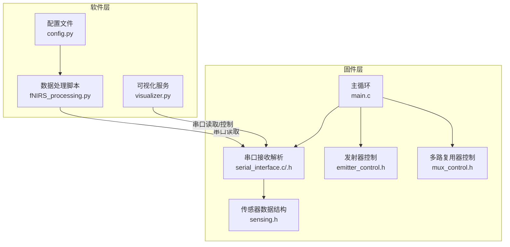
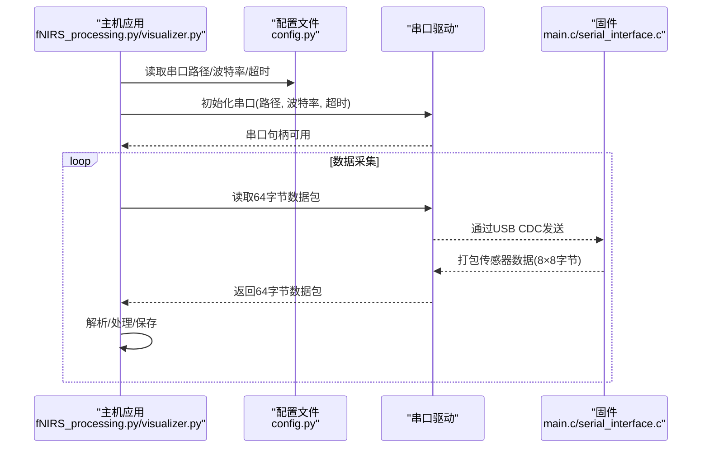
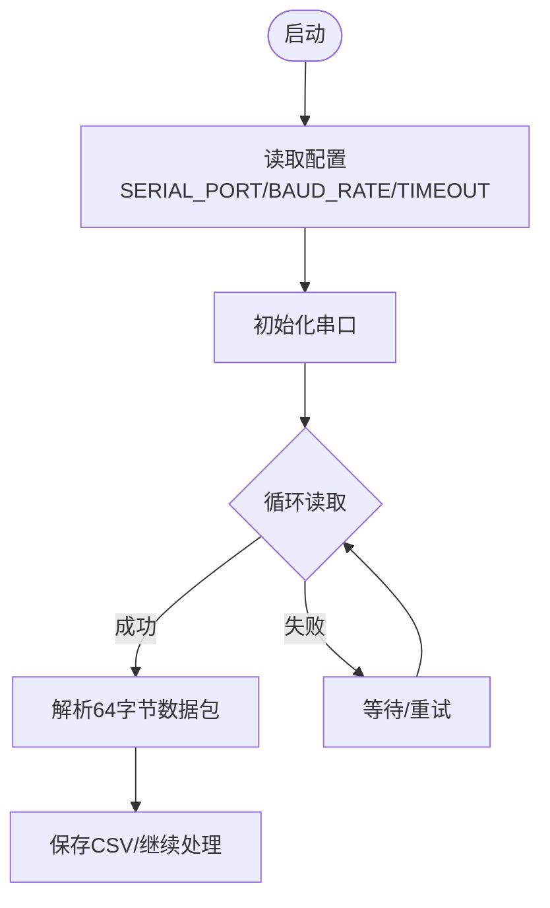
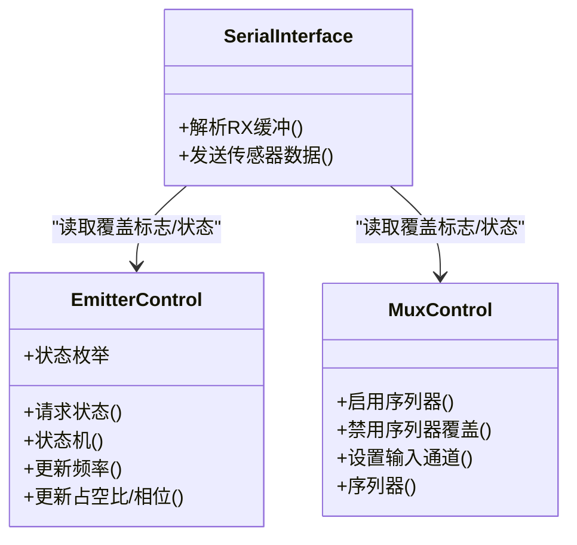
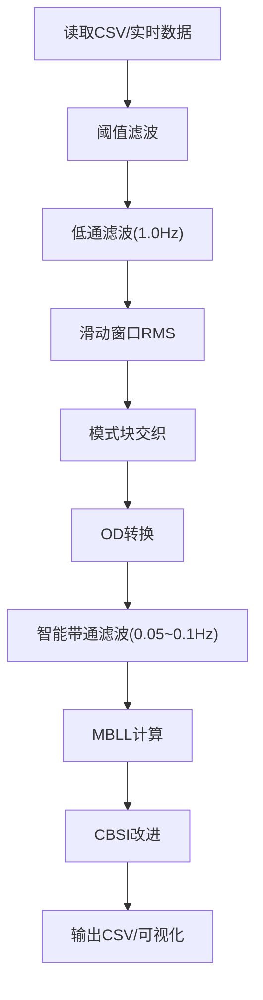
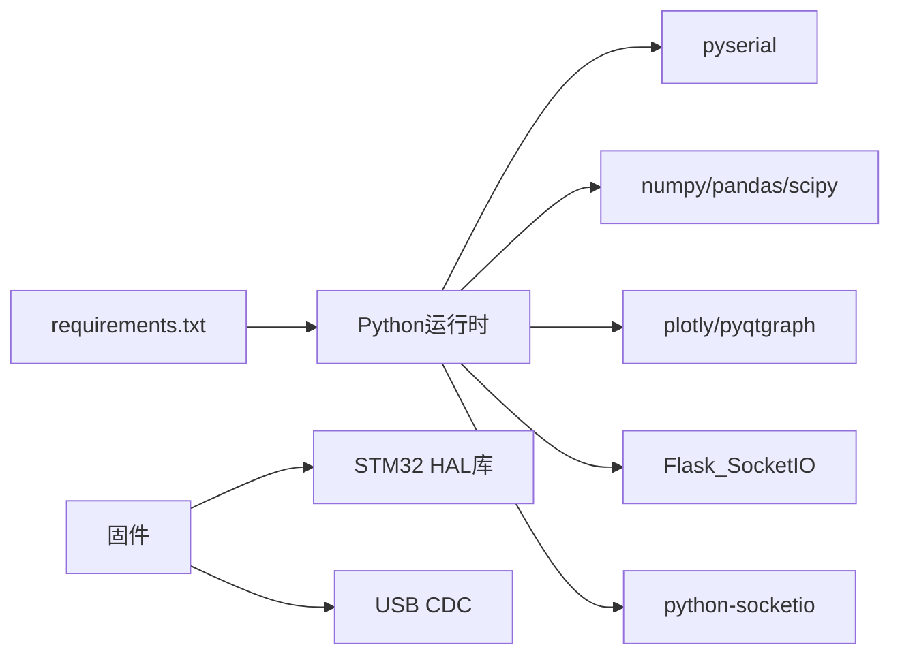

# 配置管理

<cite>
**本文引用的文件**
- [config.py](file://software/config.py)
- [fNIRS_processing.py](file://software/fNIRS_processing.py)
- [main.c](file://firmware/STM32/fNIRS/Core/Inc/main.c)
- [serial_interface.c](file://firmware/STM32/fNIRS/Core/Src/serial_interface.c)
- [serial_interface.h](file://firmware/STM32/fNIRS/Core/Inc/serial_interface.h)
- [emitter_control.h](file://firmware/STM32/fNIRS/Core/Inc/emitter_control.h)
- [mux_control.h](file://firmware/STM32/fNIRS/Core/Inc/mux_control.h)
- [sensing.h](file://firmware/STM32/fNIRS/Core/Inc/sensing.h)
- [README.md](file://software/README.md)
- [firmware/README.md](file://firmware/README.md)
- [fNIRS_processing_文档.md](file://software/fNIRS_processing_文档.md)
- [requirements.txt](file://software/requirements.txt)
</cite>

## 目录
1. [简介](#简介)
2. [项目结构](#项目结构)
3. [核心组件](#核心组件)
4. [架构总览](#架构总览)
5. [详细组件分析](#详细组件分析)
6. [依赖关系分析](#依赖关系分析)
7. [性能考量](#性能考量)
8. [故障排查指南](#故障排查指南)
9. [结论](#结论)
10. [附录](#附录)

## 简介
本文件面向fNIRS配置管理系统，系统由上位机软件与嵌入式固件协同工作：上位机负责串口通信、数据采集与处理；固件负责传感器阵列、LED发射器与多路复用器的硬件控制，并通过USB CDC接口向主机发送64字节数据包。本文档围绕以下主题展开：
- 串行端口设置、波特率与超时参数的设计与管理
- 运行模式配置（发射器控制模式、多路复用器序列器）
- 传感器参数与数据处理选项的配置与默认值
- 配置文件加载机制、参数验证与默认值策略
- 动态更新与热重载机制现状与建议
- 配置备份与恢复方案
- 最佳实践、安全与版本兼容性管理
- 常见配置错误的诊断与解决

## 项目结构
系统采用“软件-固件”双端架构：
- 软件侧：Python脚本负责串口通信、数据采集、处理与可视化
- 固件侧：C语言驱动负责ADC采集、LED发射器与多路复用器控制，并通过USB CDC发送数据包

**图表来源**
- [config.py:1-13](file://software/config.py#L1-L13)
- [fNIRS_processing.py:19-23](file://software/fNIRS_processing.py#L19-L23)
- [main.c:145-178](file://firmware/STM32/fNIRS/Core/Inc/main.c#L145-L178)
- [serial_interface.c:1-82](file://firmware/STM32/fNIRS/Core/Src/serial_interface.c#L1-L82)
- [serial_interface.h:1-64](file://firmware/STM32/fNIRS/Core/Inc/serial_interface.h#L1-L64)
- [emitter_control.h:1-54](file://firmware/STM32/fNIRS/Core/Inc/emitter_control.h#L1-L54)
- [mux_control.h:1-56](file://firmware/STM32/fNIRS/Core/Inc/mux_control.h#L1-L56)
- [sensing.h:1-71](file://firmware/STM32/fNIRS/Core/Inc/sensing.h#L1-L71)

**章节来源**
- [README.md:1-180](file://software/README.md#L1-L180)
- [firmware/README.md:1-17](file://firmware/README.md#L1-L17)

## 核心组件
- 串口配置与通信
  - 软件侧通过配置文件集中定义串口路径、波特率与超时，统一注入到串口初始化与数据读取流程
  - 固件侧通过USART1配置（默认115200波特率）与USB CDC接口进行双向通信
- 控制模式与参数
  - 发射器控制状态机支持多种模式（禁用、空闲、默认、用户控制、循环、仅660nm、仅940nm）
  - 多路复用器支持序列器与覆盖模式，可按通道选择输入
  - 传感器模块结构体维护原始/校准值、温度与缩放偏移等参数
- 数据处理与参数
  - 数据处理脚本提供阈值滤波、低通滤波、滑动窗口RMS、模式块交织、带通滤波、MBLL与CBSI等处理链
  - 处理参数（如带通上下限、滤波阶数、源-探测器距离、年龄等）作为函数参数或默认值存在

**章节来源**
- [config.py:7-12](file://software/config.py#L7-L12)
- [fNIRS_processing.py:19-23](file://software/fNIRS_processing.py#L19-L23)
- [emitter_control.h:13-24](file://firmware/STM32/fNIRS/Core/Inc/emitter_control.h#L13-L24)
- [mux_control.h:21-30](file://firmware/STM32/fNIRS/Core/Inc/mux_control.h#L21-L30)
- [sensing.h:46-61](file://firmware/STM32/fNIRS/Core/Inc/sensing.h#L46-L61)
- [fNIRS_processing_文档.md:383-393](file://software/fNIRS_processing_文档.md#L383-L393)

## 架构总览
系统配置贯穿软硬件两端：
- 软件端：config.py集中管理串口参数；fNIRS_processing.py在启动时读取并建立串口连接；visualizer.py在Web服务中同样使用这些配置
- 固件端：main.c初始化外设并进入主循环；serial_interface.c解析来自USB CDC的控制指令，更新发射器与多路复用器状态；同时将传感器数据打包发送

**图表来源**
- [config.py:7-12](file://software/config.py#L7-L12)
- [fNIRS_processing.py:19-23](file://software/fNIRS_processing.py#L19-L23)
- [serial_interface.c:59-81](file://firmware/STM32/fNIRS/Core/Src/serial_interface.c#L59-L81)
- [main.c:145-178](file://firmware/STM32/fNIRS/Core/Inc/main.c#L145-L178)

## 详细组件分析

### 串行端口与通信配置
- 软件侧配置
  - 串口路径、波特率、超时在配置文件中集中定义，供数据采集与处理脚本导入使用
  - 串口初始化在脚本启动阶段完成，随后持续读取64字节数据包
- 固件侧配置
  - USART1默认配置为115200波特率，支持8位数据、1停止位、无奇偶校验
  - 通过USB CDC接口接收控制命令，解析后更新发射器与多路复用器状态
  - 发送端将8个传感器模块的数据打包为64字节缓冲区并通过CDC发送

**图表来源**
- [config.py:7-12](file://software/config.py#L7-L12)
- [fNIRS_processing.py:19-23](file://software/fNIRS_processing.py#L19-L23)
- [serial_interface.c:59-81](file://firmware/STM32/fNIRS/Core/Src/serial_interface.c#L59-L81)

**章节来源**
- [config.py:7-12](file://software/config.py#L7-L12)
- [fNIRS_processing.py:19-23](file://software/fNIRS_processing.py#L19-L23)
- [main.c:619-648](file://firmware/STM32/fNIRS/Core/Inc/main.c#L619-L648)
- [serial_interface.c:1-82](file://firmware/STM32/fNIRS/Core/Src/serial_interface.c#L1-L82)

### 运行模式配置与动态更新
- 发射器控制模式
  - 状态枚举包含禁用、空闲、默认、用户控制、循环、仅660nm、仅940nm等
  - 主循环根据是否启用用户覆盖决定切换到用户指定状态或回到循环模式
- 多路复用器控制
  - 支持启用/禁用序列器覆盖，允许直接设置当前输入通道
- 动态更新机制
  - 通过USB CDC接收控制命令，实时更新发射器与多路复用器状态
  - 该机制属于“热更新”范畴：无需重启即可改变运行模式

**图表来源**
- [emitter_control.h:13-38](file://firmware/STM32/fNIRS/Core/Inc/emitter_control.h#L13-L38)
- [mux_control.h:32-40](file://firmware/STM32/fNIRS/Core/Inc/mux_control.h#L32-L40)
- [serial_interface.h:40-51](file://firmware/STM32/fNIRS/Core/Inc/serial_interface.h#L40-L51)
- [serial_interface.c:20-57](file://firmware/STM32/fNIRS/Core/Src/serial_interface.c#L20-L57)
- [main.c:152-174](file://firmware/STM32/fNIRS/Core/Inc/main.c#L152-L174)

**章节来源**
- [emitter_control.h:13-38](file://firmware/STM32/fNIRS/Core/Inc/emitter_control.h#L13-L38)
- [mux_control.h:32-40](file://firmware/STM32/fNIRS/Core/Inc/mux_control.h#L32-L40)
- [serial_interface.h:12-51](file://firmware/STM32/fNIRS/Core/Inc/serial_interface.h#L12-L51)
- [serial_interface.c:20-57](file://firmware/STM32/fNIRS/Core/Src/serial_interface.c#L20-L57)
- [main.c:152-174](file://firmware/STM32/fNIRS/Core/Inc/main.c#L152-L174)

### 传感器参数与数据处理选项
- 传感器参数
  - 传感器模块结构体维护原始ADC值、校准值、温度、缩放与偏移等
  - 支持对单个模块的指定通道进行读取与温度更新
- 数据处理选项
  - 处理脚本提供阈值滤波、低通滤波、滑动窗口RMS、模式块交织、带通滤波、MBLL与CBSI等
  - 处理参数（如带通上下限、滤波阶数、源-探测器距离、年龄等）以默认值或函数参数形式提供

**图表来源**
- [fNIRS_processing.py:51-158](file://software/fNIRS_processing.py#L51-L158)
- [fNIRS_processing_文档.md:344-393](file://software/fNIRS_processing_文档.md#L344-L393)

**章节来源**
- [sensing.h:46-61](file://firmware/STM32/fNIRS/Core/Inc/sensing.h#L46-L61)
- [fNIRS_processing.py:51-158](file://software/fNIRS_processing.py#L51-L158)
- [fNIRS_processing_文档.md:383-393](file://software/fNIRS_processing_文档.md#L383-L393)

### 配置文件加载机制、参数验证与默认值
- 加载机制
  - 软件侧通过Python导入配置模块，直接使用常量进行串口初始化
- 参数验证
  - 代码未显式实现参数范围校验；建议在导入配置后增加类型与范围检查
- 默认值策略
  - 串口参数在配置文件中给出默认值；处理参数在处理函数中提供默认值
  - 建议在配置模块中集中声明默认值，便于统一管理与热重载

**章节来源**
- [config.py:7-12](file://software/config.py#L7-L12)
- [fNIRS_processing.py:339-434](file://software/fNIRS_processing.py#L339-L434)

### 动态更新、热重载与备份恢复
- 热重载现状
  - 固件侧通过USB CDC实现运行时模式切换，属于热更新
  - 软件侧未实现配置热重载：需重启应用以应用新的串口参数
- 建议
  - 软件侧增加配置热重载：监听配置变更，重新初始化串口与处理管道
  - 固件侧增加配置持久化接口（如EEPROM/Flash）与恢复流程
- 备份与恢复
  - 建议在配置模块中提供导出/导入函数，支持备份当前配置与恢复历史版本

**章节来源**
- [serial_interface.c:20-57](file://firmware/STM32/fNIRS/Core/Src/serial_interface.c#L20-L57)
- [config.py:7-12](file://software/config.py#L7-L12)

## 依赖关系分析
- 软件依赖
  - 串口通信依赖pyserial；数据处理依赖numpy/pandas/scipy；可视化依赖plotly/pyqtgraph；网络通信依赖Flask_SocketIO/python-socketio
- 固件依赖
  - HAL库提供ADC、I2C、SPI、TIM、UART等外设抽象；USB CDC用于主机通信

**图表来源**
- [requirements.txt:1-15](file://software/requirements.txt#L1-L15)
- [main.c:19-31](file://firmware/STM32/fNIRS/Core/Inc/main.c#L19-L31)

**章节来源**
- [requirements.txt:1-15](file://software/requirements.txt#L1-L15)
- [main.c:19-31](file://firmware/STM32/fNIRS/Core/Inc/main.c#L19-L31)

## 性能考量
- 串口性能
  - 固件侧USART1默认115200波特率，满足64字节/包的实时传输需求
  - 软件侧超时设置影响读取阻塞行为，建议根据USB CDC缓冲与处理延迟调整
- 处理性能
  - 滤波与变换（FFT/滤波器）计算量较大，建议在批处理或异步任务中执行
  - 降采样与零相位滤波可降低计算复杂度，提升实时性

[本节为通用指导，不直接分析具体文件]

## 故障排查指南
- 串口无法打开
  - 检查配置文件中的串口路径是否正确（Windows/macOS/Linux差异）
  - 确认设备未被其他进程占用
- 数据读取异常
  - 检查超时设置是否过小导致频繁超时
  - 确认固件侧USB CDC是否正常接收控制命令并返回数据包
- 模式切换无效
  - 确认是否启用用户覆盖标志
  - 检查控制命令索引与数据格式是否符合serial_interface定义
- 处理结果异常
  - 检查阈值滤波上下限与零电平设置
  - 确认带通滤波参数与采样率一致性

**章节来源**
- [config.py:7-12](file://software/config.py#L7-L12)
- [serial_interface.h:12-38](file://firmware/STM32/fNIRS/Core/Inc/serial_interface.h#L12-L38)
- [serial_interface.c:20-57](file://firmware/STM32/fNIRS/Core/Src/serial_interface.c#L20-L57)
- [fNIRS_processing.py:51-158](file://software/fNIRS_processing.py#L51-L158)

## 结论
本配置管理系统在软硬件两端实现了清晰的职责分离：软件侧集中管理串口参数与数据处理流程，固件侧提供稳定的硬件控制与USB CDC通信。当前系统具备固件侧的热更新能力，但软件侧尚未实现配置热重载。建议引入统一的配置模块与热重载机制，并完善参数验证与备份恢复流程，以提升系统的可维护性与鲁棒性。

[本节为总结性内容，不直接分析具体文件]

## 附录

### 配置最佳实践
- 统一配置管理：将所有默认值集中于配置模块，便于维护与热重载
- 参数验证：在导入配置后进行类型与范围校验，防止非法参数导致运行时错误
- 日志记录：为配置加载与热重载过程添加日志，便于问题定位
- 版本兼容：为配置文件添加版本号字段，升级时进行兼容性检查与迁移

[本节为通用指导，不直接分析具体文件]

### 安全考虑
- 权限控制：限制对配置文件的写权限，防止非授权修改
- 输入校验：对外部输入（如用户覆盖命令）进行严格校验与边界检查
- 通信加密：在需要时对USB CDC通信进行完整性校验（当前为本地通信）

[本节为通用指导，不直接分析具体文件]

### 版本兼容性管理
- 配置版本：在配置模块中加入版本字段，升级时进行迁移
- 向后兼容：新增字段应提供默认值，避免破坏旧配置
- 文档同步：随版本更新配置项说明与默认值

[本节为通用指导，不直接分析具体文件]