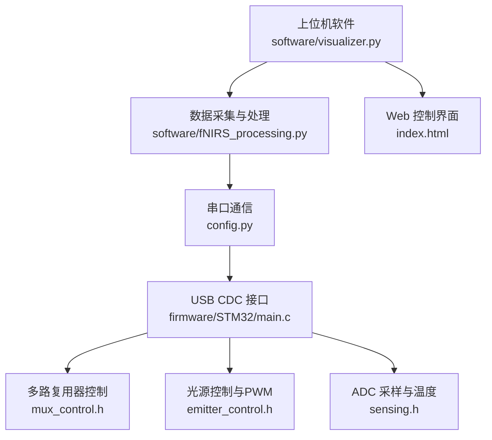
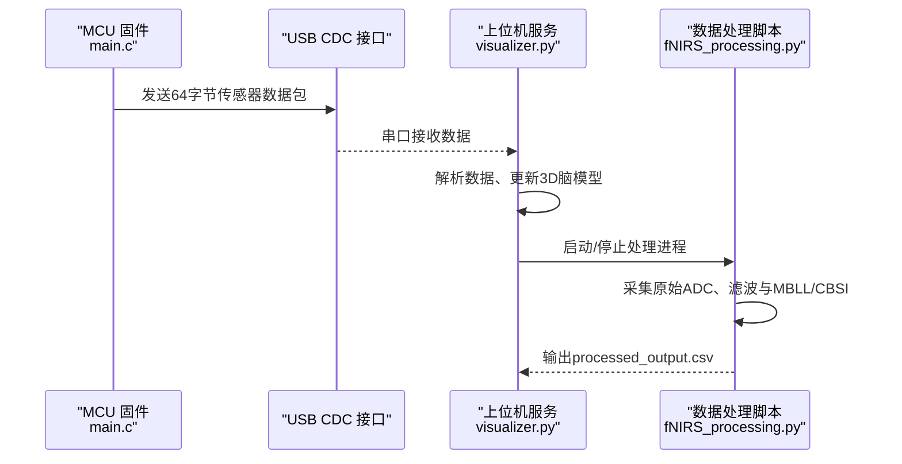
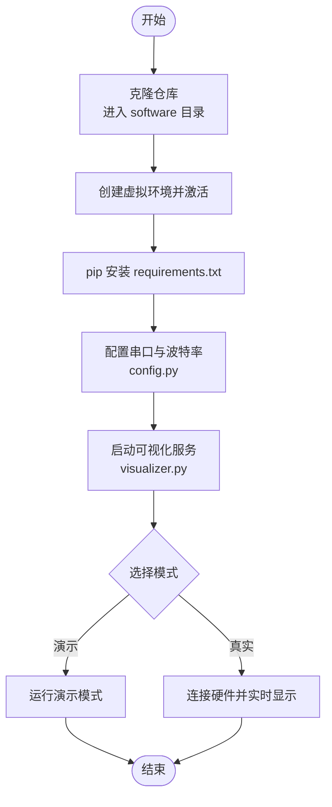
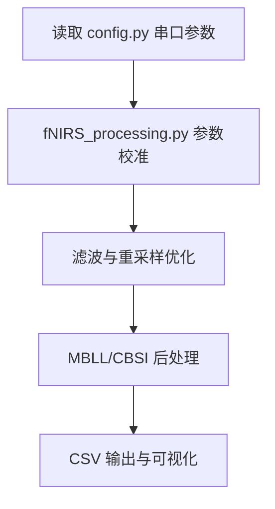
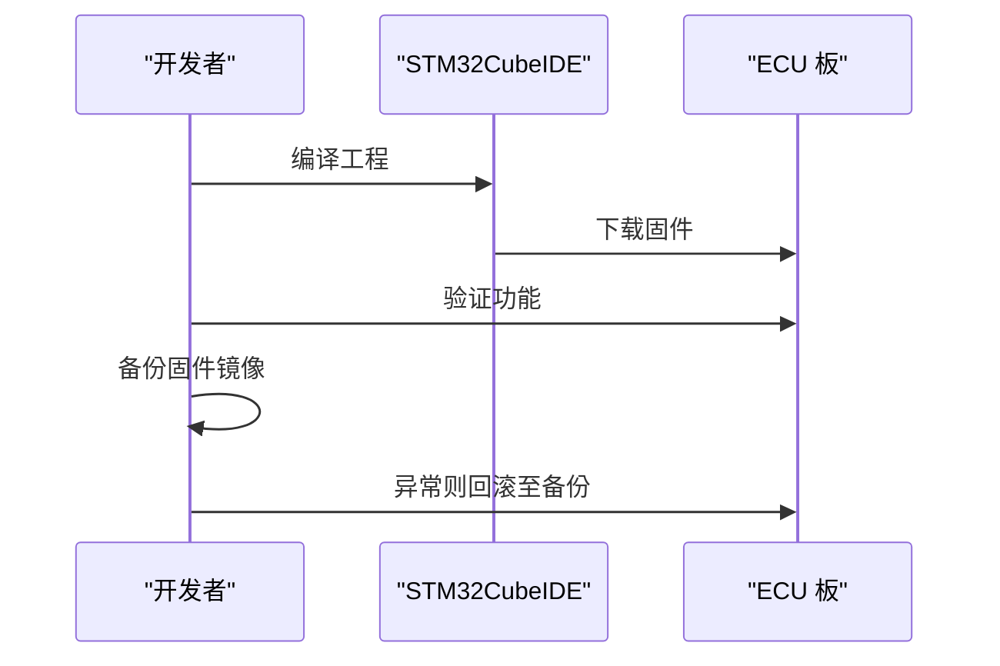
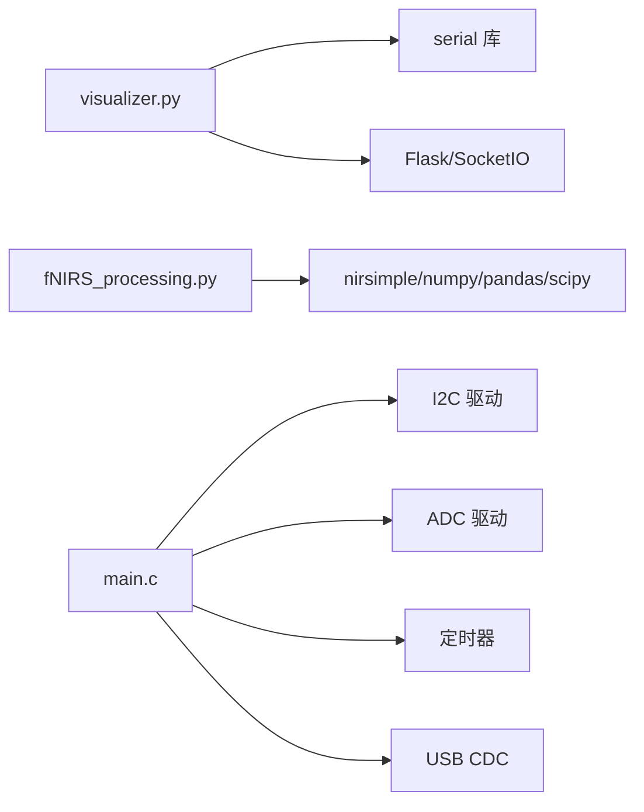

# 部署与维护

<cite>
**本文引用的文件**
- [README.md](file://README.md)
- [software/README.md](file://software/README.md)
- [firmware/README.md](file://firmware/README.md)
- [hardware/README.md](file://hardware/README.md)
- [mechanical/README.md](file://mechanical/README.md)
- [software/config.py](file://software/config.py)
- [software/requirements.txt](file://software/requirements.txt)
- [software/visualizer.py](file://software/visualizer.py)
- [software/fNIRS_processing.py](file://software/fNIRS_processing.py)
- [firmware/STM32/fNIRS/Core/Src/main.c](file://firmware/STM32/fNIRS/Core/Src/main.c)
- [firmware/STM32/fNIRS/Core/Inc/mux_control.h](file://firmware/STM32/fNIRS/Core/Inc/mux_control.h)
- [firmware/STM32/fNIRS/Core/Inc/emitter_control.h](file://firmware/STM32/fNIRS/Core/Inc/emitter_control.h)
- [firmware/STM32/fNIRS/Core/Inc/sensing.h](file://firmware/STM32/fNIRS/Core/Inc/sensing.h)
- [firmware/STM32/fNIRS/Core/Inc/serial_interface.h](file://firmware/STM32/fNIRS/Core/Inc/serial_interface.h)
</cite>

## 目录
1. [简介](#简介)
2. [项目结构](#项目结构)
3. [核心组件](#核心组件)
4. [架构总览](#架构总览)
5. [详细组件分析](#详细组件分析)
6. [依赖关系分析](#依赖关系分析)
7. [性能考虑](#性能考虑)
8. [故障排除指南](#故障排除指南)
9. [结论](#结论)
10. [附录](#附录)

## 简介
本指南面向系统管理员与维护工程师，提供 fNIRS 可穿戴近红外脑功能成像系统的完整部署与维护方案。内容涵盖硬件装配与机械固定、电气连接检查、软件安装与环境配置、系统参数调整与性能优化、固件升级与回滚策略、日常维护与清洁保养、以及长期存储建议。文档同时给出关键流程的时序图与架构图，帮助快速定位问题并进行高效维护。

## 项目结构
仓库采用按“硬件/固件/软件”分层组织，便于跨团队协作与独立开发维护：
- hardware：Altium 设计的原理图与PCB（传感器模块、ECU、线缆总装等）
- firmware：基于 STM32 的嵌入式固件，使用 STM32CubeMX/IDE 工程
- software：Python 图形界面与数据处理服务，提供实时可视化与后处理能力
- docs/mechanical：机械设计说明与装配要点

图表来源
- [software/visualizer.py:593-735](file://software/visualizer.py#L593-L735)
- [software/fNIRS_processing.py:1-40](file://software/fNIRS_processing.py#L1-L40)
- [software/config.py:1-13](file://software/config.py#L1-L13)
- [firmware/STM32/fNIRS/Core/Src/main.c:146-178](file://firmware/STM32/fNIRS/Core/Src/main.c#L146-L178)
- [firmware/STM32/fNIRS/Core/Inc/mux_control.h:42-50](file://firmware/STM32/fNIRS/Core/Inc/mux_control.h#L42-L50)
- [firmware/STM32/fNIRS/Core/Inc/emitter_control.h:40-49](file://firmware/STM32/fNIRS/Core/Inc/emitter_control.h#L40-L49)
- [firmware/STM32/fNIRS/Core/Inc/sensing.h:63-69](file://firmware/STM32/fNIRS/Core/Inc/sensing.h#L63-L69)

章节来源
- [README.md:1-19](file://README.md#L1-L19)
- [software/README.md:1-180](file://software/README.md#L1-L180)
- [firmware/README.md:1-17](file://firmware/README.md#L1-L17)
- [hardware/README.md:1-19](file://hardware/README.md#L1-L19)
- [mechanical/README.md:1-2](file://mechanical/README.md#L1-L2)

## 核心组件
- 上位机可视化与控制服务：提供 Web 界面、实时动画、静态图表与3D脑模型交互，支持两种工作模式（实时ADC与记录并可视化）。
- 数据采集与处理流水线：从串口读取原始ADC包，解析为8通道×3探测器×2波长的数据，执行滤波、插值、MBLL/CBSI等处理，并输出CSV。
- 嵌入式固件：通过I2C驱动多路复用器与LED光源，定时触发ADC采样，通过USB CDC向主机发送64字节传感器数据包。
- 硬件平台：ECU板集成STM32L476、ADC、I2C/I2S/SPI/UART等外设；传感器模块含发射器与探测器，线缆总装确保信号完整性。

章节来源
- [software/README.md:1-180](file://software/README.md#L1-L180)
- [firmware/README.md:1-17](file://firmware/README.md#L1-L17)
- [firmware/STM32/fNIRS/Core/Src/main.c:146-178](file://firmware/STM32/fNIRS/Core/Src/main.c#L146-L178)

## 架构总览
下图展示端到端的数据流：嵌入式固件采集传感器数据并通过USB CDC发送；上位机软件接收数据，进行实时可视化或离线处理。

图表来源
- [firmware/STM32/fNIRS/Core/Src/main.c:146-178](file://firmware/STM32/fNIRS/Core/Src/main.c#L146-L178)
- [software/visualizer.py:648-714](file://software/visualizer.py#L648-L714)
- [software/fNIRS_processing.py:445-496](file://software/fNIRS_processing.py#L445-L496)

## 详细组件分析

### 软件安装与环境配置
- 克隆仓库并进入 software 目录
- 创建虚拟环境并安装依赖
- 配置串口设备路径与波特率
- 运行可视化服务，选择演示模式或真实数据模式

图表来源
- [software/README.md:50-100](file://software/README.md#L50-L100)
- [software/config.py:1-13](file://software/config.py#L1-L13)
- [software/requirements.txt:1-15](file://software/requirements.txt#L1-L15)

章节来源
- [software/README.md:50-100](file://software/README.md#L50-L100)
- [software/config.py:1-13](file://software/config.py#L1-L13)
- [software/requirements.txt:1-15](file://software/requirements.txt#L1-L15)

### 系统参数调整与性能优化
- 串口参数：在 config.py 中设置 SERIAL_PORT、BAUD_RATE、TIMEOUT，确保与硬件一致
- 处理参数：在 fNIRS_processing.py 中可调整带通滤波参数、RMS分段长度、重采样目标频率等
- 可视化参数：在 visualizer.py 中可调整队列大小、更新频率、3D脑模型渲染细节

图表来源
- [software/config.py:7-13](file://software/config.py#L7-L13)
- [software/fNIRS_processing.py:68-158](file://software/fNIRS_processing.py#L68-L158)

章节来源
- [software/config.py:1-13](file://software/config.py#L1-L13)
- [software/fNIRS_processing.py:68-158](file://software/fNIRS_processing.py#L68-L158)

### 固件升级与回滚策略
- 使用 STM32CubeIDE 打开工程，编译并下载固件
- 升级前备份当前固件（可通过调试接口读取Flash镜像）
- 回滚：若新版本异常，重新刷写备份固件
- 版本兼容性：确保上位机软件与固件协议一致（数据包格式、控制字节顺序）

图表来源
- [firmware/README.md:12-17](file://firmware/README.md#L12-L17)
- [firmware/STM32/fNIRS/Core/Src/main.c:118-129](file://firmware/STM32/fNIRS/Core/Src/main.c#L118-L129)

章节来源
- [firmware/README.md:1-17](file://firmware/README.md#L1-L17)
- [firmware/STM32/fNIRS/Core/Src/main.c:118-129](file://firmware/STM32/fNIRS/Core/Src/main.c#L118-L129)

### 日常维护检查清单
- 电气连接：检查USB CDC线缆、串口转接器、电源线与排针连接
- 机械固定：确认传感器模块与ECU连接稳固，线缆走线避免拉扯
- 清洁保养：定期清理光学窗口与电极接触点，防止油脂与汗液影响信号
- 环境测试：在不同温度与湿度条件下验证系统稳定性
- 软件更新：定期同步仓库，更新依赖与配置文件

章节来源
- [software/README.md:1-180](file://software/README.md#L1-L180)
- [firmware/README.md:1-17](file://firmware/README.md#L1-L17)

### 长期存储建议
- 存放于干燥、恒温环境，避免强磁场与静电
- 包装时使用防静电袋，内部放置干燥剂
- 定期通电自检，确保USB CDC与ADC链路正常
- 每6个月进行一次完整的数据采集与处理测试

## 依赖关系分析
- 上位机服务依赖串口库与Web框架，负责接收数据并渲染3D脑模型
- 数据处理脚本依赖科学计算库与外部fNIRS处理库，完成OD转换与MBLL/CBSI
- 固件通过I2C与ADC/TIMER外设协同，定时产生触发信号并发送数据包

图表来源
- [software/visualizer.py:21-34](file://software/visualizer.py#L21-L34)
- [software/fNIRS_processing.py:10-22](file://software/fNIRS_processing.py#L10-L22)
- [firmware/STM32/fNIRS/Core/Src/main.c:24-31](file://firmware/STM32/fNIRS/Core/Src/main.c#L24-L31)

章节来源
- [software/visualizer.py:21-34](file://software/visualizer.py#L21-L34)
- [software/fNIRS_processing.py:10-22](file://software/fNIRS_processing.py#L10-L22)
- [firmware/STM32/fNIRS/Core/Src/main.c:24-31](file://firmware/STM32/fNIRS/Core/Src/main.c#L24-L31)

## 性能考虑
- 采样与触发：合理设置定时器周期与ADC触发源，保证8路传感器同步采样
- 数据传输：USB CDC 速率与上位机串口缓冲区需匹配，避免丢帧
- 实时性：在实时模式下降低图形刷新频率，优先保证数据稳定
- 处理延迟：离线处理阶段可启用多线程/异步事件模型，缩短等待时间

## 故障排除指南
- 无法连接串口
  - 检查设备路径与权限（Windows使用设备管理器识别COM端口；Linux/macOS使用/dev/tty.*）
  - 在 config.py 中核对 SERIAL_PORT 与 BAUD_RATE
- 数据为空或乱码
  - 确认固件已正确烧录且USB CDC可用
  - 检查线缆与连接器是否松动
- 3D脑模型不更新
  - 确认已启动数据采集或演示模式
  - 查看日志输出，确认收到数据包并解析成功
- 处理过程卡顿
  - 降低实时绘图刷新频率
  - 检查CPU占用与内存使用情况
  - 适当增大串口超时与缓冲区容量

章节来源
- [software/README.md:65-100](file://software/README.md#L65-L100)
- [software/visualizer.py:48-50](file://software/visualizer.py#L48-L50)
- [software/fNIRS_processing.py:23-37](file://software/fNIRS_processing.py#L23-L37)

## 结论
本指南提供了从硬件装配到软件部署、从日常维护到故障排除的全生命周期运维方案。遵循本文档的流程与最佳实践，可显著提升系统的稳定性与可维护性，保障fNIRS设备在教育、科研与个人健康监测场景中的可靠运行。

## 附录
- 硬件项目一览（来自硬件目录说明）
  - DetectorOptode：仅含探测器的传感器PCB
  - STLINK_Breakout：STLINK/NUCLEO编程转接板
  - SourceOptode：仅含发射器的传感器PCB
  - fNIRS_CableAssembly：最终产品使用的线缆总装
  - fNIRS_ECU：整机电气控制单元PCB
  - fNIRS_sensor_module：含发射器与探测器的主传感器PCB

章节来源
- [hardware/README.md:7-15](file://hardware/README.md#L7-L15)