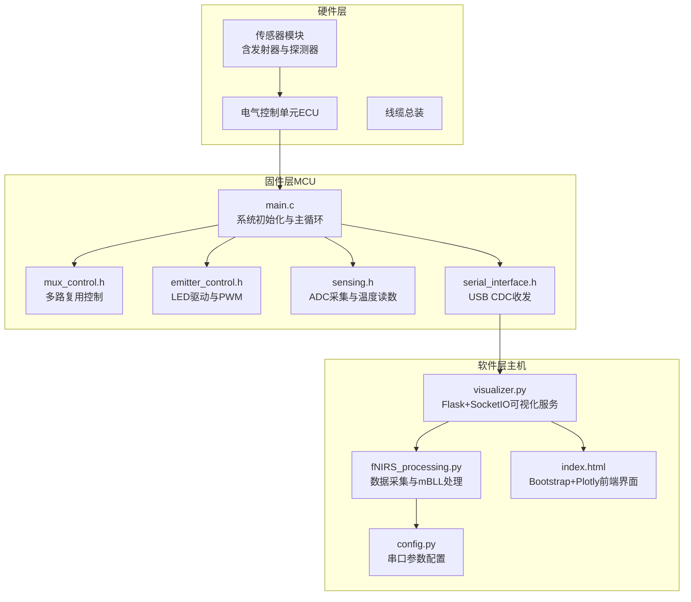
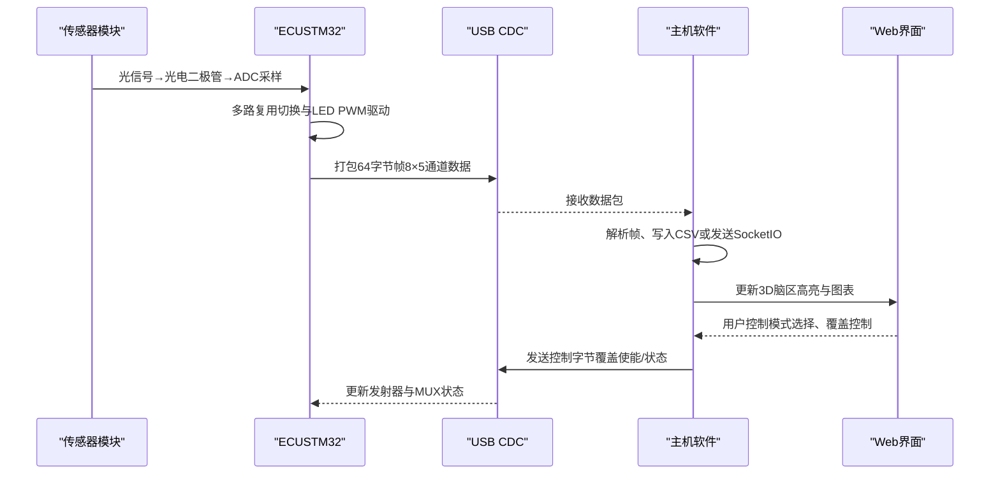
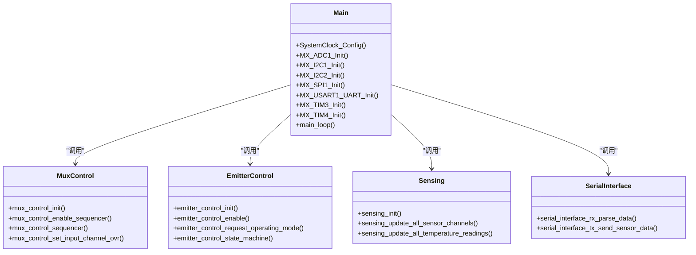
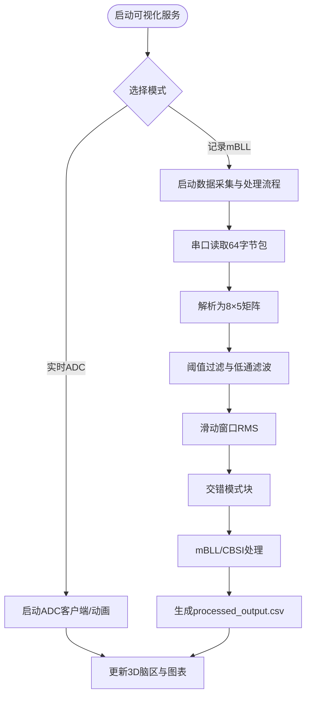
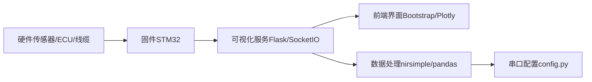

# 项目概述

<cite>
**本文引用的文件**
- [根目录说明](file://README.md)
- [固件主程序](file://firmware/STM32/fNIRS/Core/Src/main.c)
- [固件主头文件](file://firmware/STM32/fNIRS/Core/Inc/main.h)
- [多路复用器控制接口](file://firmware/STM32/fNIRS/Core/Inc/mux_control.h)
- [光源控制接口](file://firmware/STM32/fNIRS/Core/Inc/emitter_control.h)
- [传感采集接口](file://firmware/STM32/fNIRS/Core/Inc/sensing.h)
- [串口通信接口](file://firmware/STM32/fNIRS/Core/Inc/serial_interface.h)
- [软件设计说明](file://software/README.md)
- [fNIRS数据处理脚本](file://software/fNIRS_processing.py)
- [可视化服务器](file://software/visualizer.py)
- [配置文件](file://software/config.py)
- [硬件设计说明](file://hardware/README.md)
- [机械设计说明](file://mechanical/README.md)
- [前端界面](file://software/index.html)
- [依赖清单](file://software/requirements.txt)
- [绘图演示脚本](file://software/testing-scripts/plot.py)
</cite>

## 目录
1. [引言](#引言)
2. [项目结构](#项目结构)
3. [核心组件](#核心组件)
4. [架构总览](#架构总览)
5. [详细组件分析](#详细组件分析)
6. [依赖关系分析](#依赖关系分析)
7. [性能考量](#性能考量)
8. [故障排查指南](#故障排查指南)
9. [结论](#结论)
10. [附录](#附录)

## 引言
本项目是一个基于功能近红外光谱（fNIRS）的可穿戴脑机接口系统，旨在实现低成本、人体工学友好且具备实时监测能力的脑活动测量设备。项目通过硬件传感器模块、固件控制逻辑与软件可视化平台的协同工作，提供从原始ADC数据到经修正比尔-朗伯定律（mBLL）处理结果的完整链路，并支持交互式3D脑区映射展示。

项目核心亮点：
- 24通道传感器阵列（8个发射器组，每组3个探测器），双波长（660 nm/940 nm）同步采集
- 基于低功耗STM32微控制器的电气控制单元（ECU），负责多路复用、LED驱动与ADC采集
- 人体工学机械设计，确保长时间佩戴的稳定性和舒适性
- Python驱动的图形化界面，支持实时数据可视化、记录与后处理

章节来源
- [根目录说明:1-19](file://README.md#L1-L19)

## 项目结构
项目采用分层组织方式，分为硬件、固件与软件三层：
- 硬件层：Altium设计的PCB与连接器，包含传感器模块、ECU、线缆总装等
- 固件层：STM32微控制器上的嵌入式C代码，负责时序控制、I/O扩展、ADC采集与USB CDC通信
- 软件层：Python生态的可视化与处理工具，提供Web界面、实时动画、静态图表与CSV导出

图表来源
- [固件主程序:92-181](file://firmware/STM32/fNIRS/Core/Src/main.c#L92-L181)
- [多路复用器控制接口:43-50](file://firmware/STM32/fNIRS/Core/Inc/mux_control.h#L43-L50)
- [光源控制接口:41-48](file://firmware/STM32/fNIRS/Core/Inc/emitter_control.h#L41-L48)
- [传感采集接口:64-69](file://firmware/STM32/fNIRS/Core/Inc/sensing.h#L64-L69)
- [串口通信接口:55-61](file://firmware/STM32/fNIRS/Core/Inc/serial_interface.h#L55-L61)
- [可视化服务器:593-619](file://software/visualizer.py#L593-L619)
- [fNIRS数据处理脚本:187-235](file://software/fNIRS_processing.py#L187-L235)
- [前端界面:1-750](file://software/index.html#L1-L750)
- [配置文件:7-12](file://software/config.py#L7-L12)

章节来源
- [硬件设计说明:1-19](file://hardware/README.md#L1-L19)
- [软件设计说明:1-180](file://software/README.md#L1-L180)

## 核心组件
- 硬件设计：Altium设计的传感器模块、ECU、线缆总装与STLINK转接板，支撑24通道光学信号采集与电气控制
- 固件开发：围绕STM32L476RET6的嵌入式控制，包含I2C扩展、ADC DMA、定时器触发、USB CDC通信与状态机控制
- 软件应用：基于Flask/SocketIO的Web可视化平台，支持实时ADC与mBLL数据展示、3D脑区映射、CSV下载与演示模式

章节来源
- [硬件设计说明:7-14](file://hardware/README.md#L7-L14)
- [固件主程序:118-181](file://firmware/STM32/fNIRS/Core/Src/main.c#L118-L181)
- [软件设计说明:3-47](file://software/README.md#L3-L47)

## 架构总览
系统采用“硬件-固件-软件”三级架构，数据流从传感器模块经ECU采集与处理，通过USB CDC传输至主机，再由软件进行可视化与后处理。

图表来源
- [固件主程序:146-178](file://firmware/STM32/fNIRS/Core/Src/main.c#L146-L178)
- [串口通信接口:55-61](file://firmware/STM32/fNIRS/Core/Inc/serial_interface.h#L55-L61)
- [可视化服务器:648-690](file://software/visualizer.py#L648-L690)
- [前端界面:492-513](file://software/index.html#L492-L513)

## 详细组件分析

### 硬件设计
- 传感器模块：每个模块包含多个探测器与发射器，形成8组传感器组，每组3个探测器，共24个物理通道
- ECU板：集成I2C扩展、ADC、PWM驱动、USB CDC与GPIO，负责同步控制与数据采集
- 线缆总装：连接各模块与ECU，确保信号完整性与机械稳定性

章节来源
- [硬件设计说明:7-14](file://hardware/README.md#L7-L14)

### 固件开发（STM32嵌入式）
- 初始化与外设配置：系统时钟、ADC多通道扫描、DMA、I2C、SPI、UART与USB设备库初始化
- 控制子系统：
  - 多路复用器控制：I2C扩展器驱动，按序轮询输入通道
  - 光源控制：PWM驱动与状态机，支持默认模式、用户覆盖与波长选择
  - 传感采集：ADC DMA采集8路传感器通道，同时支持温度读数
- 通信接口：USB CDC接收上位机控制指令，解析并更新发射器与MUX状态；周期性打包传感器数据发送

图表来源
- [固件主程序:67-81](file://firmware/STM32/fNIRS/Core/Src/main.c#L67-L81)
- [多路复用器控制接口:43-50](file://firmware/STM32/fNIRS/Core/Inc/mux_control.h#L43-L50)
- [光源控制接口:41-48](file://firmware/STM32/fNIRS/Core/Inc/emitter_control.h#L41-L48)
- [传感采集接口:64-69](file://firmware/STM32/fNIRS/Core/Inc/sensing.h#L64-L69)
- [串口通信接口:55-61](file://firmware/STM32/fNIRS/Core/Inc/serial_interface.h#L55-L61)

章节来源
- [固件主程序:118-181](file://firmware/STM32/fNIRS/Core/Src/main.c#L118-L181)
- [固件主头文件:60-69](file://firmware/STM32/fNIRS/Core/Inc/main.h#L60-L69)

### 软件应用（Python）
- 可视化与控制：Flask+SocketIO提供Web界面，支持模式切换（实时/记录）、传感器组高亮、3D脑区映射与下载CSV
- 数据处理：串口采集原始ADC数据，进行阈值过滤、滑动窗口RMS、模式块交错与mBLL/CBSI处理，输出浓度变化CSV
- 演示模式：无需真实硬件即可运行模拟数据，便于教学与演示

图表来源
- [软件设计说明:5-47](file://software/README.md#L5-L47)
- [fNIRS数据处理脚本:187-235](file://software/fNIRS_processing.py#L187-L235)
- [fNIRS数据处理脚本:445-496](file://software/fNIRS_processing.py#L445-L496)
- [可视化服务器:648-714](file://software/visualizer.py#L648-L714)
- [前端界面:632-723](file://software/index.html#L632-L723)

章节来源
- [软件设计说明:3-180](file://software/README.md#L3-L180)
- [可视化服务器:117-119](file://software/visualizer.py#L117-L119)
- [fNIRS数据处理脚本:1-496](file://software/fNIRS_processing.py#L1-L496)
- [前端界面:1-750](file://software/index.html#L1-L750)

## 依赖关系分析
- 硬件依赖：传感器模块与ECU通过I2C与ADC连接，ECU通过USB CDC与主机通信
- 固件依赖：主程序依赖多路复用、光源控制、传感采集与串口接口模块
- 软件依赖：可视化服务依赖Flask、SocketIO、Plotly、PyQt5/Graph与nirsimple等库

图表来源
- [固件主程序:118-181](file://firmware/STM32/fNIRS/Core/Src/main.c#L118-L181)
- [可视化服务器:54-56](file://software/visualizer.py#L54-L56)
- [依赖清单:1-15](file://software/requirements.txt#L1-L15)
- [配置文件:7-12](file://software/config.py#L7-L12)

章节来源
- [依赖清单:1-15](file://software/requirements.txt#L1-L15)

## 性能考量
- 实时性：固件通过定时器与DMA实现高吞吐ADC采集与稳定的数据帧发送；软件侧采用事件驱动（eventlet）与SocketIO降低延迟
- 数据完整性：64字节固定帧格式保证解析一致性；阈值过滤与带通滤波减少噪声影响
- 可扩展性：模块化接口（多路复用、光源控制、串口）便于功能扩展与调试

## 故障排查指南
- 串口连接问题：检查config.py中的串口号与波特率设置；确认设备已正确安装驱动
- 数据无响应：确认固件主循环中多路复用与光源控制已启用；检查USB CDC是否正常收发
- Web界面无法加载：确认Flask服务端口未被占用；浏览器控制台查看SocketIO连接状态
- 处理异常：核对CSV列名与时间戳；检查滤波与mBLL参数设置

章节来源
- [配置文件:7-12](file://software/config.py#L7-L12)
- [可视化服务器:593-619](file://software/visualizer.py#L593-L619)
- [fNIRS数据处理脚本:187-235](file://software/fNIRS_processing.py#L187-L235)

## 结论
本项目以低成本、人体工学与实时监测为核心目标，构建了从硬件到固件再到软件的完整链路。通过模块化的控制与处理流程，系统能够稳定地采集与展示fNIRS数据，并提供直观的3D脑区映射与交互式可视化体验。该架构既适合教学演示，也可作为个人健康监测与便携研究的基础平台。

## 附录
- 技术背景：fNIRS基于近红外光谱对脑部血氧变化进行非侵入式监测，结合修正比尔-朗伯定律可估算脱氧血红蛋白与氧合血红蛋白浓度变化
- 应用场景：教育实验、个人健康追踪、认知任务研究、康复训练监测等